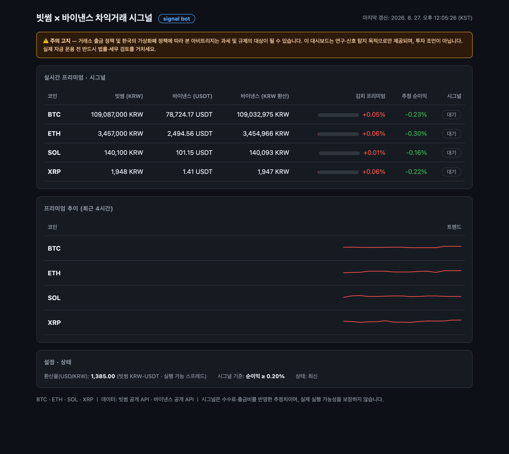

# BTC-Arbitrage-for-Bithumb

> 프로젝트 루트. 작업 시 이 파일을 먼저 읽고 규칙을 지킬 것.
> 문서: [`readme.md`](./readme.md) · [`docs/ARBITRAGE-SITUATION.md`](./docs/ARBITRAGE-SITUATION.md) · [`docs/TEST-SCENARIOS.md`](./docs/TEST-SCENARIOS.md) · [`docs/DEVELOPMENT-PLAN.md`](./docs/DEVELOPMENT-PLAN.md)
> (README 는 `readme.md` 하나뿐이다 — macOS 는 대소문자를 구분하지 않으므로 `README.md` 를 따로 만들지 말 것)

## 목표
빗썸(KRW)과 바이낸스(USDT)의 가격 차이(김치 프리미엄)를 비교해 차익거래 시그널을 알려주는 서버리스 시그널 봇.
Cloudflare Workers(5분 크론) + 정적 대시보드 + 텔레그램 알림. **자동 매매는 하지 않음.**



## 스택 (아키텍처 결정 2026-08-27)
- **단일 Cloudflare Worker**: 크론(`*/5 * * * *`) + `/api/*` JSON API + 정적 자산(`worker/static/`)을 한 앱으로 배포
- **Cloudflare KV** (`ARB_DATA`): 스냅샷 최신본·히스토리(48개)·코인별 알림 상태 저장
- **공개 API만 사용** (키 불필요): 빗썸 `/v1/ticker`, 바이낸스 `/api/v3/ticker/price`(+`data-api.binance.vision` 폴백), 환산율(`FX_MODE` 로 빗썸 `KRW-USDT` ↔ 두나무 선택, 나머지는 폴백)
- **환산율 기준(`FX_MODE`)이 시그널의 의미를 바꾼다**: `usdt`(기본)는 USDT 프리미엄이 상쇄된 **실행 가능 스프레드**(실측 ±0.1%), `fx`는 USDT 프리미엄을 포함한 **헤드라인 김프**
- **판정 기준은 basis 를 따른다**: `usdt`→`net`(순이익 ≥ 0.2%, 0 이 손익분기) · `fx`→`premium`(절댓값 ≥ 1.5%). 임계값 기본값도 basis 를 따라 자동 전환된다
- **시크릿**: `TELEGRAM_BOT_TOKEN`·`TELEGRAM_CHAT_ID`·`ADMIN_TOKEN` — 코드/레포 커밋 금지. 로컬은 `.dev.vars`, 배포는 `wrangler secret put`
- **시그널 엔진은 순수 함수** (`worker/src/signals.ts`): 외부 의존성 없이 테스트

## 절대 규칙
1. **시그널은 수수료·출금비 반영 추정치**. 실제 실행 가능성·슬리피지를 보장하지 않는다고 명시
2. **과세·규제 고지 필수** — README·대시보드에 주의 고지 표시. 자동 매매·자동 출금 기능 추가 금지(연구 목적 유지)
3. **API 키 하드코딩·커밋 금지**. 시크릿은 `Env` 인터페이스에 optional(`?`)로 선언 → 키 없이도 빌드·테스트 가능
4. **미리 계산·저장 후 읽기**: 크론이 KV에 저장, `/api/*`는 연산 없이 KV만 읽음 + 엣지 캐시
5. **판정은 "방향 = 프리미엄 부호 / 발동 = basis 값 크기"로 분리**한다. 둘을 프리미엄 하나로 섞으면 비용도 못 넘는 갭이 신호가 되고 진짜 기회는 놓친다
6. **basis 는 요청한 `FX_MODE` 가 아니라 실제 받아온 환산율 출처를 따른다**(`configForFxSource`). 폴백이 나면 임계값도 함께 되돌린다 — 안 그러면 시그널이 영원히 발생하지 않는다
7. **신호 알림 스팸 방지**: 히스테리시스 + 코인별 쿨다운(30분) 로직을 유지.
   `lastAlertAt` 은 **텔레그램 발송에 성공한 경우에만** 갱신한다(`markAlertSent`) — 갱신을 빠뜨리면 쿨다운이 통째로 죽는다
8. **순이익은 `|프리미엄|` 기준**: 차익거래는 방향과 무관하게 절댓값만큼 먹는 구조라 부호를 그대로 두면 역방향이 손실처럼 보인다
9. **KV 는 JSON**: `NaN` 을 저장할 수 없으므로 값 없음은 처음부터 `null`(`MaybeNumber`)로 표현한다
10. **KV 쓰기 예산**: 무료 플랜 1,000 write/일 · 5분 크론 = 288 스캔/일. 스캔당 쓰기는 스냅샷+히스토리 2회로 유지하고 알림 상태는 변경 시에만 쓴다
11. **관리 API 는 `Authorization: Bearer` 우선**. 쿼리스트링 토큰은 로그·히스토리에 남으므로 하위 호환용으로만 유지. 비교는 상수 시간, 오류·관리 응답은 `no-store`
12. **공개 시세는 폴백 필수**: 지역 차단·일시 장애 견딜 수 있게 이중 경로 + 8초 타임아웃. 한 코인이 빠져도 나머지 스캔은 계속한다
13. 한국어 UI 기본. 등락색은 한국식(적=상승 프리미엄, 청=하락 프리미엄)

## 디렉터리
```
worker/src/          Worker 코드 (index·api·scan·signals·config·storage·alerts·env·types·providers)
worker/src/providers/  bithumb·binance·fx + http (공용 타임아웃·UA 래퍼)
worker/static/       정적 대시보드 (index.html + app.js)
test/                vitest 테스트 (node env, 네트워크는 mock)
docs/                ARBITRAGE-SITUATION(실측 상황)·TEST-SCENARIOS(테스트 목록)·DEVELOPMENT-PLAN
                     assets/dashboard.png = 대시보드 스크린샷
wrangler.jsonc       Workers 설정 (크론·KV·정적 자산·vars)
```

## 참조
- 빗썸 Open API: https://apidocs.bithumb.com/reference/현재가-조회 (Public API 분류당 150 req/s)
- bithumb-ai-trade-kit: https://github.com/bithumb-official/bithumb-ai-trade-kit
- 바이낸스 Market Data: https://developers.binance.com/docs/binance-spot-api-docs/rest-api/market-data-endpoints

## 로컬 개발/검증
Cloudflare 계정 없이도 빌드·테스트 가능. 공개 API는 실데이터로 동작.
```bash
npm install
cp .dev.vars.example .dev.vars     # 텔레그램 토큰 등 (선택)
npm run dev                        # wrangler dev --test-scheduled
npm test                           # vitest (66 tests)
npm run typecheck                  # tsc --noEmit
# 수동 스캔: curl -H "Authorization: Bearer <ADMIN_TOKEN>" "http://localhost:8787/api/refresh"
# 크론 테스트: curl "http://localhost:8787/__scheduled?cron=*/5+*+*+*+*"
```
배포: `wrangler kv namespace create ARB_DATA` → `wrangler.jsonc`에 id 입력 → `wrangler secret put ...` → `npm run deploy`.
