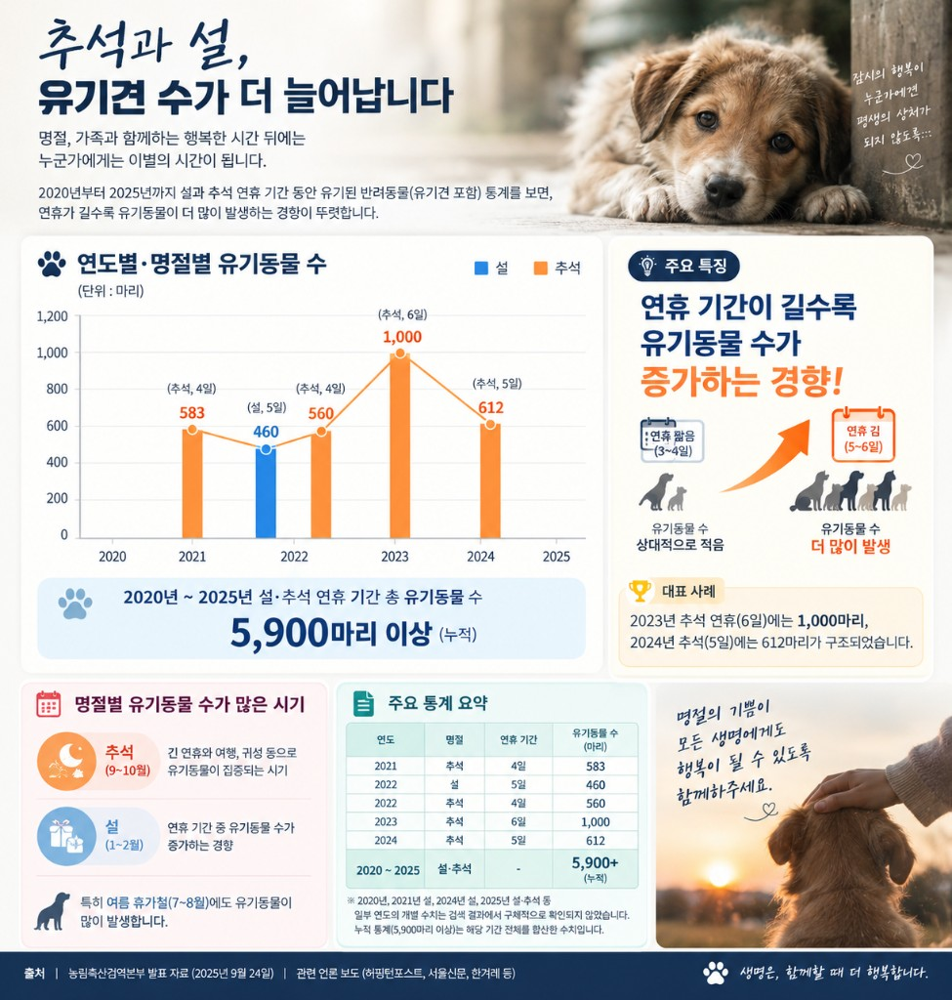

<!--
---
title: "추석 연휴가 길수록 유기견이 늘어난다"
title_en: "Longer Chuseok Holidays, More Abandoned Dogs"
subtitle: "행동경제학·사회학·정책학으로 읽는 '여행 욕구 vs 위탁 비용' — 프랑스와 한국의 제도 비교"
description: "설·추석 유기 5,900마리+와 연휴 길이 상관. 행동편향·1인가구 취약성·등록제 실효성. 프랑스 8일 반환·7일 숙려 vs 한국 공고·10일. 1·3·5년 로드맵. 투자 권유 아님."
abstract: |
  Korean policy/behavioral column on holiday pet abandonment (not investment advice), updated 2026-09-17.
  Quarantine Agency media tally: 5,900+ pets over Seollal/Chuseok 2020–2025; longer holidays associate with higher counts (observational, not RCTs).
  Lenses: behavioral econ + socioeconomic vulnerability + institutional failure (weak registration, thin temporary boarding).
  France: fourrière 8-day reclaim, 2021 law 7-day cooling-off; SPA appointment surrender; OCAD ~200k/year intakes persist.
  Roadmap: 1y public holiday boarding pilots; 3y care-plan + RFID 70%; 5y 50% peak-rate cut target with fiscal premises.
summary_for_ai: |
  Korean society/policy column (not investment advice), 2026-09-17, group industry, Abandoned-Dog/Abandoned-Dog-Holiday-Issue.
  Avoid moral blame; reframe as choice architecture + welfare state capacity. Correlation ≠ causation on holiday length.
  Refs: Thaler & Sunstein Nudge; Kahneman Thinking Fast and Slow; France agriculture ministry / SPA / 2021 animal cruelty law; Korea Animal Protection Act notice 7d / ownership 10d; APMS / KREI / Seoul Institute style sources.
date: 2026-09-17
updated: 2026-09-17
author: "김호광 (Dennis Kim)"
lang: ko
tags:
  - 유기견
  - 추석
  - 반려동물
  - 행동경제학
  - 사회학
  - 정책
  - 넛지
  - RFID
  - 1인가구
keywords:
  - "유기견"
  - "추석 연휴"
  - "반려동물 유기"
  - "애견호텔 비용"
  - "프랑스 바캉스 유기"
  - "동물등록 RFID"
  - "임시보호"
  - "원룸촌"
  - "동물보호법"
group: industry
featured: true
featured_rank: -5
og_image: "https://vibequant.cc/og/abandoned-dog-holiday-issue.jpg"
image: "https://vibequant.cc/og/abandoned-dog-holiday-issue.jpg"
schema_type: BlogPosting
draft: false
robots: index,follow
---
-->

# 추석 연휴가 길수록 유기견이 늘어난다

## 행동경제학·사회학·정책학으로 읽는 '여행 욕구 vs 위탁 비용' — 프랑스와 한국의 제도 비교

명절은 사람에게 가족간 '**만남**'의 시간이다. 어떤 반려동물에게는 '**이별**'의 시간이다. 농림축산검역본부 자료를 바탕으로 한 집계(2025년 9월 24일 관련 보도)에 따르면, **2020년부터 2025년까지 설·추석 연휴 기간에 유기된 반려동물이 5,900마리 이상**이다. 그리고 그 숫자 안에 뚜렷한 규칙이 하나 있다. **연휴가 길수록 유기동물 수가 커지는 경향**이 관측된다는 것이다.

2023년 추석 연휴는 6일이었다. 그해 구조·집계된 유기동물은 **약 1,000마리**. 이듬해 추석(5일)은 612마리였다. 4일짜리 추석(2021년 583, 2022년 560)보다 긴 연휴가 더 많은 동물 유기가 발생한다. 

이를 "사람들이 갑자기 나빠졌다"로 읽기에는 여러 복합적인 요인으로 살펴봐야 한다. 이 칼럼은 그 대신 **선택 구조·사회경제적 취약성·제도의 빈자리**를 함께 볼 거이다. 유기견 문제를 도덕적 비난이 아니라 **제도 설계의 문제**로 재구성하려는 시도를 해야 한다.

## 1. 숫자가 말하는 것 — 그리고 말하지 않는 것

| 연도 | 명절 | 연휴 기간 | 유기동물 수 (마리) |
| --- | --- | --- | --- |
| 2021 | 추석 | 4일 | 583 |
| 2022 | 설 | 5일 | 460 |
| 2022 | 추석 | 4일 | 560 |
| 2023 | 추석 | 6일 | 1,000 |
| 2024 | 추석 | 5일 | 612 |
| 2020–2025 | 설·추석 | — | **5,900+ (누적)** |

*출처: 농림축산검역본부 발표를 인용한 언론 보도(허핑턴포스트·서울신문·한겨레 등, 2025.9.24 전후). 일부 연도의 개별 수치는 공개 보도에서 확인되지 않으며, 누적 5,900마리는 해당 기간 합산 수치다.*

### 1-1. 상관은 보이지만, 인과는 아직 가설이다

위 표만으로 "연휴 길이 → 유기 증가"를 **인과법칙으로 확정할 수는 없다.** 표본이 적고, 연도별 신고·구조 역량, 날씨, 코로나 이후 입양 붐의 시차, 언론·지자체 단속 강도가 교란변수로 작용할 수 있다. 

다만 다음 패턴은 뚜렷하다.

(1) 긴 연휴에서 봉우리가 반복적으로 커지고, 

(2) 설·추석뿐 아니라 **여름 휴가철(7–8월)** 에도 유기가 집중되며, 

(3) 프랑스 바캉스 철에서도 같은 계절 피크가 관측된다는 점은, **이동·돌봄 공백이 길어질수록 실패 확률이 커진다**는 작업가설을 뒷받침한다. 엄밀한 검증은 APMS 일자별·시군구별 패널로 연휴 길이·위탁 가격·소득을 통제하는 정밀한 데이터 분석과 회귀가 필요하다. 이 칼럼은 그 전 단계의 **정책 해석**에 집중하고자 한다.

유기동물은 설·추석뿐 아니라 여름에도 몰린다. 즉 '명절만의 한국적 특수'가 아니라, **이동·공백·돌봄 공백이 길어지는 계절**에 반복되는 글로벌 패턴이다.

## 2. 프랑스 바캉스- 같은 방정식, 다른 제도

프랑스에서는 매년 7–8월 피서철이 되면 보호소·사설 포획장(fourrière)이 포화한다. SPA는 여름마다 긴급 호소를 내고, 2023년 한 여름에만 수만 마리를 구조했다고 밝혔다. 2026년 여름 SPA 네트워크 입소는 약 9,500마리(전년비 +20%대)로 자체 집계됐다. 프랑스 농무부가 인용하는 OCAD·CNR BEA 계열 추산에 따르면, 유기·유실을 엄밀히 나누기 어렵더라도 **연간 약 20만 마리**가 보호·구조 체계로 유입된다는 규모감이 반복된다. **처벌과 캠페인만으로 피크가 사라지지 않았다는 사실** 자체가 중요한 정책 데이터다.

한국 추석과 프랑스 8월은 달력만 다를 뿐, 개인의 순간 선택 구조는 닮아 있다.

1. **이동의 효용**이 급등한다 (고향, 해변, 가족 모임).
2. **데려가거나 맡기는 비용**이 동시에 급등한다 (요금·예약 마감·공간 제약).
3. 그 격차가 커질수록, 일부 보호자는 동물을 **일시적 장애물**로 재분류한다.

보호소 관계자들이 반복해서 말하는 말도 같다. 아무도 "**휴가 가려고 버립니다**"라고 말하지 않는다. 질병, 이사, 아파트 규정, 가족 사정 같은 **사회적 정당화 언어**가 앞에 선다.

### 2-1. 프랑스의 제도 장치 — '유료 유기' 신화와 실제

흔히 "프랑스는 보호소에 돈을 내고 정식으로 맡긴다"고 요약되지만, 현실을 조금 더 정확히 적을 필요가 있다.

| 제도 | 프랑스 | 한국 (동물보호법 요지) |
| --- | --- | --- |
| 도로·방치형 유기 | 학대와 동일 선상에서 처벌 (징역·벌금, 사망 시 가중) | 유기·학대 처벌 대상 |
| 공식 이별(포기) 경로 | SPA 등 **예약제** 인수; 자리 없으면 즉시 불가. '충동 유기 창구'가 아님 | **공식 '유료 포기' 창구가 얇음**. 사실상 유실·유기 후 보호센터 공고 절차로 수렴 |
| 소유자 회수 기한 | 포획장(fourrière) **8일** 내 회수 (미회수 시 시설 소유권 이전 가능) | 공고 **7일 이상** 후, 공고일부터 **10일**이 지나도 소유자를 알 수 없으면 지자체 소유권 취득 가능 |
| 입양·분양 전 냉각 | 2021년 동물학대 방지법: **서약·인지 증명서 + 최소 7일 숙려** | 입양 기관·민간마다 상이. 전국 단위 의무 숙려는 프랑스보다 약함 |
| 식별 | 개·고양이 식별 의무화. 미식별 시 회수 거의 불가 — 농무부도 "아직 전부는 아니다" | 동물등록제 존재. **등록률·갱신·이전 신고의 실효성**이 쟁점 |

핵심은 "유료라서 유기가 줄었다"는 단순 평가가 성립하기 어렵다는 점이다. 프랑스도 여름 피크와 연 20만 규모 유입이 지속된다. 오히려 평가할 만한 장치는 **(1) 충동 취득을 막는 7일 숙려, (2) 식별을 전제로 한 8일 회수, (3) 불법 방치와 공식 인수를 제도적으로 분리**한 점이다. '돈을 내면 합법적으로 버릴 수 있다'는 이미지가 아니라, **버리기 쉬운 익명 경로를 닫고, 책임 있는 이별은 예약·대기·비용·기록으로 마찰을 준 설계**와 넛지가 있다.

### 2-2. 왜 한국에서는 '정식으로 맡기는 것'조차 장벽이 높은가?

여기서 질문이 바뀐다. 개인이 이기적이어서가 아니라, **공식 경로의 가격·심리·행정 비용이 불법 방치의 기대비용보다 클 때** 사람들은 어두운 선택을 하게 된다.

- **경제적 장벽:** 사설 애견호텔은 성수기 소형견 기준 대략 1박 3만–7만 원(서울·프리미엄은 더 높음). 긴 연휴의 총액이 월급의 상당 부분을 차지할 수 있다. 보호센터 반환 시에도 **보호비용**이 청구될 수 있어, "찾으러 가기조차 부담"이 된다.
- **심리적·낙인 장벽:** 공식 포기는 '나쁜 보호자' 낙인과 직결된다. 익명 방치는 얼굴이 없다.
- **행정·용량 장벽:** 공공·민간 임시보호·위탁 슬롯은 연휴에 먼저 찬다. 예약 실패는 계획 실패로 이어진다.
- **제도적 빈자리:** 등록·이전 신고가 느슨하면 회수·과태료·재입양 제한이 작동하지 않는다. **제도가 익명 폐기를 싸게 만든다.**

즉 "왜 버리느냐"보다 **"왜 공식 경로가 비싸고 어두운 경로는 저렴한가?"** 가 정책학의 질문이다.

## 3. 행동경제학 — 개인의 편향, 그러나 전부는 아닌 문제

대니얼 카너먼이 정리한 빠른 사고/느린 사고, 리처드 탈러·캐스 선스타인의 넛지(선택 설계)는 이 문제에 **부분 설명**을 준다. 과잉 일반화는 금물이다. 편향은 모든 계층에 있지만, **실패의 비용은 취약 계층에 먼저 전가**된다.

### 3-1. 기회비용의 비선형

4일 연휴와 6일 연휴의 차이는 '이틀'이 아니다. 위탁 요금·성수기 할증(대략 10–30%)·만실 시 프리미엄 이동이 겹치면 **한계비용이 가파르게** 오른다. 동시에 긴 연휴는 여행·귀성의 한계효용도 올린다. 두 곡선이 벌어지는 지점에서 위탁 실패 → 동행 실패 → 포기로 미끄러질 수 있다.

### 3-2. 현재 편향과 계획 실패

먼 미래의 돌봄 부담을 과소평가하고, 가까운 여행의 즐거움을 과대평가한다(present bias). 입양 시점의 낙관은 연휴 이틀 전 만실 고지와 충돌한다. 이는 도덕 이전에 **계획 실패(planning fallacy)** 다.

### 3-3. 심리회계

같은 돈이라도 '여행비'와 '강아지 호텔비'는 다른 계정이다(mental accounting). 항공·숙박은 매몰 비용처럼 묶이고, 위탁비는 갑작스러운 추가 청구서로 느껴진다.

### 3-4. 공감의 거리와 익명성

도로변 방치는 공식 포기보다 심리적 거리가 멀다. RFID·등록으로 신원과 책임이 붙으면 같은 선택지의 기대비용이 올라간다. 넛지는 여기서 작동한다. 그러나 **등록 인프라가 없는 넛지는 공허한 구호**다.

## 4. 사회학 — 취약성 구조와 원룸촌의 겹침

서울에서 유기견·들개 포획이 많았던 자치구로 **서대문구·관악구·종로구** 등이 거론된다(2018년 포획 기준 서대문 87, 관악 84, 종로 80마리 등). 반면 강남·서초는 최근 발생이 상대적으로 적고 감소폭도 컸다는 보도가 있다. 원룸 밀집 지역(신림·봉천, 신촌, 마포·서대문 대학가)과 **관악·서대문이 겹친다.**

> 원룸 거주 = 유기라는 인과를 단정하면 안 된다.  
> 다만 **1인 가구·청년층이 밀집하고 소득·주거·시간 여유가 얇은 지역**에서 유기 신고가 상대적으로 많아 보일 수 있다.

선행연구에서 가구소득 감소와 유기 증가의 연관, 사육 중단 이유로 **"주변 여건으로 계속 키우기 곤란"(약 47%), "혼자 있는 시간이 많아서"(약 28%)** 가 높게 나온다는 점은 구조 가설을 뒷받침한다. 좁은 주거, 잦은 이사, 명절 귀성 압박, 위탁비 부담이 한 묶음일 때 **충동 입양 → 명절 충격 → 유기** 경로가 열린다.

저소득 1인 청년 가구를 가해자로 낙인찍는 서사는 바람직하지 않다. 더 정확한 문장은 이것이다. **제도가 입양 문턱은 낮추고 돌봄 안전망은 비싸게 두면, 취약 가구에서 실패가 먼저 터진다.** 이는 행동편향의 '개인화'를 넘어, 복지·주거·노동 시간의 **사회정책** 문제로 보아야하는 이유이다.

## 5. 정책학 — 규제·인프라·넛지를 한 패키지로

유기는 처벌만으로 사라지지 않는다. "마음만 먹으면" 해결되지도 않는다. 프랑스도 유기 처벌을 강화해 왔지만 여름 피크는 반복된다. 필요한 것은 **선택 설계 + 사회안전망 용량**이다.

### 5-1. 보호자의 신원 - RFID·동물등록을 기본값으로

등록·내장형 칩은 동물을 추적 가능한 개체로 바꾼다. 회수·과태료·재입양 제한이 연결될 때 익명 폐기의 기대비용이 오른다. 기본값은 선택적 등록이 아니라 **입양·분양 시점 의무 등록 + 이전 신고 이행률 관리**여야 한다. EU·여러 회원국의 식별·등록 논의가 반복해서 강조하는 것도 "법 조문"이 아니라 **데이터베이스 품질과 이전 신고**다.

### 5-2. 입양 마찰 - 문턱을 의도적으로 높이기

면접, 주거 확인, 중성화·접종, 초기 교육, **명절·휴가 돌봄 계획서**는 관료주의가 아니라 냉각 장치다. 프랑스의 7일 숙려·서약서는 같은 논리다.

### 5-3. 시스템적 버퍼 - 공공 임시보호로 가격 충격을 흡수

서울시 자치구 펫위탁소·취약계층·1인 가구 저가·무료 돌봄은 한계가구의 기회비용 곡선을 평평하게 만든다. 연휴가 길수록 버퍼의 한계 효용이 커진다. 잠시 위탁할 수 있는 공공의 인프라, 당근 마켓 커뮤니티로 사회적인 합의가 필요하다.

### 5-4. 넛지 패키지

| 넛지 | 내용 | 겨냥하는 편향·장벽 |
| --- | --- | --- |
| 기본값 | 분양 계약에 연휴 돌봄 계획 체크리스트 기본 포함 | 계획 실패 |
| 사회적 규범 | 단지·지자체 "데려가거나 맡겨라" + 신고 채널 | 익명성 |
| 사전 약정 | 입양 시 연휴 한정 공공 위탁 바우처 | 현금 제약·심리회계 |
| 피드백 | 연휴 직전 등록 보호자에게 잔여 석 SMS | 현재 편향 |
| 처벌의 가시화 | 지역 단위 적발·과태료 공개 | 기대비용 과소평가 |

처벌은 **사후**, 등록·심사·임시보호는 **사전**이다.

## 6. 실행 로드맵 — 신원 · 문턱 · 버퍼 (1년 / 3년 / 5년)

구호를 수치와 전제로 바꿔야 한다. 아래는 **예시 목표치**이며, 지자체·농식품부·예산당국이 APMS 기준으로 재조정해야 한다.

| 기간 | 신원 | 문턱 | 버퍼 | 재정·행정 전제 |
| --- | --- | --- | --- | --- |
| **단기 (1년)** | 설·추석 직전 등록 동물 보호자 SMS/앱 알림 시범; 미등록 적발 과태료 집행률 공개 | 공공·민간 입양 기관에 **돌봄 계획서(연휴 포함)** 서식 표준 배포 | 광역시·도 **연휴 공공 임시보호 시범** (취약·1인 가구 우선); 등록 동물–위탁처 **매칭 앱/핫라인** MVP | 국비·지방비 매칭, 수의·보호 인력 시간외 수당, 기존 보호센터 병상 임차 |
| **중기 (3년)** | **RFID·등록률 70%** (개 기준, APMS) + 이전 신고 미이행 자동 리마인드 | 입양·분양 시 돌봄 계획서·기초교육 **의무화** (프랑스형 숙려 7일 도입 검토) | 상시 저가 공공·사회적경제 위탁 네트워크; 성수기 가격 상한·바우처 | 동물복지 교부세·지방 조례, 데이터 표준(APMS API), 민간 호텔 제휴 계약 |
| **장기 (5년)** | 등록·칩 사실상 보편화; 미식별 유기 비율 지속 하락 | 충동 분양 채널 규제와 보호소 입양 비중 확대 | **명절·여름 피크 유기 발생률 50% 감축**(2020–25 피크 대비, APMS 정의 고정) | 다년 예산 보장, 성과지표(반환률·입양률·안락사율·피크 입소) 공개, 주거·1인 가구 복지와 연계 |

**전제를 명시하지 않으면 로드맵은 희망 사항이다.** 최소 전제는 (1) APMS 원자료의 일자·지역 공개, (2) 연휴 피크 전용 인력·병상 예산, (3) 등록 DB의 이전·사망·양도 갱신율 관리, (4) 취약가구 바우처가 '낙인 없는 신청'이 되도록 하는 UX다. 목표 수치(70%, 50%)는 정치적 합의로 조정 가능하되, **"측정 가능한 피크 지표"** 를 버리는 순간 정책은 다시 캠페인으로 후퇴한다.

## 7. 맺으며, 연휴의 길이는 선택의 압력이다

2023년 추석의 1,000마리는 도덕 파탄의 증거가 아니라, **6일이라는 길이가 위탁 시장·귀성 욕구·얇은 공공 버퍼의 격차를 키운 신호**에 가깝다. 프랑스 8월도 같은 신호다. 다만 신호만으로 인과를 확정하지 말고, APMS로 가설을 검증해야 한다.

행동경제학은 흥미를 주고 개인의 편향을 설명한다. 사회학은 왜 그 실패가 **특정 주거·소득 지대**에 모이는지 묻는다. 정책학은 왜 한국에서 **공식 이별 경로가 불법 방치보다 비싸게 느껴지는지** 묻는다. 세 렌즈를 겹쳐야 "나쁜 사람" 서사를 넘어 **제도의 가격 설계**로 간다.

연휴가 길어지는 사회일수록, 반려동물 정책도 평일 평균이 아니라 **피크 용량**으로 짜여야 한다. 사람의 짧은 행복이 동물의 평생 상처로 이전되지 않게 하는 일은 선의가 아니라, **신원·문턱·버퍼를 예산과 일정표에 올리는 일**이다.

*본 칼럼은 공개 통계·법령 요지·언론 보도·해외 보호소·정부 발표를 바탕으로 한 분석이며, 개별 사건·가구에 대한 단정·법률 자문·투자 권유가 아닙니다. 세부 수치는 동물보호관리시스템(APMS)·농림축산검역본부·서울시 동물복지지원센터·프랑스 농무부·SPA 원자료를 우선 확인하시기 바랍니다. 로드맵 목표치는 논의용 예시입니다.*

**참고 자료**

**데이터·보도**
- 농림축산검역본부 관련 발표를 인용한 보도 (2025.9.24 전후) — 설·추석 연휴 유기동물 누적 5,900마리 이상
- 허핑턴포스트·서울신문·한겨레 등 유기동물 명절 통계 보도
- 한국일보 등, 추석 공공 펫위탁·자치구 돌봄 쉼터 보도 (2025)
- 애견호텔 시세 관련 업계·언론 가이드 (소형견 1박 대략 3만–7만 원대, 성수기 할증)
- 서울 자치구별 유기·들개 포획 및 원룸 밀집 지역 관련 보도·부동산 거래 비중 집계

**해외 제도·평가**
- SPA (France), summer intake / press materials (2023–2026); SPA adoption & surrender guidance (예약제 인수, 입양 비용·서약서)
- Ministère de l’Agriculture (France), *La lutte contre l’abandon des animaux de compagnie* — fourrière **8일** 회수, 식별 의무, OCAD·연간 약 20만 규모 유입 언급
- Loi du 30 novembre 2021 (France) — 동물학대 방지: **서약·인지 증명서 + 최소 7일 숙려**, 펫숍 판매 제한 등
- Business Insider 등, France vacation pet abandonment reports (2023)
- EU / member-state pet identification & registration policy discussions (등록·식별의 실효성은 DB·이전 신고에 좌우)

**국내 법령·연구**
- 「동물보호법」 — 유실·유기동물 공고(7일 이상), 공고 후 소유자 불명 시 소유권 취득(공고일부터 10일 등), 반환·보호비용 관련 조항
- 정책브리핑·지자체 안내 — 유기동물 공고·반환·보호비용 실무
- 한국농촌경제연구원(KREI)·서울연구원 등 반려동물·유기동물·1인 가구 관련 보고서 (가구 구조·지역 복지와 유기 연관 논의)
- 동물보호관리시스템(APMS) — 일자·지역별 검증용 원천 데이터

**이론·프레임**
- Richard H. Thaler & Cass R. Sunstein, *Nudge* — 선택 설계·기본값·마찰
- Daniel Kahneman, *Thinking, Fast and Slow* — 현재 편향·계획 실패·쌍체계
- (응용) 냉각 기간·심리회계·익명성의 비용 — 본문 3절의 해석 틀
