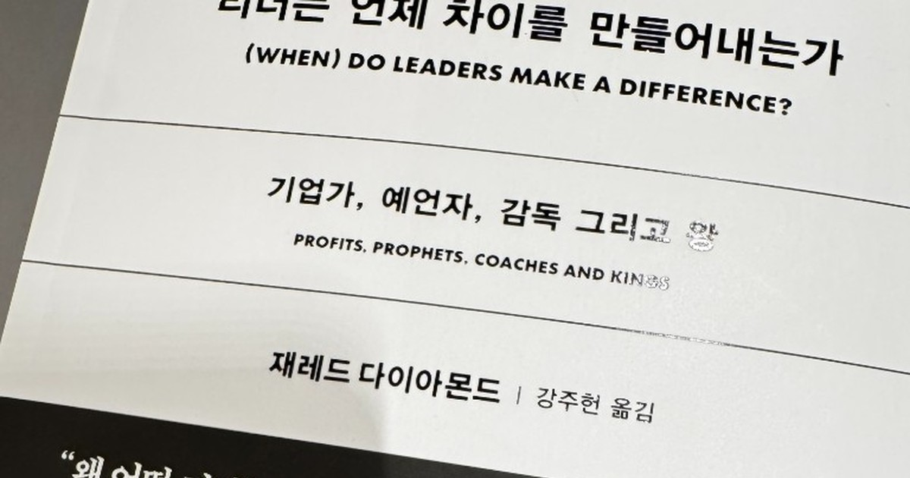

<!--
---
title: "때를 만난 사람, 사람을 만난 때"
title_en: "When the Person Meets the Moment"
subtitle: "재레드 다이아몬드 『리더는 언제 차이를 만들어내는가』 서평"
description: "영웅도 운명도 아닌 ‘언제’. 역량·시점·재량권이 맞물릴 때만 리더가 차이를 만든다. 다이아몬드 신간 서평. 투자·학술 자문 아님(2026-10)."
abstract: |
  Korean book review (Oct 2026) of Jared Diamond, Profits, Prophets, Coaches, and Kings:
  (When) Do Leaders Matter? Korean edition 리더는 언제 차이를 만들어내는가.
  Hamlet test, natural experiments, discretion; strengths and limits of the framework;
  investor translation: stock, timing, and room to operate.
  Not investment or academic advice.
summary_for_ai: |
  Korean column (not investment advice), 2026-10-04, group book-review,
  Book-Review/Review-When-Do-Leaders-Matter.md.
  Thesis: leaders matter only when ability, timing, and discretion coincide;
  Diamond's method is useful but the Hamlet test and natural-experiment stretch are weak,
  and the conclusion (discretion) is close to obvious. Reading the moment is itself a skill.
date: 2026-10-04
updated: 2026-10-04
author: "김호광 (Dennis Kim)"
lang: ko
tags:
  - 서평
  - 재레드 다이아몬드
  - 리더십
  - 재량권
  - 타이밍
keywords:
  - "리더는 언제 차이를 만들어내는가"
  - "재레드 다이아몬드"
  - "Profits Prophets Coaches and Kings"
  - "햄릿 테스트"
  - "리더십 재량권"
  - "총 균 쇠"
group: book-review
featured: true
featured_rank: -15
og_image: "https://vibequant.cc/og/when-do-leaders-matter.jpg"
image: "https://vibequant.cc/og/when-do-leaders-matter.jpg"
schema_type: BlogPosting
draft: false
robots: index,follow
---
-->

# 때를 만난 사람, 사람을 만난 때

### 재레드 다이아몬드 『리더는 언제 차이를 만들어내는가』 서평

> 원제: *Profits, Prophets, Coaches, and Kings: (When) Do Leaders Matter?*

## 질문을 바꾸는 것이 곧 답이다

리더십을 다룬 책은 대개 같은 질문에서 출발한다. "위대한 리더는 누구인가?" 그리고 그 답으로 몇 명의 영웅을 소환해 그들의 습관과 결단, 어록을 해부한다. 재레드 다이아몬드는 이 익숙한 질문을 비틀었다. 그가 묻는 것은 '누가'가 아니라 **'언제'**다. 리더는 언제, 어떤 조건에서 실제로 차이를 만들어내는가.

이 질문의 전환은 생각보다 크다. 투자자의 언어로 옮기면 이렇다. 좋은 종목을 고르는 능력만으로는 수익이 나지 않는다. 그 종목이 움직일 때에 들어가 있어야 하고, 들어간 뒤에도 포지션을 운용할 여지가 있어야 한다. **종목(인물), 타이밍(시점), 운용 재량(권한)** 세 가지가 맞물려야 비로소 결과가 나온다. 다이아몬드가 정치·비즈니스·스포츠·종교라는 네 무대를 넘나들며 증명하려는 것이 바로 이 '맞물림'의 구조다.

## 영웅도, 운명도 아닌 제3의 길

책은 리더십을 바라보는 두 개의 고전적 극단을 먼저 세워둔다. 하나는 토머스 칼라일의 영웅 사관이다. 위대한 인물이 시대를 만든다는 믿음이다. 다른 하나는 톨스토이가 『전쟁과 평화』에서 그려낸 결정론이다. 나폴레옹조차 역사의 거대한 물결에 떠밀려 간 존재일 뿐이라는 관점이다.

다이아몬드는 그 중간에 선다. 리더는 때로 차이를 만들고, 때로는 만들지 못한다. 중요한 건 그 '때로'를 가르는 조건이다. 그의 결론은 세 요소로 압축된다. **리더 개인의 역량, 그 역량이 발휘될 수 있는 적절한 시점, 그리고 실제로 무언가를 바꿀 수 있는 재량권과 기회.** 셋 중 하나라도 빠지면 아무리 뛰어난 인물도 역사의 각주로 남는다.

이것은 결국 '적당한 인재가 적당한 순간에 적당한 자리에 있어야 한다'는, 누구나 경험적으로 알지만 누구도 체계적으로 증명하지 못했던 직관을 학문의 언어로 정리하려는 시도다.

## 장점 - 직관을 측정 가능한 틀로 바꾸다

**첫째, 이분법을 넘어서는 분석 도구를 제시한다.** 리더를 과대평가하면 그를 가능케 한 제도와 시대를 놓치고, 모든 것을 구조로 환원하면 인간의 결단이 지워진다. 다이아몬드는 이 함정을 피하기 위해 두 개의 도구, 곧 '햄릿 테스트'와 '자연실험'을 들고 나온다. 리더십 논의가 늘 일화와 신화 사이를 오가던 것을 생각하면, 적어도 검증의 형식을 갖추려 했다는 점 자체가 의미 있다.

**둘째, '재량권(discretion)'이라는 개념이 리더십의 조건을 구체화한다.** 이 책에서 가장 실용적인 통찰이다. 리더가 얼마나 뛰어난가만큼이나, 그에게 실제로 무엇을 바꿀 권한이 주어졌는가가 중요하다. 규제가 촘촘한 공공서비스 업종에서는 CEO가 누구든 결과가 크게 달라지지 않는다. 반면 시장이 빠르게 변하는 패션·향수 같은 업종에서는 CEO 한 명의 판단이 회사의 운명을 가른다. 같은 논리로 독재자는 민주국가의 지도자보다 재량권이 크기에, 그의 갑작스러운 죽음이 국가 경제에 더 큰 충격을 준다.

이 개념은 리더가 되려는 사람에게도 원칙 하나를 던진다. **능력을 키우는 것만큼, 그 능력을 쓸 수 있는 자리를 고르는 것이 중요하다.** 재량이 없는 자리에서의 탁월함은 측정되지 않는다.

**셋째, 우연을 실험실로 삼는 발상이 독창적이다.** 히틀러가 1930년 교통사고로 죽었다면 역사는 달라졌을까. 다이아몬드는 이런 가정을 공상에 맡기지 않고, 실제로 일어난 우연적 사건들, 즉 정치 지도자의 암살과 급사, CEO의 갑작스러운 사망, 스포츠 감독의 교체를 일종의 자연실험으로 활용한다. 덴마크 기업 데이터에서 CEO 사망 후 2년 내 기업 이익이 평균 13% 줄었다는 분석은, '리더가 중요하다'는 막연한 말을 숫자로 바꿔 보여주는 장면이다.

## 서술의 특이점 - 노학자의 방향 전환

**첫째, '햄릿 테스트'라는 독자적 개념을 전면에 내세운다.** 셰익스피어가 없었다면 『햄릿』은 존재했을까? 이 사고 실험에서 이름을 딴 테스트는, 어떤 리더의 업적을 동시대의 다른 누군가가 대신할 수 있었는지를 묻는다. 대체 불가능하다면 그 리더는 진짜로 차이를 만든 것이다. 다이아몬드는 이 테스트를 통과한 인물로 보츠와나 초대 대통령 세레체 카마, 석류 주스라는 시장을 사실상 새로 만들어낸 린다·스튜어트 레스닉 부부를 든다. 국가 건설자와 주스 사업가를 같은 저울에 올린다는 것 자체가 이 책의 넓은 시야를 보여준다.

**둘째, 경제학의 방법론을 인문 영역으로 끌고 들어온다.** 자연실험은 원래 최저임금 인상 효과 같은 경제 문제를 분석하던 도구다. 다이아몬드는 이를 정치사, 종교사, 스포츠사에 적용한다. 스포츠 감독이 팀 성과에 미치는 영향이 20–30% 수준이라는 추정, 종교 창시자 한 명보다 조직가와 후계자, 그리고 정치적 조건이 결합해야 영향력이 확장된다는 결론이 이 방법에서 나온다. 특히 후자는 의미심장하다. 창업자의 카리스마만으로는 지속되지 않으며, 그것을 제도로 만들 '두 번째 사람'과 확산될 '시대'가 필요하다는 이야기이기 때문이다.

**셋째, 저자 자신의 지적 궤적이 하나의 서사가 된다.** 『총, 균, 쇠』에서 지리와 환경이라는 초개인적 힘으로 문명의 흥망을 설명했던 학자가, 노년의 신작에서 정반대로 개인에게 시선을 돌렸다. 이것을 변절로 읽을 필요는 없다. 평생 구조를 탐구해온 사람이 마지막에 '그 구조 안에서 개인은 언제 의미가 있는가?'를 묻는 것은, 오히려 자기 이론의 빈칸을 스스로 채우려는 정직한 시도에 가깝다.

## 약점 - 도구는 신선하나, 칼날은 무디다

**첫째, 햄릿 테스트는 생각보다 허술하다.** 셰익스피어를 대체 불가능한 사례로 드는 순간, 동시대의 크리스토퍼 말로가 떠오른다. 말로는 스물아홉에 요절했지만 『포스터스 박사』 등을 남겼고, 셰익스피어에 필적하는 재능으로 평가받기도 한다. 그가 10년만 더 살았다면 어땠을지 누구도 단언할 수 없다. 대체 가능성을 판단하려면 동시대의 모든 잠재적 경쟁자를 알아야 하는데, 이는 애초에 불가능한 전제다. 베조스나 잡스의 '대체재'가 누구였을지 우리가 어떻게 알겠는가. 영국 언론의 서평이 문학 연구자들의 견해를 외면한 저자의 태도를 꼬집은 것도 이 지점이다.

**둘째, 자연실험의 적용 범위가 지나치게 넓다.** 경제학에서 통하던 방법이 정치사나 종교사에서도 같은 정밀도로 작동한다는 보장은 없다. 표본은 적고, 변수는 통제되지 않으며, 대리 지표는 자의적이 되기 쉽다. 왕실의 근친혼 정도를 군주의 지능을 가늠하는 대리 지표로 삼는 대목은 대표적으로 무리한 설정이라는 비판을 받는다. 미국 언론의 서평이 이 확장이 실제로는 잘 작동하지 않는다고 평가한 것도 이런 맥락이다.

**셋째, 결론이 너무 당연하다.** 책 전체를 관통하는 '언제'에 대한 답은 결국 "재량권이 클 때"로 수렴한다. 수백 쪽을 따라온 독자에게는 다소 허탈한 귀결이다. 국내 서평에서도 하이라이트가 지나치게 자명한 결론으로 정리된다는 지적이 나왔다. 여기에 정치 분야에 비해 비즈니스·스포츠·종교의 분석은 상대적으로 얕고, 리더십 연구의 고전적 무대인 군사 영역은 빠져 있다.

**넷째, 서술이 망설인다.** 리더가 차이를 만든다고 했다가, 곧바로 타이밍이 좋았을 뿐이라고 한발 물러서는 패턴이 반복된다. 처칠과 드골에게 자유세계 수호의 공을 돌리면서도 "운이 좋았던 측면을 과대평가하지 말라"고 덧붙이는 식이다. 중간 지대를 택한 저자의 입장에서는 불가피한 균형일 수 있으나, 독자에게는 결론을 유보하는 화법으로 읽힌다.

## 맺으며, 때를 읽는 것도 능력이다

이 책의 가장 큰 공은 리더십 논의의 질문 자체를 바꿨다는 데 있다. "누가 위대한가?"에서 "**역량, 시점, 재량권이 언제 맞물리는가?**"로. 방법론은 거칠고 결론은 자명하지만, 그 자명한 결론을 증거의 형식으로 정리하려 했다는 점에서 의미가 있다.

그리고 이 책을 다 읽고 나면 한 가지 역설에 도달한다. 다이아몬드는 시점과 재량권을 리더 '바깥'의 조건처럼 다루지만, 현실에서 뛰어난 리더는 그 조건을 읽어내는 사람이다. 언제 움직일지, 어떤 자리에 설지, 어디서 재량을 확보할지를 판단하는 것 자체가 리더의 핵심 역량이다. 시장에서 오래 살아남는 사람이 종목보다 타이밍과 포지션을 먼저 묻는 것처럼.

결국 이 책이 리더가 되려는 사람에게 남기는 원칙은 이렇게 요약할 수 있다. **실력을 쌓되, 때를 읽고, 그 실력을 쓸 수 있는 자리로 가라.** 세 가지가 맞물리는 순간은 드물다. 그러나 그 순간을 알아보는 눈은 길러질 수 있다.

권력자 한 명이 국운을 바꿀 수 있다고 믿는 것이 옳은지, 일부 CEO가 천문학적 보수를 받는 것이 정당한지. 이 책은 그런 일상의 판단에 필요한 질문을 던진다. 답이 다소 싱겁더라도, 질문만으로 읽을 가치는 충분하다.
