<!--
  HEAD 참조 (렌더링 안 됨 · 빌드 자동 주입 · 주석 풀지 말 것)
  <title>엔진은 시대를 기억한다 · VibeQuant</title>
  <meta name="description" content="엔진은 석유와 돈, 규제와 국경을 기억한다. 쉐보레 V8부터 현대 알파·중국 PHEV까지 80년사. 정주영의 결단이 오늘의 파워트레인 보험이 됐다.">
  <meta name="robots" content="index,follow">
-->

# 엔진은 시대를 기억한다

### 석유와 돈, 규제와 국경이 빚어낸 자동차 엔진 80년사

### 미국·일본·독일·한국·중국, 그리고 개성을 잃어가는 자동차

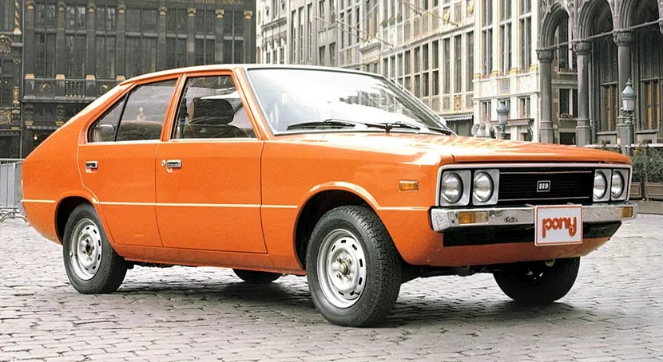

*포니. 한국이 고유 모델을 가졌을 때, 심장은 아직 남의 것이었다. 엔진은 그 간극을 기억한다.*

**김호광** 싸이월드 전 대표 / 2026년 10월 10일

> **PDF** — [검색·다운로드용 이북 (PDF)](https://vibequant.cc/files/engine-remembers-era.pdf)

## 이 책을 읽는 법

이 글은 4부 28장으로 이루어져 있다. 각 장은 **[이 시대의 엔진]** 상자로 시작한다. 그 장의 시대를 가장 잘 대표하는 엔진 하나를 먼저 소개하고, 그 엔진이 왜 그 시대에 태어났는지를 본문에서 풀어가는 방식이다. 엔진 하나하나가 한 시대의 표본이다.

- **1부 「석유와 돈의 시대」** (1~12장): 풍요의 V8에서 금융위기까지. 마이카 시대와 정주영의 결단, 그리고 자동차를 사랑하지 않게 된 세대.
- **2부 「엔진의 해부」** (13~18장): 다섯 진영의 기술과 효율, 하이브리드의 승자와 패자, 고질병, 그리고 50%의 벽.
- **3부 「국경의 시대」** (19~26장): 관세와 공급망이 엔진을 고르는 시대. 독일 3사의 몰락, 중국 전략의 피해자들, 일본의 고민, 현대차의 절묘한 자리.
- **4부 「연장전」** (27~28장): 개성을 잃어가는 자동차, 그리고 엔진의 미래.

## 프롤로그 - 네 개의 장면

1962년 캘리포니아의 어느 토요일 밤. 열여섯 살 소년은 아버지에게 빌린 쉐보레 임팔라의 V8에 시동을 건다. 배기음이 차고를 울린다. 그는 드라이브인 극장에 들렀다가, 햄버거 가게 앞에 모인 친구들과 함께 중심가를 천천히 돌며(크루징) 밤을 보낼 것이다. 기름값은 갤런당 30센트, 아르바이트 몇 시간이면 탱크를 가득 채운다. 그에게 운전면허는 성인식이었고, 자동차는 자유 그 자체였다. 조지 루카스는 11년 뒤 바로 이 밤을 영화 〈청춘 낙서(American Graffiti)〉로 그렸다.

같은 해 도쿄. 서른 살 회사원은 월급봉투를 쥐고 신문의 자동차 광고를 오래 들여다본다. 아직은 꿈이다. 그러나 4년 뒤 그는 할부로 1.1리터 코롤라를 산다. 그날 저녁 아내와 아이를 태우고 동네를 한 바퀴 돈다. 그에게 자동차는 청춘이 아니라 **"우리 집도 이제 이만큼 살게 됐다"는 중산층 진입의 증명서**였다.

1988년 서울. 올림픽을 앞둔 어느 일요일, 마흔 살 과장은 생애 첫 차를 받으러 대리점에 간다. 쏘나타였다. 그의 아버지는 소달구지를 끌었고, 그는 버스로 출퇴근했다. 아들은 이제 아버지가 모는 국산차 뒷좌석에 앉는다. 그날의 자부심은 한 가족의 것이자 한 나라의 것이었다.

2026년 캘리포니아의 어느 토요일 밤. 1962년 그 소년의 손녀는 스마트폰으로 차량 호출 앱을 연다. 그녀는 아직 운전면허가 없다. 서두를 이유도 없다. 신차 값은 몇 년 사이 3분의 1 가까이 올랐고, 보험료는 해마다 뛰며, 친구들과의 만남은 대부분 화면 속에서 이뤄진다. 그녀에게 자동차는 자유도, 증명서도 아니다. 그저 부담스러운 고정비일 뿐이다.

이 네 개의 장면 사이에 64년이 있다. 그 사이 두 번의 오일쇼크가 있었고, 배출가스 규제가 생겼으며, 일본차가 미국을 흔들었고, 한국이 엔진을 독립했고, 독일이 디젤로 흥했다가 디젤로 무너졌고, 중국이 게임의 판 자체를 바꾸려 하고 있다. 그리고 그 모든 시대의 흔적은 실린더 하나하나에 새겨져 있다.

## 한눈에 보는 연표

연표를 세 장으로 나눠, 한 화면에 잘리지 않게 그렸다.

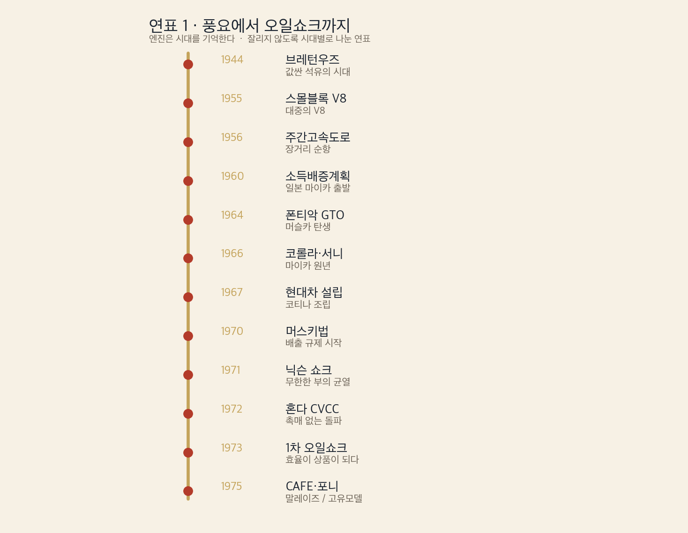

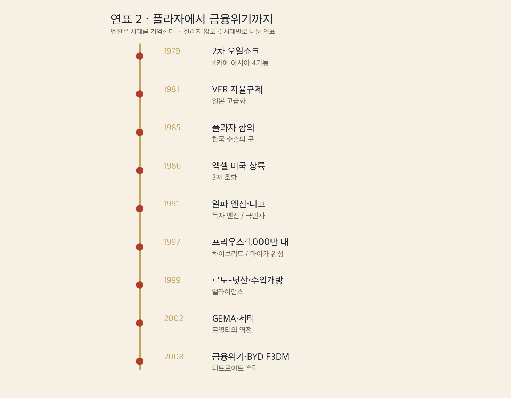

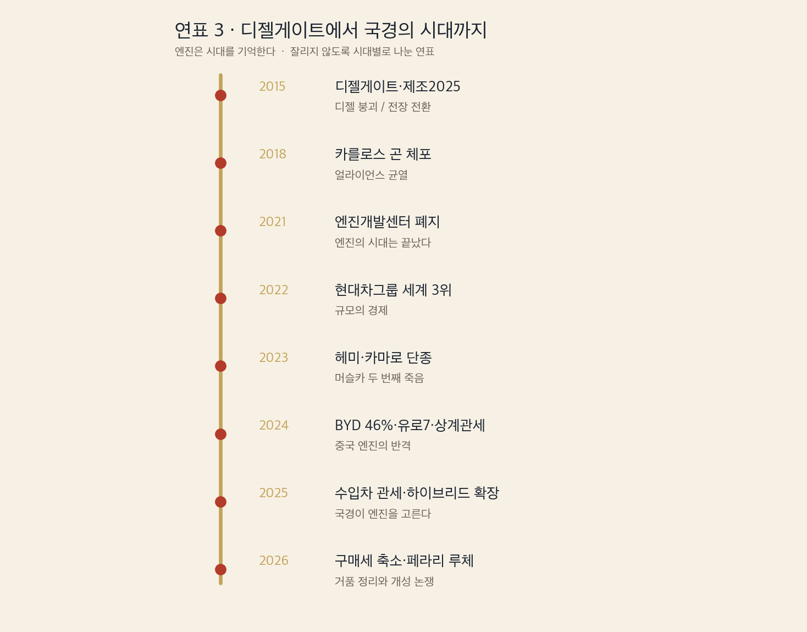

표로 보기

| 연도 | 사건 | 엔진에 남긴 흔적 |
| --- | --- | --- |
| 1944 | 브레턴우즈 체제 출범 | 달러 패권과 값싼 석유의 시대 |
| 1955 | 쉐보레 스몰블록 V8 등장 | 대중의 V8 시대 개막 |
| 1956 | 미국 주간 고속도로 건설 시작 | 장거리 고속 순항 문화 |
| 1960 | 일본 '소득배증계획' | 일본 마이카 시대의 출발 |
| 1964 | 폰티악 GTO 출시 | 머슬카의 탄생 |
| 1966 | 토요타 코롤라·닛산 서니 출시 | 일본 '마이카 원년' |
| 1967 | 현대자동차 설립 | 포드 코티나 조립에서 출발 |
| 1970 | 미국 대기청정법 개정(머스키법) | 배출가스 규제의 시작 |
| 1971 | 닉슨 쇼크(금태환 정지) | '무한한 미국의 부'에 균열 |
| 1972 | 혼다 CVCC 발표 | 촉매 없이 배출 기준을 넘는 희박연소 |
| 1973 | 1차 오일쇼크 | 효율이 처음으로 상품 가치가 됨 |
| 1975 | 미국 CAFE 도입, 현대 포니 출시 | 말레이즈 시대 / 한국 고유 모델 탄생 |
| 1979 | 2차 오일쇼크, 크라이슬러 구제금융 | K카에 미쓰비시 4기통 탑재 |
| 1981 | 일본 대미 수출 자율 규제 | 일본차의 현지 생산과 고급화 |
| 1985 | 플라자 합의, 상하이폭스바겐 설립, 말레이시아 프로톤 사가 | 한국 수출의 문 / 중국 합자 시대 / 동남아 '국민차'의 종속 |
| 1986 | 현대 엑셀 미국 상륙 | '3저 호황'과 한국차 수출 시대 |
| 1991 | 현대 알파 엔진, 대우 티코 | 한국 첫 독자 엔진 / 한국 국민차 |
| 1997 | 토요타 프리우스, 한국 차량 등록 1,000만 대 | 하이브리드 시대 개막 / 한국 마이카 시대 완성 |
| 1999 | 르노의 닛산 지분 인수, 한국 수입선다변화제도 폐지 | 얼라이언스 출범 / 일본차 국내 수입 개방 |
| 2002 | GEMA 결성, 세타 엔진 | 현대차, 로열티를 받는 쪽으로 |
| 2008 | 금융위기, BYD F3DM | 디트로이트 추락 / 중국 플러그인 하이브리드의 시작 |
| 2015 | 디젤게이트, 중국 '제조 2025' | 독일 디젤 붕괴 / 중국의 전장 전환 |
| 2018 | 카를로스 곤 체포 | 르노-닛산 얼라이언스 균열 |
| 2021 | 현대차 엔진개발센터 폐지 | "엔진의 시대는 끝났다"는 선언 |
| 2022 | 현대차그룹 글로벌 판매 3위 진입 | 규모의 경제 완성 |
| 2023~24 | 헤미 V8 머슬카·카마로 단종 | 머슬카의 두 번째 죽음 |
| 2024 | BYD 5세대 DM(열효율 46.06% 발표), 유로 7, EU 중국산 전기차 상계관세 | 중국 엔진의 반격 / 규제와 무역장벽 |
| 2025 | 미국 수입차 관세, 독일 3사 중국 판매 급감, 혼다-닛산 합병 결렬 | 국경이 엔진을 고르는 시대 |
| 2025 | 현대차 하이브리드 대확장, EU 2035 금지 완화 제안 | 내연기관의 연장전 |
| 2026 | 중국 전기차 구매세 감면 축소·수출 허가제, 페라리 '루체' 공개 | 거품 정리와 브랜드 정체성 논쟁 |

# 1부. 석유와 돈의 시대

> 엔진은 공학의 산물이기 전에 경제의 산물이다. 석유가 싸면 엔진은 커졌고, 석유가 비싸면 작아졌다. 돈이 넘치면 출력이 늘었고, 돈이 마르면 효율을 따졌다. 그리고 한 나라가 가난에서 벗어날 때, 자동차는 그 자신감의 증명서가 됐다.
>
> **이 부에서 다루는 것**: 미국 베이비붐 세대의 V8과 머슬카, 두 번의 오일쇼크, 일본과 한국의 마이카 시대, 플라자 합의, 정주영의 결단과 한국 자동차 산업의 특이성, 중국의 합자와 동남아의 종속, 독일 디젤, 금융위기, 그리고 자동차를 사랑하지 않게 된 세대와 사라지는 튜닝 문화.

## 1장. 풍요의 V8, 베이비붐 세대의 청춘

> **[이 시대의 엔진] 쉐보레 스몰블록 V8 (1955~)**
>
> 1955년 4.3L(265큐빅인치)로 데뷔한 OHV 푸시로드 V8. 작고 가볍고 싸고 튜닝하기 쉬웠다. 캠샤프트 하나가 블록 한가운데서 16개 밸브를 모두 움직이는 단순한 구조 덕분에, 시골 정비소에서도 고칠 수 있었다. 수십 년간 개량을 거듭하며 1억 대 넘게 생산된 것으로 알려져 있고, 그 후손은 지금도 콜벳과 실버라도에 들어간다. **미국이 가장 부유하던 시절의 심장**이다.

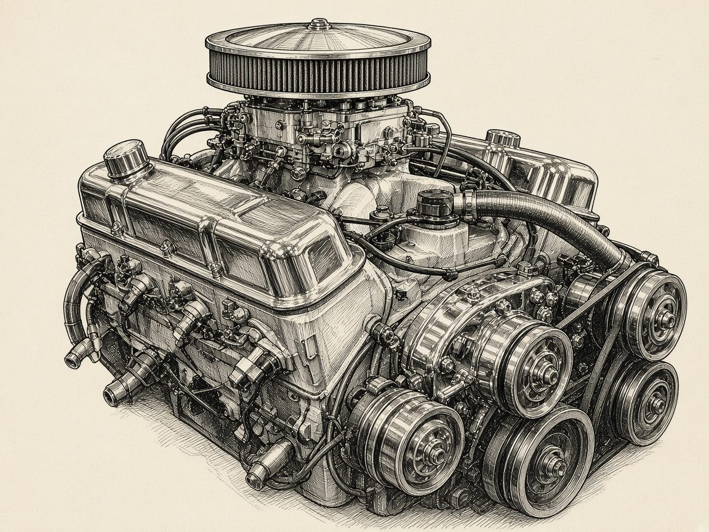

*쉐보레 스몰블록 V8. 미국이 가장 부유하던 시절의 심장.*

2차 대전이 끝난 미국은 전 세계 산업 생산의 절반 가까이를 쥔 나라였다. 1944년 브레턴우즈 체제는 달러를 세계의 기축통화로 만들었고, 중동과 텍사스의 유전은 값싼 석유를 끝없이 뿜어냈다. 1956년 시작된 주간 고속도로 건설은 대륙을 아스팔트로 엮었다.

이 풍요 위에서 미국 역사상 가장 큰 세대가 자랐다. 1946년부터 1964년 사이에 태어난 약 7,600만 명의 **베이비붐 세대**다. 그들의 부모는 제대군인 원호법(GI Bill) 덕분에 대학을 다니고 교외에 집을 샀다. 교외 주택은 자동차 없이는 살 수 없는 구조였다. 출퇴근, 장보기, 학교, 교회 모두 차로 가야 했다. 미국인의 삶이 자동차를 중심으로 재설계된 것이다.

베이비붐 세대가 열여섯 살이 된 1960년대, 운전면허는 성인식이었다. 드라이브인 극장과 드라이브인 레스토랑, 금요일 밤의 크루징, 고등학교 주차장의 자동차 자랑. 비치 보이스는 핫로드와 서핑을 노래했고, 차고는 아버지와 아들이 함께 엔진을 뜯는 교실이었다. 자동차는 이동 수단이 아니라 정체성이었다.

그리고 디트로이트는 그 정체성에 가장 미국적인 상품을 내놓았다. 1964년 폰티악 GTO는 중형차 차체에 대형차용 389큐빅인치(6.4L) V8을 집어넣는 단순한 발상으로 **머슬카**라는 장르를 열었다. 젊은 엔지니어 존 들로리언의 아이디어였다. 쉐보레 셰벨 SS, 닷지 차저, 플리머스 로드러너, 포드 머스탱이 뒤를 이었다. 이 차들은 부자의 장난감이 아니었다. 공장 노동자의 아들이 아르바이트와 할부로 살 수 있는 값이었다. **머슬카는 20대의 청춘이었다.** 미국의 풍요가 가장 젊은 세대에게까지 흘러넘치던 시절의 상징이었다.

이 시대의 엔진 철학은 명료했다. **"배기량을 대체할 수 있는 것은 없다(There's no replacement for displacement)."** 기름은 물보다 저렴하고 무한했고, 미국의 부도 무한해 보였다. 터질듯한 배기음 앞에 효율이라는 단어는 엔지니어의 사전에 없었다.

## 2장. 1971년, 균열의 시작

> **[이 시대의 엔진] 쉐보레 454 LS6 (1970)**
>
> 7.4L 빅블록 V8. 1970년식 셰벨 SS에 얹혀 카탈로그상 450마력(그로스 기준)을 기록했다. 머슬카 시대 양산 엔진 출력의 정점으로 꼽힌다. 그러나 이 엔진은 정점이자 마지막이었다. 이듬해부터 압축비가 깎이고, 출력 표기 기준이 바뀌고, 무연휘발유 시대가 오면서 **다시는 이런 엔진이 대중차에 실리지 않았다.**

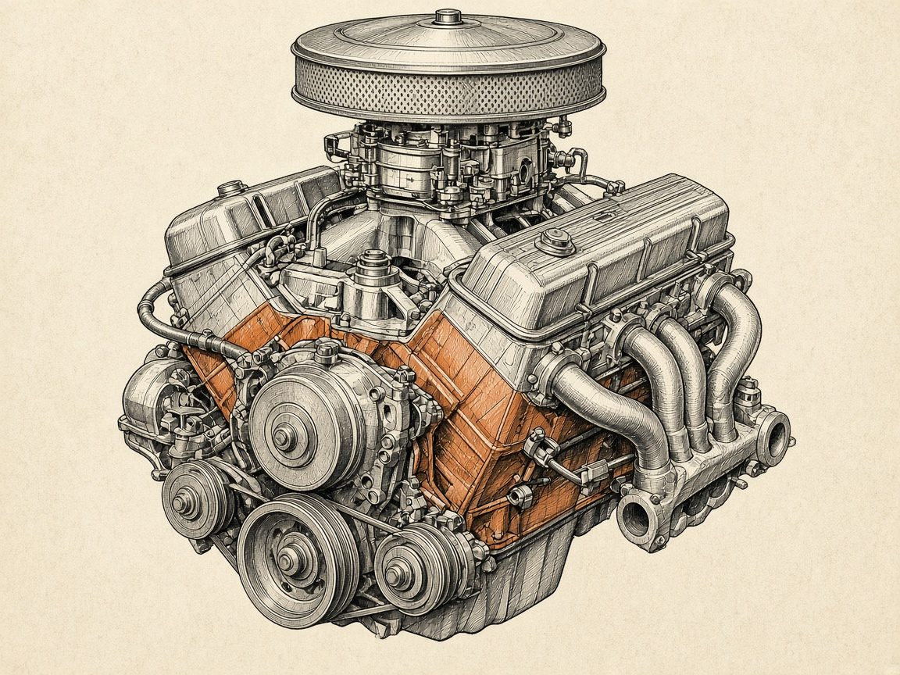

*머슬카 양산 출력의 정점. 454 빅블록의 마지막 불꽃.*

균열은 엔진 밖에서 먼저 시작됐다.

머슬카를 모는 20대 운전자들의 사고율이 치솟자 보험사들은 고출력 차량에 무거운 할증을 붙였다. 차값보다 보험료가 더 무서운 시대가 왔다. 로스앤젤레스 분지의 스모그는 시민들의 눈과 폐를 공격했고, 이는 1970년 대기청정법 개정, 이른바 **머스키법**으로 이어졌다. 이 법은 1975년식까지 탄화수소와 일산화탄소 배출을 90% 줄이라고 요구했다. 같은 해 미국 환경보호청(EPA)이 설립됐다. 자동차가 처음으로 '환경 오염원'으로 규정된 순간이었다.

그리고 1971년 8월, 닉슨 대통령은 달러의 금 태환을 정지했다. 베트남 전쟁과 복지 지출로 불어난 달러를 금으로 바꿔줄 수 없게 된 것이다. 브레턴우즈 체제가 무너지자 달러 가치가 떨어졌고, 달러로 석유를 팔던 산유국들의 실질 수입도 줄었다. 산유국들의 불만은 쌓여 갔다. 2년 뒤 그 불만은 무기가 된다.

## 3장. 1973년 겨울 - 1차 오일쇼크와 일본의 시간

> **[이 시대의 엔진] 혼다 CVCC 1.5L (1975년식 시빅 CVCC)**
>
> 주연소실 옆의 작은 부실(副室)에서 농후한 혼합기에 먼저 불을 붙이고, 그 화염으로 주연소실의 희박한 혼합기를 태우는 '복합와류 조속연소' 엔진. 미국 환경보호청 시험에서 **촉매 변환기 없이** 1975년 배출 기준을 통과했다. 디트로이트가 "불가능하다"던 일을 오토바이 회사 출신 신생 메이커가 해냈다. 반세기 뒤, 이 부실 연소 아이디어는 F1과 최신 고효율 엔진의 '프리챔버 점화'로 되살아난다.

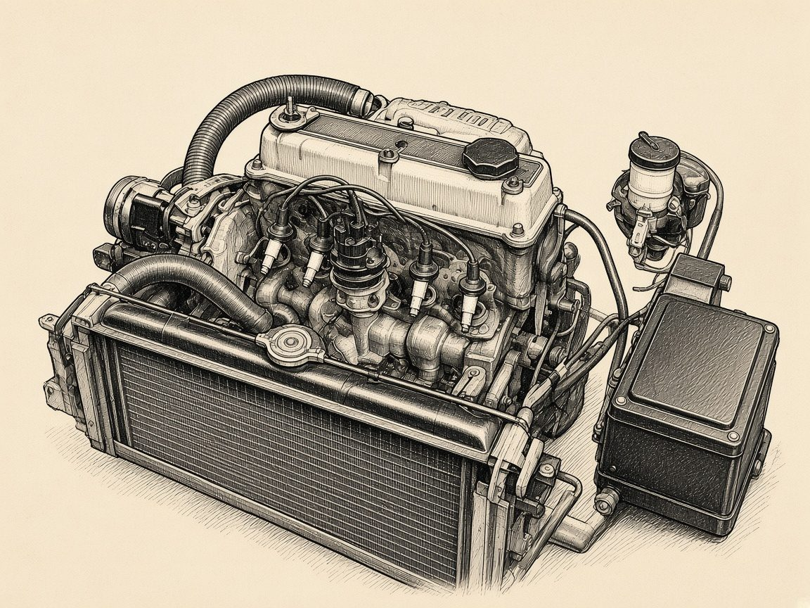

*혼다 CVCC. 촉매 없이 1975년 배출 기준을 넘은 4기통.*

1973년 10월, 욤키푸르 전쟁이 터졌다. 미국이 이스라엘을 지원하자 아랍 산유국들(OAPEC)은 석유 금수를 선언했다. 배럴당 3달러 수준이던 원유 가격은 몇 달 만에 약 4배로 뛰었다.

미국 주유소 앞에는 수백 미터 줄이 늘어섰다. 번호판 끝자리의 홀짝으로 급유일을 나누는 배급제가 시행됐고, 고속도로 제한속도는 시속 55마일로 묶였다. 미국 소비자는 처음으로 엔진에게 물었다. "갤런당 몇 마일을 가는가?" 그 질문에 답할 준비가 된 회사들은 태평양 건너에 있었다.

혼다 CVCC는 디트로이트가 규제 연기를 로비하던 바로 그 기준을 넘어섰다. 토요타 코롤라, 닛산(당시 닷선)의 소형차가 미국 시장을 파고들었다.

그런데 일본 엔진이 효율에 강했던 이유를 오일쇼크만으로 설명하면 반쪽짜리다. 일본은 석유의 거의 전량을 수입하는 **자원 빈국**이었다. 자동차세는 **배기량 구간별로 누진**됐고, 차체 크기와 배기량에 따라 번호판 등급이 갈렸으며, 660cc 이하 경차(케이카)에는 별도의 세제 혜택이 있었다. 비싼 고속도로 통행료, 좁은 도로, 짧은 통근 거리까지 더하면, 일본 소비자에게 "작고, 기름 덜 먹고, 고장 안 나는 엔진"은 선택이 아니라 생존 조건이었다. 오일쇼크는 일본식 엔진이 세계 시장에서 경쟁력을 갖게 된 계기였을 뿐, 출발점이 아니었다.

미국 정부는 1975년 에너지정책보존법(EPCA)으로 **CAFE(기업평균연비) 규제**를 도입했다. 1978년식 18mpg에서 시작해 1985년 27.5mpg까지 끌어올리는 일정이었다. 같은 시기 촉매 변환기와 무연휘발유가 보급됐다. 결과는 처참했다. 1975년식 쉐보레 콜벳의 기본 엔진은 165마력이었다. 불과 5년 전 450마력을 자랑하던 나라의 상징이 3분의 1로 쪼그라든 이 시기를 미국인들은 **'말레이즈 시대(Malaise Era)'**, 무기력의 시대라고 부른다. 머슬카의 첫 번째 죽음이었다.

## 4장. 1979년, 두 번째 충격과 디트로이트의 추락

> **[이 시대의 엔진] 미쓰비시 4G54 '아스트론' 2.6L (1970년대 후반~)**
>
> 대배기량 직렬 4기통의 숙명인 2차 진동을, 크랭크축의 두 배 속도로 서로 반대 방향으로 도는 두 개의 밸런스 샤프트로 상쇄한 엔진. 미쓰비시는 이를 **'사일런트 샤프트'** 라는 이름으로 특허를 냈고, 포르쉐조차 944에 이 특허를 라이선스해 썼다. 그리고 파산 위기의 크라이슬러는 이 엔진을 'K카'에 얹었다. **미국 차의 심장에 처음으로 아시아의 4기통이 들어간 순간**이다.

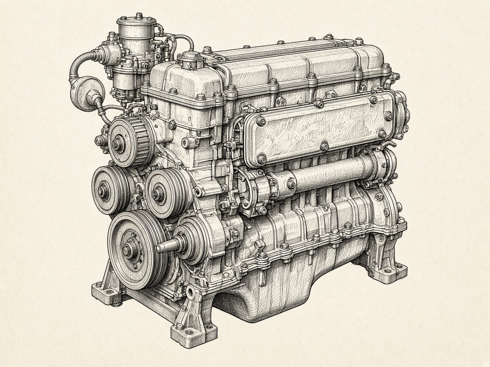

*미쓰비시 아스트론 계열. 미국 차 심장에 처음 들어간 아시아 4기통.*

1979년 이란 혁명은 2차 오일쇼크를 불렀다. 유가는 다시 두 배 이상 뛰었고, 미국은 고물가와 저성장이 겹친 **스태그플레이션**에 빠졌다. 연준 의장 폴 볼커는 인플레이션을 잡기 위해 기준금리를 20% 가까이 끌어올렸다. 할부로 차를 사던 중산층의 지갑은 닫혔고, 대형차 재고가 쌓였다.

크라이슬러는 파산 직전까지 몰렸다. 1979년 미 의회는 15억 달러 규모의 대출 보증법을 통과시켰고, 포드에서 쫓겨난 리 아이아코카는 소형 전륜구동 'K카'로 회사를 살려냈다. 그 K카의 상위 엔진이 바로 미쓰비시 아스트론이었다. 미국의 V8이 저물고 아시아의 4기통이 미국 차의 심장으로 들어온 이 장면은, 20년 뒤 한국에서 뜻밖의 방식으로 이어진다.

일본차의 미국 점유율이 급등하자 1981년 미국은 일본에 연간 168만 대의 **수출 자율 규제(VER)** 를 요구했다. 일본은 두 가지로 응수했다. 하나는 미국 현지 공장 건설(1982년 혼다 메리스빌 공장)이었고, 다른 하나는 대수 제한 아래 대당 이익을 늘리는 고급화였다. 1986~1989년 어큐라·렉서스·인피니티가 차례로 탄생했다. 규제가 일본차를 고급 시장으로 밀어 올린 셈이다.

## 5장. 마이카의 시대 - 일본과 한국, 자동차가 계층과 자신감이던 시절

> **[이 시대의 엔진] 토요타 K형 1.1L (1966년 코롤라) / 대우 티코 0.8L 3기통 (1991)**
>
> 토요타 K형은 초대 코롤라에 얹힌 1.1L 직렬 4기통이다. 경쟁차 닛산 서니가 1.0L를 내놓자 토요타는 "플러스 100cc의 여유"라는 광고 문구로 맞섰다. 100cc 차이가 광고가 될 만큼, 그 시절 일본 가정에게 자동차는 1cc 단위로 고민하는 대사(大事)였다.
>
> 대우 티코는 스즈키의 경차를 라이선스 생산한 한국의 첫 '국민차'다. 0.8L 3기통 엔진은 작고 소박했지만, 이 엔진 덕분에 처음으로 자기 차를 가진 한국 가정이 수십만에 이른다. **두 엔진 모두 마력이 아니라 '가족의 꿈'을 기준으로 설계됐다.**

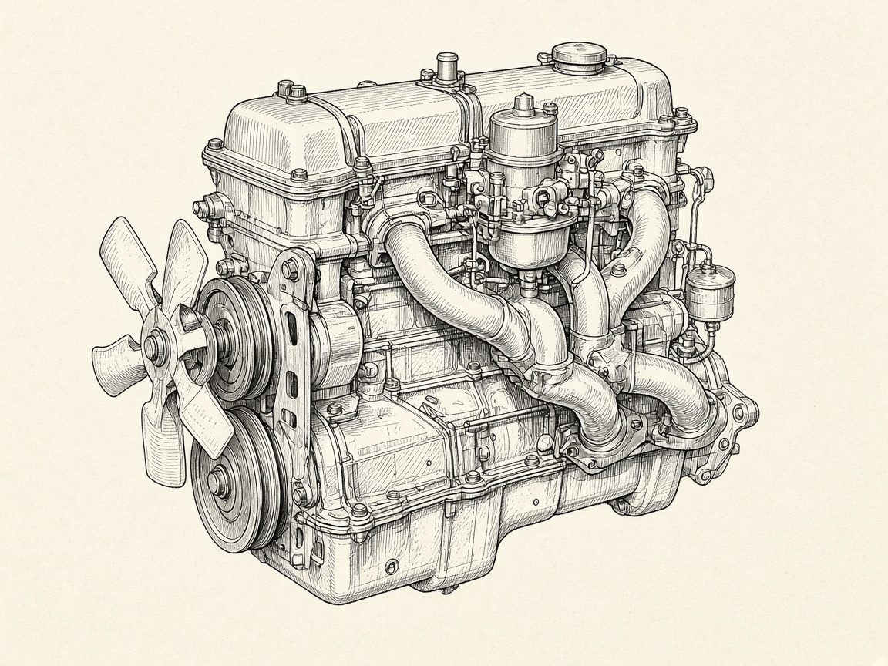

*토요타 K형과 티코 3기통. 마력이 아니라 가족의 꿈.*

### 미국의 청춘, 아시아의 자신감

같은 자동차라도 나라마다 의미가 달랐다. 미국 베이비붐 세대에게 머슬카가 **청춘**이었다면, 일본과 한국의 기성세대에게 자가용은 **경제 성장의 자신감**이었다. 미국의 자동차 문화가 이미 부유한 나라의 젊은이가 누리는 '해방'이었다면, 일본과 한국의 마이카는 가난을 막 벗어난 나라의 가장이 손에 쥔 '도달'이었다.

### 일본: 소득배증계획과 '3C'

1960년 이케다 하야토 내각은 10년 안에 국민소득을 두 배로 만들겠다는 **'소득배증계획'** 을 내걸었다. 실제 일본 경제는 그보다 빨리 커졌다. 1950년대 일본 가정의 꿈이 흑백 TV·세탁기·냉장고라는 '세 가지 신기(神器)'였다면, 1960년대 중반에는 **컬러 TV·에어컨(쿨러)·자동차(카)**, 이른바 **'3C'** 가 새로운 신기로 꼽혔다.

1966년 닛산 서니와 토요타 코롤라가 잇달아 출시됐다. 일본인들은 이 해를 **'마이카 원년'** 이라 부른다. 월급쟁이가 할부로 살 수 있는 대중차가 처음 등장한 것이다. 1964년 도쿄 올림픽과 신칸센, 고속도로 개통과 맞물려, 자동차는 일본이 패전의 폐허에서 세계 2위 경제대국으로 올라서는 과정을 각 가정에 실감 나게 전해주는 물건이 됐다. 일요일의 가족 드라이브는 고도성장의 의식이었다.

### 대한민국 - 올림픽, 1,000만 대, 그리고 쏘나타의 뒷좌석

한국의 마이카 시대는 20년 늦게 왔지만 더 압축적이었다. 1980년대 중반 '3저 호황'으로 소득이 빠르게 늘었고, 1987년 이후 임금이 크게 올랐다. 1988년 서울 올림픽은 한국인에게 "우리도 이제 선진국 문턱에 왔다"는 자신감을 심었다. 그 자신감이 가장 눈에 띄게 드러난 곳이 주차장이었다.

자동차 등록 대수는 1980년대 중반 100만 대를 넘어섰고, 1997년에는 1,000만 대를 돌파했다. 불과 10여 년 만에 열 배가 된 것이다. 엑셀과 프라이드가 첫 차의 꿈을 채웠고, 쏘나타는 "성공한 중산층"의 상징이 됐으며, 1991년 대우 티코는 '국민차'라는 이름으로 마이카의 문턱을 한 번 더 낮췄다. 주말이면 고속도로가 귀성·나들이 차량으로 막혔고, 그 정체조차 풍요의 증거로 여겨졌다.

결정적인 차이는 **그 차들이 한국 회사가 만든 국산차였다는 점**이다. 일본의 마이카가 일본차였던 것처럼, 한국의 마이카도 한국차였다. 한국 정부는 1978년부터 1999년까지 **수입선다변화제도**로 일본차 수입을 사실상 막았다. 보호받는 내수 시장 안에서 국산 메이커들은 마이카 수요를 고스란히 흡수하며 덩치를 키웠다. 이 시기 한국 가정의 자부심은 이중이었다. "우리 집도 차를 샀다"는 자부심, 그리고 "우리나라도 차를 만든다"는 자부심. 개발도상국 가운데 이 두 자부심을 동시에 누린 나라는 드물었다. 그 이유는 7장과 8장에서 이야기할 것이다.

## 6장. 1985년 플라자 합의와 한국의 시간

> **[이 시대의 엔진] 현대 엑셀의 미쓰비시 오리온 계열 1.5L (1986)**
>
> 미국에 상륙한 첫 한국차 엑셀의 심장은 미쓰비시 엔진을 라이선스 생산한 1.5L 4기통이었다. 엑셀은 일본차보다 훨씬 싼 값으로 첫해 16만 대 넘게 팔리며 수입차 데뷔 기록을 썼다. 그러나 잦은 고장으로 "싸구려 차"라는 낙인도 함께 얻었다. **차는 한국이 만들었지만, 심장은 아직 일본 것이었다.** 이 엔진은 한국 자동차의 영광과 한계를 동시에 보여준다.

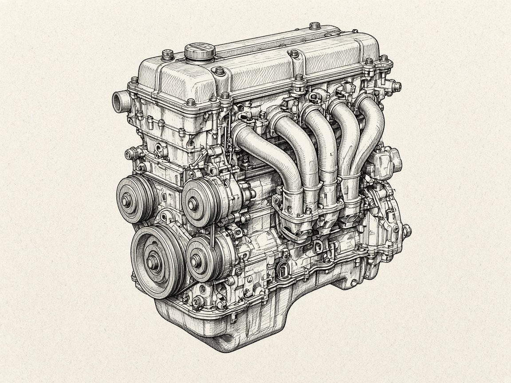

*엑셀의 미쓰비시 1.5L. 차는 한국, 심장은 아직 일본.*

1980년대 중반, 미국은 무역적자와 강달러에 시달렸다. 1985년 9월 뉴욕 플라자 호텔에 모인 선진 5개국은 달러 가치를 끌어내리기로 합의했다. **플라자 합의**다. 엔화 가치는 2년 사이 두 배 가까이 뛰었다. 일본차는 미국에서 갑자기 비싸졌다.

그 틈을 파고든 것이 한국이었다. 1986년부터 3년간 한국 경제는 **저유가·저금리·저달러**가 동시에 겹친 이른바 '3저 호황'을 누렸다. 1986년 미국에 상륙한 현대 엑셀은 이 세 바람을 모두 등에 업었다. 한국차가 세계 최대 시장에 처음으로 이름을 새긴 순간이었다.

그러나 엑셀의 성공은 곧 품질 문제로 빛을 잃었다. 이 낙인을 지우는 데 십수 년이 걸렸다. 반전의 계기는 1998년 미국에서 내건 **'10년 10만 마일' 파워트레인 보증**이었다. "우리 엔진은 10년을 버틴다"는 약속은 품질에 대한 자신감이자 배수진이었고, 이후 현대차의 미국 평판은 서서히 뒤집혔다. 엔진에 대한 약속이 브랜드를 살린 것이다.

## 7장. 정주영의 결단 - 조립공장이 될 것인가?, 자동차 회사가 될 것인가?

> **[이 시대의 엔진] 현대 알파 1.5L (1991)**
>
> 한국 최초의 독자 개발 엔진. 1983년 엔진개발실을 꾸린 지 8년, 수많은 시제품이 깨지고 녹은 끝에 스쿠프에 처음 얹혔다. 성능만 놓고 보면 평범한 1.5L 4기통이었다. 그러나 이 엔진이 돌기 시작한 순간, 한국은 **엔진을 스스로 설계하고 만드는 몇 안 되는 나라**가 됐다. 알파는 엔진이라기보다 독립선언서였다.

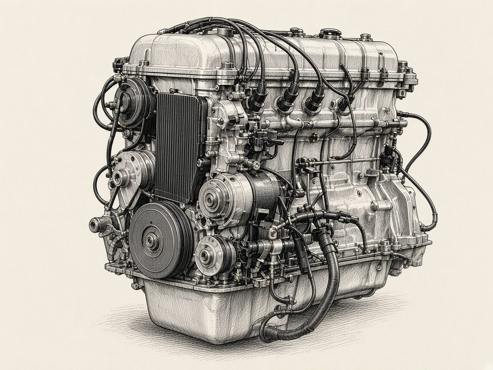

*현대 알파 1.5L. 한국 최초의 독자 엔진, 독립선언서.*

현대자동차의 역사에서 가장 중요한 결정들은 모두 같은 질문 앞에서 내려졌다. **"남의 기술로 조립만 할 것인가?, 우리 기술로 자동차를 만들 것인가?"** 그리고 그 질문 앞에서 정주영 회장은 매번 어려운 쪽을 택했다.

1967년 설립된 현대자동차는 포드와 손잡고 코티나를 조립하며 출발했다. 그러나 합작 회사 설립 협상에서 포드는 현대를 자사의 아시아 조립 기지로 두려 했고, 경영권과 수출 권한을 둘러싼 이견 끝에 협상은 결렬됐다. 정주영은 쉬운 길, 즉 글로벌 메이커의 하청 조립공장으로 안정적인 수익을 얻는 길을 버렸다. 대신 고유 모델 개발이라는 무모해 보이는 길을 택했다.

1975년, 그 결과물이 **포니**였다. 이탈리아 주지아로가 디자인한 차체에 미쓰비시의 1.2L 새턴 엔진과 변속기를 얹었다. 엔진은 아직 남의 것이었지만, 한국은 고유 모델을 가진 나라가 됐다. 포니는 이듬해 에콰도르로 수출되며 한국 자동차 수출의 첫 장을 열었다.

*포니. 주지아로의 차체에 미쓰비시 심장. 고유 모델의 출발.*

고유 모델의 길은 외교적 압력에도 부딪혔다. 1970년대 중반 주한 미국대사가 정주영에게 독자 개발을 포기하고 미국 메이커의 차를 조립하는 편이 낫다고 권했고, 정주영은 자신의 재산을 다 쏟아붓는 한이 있어도 자동차 독자 개발을 멈추지 않겠다며 거절했다는 일화가 현대가(家)의 회고와 여러 전기에 전해진다. 그는 자동차가 수만 개의 부품과 철강·기계·전자 산업 전체를 끌고 가는 산업이며, 자동차를 스스로 만들지 못하는 나라는 결코 산업 국가가 될 수 없다고 보았다.

그러나 고유 모델만으로는 부족했다. 엔진이 남의 것이면 진짜 독립이 아니었다. 1983년 현대차는 엔진개발실을 꾸렸고, 이듬해 미국 GM 연구소 출신의 이현순 박사를 영입해 독자 엔진 개발에 착수했다. 영국 리카르도의 자문을 받으며 진행된 이 프로젝트는 수많은 실패를 겪었다. 이 과정에서 미쓰비시 측이 엔진 개발을 포기하면 로열티를 크게 깎아주겠다는 제안을 했고, 현대가 이를 거절했다는 일화도 전해진다. 당장의 비용보다 기술 주권을 택한 것이다. 1991년, 알파 엔진이 돌기 시작했다. 미쓰비시 측에서 "현대는 엔진을 만들 수 없을 것"이라는 말이 나왔다는 이야기는 지금도 남양연구소에서 회자된다.

정주영 회장의 비전이 얼마나 멀리 내다본 것이었는지는 반세기가 지난 지금에야 온전히 드러난다. 오늘날 엔진·변속기·하이브리드 시스템·전기차 플랫폼·수소연료전지를 모두 자체 개발할 수 있는 자동차 회사는 전 세계에 손에 꼽는다. 벤츠는 소형 4기통 엔진 생산을 중국 지리 계열에 맡겼다가 관세와 정치의 덫에 걸렸고, 닛산은 경영난에 공장을 닫고 있으며, 중국은 내연기관 기술 격차를 정공법으로 따라잡을 수 없어 전장 자체를 바꾸는 우회로를 택했다. 반면 현대차는 전기차 전환이 늦어지자 곧바로 하이브리드 라인업을 두 배로 늘릴 수 있었다. 엔진을 스스로 만들 줄 알았기 때문이다.

> **한국 자동차 산업은 정주영의 혜안 덕분이었다.**
>
> 1970년대의 그 결정이 없었다면 오늘의 한국 자동차 산업은 없었다. 조립공장의 안락함을 거부한 한 기업가의 고집이, 2020년대 파워트레인 다변화 시대에 가장 강력한 자산이 됐다. **기술 독립은 비용이 아니라 보험이었다.**

## 8장. 왜 한국만 가능했나? - 중국의 합자, 동남아의 종속

> **[이 시대의 엔진] 프로톤 사가의 미쓰비시 4G15 1.5L (1985)**
>
> 말레이시아의 첫 '국민차' 프로톤 사가는 미쓰비시 랜서를 바탕으로 미쓰비시 엔진을 얹고 태어났다. 국가가 브랜드를 만들고 공장을 지었지만, 심장은 끝내 일본 것이었다. 그리고 30여 년 뒤 프로톤의 지분 49.9%는 중국 지리에 넘어갔다. **일본의 엔진으로 태어나 중국의 품에 안긴 국민차**, 그것이 동남아 자동차 산업의 축소판이다.

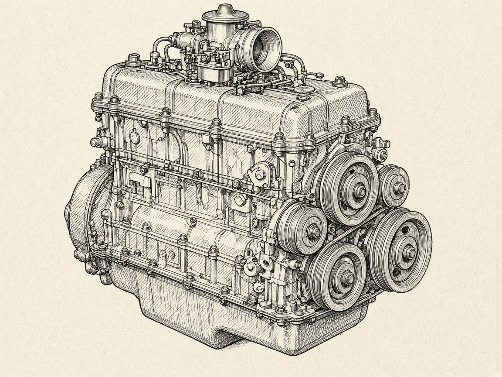

*프로톤 사가의 미쓰비시 4G15. 일본의 엔진으로 태어난 국민차.*

### 전후 신생 독립국 가운데 거의 유일한 성공

2차 대전 이후 독립한 수많은 나라가 자동차 산업을 꿈꿨다. 자동차는 산업화의 상징이었고, 국민차는 국가적 자존심이었다. 그러나 반세기가 지난 지금, 식민지와 전쟁의 폐허에서 출발해 **세계 시장에서 통하는 자국 브랜드와 자체 엔진을 가진 자동차 산업**을 만들어낸 나라는 거의 한국 하나뿐이다. 일본은 전쟁 이전부터 산업 기반과 자동차 회사를 가진 나라였고, 독일·미국·이탈리아·프랑스는 자동차를 발명하고 키운 나라들이다. 출발선이 전혀 다르다.

왜 다른 나라들은 실패했을까? 비교해 보면 한국의 길이 얼마나 예외적이었는지 드러난다.

### 동남아시아 - 일본 자동차 산업의 종속 구조

태국은 한때 '아시아의 디트로이트'로 불렸다. 연간 수백만 대를 만드는 거대한 생산 기지다. 그러나 그 공장의 주인은 대부분 일본 메이커였다. 태국 시장에서 일본 브랜드의 합산 점유율은 2010년 90%를 넘었다. 인도네시아에서도 일본차는 2012년 무렵 90% 이상을 차지했다. 엔진과 핵심 부품은 일본에서 설계되고, 일본 계열 부품사들이 현지에 공장을 지어 공급했다. 동남아에 진출한 일본 부품 기업은 2,800곳에 가깝고, 그 절반 가까이가 태국에 몰려 있다. 동남아는 일본 자동차 산업의 거대한 하청 생태계였다.

국민차를 만들려는 시도가 없었던 것은 아니다. 말레이시아는 1985년 마하티르 총리의 주도로 국영 **프로톤**을 세웠다. 그러나 프로톤은 미쓰비시의 차체와 엔진을 빌려 출발했고, 독자 기술을 충분히 쌓지 못한 채 경영난에 빠졌다. 2017년 지분 49.9%가 중국 지리에 매각됐다. 인도네시아는 1996년 **티모르**라는 국민차 프로젝트를 띄웠는데, 그 차는 기아자동차의 세피아를 바탕으로 한 것이었다. 일본·미국·유럽은 국민차에 대한 세제 혜택이 차별이라며 세계무역기구(WTO)에 제소했고, 1997년 외환위기까지 겹치며 프로젝트는 무너졌다.

동남아 자동차 산업의 구조는 결국 **일본에 대한 기술·자본·부품 종속**이었다. 공장은 현지에 있었지만 설계도와 엔진과 이익은 도쿄와 나고야에 있었다. 그리고 그 종속 구조가 지금 뜻밖의 방식으로 흔들리고 있다. 이 이야기는 25장에서 다시 한다.

### 중국 - 시장을 개방하고 기술을 얻는다

중국은 다른 길을 갔다. 1984년 베이징지프, 1985년 상하이폭스바겐을 시작으로 외국 메이커와의 **합자(合資) 회사** 체제를 세웠다. 1994년 자동차 산업 정책은 외국 기업의 지분을 50%로 묶었다. 외국 메이커가 거대한 중국 시장에 들어오려면 반드시 중국 국영기업과 반반 합작해야 했다. 이른바 **'시장으로 기술을 바꾼다(以市場換技術)'** 전략이다.

결과는 절반의 성공이었다. 합자 회사들은 중국 내수 시장의 폭발적 성장 속에서 막대한 이익을 냈고, 중국은 생산 기술과 부품 생태계, 그리고 숙련 인력을 얻었다. 그러나 엔진과 변속기의 핵심 설계 기술은 끝내 온전히 이전되지 않았다. 합자 파트너인 국영기업들은 외국 브랜드를 팔아 쉽게 돈을 벌었기에, 굳이 고생스럽게 자체 엔진을 개발할 동기가 약했다. 중국 토종 브랜드는 오랫동안 '싸고 조악한 차'에 머물렀다.

### 한국은 무엇이 달랐나?

한국은 합자에 기대지 않았고, 내수에 안주할 수도 없었다. 세 가지가 결정적이었다.

첫째, **경영권과 기술 주권을 넘기지 않았다.** 포드와의 합작 결렬, 미국대사의 권유 거절, 미쓰비시의 로열티 제안 거절은 모두 같은 원칙에서 나왔다. 남의 기술을 빌리되, 남의 공장이 되지는 않는다.

둘째, **내수가 작아서 처음부터 수출을 해야 했다.** 한국의 내수 시장은 중국의 수십분의 일이었다. 연간 백몇십만 대 시장으로는 규모의 경제를 이룰 수 없었다. 포니를 만들자마자 에콰도르로, 엑셀을 만들자마자 미국으로 나간 이유다. 세계 시장에서 살아남으려면 품질과 기술을 직접 키워야 했다. 작은 내수가 오히려 체질을 단련시켰다.

셋째, **국가의 보호와 시장의 채찍이 함께 작동했다.** 수입선다변화제도는 일본차로부터 내수를 지켜줬지만, 수출 시장에서는 아무도 한국차를 보호해 주지 않았다. 안에서는 키우고 밖에서는 싸우는 구조였다.

중국이 '합자와 거대한 내수'를 바탕으로 성장한 뒤, 그 위에서 국가 주도의 **전기차 드라이브**로 내연기관을 건너뛰려 했다면, 한국은 '작은 내수와 처절한 수출'을 바탕으로 **내연기관 자체를 정면 돌파**했다. 같은 후발주자였지만 정반대의 길이었다. 그리고 그 정면 돌파의 출발점에 정주영의 결단이 있었다.

## 9장. 2002년, 로열티의 방향이 바뀌다 - 크라이슬러 엔진의 후계자

> **[이 시대의 엔진] 현대 세타 2.4L / 크라이슬러 '월드 엔진' (2004~)**
>
> 현대·크라이슬러·미쓰비시 3사 연합 GEMA의 공동 엔진. 기본 설계는 현대 남양연구소가 주도했다. 현대 쏘나타, 닷지 캘리버, 지프 컴패스, 미쓰비시 아웃랜더가 같은 뿌리의 심장을 나눠 썼다. 이후 크라이슬러에서는 피아트 기술을 얹은 '타이거샤크'로, 현대에서는 세타 II·III와 스마트스트림으로 진화했다. **미쓰비시에 로열티를 내던 회사가 로열티를 받기 시작한 엔진**이다.

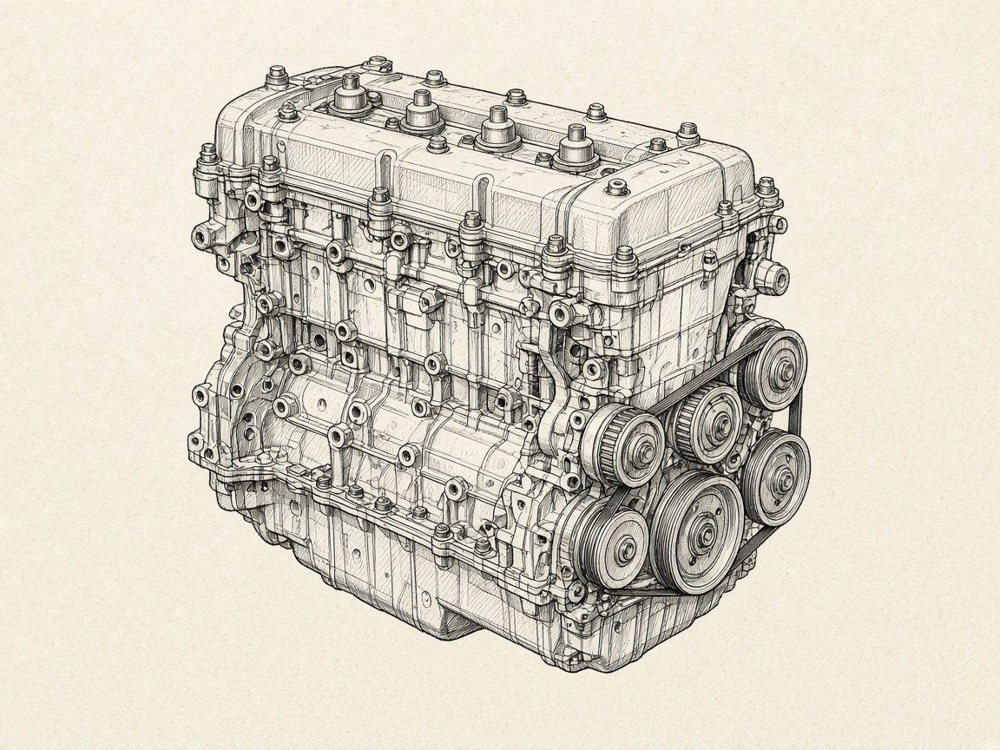

*세타 / 월드 엔진. 로열티를 받던 쪽으로 뒤집힌 심장.*

2002년, 역사가 뒤집힌다. 당시 다임러크라이슬러는 현대차 지분 약 10%와 미쓰비시 경영권을 동시에 쥐고 있었다. 세 회사는 중형 4기통 엔진을 공동 개발·생산하는 **GEMA(Global Engine Manufacturing Alliance)** 를 결성했는데, 기본 설계를 주도한 것은 현대 남양연구소였다. 대배기량 직렬 4기통의 숙명인 2차 진동을 밸런스 샤프트 모듈로 다듬는 NVH 설계까지 그 안에 담겼다. 30년 전 미쓰비시의 사일런트 샤프트를 들여와야 했던 회사가, 이번에는 진동을 잡은 설계를 내놓는 쪽이 된 것이다. 4장의 아스트론과 이 장의 세타는 그렇게 이어진다.

현대차는 미쓰비시와 다임러크라이슬러로부터 수천만 달러 규모의 로열티를 받았다. 포니 이후 30년, 로열티의 방향이 처음으로 바뀐 순간이었다.

이 엔진의 생명력은 길었다. 크라이슬러가 피아트에 인수된 뒤, 월드 엔진은 피아트의 멀티에어 가변밸브 기술을 얹은 2.4L **'타이거샤크'** 로 진화해 지프 체로키·레니게이드·컴패스, 크라이슬러 200 등에 2020년대 초반까지 쓰였다. 1980년대 미쓰비시 엔진을 빌려 쓰던 크라이슬러가, 2000~2010년대에는 현대가 설계를 주도한 엔진으로 미국 소형·중형차의 심장을 채운 것이다. 그리고 크라이슬러가 스텔란티스로 흡수되며 자체 4기통의 맥이 흐려진 지금, 그 계보를 세타 II·세타 III·스마트스트림으로 이어가며 진화시키고 있는 것은 현대차다. 그런 의미에서 오늘의 현기차 엔진은 **크라이슬러 4기통의 정통 후계자**라 불러도 과장이 아니다.

흔히 오해되는 지점도 짚어둔다. 이 엔진이 들어간 차는 벤츠 배지가 아니라 크라이슬러 계열이었다. 다임러에 필요했던 것은 크라이슬러 소형·중형차용 저렴한 전륜 횡치 4기통이었고, 벤츠의 엔지니어링 역량은 후륜 종치형 고급 엔진에 집중되어 있었다. 흥미롭게도 벤츠는 그 뒤에도 전륜 소형차 엔진에서 반복적으로 외부와 손을 잡는다. 2010년대 A클래스는 르노의 1.5L 디젤을, 2018년 이후에는 르노-닛산과 공동 개발한 1.33L 가솔린을 썼다. 이 고민은 2020년대에 지정학의 옷을 입고 다시 등장한다(19장).

## 10장. 독일의 답 - 세금이 만든 디젤

> **[이 시대의 엔진] 폭스바겐 그룹 1.9 TDI (1990년대 초~)**
>
> 터보와 직분사를 결합한 4기통 디젤. 골프, 파사트, 아우디 A4에 얹혀 유럽 전역을 달렸다. 시끄럽고 느린 트럭 엔진이던 디젤을 "빠르고, 토크 넘치고, 기름 덜 먹는 승용 엔진"으로 바꿔놓은 주역이다. 수십만 km를 거뜬히 버티는 내구성으로 택시 기사들의 신뢰를 얻었다. **유럽 디젤 전성시대의 대명사**이자, 20년 뒤 디젤게이트로 무너질 신화의 출발점이다.

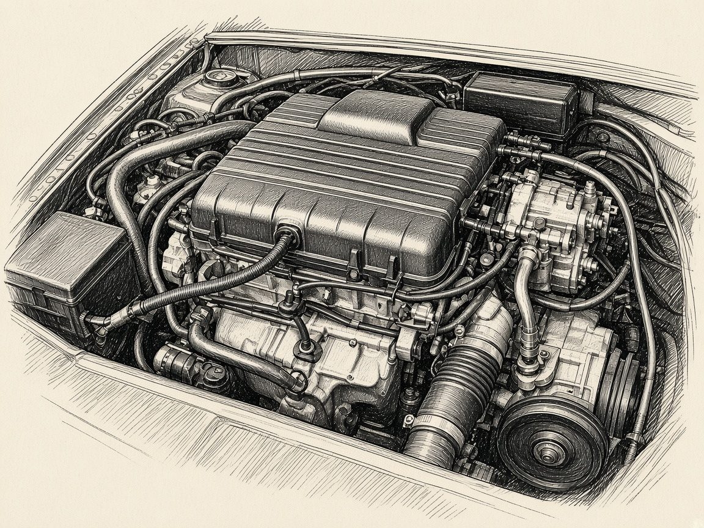

*폭스바겐 1.9 TDI. 세금이 만든 디젤.*

유럽은 오일쇼크에 다른 방식으로 대응했다. 여기에도 세금이 결정적이었다. 유럽 각국은 석유 소비를 줄이고 재정을 확보하기 위해 휘발유에 무거운 세금을 매겼고, 산업용·물류용 연료인 경유에는 상대적으로 낮은 세율을 적용했다. 2000년대 후반부터는 독일을 비롯한 다수 국가가 자동차세에 **이산화탄소 배출량 기준**을 도입했고, EU 차원의 제조사 평균 CO2 규제(2020~21년 95g/km)도 이산화탄소 배출이 적은 디젤에 유리했다. 속도 무제한 구간이 있는 아우토반은 "시속 200km로 몇 시간을 달려도 무너지지 않는 엔진"이라는 설계 목표를 강요했다.

이 조건 아래 독일은 **디젤의 정밀화**에 승부를 걸었다. 1990년대 커먼레일 직분사와 터보의 결합(TDI, CDI)은 디젤을 승용 엔진의 주류로 만들었다. 2000년대 들어서는 가솔린에도 직분사와 터보를 결합한 **다운사이징**(폭스바겐 TSI, BMW 트윈파워 터보)이 독일 엔진의 정체성이 됐다.

그러나 이산화탄소에 유리한 디젤은 질소산화물(NOx)에 불리했다. 유로 5, 유로 6으로 NOx 기준이 강화되자 값비싼 요소수(SCR) 장치 없이는 기준을 맞추기 어려웠다. 그리고 2015년, 그 틈에서 엔진의 연비와 성능을 가지고 장난을 친 디젤게이트가 터진다(22장).

## 11장. 2008년, 디트로이트의 두 번째 추락과 머슬카의 두 번째 죽음

> **[이 시대의 엔진] 크라이슬러 6.2L 슈퍼차저 헤미 '헬캣' (2015~2023)**
>
> 슈퍼차저를 단 6.2L V8. 2015년 닷지 챌린저 SRT 헬캣에서 707마력을 냈다. 1970년 LS6의 450마력을 45년 만에 가볍게 넘어선 숫자다. 기술은 그 사이 엄청나게 발전했지만, 이 엔진은 영광의 귀환이 아니라 **마지막 불꽃**이었다. 2023년 12월 헤미 머슬카 생산이 끝나며 헬캣도 함께 퇴장했다.

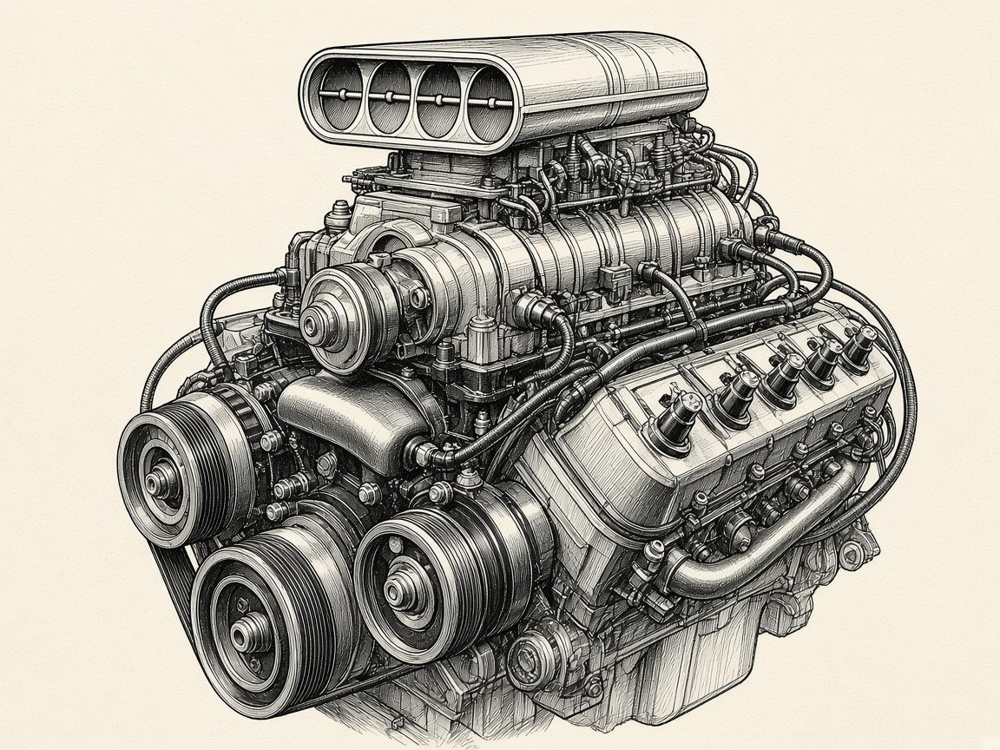

*헬캣 슈퍼차저 헤미 V8. 머슬카의 마지막 불꽃.*

말레이즈 시대를 버틴 머슬카는 2000년대 중반 복고 열풍으로 부활했다. 2005년 레트로 디자인의 포드 머스탱, 2008년 닷지 챌린저, 2010년 쉐보레 카마로가 돌아왔다. 직분사와 가변 밸브, 실린더 비활성화 덕분에 V8은 다시 숨을 쉴 수 있었다.

그러나 부활은 위태로운 토대 위에 서 있었다. 2000년대 미국 경제는 주택 가격 상승과 손쉬운 대출에 기대어 있었고, 디트로이트는 그 돈으로 팔리는 대형 SUV와 픽업에 이익을 의존했다. 2008년 서브프라임 금융위기는 그 구조를 한 번에 무너뜨렸다. 유가는 배럴당 140달러를 넘었다가 폭락했고, 할부 금융이 얼어붙었으며, 대형차 판매는 절벽처럼 떨어졌다. 2009년 GM과 크라이슬러는 연방 파산보호를 신청했다. 크라이슬러는 피아트의 품에 안겼다가 2021년 푸조시트로엥과 합쳐 스텔란티스로 재편됐다. 미국 엔진의 운명은 1979년에 이어 다시 한번 미국 경제의 운명과 겹쳤다.

결정타는 규제였다. 강화된 연비·온실가스 기준 아래 대배기량 V8 쿠페는 '팔수록 벌금이 쌓이는' 상품이 됐다. 2023년 12월 닷지 챌린저와 차저의 헤미 V8 생산이 끝났고, 2024년 1월 쉐보레 카마로가 단종됐다. 후속 차저는 전기차와 3.0L 직렬 6기통 트윈터보로 바뀌었다. 포드 머스탱만이 V8을 지키는 마지막 머슬카로 남았다.

## 12장. 돌아오지 않는 황금기 - 노스탤지어, 면허 없는 세대, 사라지는 튜닝 문화

> **[이 시대의 엔진] 토요타 2JZ-GTE 3.0L 직렬 6기통 트윈터보 (1991~2002)**
>
> 4세대 수프라의 심장. 주철 블록이 워낙 튼튼해서, 튜너들은 순정 블록 그대로 1,000마력 넘게 끌어올리곤 했다. 1990년대 일본 튜닝 잡지와 비디오게임, 그리고 2001년 영화 〈분노의 질주〉의 오렌지색 수프라를 통해 전 세계 젊은이들의 우상이 됐다. **엔진을 '뜯어고칠 수 있는 장난감'으로 사랑하던 마지막 세대의 전설**이다.

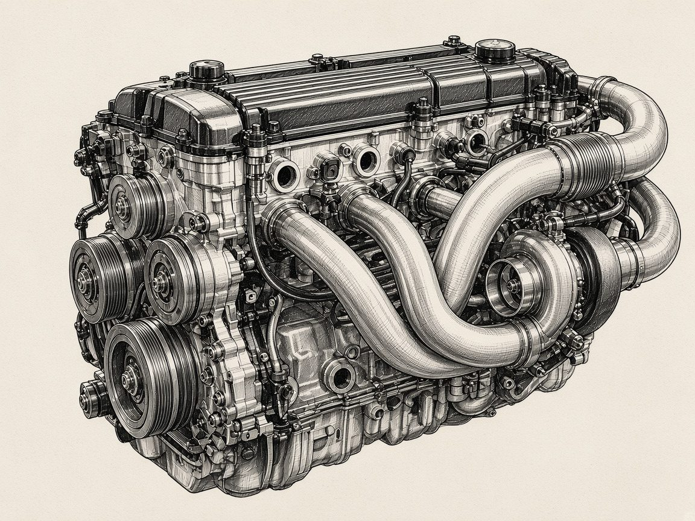

*토요타 2JZ-GTE. 튜닝 세대가 기억한 직렬 6기통.*

### 은퇴한 베이비붐 세대의 차고

애리조나의 클래식카 경매장에는 해마다 은발의 남성들이 모여든다. 그들이 수십만 달러를 부르며 경쟁하는 것은 1969년식 카마로, 1970년식 헤미 쿠다, 1967년식 셸비 GT500 같은 차들이다. 그들은 차를 사는 것이 아니라 열여섯 살의 토요일 밤과 추억을 되사는 중이다.

머슬카의 황금기가 돌아오지 않는 이유는 단지 규제 때문이 아니다. 그 황금기를 떠받치던 조건, 즉 **값싼 석유, 넘치는 중산층 일자리, 교외의 팽창, 그리고 자동차를 자유로 여기던 젊은 세대**가 모두 사라졌기 때문이다. 1960년대 공장 노동자의 아들이 할부로 살 수 있던 머슬카의 정신적 후계자, 고성능 V8 쿠페는 이제 미국 중위 가구 연소득에 맞먹는 값을 한다. 머슬카는 20대의 청춘에서 60~70대의 수집품이 됐다.

노스탤지어에도 세대교체가 일어난다. 클래식카 시장에서는 베이비붐 세대가 열광하던 1960~70년대 머슬카 대신, 밀레니얼 세대가 어린 시절 포스터와 비디오게임으로 동경했던 1980~90년대 일본 스포츠카와 유럽 핫해치의 인기가 오르고 있다는 분석이 꾸준히 나온다. 노스탤지어의 대상이 미국의 V8에서 일본의 직렬 6기통으로 옮겨가는 것, 그것 자체가 지난 50년 엔진 권력의 이동을 보여준다.

### 사라져 가는 튜닝 문화

자동차를 사랑하던 시대에는 **튜닝**이 있었다. 1930~50년대 미국 캘리포니아의 마른 호수 바닥에서 핫로드족이 포드 V8을 개조해 속도를 겨뤘고, 1963년에는 튜닝 부품 업체들의 협회(SEMA)가 생겼다. 1980~90년대 일본에서는 튜닝 잡지와 서킷, 산길 드리프트 문화가 꽃폈다. 만화 〈이니셜 D〉는 두부 배달 소년의 AE86을 전설로 만들었고, 〈분노의 질주〉는 그 일본 튜닝 문화를 전 세계로 수출했다. 한국에서도 2000년대 초반 젊은이들이 동호회를 만들어 아반떼와 투스카니의 흡기와 배기를 바꾸고, 주말이면 영종도와 자유로에 모였다.

튜닝은 엔진을 이해하는 학교였다. 캠샤프트의 프로파일을 바꾸면 무엇이 달라지는지, 터보의 부스트를 올리면 어디가 먼저 망가지는지, 젊은이들은 손에 기름을 묻혀가며 배웠다. 그 차고에서 수많은 엔지니어와 레이서가 자랐다.

그러나 지금 그 문화는 조용히 저물고 있다. 이유는 여러 겹이다. 배출가스 규제는 흡배기 개조를 사실상 불법으로 만들었고, ECU - 엔진 제어 컴퓨터는 암호화되어 손대기 어려워졌다. 차는 수십 개의 전자 제어 장치가 얽힌 '바퀴 달린 컴퓨터'가 됐고, 전기차에는 개조할 흡기도 배기도 캠샤프트도 없다. 무엇보다 튜닝을 할 젊은이들이 더 이상 차를 사지 않는다.

### 운전면허를 따지 않는 손녀

미국 연방도로청 자료에 따르면 **운전면허를 가진 19세 비율은 1983년 87.3%에서 2022년 68.7%로 꾸준히 떨어졌다.** 1960년대라면 상상할 수 없던 일이다.

이유는 복합적이다. 

첫째는 돈이다. J.D. 파워에 따르면 미국 평균 신차 가격은 2019년 이후 32% 넘게 올랐고, 젊은 운전자의 보험료는 해마다 가파르게 뛰었다. 학자금 대출을 안고 사회에 나온 세대에게 자동차는 자유가 아니라 매달 빠져나가는 할부금과 보험료다. 

둘째는 기술이다. 베이비붐 세대에게 자동차가 친구를 만나러 가는 수단이었다면, Z세대는 스마트폰으로 친구를 만난다. 차량 호출 앱은 소유하지 않고도 이동할 수 있게 해줬다. 셋째는 공간이다. 젊은 세대는 부모 세대가 떠났던 도심으로 돌아오고 있고, 도심에서 자동차는 주차비와 정체를 의미한다.

이 흐름은 미국만의 것이 아니다. 일본에서는 젊은 세대의 자동차 이탈을 가리키는 '구루마바나레(車離れ)'라는 말이 2000년대부터 쓰였다. 한국에서도 MZ세대가 차를 '사는 것'보다 '빌리는 것'을 택하는 흐름이 뚜렷해졌다. 마이카가 가족의 자부심이던 아버지 세대와, 차를 소유하지 않는 것이 합리적이라고 여기는 자녀 세대 사이에는 한 세대 만에 깊은 강이 흘렀다.

이 변화는 엔진의 미래에 직접적인 의미를 갖는다. 1960년대의 젊은이는 엔진의 배기량과 마력을 외우고 다녔다. 1990년대의 젊은이는 엔진을 직접 뜯어 고쳤다. 지금의 젊은이는 배터리 용량이나 충전 속도조차 크게 관심을 두지 않는다. 그들이 차에서 원하는 것은 스마트폰과의 연결, 자율주행 보조, 그리고 낮은 총소유비용이다. **엔진이 정체성이던 시대에서 엔진이 보이지 않는 부품이 되는 시대로**, 소비자의 감수성 자체가 바뀌었다.

1962년의 소년에게 V8의 배기음은 자유의 소리였다. 1995년의 튜너에게 2JZ의 터보 소리는 자신이 만든 작품의 소리였다. 2026년의 소녀들에게 그 소리는 소음이다. 황금기는 돌아오지 않는다. 기술이 사라져서가 아니라, 그 기술을 사랑할 이유를 가진 세대가 사라지고 있기 때문이다. 그 상실이 전승되지 못한 한 세대의 기억이기에 서글프다.

# 2부. 엔진의 해부 - 기술, 효율, 하이브리드, 고질병

> **이 부에서 다루는 것**: 열효율 숫자를 읽는 법, 현기차·일본·독일·미국·중국 다섯 진영의 엔진 기술, 하이브리드의 다섯 가지 철학과 미국의 실패, 각 진영의 고질병, 그리고 '열효율 50%의 벽'. 1부가 엔진을 만든 시대의 이야기였다면, 2부는 그 결과물인 엔진 자체를 뜯어보는 시간이다.

## 13장. 먼저, 열효율 숫자 읽는 법

> **[이 시대의 엔진] 토요타 A25A-FXS 2.5L 다이내믹 포스 (2017~)**
>
> 캠리·RAV4 하이브리드에 얹힌 2.5L 4기통. 엔진 단독 최고 열효율 41%를 발표했다. 연료 에너지의 41%를 바퀴를 돌리는 일로 바꾼다는 뜻이다. 1960년대 V8이 20%대 초반에 머물렀던 것을 떠올리면 반세기 동안 거의 두 배가 된 셈이다. **'효율의 시대'를 상징하는 일본 엔진의 정점** 가운데 하나다.

> **[박스] 열효율 수치를 볼 때 알아야 할 것**
>
> 이 글에 나오는 "41%", "42%", "46%" 같은 수치는 모두 **제동열효율(BTE)의 최고점**이다. 엔진이 가장 효율 좋은 특정 회전수·부하 조건에서 연료 에너지의 몇 %를 크랭크축의 일로 바꾸는지를 나타낸다. 실제 도로에서 엔진은 그 최고점에 머무는 시간이 짧기 때문에, 일반 내연기관의 주행 평균 효율은 20~30%대에 그친다.
>
> 하이브리드가 강한 이유도 여기에 있다. 모터가 저속·저부하 구간을 맡아주면 엔진은 최고 효율점 근처에서만 일할 수 있다.
>
> 같은 '최고 열효율'이라도 조건이 다르다. 토요타 41%는 엔진 단독 최고점, 닛산 42%는 발전 전용 운전점, BYD 46.06%와 지리 46.5%는 플러그인 하이브리드 전용 엔진의 발표치다. 모두 제조사 발표 수치이며, 같은 조건에서 측정한 공인 비교값이 아니다. 중국 메이커들끼리도 "누구 엔진이 진짜 최고냐"를 두고 인증서를 흔들며 설전을 벌일 정도다. 소비자에게 더 의미 있는 비교는 공인 복합 연비와 실주행 연비다.

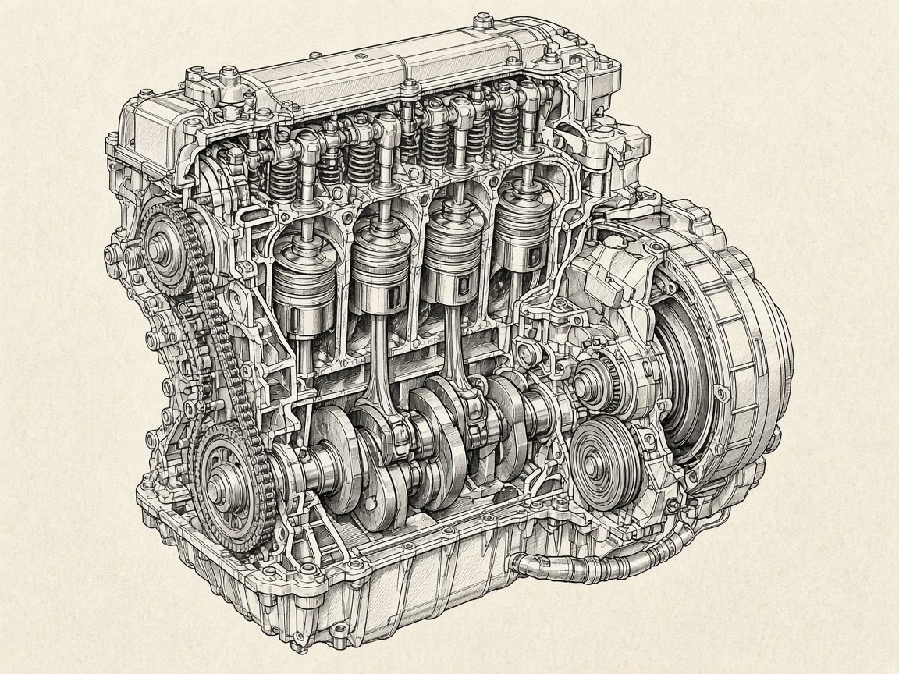

*토요타 A25A-FXS 계열. 효율의 시대가 읽는 엔진.*

## 14장. 다섯 진영의 기술과 효율

> **[이 시대의 엔진] BMW B58 3.0L 직렬 6기통 터보 (2015~)**
>
> 실린더당 500cc 모듈 설계로 3기통·4기통과 부품을 공유하는 직렬 6기통. 부드럽고, 강하고, 튼튼하다는 평가를 동시에 받는 드문 엔진이다. 토요타 수프라, 이네오스 그레나디어, 모건까지 경쟁사들이 가져다 쓴다. **"남이 사서 쓰는 엔진"이야말로 엔진 기술의 최고 훈장**이라면, B58은 현역 내연기관의 정점에 서 있다.

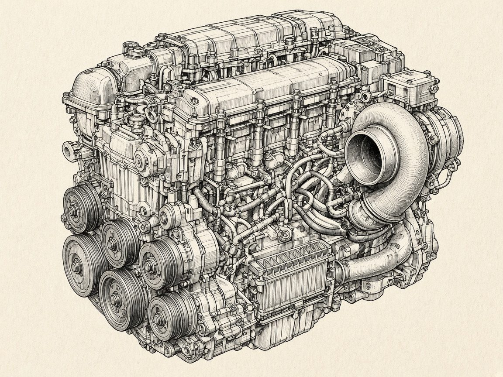

*BMW B58. 현역 내연기관의 정점 근처.*

### 현대·기아 - 가장 빠른 추격자에서 파워트레인 백화점으로

현기차의 최신 엔진은 **스마트스트림(Smartstream)** 패밀리로 수렴된다. 2019년 쏘나타에 세계 최초로 양산 적용된 **CVVD(연속 가변 밸브 듀레이션)** 는 밸브가 열리는 '시점'뿐 아니라 열려 있는 '기간'까지 주행 조건에 따라 바꾸는 기술로, 현기차가 처음으로 "세계 최초"를 붙일 수 있었던 엔진 기술이다. 여기에 350bar 고압 직분사, 포트 분사와 직분사를 겸한 듀얼 인젝션, 저압 EGR, 통합 열관리 모듈이 결합된다.

하이브리드 전용 1.6 가솔린의 최고 열효율은 회사 발표 기준 약 40% 안팎이다. 2025년에는 차세대 하이브리드 시스템과 함께 **2.5 터보 하이브리드**를 팰리세이드에 처음 얹었다(15장). 현기차 엔진의 성격을 한 줄로 요약하면 "일본의 효율 지향과 독일의 터보 직분사를 빠르게 흡수해, 소형차부터 대형 SUV까지 거의 모든 파워트레인 조합을 자체 생산하는 능력"이다.

### 일본 - 열효율의 정점, 그리고 다양한 독자 노선

일본 엔진의 지향점은 열효율과 내구성이다. 토요타 다이내믹 포스 2.5L 하이브리드 엔진은 41%, 혼다 2.0L 하이브리드 엔진은 40.6% 수준의 최고 열효율을 발표했다. 닛산은 2025년 유럽에 투입한 3세대 e-POWER용 1.5L 터보 엔진에서 42%를 발표했다. 밸브 시트를 실린더 헤드에 금속 분말로 직접 적층하는 콜드 스프레이 공법으로 흡기 포트 형상을 최적화한 결과다.

그러나 "일본 엔진 = 토요타·혼다·닛산의 효율 좋은 직렬 4기통"이라는 도식은 일본 엔진의 다양성을 가린다. 

**마쓰다**의 **스카이액티브-X**(2019)는 점화 플러그로 작은 불씨를 만든 뒤 그 압력으로 나머지 희박 혼합기를 디젤처럼 압축 착화시키는 **SPCCI(불꽃 제어 압축 착화)** 방식이다. 가솔린 엔진에서 디젤의 효율을 얻으려는, 업계가 수십 년간 꿈꿔온 균일 압축 착화(HCCI)에 가장 가까이 간 양산 시도였다. 마쓰다는 또 한 번 포기했던 **로터리 엔진**을 2023년 MX-30 R-EV의 발전용 엔진으로 되살렸다.

**스바루**의 **수평대향(박서) 엔진**은 피스톤이 좌우로 마주 보고 움직이며 진동을 상쇄하고, 엔진 높이가 낮아 무게중심을 끌어내린다. 대신 엔진 폭이 넓어 점화 플러그 교체 같은 기본 정비조차 번거롭다. 2차 세계 대전 이후 스바루는 늘 같은 엔진의 문제를 가졌지만 그 특유의 달리는 느낌은 북미에서 사랑 받아 왔다.

**닛산 VC-터보**(2018)는 멀티링크 기구로 피스톤의 상사점 높이를 바꿔 **압축비를 8:1에서 14:1 사이로 연속 가변**한다. 내연기관의 오랜 난제였던 가변 압축비를 처음 양산한 사례다.

**미쓰비시**는 GEMA의 형제 엔진 4B1 계열로 2013년 **아웃랜더 PHEV**, 세계 최초의 양산형 SUV 플러그인 하이브리드를 만들었다. 현대가 설계를 주도한 엔진의 형제가 SUV PHEV 시대를 연 셈이다.

**스즈키**는 경량·소배기량이라는 일본 엔진의 원형을 가장 충실히 지킨다. 가벼운 3·4기통 엔진과 마일드 하이브리드로 인도 시장(마루티 스즈키)에서 압도적 점유율을 유지하며, 토요타와 자본 제휴를 맺고 있다.

### 독일 - 다운사이징 터보와 모듈러 직렬 6기통

독일 엔진의 정체성은 **소배기량 고과급 터보와 고정밀 직분사**에 있다. 폭스바겐 EA888 2.0 TSI는 세대를 거듭하며 다운사이징 엔진의 표준을 세웠고, 최신 **EA888 evo4**는 분사 압력을 350bar까지 높이고 배기 후처리를 강화했다. 1.5 TSI evo2는 가변 지오메트리 터보와 밀러 사이클을 결합하고, 경부하에서 4기통 중 2기통을 쉬게 하는 **실린더 비활성화(ACT)** 를 쓴다. 미국이 V8에서 쓰던 기술을 독일은 1.5L 4기통에 적용한 것이다.

BMW는 모듈 설계로 3기통(B38), 4기통(B48), 6기통(B58)이 부품을 공유하는 구조를 만들었다. B48은 **횡치(전륜)와 종치(후륜) 양쪽에 탑재 가능**하다는 점에서 19장의 이야기와 직결된다. 메르세데스는 직렬 6기통 **M256**과 4기통 **M254**에 48V 통합 스타터 제너레이터를 결합했고, 고성능 AMG 버전에는 F1에서 가져온 전동식 배기 터보차저까지 넣었다. 디젤에서는 메르세데스 OM654가 실린더 벽을 금속 용사로 코팅하는 나노슬라이드로 마찰을 줄였다.

독일 엔진의 강점은 단일 수치의 열효율보다 **고속·고부하 영역에서의 효율과 출력 밀도**에 있다. 아우토반과 CO2 세제가 함께 만든 성격이다.

### 미국 - V8을 포기하지 않는 세 가지 방법

미국이 V8을 지켜낸 데는 규제 구조가 결정적이었다. 2011년 이후 CAFE는 차량 **바퀴 간 면적(풋프린트)** 에 따라 연비 목표를 다르게 매기는 방식으로 바뀌었다. 차체가 클수록 목표가 느슨해지고, 픽업과 SUV는 완화된 '경트럭' 기준을 적용받는다. 큰 차에 큰 엔진을 유지하면서 효율 기술을 덧붙이는 편이 합리적이었다.

첫째는 **V8을 작게 쓰는 것**이다. GM의 AFM·DFM과 스텔란티스의 MDS는 경부하 시 일부 실린더를 꺼서 연비를 개선한다. 둘째는 **V8을 대체하는 다운사이징**이다. 포드 3.5L V6 트윈터보 에코부스트는 F-150의 주력이 됐고, GM은 실버라도에 2.7L 4기통 터보를 얹었다. 셋째는 역설적이게도 **규제 시대에 새로 만든 대배기량 V8**이다. 포드의 7.3L 푸시로드 V8 '고질라'(2020)는 터보도 직분사도 없는 단순한 구조로 대형 픽업 고객을 겨냥했다. 중대형 픽업에서는 **커민스 6.7L 직렬 6기통 터보디젤**이 램 헤비듀티의 상징으로 군림한다.

### 중국 - 엔진을 건너뛴 줄 알았던 나라의 반격

중국은 내연기관에서 후발주자였다. 합자 시대 30년 동안 엔진의 핵심 설계 기술은 외국 파트너 손에 있었다. 그래서 흔히 "중국은 엔진을 포기하고 전기차로 건너뛰었다"고 말한다. 절반만 맞는 말이다.

중국은 '바퀴를 직접 굴리는 전통적인 엔진' 경쟁에서는 승부를 피했지만, **하이브리드 전용 엔진**에서는 오히려 세계 최고 수준을 주장하고 나섰다. BYD는 2008년 세계 최초로 도로를 달린 양산 플러그인 하이브리드 F3DM을 내놓았고, 2024년 5월 공개한 **5세대 DM 기술**의 1.5L 엔진이 **열효율 46.06%** 로 세계 최고라고 발표했다. 지리는 곧바로 자사 엔진의 인증서를 내밀며 반박했고, 같은 해 10월 공개한 하이브리드 시스템 EM-i의 엔진 열효율을 **46.5%** 라고 발표했다. 제조사 발표치이고 측정 조건도 각자 다르지만, 일본 메이커들이 41~42%를 발표하던 시점에 중국 메이커들이 46%대를 놓고 다툰다는 사실 자체가 상징적이다.

비결은 일본식 하이브리드 철학의 극단화다. 이 엔진들은 처음부터 **플러그인 하이브리드 전용**으로 설계됐다. 배터리가 크고 모터가 강하니 엔진은 거의 발전기처럼 좁은 운전 영역에서만 일하면 된다. 그 영역 하나에 모든 설계를 집중하면 열효율 숫자는 극단적으로 올라간다. 지리는 볼보의 엔진 기술을 흡수했고, 르노와 합작한 파워트레인 회사 **호스(Horse)** 를 세워 남의 엔진까지 대신 생산한다. 벤츠의 M252가 그 대표적인 사례다(19장).

정리하면 이렇다. 중국은 **"엔진이 주인공인 게임"에서는 물러났지만, "엔진이 조연인 게임"에서는 가장 공격적인 플레이어**가 됐다. 그리고 그 게임의 판, 즉 배터리·모터·전력전자 생태계는 이미 중국이 장악하고 있다.

## 15장. 하이브리드에 성공한 엔진들, 그리고 실패한 엔진들

> **[이 시대의 엔진] 토요타 1NZ-FXE 1.5L 앳킨슨 사이클 (1997년 초대 프리우스)**
>
> 압축보다 팽창을 길게 쓰는 앳킨슨 사이클 4기통. 혼자서는 힘이 약했지만 모터와 짝을 이루자 세상에서 가장 경제적인 엔진이 됐다. 1997년 교토 기후회의가 열리던 해에 출시된 프리우스와 함께, **"엔진을 혼자 일하게 두지 않는다"** 는 하이브리드 철학을 세상에 내놓았다.

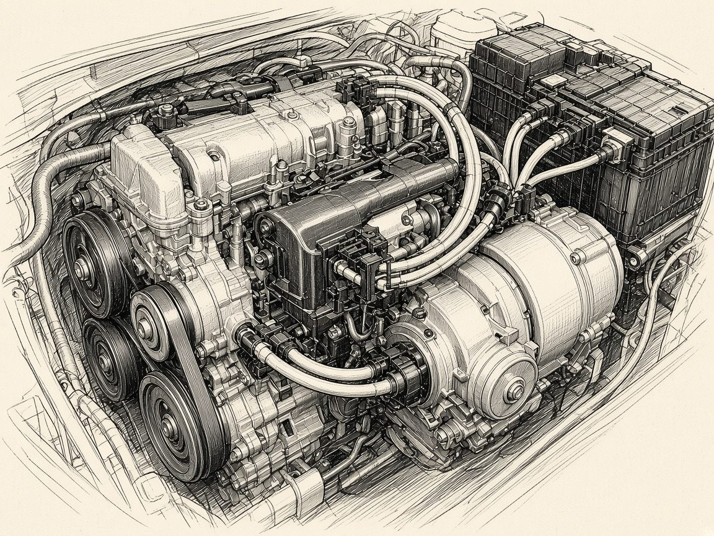

*프리우스 하이브리드. 유성기어 하나로 세계를 바꾼 심장.*

전기차가 늦어지면서 진짜 승자로 떠오른 것은 하이브리드다. 그러나 '하이브리드'라는 한 단어 안에는 전혀 다른 철학들이 숨어 있다.

### 토요타 THS - 유성기어 하나로 세계를 바꾸다

토요타의 **THS(토요타 하이브리드 시스템)** 는 엔진, 발전기, 구동 모터를 **유성기어 하나**로 묶는 '동력 분배식' 구조다. 변속기 없이도 엔진 회전수와 바퀴 속도를 자유롭게 분리할 수 있어, 엔진은 늘 가장 효율 좋은 지점에서 돌고 남거나 모자란 힘은 모터가 채운다. 토요타는 수십 년간 이 시스템을 다듬으며 특허를 쌓았고, 전기차 캐즘이 찾아오자 사상 최대 이익으로 보상받았다.

### 혼다 e:HEV - 사실상 전기차, 고속에서만 엔진 직결

혼다의 **e:HEV** 는 평소에는 엔진이 발전기만 돌리고 바퀴는 모터가 굴리는 **직렬형**으로 달린다. 그러다 고속 순항처럼 엔진이 직접 바퀴를 돌리는 편이 효율적인 구간에서만 **클러치를 연결해 엔진이 바퀴를 직접 구동**한다. 유성기어 대신 클러치 하나로 직렬과 병렬을 전환한다.

### 닛산 e-POWER - 엔진은 오직 발전기

닛산 **e-POWER**는 엔진과 바퀴를 아예 기계적으로 연결하지 않는 **완전 직렬형**이다. 엔진을 특정 운전점에 최적화할 수 있어 42%라는 발표치가 나왔다. 단점은 고속에서 '엔진→발전기→모터→바퀴'의 이중 변환 손실이 커진다는 것이다. 장거리 고속도로가 많은 미국에서 e-POWER가 힘을 쓰지 못한 이유다.

### 현대 TMED - 진짜 변속기를 가진 하이브리드

현대차의 **TMED** 는 엔진과 변속기 사이에 클러치와 모터를 넣고 그 뒤에 **실제 6단 자동변속기**를 단 '병렬형'이다. 고속에서 엔진이 변속기를 통해 효율적으로 바퀴를 굴리고, 운전 감각도 일반 자동변속기 차량에 가깝다. 2025년 공개된 **TMED-II**는 엔진 쪽에 시동·발전을 전담하는 모터를 하나 더 넣어 두 개의 모터를 내장했다. 이 모터가 엔진의 시동과 발전을 맡으면서 엔진에서 보조 벨트·알터네이터·에어컨 컴프레서 구동을 덜어냈다. 시스템 출력 범위가 100마력 초반부터 300마력 중반까지 넓어지면서 소형차부터 대형 SUV, 제네시스 후륜구동까지 하이브리드를 확장할 수 있게 됐다. 독자 엔진과 독자 변속기를 모두 가진 회사만 할 수 있는 조합이다.

### BYD DM-i와 지리 EM-i - 플러그를 꽂는 '전기 중심' 하이브리드

중국식 하이브리드는 **전기가 주인공**이다. 큰 배터리와 강한 모터가 대부분의 주행을 맡고, 엔진은 배터리가 줄었을 때 발전하거나 고속에서 거드는 역할만 한다. 일본식 하이브리드가 "엔진을 모터가 돕는" 구조라면, 중국식은 "모터를 엔진이 돕는" 구조다. 그래서 엔진은 더 좁은 영역에 최적화되고, 46%대라는 숫자가 나온다. BYD는 이 기술로 중국 플러그인 하이브리드 시장의 절반가량을 차지했다. 미쓰비시가 2013년 SUV PHEV의 문을 열었다면, 그 문을 대중 시장으로 넓힌 것은 중국이었다.

### 실패한 하이브리드 - 미국은 왜 뒤처졌는가?

일본과 중국이 하이브리드 패권을 나눠 갖는 동안, 미국은 왜 성공한 하이브리드를 만들지 못했을까. 시도가 없었던 것은 아니다.

포드는 2004년 **이스케이프 하이브리드**로 미국 최초의 하이브리드 SUV를 내놓았고, 이를 위해 토요타와 일부 하이브리드 특허 라이선스 계약을 맺기도 했다. 지금 포드 매버릭 하이브리드는 그 계보를 이은 성공작이다. GM은 2005년 다임러크라이슬러·BMW와 손잡고 **'투 모드 하이브리드'** 를 개발해 대형 SUV에 얹었지만, 시스템은 복잡하고 비쌌으며 판매는 부진했다. GM은 이후 하이브리드를 건너뛰고 쉐보레 **볼트**라는 주행거리 연장형 전기차로 갔지만 볼트도 2019년 단종됐다.

실패의 원인은 기술보다 구조에 있었다. 첫째, **값싼 연료**. 하이브리드의 연료비 절감이 비싼 차값을 회수하기에 부족했다. 둘째, **장거리 고속 주행 문화**. 하이브리드의 이점이 줄어든다. 셋째, **풋프린트 CAFE와 픽업 이익 구조**. 디트로이트의 이익은 V8 픽업에서 나왔다. 넷째, **2009년 파산**. 장기 파워트레인 연구가 대폭 줄었다. 다섯째, **전략의 건너뛰기**. GM은 하이브리드를 과도기 기술로 보고 곧장 전기차로 가려 했다. 그 사이 하이브리드 특허와 노하우는 토요타·혼다·현대·BYD에 쌓였다. 20년 전 건너뛴 계단을 미국은 이제야 다시 오르고 있다.

## 16장. 고질병 - 효율의 대가

> **[이 시대의 엔진] 현대 세타 II 2.0/2.4L GDi (2010년대 초중반 모델)**
>
> 세계에 로열티를 받고 판 세타 엔진의 후속작이자, 현기차 엔진사의 가장 아픈 이름. 가공 이물질 하나가 베어링을 막아 수백만 대 리콜과 사상 최대 규모의 미국 제재금으로 이어졌다. 이 엔진은 한 가지 교훈을 남겼다. **엔진을 독자 개발할 능력과, 그 엔진을 수백만 대 동안 한결같이 만드는 능력은 다르다.**

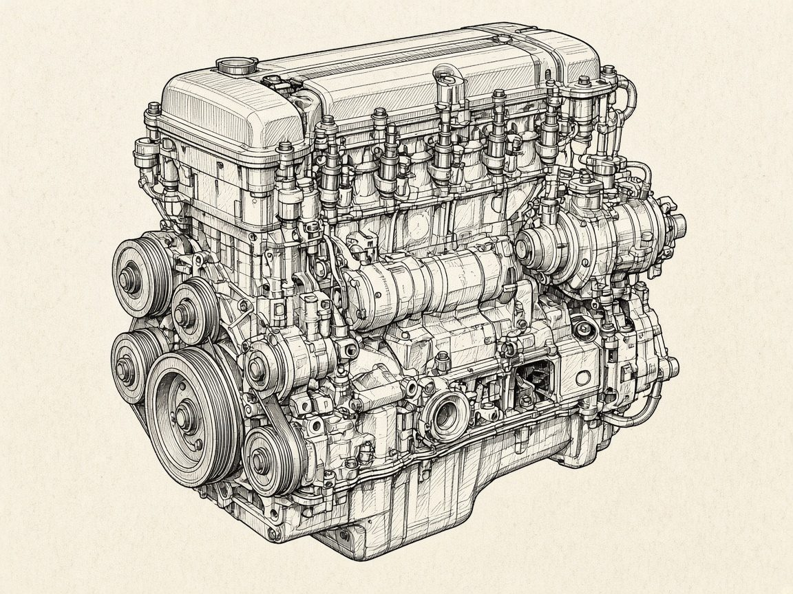

*세타 II GDi. 효율의 대가, 베어링의 그림자.*

엔진의 결함은 대개 그 엔진이 가장 자랑하는 기술에서 나온다. 효율을 위해 더한 복잡성이 곧 약점이 된다.

### 현대·기아 - 세타 II의 그림자, 그리고 현재 진행형 숙제

세타 II는 크랭크샤프트 가공 과정에서 남은 금속 이물질이 커넥팅 로드 베어링의 오일 통로를 막으면서 베어링 소착, 엔진 정지, 일부 화재로 이어졌다. 미국에서만 수백만 대 규모의 리콜이 이어졌고, 2020년 미국 도로교통안전국(NHTSA)은 리콜 지연을 이유로 현대 1억 4,000만 달러, 기아 7,000만 달러, 합계 최대 2억 1,000만 달러의 민사 제재금을 부과했다. 당시 NHTSA 역사상 최대 규모였다. 현기차는 노크 센서로 베어링 이상을 조기 감지하는 KSDS 소프트웨어를 배포하고 해당 엔진에 평생 보증을 제공했으며, 국내외 충당금은 수조 원에 달했다.

현재 진행형 숙제도 있다. 스마트스트림 1.6 터보 계열은 국내에서 엔진오일이 오히려 늘어나는 현상(연료 혼입)이 제기돼 소프트웨어 개선과 보증 연장 조치가 있었다. 직분사 엔진은 흡기 밸브에 카본이 쌓이기 쉽고, 하이브리드 차량은 엔진이 자주 꺼졌다 켜지며 충분히 데워지지 않은 상태로 운전되는 시간이 길어 카본과 오일 희석에 더 취약할 수 있다. 하이브리드를 두 배 이상 늘리겠다는 현기차에게 장기 내구성 검증은 피할 수 없는 과제다.

### 일본 - 무결점 신화의 균열

혼다의 **1.5L 터보 직분사 엔진**(2016~2018년식 시빅, 2017~2018년식 CR-V 등)은 **오일 희석**으로 홍역을 치렀다. 영하의 기온에서 엔진이 정상 온도에 도달하기 전에 운행을 끝내는 짧은 주행이 반복되면, 차가운 실린더 벽에 맺힌 연료가 피스톤 링을 타고 오일 팬으로 흘러든다. 문제가 캐나다와 중국 북부 같은 한랭지에 집중된 이유다. 혼다는 2018년 중국에서 대규모 리콜을, 북미에서는 소프트웨어 업데이트와 보증 연장을 실시했다.

토요타도 예외가 아니다. 2000년대 후반 2.4L 2AZ-FE 엔진은 피스톤 링 설계 문제로 과도한 오일 소모를 일으켜 보증 연장 프로그램이 운영됐다. 최근에는 툰드라와 렉서스 LX의 3.4L V6 트윈터보(V35A)에서 가공 이물질이 메인 베어링에 남아 엔진 고장으로 이어질 수 있다는 이유로 2024년 대규모 리콜이 실시됐다. 공교롭게도 세타 II와 같은 유형의 결함이다. 스바루 구형 EJ25의 헤드 개스킷 누유, 닛산의 자트코 CVT 내구성 문제까지 더하면, "일본차는 고장 나지 않는다"는 말은 신화에 가깝다.

### 독일 - 타이밍 체인과 "정상적인 오일 소모"

독일 엔진의 고질병은 **타이밍 체인 시스템**에 집중된다. BMW N20 가솔린 4기통은 플라스틱 체인 가이드가 조기에 마모·파손되고, 그 파편이 오일 픽업을 막아 엔진을 망가뜨리는 결함으로 악명 높았다. N47 디젤은 타이밍 체인이 엔진 뒤쪽(변속기 쪽)에 있어, 체인이 늘어나면 변속기를 내려야 하는 고비용 수리로 이어졌다. 메르세데스 OM651 디젤도 같은 약점을 공유했고, 초기형 피에조 인젝터 결함으로 대규모 교환 조치가 있었다. 폭스바겐 EA888 1·2세대는 타이밍 체인 텐셔너 결함과 오일 소모가, 3세대는 플라스틱 워터펌프 하우징 누수가 문제가 됐다.

독일 제조사들은 1,000km당 0.5~1L 수준의 오일 소모까지 "허용 범위"로 안내하곤 한다. 이 "설계상 정상"에는 기술적 배경이 있다. 첫째, 마찰을 줄이려고 피스톤 링의 장력을 낮추면 실린더 벽의 오일을 긁어내는 힘도 약해진다. 둘째, 실린더 벽의 미세한 크로스해치 가공에 머금은 오일 일부가 매 행정마다 연소실에서 타 없어진다. 셋째, 고과급 터보 엔진은 크랭크케이스 압력이 높아 오일 미스트가 블로바이 가스 환원(PCV) 계통을 통해 흡기로 빨려 들어가 연소된다. 넷째, 연비 인증을 위해 쓰는 저점도 오일은 고온에서 증발 손실이 크다. 요컨대 오일 소모는 **연비 인증 수치를 위해 내구성 여유를 깎은 설계 선택의 결과**다.

### 미국 - 리프터 붕괴의 메커니즘과 대규모 리콜

미국 엔진의 고질병은 V8을 살리기 위해 도입한 **실린더 비활성화 시스템**에서 나온다. 실린더를 끄려면 특수한 유압 리프터 안의 **잠금 핀**을 오일 압력으로 밀어 리프터의 안팎을 분리해야 한다. 오일이 오염되거나 카본 찌꺼기가 미세한 오일 통로를 막으면 핀이 제때 결합하지 못하거나 리프터 내부의 유압이 빠져 **리프터가 주저앉는다**. 리프터 아래쪽 롤러가 구르지 못하고 미끄러지면 롤러가 납작하게 닳고, 그 상대인 **캠 로브까지 깎여 나간다**. 결국 실화가 발생하고, 캠샤프트와 리프터를 통째로 교체하는 큰 수리로 이어진다.

2025년 GM은 6.2L L87 V8의 커넥팅 로드와 크랭크샤프트 제조 결함으로 실버라도, 타호, 에스컬레이드 등 약 59만 7,000대(최초 발표 기준)를 리콜했다. 포드 에코부스트는 1.5/1.6L에서 냉각수가 연소실로 새는 실린더 헤드 결함으로 집단소송을 겪었다. 반대로 고질라 V8과 커민스 6.7이 높은 평판을 유지하는 것은, 미국 엔진의 신뢰성이 결국 "얼마나 단순하게 남았는가"에 달려 있음을 보여준다.

### 중국 - 아직 판단하기 이른 숙제

중국 하이브리드 전용 엔진의 장기 내구성은 아직 평가하기 이르다. 대량 보급이 2021년 이후에야 본격화돼 10만~20만 km를 넘긴 차량 데이터가 충분히 쌓이지 않았기 때문이다. 극단적인 열효율 최적화가 장기 내구성과 어떻게 맞바꿔졌는지는 앞으로 몇 년이 답해 줄 것이다.

## 17장. 더 효율 좋은 엔진 - 50%의 벽 너머

> **[이 시대의 엔진] BYD 5세대 DM용 1.5L 하이브리드 전용 엔진 (2024~)**
>
> 플러그인 하이브리드만을 위해 태어난 1.5L 4기통. BYD는 열효율 46.06%를 발표하며 "세계 최고"를 선언했다. 바퀴를 굴리는 일은 대부분 모터에 맡기고, 자신은 가장 효율 좋은 지점에서 묵묵히 전기를 만든다. **엔진이 주인공에서 '유능한 조연'으로 바뀌는 시대의 상징**이자, 엔진 후발주자 중국이 내민 반격의 카드다.

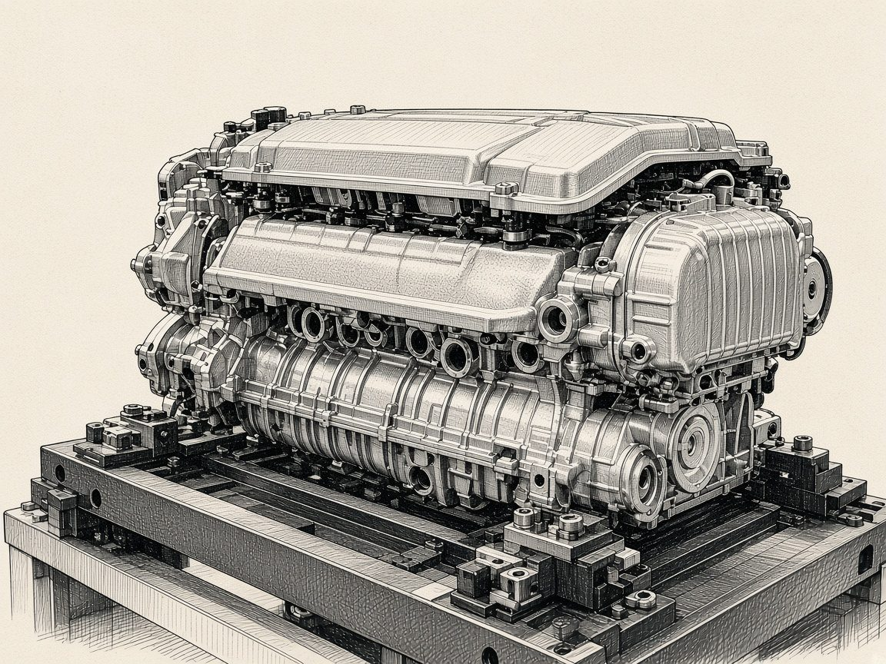

*BYD 5세대 DM 1.5L. 중국 엔진의 반격.*

엔진이 하이브리드의 발전기와 동력원으로 살아남는다면, 그 엔진에게 요구되는 덕목은 출력이 아니라 **열효율과 청정도**다. 엔진 엔지니어들은 지금 '50%의 벽'에 도전하고 있다.

50%는 상징적인 숫자다. 연료가 가진 에너지의 절반을 일로 바꾼다는 뜻이다. 이 벽은 연구실과 서킷에서는 이미 넘어섰다. 메르세데스-AMG는 F1 파워유닛의 열효율이 50%를 넘었다고 발표했고, 일본 정부 주도의 산학 연구 프로젝트도 연구용 엔진에서 50%대 열효율을 달성했다고 밝혔다. 양산 엔진에서는 중국 메이커들이 46%대를 발표하며 그 문턱에 가장 가까이 다가갔다. 문제는 그것을 양산차의 비용과 내구성, 배출가스 기준 안에서 구현하는 일이다.

그 길에 놓인 기술들은 다음과 같다. **초희박 연소**는 공기를 연료보다 훨씬 많이 넣어 태우는 방식이다. 연소 온도가 낮아져 열손실과 NOx가 줄지만 불이 잘 붙지 않는다. 이를 해결하는 열쇠가 **프리챔버(부실) 점화**다. 점화 플러그를 작은 방 안에 넣어 그 안에서 먼저 폭발시킨 뒤 여러 개의 불꽃 제트를 주연소실로 뿜어내는 방식으로, F1에서 먼저 쓰였고 마세라티 네투노 V6 등 양산 고성능 엔진에도 들어왔다. 이는 1972년 혼다 CVCC의 부실 연소 아이디어를 반세기 만에 되살린 것이다. 엔진의 역사는 때때로 원을 그린다.

**고율 EGR**은 배기가스의 일부를 다시 흡기로 돌려 연소 온도를 낮추고 노킹을 억제한다. **밀러·앳킨슨 사이클**은 압축보다 팽창을 길게 써서 효율을 높인다. **하이브리드 전용 엔진**은 넓은 회전 영역을 포기하고 특정 운전점에서만 최고 효율을 내도록 설계된다. 연료 쪽에서도 변화가 있다. 토요타는 수소를 직접 태우는 **수소 엔진**으로 내구 레이스에 출전하며 가능성을 시험하고 있고, 포르쉐는 칠레에서 풍력 전기로 얻은 수소와 공기 중 이산화탄소로 **합성연료(e-fuel)** 를 만드는 시범 사업에 투자했다.

더 효율 좋은 엔진은 결국 하이브리드와 짝을 이룬다. 1960년대의 엔진이 주인공이었다면, 2030년대의 엔진은 유능한 조연이다. 그 조연의 실력을 누가 가장 높이 끌어올리느냐가 다음 10년 엔진 경쟁의 핵심이다. 그리고 그 경쟁의 선두에, 30년 동안 엔진 기술을 배우기만 하던 중국이 서 있다는 사실은 엔진사에서 가장 극적인 반전 중 하나다.

## 18장. 다섯 진영 종합 비교

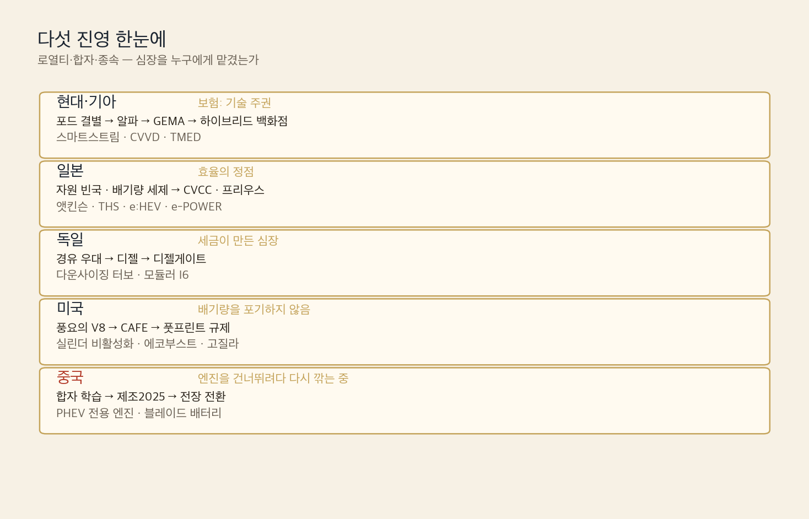

*심장을 누구에게 맡겼는가. 현대·기아의 기술 주권, 일본의 효율, 독일의 세금, 미국의 배기량, 중국의 전장 전환.*

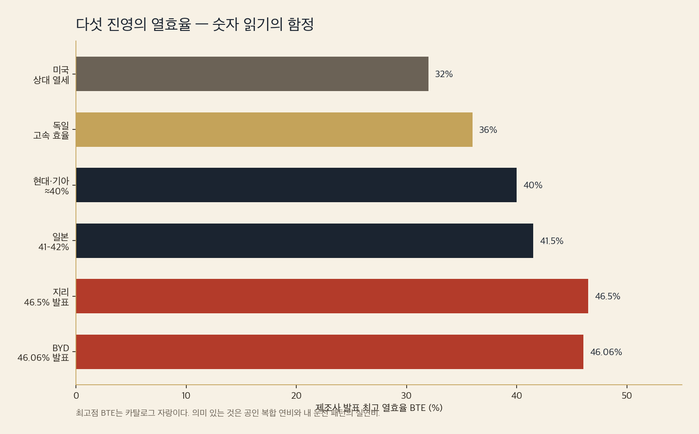

*제조사 발표 최고점 BTE. 카탈로그 숫자가 아니라 실연비를 보라.*

| 진영 | 역사적 전환점 | 대표 기술 | 최고 열효율(제조사 발표, BTE 최고점) | 하이브리드 | 대표적 고질병 |
| --- | --- | --- | --- | --- | --- |
| **현대·기아** | 포드 결별 → 미쓰비시 제휴 → 알파 → GEMA 주도 → 하이브리드 대확장 | 스마트스트림, CVVD | 약 40% 안팎 | TMED/TMED-II(병렬, 실제 변속기) | 세타 II 베어링, 터보 직분사 오일 증가·카본 |
| **일본** | 자원 빈국·배기량 세제 → 오일쇼크 → CVCC·프리우스 | 앳킨슨, SPCCI, VC-터보, 박서, 로터리 | 41~42% | THS·e:HEV·e-POWER·PHEV 모두 보유 | 혼다 1.5T 오일 희석, 토요타 V35A 이물질 |
| **독일** | 경유 우대·CO2 세제·아우토반 → 디젤 → 디젤게이트 | 다운사이징 터보, 모듈러 직렬 6기통, 48V | 고속·고부하 효율 우위 | 48V 마일드·PHEV 중심 | 타이밍 체인, 카본, 오일 소모 |
| **미국** | 풍요의 V8 → 오일쇼크·CAFE → 풋프린트 규제 → 금융위기 | 실린더 비활성화, 에코부스트, 고질라, 커민스 | 상대적 열세 | 투 모드 실패, 포드 일부 성공 | 리프터 붕괴·캠 로브 마모, 대규모 리콜 |
| **중국** | 합자로 기술 학습 → 제조 2025 → 전기차·PHEV로 전장 전환 | PHEV 전용 엔진, 배터리·모터 수직계열화 | 46%대(BYD 46.06%, 지리 46.5% 발표) | DM-i·EM-i(전기 중심 PHEV), EREV | 장기 내구성 데이터 부족(판단 유보) |

# 3부. 국경의 시대

> 1970년대 엔진을 바꾼 것은 석유였고, 1990~2000년대 엔진을 바꾼 것은 규제와 세금이었다. 2020년대 엔진을 바꾸는 것은 관세와 공급망, 그리고 국가 전략이다.
>
> **이 부에서 다루는 것**: 미중 무역전쟁에 갇힌 벤츠의 4기통, 중국의 단물을 빨던 독일 3사의 급격한 추락, 미국의 관세 성벽, 디젤게이트 이후 규제로 시간을 버는 유럽, 합자에서 전기차로 판을 바꾼 중국, 그 전략의 피해자들, 르노-닛산의 몰락과 동남아 종속 구조의 붕괴, 그리고 그 틈에서 절묘한 자리를 차지한 현대차.

## 19장. 벤츠의 4기통 딜레마 - 미중 무역전쟁에 갇힌 심장

> **[이 시대의 엔진] 메르세데스-벤츠 M252 1.5L 4기통 (2025~)**
>
> 신형 CLA에 처음 얹힌 1.5L 터보 4기통. 밀러 사이클, 12:1의 높은 압축비, 벤츠 특유의 나노슬라이드 실린더 코팅을 갖췄다. 설계는 독일 슈투트가르트에서 했지만, 생산은 중국 지리 계열 파워트레인 회사가 맡는다. **독일에서 만든 벤츠에 중국에서 만든 심장이 들어간 첫 사례**다. 비용으로는 합리적이었지만, 정치로는 시한폭탄이었다.

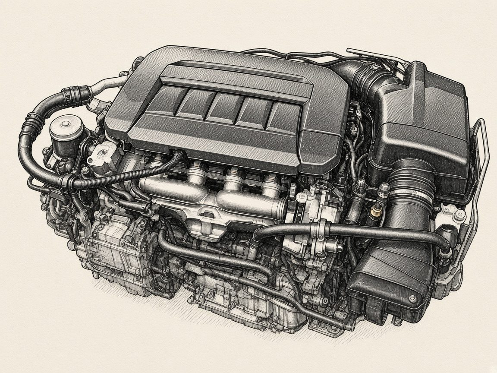

*벤츠 M252 1.5 터보. 독일에서 설계하고 중국에서 찍는 심장.*

르노와의 협력이 끝난 뒤 벤츠는 지리(Geely)와 손을 잡았다. 지리 창업자 리수푸와 중국 국영 베이징자동차(BAIC)는 각각 벤츠 지분을 10% 안팎씩 보유한 대주주이기도 하다. 소형 4기통에 독자 생산 투자를 하지 않고, 대주주이자 세계 최대 규모의 엔진 공장을 가진 중국 파트너에게 생산을 맡기는 것은 비용 측면에서 완벽해 보였다.

계산이 틀어진 것은 트럼프 2기 행정부의 미중 무역전쟁 때문이다. 2025년 미국은 수입 자동차와 부품에 25% 관세를 부과했고, 중국산에는 그 위에 추가 관세가 겹겹이 쌓였다. 한때 미국과 중국은 서로의 제품에 100%가 넘는 보복 관세를 주고받았다. 이 전쟁의 한가운데서 "중국에서 만든 엔진을 얹은 독일차를 미국에 판다"는 구조는 순식간에 위험물이 됐다. 관세 비용은 물론이고, 중국산 핵심 부품에 대한 미국 정치권의 반감과 공급망 규제 강화 움직임이 겹치면서, 벤츠 내부에서도 중국산 엔진을 핵심 시장 전략의 축으로 삼기 어렵게 됐다는 평가가 나왔다. 실제로 신형 CLA 하이브리드가 미국에 출시될 때 그 엔진이 중국산이라는 사실이 알려지며 "이게 아직 벤츠인가?"라는 논란이 일었다.

게다가 M252는 마일드 하이브리드에는 적합하지만 플러그인 하이브리드나 주행거리 연장형용으로 설계되지 않았다는 한계도 지적됐다. 전기차 수요 둔화로 PHEV 비중을 늘려야 하는 벤츠로서는, 미국 시장에 안심하고 쓸 수 있는 **'중국산이 아닌' PHEV용 4기통**이 필요해졌다.

그 틈에서 **"벤츠에 BMW 엔진"** 시나리오가 나왔다. 2025년 8월 독일 경제지 매니저 마가진은 벤츠가 BMW로부터 횡치·종치 겸용 B48 4기통을 공급받는 방안을 협의 중이며, 2027년부터 오스트리아 슈타이어 공장에서 생산하고 관세 회피를 위한 미국 내 공동 생산까지 거론된다고 보도했다. 그러나 보도 한 달도 지나지 않아 벤츠의 최고기술책임자 마르쿠스 셰퍼가 이를 공개적으로 부인했다. 따라서 이는 확정된 계획이 아니라, 벤츠가 처한 구조적 압력 때문에 언제든 다시 테이블에 오를 수 있는 **유력한 선택지 중 하나**로 보는 것이 정확하다.

1980년대 크라이슬러가 미쓰비시 엔진을, 2000년대 크라이슬러가 현대 주도 설계 엔진을, 2020년대 벤츠가 중국 생산 엔진을 택했던 것처럼, 엔진의 국적은 늘 그 시대의 비용과 정치가 결정해 왔다. 다만 지금은 정치가 비용을 압도한다. 7장에서 정주영이 지키려 했던 것, 즉 **심장을 남에게 맡기지 않는 것**의 가치가 반세기 만에 독일 최고의 자동차 회사에게 뼈아프게 되돌아온 셈이다.

## 20장. 중국의 단물 - 독일 3사의 급격한 추락

> **[이 시대의 엔진] 폭스바겐 EA888 2.0 TSI — 중국 합자 공장의 효자 (2000년대 후반~)**
>
> 독일 다운사이징 엔진의 표준이자, 중국 합자 공장에서도 대량 생산된 엔진. 중국 중산층이 처음 산 '독일 차'의 상당수가 이 엔진의 형제들로 움직였다. 폭스바겐·아우디·벤츠·BMW의 2.0 터보 엔진들은 2010년대 중국 도로를 점령하며 독일 본사에 막대한 이익을 송금했다. **중국이라는 금광에서 가장 많은 금을 캐낸 곡괭이**였다.

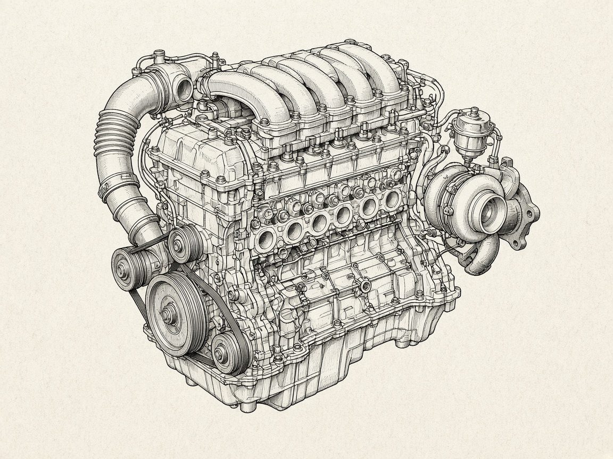

*EA888 2.0 TSI. 중국 금광에서 가장 많은 금을 캐낸 곡괭이.*

### 금광의 시대

2010년대 독일 자동차 회사들에게 중국은 골드러시와 같은 노다지 금광이었다. 폭스바겐은 1985년 상하이폭스바겐 이후 30년 넘게 중국 승용차 시장 1위를 지켰고, 한때 그룹 전체 판매의 40% 안팎을 중국에서 올렸다. 벤츠·BMW·아우디, 이른바 'BBA'는 중국 신흥 부유층의 성공 증표가 됐다. 중국 소비자들은 독일 배지에 기꺼이 웃돈을 냈고, 같은 차가 유럽보다 중국에서 더 비싸게 팔리기도 했다. 합자 구조 탓에 이익의 절반을 중국 파트너와 나눠야 했지만, 그래도 남는 것이 엄청났다. 독일 3사의 주가와 배당, 독일 본사의 고용과 연구개발비 상당 부분이 중국에서 벌어온 돈으로 떠받쳐졌다.

그 단물에는 대가가 있었다. 8장에서 본 것처럼 중국의 합자 전략은 '시장을 내주고 기술을 얻는' 것이었다. 독일 메이커들은 중국 파트너에게 생산 기술과 품질 관리, 부품 생태계 구축 노하우를 전수했다. 그리고 중국 정부가 전기차로 판을 바꾸자, 그 기술과 인력과 공급망은 중국 토종 브랜드의 자양분이 됐다. 독일 회사들은 금광에서 금을 캐는 동안, 자신의 무덤을 팔 삽을 함께 만들어 준 셈이다.

### 금광이 무너지다

2024~2025년, 금광은 무너졌다. 2025년 폭스바겐 그룹의 중국 판매는 269만 대로 8% 줄었고, 수십 년 지켜온 중국 1위 자리는커녕 BYD와 지리에 밀려 3위로 내려앉았다. 벤츠의 중국 승용차 판매는 55만 1,900대로 19% 급감했다. 벤츠에게 중국은 전체 판매의 3분의 1 가까이를 차지하는 최대 단일 시장이다. 그 결과 벤츠의 중국 매출은 28.6% 줄었고, 그룹 순이익은 48.8% 감소한 53억 3,100만 유로로 반토막이 났다. BMW의 중국 인도량은 12.5% 줄어든 62만 6,000대로 2021년 이후 최저였고, 자동차 부문 세전이익은 21.2% 감소했다. 가장 극적인 것은 포르쉐다. 2025년 포르쉐의 중국 판매는 26% 급감한 4만 1,900대로, 2023년 7만 9,300대의 절반 수준까지 떨어졌다. 포르쉐 전체 판매는 2009년 금융위기 이후 16년 만에 가장 큰 폭으로 줄었다.

중국 시장 전체를 보면 추락의 구조가 보인다. 중국 승용차 판매에서 외국 브랜드의 점유율은 2017년 56%에서 2025년 31%로 떨어졌고, 중국 토종 브랜드가 시장의 70% 가까이를 차지하게 됐다. 중국 소비자들은 이제 독일 배지에 웃돈을 내지 않는다. 같은 값이면 더 큰 화면과 더 똑똑한 자율주행, 더 빠른 소프트웨어 업데이트를 주는 중국 전기차를 산다. 독일 3사가 자랑하던 엔진과 변속기, 주행 질감은 중국 소비자의 구매 기준에서 순위가 밀렸다.

### 왜 이렇게 빨리 무너졌나>

독일 3사의 추락이 유독 가파른 데는 세 가지 이유가 있다.

첫째, **의존도가 너무 높았다.** 매출과 이익의 30~40%를 한 나라에 기대는 구조는 그 나라의 시장이 바뀌는 순간 회사 전체를 흔든다. 벤츠의 순이익 반토막이 그 증거다.

둘째, **강점이 무력화됐다.** 독일 차의 프리미엄은 엔진과 주행 성능, 장인정신에서 나왔다. 그러나 전기차에서는 엔진이 사라지고, 주행 성능은 모터가 평준화하며, 차별화의 무게중심은 소프트웨어로 이동했다. 독일 3사는 소프트웨어 내재화에 어려움을 겪으며 중국 IT 기업 출신 메이커들에게 밀렸다.

셋째, **양쪽에서 동시에 맞았다.** 중국에서 판매가 무너지는 동안 미국에서는 트럼프의 관세가 이익을 깎았다. 2025년 1분기 벤츠의 순이익은 43%, 폭스바겐은 41% 줄었다. 폭스바겐은 창사 이래 처음으로 독일 국내 공장 문을 닫는 결정을 내렸다. 중국의 단물이 끊긴 자리에 미국의 관세가 들어온 것이다.

독일 3사의 추락은 현대차의 경험과 묘한 대조를 이룬다. 현대차도 한때 중국에서 연간 100만 대 넘게 팔았지만, 2017년 사드(THAAD) 배치를 둘러싼 갈등 이후 판매가 급감하는 쓰라린 경험을 했다. 그런데 그 이른 아픔이 오히려 약이 됐다. 현대차는 중국 의존도를 일찌감치 낮추고 미국·인도·유럽·중동으로 시장을 분산했다. 독일 3사가 중국의 단물에 취해 있던 시기에, 현대차는 정치적 문제로 강제로 체질을 바꿔야 했던 것이다. 전화위복이란 이런 것이다.

## 21장. 미국의 자동차 전략 - 관세의 성벽과 V8의 귀환

> **[이 시대의 엔진] 포드 7.3L '고질라' V8 (2020~) / 램 5.7L 헤미 V8의 귀환 (2025 발표)**
>
> 고질라는 터보도 직분사도 없는 단순한 푸시로드 V8이다. 규제의 시대에 오히려 대배기량으로 회귀한 이 엔진은 "단순하고 튼튼한 것이 최고"라는 미국 엔진 철학의 고집이다. 그리고 2025년, 스텔란티스는 한때 퇴출시켰던 헤미 V8을 램 픽업에 되살리겠다고 발표했다. **관세의 성벽 안에서 V8이 다시 숨을 쉰다.**

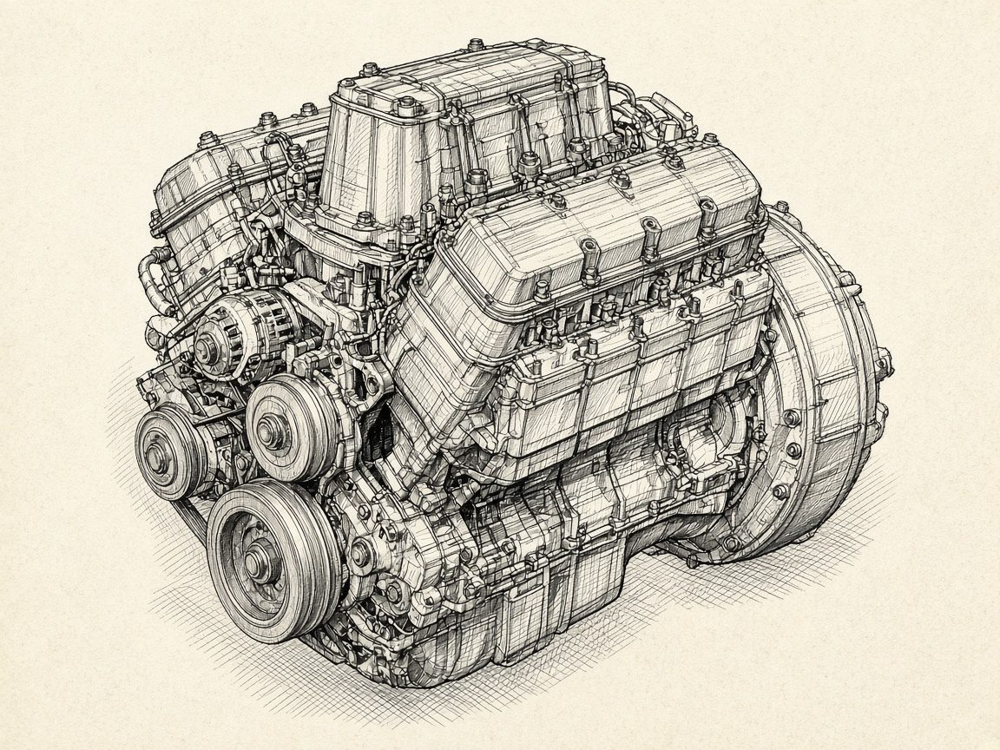

*포드 고질라 / 램 헤미. 관세 성벽 안에서 숨 쉬는 V8.*

트럼프 2기 행정부의 자동차 전략은 한 문장으로 요약된다. **"미국에서 만들어라, 아니면 관세를 내라."**

2025년 미국은 무역확장법 232조를 근거로 수입 자동차와 부품에 25% 관세를 부과했다. 중국산에는 추가 관세가 겹겹이 쌓였다. 이후 일본·한국·EU 등은 개별 협상을 통해 자동차 관세율을 15% 수준으로 낮추는 대신 대규모 대미 투자를 약속하는 합의를 맺었다. 관세는 협상 카드이자 공장 유치 수단이 됐다.

동시에 미국은 전기차 지원을 거둬들이고 내연기관 규제를 풀었다. 신차 전기차 구매 세액공제(최대 7,500달러)는 2025년 9월 말로 종료됐고, 연비 기준 위반 시 부과되던 CAFE 민사 벌금은 사실상 무력화됐다. 시장은 즉각 반응했다. 스텔란티스는 헤미 V8 부활을 발표했고, 포드는 대형 전기차 계획을 대폭 축소했다. 11장에서 이야기한 '머슬카의 두 번째 죽음' 이후, V8은 이번에는 픽업트럭의 모습으로 돌아오고 있다.

이 전략의 논리는 분명하다. 

첫째, **미국의 강점(대형 픽업·SUV·V8)을 보호**한다. 픽업은 중국 전기차가 가장 진입하기 어려운 시장이자 디트로이트 이익의 원천이다. 

둘째, **제조업 일자리를 미국 본토로 되돌린다.** 

셋째, **중국산 부품을 공급망에서 걷어낸다.** 벤츠가 중국산 엔진 때문에 고민하는 것도 이 세 번째 압력 때문이다.

그러나 위험도 크다. 미국의 성벽 안에서 V8 픽업은 번성하겠지만, 성벽 밖 세계 시장에서는 중국 전기차와 일본·한국 하이브리드가 경쟁한다. 1970년대 디트로이트가 규제 연기를 로비하며 대형차에 안주하다 일본차에 시장을 내줬던 역사가 반복될 수 있다는 경고도 나온다. 관세는 시간을 벌어줄 뿐, 경쟁력을 만들어주지는 않는다. 그리고 그 사이 성벽 안의 소비자는 더 비싼 차값을 치른다. 12장에서 본 Z세대가 차를 사지 않는 이유 중 하나가 바로 그 차값이다.

## 22장. 유럽 - 디젤게이트의 상처와 규제로 시간 벌기

> **[이 시대의 엔진] 폭스바겐 EA189 2.0 TDI (2008~2015)**
>
> 디젤게이트의 주인공. 인증 시험 상황을 감지하면 배출가스 저감 장치를 정상 작동시키고, 실제 도로에서는 이를 약화시키는 소프트웨어가 이 엔진의 제어 장치에 심어져 있었다. 기계로서는 훌륭한 엔진이었지만, 그 숫자는 거짓이었다. **독일 엔지니어링의 신뢰를 한순간에 무너뜨린 엔진**이자, 유럽 전동화 정책을 앞당긴 방아쇠다.

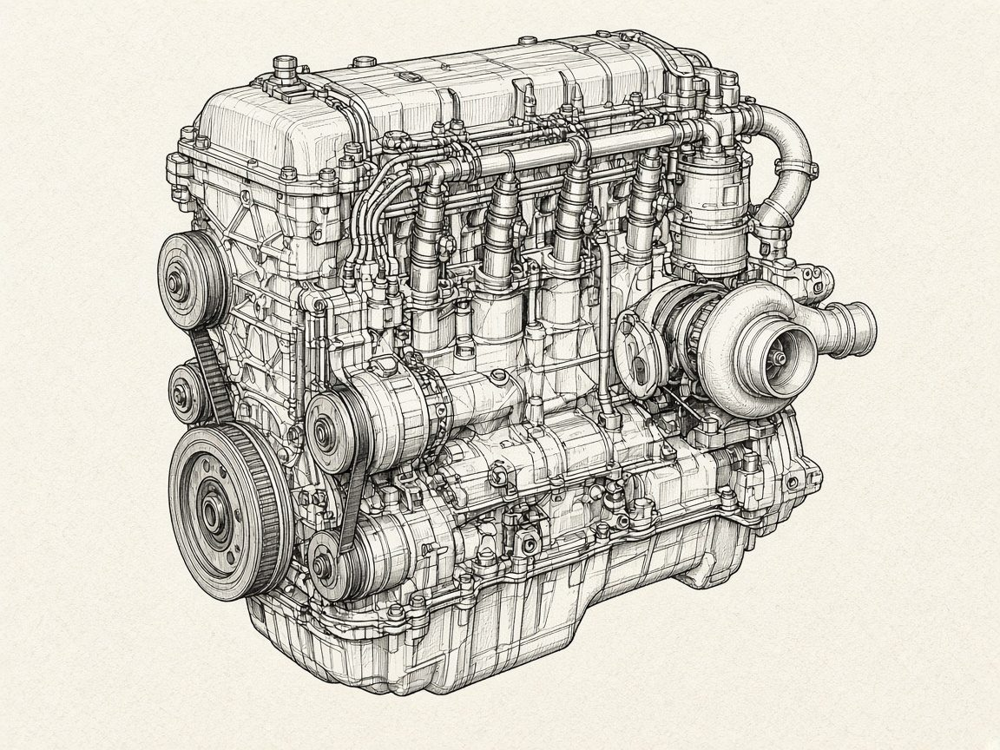

*EA189. 디젤게이트의 소프트웨어가 앉았던 자리.*

### 디젤게이트, 신뢰의 붕괴

2015년 9월, 미국 환경보호청은 폭스바겐의 배출가스 조작을 발표했다. 실주행 NOx 배출은 기준치의 수십 배에 달했다. 전 세계 약 1,100만 대가 연루됐고, 폭스바겐이 리콜·벌금·배상으로 치른 비용은 300억 유로를 넘어섰다. 미국 법인 경영진이 형사처벌을 받았고, 그룹 CEO가 물러났다.

디젤게이트는 한 회사의 일탈로 끝나지 않았다. 다임러는 2020년 미국 당국과 디젤 배출가스 문제로 약 15억 달러 규모의 합의를 했고, 피아트크라이슬러는 2019년 3.0L 에코디젤 배출가스 문제로 약 8억 달러에 합의했다. 2021년 EU 집행위원회는 폭스바겐 그룹과 BMW가 디젤 배출가스 정화 기술 경쟁을 제한하기로 담합했다며 8억 7,500만 유로의 과징금을 부과했다. 독일 엔지니어링의 자부심이었던 디젤은, 정밀함이 아니라 **숫자를 맞추는 기술**이었다는 의심 속에 시장에서 퇴장했다.

그 유산이 지금의 규제다. 유럽은 실험실 시험을 더 가혹한 WLTP로 바꾸고 **실도로 배출가스 측정(RDE)** 을 도입했다. 2024년 채택된 **유로 7**은 브레이크와 타이어에서 나오는 미세 분진, 배터리 내구성까지 규제하고, 신규 형식 승인 차량은 2026년 11월 말부터 적용된다.

### 전기차를 밀어붙이던 유럽이 브레이크를 밟다

디젤게이트 이후 유럽은 전기차 전환의 선두에 섰다. 2035년부터 신차는 모두 배출가스 제로여야 한다는, 사실상의 내연기관 판매 금지를 법제화했다. 그러나 막상 전환이 본격화하자 예상하지 못한 일이 벌어졌다. **유럽이 깔아준 전기차 시장의 과실을 중국이 가져가기 시작한 것이다.**

BYD·지리·SAIC(MG) 같은 중국 브랜드들이 유럽 소비자가 감당할 수 있는 가격의 전기차를 쏟아냈다. 유럽 메이커들은 비싼 인건비와 에너지 비용, 뒤처진 배터리 공급망 때문에 가격 경쟁에서 밀렸다. 20장에서 본 것처럼 중국 시장까지 잃은 독일 3사에게 안방마저 내주는 것은 감당할 수 없는 일이었다.

유럽의 대응은 점점 분명한 패턴을 보였다. 첫 번째 카드는 **관세**였다. EU는 2024년 10월 중국산 전기차에 기존 10% 관세 위에 최대 35%대의 상계관세를 추가로 부과했다. 두 번째 카드는 **현지 생산 조건**이다. 역내에서 생산하고 부품 부가가치의 상당 부분이 현지에서 창출된 차량에만 혜택을 주는, 이른바 '유럽판 IRA' 논의가 진행됐다. 중국 메이커가 헝가리 등에 공장을 짓더라도 부품을 중국에서 들여와 조립만 하면 기준을 맞추기 어렵게 만드는 구조다. 세 번째이자 가장 극적인 카드는 **전환 속도 자체를 늦추는 것**이었다. 2025년 12월 유럽연합 집행위원회는 2035년 사실상의 내연기관 금지를 철회하고 목표를 **2021년 대비 이산화탄소 90% 감축**으로 낮추는 안을 제안했다. 남은 10%는 EU산 저탄소 철강이나 합성연료·바이오연료로 상쇄하는 조건으로 플러그인 하이브리드와 주행거리 연장형 차량의 판매를 2035년 이후에도 허용한다는 내용이다. **EU에서 생산된 소형 전기차**에 추가 크레딧을 주는 새 범주도 함께 제안됐다.

이 일련의 조치를 관통하는 논리는 분명하다. 전기차 전환을 빠르게 밀어붙일수록 배터리와 전기차에서 앞선 중국에 유리하고, 전환을 늦추고 하이브리드를 살릴수록 엔진 기술을 가진 유럽·일본·한국에 유리하다. 공식적인 명분은 산업 경쟁력과 일자리, 소비자 부담이지만, 그 결과는 **중국 전기차의 진격 속도를 늦추고 유럽 메이커에게 시간을 벌어주는 것**이다. 환경 규제가 사실상 산업 보호 장치로 기능하기 시작한 셈이다.

물론 반대 목소리도 크다. 폴스타 같은 전기차 전문 메이커와 환경단체는 목표 후퇴가 전기차에 투자한 기업들의 발목을 잡고 결국 유럽의 경쟁력을 더 떨어뜨릴 것이라고 경고한다. 실제 주행에서 플러그인 하이브리드가 대부분 엔진으로 달린다는 조사 결과도 논란을 키운다. 아이러니도 있다. 유럽이 살려준 플러그인 하이브리드 시장에서 가장 강한 플레이어는, 14장에서 본 것처럼 46%대 열효율을 내세우는 중국 메이커들이다. 유럽은 기후 목표와 산업 보호 사이에서 줄타기를 하고 있다. 그 줄타기의 균형추가 바로 엔진이다.

## 23장. 중국 - 합자에서 전장 전환으로

> **[이 시대의 엔진] 상하이폭스바겐 산타나의 1.6~1.8L 4기통 (1985~)**
>
> 중국 합자 시대의 상징. 1985년 상하이폭스바겐이 생산을 시작한 산타나는 중국 택시와 관용차의 대명사가 됐다. 엔진은 폭스바겐 설계, 공장은 중국 땅, 이익은 반반. 중국은 이 엔진을 수백만 대 만들면서 자동차를 '만드는 법'은 배웠지만, '설계하는 법'은 끝내 온전히 넘겨받지 못했다. **이 엔진의 한계가 30년 뒤 중국을 전기차로 내몰았다.**

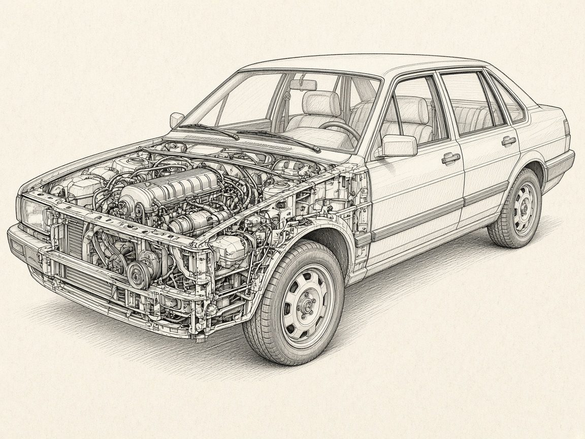

*산타나 4기통에서 시작한 중국 합자 시대.*

### 따라잡을 수 없다면 전장을 바꾼다

8장에서 본 것처럼, 중국은 합자 회사와 거대한 내수를 바탕으로 자동차 산업을 키웠다. 그러나 30년의 합자로도 엔진과 변속기의 핵심 설계 기술은 온전히 넘어오지 않았다. 100년 넘게 쌓인 엔진·변속기·연료분사 기술, 수만 개의 특허, 촘촘한 부품 생태계는 정공법으로 넘기 어려운 성벽이었다.

필자는 별도의 칼럼 「보조금 정책이 만든 거품 vs 정리 국면의 산업 재편 메커니즘」(vibe-investing, 2026)에서 중국의 전기차 전략을 이렇게 해석했다. **'제조 2025'의 전기차 전략은 환경 정책이 아니라 산업 우회 전략이다.** 내연기관 시장에서 독일·일본·미국·한국을 따라잡는 것이 불가능하다는 현실 인식에서 출발해, 엔진과 변속기 대신 배터리·모터·소프트웨어가 핵심인 새 출발선으로 게임의 룰 자체를 바꾼 것이다.

여기서 한국과 중국의 차이가 선명해진다. **한국은 작은 내수와 처절한 수출 속에서 내연기관을 정면 돌파했다. 중국은 합자와 거대한 내수를 발판으로, 국가가 전기차 드라이브를 걸어 내연기관을 우회했다.** 정주영이 1970년대 "남의 엔진으로 조립만 할 것인가"라는 질문 앞에서 엔진 독립을 택했다면, 중국은 2010년대 같은 질문 앞에서 엔진의 의미 자체를 줄이는 길을 택했다. 정반대의 답이지만, 둘 다 기술 종속에서 벗어나려는 결단이라는 점에서 닮았다. 차이는 그 결단의 주체다. 한국은 한 기업가의 고집이었고, 중국은 국가의 설계였다.

### 국가가 설계한 산업

중국의 전기차 드라이브는 철저히 국가 주도였다. 신에너지차(NEV)에 구매세 면제와 각종 보조금을 쏟아부었고, 지방정부들은 경쟁적으로 공장과 배터리 기업을 유치했다. 내연기관차 번호판은 추첨과 경매로 묶고, 전기차 번호판은 쉽게 내줬다. 배터리 원료 광산부터 셀, 모터, 전력반도체까지 공급망 전체를 국가 차원에서 키웠다. 2018년에는 신에너지차 분야의 외국인 지분 제한을 먼저 풀었고, 테슬라는 2019년 상하이에 중국 최초의 외국인 단독 소유 공장을 세웠다. 메기를 풀어 토종 물고기를 단련시키는 전략이었다.

그 결과 전기차·플러그인 하이브리드 브랜드가 한때 120~130여 개로 불어났고, 생산 능력은 내수가 흡수할 수 있는 규모를 크게 넘어섰다. 완성차 공장 가동률이 50% 수준까지 떨어졌다는 분석이 나온다.

### 보조금, 거품, 그리고 정리

2026년 들어 정책 기조가 바뀌었다. 신에너지차 구매세 전액 면제는 2025년 말로 끝났고, 2026~2027년에는 절반 감면으로 줄었다. 플러그인 하이브리드와 주행거리 연장형이 세제 혜택을 받으려면 순수 전기 주행거리가 기존 43km에서 100km 이상으로 늘어야 한다. 2026년 1월부터는 배터리 전기 승용차 수출에 허가제가 도입됐다. 컨설팅사 앨릭스파트너스는 129개 브랜드 가운데 2030년까지 재무적으로 생존할 곳이 15개 안팎에 그칠 것으로 전망했다.

필자는 앞의 칼럼에서 이 흐름을 디디추싱(차량 공유), 오포·모바이크(공유 자전거), 배달 플랫폼, 태양광에서 반복된 **'보조금 → 거품 → 출혈 경쟁(내권) → 정리 → 과점'** 패턴의 자동차판으로 읽었다. 보조금을 떼는 결정의 이면에는 "중국 전기차가 이제 보조금 없이도 글로벌에서 경쟁할 수 있다"는 자신감이 있고, 내수가 삼키지 못한 과잉 물량은 수출이라는 배출 밸브로 빠져나간다. 출혈 경쟁을 견딘 생존자들은 원가 절감과 개발 속도를 체득하고, 샤오미·화웨이 같은 IT 기업 출신 메이커들은 소프트웨어와 자율주행을 무기로 내연기관 메이커가 따라오기 어려운 전장을 열고 있다.

다만 필자 스스로 같은 칼럼에서 짚었듯, 이 서사를 결정론으로 받아들여서는 안 된다. 자동차는 공유 자전거와 달리 자본집약적인 교역재이고, 관세와 현지 생산 규제가 '수출로 과잉을 푼다'는 경로를 막을 수 있다. 토요타가 하이브리드로 사상 최대 이익을 내는 것처럼 '내연기관 소멸'은 과장일 수 있다. 결과가 정교해 보인다고 해서 처음부터 설계된 마스터플랜이었다는 증거도 아니다. 중국 내수 전기차 판매 급감과 적자 메이커들의 폐업 위기는 '실제로 고통받는 시장'의 증거이기도 하다.

### 그래도 엔진은 버리지 않았다

흥미로운 것은 중국 스스로도 엔진을 버리지 않았다는 점이다. 14장과 17장에서 본 것처럼 BYD와 지리는 플러그인 하이브리드 전용 엔진으로 46%대 열효율을 다투고 있다. 지리는 볼보와 르노의 엔진 기술을 흡수해 호스라는 파워트레인 회사를 세웠고, 벤츠의 엔진을 대신 생산할 정도가 됐다. 전장을 바꾸려던 중국도 결국 발전기로서의 엔진은 필요했고, 그 엔진에서조차 세계 정상을 넘보게 됐다. 30년 전 산타나 엔진을 조립하며 배우던 나라의 놀라운 반전이다.

## 24장. 중국 전기차 전략의 피해자들

> **[이 시대의 '심장'] BYD 블레이드 배터리 (2020~)**
>
> 이 장의 주인공은 엔진이 아니다. 길쭉한 칼날 모양의 리튬인산철(LFP) 셀을 팩에 직접 꽂아 넣은 배터리다. 값싸고 안전하고 오래간다. 이 배터리 덕분에 중국 전기차는 내연기관차와 맞먹는 가격을 실현했다. **엔진의 자리를 빼앗은 새로운 심장**이며, 이 장에 등장하는 모든 피해자들은 이 배터리가 만든 가격표 앞에서 무너졌다.

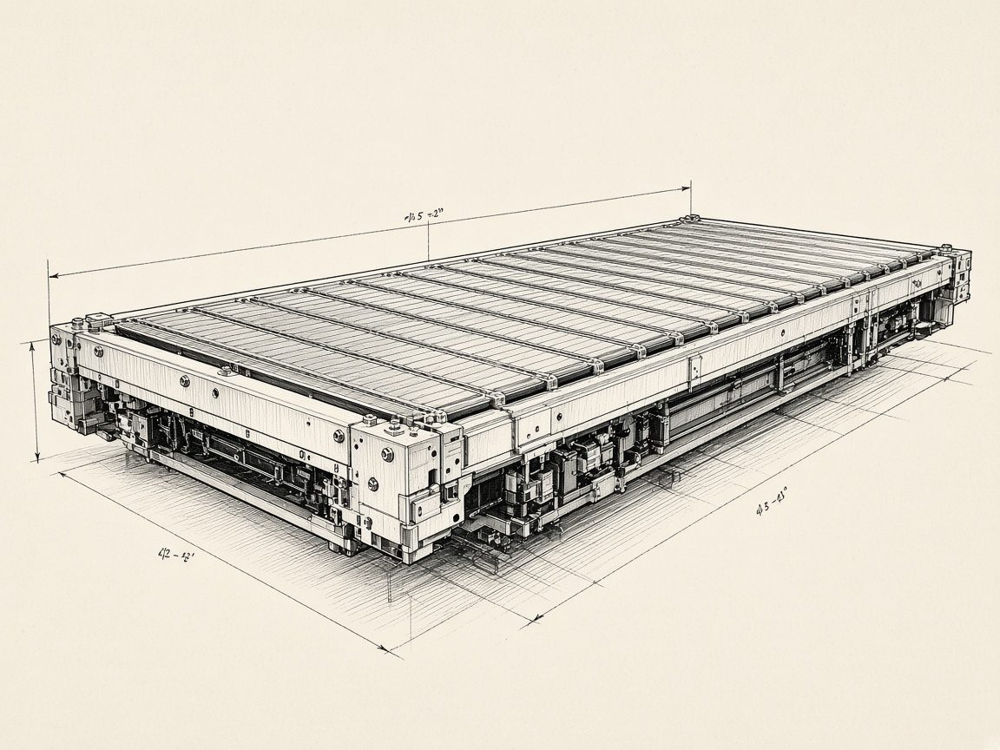

*블레이드 배터리. 엔진의 자리를 빼앗은 새로운 심장.*

중국의 전기차 전략은 세계 자동차 산업에 거대한 충격파를 보냈다. 그 파도에 휩쓸린 피해자들은 생각보다 많고, 다양하다.

**첫 번째 피해자는 중국 안에 있다.** 보조금을 노리고 우후죽순 생겨난 100여 개 군소 브랜드다. 네타(Neta) 같은 메이커는 임금 체불 끝에 파산 절차에 들어갔고, 해외 고객들은 사후 서비스 없이 방치됐다. 실수요가 아니라 실적용 등록을 위해 차를 찍어내던 업체들은 보조금이 끊기는 순간 버틸 수 없었다. 거대한 거품의 첫 번째 희생자는 거품을 만든 당사자들이다.

**두 번째 피해자는 독일 3사다.** 20장에서 본 것처럼 그들은 중국 시장에서 점유율과 이익을 동시에 잃었다. 폭스바겐은 중국 1위에서 3위로 떨어졌고, 독일 국내 공장을 닫았다. 그 충격은 독일의 부품 산업으로 번졌다. 보쉬, ZF, 콘티넨탈 같은 독일 부품 거인들이 잇따라 대규모 감원을 발표했다. 엔진과 변속기 부품으로 먹고살던 독일 중소 협력사들의 위기는 더 깊다. 전기차에는 그들이 만들던 부품이 필요 없기 때문이다.

**세 번째 피해자는 일본 메이커다.** 중국 시장에서 일본 브랜드의 점유율도 급락했다. 미쓰비시는 2023년 중국 생산에서 손을 뗐고, 닛산과 혼다도 중국 공장을 줄이거나 닫았다. 그리고 더 아픈 곳은 동남아다(25장). 일본 메이커들의 2025년 글로벌 판매는 2,500만 대 수준으로, 2018년보다 500만 대 줄어 세계 점유율이 34%에서 28%로 떨어졌다는 분석이 나온다.

**네 번째 피해자는 한국 배터리 산업이다.** 필자의 칼럼에서 짚었듯, 중국 업체들이 글로벌 전기차 배터리 시장의 과반을 장악하는 동안 한국 배터리 3사는 점유율과 공장 가동률이 동시에 떨어졌다. 한국 완성차마저 가격 때문에 중국 배터리를 검토하는 상황이 됐다. 한국 전기차 내수 시장에서도 중국산 전기차의 점유율이 빠르게 올랐다.

**다섯 번째 피해자는 신흥국의 자동차 산업 꿈이다.** 동남아와 남미, 중동의 나라들이 국민차와 자국 자동차 산업을 꿈꿀 때, 그들의 경쟁 상대는 이제 일본의 하청 구조가 아니라 내연기관차와 같은 값에 라이다까지 단 중국 전기차다. 후발 산업국이 자동차 산업을 키울 수 있는 '사다리'가 더 높아졌다.

**여섯 번째, 그리고 가장 역설적인 피해자는 '전기차 전환' 그 자체다.** 중국의 전략이 너무 성공적이었기에, 미국과 유럽은 자국 산업을 지키기 위해 전환의 속도를 늦췄다(21장, 22장). 중국 전기차가 싸고 좋아질수록 서방의 전기차 전환은 오히려 느려지는 모순. 기후 위기의 관점에서 보면, 이것이야말로 가장 큰 손실일지도 모른다.

그리고 이 모든 피해의 반사이익을 얻은 것이 엔진이다. 서방이 시간을 버는 동안 하이브리드와 내연기관은 연장전을 얻었다. 엔진은 자신의 실력이 아니라, 경쟁자의 너무 빠른 성공 덕분에 수명을 늘리고 있다.

## 25장. 일본의 고민 - 르노-닛산의 몰락과 동남아 종속 구조의 붕괴

> **[이 시대의 엔진] 닛산 ZR15DDTe 1.5L 3기통 터보 (2025~)**
>
> 3세대 e-POWER용 발전 전용 엔진. 바퀴를 굴리지 않고 오직 전기만 만든다. 닛산은 열효율 42%를 발표하며 일본 메이커 중 최고 수준을 주장했다. 그런데 이 엔진이 나온 바로 그 해, 닛산은 수천억 엔의 적자 속에 공장 7곳을 닫는 회생 계획을 발표했다. **가장 좋은 엔진을 가진 회사가 가장 깊은 위기에 빠진 역설**의 상징이다.

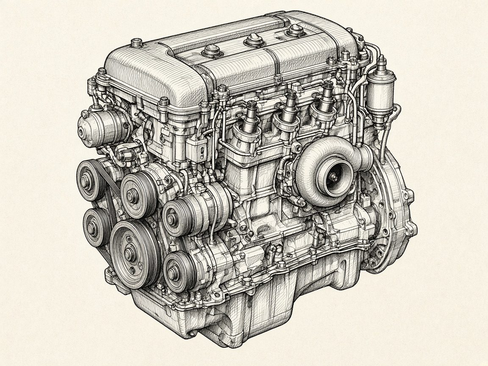

*닛산 ZR15DDTe. 좋은 엔진, 위기의 회사.*

### 곤의 기적과 몰락

1999년, 부채에 허덕이던 닛산을 르노가 구했다. 르노는 닛산 지분을 결국 43%까지 늘렸고, 르노 임원 카를로스 곤을 보내 회생을 맡겼다. 곤은 공장 폐쇄와 대규모 감원, 계열사(게이레쓰) 거래 구조 개혁을 밀어붙이며 '닛산 리바이벌 플랜'을 성공시켰다. 르노-닛산 얼라이언스는 미쓰비시까지 끌어들이며 세계 최대급 자동차 연합이 됐고, 2010년 닛산 리프로 대중 전기차 시대를 열었다.

그러나 2018년 11월, 곤이 보수 축소 신고 등 금융 비리 혐의로 도쿄에서 체포되면서 얼라이언스 안에 오래 쌓여 있던 문제가 터져 나왔다. 프랑스 정부가 대주주인 르노가 덩치가 더 큰 닛산을 지배하는 불균형한 구조, 그리고 닛산 내부의 반발이었다. 2023년 두 회사는 상호 지분을 15%씩으로 맞추는 재편에 합의했고, 르노는 닛산 지분을 단계적으로 줄여 나갔다.

### 혼다와의 결별, 그리고 Re:Nissan

2024년 말 닛산과 혼다는 지주회사를 세워 경영을 통합하는 방안을 논의하기 시작했다. 성사됐다면 토요타에 맞서는 일본 2위 자동차 연합이 탄생할 뻔했다. 그러나 2025년 2월, 협상은 경영 주도권과 구조를 둘러싼 이견 끝에 결렬됐다.

같은 해 닛산은 2024 회계연도에 6,708억 엔의 순손실을 냈다. 4월 취임한 이반 에스피노사 CEO는 회생 계획 **'Re:Nissan'** 을 발표했다. 전 세계 생산 공장을 17곳에서 10곳으로 줄이고 약 2만 명을 감원하는 내용이다. 닛산은 1조 엔 규모의 자금을 회사채 발행과 자산 매각으로 조달해야 했고, 르노는 닛산 지분에 대해 95억 유로를 상각했다. 벤츠와 함께 운영하던 멕시코 합작 공장도 문을 닫는다. 한때 세계 최대 자동차 연합을 자랑하던 얼라이언스의 처참한 현주소다.

### 동남아: 반세기 종속 구조가 무너지다

일본 산업계의 더 깊은 고민은 동남아에 있다. 8장에서 본 것처럼, 동남아 자동차 산업은 반세기 동안 일본에 대한 기술·자본·부품 종속 구조였다. 일본 메이커에게 동남아는 안정적인 이익의 원천이자, 일본 부품 협력사들이 해외에서 살아남는 생태계의 기반이었다. 일본은 이 지역에서 사실상 '자동차의 종주국'이었다.

그 아성이 무너지고 있다. 태국 시장에서 일본 브랜드 9개사의 합산 점유율은 2010년 90%를 넘었지만, 2025년 1~10월에는 69.8%로 떨어졌다. 1년 전보다 6.6%포인트 하락한 것이다. 같은 기간 중국 브랜드의 태국 점유율은 2021년 4%에서 2025년 21.5%로 치솟았다. 2025년 태국 연간 판매 상위 10개 브랜드 가운데 절반을 BYD, MG, 장성기차, 창안, GAC 같은 중국 메이커가 차지했다. 동남아 최대 시장 인도네시아에서도 일본 브랜드 점유율은 2024년 90% 아래로 내려간 뒤 2025년 1~10월 82.9%까지 떨어졌다.

이 붕괴의 출발점은 태국 정부가 2022년 내놓은 전기차 보조금 정책이었다. 중국 메이커들은 재빨리 태국에 공장을 짓고 보조금을 활용해 공격적인 가격으로 진입했다. 하이브리드에 강점을 가진 일본 메이커들은 그 정책의 혜택을 충분히 받지 못했다. 일본 메이커들은 태국 생산을 줄이기 시작했고, 그 충격은 동남아에 진출한 2,800곳에 가까운 일본 부품 기업, 특히 그 절반 가까이가 몰린 태국의 협력사들에게 번지고 있다.

여기에는 씁쓸한 역사의 아이러니가 있다. 동남아는 반세기 동안 일본 엔진의 하청 생태계였고, 스스로 자동차 산업을 키우지 못했다. 그리고 지금 그 자리를 채우는 것은 동남아 자신의 브랜드가 아니라 중국 브랜드다. 말레이시아 프로톤은 이미 지리의 품에 안겼다. 동남아는 **일본에 대한 종속에서 중국에 대한 종속으로 주인만 바뀌고 있는지도 모른다.** 8장에서 한국이 왜 예외였는지 물었던 질문이 여기서 다시 무겁게 돌아온다.

### 일본 산업계가 고민하는 것

닛산의 위기와 동남아의 붕괴는 일본 자동차 산업 전체에 무거운 질문을 던진다.

첫째, **규모의 문제**다. 엔진과 하이브리드, 전기차, 소프트웨어를 동시에 개발해야 하는 시대에, 토요타를 제외한 일본 메이커들은 혼자 버티기에 덩치가 작다. 혼다-닛산 통합 논의가 무산되자 위기감은 더 커졌다. 토요타가 마쓰다·스바루·스즈키와 자본 제휴를 맺으며 사실상 '토요타 진영'을 형성한 것과 대조적이다.

둘째, **엔진 강국의 역설**이다. 일본은 세계 최고 수준의 엔진과 하이브리드 기술을 가졌지만, 그 강점이 전기차 전환에서는 족쇄가 됐다는 비판을 받아왔다. 전기차 시대가 늦어지면서 숨을 돌렸지만, 그것이 장기적 경쟁력을 보장하지는 않는다. 게다가 이제는 하이브리드 엔진의 열효율에서조차 중국이 더 높은 숫자를 내세운다.

셋째, **안마당의 상실**이다. 동남아는 일본의 이익과 부품 생태계의 기반이었다. 그 안마당을 잃는 것은 단지 판매 대수가 줄어드는 문제가 아니라, 일본 부품 산업 전체의 해외 기반이 흔들리는 문제다.

넷째, **얼라이언스라는 모델의 한계**다. 르노-닛산은 국경을 넘는 자본 제휴로 규모의 경제를 얻으려 했지만, 국가와 기업 문화, 경영권의 이해가 엇갈릴 때 얼마나 취약해지는지를 보여줬다. 벤츠-BMW 협력설이 부인된 것, 혼다-닛산 통합이 무산된 것도 같은 맥락이다. 자동차 회사들은 규모가 필요하지만, 서로를 믿고 심장을 맡기기는 어렵다.

닛산의 이야기는 7장의 정주영 이야기와 묘하게 대구를 이룬다. **엔진 기술을 스스로 갖추는 것은 필요조건이지만 충분조건은 아니다.** 그 기술을 지킬 수 있는 경영과 자본, 그리고 시장을 읽는 눈이 함께 있어야 한다.

## 26장. 현대차 - 절묘한 자리, 규모의 경제, 그리고 엔진의 귀환

> **[이 시대의 엔진] 현대 스마트스트림 2.5 터보 하이브리드 (2025~)**
>
> 2025년 팰리세이드 하이브리드에 처음 얹힌 엔진. 두 개의 모터를 품은 새 변속기와 짝을 이뤄, 대형 SUV에서도 하이브리드가 가능하다는 것을 보여줬다. 1991년 알파 엔진에서 출발한 현대 엔진 계보가 34년 만에 도달한 지점이다. **엔진개발센터를 없앴던 회사가 다시 엔진으로 돌아왔음을 알리는 신호탄**이다.

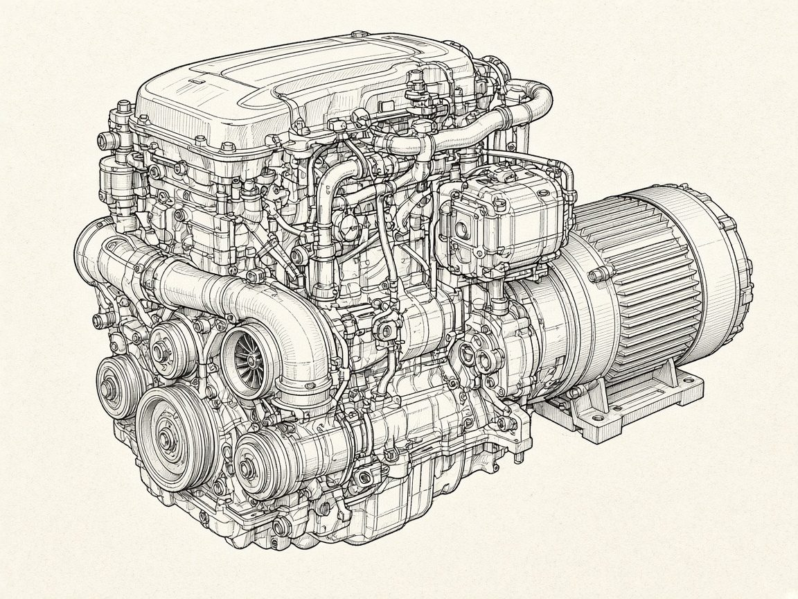

*스마트스트림 2.5T 하이브리드. 엔진의 귀환.*

### 2021년, "엔진의 시대는 끝났다"

2021년 12월, 현대차는 연구개발본부의 파워트레인담당을 전동화개발담당으로 바꾸고, 1983년 엔진개발실에서 출발한 **엔진개발센터를 폐지**했다. 대신 배터리개발센터를 새로 만들었다. 엔진설계 조직은 전동화 조직 아래로 옮겨져 기존 엔진을 개량하는 역할을 맡는다는 것이 당시 보도였다.

당시로서는 합리적인 판단이었다. 2021년은 전기차 낙관론이 정점에 달한 해였다. 테슬라의 시가총액이 기존 자동차 회사들을 모두 합친 것을 넘어섰고, 각국은 앞다퉈 내연기관 판매 금지 시점을 발표했으며, 현대차는 전기차 전용 플랫폼 E-GMP로 아이오닉 5를 막 성공시킨 참이었다.

### 2024~2025년, 엔진의 귀환

그러나 시간표는 어긋났다. 전기차 수요가 정체하는 캐즘이 찾아왔다. 2024년 3월에는 현대차그룹이 150~200명 규모의 엔진설계실을 다시 꾸려 유로 7 대응 신형 엔진 개발에 착수했다는 보도가 나왔다. 회사는 "엔진설계실은 기존에 있던 조직"이라며 신규 개발설에 선을 그었지만, 이후의 행보는 방향을 분명히 보여준다.

2025년 현대차는 하이브리드 차종을 2030년까지 8종에서 18종으로 늘리고, 제네시스 첫 하이브리드와 후륜구동 2.5 터보 하이브리드, 2027년 주행거리 연장형 전기차(EREV)를 내놓겠다고 밝혔다. 울산공장에는 TMED-II용 하이브리드 변속기 공장을 짓고, 감마 II와 세타 III 엔진도 추가 생산하기로 했다. 엔진개발센터라는 간판은 사라졌지만, **엔진은 하이브리드와 EREV라는 이름으로 현대차의 주력 파워트레인에 복귀했다.**

### 절묘한 산업 포지션

현대차가 이렇게 빠르게 방향을 틀 수 있었던 비결은 그 독특한 자리에 있다. 지금 세계 자동차 산업의 지도를 펼쳐 보면, 현대차는 거의 모든 경쟁자의 약점이 교차하는 지점에 서 있다.

**일본과 독일 사이.** 현대차는 일본차의 효율과 신뢰성, 독일차의 디자인과 주행 성능 사이에서 가격 대비 가치로 승부해 왔다. 2006년 아우디 출신 피터 슈라이어를 영입해 디자인을 바꿨고, 2015년 BMW M 출신 알버트 비어만을 데려와 고성능 브랜드 N을 만들었다. 제네시스는 독일 3사의 안방인 프리미엄 시장에 도전했다. 일본보다 과감하고, 독일보다 합리적인 자리다.

**전기차와 하이브리드 사이.** 현대차는 E-GMP로 전기차에서 앞서 나갔고, 동시에 자체 엔진과 변속기로 하이브리드를 만들 수 있다. 토요타는 하이브리드에 강하지만 전기차에 늦었고, 많은 서구 메이커는 전기차에 올인했다가 하이브리드가 없어 고전한다. 현대차는 둘 다 가졌다.

**미국과 중국 사이.** 독일 3사가 중국의 단물에 취해 있을 때, 현대차는 사드 사태로 중국에서 먼저 아픔을 겪고 시장을 분산했다(20장). 그 결과 중국 의존도가 낮다. 미국에는 앨라배마·조지아 공장을 일찌감치 세웠고, 관세 협상 이후 현지 투자를 더 늘리고 있다. 미중 무역전쟁의 한가운데서 양쪽 어디에도 과도하게 묶이지 않은 몇 안 되는 글로벌 메이커다.

**모든 파워트레인을 가진 회사.** 현대차는 이제 전 세계에서 드물게 가솔린 엔진, 자동변속기, 하이브리드, 플러그인 하이브리드, 주행거리 연장형, 순수 전기차, 수소연료전지차를 모두 자체 기술로 양산하는 회사가 됐다. 전기차가 빨리 오면 전기차로, 늦게 오면 하이브리드로, 규제가 바뀌면 그에 맞는 조합으로 대응할 수 있다. 불확실성의 시대에 이 '파워트레인 백화점'은 가장 강력한 헤지 수단이다.

### 규모의 경제의 승리

자동차는 규모의 산업이다. 엔진 하나를 개발하는 데 수천억 원이 들고, 그 비용을 회수하려면 수백만 대를 팔아야 한다. 현대차그룹은 2022년 처음으로 토요타와 폭스바겐에 이어 **글로벌 판매 3위**에 올랐고, 2025년에는 약 735만 대를 팔아 4년 연속 3위를 지켰다.

이 규모를 만든 것은 몇 가지 구조적 선택이었다. 1998년 기아를 인수해 **현대·기아 두 브랜드가 플랫폼과 엔진을 공유**하게 했다. 같은 엔진과 변속기를 두 브랜드의 수십 개 차종에 나눠 쓰니 개발비가 반으로 줄었다. 여기에 제네시스까지 더해 대중차부터 프리미엄까지 한 그룹 안에서 커버했다. **수직계열화**도 결정적이었다. 현대모비스가 핵심 부품을, 현대트랜시스가 변속기를, 현대위아가 엔진과 기계 부품을, 그리고 현대제철이 2010년 당진 고로를 가동하면서 자동차용 강판까지 그룹 안에서 만든다. 쇳물에서 완성차까지 이어지는 이 구조는 세계적으로도 드물다. 7장에서 정주영이 "자동차는 철강·기계·전자 산업 전체를 끌고 가는 산업"이라고 본 그 비전이, 그대로 하나의 그룹 안에 구현된 것이다.

규모는 다시 품질과 수익으로 돌아왔다. 세타 II 사태(16장)라는 쓰라린 대가를 치른 뒤 품질 관리는 한층 엄격해졌고, 현대차와 기아의 영업이익률은 대중차 메이커 가운데 최상위권으로 올라섰다. 25장에서 본 닛산이 규모를 지키지 못해 무너지는 동안, 현대차는 규모를 무기로 삼았다.

### 정주영의 혜안이 만든 보험

이 모든 것은 결국 7장의 결단으로 돌아간다. 현대차가 몇 년 만에 하이브리드 라인업을 두 배 이상 늘릴 수 있었던 것은, 엔진과 변속기를 스스로 설계하고 생산할 줄 알았기 때문이다. 벤츠가 중국산 엔진 때문에 미중 무역전쟁의 덫에 걸리고(19장), 독일 3사가 중국 의존 때문에 이익이 반토막 나고(20장), 닛산이 규모를 잃고 무너지는 동안(25장), 현대차는 자기 엔진과 자기 변속기로 하이브리드 공장을 짓고 있다.

반세기 전 포드의 조립 기지가 되기를 거부하고, 미국대사의 권유를 물리치고, 미쓰비시의 로열티 할인을 거절한 그 고집이 없었다면, 오늘의 이 절묘한 자리는 존재하지 않았다. **한국 자동차 산업의 오늘은 정주영의 혜안 덕분이었다.** 기술 독립은 비용이 아니라 보험이었고, 그 보험금은 반세기 뒤 불확실성의 시대에 지급되고 있다.

물론 과제도 있다. 하이브리드 엔진의 장기 내구성 검증, 미국 관세 부담 속의 현지 생산 확대, 한국 내수 시장까지 밀려드는 중국 전기차의 가격 공세, 그리고 두 개의 파워트레인을 동시에 개발하는 이중 부담은 현대차라고 피해 갈 수 없다. 절묘한 자리는 동시에 모든 방향에서 압력을 받는 자리이기도 하다.

# 4부. 연장전

> **이 부에서 다루는 것**: 엔진이 사라지자 함께 사라진 자동차의 얼굴, 페라리 루체 논쟁, 그리고 전환기에 엔진이 여전히 중요한 이유와 다음 10년의 시나리오.

## 27장. 엔진의 개성은 어디로 갔나: 플랫폼화와 몰개성의 시대

> **[이 시대의 엔진] 페라리 F140 6.5L 자연흡기 V12 (2002~)**
>
> 엔초 페라리부터 12칠린드리까지 이어진 자연흡기 V12. 9,000rpm 넘게 회전하며 내는 소리는 그 자체로 하나의 악기다. 긴 보닛 아래 이 엔진을 앞차축 뒤에 밀어 넣는 배치가 페라리 프런트 미드십의 비례를 만들었다. **엔진이 차의 형태와 소리와 영혼을 모두 결정하던 시대의 마지막 증인**이다. 그리고 페라리의 첫 전기차에는 이 엔진도, 이 비례도 없다.

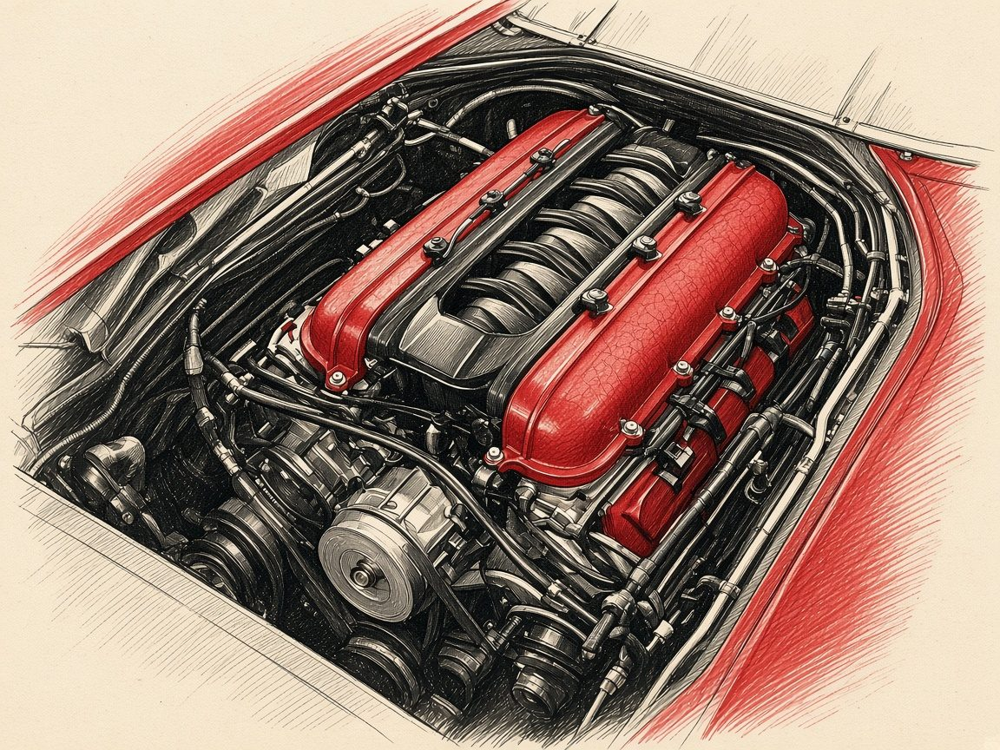

*페라리 F140 V12. 엔진이 차의 얼굴과 영혼을 만들던 시대.*

### 같은 심장, 다른 엠블럼

한때 엔진은 브랜드의 영혼이었다. 페라리의 V12, 포르쉐의 수평대향 6기통, BMW의 직렬 6기통, 헤미 V8은 이름만으로 소리와 성격이 떠올랐다. 그러나 개발비가 천문학적으로 치솟고 규제 대응 비용이 커지면서, 자동차 회사들은 **엔진과 플랫폼을 그룹 단위로 공유**하는 쪽으로 움직였다.

폭스바겐 그룹의 공용 플랫폼 MQB 위에서 골프와 아우디 A3, 스코다 옥타비아, 세아트 레온이 같은 뼈대와 같은 EA888 엔진을 나눠 쓴다. 포르쉐 마칸의 기본형 2.0 터보는 그룹의 EA888 계열이고, 카이엔과 파나메라의 V6·V8은 그룹 내 공용 엔진 계열이다. 람보르기니 우루스와 벤틀리 벤테이가도 같은 4.0L V8 트윈터보 계열을 각자의 성격에 맞게 다듬어 쓴다. 토요타 수프라는 BMW B58을 얹는다. 오늘날 상당수 고급차의 엔진은 **공용 엔진을 튜닝하고 소리와 반응을 브랜드에 맞게 다시 조율한 결과물**이다. 다만 포르쉐 911의 수평대향 6기통은 여전히 포르쉐가 직접 개발하고, 페라리는 지금도 모든 엔진을 마라넬로에서 자체 설계·생산한다. 페라리가 엔진을 포기했다면, 그것은 남의 엔진을 가져다 쓰는 방식이 아니라 **엔진 자체를 없앤 첫 차**를 통해서였다.

플랫폼화의 논리는 차체로도 확장됐다. 토요타 TNGA, 현대차그룹 3세대 통합 플랫폼, 스텔란티스 STLA, 그리고 전기차 전용 플랫폼들은 수십 개 차종이 바닥 구조와 전자 아키텍처를 공유하게 만들었다. 원가와 품질에는 이득이지만, 같은 뼈대 위에 다른 '옷'만 입히는 구조에서 차의 비례와 자세는 점점 비슷해진다.

### 엔진이 사라지자 얼굴도 사라졌다

엔진은 자동차의 형태를 결정해 왔다. 긴 직렬 6기통을 세로로 놓으려면 보닛이 길어야 했고, V12를 앞차축 뒤에 밀어 넣으려면 운전석이 뒤로 물러나야 했다. 엔진을 식히려면 커다란 그릴이 필요했고, 그 그릴은 곧 브랜드의 얼굴이 됐다. BMW의 키드니 그릴, 롤스로이스의 판테온 그릴, 알파 로메오의 방패 그릴은 모두 엔진 냉각이라는 기능에서 태어났다.

엔진이 사라지거나 작아지면, 그 형태를 정당화하던 근거도 함께 사라진다. 그 빈자리를 채우는 것은 두 가지 힘이다. 첫째는 **공기역학**이다. 전기차에서 주행거리는 곧 상품성이고, 공기저항계수를 낮추는 일이 배터리 용량을 늘리는 것보다 싸게 먹히는 경우가 많다. 컴퓨터 유체역학으로 최적화를 거듭하면 누가 설계하든 정답은 비슷한 곳으로 수렴한다. 둥글게 깎인 앞머리, 뒤로 길게 떨어지는 지붕, 칼로 자른 듯한 꼬리, 매끈하게 막힌 전면부. 둘째는 **법규**다. 유럽의 보행자 보호 규정과 충돌 평가는 보닛과 내부 부품 사이에 충분한 변형 공간을 요구해 보닛을 높이고 앞머리를 두툼하게 만들었다. 전기차는 바닥에 배터리를 깔아야 하기 때문에 차체가 높아지고, 높아진 차체는 다시 공기저항을 줄이기 위해 비슷한 곡면으로 다듬어진다.

그래서 거리에는 엠블럼을 떼면 어느 회사 차인지 알기 어려운 매끈한 SUV와 전기차가 넘쳐난다. 12장에서 이야기한 튜닝 문화가 사라지는 것도 같은 흐름이다. 바꿀 엔진도, 깎을 흡배기도 없는 차에서 개성을 표현할 방법은 랩핑 색깔과 화면 테마 정도로 줄어들었다.

### 페라리 루체 - 엔진을 잃은 말의 얼굴

이 몰개성 논쟁이 가장 극적으로 폭발한 것이 2026년 5월 26일 로마에서 공개된 페라리의 첫 순수 전기차 **루체(Luce, '빛')** 다. 4도어 5인승, 시작 가격 55만 유로, 애플 출신 조너선 아이브와 마크 뉴슨의 디자인 회사 러브프롬이 함께 디자인했다. 온라인에서는 "닛산이나 저가 토요타처럼 생겼다", "테슬라 모델 3와 혼다 어코드를 섞은 것 같다"는 조롱이 쏟아졌고, 공개 당일 페라리 주가는 장중 8% 가까이 빠졌다. 루카 디 몬테제몰로 전 회장은 "최소한 도약하는 말 엠블럼은 떼라"고까지 했다.

루체는 지나치게 파격적이어서가 아니라 **너무 평범해서** 비판받았다. 디자이너들은 디테일과 면 처리는 훌륭하지만 비례가 페라리답지 않다고 지적했다. 페라리의 비례는 엔진이 만들었다. F140 V12가 사라지고 바닥에 배터리가 깔리는 순간 그 비례를 만들던 하드웨어도 함께 사라졌고, 그 빈자리를 공기역학과 법규가 채우자 페라리조차 전기 SUV의 전형적인 볼륨으로 수렴했다. 한때 "중국차는 유럽차를 베낀다"고 조롱받았는데, 이제는 페라리가 "중국 전기차처럼 보인다"고 비판받는 시대가 됐다.

페라리는 루체가 처음부터 내연기관 페라리처럼 보이도록 의도된 차가 아니라고 반박했고, 실내는 호평을 받았다. 4인승 FF나 SUV 푸로산게도 처음엔 회의론에 시달리다 성공했다는 점에서 판단은 아직 이르다. 그러나 루체가 던진 질문은 페라리만의 것이 아니다. **엔진이 브랜드의 형태와 소리와 개성을 만들던 시대가 끝나면, 브랜드는 무엇으로 자신을 증명하는가.**

엔진을 사랑하던 세대가 사라지고(12장), 엔진이 보이지 않는 부품이 되며, 엔진이 만들던 얼굴마저 사라진다. **엔진의 몰락은 곧 개성의 몰락이다.** 그리고 역설적으로, 바로 그 이유 때문에 엔진은 다시 귀해질지도 모른다. 모든 차가 같아 보이는 시대에, 진짜 엔진의 소리와 진동은 대체할 수 없는 사치품이 될 것이기 때문이다.

## 28장. 자동차 산업의 미래와 엔진의 중요성

> **[이 시대의 엔진] 마쓰다 8C 로터리 발전기 (2023~)**
>
> 한때 RX-7과 RX-8의 심장이었던 로터리 엔진이, 이번에는 바퀴가 아니라 발전기를 돌리기 위해 돌아왔다. 작고 가볍고 진동이 적은 로터리의 장점이 '일정한 회전수로 전기만 만들면 되는' 역할에서 다시 빛을 본 것이다. **주인공에서 조연으로 역할을 바꿔 살아남는 엔진**, 그것이 다음 시대 엔진의 모습이다.

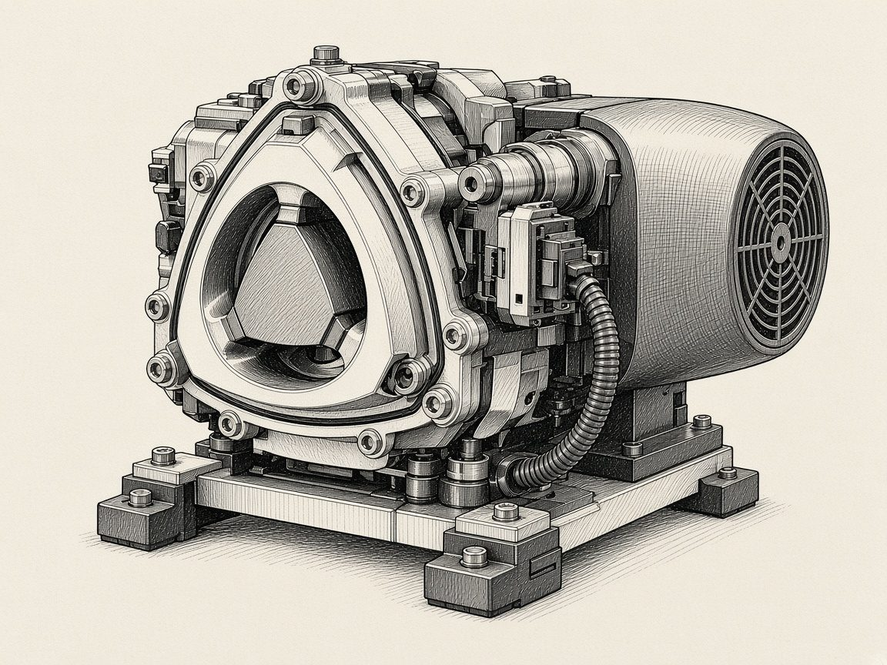

*마쓰다 8C 로터리 발전기. 주인공에서 조연으로 살아남는 엔진.*

### 엔진은 왜 여전히 중요한가?

"전기차 시대에 엔진 이야기가 무슨 의미가 있나." 지금까지의 이야기를 정리하면 답은 네 가지다.

첫째, **엔진은 전환기의 생명줄이다.** 전기차 전환은 직선이 아니라 지그재그로 진행되고 있다. 그 지그재그 구간을 버티게 해주는 것이 하이브리드, 플러그인 하이브리드, 주행거리 연장형이고, 그 모두에 엔진이 들어간다. 전환이 늦어질수록 엔진 기술의 가치는 올라간다. 중국조차 플러그인 하이브리드 전용 엔진에서 세계 최고 열효율을 다투는 이유다.

둘째, **엔진은 산업 주권이다.** 정주영이 엔진 독립을 고집한 이유(7장), 중국이 엔진을 우회하려 한 이유(23장), 벤츠가 중국산 엔진 때문에 미중 무역전쟁의 덫에 걸린 이유(19장)는 모두 같다. 엔진을 스스로 만들 수 있는 나라와 기업은 전략적 선택지를 가진다. 만들지 못하면 남이 정한 가격과 국경을 따라야 한다. 동남아가 반세기 동안 그 대가를 치렀다(8장, 25장).

셋째, **엔진은 에너지 안보다.** 전력망이 불안정하거나 충전 인프라가 부족한 신흥국, 장거리 이동이 필수인 대륙, 재난과 전쟁 상황에서 액체 연료를 쓰는 엔진은 여전히 가장 믿을 만한 동력원이다.

넷째, **엔진은 기술 생태계다.** 정밀 주조, 가공, 열관리, 연소 제어, 소재 기술은 엔진에서 출발해 다른 산업으로 퍼진다. 엔진 개발 역량이 무너지면 그 아래의 부품 협력사와 기술 인력도 함께 무너진다. 독일 부품 산업의 감원(24장)이 그 경고다.

### 다음 10년의 시나리오

**시나리오 1: 성벽의 시대 (2027~2030).** 미국은 관세와 공급망 규제를 강화해 중국산 부품이 들어간 차량의 미국 진입을 사실상 봉쇄한다. 벤츠처럼 중국에서 엔진을 조달하던 메이커들은 북미용 엔진 공급원을 따로 마련해야 한다. BMW 같은 엔진 강자에게는 외부 공급 사업의 기회가, 엔진을 외주하던 메이커에게는 비용 상승이 찾아온다. 북미 시장은 V8 픽업과 하이브리드 SUV가 지배하는 '내연기관의 섬'으로 남는다.

**시나리오 2: 규제 비용의 전가와 유럽의 재편 (2026~2030).** 유로 7 대응과 2035년 완화안의 상쇄 조건(저탄소 철강, 합성연료) 비용이 차량 가격에 전가된다. 수익성이 낮은 소형 내연기관차가 유럽 시장에서 사라지고, 그 빈자리를 EU 생산 소형 전기차와 중국 브랜드의 현지 생산 차량이 놓고 다툰다. 중국 시장을 잃은 독일 3사는 유럽과 미국에서 생존을 위한 구조조정과 합종연횡을 이어간다. 경쟁자끼리 엔진을 나눠 쓰는 일이 금기가 아니게 된다.

**시나리오 3: 하이브리드 수출 강국 한국 (2026~2032).** 엔진·변속기·하이브리드 시스템을 모두 자체 생산하는 현대차그룹이 미국 현지 공장과 한국 수출 물량을 결합해 하이브리드 시장 점유율을 크게 끌어올린다. 일본 메이커 일부가 구조조정에 빠지고 독일 3사가 중국 충격에서 회복하지 못하는 사이, 토요타와 함께 하이브리드 양강 구도를 형성할 가능성이 있다. 다만 이는 하이브리드 엔진의 장기 내구성, 미국 관세 협상, 그리고 중국 전기차와 중국 PHEV의 가격 공세를 얼마나 잘 견디느냐에 달려 있다.

**시나리오 4: 신흥국에서의 일본 대 중국 (2026~2035).** 동남아·남미·중동·아프리카에서 일본 하이브리드와 중국 전기차·PHEV가 정면으로 부딪힌다. 반세기 일본 종속 구조가 중국 종속 구조로 바뀔지, 아니면 그 틈에서 현지 브랜드나 한국 메이커가 새로운 자리를 만들지가 관전 포인트다.

이 시나리오들은 서로 배타적이지 않다. 오히려 동시에 진행될 가능성이 크다. 공통점은 하나다. **기술이 아니라 국경과 정책이 엔진의 운명을 먼저 결정한다는 것.**

### 엔진의 국적을 정하는 힘

80년의 역사를 한 줄로 정리하면 이렇다.

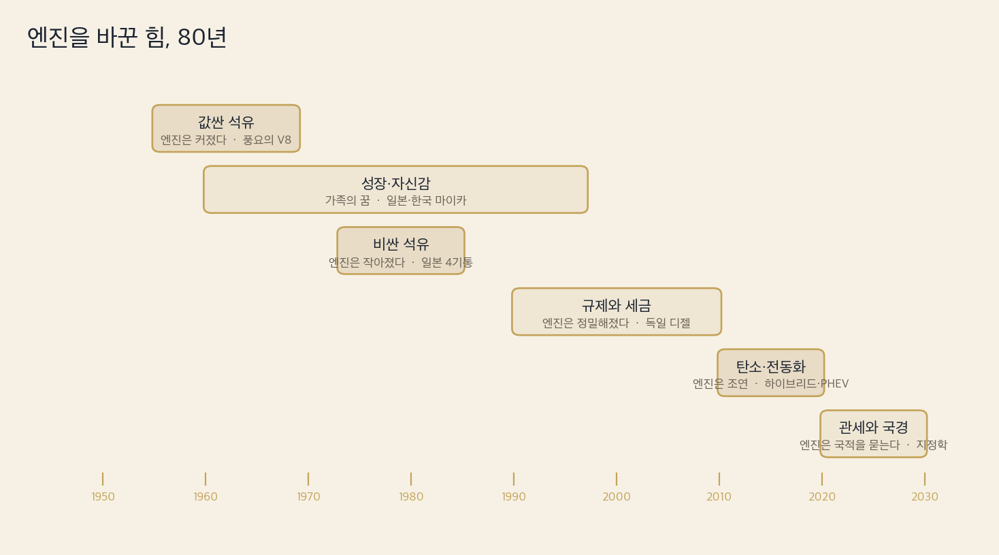

*석유에서 규제로, 규제에서 세금으로, 이제 국경으로.*

엔진을 바꾼 힘은 석유에서 규제로, 규제에서 세금으로, 그리고 이제 국경으로 옮겨왔다. 다음 시대에 엔진이 기억하게 될 것은 아마도, 기술이 아니라 국경이 엔진을 선택하던 시절일 것이다.

## 에필로그 - 다시, 네 개의 장면

1962년 캘리포니아의 소년은 지금 여든 살이 넘었다. 그의 차고에는 여전히 V8 머슬카 한 대가 서 있다. 1년에 몇 번밖에 몰지 않지만, 시동을 걸 때마다 그는 열여섯 살로 돌아간다.

1966년 도쿄의 회사원은 세상을 떠났다. 그의 아들은 지금 하이브리드를 탄다. 아버지가 1cc 단위로 고민하던 그 코롤라의 손자뻘 되는 차다. 열효율 41%짜리 엔진이 조용히 돌고 있지만, 아들은 그 숫자를 모른다.

1988년 서울의 과장은 은퇴했다. 그날 쏘나타 뒷좌석에 앉았던 아들은 지금 현대차를 산다. 아버지 세대가 "우리나라도 차를 만든다"며 뿌듯해하던 그 회사는 이제 세계 3위가 됐다. 그 아들은 가끔, 정주영이라는 이름과 알파 엔진 이야기를 자기 아이에게 들려준다.

2026년 캘리포니아의 손녀는 언젠가 운전면허를 딸 것이다. 그녀가 처음 사는 차는 아마 하이브리드이거나 전기차일 것이고, 그 차의 엔진은, 만약 있다면, 보닛 아래 조용히 숨어 배터리를 충전하는 조연일 것이다. 그 엔진은 한국에서 설계되고 미국 조지아에서 만들어졌을 수도, 중국에서 설계되고 헝가리에서 만들어졌을 수도 있다. 그녀는 그 엔진이 몇 기통인지, 어느 나라에서 왔는지 모를 것이다. 그녀는 아마 튜닝이라는 단어도 모를 것이다.

하지만 그 엔진은 기억할 것이다. 1973년 겨울 주유소 앞의 긴 줄을, 1966년 도쿄의 첫 드라이브를, 1985년 플라자 호텔의 합의를, 1991년 남양연구소에서 처음 돌아간 알파 엔진의 소리를, 2015년 폭스바겐의 소프트웨어를, 2025년 관세 협상 테이블을. 엔진은 시대를 기억한다. 우리가 잊더라도.

심장이 터질듯 소리치던 자동차의 시동음은 우리 시대의 선진국 대한민국을 만들었다.

*포니. 엔진은 아직 미쓰비시였지만, 한국은 고유 모델을 가진 나라가 됐다. 이야기의 시작.*

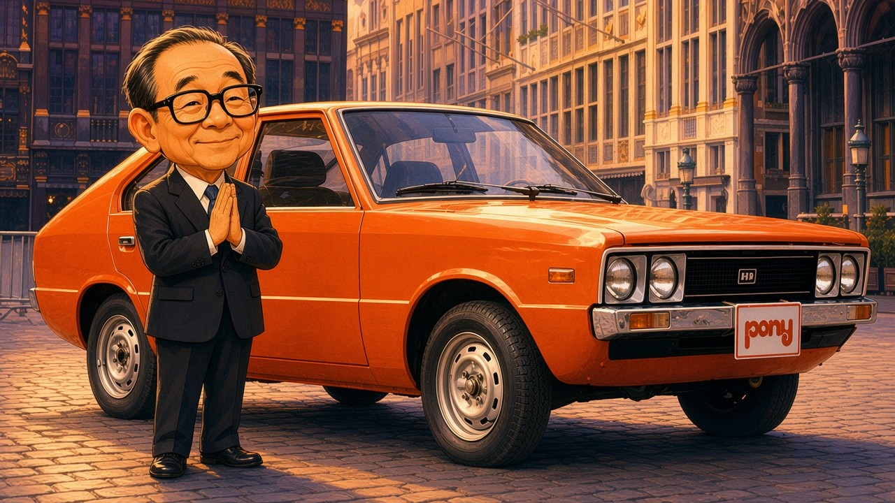

*조립공장이 될 것인가, 자동차 회사가 될 것인가. 정주영의 결단이 반세기 뒤의 보험이 됐다. 이야기의 끝이자 처음.*
 

---

# 부록

## 부록 1. 소비자를 위한 체크리스트

> - **엔진의 국적보다 엔진 코드와 세대를 확인하라.** 같은 브랜드, 같은 배기량이라도 세대에 따라 명작과 문제작이 갈린다.
> - **한랭지에서 짧은 거리를 반복 주행한다면** 소배기량 터보 직분사 엔진의 오일 희석 이력을 확인하고, 오일 교환 주기를 짧게 가져가라.
> - **장기 보유가 목적이라면** 타이밍 체인 구조(특히 후방 배치 여부)와 리콜·보증 연장 이력을 확인하라.
> - **견인이나 고부하 운행이 많다면** 실린더 비활성화 시스템 적용 여부와 정비 이력을 확인하고, 규정 오일을 지켜라.
> - **하이브리드라면** 내 운전 패턴을 먼저 보라. 도심 위주라면 직렬형(e:HEV, e-POWER)이, 고속도로 위주라면 엔진 직결 비중이 높은 병렬형(TMED)이나 동력 분배형(THS)이 유리할 수 있다. 집이나 회사에서 충전할 수 있다면 플러그인 하이브리드(DM-i 등)도 선택지다.
> - **하이브리드는 엔진이 자주 꺼졌다 켜지는 특성상** 카본과 오일 상태 점검을 소홀히 하지 마라.
> - **카탈로그의 최고 열효율 수치에 현혹되지 마라.** 의미 있는 것은 공인 복합 연비와 내 운전 패턴에서의 실연비다.

## 부록 2. 진영별 평판이 좋은 엔진과 문제작

정비 업계와 오너 커뮤니티에서 대체로 공유되는 평판을 정리한 것이다. 생산 연도는 대표 적용 기간의 대략적 범위이며, 시장과 차종에 따라 다를 수 있다. 중국 하이브리드 전용 엔진은 장기 데이터가 부족해 평가에서 제외했다.

| 진영 | 평판이 좋은 엔진 (코드, 대략 연도) | 문제작으로 꼽히는 엔진 (코드, 대략 연도) |
| --- | --- | --- |
| **현대·기아** | 세타 1세대 MPI (2004년 전후~), 람다 V6 (2005년 전후~) | 세타 II 2.0/2.4 GDi (2010년대 초중반 모델) |
| **일본** | 토요타 2JZ-GTE (1991~2002), 토요타 2GR-FE (2005~), 혼다 K20C (2015~) | 혼다 1.5T (2016~2018년식 일부), 토요타 2AZ-FE (2000년대 후반), 스바루 EJ25 (1990년대 후반~2010년대) |
| **독일** | BMW B58 (2015~), 폭스바겐 EA888 3세대 (2012~), 메르세데스 OM654 (2016~) | BMW N20 (2011~2017), BMW N47 (2007~2015), 폭스바겐 EA888 1·2세대 (2007~2012) |
| **미국** | GM LS3 (2008~2017), 커민스 6.7 (2007~), 포드 7.3 고질라 (2020~) | GM AFM 적용 5.3L V8 (2007~2013년 전후), 포드 1.6 에코부스트 (2010년대) |

## 부록 3. 각 장을 연 '이 시대의 엔진' 목록

| 장 | 엔진 | 상징하는 것 |
| --- | --- | --- |
| 1 | 쉐보레 스몰블록 V8 | 미국의 풍요 |
| 2 | 쉐보레 454 LS6 | 머슬카의 정점과 끝 |
| 3 | 혼다 CVCC | 오일쇼크와 일본의 시간 |
| 4 | 미쓰비시 4G54 아스트론 | 미국 차 속의 아시아 심장 |
| 5 | 토요타 K형 / 대우 티코 3기통 | 일본·한국 마이카의 꿈 |
| 6 | 엑셀의 미쓰비시 1.5L | 한국차의 영광과 한계 |
| 7 | 현대 알파 | 한국의 엔진 독립선언 |
| 8 | 프로톤 사가의 미쓰비시 4G15 | 동남아의 종속 |
| 9 | 세타 / 월드 엔진 | 로열티의 역전 |
| 10 | 폭스바겐 1.9 TDI | 세금이 만든 디젤 |
| 11 | 헬캣 6.2 헤미 | 머슬카의 마지막 불꽃 |
| 12 | 토요타 2JZ-GTE | 튜닝 세대의 전설 |
| 13 | 토요타 A25A-FXS | 효율의 시대 |
| 14 | BMW B58 | 현역 내연기관의 정점 |
| 15 | 토요타 1NZ-FXE | 하이브리드의 탄생 |
| 16 | 현대 세타 II GDi | 효율의 대가 |
| 17 | BYD 5세대 DM 1.5L | 중국 엔진의 반격 |
| 19 | 메르세데스 M252 | 국경에 갇힌 심장 |
| 20 | 폭스바겐 EA888 | 중국 금광의 곡괭이 |
| 21 | 포드 고질라 / 램 헤미 | 성벽 안의 V8 |
| 22 | 폭스바겐 EA189 | 디젤게이트 |
| 23 | 산타나 4기통 | 중국 합자 시대 |
| 24 | BYD 블레이드 배터리 | 엔진의 자리를 빼앗은 심장 |
| 25 | 닛산 ZR15DDTe | 좋은 엔진, 위기의 회사 |
| 26 | 현대 스마트스트림 2.5T 하이브리드 | 엔진의 귀환 |
| 27 | 페라리 F140 V12 | 엔진이 만든 개성 |
| 28 | 마쓰다 8C 로터리 발전기 | 조연으로 살아남는 엔진 |

---

### 참고: 필자의 관련 칼럼

- Dennis Kim, 「보조금 정책이 만든 거품 vs 정리 국면의 산업 재편 메커니즘 — 중국 전기차 산업의 초토화 전략과 글로벌 자동차 산업의 운명」, vibe-investing, 2026. https://github.com/gameworkerkim/vibe-investing/blob/main/02.Investment%20Idea%20Column/China%20EV_Industry_Restructuring_Analysis/China_EV_Industry_Restructuring_Analysis_DennisKim_2026_KO.md
