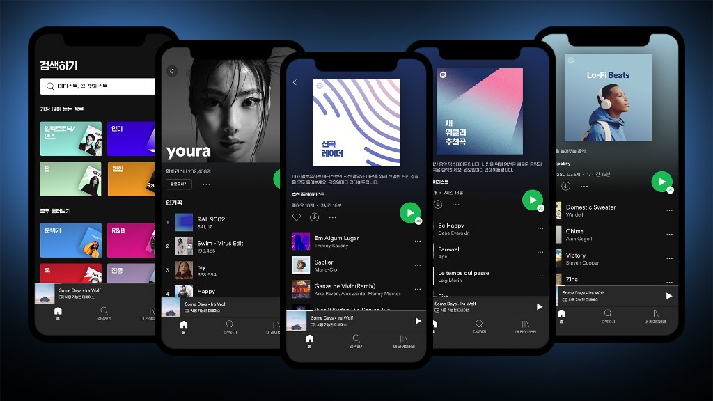

<!--
  HEAD 참조 (렌더링 안 됨 · 빌드 자동 주입 · 주석 풀지 말 것)
  <title>하이퍼넛지의 시대, 취향을 발견한다는 것의 의미 · VibeQuant</title>
  <meta name="description" content="추천은 취향을 찾아내지 않고 제조한다. 유튜브 시청의 70%가 추천이다. 하이퍼넛지 앞에서 내 답을 먼저 쓰지 않으면, 고르지 않은 사진의 이유를 지어내게 된다.">
  <meta name="robots" content="index,follow">

  
-->

# 하이퍼넛지의 시대, 취향을 발견한다는 것의 의미

## 추천은 넘치고 이유는 사라진 시대에 내 선택을 되찾는 법

*검색, 아티스트, 신곡 레이더, 위클리 추천. 목록은 알고리즘이 차리고, 우리는 차려진 것을 고른다.*

**김호광** 싸이월드 전 대표 / 2026년 9월 22일

## 1. 당신의 취향은 정말 당신의 것인가?

스포티파이가 만들어준 플레이리스트를 듣고, 유튜브가 띄운 "다음 영상"을 누르고, 쇼핑앱이 "당신을 위한 추천"이라며 내민 상품을 장바구니에 담는다. 그 순간마다 우리는 선택하고 있다고 느낀다. 그러나 목록은 누군가 설계했고, 순서는 알고리즘이 정했으며, 타이밍은 당신의 클릭 패턴을 실시간으로 학습한 모델이 골랐다.

법학자 캐런 영(Karen Yeung)은 2017년 이 상황에 **하이퍼넛지(hypernudge)** 라는 이름을 붙였다. 탈러와 선스타인의 고전적 넛지가 구내식당에서 샐러드를 눈높이에 놓는 식의 **정적인** 선택 설계라면, 하이퍼넛지는 빅데이터와 기계학습으로 **개인마다, 매 순간 갱신되는** 동적 선택 환경이다. 영은 이것을 "설계에 의한 규제(regulation by design)"의 한 형태로 보았다. 눈에 잘 띄지 않고, 민첩하게 움직이며, 그래서 강력하다. 모든 사람에게 같은 체크박스를 보여주던 넛지가, 이제는 당신에게 가장 잘 먹히는 선택지를 가장 잘 먹히는 순간에 내민다.

여기에 한 가지 불편한 사실이 더해진다. 심리학은 오래전부터 **취향이 발견되는 것이 아니라 구성된다**고 말해왔다. 리히텐슈타인과 슬로빅이 정리한 "선호 구성" 이론에 따르면 사람들은 머릿속에 완성된 선호 목록을 들고 다니지 않는다. 선호는 선택하는 순간, 주어진 맥락 속에서 만들어진다. 로버트 자이언스의 **단순 노출 효과**는 자주 본 것을 더 좋아하게 된다는 사실을 보여주었다. 그렇다면 추천 알고리즘은 당신의 취향을 "찾아내는" 것이 아니다. 무엇을 반복해서 보여줄지 정함으로써 취향을 **제조**한다.

살가닉, 도즈, 와츠의 2006년 "뮤직랩" 실험은 이를 극적으로 보여준다. 같은 곡들을 여러 개의 독립된 "가상 세계"에 풀어놓고, 다른 사람들의 다운로드 수를 보여주자 세계마다 전혀 다른 곡이 히트했다. 곡의 품질은 결과를 부분적으로만 설명했다. 나머지는 초기에 누가 무엇을 봤느냐가 결정했다. 인기 순위를 보여주는 것만으로 취향의 지도가 바뀐 것이다.

문제는 이 모든 것이 "선택의 자유"를 형식적으로는 보존한다는 점이다. 거부할 수 있다. 다른 걸 고를 수 있다. 하지만 **거부의 인지적 비용**이 설계 단계에서 이미 높아져 있다. 이것은 강제가 아니다. 강제보다 효율적이다.

## 2. 우리는 추천을 거의 그대로 받아들인다

통계 데이터부터 보자. 2018년 유튜브의 최고제품책임자 닐 모한은 CES에서 유튜브 시청 시간의 **70% 이상**이 검색이 아니라 추천 알고리즘에서 나온다고 밝혔다. 넷플릭스의 고메스-우리베와 헌트는 2015년 논문에서 시청 시간의 약 **80%** 가 추천을 통해 발생한다고 보고했다. 우리는 스스로 찾아서 보는 것이 아니라, 대부분 **차려진 것을 먹는다.**

생성형 AI는 이 흐름을 쇼핑과 정보 탐색으로 넓히고 있다. 세일즈포스의 2025년 조사에서 소비자의 39%, Z세대의 절반 이상이 이미 AI로 상품을 탐색하고 있었다. 그런데 AI 기반 서비스를 신뢰한다는 소비자는 44%에 그쳤다(메트리지 조사). 믿지 않는다고 말하면서 쓰고 있는 셈이다.

실험실 데이터는 이 간극, 곧 **태도와 행동의 괴리**를 더 선명하게 보여준다. 독일 파더보른대학의 코르노비치와 톰메스(2025)는 참가자들에게 AI의 조언을 주고 반응을 관찰했다. 참가자들은 "전문가가 관여한 AI"를 선호한다고 **말했지만**, 실제로 조언을 따르는 비율은 AI가 어떻게 만들어졌는지와 무관하게 같았다. 자신의 초기 판단이 AI와 다를 때 **44.77%** 가 AI 쪽으로 답을 바꿨고, 자기 판단에 대한 확신이 낮을수록 의존도는 높아졌다.

2026년 카프라로 등 이탈리아·프랑스 연구진의 결과는 더 불편하다. AI가 자주 틀리는 문제를 일부러 골라 실험했더니, AI를 쓸 수 있게 되자 "모르겠다"고 답하는 비율이 **44%에서 3%** 로 무너졌다. 정답률은 27%에서 9%로 떨어졌는데, 자신감은 30%에서 76%로 올랐다. 혼자였다면 맞혔을 사람이 AI에게 물어서 틀렸다. 와튼스쿨 연구진은 같은 현상을 **인지적 항복(cognitive surrender)** 이라 불렀다.

그러니 "우리는 AI의 추천을 거의 대부분 선택한다"는 말은 정확히 이렇게 고쳐 써야 한다. 우리는 추천과 부딪칠 때마다 무조건 굴복하지는 않는다. 하지만 **무엇을 고를지의 메뉴 자체**를 알고리즘이 정하고, 우리의 하루는 대부분 그 메뉴 안에서 흘러간다. 그리고 확신이 흐려지는 순간, 우리는 알고리즘이 내미는 가장 매끄러운 길로 기운다.

## 3. 판단 없는 선택은 의지를 어떻게 약화시키는가?

흔히 "의지는 근육"이라고 말한다. 다만 이 비유를 대표하던 **자아 고갈(ego depletion)** 이론은 2016년 23개 연구실이 참여한 대규모 재현 연구에서 효과를 거의 확인하지 못했다. 그러니 의지를 쓰면 닳는 연료로 볼 근거는 약하다. 대신 더 탄탄한 증거가 가리키는 것은 **쓰지 않는 판단 능력은 퇴화한다**는 사실이다. 연료가 아니라 기술의 문제다.

인지공학자 리산 베인브리지는 1983년 「자동화의 아이러니」에서 이 역설을 짚었다. 자동화가 정교해질수록 인간은 감시자로 밀려나고, 감시만 하는 인간은 정작 시스템이 실패하는 순간 개입할 기술을 잃는다. 일상에도 증거가 있다. 다흐마니와 보봇(2020)의 연구에서 GPS 내비게이션에 오래 의존한 사람일수록 공간 기억 능력이 낮았고, 3년 추적 관찰에서도 GPS 사용이 많을수록 해마 의존적 공간 기억이 더 많이 떨어졌다. 길을 찾는 판단을 위임하면 길을 찾는 능력이 줄어든다.

생성형 AI도 비슷한 신호를 보낸다. 마이크로소프트 연구진 등이 2025년 지식노동자 319명을 조사한 결과, **AI에 대한 신뢰가 높을수록 비판적 사고에 들이는 노력이 줄어드는** 경향이 나타났다. 반대로 자기 능력에 대한 신뢰가 높은 사람은 AI의 출력을 더 많이 검토했다. MIT 미디어랩의 2025년 뇌파 실험은 챗봇으로 에세이를 쓴 집단에서 뇌 연결성이 낮게 나타났다고 보고했다. 다만 이 연구는 표본이 작고 동료 심사 전인 프리프린트여서 결론을 일반화하기에는 이르다.

여기서 **자동화 편향(automation bias)** 이 작동한다. 시스템이 믿을 만할수록 사람은 덜 확인하고, 덜 확인할수록 시스템이 틀렸을 때 알아채는 능력 자체가 줄어든다. 행동경제학의 **기본값 효과**와 **현상 유지 편향**이 그 위에 겹친다. 아무것도 하지 않는 것이 곧 수용인 환경에서, 선택의 자유는 형식으로만 남는다.

그리고 가장 무서운 발견이 있다. 스웨덴의 요한손과 홀은 2005년 《사이언스》에 **선택맹(choice blindness)** 실험을 발표했다. 참가자에게 두 얼굴 사진 중 더 매력적인 쪽을 고르게 한 뒤, 몰래 **고르지 않은 사진**을 건네며 이유를 물었다. 대부분은 바뀐 것을 알아채지 못했고, 자신이 고르지 않은 얼굴을 고른 이유를 **그럴듯하게 설명했다.** 판단 없이 선택해도 우리는 이유를 사후에 지어낸다. 추천을 받아들인 뒤 "원래 이런 걸 좋아했어"라고 말하는 우리 자신처럼.

## 4. 빅테크의 데이터 가공과 추천의 정치경제학

하이퍼넛지의 힘은 데이터에서 나온다. 플랫폼은 클릭만 기록하지 않는다. 체류 시간, 스크롤 속도, 멈칫한 순간, 재방문 간격 같은 **암묵적 신호**를 모은다. 이 데이터가 답하려는 질문은 "당신은 무엇을 좋아하는가"가 아니라 **"당신은 다음에 무엇을 할 가능성이 가장 높은가"** 다. 목표는 취향의 발견이 아니라 **참여(engagement)의 극대화**다.

목표 설정이 결과를 바꾼다. 유튜브는 2012년 추천의 기준을 조회수에서 **시청 시간**으로 바꿨다. 이후 전체 시청 시간은 3년 연속 해마다 약 50%씩 늘었다. 그러나 내부와 외부에서 이 지표가 자극적이고 극단적인 콘텐츠에 보상을 준다는 비판이 나왔다. 페이스북은 2018년 "의미 있는 사회적 상호작용(MSI)"을 높이겠다며 뉴스피드 알고리즘을 바꿨다. 2021년 《월스트리트저널》이 공개한 내부 문서, 이른바 "페이스북 파일"에 따르면 사내 연구자들은 이 변경이 플랫폼을 오히려 **더 화나게** 만들었다고 경고했다. 언론사와 정당들이 분노와 선정성으로 게시물 방향을 틀었기 때문이다.

이 현상에는 구조적인 이유가 있다. 구글 엔지니어 스컬리 등은 2015년 기계학습 시스템의 "숨은 기술 부채"를 다룬 논문에서 **피드백 루프**를 핵심 위험으로 꼽았다. 모델의 출력이 세상을 바꾸고, 바뀐 세상이 다시 모델의 학습 데이터가 된다. 페르도모 등은 2020년 이를 **수행적 예측(performative prediction)** 으로 정식화했다. 추천 시스템은 당신을 관찰하는 것이 아니라, **자신이 바꿔놓은 당신**을 관찰한다.

한국에도 사례가 있다. 공정거래위원회는 2024년 쿠팡이 검색 순위 알고리즘을 조작해 자체 브랜드(PB) 상품과 직매입 상품을 상위에 노출하고, 임직원을 동원해 PB 상품 후기를 작성하게 했다며 과징금 1,628억 원을 부과했다. 국내 유통업계 역대 최대 규모다. 공정위 조사에 따르면 이 기간 검색 순위 100위 안에 드는 PB 상품 비율은 56.1%에서 88.4%로 늘었다. 쿠팡은 이 판단에 불복해 행정소송을 제기했다. 소송 결과와 별개로, 이 사건은 "쿠팡 랭킹순"이라는 중립적으로 보이는 정렬이 실제로는 **플랫폼의 이해관계가 반영된 선택 설계**일 수 있음을 보여준다.

책임이 알고리즘에만 있는 것도 아니다. 레옹과 우르민스키(2025, PNAS)는 21개 연구에서 **좁은 검색 효과(narrow search effect)** 를 확인했다. 사람들은 이미 가진 믿음 쪽으로 기운 검색어를 입력하고, 검색 엔진과 챗GPT는 그 검색어에 충실한 결과를 돌려주며, 결과적으로 믿음은 바뀌지 않는다. 사용자에게 "넓게 생각하라"고 권하는 개입은 효과가 약했다. 반면 알고리즘이 더 넓은 결과를 보여주도록 설계를 바꾸자 믿음이 업데이트되었다. 반향실은 우리와 알고리즘이 **함께** 짓는다. 그리고 설계를 바꾸면 무너뜨릴 수도 있다.

제도는 이제 막 이 사실을 받아들이기 시작했다. EU 디지털서비스법(DSA) 제38조는 초대형 플랫폼에 **프로파일링에 기반하지 않는 추천 옵션**을 최소 하나 제공하도록 의무화했다. 하이퍼넛지를 끌 수 있는 스위치를 법이 요구하기 시작한 것이다.

## 5. 취향을 발견한다는 것 - 분리와 복기의 실천

그렇다면 어떻게 해야 하는가. 답은 AI를 끊는 것이 아니다. 그것은 현실적이지도 유용하지도 않다. 필요한 것은 **AI의 의견과 내 의견을 분리하고, 결정 과정을 복기하는 습관**이다.

먼저 자율성이라는 말부터 바로잡자. 데시와 라이언의 **자기결정성 이론**에서 자율성은 외부의 영향을 전혀 받지 않는 상태가 아니다. 자신이 **스스로 승인할 수 있는 이유**에 따라 행동하는 상태다. 추천을 따라도 자율적일 수 있다. 다만 그 추천을 왜 받아들였는지 내 언어로 말할 수 있어야 한다.

**첫째, 내 답을 먼저 쓰고 AI에게 물어라.** 부친카 등(2021)의 연구에서, 사람들이 AI의 답을 보기 전에 스스로 먼저 판단하도록 만든 장치, 곧 "인지 강제 기능(cognitive forcing function)"은 AI에 대한 과잉 의존을 줄였다. 순서가 중요하다. AI의 답을 먼저 보면 그것이 기준점이 되어 내 판단 전체를 앵커링한다. 내 답을 먼저 적으면 AI의 답은 **반론**이 된다. 그리고 AI에게는 "결론을 달라"가 아니라 "내 결론의 허점을 짚어달라"고 요청하라. AI는 대안을 제시하는 데 강하지만, 당신이 무엇을 중요하게 여기는지 아는 데는 약하다.

**둘째, 마찰을 의도적으로 되찾아라.** 자동 재생을 끈다. 피드를 추천순이 아닌 시간순이나 비개인화 옵션으로 바꾼다. 검색어를 입력하기 전에 **반대 방향의 검색어도 하나** 넣는다. 레옹과 우르민스키의 연구가 보여주듯, 좁은 질문은 좁은 답을 부른다. AI의 답변을 그대로 복사하지 말고 자기 문장으로 다시 쓴다. 다시 쓰는 동안 동의하지 않는 문장이 보이기 시작한다. 마찰은 불편이 아니라 판단 능력을 쓰는 훈련이다. 데이터 주도 사회에서의 자율성을 작품으로 다뤄온 네덜란드 예술가 율리아 얀센의 작업이 말하듯, 데이터가 나를 안내하는 상태에서 벗어나려면 **내가 무엇을 원하는지를 먼저** 분명히 해야 한다.

**셋째, 결정 일지를 써라.** 하루에 하나, 의미 있는 선택을 골라 세 가지를 적는다. 무엇을 골랐는가. 그것은 추천이었는가, 내가 찾은 것인가. 왜 골랐는가. 그리고 일주일 뒤 만족도를 다시 적는다. 핵심은 **선택하는 순간에** 적는 것이다. 선택맹 실험이 보여주듯 사람은 나중에 이유를 지어내기 때문이다. 투자자들이 매매 일지를 쓰는 이유도 같다. 결과를 안 뒤에 떠올린 이유는 믿을 수 없다. 기록이 쌓이면 패턴이 보인다. 추천을 따랐을 때와 스스로 찾았을 때, 어느 쪽이 더 오래 만족스러웠는가. 그 패턴이 바로 **당신의 취향**이다.

취향을 발견한다는 것은 좋아하는 것의 목록을 작성하는 일이 아니다. **내가 왜 그것을 좋아하는지 설명할 수 있는 상태**에 도달하는 일이다. 하이퍼넛지의 시대에는 바로 이 설명 능력이 희소해진다. 추천은 풍부하지만 이유는 빈곤하다. 풍요 속의 이유 빈곤, 이것이 우리가 마주한 진짜 문제다.

## 6. 병렬화되지 않는다는 것

매트릭스의 오라클은 네오에게 말했다. 너는 이미 선택했다, 왜 그렇게 선택했는지 이해하러 왔을 뿐이다. 하이퍼넛지 시대의 알고리즘은 정반대로 말한다. 당신은 이미 선택했다, 그 선택이 왜 당신의 것인지는 묻지 마라. 이유를 묻는 순간 최적화가 방해받기 때문이다.

개인의 주체로 살아간다는 것은 **네트워크에 병렬화되지 않는다는 것**이다. 수십억 명이 같은 모델에게 같은 질문을 던지고 같은 답을 받아 같은 방향으로 움직일 때, 개인은 거대한 연산의 한 노드가 된다. 그 흐름에서 잠시 벗어나 "나는 여기서 무엇을 원하는가"를 묻는 것. AI의 의견과 내 의견을 두 칸에 나눠 적고, 결정의 이유를 복기하고, 때로는 AI가 "최적"이라고 말한 선택을 거부하고 60점짜리지만 내 것인 선택을 감행하는 것. 그것이 취향을 발견하는 일이다. LLM은 엑셀이지 오라클이 아니다. 계산은 맡길 수 있어도, 무엇을 계산할지는 맡길 수 없다.

AI는 거울이 아니다. 거울은 당신을 비추지만, 추천 알고리즘은 당신이 **반응할 것이라 예측한** 것을 비춘다. 그 둘을 구분하지 못하면, 우리는 선택맹 실험의 참가자처럼 고르지 않은 사진을 들고 그것을 고른 이유를 열심히 설명하게 될 것이다. 그 목록의 저자가 누구인지는 끝까지 모른 채로.

## 레퍼런스

**하이퍼넛지와 선택 설계**

1. Yeung, K. (2017). "'Hypernudge': Big Data as a Mode of Regulation by Design." *Information, Communication & Society*, 20(1), 118–136. https://doi.org/10.1080/1369118X.2016.1186713
2. Thaler, R. & Sunstein, C. (2008). *Nudge: Improving Decisions about Health, Wealth, and Happiness.* Yale University Press.
3. Regulation (EU) 2022/2065 (Digital Services Act), Article 38 — 초대형 플랫폼의 비프로파일링 추천 옵션 의무. https://eur-lex.europa.eu/eli/reg/2022/2065/oj

**취향의 구성**

1. Lichtenstein, S. & Slovic, P. (Eds.) (2006). *The Construction of Preference.* Cambridge University Press.
2. Zajonc, R. B. (1968). "Attitudinal Effects of Mere Exposure." *Journal of Personality and Social Psychology*, 9(2, Pt.2). https://doi.org/10.1037/h0025848
3. Salganik, M. J., Dodds, P. S. & Watts, D. J. (2006). "Experimental Study of Inequality and Unpredictability in an Artificial Cultural Market." *Science*, 311(5762). https://doi.org/10.1126/science.1121066

**추천 수용과 AI 의존의 통계**

1. Tubefilter (2018). "YouTube Says 70% Of All Watch Time Is Driven By Its Own Recommendations" (CES 2018, 닐 모한 발언). https://www.tubefilter.com/2018/01/11/youtube-most-watch-time-driven-by-recommendations/
2. Gomez-Uribe, C. A. & Hunt, N. (2015). "The Netflix Recommender System: Algorithms, Business Value, and Innovation." *ACM Transactions on Management Information Systems*, 6(4). https://doi.org/10.1145/2843948
3. Salesforce (2025). "With AI Adoption Surging, Shopping Behavior Is at an Inflection Point." https://www.salesforce.com/news/stories/consumer-shopping-ai-trends-2025/
4. Salesforce (2026). "New Research: AI Service Agents Improve Customer Satisfaction" (Metrigy Consumer CX Index 인용). https://www.salesforce.com/news/stories/ai-service-agents-improve-customer-satisfaction/
5. Kornowicz, J. & Thommes, K. (2025). "Algorithm, Expert, or Both? Evaluating the Role of Feature Selection Methods on User Preferences and Reliance." *PLOS ONE*, 20(3). https://doi.org/10.1371/journal.pone.0318874
6. Capraro, V., Marcoccia, C. & Quattrociocchi, W. (2026). PsyArXiv preprint. https://osf.io/preprints/psyarxiv/5y6m4_v1 — 해설: TNW, "AI advice made people three times less accurate but twice as confident." https://thenextweb.com/news/ai-advice-suppresses-critical-thinking-wrong-answers-study
7. TNW (2026). 와튼스쿨 "인지적 항복(cognitive surrender)" 연구 보도. https://thenextweb.com/news/wharton-cognitive-surrender-ai-chatbots-decisions-moot-app

**판단 능력의 퇴화와 자동화 편향**

1. Bainbridge, L. (1983). "Ironies of Automation." *Automatica*, 19(6). https://doi.org/10.1016/0005-1098(83)90046-8
2. Dahmani, L. & Bohbot, V. D. (2020). "Habitual Use of GPS Negatively Impacts Spatial Memory during Self-Guided Navigation." *Scientific Reports*, 10. https://doi.org/10.1038/s41598-020-62877-0
3. Lee, H.-P. et al. (2025). "The Impact of Generative AI on Critical Thinking." *CHI 2025.* https://doi.org/10.1145/3706598.3713778
4. Kosmyna, N. et al. (2025). "Your Brain on ChatGPT." arXiv preprint (동료 심사 전). https://arxiv.org/abs/2506.08872
5. Parasuraman, R. & Manzey, D. H. (2010). "Complacency and Bias in Human Use of Automation." *Human Factors*, 52(3). https://doi.org/10.1177/0018720810376055
6. Johansson, P., Hall, L., Sikström, S. & Olsson, A. (2005). "Failure to Detect Mismatches Between Intention and Outcome in a Simple Decision Task." *Science*, 310(5745). https://doi.org/10.1126/science.1111709
7. Hagger, M. S. et al. (2016). "A Multilab Preregistered Replication of the Ego-Depletion Effect." *Perspectives on Psychological Science*, 11(4). https://doi.org/10.1177/1745691616652873

**빅테크 추천 알고리즘의 구조와 사례**

1. New America, "Why Am I Seeing This? — Case Study: YouTube" (2012년 시청 시간 지표 전환). https://www.newamerica.org/insights/why-am-i-seeing-this/case-study-youtube/
2. Hagey, K. & Horwitz, J. (2021). "Facebook Tried to Make Its Platform a Healthier Place. It Got Angrier Instead." *The Wall Street Journal* (The Facebook Files) — 요약 아카이브. https://incidentdatabase.ai/reports/1534
3. Sculley, D. et al. (2015). "Hidden Technical Debt in Machine Learning Systems." *NeurIPS 2015.* https://papers.nips.cc/paper_files/paper/2015/hash/86df7dcfd896fcaf2674f757a2463eba-Abstract.html
4. Perdomo, J. et al. (2020). "Performative Prediction." *ICML 2020.* https://arxiv.org/abs/2002.06673
5. Leung, E. & Urminsky, O. (2025). "The Narrow Search Effect and How Broadening Search Promotes Belief Updating." *PNAS*, 122. https://doi.org/10.1073/pnas.2408175122
6. 딜사이트 (2024). 공정위 쿠팡 제재 — PB 상품 노출 비율 및 임직원 후기 조사 결과. https://dealsite.co.kr/articles/123920
7. 뉴시스 (2024). "'1628억 과징금' 쿠팡 vs 공정위 법정다툼." https://www.newsis.com/view/NISX20241014_0002918847

**자율성과 실천**

1. Deci, E. L. & Ryan, R. M. (2000). "The 'What' and 'Why' of Goal Pursuits: Human Needs and the Self-Determination of Behavior." *Psychological Inquiry*, 11(4). https://doi.org/10.1207/S15327965PLI1104_01
2. Buçinca, Z., Malaya, M. B. & Gajos, K. Z. (2021). "To Trust or to Think: Cognitive Forcing Functions Can Reduce Overreliance on AI." *Proc. ACM HCI*, 5(CSCW1). https://doi.org/10.1145/3449287
3. Falling Walls — Julia Janssen (2024 Art & Science). https://falling-walls.com/node/1354

**초고 참고자료 (원고 제공, 본문 인용 미사용·미검증)**

1. Springer (2024). "'Hypernudging': a threat to moral autonomy?" *AI and Ethics.* https://link.springer.com/article/10.1007/S43681-024-00449-Y
2. Lu, W. (2024). "Inevitable challenges of autonomy: ethical concerns in personalized algorithmic decision-making." *Humanities & Social Sciences Communications.* https://www.nature.com/articles/s41599-024-03864-y
3. 신한금융그룹 (2026). "AI 쇼핑 추천, 정말 나를 위한 선택일까?" https://www.shinhangroup.com/kr/archive/insight/extend/detail/33229
4. Taylor & Francis (2026). "The AI-IARA framework: How to cultivate human agency." https://www.tandfonline.com/doi/full/10.1080/17439760.2026.2632939
