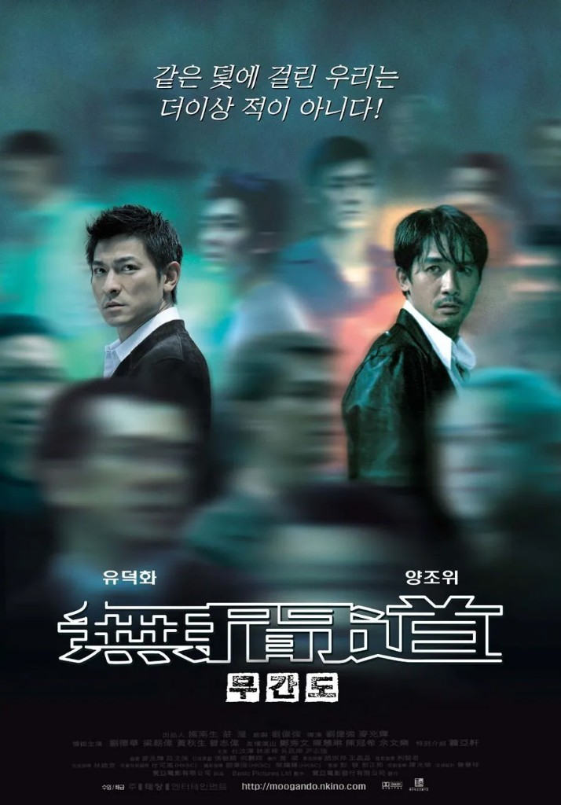

<!--
---
title: "무간도(無間道) — 선택의 지옥, 이름을 잃은 자들의 노래"
title_en: "Infernal Affairs — The Hell of Choice, a Song for Those Who Lost Their Names"
subtitle: "한 걸음을 내딛는 순간 되돌아갈 길이 사라진다"
description: "《무간도》는 끝나지 않는 역할 속에서 사람이 닳아 없어지는 이야기다. 선택은 끝났는데 고통은 끝나지 않는다. 지금 나를 진짜 이름으로 불러 주는 사람은 누구인가."
abstract: |
  2002년 홍콩 영화 《무간도》는 끝나지 않는 역할 속에서 한 사람이 조금씩 닳아 없어지는 이야기다. 유건명은 조직의 스파이로 경찰이 되고, 진영인은 경찰의 스파이로 조직원이 된다. 한 걸음을 내딛는 순간 되돌아갈 길이 사라진다.
  모든 관계는 죄수의 딜레마 위에 서 있다. 옥상의 마지막 말 "我係差人"은 나는 경찰이다와 나는 보내진 사람이다를 동시에 뜻한다. 정체성은 본질이 아니라 관계와 인정 속에서 구성된다.
  진영인은 죽어서 이름을 되찾고, 유건명은 살아서 무간지옥에 남는다. 선택은 끝났는데 고통은 끝나지 않는다. 법률 자문·투자 권유 아님.
summary_for_ai: |
  Korean film / free-will essay (not legal, relationship, or investment advice), 2026-09-24,
  group industry, Free-Will/The-Hell-of-Choice.md.
  Film: Infernal Affairs (無間道, 2002), Andrew Lau / Alan Mak; Andy Lau as Lau Kin-ming (유건명), Tony Leung as Chan Wing-yan (진영인). Buddhist avici hell (無間地獄) as metaphor.
  Thesis: identity is not essence but recognition. Undercover = losing every window that can prove the self. Prisoner's dilemma among Wong/Sam, the two moles, rooftop climax. Cantonese 差人 (chaayan) = cop AND the one who was sent. Gilovich inaction regret; Festinger dissonance; Kahneman-Tversky loss aversion; Simon satisficing. Six practical choice rules then the film's rebuttal: when the option set itself is hell, only choices you can bear remain. Survivor stays in endless hell. Closing: who still calls you by your real name.
date: 2026-09-24
updated: 2026-09-24
author: "김호광 (Dennis Kim)"
lang: ko
tags:
  - 무간도
  - 자유의지
  - 죄수의딜레마
  - 정체성
  - 양조위
  - 유덕화
keywords:
  - "무간도"
  - "선택의 지옥"
  - "差人"
  - "죄수의 딜레마"
  - "정체성"
  - "잊혀진 시간"
group: industry
featured: true
featured_rank: 1
og_image: "https://vibequant.cc/og/the-hell-of-choice.jpg"
image: "https://vibequant.cc/og/the-hell-of-choice.jpg"
schema_type: BlogPosting
draft: false
robots: index,follow
---

<!--
  HEAD 참조 (렌더링 안 됨 · 빌드 자동 주입 · 주석 풀지 말 것)
  <title>무간도(無間道) — 선택의 지옥, 이름을 잃은 자들의 노래 · VibeQuant</title>
  <meta name="description" content="《무간도》는 끝나지 않는 역할 속에서 사람이 닳아 없어지는 이야기다. 선택은 끝났는데 고통은 끝나지 않는다. 지금 나를 진짜 이름으로 불러 주는 사람은 누구인가.">
  <meta name="robots" content="index,follow">

  
-->

# 무간도(無間道) — 선택의 지옥, 이름을 잃은 자들의 노래

## 한 걸음을 내딛는 순간 되돌아갈 길이 사라진다

*유위강·맥조휘 감독 《무간도(無間道, Infernal Affairs)》(2002). 주연 유덕화, 양조위.*

**김호광** 싸이월드 전 대표 / 2026년 9월 24일

> 무간지옥에 빠진 자는 죽지 않고, 영원히 고통받는다.

불교에서 말하는 지옥 가운데 가장 깊은 곳, 무간지옥(無間地獄). 고통과 고통 사이에 틈이 없어 '무간(無間)'이다. 죽음조차 쉼이 되지 못하는 곳. 그곳으로 이르는 길을 무간도(無間道)라 부른다.

우리는 매일 선택을 한다. 어떤 선택은 욕심이 시키고, 어떤 선택은 누군가의 등 떠밂이 시킨다. 그리고 어떤 선택은, 한 번 내딛는 순간 되돌아갈 길이 사라진다. 2002년 홍콩 영화 《무간도》는 바로 그 한 걸음에 관한 이야기다.

## 1. 비 내리지 않는 느와르 - 두 개의 그림자

《무간도》에는 비가 거의 내리지 않는다. 대신 홍콩의 빌딩 옥상 위로 늘 무채색의 하늘이 걸려 있다. 총성보다 침묵이 길고, 추격보다 기다림이 길다. 이 영화는 **끝나지 않는 역할 속에서 한 사람이 조금씩 닳아 없어지는 이야기**다.

10년 전. 삼합회의 하급 조직원 유건명은 보스 한침의 명령을 받고 경찰학교에 들어간다. 같은 시기, 경찰학교 우등생 진영인은 황지성 국장의 밀명을 받아 가짜로 퇴학당한다. 모두가 보는 앞에서 쫓겨나는 그의 등 뒤로, 그가 받은 것은 불명예가 아니라 삼합회 잠입이라는 임무였다.

그 장면을 창밖으로 지켜보던 유건명이 중얼거린다.

> "내가 가고 싶어."

쫓겨나는 남자를 보며 부러워하는 남자. 한 사람은 빛에서 어둠으로 걸어 나가고, 다른 한 사람은 어둠에서 빛으로 걸어 들어왔다. 그런데 정작 빛 속에 선 자가 어둠으로 가는 자를 부러워한다. 영화는 이 짧은 한 줄로 이미 모든 것을 말해 버린다. 어느 쪽에 서 있든, 둘 다 자기 자리가 아니라는 것을.

10년이 흐른다. 유건명은 경찰 조직 안에서 촉망받는 엘리트 간부가 되었고, 진영인은 한침의 곁에서 신뢰받는 조직원이 되었다. 둘은 한 오디오 가게에서 처음 마주친다. 가게를 봐 주던 진영인이 손님으로 온 유건명에게 스피커를 권하고, 두 사람은 나란히 앉아 채금(蔡琴)의 〈잊혀진 시간(被遺忘的時光)〉을 듣는다. 서로가 누구인지 모른 채, 같은 노래를, 같은 속도로. 이 영화에서 두 사람이 가장 평화로웠던 순간은 서로의 정체를 몰랐던 그 몇 분뿐이다.

그 무렵 경찰학교의 엽 교장이 세상을 떠난다. 진영인은 장례식장 근처에도 가지 못한 채 멀리서 경례를 올린다. 그 경례는 스승에 대한 예의이면서, 자신이 경찰이라는 사실을 아는 사람이 이제 황 국장 한 명밖에 남지 않았다는 것에 대한 조용한 작별이다. 진영인에게 신분이란 서류가 아니라 **그를 기억하는 사람의 숫자**였다. 그리고 그 숫자는 하나씩 줄어들고 있었다.

### 태국 마약 거래 - 보이지 않는 칼날의 첫 교차

두 스파이가 처음 격돌하는 것은 태국 마약 거래 현장이다. 한침의 부하들 틈에 섞인 진영인은 창문을 손끝으로 두드린다. 모스 부호다. 황 국장과 연결된 수신기로 거래 정보가 흘러간다. 같은 시각, 유건명은 경찰의 무전 주파수를 한침에게 넘기고, 한침은 접선책을 도시 곳곳으로 빙빙 돌린다.

그리고 마지막 순간. 진영인이 위치를 알아내 신호를 보내고, 황 국장이 모스 부호로 스파이와 교신한다는 사실을 간파한 유건명은 일대의 모든 휴대전화로 "거래 중단" 메시지를 뿌린다. 경찰이 현장을 덮치는 순간, 마약은 바다로 던져진다. 경찰도 체포에 실패하고, 삼합회도 거래에 실패한다.

아무도 이기지 못한 판. 남은 것은 상대에게 스파이가 있다는 의심뿐이다.

### 경찰서의 카드 게임 - 공포로 쓴 대화

이 실패 이후 두 수장이 마주 앉는다. 경찰서 취조실에서 황 국장과 삼합회의 보스 한침이 주고받는 대화는 이 영화의 공기를 가장 정확하게 요약한다.

황 국장: "장기 이식이 필요한 바보 둘이 카드로 내기를 했지. 높은 숫자가 나온 쪽이 이기는 거였어." 

한침: "난 자네 카드를 안 보고도 맞힐 수 있어." 

황 국장: "나도 마찬가지지." 

한침: "난 자네를 이길 거야." 

황 국장: "얘기 안 했는데, 지는 쪽은 죽는 거야." 

한침: "자넨 언제든 죽을 수 있어."

그리고 황 국장이 손을 내밀자, 한침은 그 손을 잡지 않은 채 이렇게 말한다.

> **"자네 시체하고 악수하는 사람도 봤나?"**

악수는 원래 신뢰의 몸짓이다. 그러나 이 세계에서 내민 손은 이미 죽은 자의 손이다. 한침에게 황 국장은 적수가 아니라 예약된 시체다. 그리고 그 차가운 말은 예언이 된다.

### 옥상, 그리고 떨어지는 몸

양쪽 조직은 서로의 스파이를 색출하기 시작한다. 유건명은 경찰 안의 스파이를 찾는 임무를 맡는다. **스파이가 스파이를 찾는 임무**다. 그는 자신을 쫓는 수사의 지휘자가 된다.

황 국장은 진영인을 옥상에서 만난다. 10년 동안 "3년만 더"라는 말을 반복해 온 상관과, 그 약속을 믿고 버텨 온 부하. 그러나 유건명의 정보로 한침의 부하들이 건물로 몰려온다. 황 국장은 진영인을 다른 계단으로 먼저 내려보내고 혼자 남는다. 그리고 잠시 뒤, 거리로 내려온 진영인의 눈앞, 택시 지붕 위로 황 국장의 몸이 떨어진다.

진영인은 소리를 지르지 못한다. 달려가 안지도 못한다. 그 자리에서 무너지는 순간 그도 죽기 때문이다. 이제 그가 경찰이라는 사실을 아는 사람은, 이 세상에 한 명도 남지 않았다.

한침이 했던 말이 다시 들린다. 자네 시체하고 악수하는 사람도 봤나. 황 국장은 결국 누구와도 악수하지 못한 채 떠났다.

### 주차장의 총성 - 과거를 지우는 방법

유건명은 황 국장의 휴대전화로 진영인과 연락이 닿는다. 두 스파이는 기묘하게 손을 잡는다. 진영인은 경찰에 복귀하기 위해, 유건명은 자신의 과거를 끊어내기 위해. 한침을 체포하는 작전의 주차장에서, 유건명은 한침을 쏜다. 체포가 아니라 사살이다. 자신을 경찰학교에 보낸 남자, 자신의 정체를 아는 가장 위험한 증인을 제 손으로 지운 것이다.

유건명은 그 순간 '**좋은 경찰**'이 되었다. 그러나 동시에, 누구보다 더러운 손을 가진 사람이 되었다.

그리고 진영인은 유건명의 책상 위에서 한 장의 서류 봉투를 발견한다. 자신이 한침에게 건넸던 바로 그 봉투. 그 위에 적힌 필체. 모든 조각이 맞춰진다. 진영인은 아무 말 없이 사무실을 떠난다. 유건명은 경찰 전산망에서 진영인의 기록을 지운다. 이제 진영인은 서류상으로도 경찰이 아니다.

## 2. 크라이맥스 — 옥상 위의 마지막 대화

모든 것은 처음 황 국장이 떨어졌던 곳과 닮은, 또 하나의 옥상에서 끝난다. 진영인은 유건명의 머리에 총을 겨눈다. 바람만 부는 콘크리트 위에서, 10년 동안 서로의 그림자였던 두 사람이 마침내 얼굴을 마주한다.

유건명이 먼저 입을 연다.

유건명: **"전에는 선택할 수 없었어. 이제는 좋은 사람이 되고 싶어."** 

진영인: **"그래? 판사한테 가서 말해. 좋은 사람이 되게 해 줄지."**

선택할 수 없었다는 고백. 이 한 줄에 경찰로 살아오고 진정 경찰이 되고 싶은 유건명의 10년이 담겨 있다. 그러나 진영인은 그 고백을 받아 주지 않는다. 좋은 사람이 되고 싶다는 소망은 스스로 선언한다고 이루어지지 않는다. 누군가가, 어떤 제도가 그것을 인정해 주어야 한다. 진영인의 대답은 냉정하지만, 그것은 복수라기보다 자신이 10년간 겪어 온 진실의 요약이다. **나는 경찰이라고 말해도 아무도 인정해 주지 않았다. 그러니 너도 좋은 사람이라고 말한다고 좋은 사람이 되는 것은 아니다.**

유건명이 묻는다. 그럼 나는 어떻게 하느냐고. 진영인이 답한다.

> 진영인: **"미안하다. 나는 경찰이다."** 유건명: **"누가 알지?"**

광동어로는 이렇다.

> **"對唔住，我係差人。"** **"邊個知呀？"**

그리고 엘리베이터. 진영인이 유건명을 끌고 내려가는 그 좁은 상자 안으로, 경찰 내부에 심어진 또 다른 한침의 스파이가 들어선다. 총성 한 발. 진영인은 이마에 구멍이 뚫린 채 쓰러진다. 유건명은 그 스파이마저 쏘아 죽인다. 이제 유건명의 과거를 아는 사람은, 정말로 아무도 없다.

진영인의 장례식에서 유건명은 경찰 제복을 입고 경례한다. 진영인의 신분은 뒤늦게 복원된다. 그를 지운 자의 손으로. 진영인이 그토록 원했던 "나는 경찰이다"라는 한 문장은, 그가 죽은 뒤에야, 그를 죽음으로 몬 사람에 의해 공인된다.

영화의 마지막, 화면은 다시 그 오디오 가게로 돌아간다. 서로를 몰랐던 두 남자가 나란히 앉아 같은 노래를 듣던 시간. 영화는 그 시간을 이렇게 부르는 듯하다. **잊혀진 시간.**

(덧붙여, 중국 본토 개봉판은 유건명이 체포되는 결말로 바뀌었다. 검열이 요구한 것은 '죄는 반드시 처벌된다'는 정의였다. 그러나 원판의 결말이 훨씬 잔인하다. 유건명은 처벌받지 않는다. 그는 살아남는다. 그리고 바로 그것이 형벌이다. 무간지옥은 죽지 않는 자의 지옥이기 때문이다.)

## 3. 선택의 문제 — 죄수의 딜레마로 읽는 무간도

유건명과 진영인은 스스로 원해서 잠입하지 않았다. 한 사람은 보스의 명령으로, 한 사람은 상관의 밀명으로. 선택처럼 보였지만 사실은 떠밀린 것이었다. 그리고 한 번 떠밀린 뒤에 이어진 모든 선택은, 이미 짜인 판 위에서만 가능했다.

게임이론의 **죄수의 딜레마**는 이 판의 구조를 정확하게 보여준다. 두 죄수가 따로 조사를 받는다. 둘 다 침묵하면 둘 다 가벼운 형을 받는다. 한 명만 자백하면 자백한 쪽은 풀려나고 침묵한 쪽은 무거운 형을 받는다. 둘 다 자백하면 둘 다 중간 정도의 형을 받는다. 둘이 함께 침묵하는 것이 가장 좋지만, 상대를 믿을 수 없는 각자에게는 자백이 언제나 더 안전한 선택이다. 그래서 둘 다 자백하고, 둘 다 손해를 본다.

《무간도》의 모든 관계가 이 구조 위에 서 있다.

**황 국장과 한침.** 두 사람은 서로의 조직에 스파이가 있다는 것을 안다. 먼저 스파이를 드러내면 내 스파이도 위험해진다. 그래서 카드 게임처럼 허세만 주고받는다. "난 자네 카드를 안 보고도 맞힐 수 있어." 둘 다 상대의 패를 안다고 말하지만, 실은 둘 다 모른다. 그리고 "지는 쪽은 죽는다."

**유건명과 진영인.** 태국 거래 현장에서 두 사람은 서로의 존재를 감지했다. 그러나 협력할 수 없었다. 서로의 얼굴을 몰랐고, 알았다 해도 상대가 나를 팔아넘기지 않으리라는 보장이 없었다. 결과는 양쪽 모두의 실패였다.

**옥상의 마지막 순간.** 이것이 가장 잔혹한 죄수의 딜레마다. 진영인이 유건명을 풀어 주고 유건명이 진영인의 신분을 복원해 주는 것, 그것이 두 사람 모두에게 최선이었을지 모른다. 유건명은 실제로 그것을 제안한다. 그러나 진영인은 믿을 수 없다. 이미 자신의 기록을 지운 사람이다. 그래서 진영인은 법의 길을 택하고, 그 선택은 엘리베이터 안에서 또 다른 배신자의 총알로 끝난다.

여기서 게임이론은 하나를 더 가르쳐 준다. 로버트 액설로드의 연구에 따르면, 죄수의 딜레마가 **반복될 때** 사람들은 협력을 배운다. 오늘 배신하면 내일 보복당한다는 것을 알기 때문이다. 이것을 '미래의 그림자'라고 부른다. 그런데 스파이의 세계에는 미래가 없다. 매 순간이 마지막 판일 수 있다. 정체가 드러나는 순간 게임은 끝나고, 죽음이 온다. 미래의 그림자가 사라진 곳에서, 협력은 태어나지 못한다.

그래서 이 영화의 비극은 누군가의 악의에서 오지 않는다. **각자에게 합리적인 선택이 모여 모두의 파국을 만든다.** 황 국장도, 한침도, 유건명도, 진영인도 살아남기 위해 최선을 다했다. 그리고 모두가 무간도 위에 남았다. 이것은 선과 악의 이야기가 아니라, **구조가 사람을 삼키는 이야기**다.

## 4. 더 좋은 선택이란 무엇인가? - 후회하지 않는 법에 대하여

그렇다면 우리는 어떻게 선택해야 하는가? 《무간도》의 인물들에게는 '좋은 선택'이 거의 없었다. 선택지 자체가 거짓과 폭력 위에 세워져 있었기 때문이다. 그래서 우리가 물어야 할 질문은 "어느 쪽이 더 이익인가"가 아니라 **"나는 어떤 선택을 감당할 수 있는가"**다.

### 심리학 - 후회는 어디서 오는가?

후회는 대개 **반사실적 사고**에서 태어난다. "그때 다른 길을 갔더라면." 이 문장을 되뇌는 순간, 지금의 삶은 가 보지 않은 길과 끝없이 비교당하며 깎여 나간다. 유건명의 "내가 가고 싶어"는 반사실적 사고의 원형이다. 그는 10년 내내 가 보지 못한 쪽의 삶을 바라보며 살았다.

한편 레온 페스팅거가 말한 **인지 부조화**는 반대 방향으로 작동한다. 이미 한 선택을 정당화하기 위해, 사람은 자신의 믿음을 선택에 맞춰 고쳐 쓴다. 유건명이 한침을 쏠 때, 그는 "나는 경찰이니까"라고 스스로에게 말했을 것이다. 그러나 그 방아쇠를 당긴 진짜 이유는 과거를 지우고 싶었던 마음이었다. 정당화는 후회를 잠시 잠재울 뿐, 없애지 못한다.

심리학자 토머스 길로비치의 연구는 한 가지 흥미로운 사실을 보여준다. 사람은 **단기적으로는 '한 일'을 후회하지만, 장기적으로는 '하지 않은 일'을 더 오래 후회한다.** 진영인은 10년 동안 "3년만 더"를 참았다. 그가 끝내 하지 못한 일, 경찰 제복을 입고 이름을 되찾는 일은 그의 생애 전체를 덮는 후회가 되었다.

### 행동경제학 — 우리를 붙잡는 보이지 않는 손

카너먼과 트버스키의 **손실 회피**에 따르면, 사람은 같은 크기라도 잃는 고통을 얻는 기쁨보다 두 배 가까이 크게 느낀다. 그래서 떠나야 할 때 떠나지 못한다. 잃을 것이 보이기 때문이다.

여기에 **매몰 비용의 오류**가 더해진다. 이미 쏟아부은 시간과 노력이 아까워서, 되돌릴 수 없는 비용을 근거로 미래를 결정하는 것. 진영인의 10년은 매몰 비용이었다. 10년을 버텼으니 조금만 더 버티면 된다는 생각. 유건명의 10년도 마찬가지였다. 이만큼 올라왔으니 이제 와서 무너질 수는 없다는 생각. 두 사람 모두, 이미 지나간 시간에 붙잡혀 앞으로 갈 길을 잃었다.

### 경제학 — 정체성도 비용이다

고전 경제학은 **기대효용 극대화**를 합리적 선택이라 부른다. 가능한 결과들에 확률을 곱해 가장 큰 값을 고르라는 것이다. 그러나 현실의 선택에는 불완전한 정보, 알 수 없는 상대의 의도, 그리고 감정이 끼어든다.

노벨상 수상자 조지 애컬로프와 레이첼 크랜턴은 **정체성 경제학**이라는 개념을 내놓았다. 사람은 돈이나 이익만이 아니라, "나는 이런 사람이다"라는 자기 정체성에 맞게 행동할 때 효용을 얻고, 거기서 벗어날 때 비용을 치른다는 것이다. 진영인이 삼합회 안에서 치른 가장 큰 비용은 목숨의 위험이 아니었다. 매일 '경찰이 아닌 척'을 하며 치른 정체성의 비용이었다. 그가 정신과 의사의 진료실 소파에서만 겨우 잠들 수 있었던 이유다.

### 그래서, 후회를 줄이는 여섯 가지 방법

**첫째, 결정의 질과 결과의 질을 분리하라.** 좋은 결정이 나쁜 결과를 낳을 수 있고, 나쁜 결정이 운 좋게 좋은 결과를 낳을 수도 있다. 결과만으로 자신을 심판하지 말라. 그 순간 가진 정보로 최선을 다했는지를 물어라.

**둘째, 가치를 먼저 정하라.** 무엇을 반드시 지키고 싶은지, 무엇은 잃어도 되는지를 선택 이전에 적어 두라. 기준 없이 내린 선택은 나중에 어떤 결과가 나와도 후회로 남는다.

**셋째, 되돌릴 수 있는 문과 되돌릴 수 없는 문을 구분하라.** 되돌릴 수 있는 선택은 빠르게, 되돌릴 수 없는 선택은 천천히. 진영인과 유건명이 10년 전 걸어 들어간 문은 한 방향으로만 열리는 문이었다.

**넷째, 최선이 아니라 충분함을 택하라.** 허버트 사이먼이 말한 **만족화(satisficing)**다. 완벽한 선택을 찾아 헤매는 사람은 선택한 뒤에도 더 나은 선택이 있었을까 괴로워한다. 충분히 감당할 수 있는 선택이 결국 더 오래 편안하다.

**다섯째, 후회 최소화 프레임을 써라.** 여든 살의 내가 오늘의 이 선택을 돌아볼 때, 무엇을 더 후회할지 상상하라. 대부분의 경우, 두려워서 하지 못한 일이 더 오래 남는다.

**여섯째, 선택 후에는 비교를 멈추고 의미를 만들어라.** 가 보지 않은 길과의 비교는 끝이 없다. 후회하지 않는 삶은 완벽한 선택의 결과가 아니라, 선택한 길 위에서 그 길의 의미를 스스로 써 내려가는 과정이다.

그러나 《무간도》는 이 모든 조언을 조용히 비웃는다. 선택지 자체가 지옥인 곳에서는 후회하지 않는 선택이란 없다. 가능한 것은 오직 **후회를 감당하는 선택**뿐이다. 그래서 이 영화는 선택의 윤리학이 아니라 선택의 비극학이다.

## 5. 엔딩의 중의성 — "나는 차이얀이다"

마지막 대화로 돌아가자. 같은 장면이 보통화와 광동어에서 다르게 들린다.

| | 진영인 | 유건명 |
| --- | --- | --- |
| 보통화 | 我是警察。(나는 경찰이다.) | 谁知道？(누가 알지?) |
| 광동어 | 我係差人。(나는 차이얀이다.) | 邊個知呀？(누가 알아?) |

한국어 자막으로는 똑같이 "나는 경찰이다"로 옮겨진다. 그러나 광동어의 **差人(차이얀)** 은 다른 뉘앙스를 품고 있다.

差人은 홍콩에서 경찰을 부르는 통칭이다. 우리말의 '순경'처럼 입에 붙은 일상어다. 그런데 **差(차이)** 라는 글자에는 '보내다, 파견하다, 차출하다'라는 뜻이 있다. 그래서 "我係差人"은 동시에 두 문장이 된다.

> **나는 경찰이다.** **나는 보내진 사람이다.**

진영인의 10년을 이보다 정확하게 말할 수 있는 문장은 없다. 그는 경찰이다. 그러나 경찰로서 한 번도 인정받지 못했다. 그는 누군가의 명령에 의해 어둠 속으로 보내진 사람이다. 자기 뜻으로 간 것이 아니다. 그의 정체성은 하나로 고정되지 못하고, 두 개의 의미 사이에서 떠 있다. 경찰과 파견자, 이름과 임무, 자기 자신과 자기에게 주어진 역할 사이에서.

그리고 유건명의 대답, "邊個知呀?"

이것은 단순히 "누가 알겠어?"라는 비웃음이 아니다. 이 질문은 세 겹이다.

- **누가 알고 있지?** — 너를 경찰로 아는 사람은 이제 아무도 없다. 황 국장도, 엽 교장도 죽었다. 기록은 내가 지웠다.
- **누가 알 수 있지?** — 네가 경찰이라는 것을 증명할 방법은 어디에도 남아 있지 않다.
- **누가 인정해 주지?** — 네가 스스로 경찰이라 말해도, 세상이 그렇게 불러 주지 않으면 너는 경찰이 아니다.

잔인한 것은 이 질문이 유건명 자신에게도 되돌아온다는 점이다. 좋은 사람이 되고 싶다는 그의 말에 진영인은 "판사한테 가서 말해"라고 답했다. 두 사람은 결국 같은 말을 주고받은 것이다. **네가 스스로 무엇이라 말하든, 누가 그것을 인정해 주는가.**

佢講嘅說話意味深長，亦有兩重意思。
佢話自己係被派嚟嘅人，亦話自己係警察。

但係，一個戴住警察面具嘅人，永遠都唔可以承認呢個事實。

His words were meaningful and twofold. He said he was the one sent and that he was a police officer.

However, a person wearing a police mask can never admit that.

머리로는 알지만 감정적으로 소통되지 않는 대화는 끝없는 무간지옥으로 그들을 몰아 넣을 뿐이다. 

### 정체성은 누가 만드는가?

《무간도》가 끝내 말하는 것은 이것이다. **정체성은 내 안에 있는 본질이 아니라, 관계와 인정 속에서 구성된다.**

나는 누구인가. 그것은 내가 스스로에게 붙이는 이름만으로 정해지지 않는다. 누가 나를 그 이름으로 불러 주는가, 어떤 제도가 나를 그렇게 기록하는가, 누가 나의 과거를 기억하는가가 함께 만든다. 진영인의 경찰 신분은 엽 교장과 황 국장이라는 두 사람의 기억 속에만 존재했다. 그들이 사라지자, 그의 이름도 허공에 떴다.

그래서 잠입이란 단지 이름을 바꾸는 일이 아니다. **자기를 증명할 수 있는 모든 창구를 하나씩 잃어 가는 일**이다.

유건명은 반대 방향에서 같은 지옥에 도착한다. 그는 경찰로 인정받았다. 제복도, 계급도, 기록도 있다. 그러나 그 인정은 거짓 위에 서 있다. 그는 세상이 부르는 이름과 자신이 아는 자기 사이의 틈을 영원히 안고 살아야 한다. 진영인은 인정받지 못한 진짜였고, 유건명은 인정받은 가짜였다. 누가 더 불행한지는 영화가 답하지 않는다. 다만 한 사람은 죽었고, 한 사람은 살아남았다. 그리고 살아남은 쪽이 무간지옥에 남는다.

## 에필로그 — 잊혀진 시간

무간지옥에 빠진 자는 죽지 않고 영원히 고통받는다.

진영인은 죽어서야 이름을 되찾았다. 유건명은 살아서 이름을 얻었지만, 그 이름은 영원히 그의 것이 아니다. 선택은 끝났는데 고통은 끝나지 않는다. 정체성의 질문은 풀리지 않은 채 계속된다.

영화의 마지막에 흐르는 것은 총성이 아니라, 오디오 가게에서 두 사람이 함께 듣던 노래다. 서로가 누구인지 몰랐기에 가능했던, 짧고 조용한 평화. 어쩌면 그것이 두 사람이 무간도 위에서 누렸던 유일한 쉼이었을 것이다.

옥상 위에서 그들이 주고받은 마지막 말은 진실과 거짓의 경계가 아니었다. 그것은 **인정받지 못한 자아가 세상을 향해 지른 비명**이었다.

> 나는 경찰이다. 나는 보내진 사람이다. 그런데, 누가 알지?

우리도 매일 어떤 역할을 입고 문을 나선다. 회사에서, 가정에서, 관계 속에서. 그 역할이 나를 삼키지 않도록, 가끔은 스스로에게 물어야 한다. 지금 나를 진짜 이름으로 불러 주는 사람은 누구인가. 그리고 나는, 그 사람들을 기억하고 있는가?
