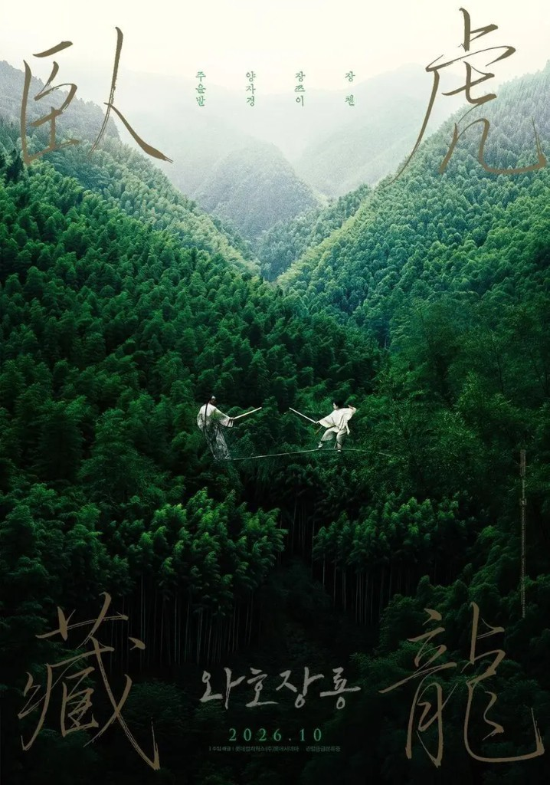

<!--
  HEAD 참조 (렌더링 안 됨 · 빌드 자동 주입 · 주석 풀지 말 것)
  <title>옥교룡은 왜 선택하지 못했나? — 『와호장룡』, 안개 속으로 사라진 두 개의 사랑 · VibeQuant</title>
  <meta name="description" content="이모백은 쥐지 못해서 잃었고, 옥교룡은 너무 세게 쥐어서 잃었다. 『와호장룡』은 묻는다. 뛰어내리겠는가, 손을 잡겠는가. 선택하지 않는 것도 선택이다.">
  <meta name="robots" content="index,follow">

  
-->

# 옥교룡은 왜 선택하지 못했나? — 『와호장룡』, 안개 속으로 사라진 두 개의 사랑

## 스물여섯 해 만의 재개봉. 선택하지 않은 채로 한평생을 흘려보낸 연인들

*이안 감독 『와호장룡(臥虎藏龍)』(2000). 2026년 10월 롯데시네마 재개봉.*

**김호광** 싸이월드 전 대표 / 2026년 9월 23일

### 프롤로그. 스물여섯 해 만의 안개

2026년 10월 7일, 이안 감독의 『와호장룡(臥虎藏龍)』(2000)이 롯데시네마 단독으로 다시 극장에 걸린다. 스물여섯 해 전 이 영화를 처음 보았던 관객들은 대나무 숲 위를 걷던 검객들과, 지붕에서 지붕으로 날던 소녀를 기억할 것이다. 그러나 극장을 나서며 가슴에 남았던 것은 칼끝이 아니라 마지막 장면의 처연한 흰 안개였다.

무당산의 아침은 안개로 시작된다. 구름다리 끝에 한 소녀가 서 있다. 등 뒤에는 밤새 그녀를 기다려준 남자가 서 있고, 발아래에는 바닥이 보이지 않는 흰 허공이 펼쳐져 있다. 소녀는 남자에게 소원을 빌라고 말한다. 그리고 두 팔을 펼친 채 안개 속으로 몸을 던진다.

영화는 이 장면으로 끝난다. 칼과 경공과 대나무 숲의 결투로 기억되는 영화지만, 마지막에 남는 것은 한 가지 질문이다. 그녀는 왜 끝내 선택하지 못했을까? 사랑하는 남자가 바로 곁에 있었는데.

이 질문에 답하려면 먼저 다른 두 사람의 이야기를 들어야 한다. 선택하지 않은 채로 한평생을 흘려보낸 연인, 이모백과 유수련이다.

### 1. 쥔 주먹 - 이모백과 유수련

이모백은 무당파가 낳은 당대 최고의 검객이었다. 그는 칼을 내려놓으려 했다. 400년 된 청명검을 사매 유수련의 손에 맡기며, 강호를 떠나 도(道)의 끝에 닿고 싶다고 했다. 그러나 그가 명상 속에서 마주한 것은 깨달음의 빛이 아니라 끝없는 슬픔이었다. 떠나지 못한 무언가가 그를 붙잡고 있었다.

유수련이었다. 그녀는 이모백의 의형제였던 맹사조의 약혼녀였다. 맹사조가 세상을 떠난 뒤 두 사람 사이에는 보이지 않는 선이 그어졌다. 서로를 사랑한다는 것을 둘 다 알았지만, 그 사랑을 입 밖에 내는 순간 죽은 이에 대한 의리가 무너질 것만 같았다. 그래서 그들은 수십 년을 동료로, 사형과 사매로, 찻잔을 사이에 둔 채 살았다.

이모백은 사부의 가르침을 이렇게 전한다. 주먹을 꽉 쥐면 그 안에 아무것도 없지만, 주먹을 놓으면 그 안에 모든 게 있다. 놓아야 얻는다는 도가의 역설이다. 그런데 이 영화에서 가장 아픈 아이러니는 바로 여기에 있다. 평생 손을 펴라고 말한 사람이, 정작 자기 마음만은 한 번도 펴지 못했다는 것.

찻집 장면에서 두 사람의 손이 잠깐 포개진다. 유수련은 묻는다. 세상 모든 것이 허상이라 해도, 지금 이 손은 진짜가 아니냐고. 이모백은 대답하지 않는다. 그는 그 손을 잡아 끌어당기는 대신 뺨에 잠시 대어볼 뿐이다. 선택의 순간은 그렇게 또 한 번 지나간다.

그 사랑이 말이 된 것은, 말 외에 아무것도 남지 않았을 때였다. 푸른 여우의 독침을 맞고 해독제를 기다리던 밤, 이모백은 마지막 숨을 해독이 아니라 고백에 쓰기로 한다.

> **“일생을 허비했어. 사매를 사랑했어. 혼백이 되어서라도 당신 곁에 머물겠어.”**

소설의 원문의 결을 살리면 이 고백은 더 길고, 더 절절하다.

> **“이미 이 한평생을 허비했소. 이 한숨으로 그대에게 말하리다. 나는 한평생 그대를 깊이 사랑했소. 나는 그대 곁을 떠도는 들판의 귀신이 되어, 7일 동안 그대를 따르겠소.”**

‘허비했다’는 말은 후회의 언어다. 칼을 쥔 세월이 아니라, 사랑을 쥐지 못한 세월에 대한 후회. 살아서 한 걸음을 내딛지 못한 사람은 죽어서야 떠돌겠다고 약속한다. 넋이 이승에 머문다는 이레, 그 짧은 날들만이라도 곁에 있겠다고. 수십 년을 곁에 두고도 하지 못한 말을, 그는 고작 7일을 얻기 위해 마지막 숨으로 한다. 그 말이 가장 다정한 말이면서 동시에 가장 늦은 말이라는 것을, 유수련은 그의 몸이 식어가는 품 안에서 알게 된다.

### 2. 사막의 별 — 옥교룡과 로소호

옥교룡은 이모백과 정반대의 자리에서 출발했다. 그녀는 무엇이든 움켜쥐는 사람이었다. 칼도, 비급도, 자유도.

고관 옥대인의 딸로 태어난 그녀의 인생은 처음부터 정해져 있었다. 좋은 가문에 시집가는 것. 그러나 서역에서 마적 떼가 행렬을 덮쳤고, 두목 로소호가 그녀의 빗을 빼앗아 달아났다. 교룡은 가마에서 뛰어나와 말을 타고 사막 끝까지 그를 쫓았다. 빗을 되찾으려던 싸움은 어느새 사랑이 되었다.

사막에서의 날들은 그녀가 처음으로 가문의 이름 대신 자기 자신으로 산 시간이었다. 로소호는 별똥별을 좇는 철부지 소년 같았지만, 그는 자신이 이제 가장 빛나는 별을 찾았다고 말했다. 그리고 한 가지 전설을 들려주었다. 무당산 절벽에서 뛰어내리면 소원이 이루어진다는 이야기. 부모의 병을 낫게 해달라며 뛰어내린 한 청년이 죽지 않고 구름 위로 날아가 다시는 돌아오지 않았다는 이야기.

로소호는 기반을 잡으면 그녀를 데리러 가겠다고 약속했다. 그러나 교룡은 결국 가족에게 돌아간다. 사막은 그녀를 자유롭게 했지만, 그녀를 받아줄 자리는 아니었다. 그리고 북경에서 그녀를 기다리고 있던 것은 정략혼이었다.

### 3. 왜 선택하지 못했나?

혼례 행렬이 지나가는 날, 로소호가 군중 속에서 뛰쳐나와 그녀의 가마를 향해 외친다. 함께 가자고. 교룡은 가마 안에서 그 목소리를 듣는다. 그리고 가마의 휘장을 걷지 않는다.

그녀가 선택하지 못한 이유는 하나가 아니다.

첫째, 그녀 앞에 놓인 것은 두 사람이 아니라 두 개의 운명이었다. 로소호를 선택하는 것은 한 남자를 고르는 일이 아니라 가문과 이름과 아버지를 전부 버리는 일이었다. 열여덟 소녀가 짊어지기에는 너무 무거운 저울이었다.

둘째, 그녀가 원한 것은 어쩌면 로소호 자체보다 로소호가 상징하는 것이었다. 규방 밖의 바람, 누구의 딸도 누구의 아내도 아닌 삶. 그래서 그녀는 혼인 첫날밤 청명검을 들고 집을 뛰쳐나가지만, 로소호에게로 가지 않는다. 그녀는 혼자 강호로 간다. 사랑보다 먼저 자유를 택한 것이다. 그리고 그 자유가 얼마나 외로운지를 곧 알게 된다.

셋째, 그녀는 누구에게도 온전히 속할 수 없었다. 여덟 살부터 그녀를 가르친 스승 푸른 여우는 그녀를 제 원한의 도구로 삼으려 했고, 이모백은 그녀를 제자로 거두려 했지만 그녀는 그 손을 뿌리쳤다. 가문도, 스승도, 무당파도, 연인도 그녀의 집이 되지 못했다. 옥교룡은 모든 것을 움켜쥐려 했기 때문에, 결국 아무것도 쥐지 못했다.

이모백은 쥐지 못해서 잃었고, 옥교룡은 너무 세게 쥐어서 잃었다. 두 사람은 정반대의 방식으로 같은 자리에 도착한다.

### 4. 무당산으로

이모백의 죽음은 옥교룡의 방황과 무관하지 않았다. 그녀의 방황이 푸른 여우를 불러냈고, 그 결전에서 이모백은 쓰러졌다. 교룡은 자신이 휘두른 자유의 칼날이 누구를 베었는지 그제야 본다.

모든 것이 끝난 뒤, 유수련은 교룡을 미워할 자격이 누구보다 있었다. 그러나 그녀는 칼 대신 말을 건넨다.

> **“무당산으로 가. 소호가 기다리고 있어. 한 가지만 약속해. 자신에게 진실하렴.”**

이 대사는 교룡에게 주는 충고이기 전에, 유수련이 자신의 지난 삶에 내리는 판결이다. 그것은 그녀의 회한이자, 감정을 억누르며 살아온 이모백과 자신의 관계에 대한 반성이다. 의리를 지킨다는 이름으로 마음을 숨겨온 수십 년. 그 끝에 남은 것은 품 안에서 식어간 한 남자와, 너무 늦게 도착한 고백뿐이었다. 그녀는 자신이 가지 못한 길을 한 소녀에게 대신 가라고 등을 떠민다. 나처럼 살지 말라고. 너는 선택하라고.

### 5. 안개 속으로

교룡은 무당산으로 간다. 로소호는 정말로 거기 있었다. 두 사람은 하룻밤을 함께 보낸다. 그토록 멀리 돌아와서야 겨우 닿은 밤이었다.

그러나 아침이 오자 교룡은 구름다리 끝에 선다. 그리고 로소호에게 그 전설을 기억하느냐고 묻는다. 소원을 빌어보라고. 로소호는 빈다. 함께 다시 사막으로 돌아가는 것. 교룡은 뛰어내린다.

그녀는 끝까지 선택하지 못한 것일까?, 아니면 처음으로 선택한 것일까?

어떤 이는 환멸이라 읽는다. 그녀가 꿈꾼 끝없는 자유는 세상 어디에도 없다는 것을 알아버린 소녀의 마지막 몸짓. 어떤 이는 속죄라 읽는다. 자신 때문에 쓰러진 이모백과, 자신 때문에 모든 것을 잃은 유수련에 대한 대가. 또 어떤 이는 그것을 전설의 실현으로 읽는다. 그녀는 로소호의 소원을 이루어주기 위해 뛰어내렸다고. 둘이 함께 사막으로 돌아갈 수 없는 이 세상이 아니라, 다른 어딘가에서라도.

영화는 답하지 않는다. 안개만 있을 뿐이다. 다만 한 가지는 분명하다. ‘자신에게 진실하라’는 유수련의 부탁에, 교룡은 자기 방식으로 대답했다는 것. 그것이 사랑이었는지 도망이었는지는 모르지만, 그 순간만큼은 누구의 딸도, 누구의 제자도, 누구의 아내도 아닌 옥교룡 자신으로서.

### 6. 지워진 출구 - 이안은 왜 그녀에게 선택의 기회를 주지 않았나?

사실 옥교룡에게는 출구가 있었다. 영화가 아니라 소설 속에.

『와호장룡』의 원작은 왕도려가 중일전쟁을 피해 칭다오로 피난 가 있던 시절 신문에 연재한 무협 소설이다. 그 소설에서 옥교룡이 절벽에서 몸을 던지는 것은 죽음이 아니라 죽음의 위장이었다. 세상에서 옥대인의 딸을 지워버린 그녀는 얼마 뒤 다시 로소호를 찾아가 하룻밤을 보내고, 말을 타고 떠난다. 가문의 이름을 벗고, 자기 자신으로. 원작 속 옥교룡은 결국 선택한 사람이었다. 다만 그 선택의 대가로 ‘옥교룡’이라는 이름을 절벽 아래 묻었을 뿐이다.

이안 감독은 그 출구를 지웠다. 말발굽 소리도, 사막으로 이어지는 길도 남기지 않았다. 스크린에 남은 것은 흰 안개와, 그 안개를 바라보는 한 남자의 얼굴뿐이다.

왜였을까? 어쩌면 이안이 하고 싶었던 이야기는 ‘선택한 사람’의 이야기가 아니었기 때문일 것이다. 그가 붙든 것은 선택 앞에서 망설이는 순간, 손을 펼지 쥘지 몰라 떨리는 그 짧은 시간이었다. 이모백의 고백이 너무 늦었듯, 영화 속 옥교룡의 선택도 너무 늦었거나 너무 이르다. 이안은 그 어긋남을 해피엔딩으로 봉합하지 않았다. 대신 관객을 구름다리 끝에 세워두었다. 그녀는 날아갔는가, 떨어졌는가. 그 답을 정하는 것은 이제 스크린 밖의 우리다.

그러니 그 안개는 결말이 아니라 질문이다. 당신이라면, 뛰어내리겠는가. 아니면 그의 손을 잡고 사막으로 돌아가겠는가. 아니면 또 한 번, 아무것도 고르지 않은 채 가마의 휘장을 내리겠는가.

### 에필로그. 선택하지 않는 것도 선택이다

『와호장룡』의 두 연인은 서로의 거울이다. 이모백과 유수련은 규율과 의리라는 이름으로 사랑을 미뤘고, 옥교룡과 로소호는 가문과 운명이라는 이름으로 사랑 앞에서 망설였다. 한쪽은 너무 참아서, 다른 한쪽은 너무 흔들려서, 둘 다 가장 소중한 것을 손에서 놓쳤다.

선택하지 않는 것도 선택이다. 그리고 모든 선택에는 값이 매겨진다. 미루는 동안에는 공짜처럼 보이지만, 청구서는 반드시 도착한다. 이모백은 마지막 숨으로 그 값을 치렀고, 옥교룡은 안개 속으로 몸을 던져 치렀다.

살아남은 사람은 유수련 하나다. 그녀는 사랑한 사람을 잃었고, 사랑을 가르쳐준 소녀를 놓아 보냈다. 그녀에게 남은 것은 청명검도 무당의 비급도 아니라, 늦게 도착한 사무시는 사랑의 고백과 후회, 한 문장뿐이다.

사랑은 늦을수록 아프고, 선택은 미룰수록 무거워진다. 그러니 손을 펴야 할 때 펴고, 잡아야 할 때 잡을 일이다. 혼백이 되어 이레 동안 곁을 떠돌겠다고 말하기 전에.

이번 가을, 다시 극장의 어둠 속에서 그 안개를 마주하게 된다면, 이번에는 그 질문에 답해보자. 스물여섯 해 전에는 미처 하지 못했던 대답을.
