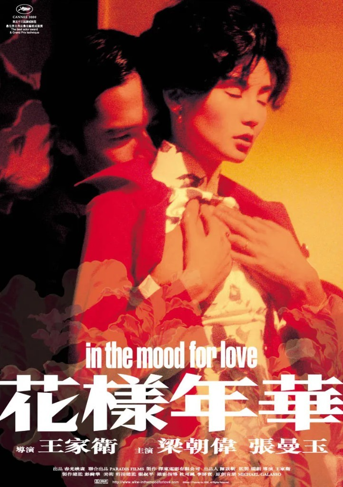

<!--
  HEAD 참조 (렌더링 안 됨 · 빌드 자동 주입 · 주석 풀지 말 것)
  <title>결정 이후에 온 사람 · VibeQuant</title>
  <meta name="description" content="인생에서 가장 중요한 사람을 결정 이후에 만났다면 어찌해야 하는가. 「화양연화」로 읽는 사슴 사냥, 자유의지, 그리고 흔들림 속에서 고르는 법.">
  <meta name="robots" content="index,follow">

  
-->

# 결정 이후에 온 사람

## 영화 「화양연화」로 읽는, 가장 중요한 사람을 가장 늦게 만났을 때의 문제

*왕가위 감독 「화양연화(花樣年華, In the Mood for Love)」(2000). 주연 양조위, 장만옥.*

**김호광** 싸이월드 전 대표 / 2026년 9월 23일

*게임이론·행동경제학·심리학, 그리고 자유의지와 필연에 대하여*

> 많은 일이 나도 모르게 시작되죠. — 「화양연화」(왕가위, 2000)

## 프롤로그 - 국수 통을 든 여자

좁은 계단이 있다. 비가 내리고, 가로등은 노랗게 번지고, 한 여자가 치파오를 입은 채 보온 국수 통을 들고 계단을 내려간다. 같은 시각, 한 남자가 담배를 물고 그 계단을 올라온다. 둘은 스치고, 고개를 살짝 숙이고, 지나간다. 우메바야시 시게루의 왈츠가 느리게 흐른다. 그 장면이 몇 번이고 반복된다. 날마다 옷만 바뀐다.

영화 「화양연화」는 이 스침을 거의 한 시간 동안 보여준다. 사건은 일어나지 않는다. 대신 무언가가 조금씩 쌓인다. 먼지처럼, 빗물처럼, 혹은 저녁마다 식어가는 국수처럼.

이 칼럼은 하나의 질문에서 시작한다.

**인생에서 가장 중요한 사람을, 인생의 중요한 결정을 모두 내린 뒤에 만났다면 — 어찌해야 하는가?**

그리고 그 질문 밑에 숨어 있는 더 오래된 질문으로 내려간다. 그때 우리가 내리는 선택은 정말 우리의 것인가? 아니면 이미 내려진 결정들이 우리를 대신해 고르는 것인가?

## 1. 1962년, 같은 날 이사 온 두 사람

1962년 홍콩. 상하이에서 건너온 사람들이 모여 사는 비좁은 아파트에 같은 날 두 가구가 이사를 온다. 무역회사 비서 소려진과 그녀의 남편, 그리고 신문사 편집기자 주모운과 그의 아내. 이삿짐꾼들은 두 집의 짐을 뒤섞어 나르고, 두 사람은 첫날부터 서로의 물건을 돌려주며 인사를 나눈다.

소려진의 남편은 일본 출장이 잦고, 주모운의 아내는 호텔에서 일하느라 늘 늦는다. 빈집이 두 채 있고, 저녁마다 국수 가게로 향하는 두 개의 외로움이 있다.

그리고 어느 날, 그들은 알게 된다. 소려진이 든 핸드백과 똑같은 가방을 주모운의 아내가 들고 있다는 것을. 주모운이 맨 넥타이와 똑같은 넥타이를 소려진의 남편이 매고 있다는 것을. 일본에서만 파는 가방이었고, 아내가 골라준 넥타이였다. 두 개의 물건이 두 개의 결혼을 동시에 무너뜨린다.

이 영화에서 가장 먼저 배신한 것은 사람이 아니라 **사물**이다. 가방과 넥타이가 먼저 진실을 말했고, 사람들은 그 뒤를 따라갔을 뿐이다.

흥미로운 것은 우리가 끝내 두 배우자의 얼굴을 제대로 보지 못한다는 사실이다. 소려진의 남편은 뒷모습과 목소리로만, 주모운의 아내는 어깨 너머로만 등장한다. 왕가위는 불륜의 당사자들을 화면에서 지워버렸다. 그래서 이 영화는 불륜의 이야기가 아니라, **불륜에 남겨진 사람들**의 이야기가 된다.

## 2. "우리는 그들과 달라요"

상처를 공유한 두 사람은 이상한 놀이를 시작한다. 연습이다.

처음에는 **추궁의 연습**이다. 소려진이 남편에게 "다른 여자가 있느냐"고 묻는 장면을, 주모운이 남편 역을 맡아 연기해준다. 그가 태연하게 "있다"고 답하자, 소려진은 연습인 줄 알면서도 무너진다.

다음은 **시작의 연습**이다. 그들은 배우자들이 어떻게 처음 만났을지를 재연한다. 누가 먼저 말을 걸었을까. 누가 먼저 저녁을 먹자고 했을까. 타인의 사랑을 흉내 내는 동안, 자신들의 사랑이 조용히 시작된다.

마지막은 **이별의 연습**이다. 주모운이 싱가포르로 떠나기로 한 뒤, 두 사람은 밤 골목에서 헤어지는 장면을 미리 연기한다. 소려진은 끝내 그의 어깨에 얼굴을 묻고 운다. 주모운은 말한다. 이건 연습일 뿐이라고.

그 사이, 두 사람은 동방호텔 2046호실에서 저녁마다 만나 무협소설을 함께 쓴다. 이웃의 눈을 피하기 위해서였다. 그리고 그 모든 시간 동안 그들은 같은 문장을 주문처럼 되뇌었다.

**우리는 그들과 달라요.**

이 문장은 방어이자 고백이다. 그들과 다르다고 말해야 할 만큼, 이미 그들과 닮아가고 있었으니까.

## 3. 게임이론 — 죄수의 딜레마가 아니라 사슴 사냥

이 관계를 흔히 죄수의 딜레마로 설명한다. 그러나 엄밀히 말하면 맞지 않는다. 죄수의 딜레마에서는 상대가 무엇을 하든 배신이 언제나 더 이득이다. 그런데 주모운과 소려진에게 '혼자 선을 넘는 것'은 결코 이득이 아니었다. 혼자 넘으면 혼자 무너질 뿐이다.

이들이 갇혀 있던 게임은 장 자크 루소가 처음 그려낸 **사슴 사냥(Stag Hunt)**, 게임이론에서 말하는 **확신 게임(Assurance Game)** 에 더 가깝다.

두 사냥꾼이 있다. 둘이 힘을 합치면 사슴을 잡을 수 있다. 그러나 한 사람이라도 자리를 떠나면 사슴은 도망가고, 남은 사람은 빈손이 된다. 반면 각자 토끼를 쫓으면, 작지만 확실한 몫을 얻는다.

| | 소려진: 함께 떠난다 | 소려진: 지금 자리에 남는다 |
| --- | --- | --- |
| **주모운: 함께 떠난다** | 사랑의 성취 — 그러나 세상의 비난 (가장 큰 보상, 가장 큰 위험) | 주모운 홀로 무너짐 |
| **주모운: 자리에 남는다** | 소려진 홀로 무너짐 | 체면과 평온, 그리고 영원한 결핍 (작지만 안전한 보상) |

이 게임에는 균형이 **두 개** 있다. 함께 떠나는 균형, 함께 남는 균형. 앞의 것은 보상이 더 크고(보상 우월 균형), 뒤의 것은 실패해도 덜 다친다(위험 우월 균형). 상대가 정말로 함께 올지 확신할 수 없을 때, 합리적인 사람은 **위험 우월 균형**을 고른다. 주모운과 소려진이 정확히 그랬다.

그렇다면 무엇이 부족했는가? **확신**, 곧 믿을 만한 신호였다.

게임이론에서 신호는 비용이 들어야 믿을 수 있다. 말은 싸다. 그래서 두 사람은 끝까지 값싼 신호만 주고받았다. 영화 도입부의 자막은 이 관계를 한 문장으로 요약한다. 여자는 남자가 다가올 기회를 주려고 고개를 숙이고 있었지만, 남자는 용기가 없어 다가가지 못했고, 여자는 돌아서 걸어갔다고. 고개를 숙이는 것은 신호였지만, 오해될 수 있을 만큼 약한 신호였다.

주모운은 결국 가장 값비싼 신호를 보낸다. "표가 한 장 더 있다면, 나와 함께 가겠소?" 그러나 이 질문은 동시에 **자기구속 장치(commitment device)** 이기도 했다. 토머스 셸링이 말했듯, 스스로 퇴로를 끊는 사람만이 협상에서 신뢰를 얻는다. 주모운은 싱가포르행 배표를 끊음으로써 '남는다'는 선택지를 스스로에게서 지웠다. 이제 공은 소려진에게 넘어갔다. 그리고 그녀는 제시간에 오지 못했다.

게임이론이 이 비극에 대해 말할 수 있는 가장 정직한 결론은 이것이다. **그들의 실패는 사랑의 부족이 아니라 조정(coordination)의 실패였다.** 둘 다 사슴을 원했다. 다만 서로가 사슴을 원한다는 것을, 같은 순간에 확신하지 못했을 뿐이다.

## 4. 행동경제학에서 말하는 잃을 것을 가진 사람들의 계산

카너먼과 트버스키의 **손실 회피**는 인간이 같은 크기의 이득보다 손실을 대략 두 배 더 아프게 느낀다고 말한다. 결정 이후에 누군가를 만난 사람의 저울은 처음부터 기울어 있다. 새로운 사랑은 '얻을 수 있는 것'이지만, 지금의 결혼·평판·일상은 '잃을 수 있는 것'이다. 같은 무게라도 손실 쪽 접시가 두 배로 무겁다.

여기에 **현상 유지 편향(status quo bias)** 이 더해진다. 사뮤엘슨과 제크하우저가 보여주었듯, 사람들은 현재 상태를 기본값으로 두고, 그로부터 벗어나는 것 자체를 비용으로 느낀다. 결혼은 인생에서 가장 강력한 기본값이다. 그 기본값을 바꾸려면 '더 좋은 삶'만으로는 부족하다. '압도적으로 더 좋은 삶'이어야 한다.

그리고 **후회 회피**. 사람은 결과 자체보다, 그 결과가 '내 탓'일 때 느낄 후회를 더 두려워한다. 그런데 행동을 해서 생긴 불행은 명백히 내 탓이지만, 가만히 있어서 생긴 불행은 운명 탓으로 돌릴 수 있다. 그래서 우리는 행동하지 않는 쪽을 택한다. 심리학에서 말하는 **부작위 편향**이다.

그러나 여기에 잔인한 반전이 있다. 심리학자 토머스 길로비치와 빅토리아 메드벡의 연구는 후회에 **시간의 비대칭**이 있음을 보여준다. 짧은 시간 안에서 사람들은 '한 일'을 후회한다. 그러나 긴 시간이 흐르면, 사람들은 **'하지 않은 일'** 을 훨씬 더 오래, 더 깊이 후회한다. 행동의 후회는 상처처럼 아물지만, 비행동의 후회는 가능성으로 남아 계속 자란다.

투자의 언어로 말하면 이렇다. 손실이 난 종목을 "회복되면 팔겠다"며 붙들고 있는 **처분 효과(disposition effect)** 처럼, 두 사람은 "상황이 정리되면"이라는 조건부 약속을 서로에게 걸어두었다. 그 사이 시간은 복리로 흘렀고, 기회비용은 소리 없이 불어났다. 1962년에 내리지 못한 결정의 가격은 1966년에 청구되었다.

그들은 후회를 최소화하려 했다. 그리고 그 대가로 **평생에 걸친 후회**를 얻었다.

## 5. 심리학에서 말하는 다가가지 못하는 두 개의 방식

정신분석의 렌즈로 이 두 사람을 읽는 해석이 있다. 라캉의 구분을 빌리면, 소려진의 욕망은 **히스테리적**이다. 그녀는 자신이 원한다고 말하는 대신, 상대가 자신을 원하게 만들고 그 욕망이 채워지지 않은 채로 유지되기를 원한다. 주모운의 욕망은 **강박적**이다. 그는 대상을 너무 원하기에, 오히려 그것에 닿는 순간을 무한히 유예한다. 하나는 기다리고, 하나는 미룬다. 두 방식은 서로 맞물리지 못한다. 이것은 하나의 해석이지 진단이 아니다. 그러나 이 해석이 섬뜩할 만큼 들어맞는다는 사실이, 이 영화가 인간 심리의 어떤 지층을 건드렸다는 증거다.

더 일상적인 언어로도 설명할 수 있다. 레온 페스팅거의 **인지 부조화** 이론에 따르면, 사람은 믿음과 행동이 어긋날 때 둘 중 하나를 바꿔 긴장을 해소하려 한다. "나는 불륜을 경멸한다"는 믿음과 "나는 유부녀를 사랑하고 있다"는 사실 사이의 긴장. 주모운과 소려진은 행동을 바꾸는 대신 믿음을 보강했다. **우리는 그들과 달라요.** 이 문장은 부조화를 견디기 위해 스스로에게 놓아준 진통제였다.

그리고 **자이가르닉 효과**. 완결된 일보다 중단된 일이 더 오래 기억에 남는다는 현상이다. 끝나지 않은 노래, 마지막 장이 찢긴 소설, 끝내 부치지 못한 편지. 이루어지지 않은 사랑이 이루어진 사랑보다 더 선명하게 남는 이유는 낭만이 아니라 인지의 구조다. 뇌는 닫히지 않은 문을 계속 두드린다.

주모운이 소려진을 잊지 못한 것은 그가 특별히 순정적이어서가 아니다. 그 이야기가 **끝나지 않았기 때문**이다.

## 6. 세상의 시선 - 비 오는 골목의 재판정

이 영화에서 세상은 거대한 사회가 아니다. 복도 하나, 마작 테이블 하나, 공용 부엌 하나 크기다. 그런데 그 좁음이 오히려 숨 막히는 감시가 된다.

집주인 손 부인은 밤늦게 돌아오는 소려진에게 부드럽게, 그러나 분명하게 경고한다. 젊은 사람은 조심해야 한다고, 남편이 없는 동안 너무 자주 나가는 것은 보기 좋지 않다고. 그 말 한마디에 두 사람은 한동안 만나지 못한다.

더 아이러니한 인물은 소려진의 상사 하 선생이다. 그는 아내 몰래 다른 여자를 만나고, 그 여자에게 줄 선물과 식당 예약을 비서인 소려진에게 맡긴다. 그러면서도 소려진에게 걸려 온 주모운의 전화를 받은 뒤, 그녀를 은근한 경멸의 눈으로 바라본다. 세상의 도덕은 이렇게 작동한다. **실제로 선을 넘은 사람은 안전하고, 선 앞에서 떨고 있는 사람이 심판받는다.**

게임이론의 언어로 보면, 이 이웃들은 **반복 게임의 감시자**다. 두 사람의 선택은 한 번의 게임이 아니라 매일 저녁 반복되는 게임이었고, 평판이라는 장부가 그 모든 판을 기록하고 있었다. 한 번의 일탈이 영원한 낙인이 되는 공동체에서, 합리적인 사람은 늘 가장 조심스러운 수를 둔다.

그렇다면 오늘의 세상은 이들을 어떻게 보는가? 영화가 개봉한 뒤 수많은 관객과 평론가는 이 작품을 '불륜 영화'라 부르기를 망설였다. 두 사람은 실제로 아무것도 하지 않았다. 적어도 화면은 그렇게 말한다. 함께 국수를 먹고, 함께 글을 쓰고, 함께 비를 피했을 뿐이다. 이 영화는 2016년 BBC가 전 세계 평론가 177명을 대상으로 한 조사에서 21세기 두 번째로 위대한 영화에 올랐고, 2022년 사이트 앤 사운드의 역대 최고의 영화 투표에서는 5위에 올랐다. 세상은 이 사랑을 도덕으로 단죄하지 못한 채, 대신 예술로 보존하는 쪽을 택했다.

우리는 현실의 유부남과 유부녀에게는 불륜이라는 이름을 붙이면서, 스크린 속 두 사람에게는 가장 아름다운 사랑이라는 이름을 붙인다. 이 모순은 위선일까. 아니면 우리 모두가 마음속 어딘가에 **하지 않은 선택**을 하나씩 묻어두고 살기 때문일까?

## 7. 흔들림 - 1963년 싱가포르, 사라진 슬리퍼

1963년, 싱가포르. 주모운은 퇴근 후 방에 돌아와 이상한 흔적을 발견한다. 그가 간직하고 있던 소려진의 슬리퍼가 사라졌다. 재떨이에는 립스틱이 묻은 담배꽁초 하나가 남아 있다. 며칠 전 회사로 걸려 온 전화는 아무 말 없이 끊겼다.

소려진이 다녀간 것이다.

그녀는 그의 방에 들어와, 그의 담배를 피우고, 그의 침대에 누웠다가, 자신의 슬리퍼만 챙겨 돌아갔다. 전화를 걸었지만 목소리를 내지 않았다. 그녀가 남긴 것은 립스틱 자국이었고, 가져간 것은 자신의 흔적이었다.

이것이 이 영화에서 가장 아픈 흔들림이다. 그녀는 바다를 건넜다. 가장 값비싼 신호를 보낼 수 있는 자리까지 갔다. 그러나 마지막 한 걸음, 문을 열고 그의 얼굴을 마주하는 그 한 걸음을 내딛지 않았다. 그녀는 흔적을 남겼지만, 자신을 남기지는 않았다.

그리고 주모운 역시 알아챘으면서도 그녀를 찾아 나서지 않았다.

흔들림이란 이런 것이다. 선을 넘는 것도 아니고, 넘지 않는 것도 아닌 상태. 문고리를 잡은 채로 서 있는 상태. 싱가포르의 그 방은 두 사람이 가장 가까이 다가간 곳이자, 가장 확실하게 엇갈린 곳이었다.

## 8. 자유의지인가?, 필연인가?

이제 이 칼럼이 정말로 묻고 싶었던 질문으로 가보자.

주모운과 소려진은 **선택했는가?**, 아니면 **선택당했는가?**.

### 필연의 목소리

18세기 수학자 라플라스는 상상했다. 우주의 모든 입자의 위치와 속도를 아는 지성이 있다면, 그에게 미래는 과거처럼 선명할 것이라고. 이 '라플라스의 악마'의 눈으로 보면, 1962년 같은 날의 이사도, 같은 가방과 같은 넥타이도, 손 부인의 경고도, 싱가포르의 빈 방도 모두 이미 정해진 궤적 위의 점들이다.

쇼펜하우어는 더 날카롭게 말했다. **인간은 원하는 것을 할 수 있지만, 원하는 것을 원할 수는 없다.** 소려진은 주모운을 사랑하기로 '결정'하지 않았다. 사랑은 그녀에게 일어났다. 영화 속 대사처럼, 많은 일이 나도 모르게 시작된다.

앞에서 살펴본 모든 이론도 결국 필연의 편에 선다. 손실 회피는 우리 뇌에 새겨진 비대칭이고, 현상 유지 편향은 진화가 설계한 보수성이며, 위험 우월 균형은 불확실성 앞에서 합리성이 수렴하는 자리다. 행동경제학의 모든 발견은 한 문장으로 요약된다. **당신이 자유롭게 내렸다고 믿는 결정은, 대부분 예측 가능하다.**

### 자유의 목소리

그러나 사르트르는 정반대에서 소리친다. 인간은 **자유롭도록 선고받았다.** 선택하지 않는 것도 선택이다. 그리고 선택의 책임을 환경, 본성, 사회의 시선에 돌리는 태도를 그는 **자기기만(mauvaise foi)** 이라 불렀다.

이 관점에서 보면 "우리는 그들과 달라요"라는 주문은 가장 정교한 자기기만이다. 그들은 도덕을 선택한 것이 아니라, 도덕 뒤에 숨어 선택을 회피했다. 손 부인의 경고도, 하 선생의 시선도, 결혼이라는 제도도 그들을 묶지 못했다. 그들을 묶은 것은 **묶여 있다고 믿기로 한 그들 자신**이었다.

키르케고르는 『이것이냐 저것이냐』에서 더 쓸쓸한 진실을 말했다. 결혼하라, 너는 후회할 것이다. 결혼하지 마라, 너는 역시 후회할 것이다. 어느 쪽을 택해도 후회는 온다. 그렇다면 중요한 것은 후회를 피하는 것이 아니라, **어떤 후회를 내 것으로 삼을 것인가**를 고르는 일이다.

### 그 사이 어딘가?

철학자 해리 프랭크퍼트는 이 오래된 대립에 조용한 다리를 놓았다. 자유란 원인이 없는 상태가 아니라, **내가 원하는 것을 내가 원하는가**의 문제라고. 1차 욕망(그를 사랑하고 싶다)과 2차 욕망(그런 사랑을 원하는 나를 승인하는가) 사이의 일치. 그것이 자유다.

이 기준으로 보면 주모운과 소려진의 비극은 선명해진다. 그들의 1차 욕망은 서로를 향했지만, 2차 욕망은 그 욕망을 끝내 승인하지 못했다. 사랑하는 자신을 사랑하지 못했다. 그래서 그들은 자유롭지도, 완전히 부자유하지도 않은 상태, 곧 **흔들림** 속에 머물렀다.

그리고 스피노자가 있다. 그에게 자유란 필연을 거스르는 힘이 아니라, **필연을 이해하는 힘**이었다. 내가 왜 이렇게 느끼는지, 왜 이렇게 망설이는지를 이해하는 순간, 인간은 감정의 노예에서 감정의 관찰자로 한 걸음 물러선다.

어쩌면 앙코르와트의 주모운이 도달한 곳이 여기였을지도 모른다.

### 영화 자체가 보여준 답

왕가위는 이 영화를 완성된 각본 없이 찍은 것으로 유명하다. 촬영은 1년이 넘게 이어졌고, 배우들은 자신들의 이야기가 어디로 향하는지 모른 채 매일 촬영장에 나왔다. 수많은 장면이 찍히고 버려졌다.

주모운과 소려진이 자신들의 결말을 몰랐던 것처럼, 양조위와 장만옥도 결말을 몰랐다. 그런데 완성된 영화를 보는 우리에게 그 결말은 너무나 필연적으로 느껴진다. 다른 결말은 상상할 수 없을 만큼.

이것이 인생의 구조다. **앞으로 살아갈 때 모든 것은 선택이고, 뒤돌아볼 때 모든 것은 필연이다.** 자유의지와 필연은 서로 다른 두 세계가 아니라, 같은 삶을 바라보는 두 개의 시점이다. 계단을 내려가는 소려진에게 그것은 매 순간의 선택이었고, 스크린 밖의 우리에게 그것은 처음부터 정해진 운명이었다.

동양은 이것을 오래전부터 **인연(因緣)** 이라 불렀다. 인(因)은 씨앗이고 연(緣)은 조건이다. 씨앗이 있어도 조건이 맞지 않으면 꽃은 피지 않는다. 주모운과 소려진 사이에는 분명 씨앗이 있었다. 다만 1962년 홍콩이라는 조건, 이미 내려진 두 개의 결혼이라는 조건, 좁은 복도의 눈들이라는 조건이 꽃을 허락하지 않았다.

인연의 사유는 필연론도 자유의지론도 아니다. 그것은 **나의 선택이 세계의 조건과 만나는 자리**에서만 무언가가 일어난다는 겸손한 통찰이다.

## 9. 결정 이후에 온 인연

그래서, 어찌해야 하는가?

이 칼럼은 정답을 줄 수 없다. 다만 이 영화와 이론들이 함께 가리키는 몇 가지 방향을 조심스럽게 적어둔다.

먼저, **그 감정이 당신에게 일어난 일이라는 것을 부정하지 말 것.** 쇼펜하우어의 말처럼 우리는 무엇을 원할지를 고를 수 없다. 그 사람을 만난 것, 마음이 흔들린 것은 당신의 도덕적 실패가 아니다. 그것은 날씨처럼 온다. 죄책감으로 감정을 지우려 할수록, 자이가르닉 효과처럼 그 감정은 더 깊이 새겨진다.

그러나 **감정이 일어난 뒤의 일은 당신의 것이다.** 사르트르의 말처럼, 선택하지 않는 것도 선택이다. "상황이 정리되면", "때가 되면" 같은 말은 결정의 유예가 아니라 결정의 한 형태다. 유예에도 가격이 있다. 그 가격은 대개 몇 년 뒤, 이자가 붙어 청구된다.

그리고 **당신만 흔들리는 것이 아니라는 것을 기억할 것.** 이미 내린 결정에는 다른 사람들이 걸려 있다. 배우자, 아이, 그리고 그 결정을 믿고 살아온 과거의 당신 자신. 주모운과 소려진의 배우자들은 화면에 얼굴조차 나오지 않지만, 현실에서 그들은 얼굴이 있는 사람들이다. 결정을 뒤집을 자유가 있다면, 그 자유의 무게를 함께 질 책임도 있다.

마지막으로, **어느 쪽을 택하든 그 선택을 당신의 것으로 끌어안을 것.** 키르케고르가 말했듯 후회는 피할 수 없다. 그렇다면 남는 질문은 하나다. 10년 뒤의 내가 어떤 후회라면 견딜 수 있을까. 떠난 것에 대한 후회인가, 떠나지 못한 것에 대한 후회인가. 길로비치의 연구는 대부분의 사람에게 후자가 더 오래 남는다고 말한다. 그러나 대부분의 사람이 당신은 아니다.

주모운과 소려진이 실패한 것은 '남는 쪽'을 골랐기 때문이 아니다. 남는 것도 떠나는 것도 온전히 선택하지 못하고, 그 사이에서 **흔들림 자체를 삶으로 만들어버렸기** 때문이다. 결정 이후에 온 사람 앞에서 가장 나쁜 선택은, 선택하지 않는 채로 선택의 결과를 모두 감당하는 것이다.

## 에필로그 — 1966년, 돌 속의 비밀

1966년 홍콩. 소려진은 이민을 떠나는 손 부인을 찾아간다. 손 부인은 옆집에 살던 사람들 이야기를 꺼낸다. 소려진은 창밖을 보며 눈물을 참는다. 며칠 뒤, 주모운이 옛 집을 찾아와 옆집 문을 잠시 바라보다 돌아선다. 그 문 너머에 누가 사는지 묻지 않는다. 한 문을 사이에 두고, 두 사람은 또 한 번 엇갈린다.

그리고 같은 해, 캄보디아. 드골 대통령의 방문을 전하는 흑백 뉴스 화면이 지나가고, 앙코르와트의 폐허 속에서 주모운은 돌기둥에 난 작은 구멍 앞에 선다. 옛사람들은 누구에게도 말할 수 없는 비밀이 있을 때 산에 올라 나무에 구멍을 파고 그 안에 비밀을 속삭인 뒤 진흙으로 막았다고 한다. 주모운은 오래도록 그 구멍에 입을 대고 무언가를 말한다. 그리고 풀과 흙으로 구멍을 메우고 떠난다.

우리는 그가 무엇을 말했는지 끝내 알 수 없다.

그러나 이것만은 알 수 있다. 그는 **말했다.** 4년 동안 누구에게도 하지 못한 말을, 마침내 소리 내어 말했다. 들을 사람이 없는 곳에서라도. 그것은 도피가 아니라 하나의 선택이었다. 사랑을 세상에 내놓지는 않되, 지우지도 않겠다는 선택. 결정을 뒤집지는 않되, 그 결정 때문에 잃은 것을 끝까지 부정하지는 않겠다는 선택.

봉인은 망각이 아니다. 봉인은 **가장 늦게 내린, 가장 온전한 결정**이다.

영화는 마지막으로 이렇게 말한다. 그는 그 사라진 시절을 기억한다고. 먼지 앉은 유리창 너머로 보듯, 과거는 볼 수 있지만 만질 수는 없는 것이라고. 그리고 그가 보는 모든 것은 흐릿하다고.

화양연화(花樣年華). 인생에서 꽃처럼 가장 아름다웠던 시절.

그 시절이 꽃이었던 것은, 활짝 피었기 때문이 아니었다. 피기 직전의 망울 속에 모든 가능성을 품은 채로 멈춰 있었기 때문이다. 필연은 그 꽃이 피지 못하게 했고, 자유는 그 꽃을 기억하게 했다.

결정 이후에 온 사람. 우리는 그를 선택할 수도, 떠나보낼 수도 있다. 다만 어느 쪽이든, 흔들림 속에 영원히 서 있지는 않기를. 언젠가 우리 각자의 앙코르와트 앞에 섰을 때, 적어도 무엇을 속삭일지는 알고 있기를.

---

*참고: 영화 「화양연화(花樣年華, In the Mood for Love)」, 왕가위 감독, 양조위·장만옥 주연, 2000.* *이론적 배경: 루소의 사슴 사냥과 확신 게임, 토머스 셸링의 자기구속 이론, 카너먼·트버스키의 전망 이론, 사뮤엘슨·제크하우저의 현상 유지 편향, 길로비치·메드벡의 후회의 시간적 비대칭, 셰프린·스탯먼의 처분 효과, 페스팅거의 인지 부조화, 자이가르닉 효과, 라캉의 욕망 구조, 라플라스·쇼펜하우어·스피노자·사르트르·키르케고르·프랭크퍼트의 자유의지론.*
