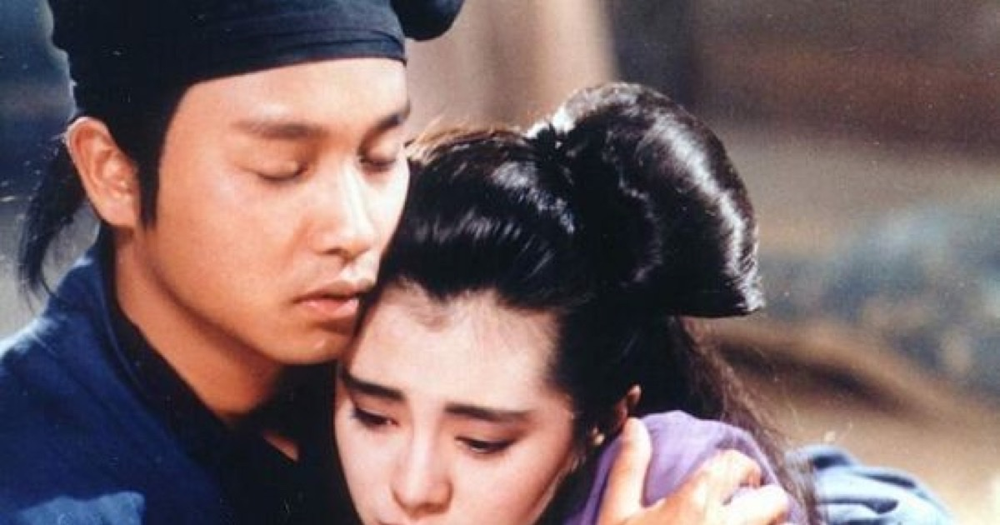

<!--
---
title: "천녀유혼, 이루지 못한 사랑의 아련함"
title_en: "A Chinese Ghost Story — The Ache of Unfinished Love"
subtitle: "해가 뜨면 끝나는 사랑이 있다. 그리고 우리는 그 사랑을 평생 잊지 못한다."
description: "《천녀유혼》·요재지이·자이가르닉·홍콩 반환 은유·투자 심리. 장국영 70번째 생일을 기리며. 투자 권유 아님(2026-09)."
abstract: |
  Korean culture/psychology column on A Chinese Ghost Story (1987), Sep 2026.
  Zeigarnik-style unfinished love; Liaozhai Nie Xiaoqian happy ending vs film tragedy; evolutionary psych lenses.
  Hong Kong 1997 metaphor; Becker/Frank signaling; investor biases (sunk cost, disposition).
  Closes with Leslie Cheung tribute (1956–2003); crisis helplines included; not investment advice.
summary_for_ai: |
  Korean film-essay column (not investment advice), 2026-09-18, group industry, Ghost-Story/Ghost-Story.md.
  Themes: unfinished love memory, costly signaling, 1987 HK zeitgeist, investor psychology parallels.
  Crisis: Korea suicide prevention 109 / mental health 1577-0199.
date: 2026-09-18
updated: 2026-09-18
author: "김호광 (Dennis Kim)"
lang: ko
tags:
  - 천녀유혼
  - 장국영
  - 왕조현
  - 홍콩영화
  - 요재지이
  - 이루지못한사랑
  - 자이가르닉
keywords:
  - "천녀유혼"
  - "倩女幽魂"
  - "장국영"
  - "왕조현"
  - "섭소천"
  - "요재지이"
  - "이루지 못한 사랑"
  - "홍콩 반환"
group: industry
featured: true
featured_rank: -8
og_image: "https://vibequant.cc/og/ghost-story.jpg"
image: "https://vibequant.cc/og/ghost-story.jpg"
schema_type: BlogPosting
draft: false
robots: index,follow
---
-->

# 천녀유혼, 이루지 못한 사랑의 아련함

## 해가 뜨면 끝나는 사랑이 있다. 그리고 우리는 그 사랑을 평생 잊지 못한다.

> — 일흔 번째 생일을 맞았을 장국영(1956.9.12 ~ 2003.4.1)을 기리며

## 1. 시작하는 말 - 왜 우리는 이루지 못한 사랑에 끌리는가?

1987년 여름 홍콩에서 《천녀유혼(倩女幽魂)》이 개봉했다. 서극이 제작하고 정소동이 감독한 영화다. 떠돌이 수금원 영채신(장국영)과 여자 귀신 섭소천(왕조현)의 이야기로, 귀신 영화이자 무협 영화이며 무엇보다 한 편의 연애담이다.

이 영화가 40년 가까이 아시아의 기억 속에 살아 있는 이유는, 역설적이게도 두 사람이 끝내 함께하지 못했기 때문이다. 완결된 사랑은 서랍에 들어가지만, 완결되지 못한 사랑은 책상 위에 펼쳐진 채로 남는다.

심리학에는 이 현상을 설명하는 오래된 가설이 있다. 1927년 러시아 심리학자 블루마 자이가르닉은 식당 웨이터들이 계산이 끝나지 않은 주문은 정확히 기억하면서 계산을 마친 주문은 금세 잊는다는 데 착안했다. 그녀의 실험에서 사람들은 중간에 끊긴 과제를 끝낸 과제보다 더 잘 기억했다. 끝나지 않은 일은 마음속에 '열린 고리'로 남고, 뇌는 그 고리를 닫으려고 계속 그 일을 다시 불러낸다는 것이다. 이후의 재현 실험들은 결과가 엇갈려서 이 효과를 법칙처럼 믿기는 어렵다. 그러나 사랑의 영역에서 비슷한 일이 일어난다는 것은 많은 사람이 경험으로 안다.

이루지 못한 사랑이 특히 오래 남는 까닭은 그것이 '만약'을 남기기 때문이다. 만약 그날 붙잡았다면, 만약 해가 조금만 늦게 떴다면. 이루어진 사랑에는 하나의 결말만 있지만, 이루지 못한 사랑에는 우리가 머릿속에서 끝없이 다시 써 보는 수많은 결말이 있다. 영채신과 섭소천의 이야기는 관객 모두에게 이 '만약'을 나눠 주었다. 그리고 우리는 40년 가까이 그 열린 고리를 닫지 못하고 있다.

이 칼럼은 《천녀유혼》을 원전 설화, 진화심리학, 세기말 홍콩의 은유, 경제학, 그리고 투자자의 심리라는 다섯 개의 렌즈로 차례로 들여다본다. 마지막에는 렌즈를 내려놓고, 4월 1일 거짓말처럼 우리 곁을 떠난 장국영이라는 한 사람에게로 돌아갈 것이다.

## 2. 원전 설화 — 『요재지이』의 「섭소천」

영화의 뿌리는 청나라 문인 포송령(蒲松齡)의 괴이담 모음집 『요재지이(聊齋志異)』에 실린 단편 「섭소천(聶小倩)」이다. 그런데 원전을 읽어 보면 우리가 아는 그 슬픈 이야기가 아니다.

**원전의 줄거리는 대략 이렇다.**

- 절강 사람 영채신은 가난하지만 강직한 선비로, "평생 두 여자를 두지 않는다"고 말하곤 한다. 이미 아내가 있다. 금화(金華)를 지나다 인적이 끊긴 절에 묵는데, 그곳에는 연적하(燕赤霞)라는 기이한 검객도 머물고 있다.
- 섭소천은 열여덟에 요절해 절 곁에 묻힌 처녀의 혼령이다. 요물에게 붙잡혀 밤마다 남자를 홀리는 일을 강요당한다. 미색으로 안 되면 금덩이를 내미는데, 그 금은 사실 사람을 해치는 요물의 뼈다.
- 영채신은 미색도 금도 모두 물리친다. 소천은 그의 강직함에 감복해 스스로 실상을 털어놓고, 연적하 곁에서 자면 살 수 있다고 알려 준다. 그날 밤 연적하의 상자에서 비검이 날아올라 요물을 쫓아낸다.
- 소천은 자신의 유골을 수습해 좋은 땅에 묻어 달라고 부탁하고, 영채신은 그 약속을 지킨다. 소천은 그를 따라와 연로한 시어머니와 병약한 본처를 정성껏 섬긴다. 본처가 세상을 떠난 뒤 시어머니의 허락을 얻어 영채신의 아내가 된다.
- 훗날 요물이 복수하러 찾아오지만, 연적하가 남긴 가죽 검 주머니가 요물을 삼켜 버린다. 영채신은 진사에 급제하고, 소천은 아들을 낳으며, 자손들은 벼슬길에서 이름을 얻는다.

**원전은 해피엔딩이다.** 귀신과 인간의 경계를 넘어 결혼하고, 가문은 번창한다. 『요재지이』 특유의 권선징악과 입신양명의 서사다.

**영화는 이것을 정반대로 뒤집었다.** 영채신은 아내 없는 순진한 청년이 되고, 소천을 옭아맨 존재는 천년 묵은 나무 요괴 '노노(姥姥)'가 된다. 소천은 흑산노요에게 강제로 시집갈 운명이고, 영채신과 연적하는 그녀를 되찾으려 저승까지 쫓아간다. 그러나 결국 새벽이 온다. 햇빛 아래서 귀신은 머무를 수 없고, 소천은 환생의 길로 떠난다. 영채신에게 남은 것은 그녀의 유골함과, 그것을 묻어 주는 일뿐이다.

원전이 "**결혼하여 잘 살았다**"로 끝난다면, 영화는 "**사랑했으나 보내 주었다**"로 끝난다.

### 2-1. 왜 1987년의 홍콩은 해피엔딩을 버렸나

이 변형은 단순한 각색이 아니다. 원전의 해피엔딩은 '질서가 회복되는' 세계를 전제한다. 선비는 급제하고, 귀신은 며느리가 되고, 가문은 이어진다. 유교적 세계관 속에서 모든 존재는 제자리를 찾는다.

1987년의 홍콩은 그런 세계를 믿을 수 없었다. 10년 뒤면 주인이 바뀌는 도시, 지금의 삶이 언제까지 이어질지 누구도 장담할 수 없는 도시였다. 이런 도시에서 "그리고 오래오래 행복하게 살았다"는 결말은 거짓말처럼 들렸을 것이다. 관객이 믿을 수 있었던 것은 '영원'이 아니라 '오늘 밤'이었다. 그래서 영화는 사랑의 크기를 지속 시간이 아니라 밀도로 측정했다. 하룻밤이라도 모든 것을 건 사랑.

또 하나의 이유가 있다. 원전의 영채신은 욕망을 이겨 내는 도덕군자이고, 이야기의 보상도 그 도덕에 대한 것이다. 영화의 영채신은 도덕이 아니라 사랑 때문에 움직인다. 도덕에는 보상이 있지만, 사랑에는 보상이 약속되지 않는다. 영화가 해피엔딩을 버린 순간, 이 이야기는 '착하게 살면 복을 받는다'는 교훈에서 '사랑했기에 보내 준다'는 비극으로 넘어갔다. 그리고 시대를 초월하는 텍스트가 된 것은 교훈이 아니라 비극 쪽이었다.

그렇다면 질문이 남는다. 섭소천은 수많은 남자를 홀려 온 귀신이었다. 그런 그녀가 왜 하필 이 어수룩한 청년에게 모든 것을 걸었을까?

## 3. 왜 섭소천은 영채신을 사랑할 수밖에 없었나? - 진화론과 심리학

### 3-1. 흔들다리 위의 설렘 - 공포는 사랑으로 오인된다

1974년 심리학자 더튼과 아론은 캐나다 카필라노 협곡의 흔들리는 현수교 위에서 한 가지 실험을 했다. 흔들다리를 막 건넌 남성들은 튼튼한 다리를 건넌 남성들보다 그곳에서 만난 여성 조사원에게 더 많이 연락했다. 공포로 뛰는 심장을 사람들은 '이 사람 때문에 설렌다'로 착각한다. 이른바 **각성의 오귀인**(misattribution of arousal)이다.

난약사는 거대한 흔들다리였다. 폐허가 된 절, 바람에 흩날리는 흰 비단, 어둠 속에서 들려오는 거문고 소리. 영채신의 심장은 공포로 뛰고 있었고, 그 박동은 그 자리에 있던 단 한 사람, 섭소천을 향한 설렘으로 번역되었다. 이 착각은 쌍방향이다. 노노에게 들킬까 떨던 소천의 심장 역시 같은 방식으로 영채신을 새기고 있었다.

### 3-2. 낯선 자에 대한 설렘 - 패턴을 깨는 사람

진화심리학에는 남성이 익숙한 얼굴보다 낯선 여성의 얼굴에 더 끌린다는 연구가 있다. 새로운 짝을 탐색하는 쪽이 번식에 유리했던 조상들의 흔적이라는 해석이다. 첫 만남에서 영채신이 소천에게 빠져드는 모습은 이 설명과 잘 맞는다.

그러나 이것만으로는 영채신이 그녀가 귀신이라는 것을 안 뒤에도 사랑을 멈추지 않은 이유를 설명할 수 없다. 첫눈의 설렘은 정체가 드러나는 순간 공포로 바뀌어야 정상이다. 그런데 그는 도망치지 않았다. 여기서부터는 낯섦이 아니라 다른 무언가가 작동한다.

소천의 쪽에서 보면 '낯섦'의 의미는 더 흥미롭다. 인간의 뇌에서 도파민 체계는 이미 아는 보상보다 예측을 벗어난 보상에 더 강하게 반응한다. 소천이 만난 남자들은 모두 같은 패턴을 반복했다. 미색에 넘어가고, 황금에 눈이 멀고, 그리고 죽었다. 영채신은 그 패턴을 깬 첫 번째 사람이다. 소천의 세계에서 그는 **예측 오류(prediction error)** 그 자체였다. 그녀에게 영채신이 낯설었던 것은 얼굴 때문이 아니라, 그가 그녀가 아는 어떤 남자와도 달랐기 때문이다.

### 3-3. 값비싼 신호 - 거절은 가장 강력한 고백이다

진화심리학자 데이비드 버스는 37개 문화권 1만여 명을 조사해, 남녀 모두 배우자의 조건으로 '친절함'과 '지적 능력'을 최상위에 올린다는 사실을 밝혔다. 문제는 친절함이 흉내 내기 쉽다는 것이다. 그래서 진화는 **값비싼 신호(costly signaling)**, 즉 가짜로는 치르기 어려운 대가를 치러야만 보낼 수 있는 신호를 신뢰하도록 우리를 빚었다.

한밤중 인적 없는 절에서 아름다운 여인과 황금을 동시에 거절하는 가난한 선비. 보는 사람이 없으니 체면 때문일 리도 없다. 가진 것 없는 영채신이 가진 단 하나, 흔들리지 않는 성품이 가장 비싼 방식으로 증명된 순간이었다. 영화의 영채신은 도덕군자가 아니라 순진한 청년이지만 구조는 같다. 그는 그녀를 한 번도 이용하려 하지 않았다. 소천이 그를 사랑하게 된 것은 그가 잘생겨서가 아니라, 그가 **자신을 도구로 쓰지 않은 최초의 남자**였기 때문이다.

### 3-4. 안전 기지와 인정받음

애착 이론은 사람이 사랑하는 대상에게서 두 가지를 찾는다고 말한다. 위협을 느낄 때 달려가 숨는 **안전한 피난처(safe haven)**, 그리고 그곳을 딛고 다시 세상으로 나아가게 해 주는 **안전 기지(secure base)**. 노노의 지배 아래 소천에게는 둘 다 없었다. 영채신은 그녀에게 처음으로 둘 다가 되어 준다. 그는 위험 속에서 그녀를 숨겨 주는 피난처였고, 유골을 묻어 주겠다는 약속으로 그녀가 다음 생으로 나아갈 수 있게 해 주는 기지였다. 그 약속은 곧 "너에게도 돌아갈 자리가 있다"는 선언이다.

그리고 그 밑바닥에는 인간의 가장 오래된 욕구가 있다. 인정받고 싶은 욕구. 영채신은 그녀를 귀신이 아닌 사람으로, 사냥감을 낚는 미끼가 아닌 한 명의 여인으로 대했다. 사람은 자신을 사람으로 봐 주는 이를 사랑할 수밖에 없다.

### 3-5. 방해가 사랑을 키우는가? - 로미오와 줄리엣 효과의 진실

흔히 장애물이 클수록 사랑이 뜨거워진다는 '로미오와 줄리엣 효과'가 거론된다. 1972년 드리스콜 등의 연구가 그 근거였다. 그러나 2014년 더 큰 규모로 이를 재현하려던 연구는 오히려 반대 결과를 얻었다. 주변의 반대는 대체로 관계의 질을 떨어뜨렸다.

과학은 장애물이 사랑을 키운다고 확언해 주지 않는다. 그런데도 이야기는 늘 그 효과를 믿어 왔다. 인간과 귀신, 산 자와 죽은 자, 그리고 새벽이라는 시한. 어쩌면 장애물이 사랑을 키우는 게 아니라, **장애물이 사랑을 드러내는 것**인지도 모른다. 모든 것을 걸어야 하는 순간이 와야, 우리는 그것이 사랑이었는지 확인할 수 있으니까.

그런데 이 사랑에서 가장 무거운 장애물은 인간과 귀신의 경계가 아니었다. 소천을 옭아맨 **구조**였다. 그렇다면 그 구조는 무엇을 닮았을까?

## 4. 귀신은 누구인가? - 몰락한 귀족의 딸, 유곽의 여인

먼저 분명히 해 둘 것이 있다. 영화 어디에도 섭소천이 유곽 출신이라는 설정은 없다. 이것은 텍스트가 직접 말하는 사실이 아니라 **해석적 독법**이다. 다만 그 해석을 뒷받침하는 장면들은 영화 안에 충분히 있다.

영화 속 섭소천의 처지를 가만히 들여다보면 기시감이 든다.

- **통제하는 늙은 주인이 있다.** 노노는 소천과 다른 여귀들을 거느리고, 그녀들이 남자를 유혹해 얻은 정기를 거둬 간다. 반항하는 소천을 매질하는 장면도 있다.
- **밤마다 단장하고 손님을 맞는다.** 소천은 난약사를 찾아온 나그네를 거문고 소리와 미색으로 불러들인다.
- **몸이 볼모로 잡혀 있다.** 노노는 소천의 유골을 쥐고 있고, 그래서 소천은 달아날 수 없다. 기방의 여인이 매신계(賣身契, 몸을 판 문서)에 묶여 있던 것과 같은 구조다.
- **원치 않는 권력자에게 팔려 간다.** 소천은 흑산노요에게 '시집'가야 한다. 본인의 뜻과 무관한, 주인끼리의 거래다.

이것은 유곽의 구조다. 노노는 포주이고, 난약사는 기방이며, 소천은 몸값을 치를 수 없는 기녀다. 중국어에서 기방의 주인을 '포모(鴇母)', 늙은 어미라 부른다는 점은 우연처럼 보이지 않는다.

이 은유가 단순한 상상이 아닌 이유는, 중국사에서 **몰락한 귀족의 딸이 유곽의 여인이 되는 일**이 실제로 되풀이된 악습이었기 때문이다. 명나라 영락제가 조카 건문제의 왕위를 빼앗은 뒤, 건문제에게 충절을 지킨 신하들의 처와 딸들은 관기를 관리하는 기관인 교방사(教坊司)로 보내졌다. 어제까지 대갓집 규수였던 여인이 하룻밤 사이에 연회에서 술을 따르는 신세가 되었다. 죄인의 가족을 적몰(籍沒)해 노비나 관기로 삼는 관행은 여러 왕조에 걸쳐 되풀이되었다. 가난한 서생과 기녀의 사랑이 당나라 전기 「이와전(李娃傳)」부터 명나라 소설 「두십낭노침백보상(杜十娘怒沉百寶箱)」까지 중국 서사의 오래된 장르였던 것도 이런 현실과 무관하지 않다.

그렇다면 난약사를 떠도는 여자 귀신들은, 가문이 무너진 뒤 이름도 없이 스러져 간 수많은 딸들의 그림자일지도 모른다. 영채신이 소천의 유골을 좋은 땅에 묻어 주겠다고 약속하는 것은 그래서 의미심장하다. 옛날 기녀를 기적(妓籍)에서 빼내 주는 일을 '속신(贖身)'이라 했다. 영채신의 약속은 속신이다. 그녀를 유곽에서 꺼내 '가족'과 '이름'의 자리로 돌려보내는 행위, 매장은 곧 복권(復權)이다.

그리고 이 은유는 한 겹 더 깊어진다. 이름 없이 떠돌며, 스스로 운명을 정하지 못하고, 주인끼리의 거래에 따라 다른 곳으로 '시집'가야 하는 존재. 1987년의 관객들은 이 모습에서 누구를 보았을까?

## 5. 세기말 홍콩 - 동이 트면 떠나야 하는 도시

### 5-1. 시한부 선고를 받은 도시

1982년 9월, 영국 총리 마거릿 대처가 베이징에서 덩샤오핑을 만났다. 회담을 마치고 인민대회당 계단을 내려오던 대처가 비틀거리며 넘어지는 장면이 전파를 탔고, 홍콩 사람들은 그 장면을 불길한 징조로 받아들였다. 이듬해 홍콩 달러가 폭락하자 정부는 1983년 10월 미국 달러에 대한 고정환율제를 도입했다. 그리고 1984년 12월 중영공동성명이 서명되었다. 1997년 7월 1일, 홍콩의 주권은 중국으로 넘어간다. '일국양제'와 '50년간 불변'이라는 약속이 붙어 있었지만, 그 약속을 온전히 믿는 사람은 많지 않았다.

그때부터 홍콩은 시한부의 도시가 되었다. 《천녀유혼》이 개봉한 1987년은 그 시계가 이미 10년을 남기고 째깍거리던 해였다. 그리고 같은 해 10월, 뉴욕발 '검은 월요일'이 덮치자 홍콩 증권거래소는 나흘 동안 문을 닫았고, 다시 문을 연 날 항셍지수는 하루 만에 3분의 1이 날아갔다. 영채신과 소천이 새벽을 두려워하던 그해, 홍콩은 자신의 새벽이 어떤 모습일지 미리 엿본 셈이다.

2년 뒤인 1989년 6월, 베이징 천안문 광장의 유혈 진압은 홍콩의 불안을 공포로 바꾸었다. 이민 행렬이 이어졌다. 1990년대 초반에는 매년 수만 명이 캐나다, 호주, 미국으로 떠났다. 떠날 수 있는 사람은 떠났고, 떠날 수 없는 사람은 남아서 그날을 기다렸다.

장국영도 그 행렬 속에 있었다. 1989년 그는 가수 은퇴를 선언하고 이듬해 캐나다 밴쿠버로 떠났다. 수많은 홍콩 사람이 그랬듯, 그 역시 동이 트기 전에 도시를 떠나는 쪽을 택했다. 그리고 수많은 홍콩 사람이 그랬듯, 결국 다시 돌아왔다.

### 5-2. 사라지는 것들의 문화

홍콩 출신 문화이론가 아크바 아바스(Ackbar Abbas)는 1997년의 저서 『홍콩: 사라짐의 문화와 정치(Hong Kong: Culture and the Politics of Disappearance)』에서 반환을 앞둔 홍콩의 문화를 '사라짐'이라는 키워드로 읽었다. 그는 홍콩이 사람들이 제대로 들여다보기도 전에 이미 사라지고 있는 도시였다고 보았다. 곧 사라질 것을 알기에 오히려 더 강렬하게 존재하는 것들. 1980~90년대 홍콩 영화가 유독 덧없음, 시한부, 이별에 매달린 것은 이런 정서와 맞닿아 있다.

귀신이야말로 사라짐의 존재다. 여기 있지만 여기 속하지 않고, 해가 뜨면 사라진다. 서극이 제작한 이 영화를 두고, 그리고 더 노골적으로 정치적 혼란과 부패한 관리들을 그린 1990년의 속편 《천녀유혼2: 인간도》를 두고 적지 않은 평자들이 반환을 앞둔 홍콩의 불안을 읽어 냈다. 감독들이 공식적으로 그렇게 말한 것은 아니므로 이것 역시 해석이다. 그러나 이 해석을 따라가면 영화의 인물들은 새로운 얼굴을 얻는다.

- **섭소천은 홍콩이다.** 이름 없이 떠도는 존재. 원래 있던 곳(중국)에서 떨어져 나와 다른 주인의 지배를 받으며 살아왔고, 이제 주인끼리의 합의에 따라 다른 곳으로 보내질 운명이다. 그녀는 스스로 결정할 수 없다.
- **새벽은 1997년이다.** 피할 수 없는 기한. 그것이 구원일지 소멸일지 아무도 모르는 시각.
- **영채신은 홍콩에 남은 개인들이다.** 사랑하지만 붙잡을 힘이 없는 사람. 할 수 있는 일이라곤 그녀가 좋은 곳으로 가기를 빌며 떠나보내는 것뿐이다.
- **환생은 반환 이후의 새로운 정체성이다.** 소천은 사라지지 않는다. 다른 이름, 다른 몸으로 다시 태어난다. 그러나 그 새로운 존재가 영채신이 사랑한 그녀와 같은 존재일지는 누구도 장담할 수 없다.

### 5-3. 은유의 양면성

이 은유는 한 방향으로만 읽히지 않는다는 데 힘이 있다. 소천의 유골을 '고향 땅'에 묻는 것이 귀환이라면, 반환은 이산된 딸이 제자리로 돌아가는 일이다. 반대로 소천이 '원치 않는 권력자에게 시집가는' 장면에 주목하면, 반환은 본인의 뜻을 묻지 않은 거래다. 1987년의 홍콩 사람들 안에는 이 두 감정, 귀향에 대한 기대와 소멸에 대한 두려움이 동시에 있었다. 어느 한쪽이 옳다고 말할 수 없기에, 이 영화의 결말은 해피엔딩도 새드엔딩도 아닌 '아련함'일 수밖에 없었다.

영화 속 소천은 떠나며 두려워하지 않는다. 다만 아쉬워한다. 그것은 어쩌면 1987년의 홍콩이 자기 자신에게 해 주고 싶었던 말이었는지도 모른다. 두려워하지 말자, 다만 사랑했던 것을 기억하자.

시한이 정해진 세계에서 사람들은 어떤 선택을 할까? 이 질문은 은유를 넘어, 경제학이 오래 다뤄 온 질문이기도 하다.

## 6. 경제학에서는 왜 간절한 사랑은 이루어지지 않는가?

### 6-0. 먼저, 영채신의 효용함수

경제학으로 사랑을 분석하려면 먼저 '무엇이 그를 행복하게 하는가'를 정해야 한다. 영채신의 효용을 두 부분으로 나눠 보자.

> **U(영채신) = α × (소천과 함께 있음) + β × (소천의 안녕)**

α는 그녀를 곁에 두고 싶은 욕망의 무게이고, β는 그녀가 잘되기를 바라는 마음의 무게다. 경제학자 게리 베커는 가족 안의 이타심을 이런 식으로 모형화했다. 다른 사람의 행복이 내 효용함수 안에 들어와 있는 상태, 그것이 경제학이 정의하는 사랑이다.

이 식에서 영채신 앞에 놓인 선택지는 두 가지다. 그녀를 곁에 두면 '함께 있음'은 얻지만, 그녀는 노노의 지배 아래 계속 고통받는다. 그녀를 환생시키면 '함께 있음'은 영원히 사라지지만, 그녀는 구원받는다. **β가 α보다 크다면, 떠나보내는 것이 그에게 합리적인 선택이다.** 영채신은 그 선택을 했다. 그러니 그의 선택은 비합리가 아니었다. 그는 자기 욕망보다 그녀의 안녕을 더 무겁게 쳤을 뿐이다. 이것이 이 칼럼이 말하는 '경제학적 비극'의 정확한 의미다. **합리적인 사람이 사랑하는 사람을 위해 최적의 선택을 했고, 그 최적의 선택이 이별이었다.**

### 6-1. 최적 멈춤 - 수학의 눈으로 보면, 멈춘 쪽은 소천이었다

확률론의 **최적 멈춤(Optimal Stopping)** 문제 중 가장 유명한 것이 '비서 문제'다. 후보자를 한 명씩 만나 그 자리에서 채용 여부를 결정해야 하고, 한 번 거절한 사람은 다시 부를 수 없다. 이때 최선의 전략은 전체 후보의 약 37%(1/e)는 무조건 흘려보내며 기준을 세우고, 그 뒤로 지금까지의 누구보다 나은 사람이 나타나면 즉시 멈추는 것이다. 이 전략으로도 최고의 후보를 고를 확률은 약 37%에 그친다.

이 공식을 영채신에게 적용하는 것은 어색하다. 그는 배우자를 찾아 여러 사람을 만나던 사람이 아니다. 빚을 받으러 떠돌다 우연히 귀신을 만났을 뿐이다. 탐색이 없었으니 멈춤의 문제도 없었다.

그런데 소천에게 적용하면 이야기가 완전히 달라진다. 소천은 오랜 세월 난약사를 찾아온 수많은 남자를 만났다. 그들은 한 명씩 차례로 나타났고, 그녀는 그들을 '떠나보냈다'. 비서 문제의 탐색 단계를 이보다 충실히 거친 사람은 없다. 그녀의 기준은 충분히 세워져 있었다. 그리고 영채신이 나타났다. 지금까지 만난 누구와도 비교할 수 없는 사람. 37% 규칙에 따르면, 소천은 **정확히 멈춰야 할 때 멈춘 것이다.**

그런데도 사랑은 이루어지지 않는다. 비서 문제에는 우리가 흔히 놓치는 전제가 하나 있기 때문이다. '**고르면 가질 수 있다**'는 전제. 소천은 올바른 사람을 골랐지만 그를 가질 수 없었다. 여기에 비서 문제에 없는 조건이 하나 더 붙는다. **마감 시한**이다. 새벽이 오면 선택 자체가 무효가 된다. 최적 멈춤 이론은 언제 멈춰야 하는지는 알려 주지만, 멈춘 뒤에도 시간이 남아 있을지는 알려 주지 않는다.

### 6-2. 게임이론 - 해법이 없는 게임

소천과 영채신의 관계는 **불완전 정보 하의 동적 게임**이다. 소천은 자신이 귀신이라는 사실을 숨길 수도, 밝힐 수도 있었다. 그녀는 밝혔다. 게임이론의 용어로는 **신호 보내기**(signaling)다. 상대가 떠날 위험을 감수하고 진실을 드러냄으로써 자신의 말이 믿을 만하다는 것을 증명한다. 영채신 역시 유골을 묻어 주겠다는 약속으로 응답한다. 스스로의 선택지를 묶는 **약속 장치**(commitment device)다.

여기서 반론이 가능하다. 소천의 고백은 계산된 전략이 아니라 감정의 발로가 아니었냐는 것이다. 맞다. 그리고 바로 그 점이 중요하다. 경제학자 로버트 프랭크는 『이성 안의 열정(Passions Within Reason)』에서 감정이야말로 진화가 만들어 낸 약속 장치라고 주장했다. 계산하는 사람의 약속은 계산이 바뀌면 깨진다. 그러나 사랑에 빠진 사람, 분노한 사람, 양심의 가책을 느끼는 사람은 손해를 보더라도 약속을 지킨다. 그래서 감정에 따라 움직이는 사람이 오히려 더 믿을 만하다. 소천의 고백이 계산이 아니라 감정이었기에, 그것은 가장 강력한 신호가 될 수 있었다. 게임이론은 감정을 무시하는 것이 아니라, 감정이 왜 필요한지를 설명한다.

두 사람의 전략은 협력으로 수렴한다. 그런데 비극은 여기서 시작된다. 이 게임에는 "**둘이 함께 남는다**"는 결과가 보수표 어디에도 존재하지 않는다. 소천을 구하는 유일한 길은 그녀를 환생시키는 것이고, 환생은 곧 이별이다. 그녀를 곁에 두는 유일한 길은 그녀를 노노의 지배 아래 두는 것이다. 어떤 전략을 택해도 '함께'라는 칸은 비어 있다.

간절한 사랑이 이루어지지 않는 것은 누군가 전략을 잘못 골랐기 때문이 아니다. **게임의 규칙 자체가 그 결말을 허락하지 않기 때문이다.** 영채신과 소천은 최선을 다했고, 최선을 다했기에 헤어졌다.

### 6-3. 괴짜경제학 - 의도하지 않은 결과

스티븐 레빗과 스티븐 더브너의 『괴짜경제학(Freakonomics)』의 핵심 명제는 "사람은 인센티브에 반응한다"는 것이다. 그러나 이 책이 정말 흥미로운 지점은 인센티브가 **의도와 정반대의 결과**를 낳는 사례들이다.

가장 유명한 예가 이스라엘 하이파의 어린이집 실험이다. 아이를 늦게 데리러 오는 부모에게 벌금을 물리자, 지각은 줄기는커녕 늘어났다. 전에는 "선생님께 미안하다"는 도덕적 부담이 있었는데, 벌금이 생기자 지각은 돈으로 살 수 있는 '서비스'가 되었다. 도덕의 언어가 거래의 언어로 바뀌는 순간, 사람들의 행동도 바뀐 것이다.

두 가지 병치가 가능하다.

**첫째, 거래의 세계와 거래를 거부한 사람.** 소천이 살아온 세계가 바로 하이파 어린이집의 '벌금 이후' 세계였다. 미색과 황금, 유혹과 죽음. 모든 관계에 값이 매겨져 있었다. 영채신은 그 가격표를 거부한 사람이다. 그는 아무것도 사지 않았고, 아무것도 팔지 않았다. 그래서 그들의 관계는 거래가 아닌 사랑이 될 수 있었다. 그리고 거래가 아니었기에, 그 사랑은 시장의 규칙으로 구제될 수도 없었다. 흥정할 수 없는 것은 되돌릴 수도 없다.

**둘째, 구원이 낳은 이별.** 하이파의 벌금이 지각을 줄이려다 늘렸듯, 영채신의 구원은 그녀를 곁에 두려는 마음에서 시작해 그녀를 영원히 떠나보내는 것으로 끝났다. 그는 그녀를 구하려 저승까지 갔고, 그 성공이 곧 이별이었다. 레빗이 말하는 '의도하지 않은 결과'가 가장 아름답고 가장 잔인하게 구현된 사례다.

레빗의 이후 연구 하나도 덧붙일 만하다. 그는 인생의 중대한 결정을 앞두고 망설이는 수천 명에게 동전을 던지게 했다. 앞면이 나오면 변화를 택하라는 식이었다. 반년 뒤, 변화를 택한 사람들이 그렇지 않은 사람들보다 대체로 더 행복하다고 답했다. 레빗의 결론은 사람들이 **멈춰야 할 때 너무 오래 망설인다**는 것이었다.

영채신은 망설이지 않았다. 떠나보내야 할 때 떠나보냈다. 이 결단은 사랑의 이야기이면서, 뜻밖에도 모든 투자자가 가장 어려워하는 일의 이야기이기도 하다.

## 7. 투자자를 위한 천녀유혼 - 우리는 왜 떠나보내지 못하는가?

### 7-1. 노노에게 붙잡힌 계좌

투자자라면 누구나 한 번쯤 난약사에 묵어 본 적이 있다. 처음엔 아름다웠던 종목. 그러나 어느 순간부터 계좌에 붙어 떠나지 않는 귀신이 된 종목. 매일 밤 호가창을 들여다보며 "새벽이 오기 전에 돌아올 거야"라고 되뇌는 그 종목 말이다.

행동경제학은 우리가 왜 그 귀신을 떠나보내지 못하는지 세 가지로 설명한다.

**① 매몰 비용의 오류(Sunk Cost Fallacy).** 1985년 심리학자 아크스와 블루머는 이미 비싼 돈을 낸 스키 여행과 더 즐거울 것 같은 싼 여행이 겹쳤을 때 많은 사람이 비싼 쪽을 고른다는 것을 보였다. 이미 쓴 돈은 어떤 선택을 해도 돌아오지 않는데도, 사람들은 그것을 '아까워서' 미래의 선택을 왜곡한다. 투자자도 똑같다. "이미 이만큼 물렸는데 여기서 팔 수는 없다." 그러나 시장은 당신의 매수 단가를 모른다. 주가가 앞으로 어디로 갈지는 당신이 얼마에 샀는지와 아무 관계가 없다.

**② 손실 회피(Loss Aversion).** 1979년 대니얼 카너먼과 아모스 트버스키의 전망 이론에 따르면, 사람들은 같은 크기의 이익보다 손실을 대략 두 배쯤 더 아프게 느낀다. 그래서 손실을 확정하는 매도는 이익을 확정하는 매도보다 훨씬 고통스럽다. 팔지 않는 한 손실은 '아직 확정되지 않은 것'으로 남기 때문에, 우리는 그 고통을 미루려고 버틴다.

**③ 처분 효과(Disposition Effect).** 1985년 셰프린과 스태트먼이 이름 붙이고, 1998년 테런스 오딘이 1만 개 개인 계좌를 분석해 확인한 현상이다. 개인 투자자들은 오른 종목은 너무 빨리 팔고, 떨어진 종목은 너무 오래 붙든다. 오딘의 분석에서 투자자들이 판 종목은 그 뒤에 계속 붙들고 있던 종목보다 오히려 성과가 좋았다. 우리는 좋은 사랑은 너무 쉽게 놓아 버리고, 나쁜 사랑에는 너무 오래 매달린다.

### 7-2. 영채신의 손절

이렇게 보면 영채신이 한 일이 얼마나 어려운 것이었는지 알 수 있다. 그는 저승까지 쫓아갔다. 그가 쏟은 것은 목숨과 마음, 가장 비싼 매몰 비용이었다. 그런데도 새벽이 오자 그는 붙잡지 않았다. 과거에 쏟은 것 때문이 아니라, 앞으로 그녀에게 무엇이 최선인지를 보고 결정했다. 매몰 비용을 무시하고 미래의 가치만으로 판단하는 것, 교과서가 가르치는 바로 그 결정이다.

그리고 그 결정을 가능하게 한 사람이 있다. 연적하다. 감정에 휩쓸린 영채신 곁에서 "해가 뜨면 끝이다"라는 규칙을 냉정하게 말해 주는 사람. 투자에서 연적하의 역할을 하는 것은 **미리 정해 둔 규칙**이다. 매수하기 전에 써 둔 손절 기준, 포지션 크기의 한도, 투자 논리가 깨지면 판다는 원칙. 사랑에 빠진 뒤에는 누구도 냉정해질 수 없다. 그래서 냉정함은 사랑에 빠지기 전에 미리 적어 두어야 한다.

### 7-3. 유골을 묻어 준다는 것 - 손실 확정의 의례

영화의 마지막, 영채신은 소천의 유골을 묻어 준다. 투자자에게 이것은 **손실을 확정하는 일**과 같다. 손실을 확정하지 않은 종목은 귀신처럼 계좌를 떠돈다. 매일 당신의 판단을 흐리고, 새로운 기회를 볼 눈을 가린다. 손실을 확정하는 순간 비로소 그 돈은 '묻히고', 남은 자본은 다음 생, 즉 새로운 기회로 나아갈 수 있다. 매장은 끝이 아니라 복권이다.

1987년 10월, 나흘간 문을 닫았던 홍콩 증시가 다시 열린 날 항셍지수는 3분의 1이 사라졌다. 10년 뒤인 1997년 10월, 반환 석 달 만에 아시아 외환위기가 홍콩을 덮쳤다. 두 번의 새벽 모두, 미리 규칙을 정해 둔 사람과 "돌아올 거야"라고 기도한 사람의 운명은 크게 갈렸다. 물론 떠나보낸 것이 언제나 옳았던 것은 아니다. 되돌아본 시장은 때로 버틴 사람에게 보상했다. 그러나 투자에서 중요한 것은 결과가 아니라, 새벽이 오기 전에 이미 정해 둔 원칙을 지킬 수 있느냐는 것이다.

해가 뜨면 끝나야 하는 사랑이 있다. 그걸 인정하는 것이 사랑에서도 투자에서도 가장 어렵다.

그러나 이 칼럼이 끝내 하고 싶은 이야기는 수익률이 아니다. 떠나보내야 했던 사람, 그리고 끝내 우리가 떠나보내지 못한 한 사람의 이야기다.

## 8. 맺으며, 장국영의 이루지 못한 사랑

### 8-1. 스크린 속의 영채신들

장국영은 《천녀유혼》 이후로도 이루지 못한 사랑을 연기했다. 스크린 속 그는 언제나 사랑하는 쪽이었고, 언제나 새벽을 맞는 쪽이었다.

《아비정전》(1990)에서 그는 발 없는 새처럼 평생 날아다니다 땅에 내려앉는 날 죽는다는 남자, 누구에게도 정착하지 못하는 아비를 연기했다. 《패왕별희》(1993)의 경극 배우 청데이는 무대 위의 우희가 되어 평생 한 사람을 사랑했다. 그는 그 사람과 한 해, 한 달, 하루, 한 시진이라도 모자라면 그것은 평생이 아니라고 말한다. 그러나 그 사랑은 끝내 받아들여지지 않았고, 역사의 격랑 속에서 산산이 부서졌다. 《해피 투게더》(1997)에서는 반환의 해에, 지구 반대편 부에노스아이레스에서 떠나고 돌아오기를 되풀이하는 연인 보영을 연기했다. 그는 헤어질 때마다 "우리 다시 시작하자"고 말하는 남자였다.

영채신, 아비, 청데이, 보영. 이들은 모두 사랑했지만, 그 사랑이 머물 자리를 끝내 얻지 못한 사람들이다. 관객들은 그것이 연기라고 생각했다. 그러나 돌아보면, 장국영은 그 인물들에게 자기 자신의 무언가를 빌려주고 있었는지도 모른다.

### 8-2. 스크린 밖의 사랑

스크린 밖의 그에게는 사랑하는 사람이 있었다. 젊은 시절 그는 절친한 동료 배우 모순균에게 청혼했던 적이 있다고 훗날 털어놓기도 했다. 그리고 20년 가까이 그의 곁을 지킨 사람, 당학덕(唐鶴德)이 있었다.

1997년, 반환의 해에 열린 콘서트에서 장국영은 〈월량대표아적심(月亮代表我的心)〉을 부르며 이 노래를 어머니와 '당 선생'에게 바친다고 말했다. 그 시절 홍콩에서, 아시아 최고의 스타가 무대 위에서 그렇게 말한다는 것은 결코 작은 일이 아니었다. 그것은 새벽빛 아래로 한 걸음 걸어 나오는 일이었다.

돌아온 것은 박수만이 아니었다. 2000년 '열정' 콘서트에서 그가 긴 머리와 하이힐, 성별의 경계를 넘나드는 의상으로 무대에 서자, 일부 언론은 그것을 조롱거리로 삼았다. 그는 그 무대를 예술이라 불렀지만, 세상은 가십으로 소비했다. 그의 사랑에는 끝내 법이 불러 주는 이름도 없었다.

그러니 장국영의 사랑은 이루어지지 않은 사랑이 아니었다. 그는 사랑했고, 오래 사랑받았다. 그것은 **세상이 온전히 이루어지도록 허락하지 않았던 사랑**이었다. 섭소천이 밤에만 사랑할 수 있었던 것처럼, 그 역시 오랫동안 절반쯤은 그늘 속에서 사랑해야 했다. 영채신에게 새벽이 적이었다면, 장국영에게는 세상의 시선이 새벽이었다.

### 8-3. 만우절의 부고

2003년 4월 1일, 그는 마흔여섯의 나이로 세상을 떠났다. 오랫동안 우울증과 싸워 왔다는 사실이 뒤늦게 알려졌다. 사람들은 한동안 그 소식을 믿지 못했다. 그날이 만우절이었기 때문이다. 누군가의 짓궂은 농담이기를, 모두가 바랐다.

우리는 그의 떠남을 영화처럼 아름다운 비극으로 만들고 싶은 유혹을 느낀다. 그러나 그래서는 안 된다. 우울증은 운명이 아니라 병이었고, 그는 그 병과 오래 싸운 사람이었다. 그의 떠남은 어떤 사랑의 완성도, 어떤 서사의 결말도 아니었다. 너무 이르게 찾아온 상실이었을 뿐이다. 그를 제대로 추모하는 길은 그의 죽음을 신화로 만드는 것이 아니라, 그가 살아서 남긴 노래와 연기와 용기를 기억하는 것이다.

### 8-4. 너무 늦게 밝아 온 새벽

그가 떠난 뒤 세상은 조금씩 달라졌다. 그가 조롱받았던 무대 의상은 이제 시대를 앞서간 예술로 이야기된다. 그가 무대 위에서 조심스럽게 꺼냈던 고백은 이제 용기의 상징으로 기억된다. 해마다 4월 1일이면 홍콩의 그 거리에는 꽃이 쌓이고, 당학덕은 지금도 그를 기린다. 올해 9월 12일, 그가 살아 있었다면 일흔 번째 생일이었다.

그러니 장국영의 이루지 못한 사랑은 영채신의 사랑과 닮았으면서도 다르다. 영채신은 햇빛 때문에 소천을 잃었다. 장국영의 사랑은 사라지지 않았다. 다만 그 사랑이 빛 아래로 온전히 걸어 나오기까지, 세상이 너무 늦게 밝아 왔을 뿐이다. 그가 끝내 보지 못한 새벽은 두려운 새벽이 아니라, 그가 오래 기다린 새벽이었을지도 모른다. 사랑을 숨기지 않아도 되는 아침.

《천녀유혼》의 마지막, 영채신은 동이 트는 하늘 아래 소천의 유골을 묻는다. 그것은 포기가 아니라, 사랑하는 이를 이름 있는 자리로 돌려보내는 마지막 약속의 이행이다. 우리가 이 영화를 잊지 못하는 것도, 장국영을 잊지 못하는 것도 같은 이유일 것이다. 기억한다는 것은 떠난 이에게 이름과 자리를 돌려주는 일이니까.

우리는 모두 조금씩 영채신이고, 조금씩 섭소천이다. 가질 수 없는 것을 사랑하고, 그래서 더 오래 기억한다. 해가 뜬 뒤에도.

그리고 이제 우리가 할 수 있는 일은, 누군가의 사랑이 햇빛 아래에서도 사라지지 않는 세상을 만드는 것이다. 그것이 장국영이라는 이름을, 그리고 새벽 앞에서 사라져야 했던 모든 섭소천들을 기억하는 방식일 것이다.

***이루지 못한 사랑이기에 그리도 아프고 그립고 사무치다.***

---

*지금 마음이 많이 힘드신 분이 있다면, 혼자 견디지 않으셨으면 합니다. 자살예방상담전화 109, 정신건강위기상담전화 1577-0199에서 24시간 이야기를 들어 드립니다.*

*※ 이 칼럼은 특정 종목의 매매를 권유하지 않습니다. 투자 판단과 그 결과의 책임은 투자자 본인에게 있습니다.*

*※ 참고: 『요재지이』 「섭소천」(포송령), 《천녀유혼》(1987, 정소동 감독·서극 제작), 《천녀유혼2: 인간도》(1990), Zeigarnik(1927), Dutton & Aron(1974), Buss(1989), Driscoll et al.(1972)·Sinclair et al.(2014), Abbas, *Hong Kong: Culture and the Politics of Disappearance*(1997), Becker, *A Treatise on the Family*(1981), Frank, *Passions Within Reason*(1988), Levitt & Dubner 『괴짜경제학』(2005), Gneezy & Rustichini(2000), Levitt(2021) 동전 던지기 연구, Kahneman & Tversky(1979), Arkes & Blumer(1985), Shefrin & Statman(1985), Odean(1998).*
