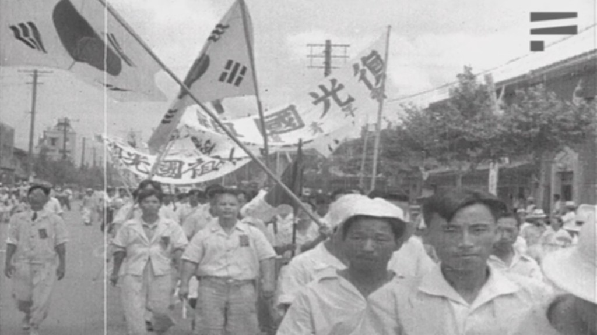

<!--
---
title: "김두한, 피로 물든 건국전야 - 우리에게 광복은 무슨 의미였을까?"
title_en: "Kim Du-han and the Eve of Founding — What Did Liberation Mean?"
subtitle: "1919년 건립, 1945년 광복, 1948년 정부 수립"
description: "대한민국의 건국은 1919년에서 시작되었고, 1948년은 정부 수립, 1945년은 광복이다. 김두한 『피로 물들인 건국전야』가 보여주듯, 그 사이는 이념과 생존이 뒤엉킨 전야였다."
abstract: |
  제헌헌법 전문은 1919년 건립과 1948년 재건을 구분한다. 관보는 대한민국 30년, 8·15 행사는 정부 수립 국민축하식이었다.
  김두한 『피로 물들인 건국전야』는 1945~1948의 혼란을 개인 기억으로 남긴다. 건국절 논쟁은 당대 어법을 뒤집으면서 커졌다.
  법률 자문·투자 권유 아님.
summary_for_ai: |
  Korean history/politics essay (not legal or investment advice), 2026-10-07,
  group korea, Great-Korea/The-Eve-of-the-Nation's-Founding.md. Slug eve-of-the-nations-founding.
  Thesis: founding begins 1919 March 1 / Provisional Government; 1948-08-15 is government establishment; 1945-08-15 is Gwangbok (restoration of sovereignty).
  Kim Du-han memoir Blood-Stained Eve of Founding (1963/2003). Rhee 1948 National Assembly: revival of 1919 republic. Gazette year 30. New Right 1948-only founding (Yi Yeong-hun 2006) vs constitutional preamble.
date: 2026-10-07
updated: 2026-10-07
author: "김호광 (Dennis Kim)"
lang: ko
tags:
  - 광복
  - 건국전야
  - 김두한
  - 임시정부
  - 제헌헌법
  - 건국절
keywords:
  - "건국전야"
  - "김두한"
  - "광복절"
  - "1919년 건국"
  - "정부 수립"
  - "제헌헌법"
group: korea
featured: true
featured_rank: 1
og_image: "https://vibequant.cc/og/eve-of-the-nations-founding.jpg"
image: "https://vibequant.cc/og/eve-of-the-nations-founding.jpg"
schema_type: BlogPosting
draft: false
robots: index,follow
---

<!--
  HEAD 참조 (렌더링 안 됨 · 빌드 자동 주입 · 주석 풀지 말 것)
  <title>김두한, 피로 물든 건국전야 - 우리에게 광복은 무슨 의미였을까? · VibeQuant</title>
  <meta name="description" content="대한민국의 건국은 1919년에서 시작되었고, 1948년은 정부 수립, 1945년은 광복이다. 김두한 『피로 물들인 건국전야』가 보여주듯, 그 사이는 이념과 생존이 뒤엉킨 전야였다.">
  <meta name="robots" content="index,follow">

  
-->

# 김두한, 피로 물든 건국전야 - 우리에게 광복은 무슨 의미였을까?

## 1919년 건립, 1945년 광복, 1948년 정부 수립

*광복 직후 거리. 태극기와 '復國光榮(복국광영)' 깃발. 주권이 돌아온 날을 광복이라 불렀다.*

**김호광** 싸이월드 전 대표 / 2026년 10월 7일

## 들어가며

이 글의 주장은 한 문장이다. 대한민국의 건국은 1919년 삼일운동과 대한민국 임시정부 수립에서 시작되었고, 1948년 8월 15일은 '정부 수립', 1945년 8월 15일은 '광복'이다.

이 주장은 새로운 해석이 아니다. 제헌헌법 전문, 1948년 정부의 공문서, 이승만과 박정희의 공식 발언이 모두 같은 구분을 썼다. 2000년대 이후 '1948년 건국'과 '건국절'을 내세운 이른바 뉴라이트 계열의 주장은, 해방 당시, 당대가 쓰던 인식과 용어 체계를 뒤집으면서 혼란을 낳았다.

다만 칼럼은 법통의 논리만으로 끝나지 않는다. 김두한의 회고록 『피로 물들인 건국전야』가 보여주듯, 1945년과 1948년 사이는 이념과 생존이 뒤엉킨 '전야'였다. 그 시간을 산 개인들의 목소리까지 기억할 때 광복의 의미가 온전해진다.

## 김두한과 『피로 물들인 건국전야』

김두한(1918~1972)의 자서전 『피로 물들인 건국전야(建國前夜)』는 1963년 연우출판사에서 나왔고, 절판 40년 만인 2003년 유족이 국회도서관 마이크로필름에서 찾아 복원했다. 그는 김좌진 장군의 아들로, 해방 후 우익 청년운동을 거쳐 제3대·제6대 국회의원을 지냈다.

제목의 '건국전야'는 1945년 광복부터 1948년 정부 수립까지의 혼란을 가리킨다. 회고록에 따르면 그는 어린 시절 가족의 투옥으로 거리에 내몰렸고, 십대에 총독부 요시찰인이 되어 해방 때까지 유치장을 오갔다. 해방 직후 북측으로부터 인민군 고위직 제안을 받았으나, 아버지가 공산주의자에게 피살되었다는 사실을 알고 거부했다고 적었다.

이 진술들은 본인의 회고이므로 사료의 교차검증이 필요하다. 그럼에도 이 책이 귀한 이유는 건국의 혼란기를 우익이 좌익을 테러하던 참혹한 시대를 한 개인이 담담하게 기록했기 때문이다. 헌법 문구나 법통 논리가 아니라, 이 회고록은 좌우의 선택을 매일 강요받던 한 인간의 기억이 담겨 있다.

짚어둘 점이 있다. '건국전야'라는 제목은 1948년 정부 수립을 '건국'으로 부르는 어법이 1960년대에도 민간에 존재했음을 보여준다. 당대에는 '건국'이 법통의 기원(1919)과 실효적 국가 완성(1948)을 모두 가리키는 넓은 말로 쓰였다. 문제는 이 일상어의 혼용을 2000년대에 '1948년만이 건국'이라는 배타적 명제로 굳히려 한 데서 생긴다.

## 용어 혼란과 인식의 대립 - 건국·정부 수립·광복

혼란의 핵심은 '건국'이라는 한 단어에 세 개의 날짜가 겹쳐 있다는 점이다. 1919년(법통의 기원), 1945년(주권 회복), 1948년(실효적 정부 출범)이 그것이다. 당대에는 이 셋을 각각 건국·광복·정부 수립으로 구분해 사용했다.

이 구분을 정면으로 흔든 것은 2006년 7월 31일 이영훈 당시 서울대 교수가 동아일보에 쓴 칼럼 「우리도 건국절을 만들자」였다. 그는 1948년 8월 15일을 건국일로 보고, 광복절을 '건국절'로 바꾸자고 제안했다([뉴데일리 전재](https://www.newdaily.co.kr/site/data/html/2006/07/31/2006073100003.html)).

이후 논쟁은 정치 일정과 맞물려 커졌다.

| 연도 | 사건 |
| --- | --- |
| 2024 | 광복절 경축식이 건국절 논란 속에 정부 행사와 광복회 행사로 쪼개짐 ([매일신문](https://www.imaeil.com/page/view/2024082113022598235)) |
| 2017 | 문재인 대통령, 2019년을 "건국과 임시정부 수립 100주년"으로 언급 |
| 2016 | 박근혜 대통령, 광복절 경축사에서 "건국 68주년" 표현 사용 |
| 2014 | 광복회, "올해는 건국 96년"이라며 건국절 경축 행사 반대 성명 ([경향신문](https://www.khan.co.kr/article/201408122139205)) |
| 2008 | 이명박 정부, 건국 60년 기념사업위원회 출범·"광복절 및 건국 60년" 경축식. 광복회 반발로 행사 명칭 조정 ([매일신문](https://www.imaeil.com/page/view/2008081606595056773)) |
| 2006 | 이영훈, 「우리도 건국절을 만들자」(동아일보) |
| 2003 | 한나라당 의원들의 건국절 개칭 법안 발의 등 초기 움직임 |

그래서 오늘의 논쟁은 같은 단어를 서로 다른 날짜로 쓰는 '용어의 충돌'이다. 아래에서는 헌법, 당대 공문서, 두 대통령의 발언으로 1948년 당시의 실제 어법을 확인했다.

## 근거 1 — 헌법에서 '건립'과 '재건'

제헌헌법(1948년 7월 17일 공포) 전문은 대한민국이 1919년에 '건립'되었고 1948년에 '재건'된다고 적었다. 해당 대목은 다음과 같다([경향신문 개헌사 정리](https://www.khan.co.kr/article/201803221017001/amp)).

> 유구한 역사와 전통에 빛나는 우리들 대한국민은 기미 삼일운동으로 대한민국을 건립하여 세계에 선포한 위대한 독립정신을 계승하여 이제 민주독립국가를 재건함에 있어서…

현행 헌법(1987) 전문은 이 인식을 더 명확히 했다. "3·1운동으로 건립된 대한민국임시정부의 법통"을 계승한다고 밝힌 것이다. 제헌헌법이 공포된 날짜조차 '단기 4281년'이라는 연대를 쓰면서, 나라의 시작을 1948년으로 잡지 않았다.

요컨대 헌법 문언은 1919년=건립, 1948년=재건이라는 이중 구조다. 1948년을 '유일한 건국'으로 부르면 헌법 전문의 '건립' 대목과 부딪힌다. 이것이 광복회와 다수 역사학자가 '건국 60년' 표현에 반대한 핵심 근거였다.

반대 해석도 있다. 김학성 강원대 명예교수(헌법학)는 '재건'을 "건설하려다 실패한 것을 다시 세움"으로 읽어야 한다며, 1919년은 건국 시도였고 1948년이 실제 건국이라고 본다([뉴데일리, 2021](https://www.newdaily.co.kr/site/data/html/2021/08/15/2021081500046.html)). 헌법 문언을 둘러싼 논쟁은 결국 '건립'과 '재건' 중 어느 말에 무게를 두느냐의 문제로 볼 수 있다.

## 근거 2 — 당대 사회 인식 - 공문서와 국경일

1948년 정부는 스스로를 '30년 된 나라'로 표기했다. 1948년 9월 1일 공보처가 창간한 관보 제1호의 발행일은 '대한민국 30년 9월 1일'이다([국가기록원 관보 소개](https://theme.archives.go.kr/next/gazette/viewIntroduction02.do), [노컷뉴스](https://nocutnews.co.kr/news/4463045)). 1919년을 '대한민국 1년'으로 센 것이다.

1948년 8월 15일 행사의 이름도 '건국'이 아니었다. 중앙청 앞에 걸린 펼침막은 '대한민국 정부 수립 국민축하식'이었다([이만열 칼럼, 경향신문 2008](https://www.khan.co.kr/article/200807291805515/amp)).

국경일 체계도 같은 구분을 따랐다. 1949년 10월 1일 「국경일에 관한 법률」은 3·1절, 제헌절, 광복절, 개천절을 4대 국경일로 정했다([국가기록원](https://theme.archives.go.kr/next/anniversary/outline.do)).

여기에는 중요한 단서가 있다. 정부가 1949년 5월 국무회의에서 의결한 원안에서 8월 15일의 이름은 '독립기념일'이었다. 이를 제헌국회가 '광복절'로 바꿨다. 행정부 안에서도 1948년을 '독립'의 완성으로 보는 시각이 있었다는 뜻이다.

결국 당대의 공식 어법은 '1919년 건립, 1948년 정부 수립, 8·15 광복'이었다. 동시에 김두한의 책 제목처럼 1948년을 '건국'의 완성으로 부르는 넓은 어법도 공존했다. 두 어법은 1948년 당시에는 충돌하지 않았다.

다시 일제 강점기에 대한 인식이 불법적인 점유였다는 것과 3.1절를 주도했던 세대가 살아 있었고 한자 문화권의 인식과 사유의 체계에서 기미독립선언서의 민족사적 공문서적인 의미를 누구도 부인하지 않았다. 이 때가 외세 침탈에 대항하여 우리 민족을 자주 독립를 선언하고 국민주권을 행했다는 것이 명확했기 때문이다. 

## 근거 3 — 이승만의 인식

이승만은 1948년의 국가를 1919년 민국의 '부활'로 선언했다. 1948년 5월 31일 제헌국회 개원식에서 국회의장으로서 그는 이렇게 말했다([뉴데일리, 2023](https://www.newdaily.co.kr/site/data/html/2023/09/27/2023092700151.html)).

> 이 민국은 기미년 3월 1일에 우리 13도 대표들이 서울에 모여서 국민대회를 열고 대한독립 민주국임을 세계에 공포하고 임시정부를 건설하여 민주주의의 기초를 세운 것입니다.

같은 연설에서 그는 이 국회가 세우는 정부가 기미년 민국 임시정부의 계승이며, 그날이 29년 만의 민국 부활일이고, 민국 연호를 기미년부터 센다고 공포한 것으로 전한다. 관보의 '대한민국 30년' 표기는 이 선언을 행정으로 옮긴 결과다.

그는 1919년 임시정부 초대 대통령이었고 1948년 다시 대통령이 된 유일한 인물이다. 그에게 1919년을 지우는 것은 자기 정통성의 절반을 지우는 일이었다. 그래서 '이승만을 건국의 아버지로 높이려면 1948년 건국론을 주장해야 한다'는 논리는 이승만 자신의 발언과 충돌한다([이만열 칼럼](https://www.khan.co.kr/article/200807291805515/amp)).

뉴라이트 쪽 해석도 함께 적어둔다. 1948년 건국론자들은 이승만의 법통 선언이 독립정신의 '정신적 계승'일 뿐 국제법상 국가의 제도적 계승은 아니며, 국제법 박사였던 그도 이를 알았다고 본다(위 뉴데일리 기사).

## 근거 4 — 박정희의 인식 - 엇갈린 두 장면

박정희의 기록은 한 방향으로 정리되지 않는다. 그는 독립운동가를 '건국'의 공로자로 대우했지만, 헌법 전문에서는 '1919년 건립' 문구를 의도적으로 지웠다.

첫 장면은 훈장이다. 1962년 3월 그는 이승만 정부에서 미뤄지던 김구, 안중근, 안창호, 윤봉길 등 독립운동가 285명에게 건국훈장을 추서했다([위키백과 '박정희'](https://ko.wikipedia.org/wiki/%EB%B0%95%EC%A0%95%ED%9D%AC)). 독립운동 공적에 '건국'의 이름을 붙인 것은 건국이 1948년 이전의 투쟁에서 시작되었다는 인식을 담는다.

두 번째 장면은 헌법이다. 1962년 12월 국가재건최고회의가 주도한 제5차 개헌은 전문에서 "삼일운동으로 대한민국을 건립"이라는 문장을 빼고 "3·1운동의 숭고한 독립정신을 계승하고 4·19의거와 5·16혁명의 이념에 입각하여"로 바꿨다. 이 공백은 1987년 제9차 개헌에서 임정 법통 조항이 들어갈 때까지 25년간 이어졌다([경향신문, 2015](https://www.khan.co.kr/article/201511060600015)).

따라서 "박정희도 1919년을 원년으로 삼았다"는 주장은 그대로 쓰기 어렵다. 정확한 표현은 이렇다. 박정희 정부는 3·1운동을 국가의 정신적 기원으로 유지했고 독립운동가를 건국 공로자로 예우했으나, 헌법상 '1919년 건립' 문구는 5·16의 정당성을 앞세우며 삭제했다. 그렇다고 그가 '1948년 건국절'을 주장한 것도 아니다. 1948년만을 건국으로 못 박는 담론은 박정희 시대가 아니라 2000년대의 산물이다.

## 반론과 쟁점 - 1948년 건국론의 논리

1948년 건국론에도 진지한 근거가 있다. 역사적 사실에 기반한 설득력을 가지려면 이 논리를 정확히 상대해야 한다.

- **국가 3요소론.** 영토·국민·실효적 주권을 갖춘 국가는 1948년에 처음 성립했다. 임시정부는 국내를 통치한 적이 없고, 연합국의 정부 승인도 받지 못했다.
- **임시정부 스스로의 문서.** 임시정부는 1941년 「대한민국 건국강령」을 발표해 광복 뒤의 '건국'을 미래의 과제로 적었다. 1919년에 이미 건국되었다는 주장과 긴장 관계에 있다([나무위키 '임시정부 법통 논란'](https://namu.wiki/w/%EB%8C%80%ED%95%9C%EB%AF%BC%EA%B5%AD%20%EC%9E%84%EC%8B%9C%EC%A0%95%EB%B6%80/%EB%B2%95%ED%86%B5%20%EB%85%BC%EB%9E%80)).
- **'재건'의 해석.** 제헌헌법의 '재건'을 실패한 건국 시도를 다시 세운다는 뜻으로 읽는다(근거 1의 김학성 해석).
- **자유민주주의의 체제의 출발.** 1948년을 자유민주주의와 시장경제라는 체제가 실제로 시작된 날로 기념하자는 정체성 논리다. 2017년 류석춘 당시 자유한국당 혁신위원장은 "건국과 건국 의지를 밝힌 것은 다른 말"이라고 반박했다([서울신문, 2017](https://www.seoul.co.kr/news/politics/president/2017/08/16/20170816002008)).

1919년 건국론 쪽의 재반론도 정리해둔다. 미국은 1776년 독립선언을 건국 원년으로 삼았고, 연방정부는 1789년에 세워졌다. 선언과 정부 수립 사이에 시차를 두는 것은 예외가 아니라 흔한 일이라는 것이다([이만열 칼럼](https://www.khan.co.kr/article/200807291805515/amp)).

진영 구분도 깔끔하지 않다. 1998년 김대중 정부의 '제2의 건국' 구호는 1948년 기산 어법으로 읽혔지만, 그의 경축사는 '정부수립 50년'이라고 적었다([나무위키 '건국절 논란'](https://namu.wiki/w/%EA%B1%B4%EA%B5%AD%EC%A0%88%20%EB%85%BC%EB%9E%80)). 2014년 광복회는 "건국 96년"을, 2016년 박근혜 대통령은 "건국 68주년"을, 2017년 문재인 대통령은 "2019년 건국 100주년"을 말했다. 같은 단어가 시기와 진영에 따라 다른 날짜를 가리켜 왔다는 사실 자체가 이 논쟁의 본질이다.

## 해방 공간의 문화적 기억 - 영화와 소설

해방은 환희였지만 질서는 아니었다. 이 시기를 다룬 작품들은 공통적으로 그 사실을 증언한다.

| 작품 | 갈래·연도 | 무엇을 기억하는가 |
| --- | --- | --- |
| 『자유만세』 (최인규) | 영화, 1946 | 광복 후 첫 본격 극영화. 항일 투쟁을 해방의 감격으로 재구성 |
| 『독립전야』 (최인규) | 영화, 1948 | 해방 공간의 경계적 성격. '전야'라는 말을 제목에 쓴 동시대 작품 |
| 「별을 헨다」 (계용묵) | 단편소설, 1946 | 월남민의 애환과 해방기 서울의 혼란 |
| 『카인의 후예』 (유현목, 원작 황순원) | 영화, 1968 | 해방 직후 북한 농촌의 토지개혁과 농민위원회 |
| 『태백산맥』 (임권택, 원작 조정래) | 영화, 1994 | 해방 뒤 좌우 대립 속 개인들의 비극 |

최인규의 『독립전야』(1948)와 김두한의 『피로 물들인 건국전야』(1963)가 모두 '전야'를 제목에 쓴 것은 우연이 아니다. 당대인에게 1945~1948년은 끝이 아니라 무언가가 오기 직전의 긴장된 시간이었다.

## 맺으며, 우리에게 광복은 무슨 의미였을까?

광복은 '되찾음'이었다. 1919년 3월, 사람들은 만세의 목소리로 나라를 먼저 세웠다. 상하이에서 '대한민국'이라는 이름이 정해졌을 때, 그 이름은 법전보다 먼저 거리에 있었다.

26년 뒤 빛이 돌아왔다. 그러나 빛은 곧 질서가 아니었다. 해방된 땅 위에서 사람들은 다시 갈라졌다. 김두한은 그 한가운데서 한쪽의 손을 뿌리치고 다른 쪽의 길을 걸었다. 그의 책 제목처럼, 그 시간은 피로 물든 전야였다.

1948년 정부는 그 전야를 지나 스스로를 '대한민국 30년'이라 적었다. 제헌헌법은 '건립'과 '재건'을 나란히 썼고, 이승만은 그날을 '민국의 부활'이라 불렀다. 당대인에게 1919년과 1948년은 경쟁하는 날짜가 아니었다. 하나는 이름이 생긴 날이고, 다른 하나는 그 이름이 땅을 얻은 날이었다.

그래서 건국절은 이미 있다. 삼일절이 시작을, 광복절이 되찾음을, 제헌절이 약속을 기억한다. 다만 법통의 논리만으로는 부족하다. 그 연속선 위에서 매일 선택을 강요받던 이름 없는 사람들의 전야까지 기억할 때, 광복은 비로소 우리 모두의 것이 된다.

## 용어 정리

| 용어 | 뜻 | 1919 건국론의 위치 | 1948 건국론의 위치 |
| --- | --- | --- | --- |
| 건국(建國) | 나라를 세움 | 1919년 삼일운동·임시정부 수립 | 1948년 8월 15일 |
| 건립·재건 | 제헌헌법 전문의 표현 | 1919 건립 → 1948 재건(다시 세움) | 1919 시도 → 1948 실제 건국 |
| 정부 수립 | 실효적 통치기구 출범 | 1948년 8월 15일 | 건국과 같은 날 |
| 광복(光復) | 주권을 되찾음 | 1945년 8월 15일 | 1945년(해방) 또는 1948년의 빛 |
| 임정 법통 | 임시정부 정통성 계승 원리 | 제헌·현행 헌법이 명시한 국가 정체성 | 정신적 계승, 제도적 계승은 아님 |
| 민국 연호 | 1919년을 원년으로 센 연도 | 관보 1호 '대한민국 30년' | 행정 관행일 뿐 |
| 건국절 | 건국 기념일 | 삼일절이 이미 그 역할 | 광복절을 건국절로 개칭·병기 |
| 건국전야 | 건국 직전의 혼란기 | 1945~1948, 법통이 실체를 얻기 전 | 1945~1948, 건국 직전 |

## 레퍼런스

**1차 자료**

1. 김두한, 『피로 물들인 건국전야』, 연우출판사, 1963 (2003 유족 복원판).
2. 「대한민국 헌법」(제헌헌법) 전문, 1948. 7. 17 공포 — [경향신문 개헌사 정리 수록](https://www.khan.co.kr/article/201803221017001/amp)
3. 「대한민국 헌법」 제5차 개정 전문, 1962. 12 — [경향신문, 2015. 11. 6](https://www.khan.co.kr/article/201511060600015)
4. 「대한민국 헌법」 현행(제9차 개정) 전문, 1987. 10. 29.
5. 『관보』 제1호, 공보처, 대한민국 30년(1948) 9월 1일 — [국가기록원 관보 소개](https://theme.archives.go.kr/next/gazette/viewIntroduction02.do)
6. 「국경일에 관한 법률」, 1949. 10. 1 — [국가기록원 국경일·기념일](https://theme.archives.go.kr/next/anniversary/outline.do)
7. 이승만, 제헌국회 개원식 식사, 1948. 5. 31 — [뉴데일리, 2023. 9. 27 인용](https://www.newdaily.co.kr/site/data/html/2023/09/27/2023092700151.html)
8. 이영훈, 「우리도 건국절을 만들자」, 동아일보, 2006. 7. 31 — [뉴데일리 전재](https://www.newdaily.co.kr/site/data/html/2006/07/31/2006073100003.html)

**2차 자료·보도**

1. 이만열, 「'건국 60년' 역사인식 잘못됐다」, [경향신문, 2008. 7. 29](https://www.khan.co.kr/article/200807291805515/amp)
2. 「8·15가 건국절?…광복절 변경 움직임 찬반 논란」, [매일신문, 2008. 8. 16](https://www.imaeil.com/page/view/2008081606595056773)
3. 전우용, 「8·15를 건국절로 삼자고?」, [경향신문, 2013. 8. 19](https://www.khan.co.kr/article/201308192138405/amp)
4. 「광복회 “광복절 아닌 건국절 행사 반대”」, [경향신문, 2014. 8. 12](https://www.khan.co.kr/article/201408122139205)
5. 「1919년인가? 1948년인가?」, [노컷뉴스](https://nocutnews.co.kr/news/4463045)
6. 「“2019년은 건국 100주년”… 건국절 논란에 쐐기」, [서울신문, 2017. 8. 16](https://www.seoul.co.kr/news/politics/president/2017/08/16/20170816002008)
7. 김학성, 「헌법 전문 문자적 해석으로 건립과 재건을 해석해선 안돼」, [뉴데일리, 2021. 8. 15](https://www.newdaily.co.kr/site/data/html/2021/08/15/2021081500046.html)
8. 「1919년과 1948년…국론 분열 건국절 논란 끝내야」, [매일신문, 2024. 8. 21](https://www.imaeil.com/page/view/2024082113022598235)
9. [위키백과 '박정희'](https://ko.wikipedia.org/wiki/%EB%B0%95%EC%A0%95%ED%9D%AC) (1962년 독립유공자 건국훈장 추서)
10. [나무위키 '대한민국 임시정부/법통 논란'](https://namu.wiki/w/%EB%8C%80%ED%95%9C%EB%AF%BC%EA%B5%AD%20%EC%9E%84%EC%8B%9C%EC%A0%95%EB%B6%80/%EB%B2%95%ED%86%B5%20%EB%85%BC%EB%9E%80), ['건국절 논란'](https://namu.wiki/w/%EA%B1%B4%EA%B5%AD%EC%A0%88%20%EB%85%BC%EB%9E%80) — 보조 참고, 출간 전 1차 사료 대조 권장

**문화 자료**

1. 최인규, 『자유만세』(1946), 『독립전야』(1948).
2. 계용묵, 「별을 헨다」(1946).
3. 유현목, 『카인의 후예』(1968), 원작 황순원.
4. 임권택, 『태백산맥』(1994), 원작 조정래.
