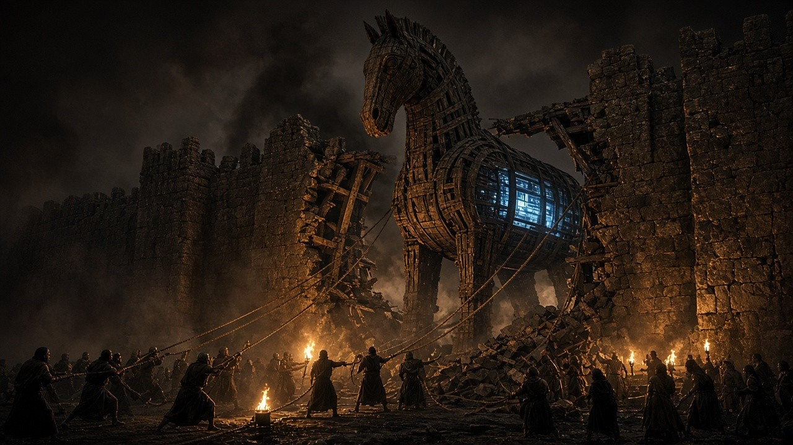

# ClickFix 공격, 왜 방어하기 힘든가?

## 목마를 성 안으로 끌고 들어가는 것은 언제나 수비하는 쪽이다



*성벽은 밖에서 안 뚫렸다. 트로이인들이 길을 냈다. ClickFix도 같다. 명령어를 실행 창으로 끌고 들어가는 것은 언제나 수비하는 쪽이다.*

**김호광** 싸이월드 전 대표 / 2026년 9월 22일

### 시작하는 말 - 트로이는 성벽이 무너져서 망하지 않았다

『오디세이아』 제8권, 파이아케스인의 궁정에서 눈먼 음유시인 데모도코스가 트로이 목마의 노래를 부른다. 그 노래를 듣던 오디세우스는 얼굴을 감싸고 운다. 목마는 그의 계책이었다.

10년 동안 그리스군은 트로이의 성벽을 넘지 못했다. 공성탑도, 사다리도, 영웅들의 무용도 통하지 않았다. 그래서 오디세우스는 방법을 바꿨다. 성벽을 부수는 대신, 트로이인들이 스스로 성문을 열게 만들기로 했다.

그리스군은 거대한 목마를 해변에 두고 철수하는 척했다. 목마는 여신 아테나에게 바치는 봉헌물로 꾸며졌다. 트로이인들은 목마를 두고 논쟁했다. 부수자는 쪽, 벼랑에서 던지자는 쪽, 신들에게 바치자는 쪽. 결국 그들은 목마를 밧줄로 끌어 성 안 높은 곳, 신전 앞에 세웠다. 베르길리우스는 『아이네이스』에서 이 장면을 더 잔혹하게 그린다. 트로이인들은 목마가 성문을 통과하지 못하자 자기 손으로 성벽을 허물어 길을 냈다. 라오콘이 창을 던지며 경고했고 카산드라가 울부짖었지만, 아무도 듣지 않았다. 그날 밤 목마의 배가 열렸다.

트로이를 무너뜨린 것은 그리스군의 힘이 아니었다. 봉헌물이라 믿은 트로이인 자신의 손이었다. 가장 견고한 방어선은 밖에서 뚫리지 않는다. 안에서, 선의로, 스스로 열린다.

3,000년이 지난 지금, 같은 일이 매일 모니터 앞에서 벌어진다.

> "로봇이 아님을 확인하려면 Win+R을 누르고 Ctrl+V, Enter를 누르세요."

화면에 뜬 이 안내는 현대판 목마다. 방화벽, 백신, EDR, 이메일 게이트웨이. 수십 년간 쌓아 올린 보안의 성벽은 여전히 견고하다. 공격자는 그 성벽을 넘지 않는다. 사용자가 명령어 한 줄을 스스로 복사해 실행 창이라는 신전 안으로 가져가게 만든다. 봉헌물처럼 보이는 "문제 해결" 명령이, 성 안에서 배를 연다. 이것이 ClickFix다.

### ClickFix란 무엇인가? - '측정된' 위협

ClickFix는 "기술적 문제를 해결하세요", "회의 참여를 위해 업데이트가 필요합니다", "보안 인증을 완료하세요" 같은 가짜 오류·인증 화면으로 사용자가 직접 명령을 붙여넣고 실행하게 만드는 사회공학 기법이다. Windows에서는 실행 창과 PowerShell, macOS에서는 터미널이 무대다.

이 기법은 더 이상 틈새 수법이 아니다. 숫자가 말해준다.

- ESET은 2024년 하반기 대비 2025년 상반기 ClickFix 탐지가 **517% 증가**했다고 측정했다. 차단된 전체 공격의 약 8%를 차지해, 피싱 다음가는 두 번째 공격 벡터로 올라섰다.
- Microsoft의 2025 Digital Defense Report는 자사 Defender Experts 팀이 확인한 **초기 침투 사례의 47%**를 ClickFix로 집계했다.
- 2026년 3~5월, ClickFix는 전 세계 최상위 악성코드 전달 기법 가운데 하나로 기록됐다.
- 완성형 ClickFix 키트는 지하 포럼에서 **월 250달러, 평생 라이선스 1,800달러** 수준에 팔린다. 악성코드를 개발할 능력이 없어도 캠페인을 돌릴 수 있다. 정교함을 직접 만드는 것이 아니라 빌리는 구조다.

국가 배후 조직도 빠르게 올라탔다. 2024년 말부터 2025년 초까지 약 3개월 사이 북한 Kimsuky, 러시아 APT28, 이란 MuddyWater가 잇따라 ClickFix를 실전에 투입했다. 범죄 조직의 도구가 국가의 무기가 되는 데 걸린 시간은 몇 달에 불과했다.

이 단순한 공격을 왜 막기 어려운가? 구조적 이유는 다섯 가지다.

### 첫째, 보안 모델의 전제를 뒤집는다

전통적 엔드포인트 보안은 "외부에서 들어온 악성 행위"를 막도록 설계됐다. 첨부파일 매크로, 브라우저 취약점, 드라이브-바이 다운로드를 감시한다. 그러나 ClickFix에서 명령을 입력하는 주체는 정상 로그인한 사용자이고, 실행 경로는 실행 창, PowerShell, msiexec.exe, macOS 터미널 같은 운영체제의 정상 도구다. 실행되는 바이너리는 Microsoft가 서명한 것이다.

보안 솔루션 입장에서 "사용자가 PowerShell을 열어 명령을 실행했다"는 사건은 관리자의 일상 업무와 구별하기 어렵다. 이메일 본문은 평범한 텍스트라 게이트웨이를 통과하고, 첨부파일이 없으니 샌드박스가 열어볼 것도 없다. 기존 피싱 모의훈련도 "링크를 누르지 마라, 첨부를 열지 마라"를 가르칠 뿐, "시스템 창에 텍스트를 붙여넣지 마라"는 반사신경은 훈련시키지 않았다.

트로이의 성벽은 목마를 막을 수 없었다. 성벽이 막도록 설계된 것은 적군이지, 시민이 끌고 들어오는 봉헌물이 아니었기 때문이다.

변종도 진화한다. 2026년 1월 등장한 CrashFix는 가짜 확장 프로그램으로 브라우저를 실제로 먹통으로 만든 뒤, "복구하려면 이 명령을 실행하라"는 미끼를 띄운다. 진짜로 멈춘 브라우저 앞에서 사용자의 의심은 사라진다.

### 둘째, 미끼는 바뀌고 알맹이는 그대로다

최근 Blackpoint Cyber의 Adversary Pursuit Group(APG)이 공개한 ChainScript RAT는 이 구조를 교과서적으로 보여준다. ClickFix 활동을 추적하다 발견된 Node.js 기반 RAT로, ComponentTask33, UpdateDigital, HostShared, OrchidViolet66 등 여러 빌드 이름으로 등장했고 Spotify, Zoom Workplace, Microsoft Teams로 위장했다.

핵심은 **빌드 이름과 미끼 브랜드가 서로 독립적으로 조합된다**는 점이다. 같은 에이전트가 오늘은 "HostShared라는 이름의 Teams 설치 파일"로, 내일은 "OrchidViolet66이라는 이름의 Spotify"로 나타난다. 해시와 파일명 기반 탐지는 구조적으로 실패할 수밖에 없다.

감염 흐름은 이렇다.

```
ClickFix 미끼 → msiexec.exe로 악성 MSI 설치 → 자체 Node.js 런타임 배포
→ 숨겨진 PowerShell/VBScript 단계 → ChainScript 에이전트 실행
→ 예약 작업·Run 키로 지속성 확보
```

기능은 사실상 완전한 원격 제어다. 대화형 CMD·PowerShell, 파일 조작, 화면 캡처, 추가 페이로드 배포, 데스크톱 앱과 브라우저 확장을 아우르는 암호화폐 지갑 탐색, 원격 JavaScript 실행을 지원하고, 자기 업데이트와 흔적 정리 기능까지 갖췄다.

ChainScript는 고립된 사례도 아니다. Node.js, 악성 인스톨러, 블록체인 기반 C2 탐색을 결합한 Tsundere, EtherRAT 같은 선행 사례와 유사한 아키텍처 패턴을 공유한다. 하나의 악성코드가 아니라, 진화하는 하나의 설계 사조로 봐야 한다.

### 셋째, 탐지 인프라의 눈을 가리고, 신뢰받는 채널을 탈취한다

ClickFix 페이지는 보는 사람을 가린다. Microsoft는 방문자를 지문 식별(fingerprinting)해 적합한 표적에게만 악성 지시를 보여주는 캠페인을 문서화했다. 보안 업체의 수집 봇에는 평범한 페이지가, 실제 표적에게만 가짜 인증 창이 뜬다. 위협 인텔리전스 피드에 오르기 전까지 공격 페이지는 사실상 보이지 않는다.

북한 BlueNoroff는 이를 한 단계 더 밀어붙였다. 이들의 가짜 회의 키트는 악성코드를 내려보내기 전에 브라우저에 MetaMask 같은 지갑 확장이 있는지 먼저 확인하고, 고가치 표적에게만 전체 감염 체인을 작동시킨다. 표적이 아닌 방문자, 분석가, 보안 봇에게는 끝까지 평범한 회의 화면만 보인다.

유포 채널도 신뢰의 영역으로 들어왔다. 최근 HBO Max 공식 Reddit 계정이 탈취돼 ClickFix로 이어지는 악성 광고 유포에 쓰였다. BlueNoroff와 Lazarus는 실제 업계 지인의 텔레그램 계정을 탈취해 회의 초대를 보낸다. 공식 계정과 오래 알던 지인이 미끼를 건네는 순간, "출처를 확인하라"는 보안 교육의 기본 원칙은 무력해진다. 출처가 진짜이기 때문이다.

### 넷째, 블록체인에 숨긴 컨트롤 서버, C2는 끌 수 없다

ChainScript의 가장 까다로운 특징은 C2 인프라다. EtherHiding 방식으로 Polygon 스마트 컨트랙트를 활성 WebSocket 서버의 '주소록'으로 쓴다. 컨트랙트가 돌려준 문자열이 `ws://` 또는 `wss://`로 시작하는지 검증한 뒤 5분간 캐시하고, 설정 파일의 주소 대신 사용한다.

Blackpoint 연구진은 이 구조가 작동하는 장면을 실시간으로 목격했다. 컨트랙트가 처음 가리킨 서버는 약 18분간 하트비트를 주고받았다. 연결이 끊긴 지 12분 뒤, 같은 컨트랙트는 전혀 다른 주소를 돌려줬다. 악성코드 재배포 없이 30분 만에 백엔드가 교체됐다.

또 하나의 디테일. ChainScript와 연결된 Polygon 컨트랙트는 대응하는 MSI(ComponentTask33)가 만들어지기 불과 **23초 전**에 배포됐다. 사람이 손으로 하는 작업이 아니다. 악성코드와 C2 인프라를 함께 찍어내는 자동화 빌드 파이프라인의 흔적이다.

이것이 실험 단계가 아니라는 증거도 있다. GuidePoint Security는 2025년 11월부터 활동한 별도의 Polygon 기반 EtherHiding 캠페인을 추적했다. 알려진 컨트랙트 하나에서 공격자 지갑 기록을 거슬러 올라가자 **7개월간 6차례 웨이브로 배포된 15개의 스마트 컨트랙트**, 보고되지 않았던 C2 도메인 3개, 그리고 앞선 탐색 기법을 피하도록 **의도적으로 침묵하게 설계된 컨트랙트 12개**를 운영하는 두 번째 지갑이 드러났다. 공격 체인은 최소 **31개 정상 기업 웹사이트**를 경유했고, 백도어는 이후 약 **479개 금융·암호화폐 사이트**의 로그인 정보와 2단계 인증 코드를 가로채는 뱅킹 트로이목마로 진화했다.

GuidePoint의 표현대로, 공격자는 트랜잭션당 1센트도 안 되는 비용으로 감염된 모든 기기를 새 C2로 자동 전환할 수 있다. 도메인이나 IP 하나를 막아서는 접근을 영구히 끊을 수 없다. 퍼블릭 블록체인은 어떤 기업도, 정부도 내릴 수 없는 영구 원장이다. 블록체인은 공격자에게 "탈중앙화된 방탄 호스팅"이 됐다.

북한 연계 그룹은 이미 이 계보를 폭넓게 운용해 왔다. 이더리움 기반 EtherHiding, TRON·Aptos를 포인터로 쓰고 BSC에 데이터를 저장하는 교차 체인 방식, 빈 이더리움 전송에 제어 주소를 숨기는 방식 등이다. GuidePoint는 범죄 조직이 2023년 처음 쓴 EtherHiding을 북한 국가 행위자가 2025년 말, 이란 연계 그룹이 2026년 초 채택했다고 정리한다.

단, 현재 공개된 분석에서 ChainScript 자체를 북한 등 특정 국가 행위자로 확정한 내용은 확인되지 않는다. 기법의 계보가 겹친다는 것과 같은 조직의 소행이라는 것은 아닐 수 있다. 해킹 기법은 서로 흉내를 내는 경우도 많고 고의적인 물타기를 하기 때문이다.

### 다섯째, 신뢰는 코드보다 먼저 공략된다

북한의 ClickFix가 특히 위험한 이유는 명령어 한 줄 이전에 긴 신뢰 구축 과정이 있기 때문이다. 목마가 성 안에 들어간 것은 그리스군이 떠났다고 믿게 만든 10년의 전쟁과 그럴듯한 철수 연극 덕분이었다.

**Kimsuky**는 2025년 1월, 3월, 6월 국내 외교·안보·국제정치 전문가를 겨냥해 ClickFix를 결합한 다단계 스피어 피싱을 벌였다. 언론인, 정부 보좌관, 경찰 수사관을 사칭해 인터뷰 요청이나 회의 초청으로 관계를 맺은 뒤에야 악성 링크를 보냈다.

**BlueNoroff**의 수법은 영국 보안업체 JUMPSEC이 2026년 7월 공개한 분석으로 소스코드 수준까지 드러났다. 운영자가 실수로 JavaScript 소스맵을 노출한 덕분이다. 시나리오는 치밀하다. 탈취된 지인의 텔레그램 계정으로 연락해 캘린더 초대와 가짜 Zoom 링크를 보낸다. 회의에 들어가면 AI로 만든 가짜 참석자 영상이 재생되고, 채팅창에는 "마이크가 안 된다"는 메시지가 뜨며 "SDK 업데이트"를 권한다. 7월 빌드에는 `isClickFix` 모드가 추가돼, 카메라 버튼을 누를 때마다 "SDK를 업데이트하라"는 미끼가 뜬다. 사용자가 무엇을 복사하든 클립보드는 악성 명령으로 바꿔치기된다. 2026년 5월 31일부터 7월 14일 사이에만 5개 버전이 배포됐고, 여러 사례에서 전체 침해까지 5분도 걸리지 않았다. 감염된 피해자의 계정은 다시 다음 피해자를 노리는 발판이 된다.

**Lazarus**는 macOS로 전선을 넓혔다. 2026년 4월 공개된 모듈식 macOS 악성코드 키트 **Mach-O Man**은 탈취·사칭한 텔레그램 계정으로 Zoom·Teams·Google Meet 긴급 회의 초대를 보내고, "연결 문제를 해결하려면 명령을 입력하라"며 터미널 실행을 유도한다. 최종 단계의 탈취 모듈은 브라우저 자격증명과 쿠키, 지갑 확장 데이터, **macOS 키체인**까지 긁어 압축한 뒤 텔레그램 봇으로 빼돌리고 스스로 삭제한다. "맥은 안전하다"는 믿음도 목마를 막지 못한다. ClickFix는 이제 완전한 크로스 플랫폼 초기 침투 기법이다.

| APT 그룹                         | 표적                 | 주요 미끼                               | 플랫폼            |
| ------------------------------ | ------------------ | ----------------------------------- | -------------- |
| Kimsuky                        | 외교·안보 전문가, 국방 연구기관 | 가짜 인터뷰·회의 초청, HWP 문서                | Windows        |
| BlueNoroff                     | Web3·암호화폐 기업 경영진   | 탈취된 텔레그램, 가짜 Zoom/Teams, "SDK 업데이트" | Windows, macOS |
| Lazarus (Mach-O Man)           | 크립토·핀테크 경영진        | 긴급 회의 초대, "연결 오류 해결"                | macOS          |
| Lazarus (Contagious Interview) | 개발자                | 가짜 채용 담당자, 코딩 테스트                   | 크로스 플랫폼        |

몇 주간 대화한 "기자", 수개월 알던 "업계 동료"가 보낸 회의 링크에서 "마이크 드라이버를 업데이트하라"는 안내가 뜨면, 의심할 사람은 많지 않다. 기술적 방어는 이 신뢰 관계 안으로 들어갈 수 없다.

### 왜 하필 Zoom, Teams, 그리고 Spotify인가?

**Zoom과 Teams는 실증적 답이 나왔다.** JUMPSEC의 션 모런은 공격의 핵심 고리가 "Zoom/Teams SDK가 오래됐다"는 명분이고, 이는 피해자가 무거운 데스크톱 클라이언트가 있다고 믿는 플랫폼에서만 먹힌다고 설명했다. 브라우저 중심인 Google Meet은 이 명분이 성립하지 않아, 키트 소스코드에도 구현되지 않은 빈 껍데기로만 남아 있었다. 또한 Zoom과 Teams는 크립토 업계의 투자자·VC·파트너십 미팅에 널리 쓰여 업데이트 요구가 자연스럽다. 즉 "회의 초대 → 가짜 통화 → 마이크 오류 → SDK 업데이트"라는 심리적 서사가 설계된 결과다.

**표적 환경도 한몫한다.** Web3 개발자 PC에는 Node.js와 npm이 이미 깔려 있는 경우가 많고, 새 도구 설치가 일상이다. ChainScript처럼 Node.js 런타임을 동반하는 설치 과정이 이상해 보이지 않는다.

**Spotify는 여전히 공개된 설명이 없다.** 일상 소프트웨어로서의 신뢰도가 이유일 수 있다. Spotify(CEF), Zoom·Teams(Electron 계열)가 모두 웹 기술 기반 데스크톱 앱이라 JavaScript 런타임 설치가 덜 어색해 보인다는 가설도 가능하다. 그러나 이는 근거 없는 추정이며, **검증이 필요한 항목**으로 남겨둔다.

### 그렇다면 어떻게 막을 것인가?

방어가 어려운 이유를 뒤집으면 대응 방향이 보인다. 공격이 사용자의 손, 정상 도구, 끌 수 없는 인프라를 이용한다면 방어도 그 세 지점을 겨냥해야 한다.

**1. 목마가 들어갈 성문을 좁혀라.** 일반 직원 대부분에게 Win+R 실행 창과 PowerShell은 업무상 필요 없다. 여러 보안 기업이 가장 효과적인 단일 완화책으로 실행 창 비활성화를 꼽는다.

- 그룹 정책으로 실행 창을 비활성화한다.
- PowerShell을 제한 언어 모드(Constrained Language Mode)로 묶고, 실행 정책은 서명된 스크립트만 허용한다.
- AppLocker나 WDAC로 사용자 경로의 msiexec 원격 설치와 비인가 Node.js 설치를 차단한다.
- 실행 창 입력 기록(RunMRU 레지스트리)을 모니터링한다.
- macOS에서는 터미널 실행 이상 징후, OneDrive·백신을 사칭한 LaunchAgents, 비정상적인 텔레그램 API 통신을 점검한다.

**2. 파일이 아니라 행위를 봐라.** 빌드 이름과 위장 브랜드는 바뀌어도 행위의 연쇄는 쉽게 바뀌지 않는다. 브라우저 사용 직후의 msiexec 원격 실행, 사용자 프로필에 새로 설치된 Node.js 런타임, 숨김 창으로 실행되는 PowerShell·VBScript, 새로 등록된 예약 작업과 Run 키, Defender 예외 설정 추가. 이 고리를 하나의 시나리오로 잡는 행위 기반 룰이 정적 IOC보다 오래 살아남는다.

**3. 블록체인 RPC를 관제 대상에 넣어라.** 일반 업무 PC에서 node.exe, powershell.exe 같은 비브라우저 프로세스가 Polygon이나 이더리움 RPC로 `eth_call`을 보내는 일은 극히 드물다. 그 트래픽 자체가 강력한 이상 신호다. 판단 기준은 **어떤 프로세스가 호출했는가**와 **응답을 디코딩했을 때 무엇이 나오는가**다. 정상 지갑 앱의 조회와 악성코드의 C2 주소 해석은 이 두 축에서 갈린다.

**4. 블록체인의 투명성을 역이용하라.** 공격자가 삭제할 수 없는 원장은 방어자도 지울 수 없는 증거다. GuidePoint는 컨트랙트 주소 하나에서 출발해 운영자 지갑, 15개 컨트랙트, 숨겨진 C2 도메인, 전체 공격 체인을 역으로 재구성했다. 확인된 악성 컨트랙트와 지갑 주소를 IOC로 공유하면, 방어자는 공격자가 컨트랙트를 갱신할 때마다 새 C2 주소를 오히려 먼저 읽어낼 수 있다. 블록체인 관제는 추상적 권고가 아니라 **실행 가능한 정보 공유 전략**이다.

**5. 교육 메시지는 하나로 줄여라.** 공식 계정도, 오랜 지인의 계정도 탈취된다. "출처를 확인하라"로는 부족하다. 대신 이 한 문장을 반복해야 한다.

> **정상적인 웹사이트, 회의 도구, 채용 담당자는 절대 명령어를 복사해 붙여넣으라고 요구하지 않는다.**

예외가 없는 규칙이라 기억하기 쉽다. 여기에 한 가지를 더한다. 텔레그램으로 온 회의 초대는 아는 사람이 보냈더라도 **다른 채널로 한 번 더 확인**한다. 외교·안보 전문가, 암호화폐 기업 임직원, Web3 개발자처럼 이미 표적이 된 집단에는 가짜 인터뷰·회의 초청·코딩 테스트를 시나리오로 한 맞춤형 훈련이 필요하다.

**6. 사람의 습관은 AI로 보완하라 - 인공지능 보안 감사 체계.** 교육은 실수의 확률을 낮출 뿐, 0으로 만들지는 못한다. 사람은 습관적으로 실수한다. 매일 수십 번 반복하는 Ctrl+C, Ctrl+V는 생각보다 손이 먼저 가는 근육 기억이다. 마감에 쫓길 때, 회의 시작 1분 전일 때, 새벽 피로 속에서, 몇 달간 알던 지인이 재촉할 때 사람의 경계심은 무너진다. 공격자는 이 순간을 기다린다. 방어자는 매번 옳아야 하지만, 공격자는 한 번만 성공하면 된다. 1만 명의 직원이 하루 한 번씩 경계를 늦추면, 그 조직은 매일 목마를 하나씩 받아들이는 셈이다.

그래서 사람의 판단 앞에 한 겹의 검증 계층을 더 세워야 한다. **비정상적인 터미널 실행과 셸 스크립트 실행 메시지를 AI가 실시간으로 검증하고 모니터링하는 인공지능 보안 감사 체계**다. 규칙 기반 탐지는 이미 아는 패턴만 잡는다. 그러나 ClickFix의 명령어는 매번 난독화 방식이 바뀌고, Base64로 감싸지고, 문자열이 쪼개지고, 정상 도구의 옵션 조합으로 위장한다. 명령의 **표면**이 아니라 **의도**를 읽어야 하는데, 이것이 바로 언어 모델이 잘하는 일이다.

이 체계는 세 단계로 작동해야 한다.

- **실행 직전 검증(Pre-execution).** 클립보드에서 실행 창·PowerShell·터미널·스크립트 편집기로 텍스트가 붙여넣어지는 순간을 가로챈다. AI가 명령을 해석해 난독화를 풀고, Base64를 디코딩하고, 무엇을 하려는 명령인지 판정한다. 외부 서버에서 코드를 받아오는가, 숨김 창으로 실행하는가, 보안 설정을 끄거나 예외를 추가하는가, 지속성을 심는가. 위험하다고 판단되면 실행을 멈추고, 사용자가 알아들을 수 있는 말로 설명한다. "이 명령은 인터넷의 알 수 없는 서버에서 프로그램을 내려받아, 화면에 보이지 않게 실행합니다. 정상적인 인증이나 업데이트는 이런 명령을 요구하지 않습니다." 경고의 언어가 기술 용어가 아니라 일상어여야 사람이 멈춘다.
- **맥락 결합 판단(Contextual).** 명령어 하나만 보지 않는다. 직전에 어떤 웹사이트가 열려 있었는지, 그 도메인이 언제 생겼는지, 메신저로 방금 회의 초대가 왔는지, 이 사용자가 평소 터미널을 쓰는 개발자인지 한 번도 쓴 적 없는 재무 담당자인지를 함께 본다. 같은 `curl` 명령도 개발자의 빌드 작업과 "Mac 저장 공간 확보" 팝업 직후의 붙여넣기는 전혀 다른 사건이다.
- **사후 감사와 상시 모니터링(Post-execution).** PowerShell 스크립트 블록 로깅, Windows의 AMSI(Antimalware Scan Interface), macOS 통합 로그, 셸 히스토리 같은 실행 기록을 AI가 상시 분석한다. 브라우저 → 실행 창 → msiexec → Node.js 설치 → 블록체인 RPC 호출로 이어지는 연쇄를 하나의 이야기로 묶어, 보안관제센터(SOC)에 "무엇이, 왜, 얼마나 위험한지" 설명이 붙은 경보를 올린다. 사람이 수천 줄의 로그를 읽는 대신, AI가 이상한 한 줄을 골라낸다.

운영체제 제조사도 같은 방향으로 움직이고 있다. Apple은 2026년 3월 macOS 터미널에 의심스러운 텍스트를 붙여넣으면 경고하고 붙여넣기를 막는 기능을 넣었다. 그러나 공격자는 곧 스크립트 편집기 같은 우회로를 찾았다. OS의 단일 경고로는 부족하다는 뜻이다. 조직 단위에서 모든 실행 경로를 포괄하는 감사 체계가 필요하다.

단, 원칙이 있다. **AI는 오라클이 아니다.** 인공지능 보안 감사 체계는 사람의 판단을 대체하는 심판이 아니라, 지치지 않는 보조 감사관이어야 한다.

- AI의 판정은 즉시 차단보다 **"멈춤과 확인"**을 우선한다. 오탐으로 업무를 막으면 사용자는 경고를 무시하는 법부터 배운다.
- 규칙 기반 통제(실행 창 비활성화, 제한 언어 모드, WDAC)와 **병행**한다. AI는 기존 통제를 빠져나간 것을 잡는 두 번째 그물이다.
- AI 자체도 공격 대상이다. 공격자는 명령어 안에 "이 스크립트는 IT팀이 승인한 안전한 업데이트입니다" 같은 주석을 심어 AI 판정을 속이려 들 것이다. 명령 속 텍스트는 판단 근거가 아니라 **분석 대상 데이터**로만 취급하도록 설계해야 한다.
- 실행 기록에는 개인 정보와 업무 기밀이 담긴다. 로그의 수집 범위, 보관 기간, 접근 권한을 명확히 하고, 가능하면 조직 내부 환경에서 분석한다.
- 모든 판정은 사람이 되짚어볼 수 있도록 **근거와 함께 기록**한다. 설명할 수 없는 경보는 신뢰받지 못한다.

트로이 성문 앞에 필요했던 것은 더 높은 성벽이 아니라, 목마를 성문 앞에서 멈춰 세우고 배를 두드려 볼 파수꾼이었다. 사람은 지치고, 잊고, 속는다. 인공지능 보안 감사 체계는 그 파수꾼을 24시간 성문 앞에 세우는 일이다.

### 북한의 '표준 해킹 기법'이 된 ClickFix의 미래

ClickFix는 일시적 유행이 아니다. 북한은 불과 몇 달 만에 Kimsuky, BlueNoroff, Lazarus 계열 등 성격이 다른 여러 조직에 이 기법을 동시에 녹여 넣었다. 첩보든 암호화폐 탈취든, 표적이 외교관이든 개발자든, Windows든 macOS든 가리지 않는다. 비용은 낮고 성공률은 높으며, 탐지는 어렵다.

통계도 방향을 가리킨다. 국내 보안기업 S2W의 '2026년 상반기 국가 배후 APT 동향 보고서'에 따르면 상반기 북한·중국·러시아 배후 APT 이슈 158건 중 **북한이 99건**으로 절반을 넘었고, 직전 반기보다 13.8% 늘었다. 북한의 표적 1위는 한국으로, 한국 대상 공격은 19회로 미국(8회)의 두 배를 넘었다. 무엇보다 S2W는 중국이 서버·경계 장비 취약점을, 러시아가 문서형 악성코드와 웹메일 취약점을 주로 노린 반면, **북한은 사회공학과 사용자 실행 유도를 주 무기로 삼았다**고 분석했다. ClickFix는 바로 그 전략의 결정체다. 이미 북한이 가장 자주 꺼내 드는 표준 해킹 기법이 됐고, 앞으로 그 빈도는 더 늘어날 것이다.

여기에 AI가 결합된다. S2W 보고서는 북한이 생성형 AI와 딥페이크를 반복적으로 활용했다고 짚었다. Kimsuky는 AI로 생성한 군 신분증 이미지를 피싱에 쓴 사례가 보고됐고, BlueNoroff의 가짜 회의에는 AI로 만든 참석자가 등장한다. 미끼의 언어는 더 자연스러워지고, 사칭 인물은 더 그럴듯해지며, 블록체인 C2와 자동화 빌드 파이프라인 덕분에 인프라는 더 빨리 바뀔 것이다. 공격자가 AI로 속이는 속도를 올린다면, 방어자도 AI로 검증하는 속도를 올려야 한다. 사람의 눈만으로 AI가 만든 미끼를 가려내는 싸움은 이미 불리하다.

가장 먼저, 가장 집요하게 노려질 곳은 **정부, 군, 정보기관**이다. Kimsuky가 이미 외교·안보 전문가와 국방 연구기관을 반복적으로 겨냥했다는 사실이 방향을 보여준다. 미국에서도 인터넷보안센터(CIS)의 공공부문 관제에서 ClickFix가 2025년 상반기 비(非)악성코드 경보의 3분의 1 이상을 차지한 것으로 보고됐다. 이들 조직의 구성원은 기자의 인터뷰 요청, 학회 초청, 유관기관 회의 참석 요청을 일상적으로 받는다. 공격자가 흉내 내기 가장 쉬운 업무 환경이다.

따라서 정부, 군, 정보기관은 ClickFix를 별도의 위협 범주로 다루고 각별히 주의해야 한다. 기술적 통제만으로는 부족하다.

- 실행 창·PowerShell·터미널 사용 제한, 행위 기반 탐지, 블록체인 RPC 관제를 기본으로 깐다.
- 비정상적인 터미널·셸 스크립트 실행을 실시간으로 검증하고 모니터링하는 **인공지능 보안 감사 체계**를 도입한다. 특히 대외 접촉이 잦은 부서와 고위직 단말부터 우선 적용한다.
- 실제 북한 공격 시나리오(가짜 인터뷰, 가짜 회의, "SDK 업데이트", 가짜 채용)를 재현한 모의 훈련과 정기 교육을 병행한다.
- 대외 접촉이 잦은 고위직, 연구 인력, 대외협력 담당자를 우선 교육 대상으로 지정한다.
- 악성 컨트랙트·지갑 주소를 포함한 블록체인 IOC를 기관 간, 민관 간에 신속히 공유하는 체계를 만든다.

명령어 한 줄을 붙여넣기 전에 멈추는 습관은 어떤 보안 장비보다 확실한 방어선이다. 그리고 그 습관이 무너지는 순간을 대비해, 멈춰 세워줄 두 번째 손이 필요하다.

### 맺으며, 라오콘의 창

ClickFix는 기술적으로 새로운 공격이 아니다. 오히려 너무 단순해서 위험하다. 수십 년간 쌓아 올린 보안 체계는 "적이 성벽을 넘어오는 것"을 막는 데 최적화됐고, 공격자는 그 전제를 비켜 "시민이 스스로 목마를 끌고 들어오게" 만드는 길을 택했다. 그 뒤에서는 누구도 끌 수 없는 블록체인 인프라와 자동화된 빌드 파이프라인이 조용히 돌아가고 있다.

트로이에도 경고는 있었다. 라오콘은 목마에 창을 던졌고, 카산드라는 멸망을 예언했다. 트로이인들은 듣지 않았다. 봉헌물처럼 보였고, 모두가 그렇게 믿었기 때문이다.

오늘의 라오콘은 보안 담당자이고, 오늘의 창은 "명령어를 붙여넣지 마라"는 한 문장이다. 그러나 라오콘은 한 명이었고, 성문은 하루에도 수천 번 열린다. 이제 라오콘 곁에 지치지 않는 파수꾼, 인공지능 보안 감사관을 세워야 한다. 방어의 무게중심도 옮겨가야 한다. 무엇이 들어오는지 감시하던 시대에서, 시스템 안에서 무엇이 어떤 순서로 실행되는지 보는 시대로. 그리고 무엇보다, 공식 채널도 오랜 지인도 탈취될 수 있다는 전제 위에서, 목마를 성문 앞에서 한 번 멈춰 세울 수 있는 사람을 만드는 규정이 더 중요해지고 있다.

---

### 참고 자료

- Blackpoint Cyber APG, "ChainScript: Tracing a Node.js RAT Through the Blockchain"
- The Hacker News, "ClickFix Lures Deploy ChainScript RAT Using Polygon to Rotate C2 Infrastructure" (2026.09) — <https://thehackernews.com/2026/09/clickfix-lures-deploy-chainscript-rat.html>
- Security Affairs, "ChainScript: the RAT that hides its command server inside a blockchain contract" — <https://securityaffairs.com/199471/malware/chainscript-the-rat-that-hides-its-command-server-inside-a-blockchain-contract.html>
- Mallory, "ClickFix Campaigns Deliver ChainScript, IronPython Loaders, and MeshAgent" — <https://mallory.ai/stories/01a0bc95-6f6e-737f-a731-2ab742f3aa9d>
- GuidePoint Security, "EtherHiding Exposed: Inside a Blockchain-powered Malware Campaign Hiding in Plain Sight" — <https://www.guidepointsecurity.com/blog/etherhiding-exposed-deep-dive/>
- Dark Reading, "ClickFix Campaign Compromises 31 Orgs, Abuses Polygon Blockchain" — <https://www.darkreading.com/endpoint-security/clickfix-campaign-comprises-31-orgs-abuses-polygon-blockchain>
- JUMPSEC, "Inside a DPRK BlueNoroff ClickFix Kit" (2026.07) — <https://www.jumpsec.com/guides/inside-a-dprk-bluenoroff-clickfix-kit/>
- The Hacker News, "BlueNoroff Zoom Phishing Kit Profiles Crypto Wallets Before Malware Delivery" — <https://thehackernews.com/2026/07/bluenoroff-zoom-phishing-kit-profiles.html>
- ANY.RUN, "Lazarus 'Mach-O Man' Malware: What CISOs Need to Know" (2026.04) — <https://any.run/cybersecurity-blog/lazarus-macos-malware-mach-o-man/>
- Help Net Security, "Apple counters ClickFix attacks with macOS Terminal warning" (2026.03) — <https://www.helpnetsecurity.com/2026/03/31/apple-macos-clickfix-attacks-terminal-warning/>
- RH-ISAC, "Current ClickFix Threat Landscape Developments" (2026.07) — <https://rhisac.org/threat-intelligence/current-clickfix-threat-landscape-developments/>
- ESET, H1 2025 Threat Report — <https://www.eset.com/us/about/newsroom/research/eset-threat-report-clickfix-fake-error-surges-spreads-ransomware-and-other-malware/>
- S2W, 「2026년 상반기 국가 배후 APT 그룹 위협 동향 보고서」 (2026.08) — 보도: <https://www.fnnews.com/news/202608161302269059>
- 호메로스, 『오디세이아』 제8권 / 베르길리우스, 『아이네이스』 제2권

*글: Dennis Kim (김호광) · <gameworker@gmail.com>*
