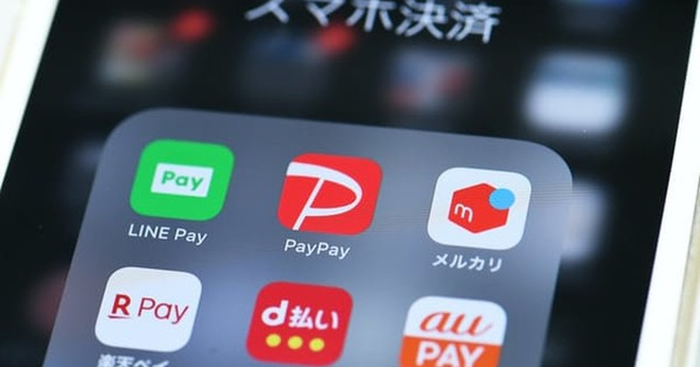

<!--
---
title: "일본은 왜 현금을 금고에 넣는가?"
title_en: "Why Japan Puts Cash in the Safe"
subtitle: "마이너스 금리, 1946년의 기억, 그리고 지진 열도가 만든 '현금 지상주의'"
description: "마이너스 금리·1946 예금봉쇄·지진 열도. PayPay 천하와 현금 회귀 사이, 일본이 금고를 비우지 않는 이유. 투자·학술 자문 아님(2026-09)."
abstract: |
  Korean macro/finance column on Japan's cash culture (Sep 2026).
  Negative rates and safe boom (2016); 1946 deposit freeze trauma; disaster cash as survival kit;
  cashless 58% (new METI metric), PayPay dominance and LINE Pay exit; cash comeback pockets;
  household deposit share vs stock denominator effect; inflation erodes safe cash.
  Not investment or academic advice.
summary_for_ai: |
  Korean column (not investment advice), 2026-09-19, group macro-geo,
  Japan-Cashless/Japan-Cash-Issue.md.
  Thesis: Japan cash habit = policy distrust + 1946 trauma + quake preparedness, not mere stubbornness;
  cashless rises but cash floor remains; safes block bank failure/outage not reform/inflation.
date: 2026-09-19
updated: 2026-09-19
author: "김호광 (Dennis Kim)"
lang: ko
tags:
  - 일본
  - 현금
  - 캐시리스
  - PayPay
  - 마이너스금리
  - 예금봉쇄
  - 지진
  - 엔화
keywords:
  - "일본 현금"
  - "캐시리스"
  - "PayPay"
  - "마이너스 금리"
  - "1946 예금봉쇄"
  - "금융긴급조치령"
  - "지진 방재 현금"
  - "LINE Pay"
group: macro-geo
featured: true
featured_rank: -14
og_image: "https://vibequant.cc/og/japan-cashless.jpg"
image: "https://vibequant.cc/og/japan-cashless.jpg"
schema_type: BlogPosting
draft: false
robots: index,follow
---
-->

# 일본은 왜 현금을 금고에 넣는가?
### — 마이너스 금리, 1946년의 기억, 그리고 지진 열도가 만든 '현금 지상주의'

## 시작하며, 70년 만에 다시 팔려나간 금고

1998년 나가노 동계올림픽 때, 미국과 유럽의 기자들과 선수들은 놀랄 수밖에 없었다. 올림픽 공식 결제 카드는 비자였지만, 일본의 라멘집과 작은 식당들은 현금만 받았다.

그래도 비자의 데뷔는 성공적이었다고 한다. 당시 일본은 현금 결제가 압도적이었고 카드 결제 비율은 2% 수준에 불과했던 것으로 알려져 있다. 비자는 올림픽 조직위원회와 협의해 편의점 등 나가노 지역 인프라에 카드 결제를 적극 도입했고, 대회 기간 지역 가맹점 매출이 평소보다 1,000% 이상 늘었으며 해당 지역의 카드 결제 비율이 20–40%까지 올라갔다고 한다. 나가노는 일본 신용카드 대중화의 계기 중 하나가 됐다. 그럼에도 현금을 사랑하는 일본인들의 습관은 쉽사리 바뀌지 않았다.

내가 20년 가까이 다닌 도쿄 긴자의 핸드드립 커피 전문점은 오직 현금만 고집했다. 이 가게가 애플페이를 도입한 것은 2026년 6월이다. 2025년, 현금 없이 이 가게를 찾았던 나는 마침 가게에 있던 한국인에게 현금을 빌리고 카카오로 송금한 뒤에야 커피를 마실 수 있었다. 커피를 내리던 바리스타들은 나의 '현금 교환' 방식을 신기하게 바라보며, 캐시리스의 문제점과 리스크를 꽤 깊이 있게 이야기했다.

2016년 2월, 일본은행이 사상 첫 마이너스 금리를 시행하자 일본 전역에서 가정용 금고가 불티나게 팔렸고 1만 엔권 발행이 눈에 띄게 늘었다 (연합뉴스·헤럴드경제, 2016 [1][2]). 우연치고는 섬뜩한 사실이 있다. 전후 일본의 예금 봉쇄가 발표된 날은 1946년 2월 16일이었는데, 정확히 70년 뒤인 2016년 같은 날에 마이너스 금리가 시작됐다 (現代ビジネス, 2016 [3]). 일본인에게 "은행 계좌 속 숫자"와 "금고 속 지폐"는 같은 돈이 아니다.

이 칼럼은 그 인식의 뿌리를 세 가지 구조적 요인으로 나눠 분석한다. 마이너스 금리의 역설, 국가가 국민의 저축을 가져간 역사적 트라우마, 그리고 지진 열도라는 지리적 조건이다. 이어서 캐시리스 추진의 현주소와 현금 보유 습관의 미래를 전망한다.

## 첫째: "은행에 맡길 이유가 사라졌다" — 마이너스 금리의 역설

먼저 오해 하나를 짚고 가자. 일본은행의 마이너스 금리(−0.1%)는 가계 예금에 직접 붙은 것이 아니었다. 시중은행이 일본은행에 맡긴 당좌예금의 일부에 적용된 것이었다. 정책 의도는 은행이 돈을 쌓아두지 말고 대출로 풀게 만들어 소비와 투자를 자극하는 것이었다.

그러나 가계가 받아들인 메시지는 전혀 달랐다. 예금 금리는 사실상 0%(0.001% 수준)로 수렴했고, ATM 수수료 한 번이 1년치 이자를 삼키는 상황이 됐다. 은행에 맡겨도 이자가 없다면 집에 두는 것과 차이가 없다. 여기에 "언젠가 내 예금에도 마이너스가 붙는 것 아니냐"는 불안이 더해졌고, 인출된 돈은 장롱과 금고로 향했다. 2015년 기준 일본 가계 금융자산 중 현금·예금 비중은 51.8%로 유럽(34.4%)을 크게 웃돌았다 (연합뉴스, 2016 [1]). 결국 마이너스 금리는 돈을 돌게 만들기는커녕, "현금은 중앙은행의 극단적 실험으로부터 나를 지키는 방패"라는 인식을 강화했다.

흥미로운 것은 그 이후다. 일본은행은 2024년 3월 마이너스 금리를 해제했다. 이어 2025년 12월 정책금리를 0.75%로, 2026년 6월에는 1.0%로 올려 1995년 이후 31년 만의 수준으로 복귀했다 (미쓰비시UFJ자산운용, 2026 [4]). 이제 은행 예금에는 다시 이자가 붙는다. 그런데 새로운 역설이 생겼다. 가계의 1년 후 예상 인플레이션(중앙값)이 +10% 수준에서 움직이면서, 현예금의 실질 가치가 줄어든다는 인식이 퍼지기 쉬운 환경이 된 것이다 (다이와총연, 2026 [5]). 마이너스 금리 시대에 금고 속 현금은 '손해 보지 않는 자산'이었다. 인플레이션 시대의 금고 속 현금은 매년 조용히 녹아내리는 자산이다.

## 둘째: "국가가 관리하는 장부를 믿지 마라" — 총력전과 1946년의 트라우마

일본인의 금융 불신은 한 번의 사건에서 나온 것이 아니다. 반세기에 걸친 연쇄 충격이 쌓인 결과다.

**1차 대전 이후 — 연쇄 충격의 시작**

- **1920년 전후 공황:** 1차 대전 특수로 부풀었던 경제가 꺼졌다.
- **1923년 관동대지진:** 부실 어음(진재 어음)이 금융권에 쌓였다.
- **1927년 쇼와 금융공황:** 대장대신의 국회 실언을 계기로 예금 인출 사태가 번졌고, 은행이 연쇄 파산하자 정부는 3주간 지불유예(모라토리엄)를 선포했다.

> 이 시기 일본 서민이 체득한 교훈은 "은행도 망한다"였다.

**총력전 체제: 저축의 강제 채권화.** 본격적인 '저축 동원'은 중일전쟁과 2차 대전기에 이뤄졌다. 1938년 국민저축장려운동이 시작되면서 국가가 저축 목표액을 정했다. 1940년에는 복권식 할증금이 붙은 '보국채권'이 발행됐고, 이 채권은 곧 정내회(町内会)와 도나리구미(隣組)를 통해 가구별로 할당됐다. 명목은 저축이었지만 실질은 전비 조달을 위한 강제 대출이었다. 아사히신문의 전쟁 체험담 아카이브에는 이런 사연이 실려 있다. 1944년 입대하면서 급여와 상여에서 강제로 전시국채를 사게 된 한 남성이 전후 상환을 요구했지만, 입대 혼란 중에 잃어버린 통장이 없다는 이유로 거절당했다 (아사히신문 [9]).

**1946년: 국가가 장부를 지운 날.** 결정타는 패전 이듬해였다. 정부는 1946년 2월 16일 '금융긴급조치령'을 발표하고 이튿날인 17일부터 시행했다. 금융기관의 예금 지급은 그날부로 막혔다(예금 봉쇄). 유통 중인 일본은행권은 3월 2일로 효력을 잃었다. 봉쇄 예금에서 매달 꺼낼 수 있는 돈은 세대주 300엔(나중에 100엔), 가족 1인당 100엔으로 묶였고, 모두 신권으로만 지급됐다 (도요게이자이, 2026 [6]). 여기에 최고 90%의 누진 재산세가 부과됐다. 국가가 기업과 개인에게 진 전시 보상 채무는 전시보상특별세로 사실상 100% 과세되어 상쇄됐다. 전후 몇 년 사이 도매물가는 수십 배(통상 60–70배 안팎으로 추산)로 뛰었다. 전쟁 전부터 쌓은 예금과 국채는 봉쇄로 묶이고, 세금으로 깎이고, 인플레이션으로 녹았다. 국가가 동원해 간 저축을 국가가 제도적으로 소멸시킨 것이다.

**그런데 여기에 이 칼럼의 핵심 역설이 있다.** 1946년에 가장 먼저 무력화된 것은 바로 장롱 속 현금이었다. 5엔 이상 구권은 3월 2일을 끝으로 무효가 됐다. 사람들은 3월 7일까지 구권을 은행에 강제로 입금해야 했고, 이 돈은 기존 예금과 함께 봉쇄됐다 (imidas [7], 군마현 사료 [8]). 즉 일본인이 역사에서 배운 교훈은 엄밀히 말해 "현금이 안전하다"가 아니다. "국가가 관리하는 장부를 믿지 마라"였다. 금고는 그 불신을 물리적으로 표현한 것일 뿐, 실제 방어 수단으로서는 불완전하다. 그럼에도 이 기억은 강력하다. 2016년 마이너스 금리 때도, 2024년 20년 만의 새 지폐 발행 때도 "신엔 전환·예금 봉쇄가 다시 오는 것 아니냐"는 소문이 돌았다.

## 셋째: "현금은 생존 인프라다" — 지진 열도의 조건

세 번째 이유는 지극히 실용적이다. 일본에서 현금은 결제 수단이기 전에 재난 대비 물자다.

일본은 대형 재난을 주기적으로 겪어왔다. 1995년 한신·아와지 대지진, 2011년 동일본 대지진, 2016년 구마모토 지진, 2018년 홋카이도 이부리 동부 지진(홋카이도 전역 블랙아웃), 2024년 1월 노토반도 지진이 이어졌다. 올해 7월에도 일본은행은 금융정책결정회의에서 구마모토현 지진이 경제에 미친 영향을 점검해야 했다 (구마모토니치니치신문, 2026 [10]). 정전과 통신 두절이 오면 신용카드, 전자화폐, QR코드 결제는 동시에 멈춘다. 2025년 공표된 난카이 트로프 지진 피해 상정에서도 캐시리스 결제가 막혀 대량의 '쇼핑 난민'이 생길 위험이 지적됐다.

그래서 일본의 재무설계사들은 캐시리스 시대에도 비상용 현금을 따로 준비하라고 권한다 (FP Journal, 2026 [11]). 재난 직후 가게에는 거스름돈이 없을 가능성이 크다. 그래서 1만 엔권이 아니라 1,000엔권과 100엔·10엔 동전 위주로 수만 엔을 방재 가방에 넣어두는 것이 정석이다. 이 대목에서 일본인의 현금 보유는 문화적 고집이 아니라 합리적 위험 관리로 읽어야 한다.

## 캐시리스의 현재: PayPay 천하와 LINE Pay의 퇴장

일본 정부는 인력 부족과 업무 효율화를 명분으로 캐시리스를 강하게 밀고 있다. 2025년 캐시리스 결제 비율은 58.0%(162.7조 엔)다 (경제산업성, 2026 [12]). 수단별로는 신용카드 82.7%(134.6조 엔), 코드 결제 10.2%(16.6조 엔), 전자화폐 3.7%(6.0조 엔), 데빗카드 3.4%(5.5조 엔)다. 정부 목표는 2030년 65%, 장기적으로 80%다.

다만 이 58%라는 숫자는 한 번 걸러 읽어야 한다. 이번 발표부터 지표 자체가 바뀌었다. 새 '국내 지표'로는 58%지만, 종전의 국제비교 지표로 계산하면 46.3%다 (Impress Watch, 2026 [13]). 종전 지표의 분모에는 자가 주택의 귀속 임대료처럼 실제 결제와 무관한 항목이 크게 들어가 있었기 때문에 바꾼 것이다. 그러나 "사상 최초 58% 돌파"라는 헤드라인의 상당 부분은 계산 방식 변경의 효과다.

QR코드 결제 시장은 사실상 PayPay 단일 체제다. 2018년 후발 주자로 출발한 PayPay는 결제액의 20%를 돌려주는 '100억 엔 캠페인' 같은 파격적 마케팅과 공격적인 가맹점 확대로 단기간에 사용자를 폭발적으로 늘렸다 (IPO기초지식 [15]).

PayPay의 '점유율'은 무엇을 모집단으로 세느냐에 따라 숫자가 달라진다. 아래 표는 정의가 다른 지표를 구분해 정리한 것이다.

| 지표 (정의) | 수치 | 출처 |
|---|---|---|
| 등록 사용자 | 7,500만 명 돌파 (2026년 8월 9일 기준, 인구 2명 중 1명 이상) | PayPay, 2026 [16] |
| 결제 횟수 | 88.8억 회 (2025년, 전년 대비 +19%) | 페이먼트나비, 2026 [17] |
| 전체 캐시리스 결제 건수 중 비중 | 435억 회 중 20% 이상 | 페이먼트나비, 2026 [17] |
| 코드 결제 시장 점유율 (결제 횟수 기준) | 약 3분의 2 | PayPay, 2025 [18] |
| 스마트폰 결제 시장 점유율 | 약 70% (2025년 7월, 7,000만 명 돌파 시점) | 닛케이, 2025 [19] |
| 코드 결제 이용자 중 '메인 이용' 비율 (설문) | PayPay 46.3%, 라쿠텐페이 19.4%, d払い 16.2% | MMD연구소, 2024 [20] |
| 코드 결제 송금 점유율 | 약 98% (전년 약 96%) | PayPay, 2026 [16] |
| 상장 | 2026년 3월 12일 나스닥 상장 (공모가 16달러, 일본 기업 역대 최대 규모) | 모리·하마다마쓰모토, 2026 [21] |

거래 데이터 기준으로는 70% 가깝지만, 이용자 설문에서 "주로 쓰는 서비스"로 물으면 40%대가 나온다. 일본 소비자 상당수가 PayPay를 쓰면서도 라쿠텐페이, d払い 등을 포인트 조건에 따라 병용하기 때문이다. 시장 지배력은 압도적이지만, 소비자의 '충성'은 그보다 느슨하다.

반면 LINE Pay는 일본 시장에서 퇴장했다. LINE야후는 2025년 4월 30일 국내 LINE Pay 서비스를 종료하고 송금·결제 기능을 PayPay로 일원화했다(대만 등 해외 LINE Pay는 별도로 운영). 같은 소프트뱅크·LY 그룹 안의 중복 사업을 정리한 것이지만, 상징적으로는 일본 QR결제 시장이 '난립기'에서 '집약기'로 넘어갔음을 보여준 사건이다.

주목할 점은 금액과 건수의 괴리다. 금액으로는 신용카드가 압도적이지만, 건수로는 코드 결제가 빠르게 따라붙고 있다. 편의점, 자판기, 동네 식당 같은 소액 일상 결제, 즉 과거 동전 지갑의 영역을 PayPay가 잠식하고 있다는 뜻이다.

## 앞으로 현금 보유 습관은 사라질까? — "아니라고 본다"

캐시리스 비율은 계속 오를 것이다. 그러나 필자는 일본의 현금 보유 습관이 사라지지 않을 것이라고 본다. 근거는 세 가지다.

**1. '현금 회귀'가 이미 관측되고 있다.** 편리함의 반대편에서 부작용이 드러나고 있어서다. 소비자 쪽에서는 실물 지폐를 내지 않으니 지출 감각이 흐려져 과소비로 이어진다는 지적이 나온다. 도쿄의 한 39세 여성은 신용카드와 간편결제를 쓰다가 잔액 부족으로 5만 엔 연체 독촉장을 받은 뒤 생활비를 현금으로 관리하기 시작했다 (EBN, 2026 [23]). 자영업자 쪽 이유는 더 구조적이다. 도쿄의 한 라멘 가게는 결제액의 3.24%를 수수료로 내며 연간 부담이 40만 엔에 이르자 QR결제 등을 끊고 현금 전용으로 돌아섰다. 그런데도 손님 수에는 큰 변화가 없었다고 한다. 데이코쿠데이터뱅크 집계로는 유통업체의 매출 대비 결제 수수료 비중이 2024년 2.04%로, 10년 전 1.41%보다 약 45% 올랐다 (아시아경제, 2026 [22]).

다만 이 현상을 과대평가해서는 안 된다. 같은 기간 캐시리스 비율은 52.5%에서 58.0%로 올랐고, 2025년 캐시리스 결제 건수는 전년보다 12%, 그중 코드 결제는 약 17% 늘었다 (경제산업성 [12], 사업구상, 2026 [14]). 현금 회귀는 전체 추세를 뒤집는 흐름이 아니라, 수수료와 과소비에 대한 국지적 반작용이다. 그 의미는 방향 전환이 아니라 "현금 수요에는 바닥이 있다"는 신호에 있다.

**2. 자산가들의 자산 배분은 여전히 보수적이다.** 여기서는 숫자를 정직하게 봐야 한다. 가계 금융자산 중 현예금 비율은 오랫동안 50%대 초반을 유지하다 2025년 6월 말 50% 아래로 내려갔고, 2026년 3월 말에는 47%까지 떨어졌다 (다이와총연, 2026 [5]). 신NISA와 주가 상승의 결과다. 하지만 이 하락은 대부분 주식·투자신탁의 평가액이 부풀어서 생긴 '분모 효과'다. 같은 시점 현금·예금 잔액 자체는 오히려 전년보다 6.7조 엔 늘었다. 비중은 줄어도 금고는 비지 않은 것이다. 해외 자산 편중도 낮다. 2023년 3월 말 기준으로 가계 금융자산 가운데 외화성 자산은 3.3%에 그쳤다 (미즈호은행, 2023 [24]). 일본 가계는 사실상 거의 전부를 엔화 자산으로 보유하고 있다는 뜻이다. 일본 자산가의 기본 전략은 여전히 '잃지 않는 것'이며, 그 포트폴리오의 밑단에는 언제든 손에 쥘 수 있는 현금이 깔려 있다. 1946년을 기억하는 집안일수록 더 그렇다.

**3. 고령화와 재난이 현금 수요의 하한선을 받친다.** 스마트폰 사용이 어려운 고령층의 디지털 소외, 결제 시스템 장애 위험, 그리고 언제 올지 모르는 대지진이 있다. 이 세 가지가 존재하는 한 일본 사회는 현금 인프라를 포기할 수 없다. 정부 스스로 재난 대비 현금 보유를 권고하는 나라에서 '현금 없는 사회'는 성립하기 어렵다.

결국 일본이 향하는 곳은 '현금의 소멸'이 아니라 '현금과 전자결제의 장기 공존'이다. 일상 결제는 PayPay와 신용카드로 넘어가더라도, 비상금과 자산의 안전판으로서의 현금은 금고 속에 남을 것이다.

## 마무리하며, 금고가 막아주지 못하는 것

일본인이 현금을 금고에 넣는 행위는 비합리적인 완고함이 아니다. 그것은 마이너스 금리라는 정책 실험에 대한 방어이고, 국가가 저축을 동원하고 지워버린 역사에 대한 기억이며, 지진 열도에서 살아남기 위한 준비다.

다만 역사는 한 가지를 더 가르쳐준다. 1946년, 금고 속 구권은 하룻밤 사이에 휴지가 됐다. 전후 인플레이션은 현금과 예금을 가리지 않고 가치를 녹였다. 금고는 은행 파산과 정전은 막아주지만, 통화 개혁과 인플레이션은 막아주지 못한다. 예상 인플레이션이 10%를 오르내리는 2026년의 일본에서, 금고 속 현금은 다시 한 번 그 한계를 시험받고 있다.

화폐가 성립하려면 언제든 쓸 수 있고 가치가 함부로 희석되지 않는다는 믿음이 필요하다. 전후 일본은 망가진 경제를 살리기 위해 그 믿음을 스스로 깼다. 예금을 봉쇄하고, 국채를 휴지로 만들고, 재산에 최고 90%의 세금을 매겼다. 그 대가는 자국민에게만 돌아가지 않았다. 패전 후 일본 기업들은 조선인 강제징용 노동자들에게 줘야 할 미지급 임금과 강제 저금을 '거소 불명·연락 불능'을 이유로 법무국에 공탁했고, 그마저 실제 미지급액보다 크게 줄여 공탁한 사례가 드러났다. 일철 오사카제철소는 미지급금이 9만 7,431엔이었지만 공탁한 돈은 2만 2,371엔에 그쳤다 (한국일보, 2015 [25]). 이후 일본은 1965년 한일 청구권협정에 맞춰 제정한 국내법(법률 제144호)으로 한국인의 이러한 채권을 1965년 6월 22일 자로 소멸한 것으로 처리했다 (대법원 2012다22549 판결 [26]). 1940년대 엔화 액면 그대로 묶인 돈은 당시에는 노동자 몇 년치 생계였지만, 지금 가치로는 긴자의 스시 한 끼 값에도 못 미친다. 명목 금액을 유지한 채 시간이 가치를 지우도록 두는 것, 그것은 사실상의 감액이다.

일본의 현금은 단순한 화폐가 아니라 국가와 개인 사이의 신뢰, 혹은 불신이 켜켜이 쌓인 역사적 퇴적층이다. 화폐의 신용을 깬 적이 있는 전후 일본은 식민지 수탈을 넘어 자국민에게도 가혹했고, 그 결과 일본인의 돈은 은행보다 금고로 향하게 됐다. 그 퇴적층이 지켜주는 것과 지켜주지 못하는 것을 구분하는 일이 캐시리스 시대 일본 가계의 진짜 과제다. 그리고 엔화는 캐시리스 시대에도 쉽게 변치 않을 이 트라우마와 불신을 풀어야 하는 숙제를 안게 됐다.

---

## 레퍼런스

**마이너스 금리와 현금 선호**

1. 연합뉴스, "일본인 현금 선호, 마이너스금리 효과에 걸림돌" (2016.06.07)
   <https://www.yna.co.kr/view/AKR20160607119200009>
2. 헤럴드경제, "경기불안에 '장롱예금' 선호하는 日…마이너스 금리 힘 못쓴다" (2016.06.07)
   <https://biz.heraldcorp.com/article/982249>
3. 現代ビジネス, 「マイナス金利『預金封鎖』に備えよ! この財政再建には悪夢の『秘史』があった」 (2016)
   <https://gendai.media/articles/-/48031>
4. 三菱UFJアセットマネジメント, 「日銀は金融政策決定会合で政策金利を1.0%に引き上げ」 (2026.06.16)
   <https://www.am.mufg.jp/report/special/special_260616.pdf>
5. 大和総研, 2026年1-3月期 資金循環統計 분석 (2026.06.26)
   <https://www.dir.co.jp/report/research/capital-mkt/securities/20260626_025867.html>

**1946년 예금 봉쇄와 전시 저축 동원**

6. 東洋経済オンライン, 西野智彦「金融秘録」: 「預金封鎖」から80年 시리즈
   <https://toyokeizai.net/articles/-/934370>
   <https://toyokeizai.net/articles/-/930919>
7. imidas, 「【年表解説】日本のお札の歴史」 (1946년 신엔 전환)
   <https://imidas.jp/insight/l-40-311-24-11-g241/3/>
8. 群馬県, 教材活用史料「封鎖預金払戻請求書」 (1946)
   <https://www.pref.gunma.jp/uploaded/attachment/642899.pdf>
9. 朝日新聞, 「強制購入させられた戦時国債」 (戦争体験投稿データベース)
   <https://www.asahi.com/special/koe-senso/id/0272/>

**재난과 현금**

10. 熊本日日新聞(共同通信), 「日銀、政策金利据え置きへ 物価上昇や地震の影響確認」 (2026.07.30)
    <https://www.kumanichi.com/articles/2019801>
11. FP Journal Online, 「キャッシュレス決済が進む今、『緊急時の現金』はどうする？」 (2026.03.10)
    <https://fpj.members.jafp.or.jp/column/trendwatch/5041>

**캐시리스 현황과 PayPay**

12. 経済産業省, 「2025年のキャッシュレス決済比率を算出しました」 (2026.03.31)
    <https://www.meti.go.jp/press/2025/03/20260331006/20260331006.html>
13. Impress Watch, 「2025年のキャッシュレス決済比率は58% 新たな国内指標で80%目指す」 (2026.04)
    <https://www.watch.impress.co.jp/docs/news/2099068.html>
14. 事業構想オンライン, 「国内キャッシュレス決済比率が58％に」 (2026.04)
    <https://www.projectdesign.jp/articles/news/a32e387b-2f20-4382-8faf-f7368c456919>
15. IPO基礎知識, 「PayPayの米国IPOはいつ？」
    <https://www.ipokiso.com/column/us-ipo_paypay.html>
16. PayPay株式会社, 「『PayPay』の登録ユーザーが7,500万人を突破！」 (2026.08.10)
    <https://about.paypay.ne.jp/pr/20260810/01/>
17. ペイメントナビ, 「登録ユーザーが7,500万人を突破、日本人の4人に3人が利用」 (2026.08)
    <https://paymentnavi.com/paymentnews/180038.html>
18. PayPay株式会社, 「『PayPay』の登録ユーザーが7,000万人を突破！」 (2025.07.15)
    <https://about.paypay.ne.jp/pr/20250715/01/>
19. 日本経済新聞, 「PayPay、利用者7000万人突破 スマホ決済シェアの7割」 (2025.07.15)
    <https://www.nikkei.com/article/DGXZQOUC1563K0V10C25A7000000/>
20. MMD研究所, 「2024年3月QRコード決済の利用に関する調査」 (2024.04)
    <https://mmdlabo.jp/investigation/detail_2325.html>
21. 森・濱田松本法律事務所, 「PayPay株式会社のNASDAQ上場（速報）」 (2026.03)
    <https://www.morihamada.com/ja/insights/newsletters/135506>

**현금 회귀와 가계 자산**

22. 아시아경제, "이제야 카드 좀 쓰나 했더니…다시 현금 찾는 일본인들, 왜?" (2026.09.07)
    <https://view.asiae.co.kr/article/2026090715492854384>
23. EBN, "일본 비현금 결제 58%…과소비·수수료 부담에 '현금 회귀'" (2026.09)
    <https://www.ebn.co.kr/news/articleView.html?idxno=1723220>
24. みずほ銀行, 「みずほマーケット・トピック: 23年3月末時点の資金循環統計を受けて」 (2023.06.27)
    <https://www.mizuhobank.co.jp/forex/pdf/market_analysis/econ230627.pdf>

**강제징용 공탁금**

25. 한국일보, "정부, 日 징용미수금 제대로 전달도 하지 않았다" (2015.03.02)
    <https://www.hankookilbo.com/news/article/201503021558324493>
26. 대법원 2012. 5. 24. 선고 2009다22549 판결 (국가법령정보센터)
    <https://www.law.go.kr/LSW/precInfoP.do?precSeq=166297>
