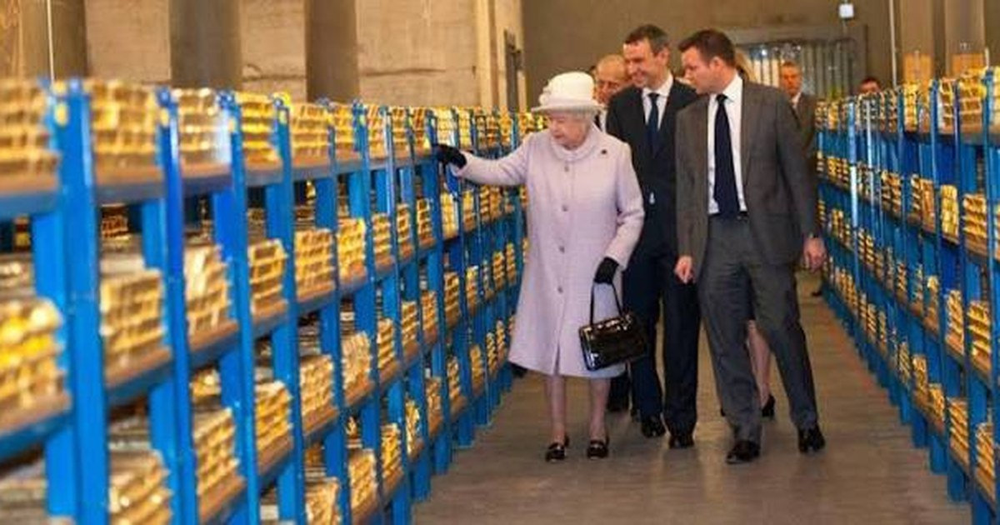

<!--
  HEAD 참조 (렌더링 안 됨 · 빌드 자동 주입 · 주석 풀지 말 것)
  <title>장부의 신화와 실물의 역습 — 야프섬의 돌 화폐에서 러시아 자산 동결까지 · VibeQuant</title>
  <meta name="description" content="화폐는 금괴가 아니라 장부다. 야프섬의 돌이 바닷속에 있어도 거래되듯, 런던·뉴욕 금고의 금도 기록만 바뀐다. 러시아가 그 신뢰를 깨자, 세상은 실물을 되찾기 시작했다.">
  <meta name="robots" content="index,follow">

  
-->

# [칼럼] 장부의 신화와 실물의 역습 - 얌섬의 돌 화폐에서 러시아 자산 동결까지

## 야프섬의 돌 화폐에서 러시아 자산 동결까지, 그리고 한국 금 104톤

*영란은행 금괴 창고. 장부상의 소유권만 바뀌던 금이, 지정학적 위기 앞에서 다시 실물로 움직이기 시작했다.*

**김호광** 싸이월드 전 대표 / 2026년 9월 30일

## 화폐란 무엇인가?

화폐란 무엇인가? 주머니 속의 지폐나 금고 속의 금괴가 가치를 지니는 것은 그 물질 자체가 지닌 내재적 유용성 때문이 아니다. 화폐의 본질은 "누가 무엇을 얼마만큼 소유하고 있는가?"에 대한 사회적 합의, 즉 **'신뢰할 수 있는 장부**(Ledger)에 있다.

경제학자 밀턴 프리드먼은 미크로네시아 야프섬의 '라이 스톤(Rai Stone)' 사례를 통해 이 거대한 장부의 원리를 명쾌하게 짚어냈다. 야프섬 주민들은 수 톤에 달하는 거대한 돌 화폐를 무역 거래 때마다 직접 주고받지 않았다. 심지어 돌 화폐를 운반하다 배가 뒤집혀 바닷속 깊은 곳에 가라앉았음에도, "**바닷속 그 위치에 아무개의 돌 화폐가 존재한다**"는 사실을 마을 구성원들이 인정하고 구전 장부에 기록하는 것만으로 소유권 이전과 경제 거래가 완벽하게 성립했다.

이 야프섬의 돌 화폐 원리는 현대 국제 금융 시스템의 핵심인 영란은행이나 뉴욕 연방준비은행 지하 금고의 작동 방식과 본질적으로 정확히 일치한다. 한국을 비롯한 세계 각국 중앙은행은 거래의 유동성과 안전성을 위해 자국의 금괴를 런던이나 뉴욕 지하 금고에 맡겨둔다. 국가 간 금 거래가 일어날 때 수십 톤의 금괴를 배나 비행기로 실어나르는 대신, 영란은행 금고 깊숙한 곳에서 금괴의 위치는 그대로 둔 채 소유자 표시와 장부상의 기록만 변경하는 방식으로 정산이 이루어진다. 실물 이동 없이 작동하는 장부에 대한 완벽한 '신뢰'가 글로벌 금융을 받쳐온 것이다.

## 대공황의 교훈 - 장부 신뢰가 무너질 때

그러나 이 장부 시스템은 참여자 간의 상호 신뢰가 흔들리는 순간 치명적인 시스템 리스크로 돌변한다. 역사적으로 가장 비극적인 사례가 1930년대 초 대공황이다.

1920년대 후반 프랑스 중앙은행은 달러와 파운드화의 가치 하락을 우려하여 미국 연준 금고에 예치해 둔 자산을 금으로 전환하고 자국 소유로 귀속표시한 뒤 금을 대거 인출했다. 특히 영국이 1931년 9월 금본위제를 포기한 직후 프랑스는 추가로 240억 프랑의 금을 국제 통화 시스템에서 회수하며 디플레이션을 심화시켰다. 프랑스의 독자적인 금 흡수와 통화 중립화 정책은 전 세계적인 금 유동성 고갈을 불렀고, 이는 세계적인 디플레이션 폭풍을 일으키며 1929~1931년 대공황을 결정적으로 촉발하고 심화시켰다.

이후 1933년 미국의 달러 평가절하로 금본위제 잔존국은 프랑스, 벨기에, 네덜란드, 스위스 등 소수에 불과했다. 이들은 '금블록'을 결성하고 금본위제 유지를 재확인했으나, 1935년 벨기에 프랑의 평가절하를 시작으로 프랑스, 네덜란드, 스위스에서 대규모 금 인출이 발생하며 블록은 점진적으로 붕괴했다. 결국 프랑스는 1936년 9월 평가절하를 단행했고 스위스와 네덜란드가 즉시 뒤를 따랐다. **장부상의 금 교환 청구가 실물 금 인출 경쟁으로 변질되자, 국제 통화 시스템 전체가 파국으로 치달은 것이다.**

금 태환 뱅크런이 공황을 촉발한 것이다.

### 닉슨 쇼크(1971) - 태환 장부 신화의 종말

대공황 이후 1944년 브레튼우즈 체제가 수립되며 달러는 온스당 35달러에 금과 교환되었고, 각국 통화는 달러에 고정되었다. 그러나 미국의 베트남 전쟁, 대사회 프로그램 등으로 달러 공급이 금 보유량을 초과하면서 유럽 중앙은행들이 달러를 금으로 교환하기 시작했다. 특히 프랑스 드골 대통령은 군함을 뉴욕에 보내 달러를 금으로 교환하는 강경책을 썼다.

결국 1971년 8월 15일 닉슨 대통령은 달러의 금 태환을 중단했다. **"장부상의 약속을 실물로 이행할 수 없다"고 선언한 것이다.** 이는 브레튼우즈 체제의 붕괴이자, 화폐가 실물 금이 아닌 국가 신용에 기반하는 현대 금융 시스템의 출발점이었다.

## 독일의 금 회수로 인한 신뢰 균열의 첫 신호

수십 년간 영란은행과 뉴욕 연준이라는 '**중앙 집중식 거래 허브**'에 금을 모아두는 트렌드가 지속되어 왔으나, 최근 국제 정세는 '본국 송환과 분산 보관'이라는 거대한 패러다임 전환을 맞이하고 있다.

그 분기점은 독일이었다. 냉전기 소련의 침공을 우려해 독일은 전체 금 보유량의 절반 이상을 뉴욕, 파리, 런던에 예치했다. 그러나 2008년 금융위기와 유로존 재정위기를 거치며 "**왜 독일의 금이 외국 금고에 있어야 하는가?**"라는 의문이 독일 사회에서 확산되었다.

결국 2013년 분데스방크는 뉴욕 연준과 프랑스 중앙은행에 보관 중인 674톤의 금을 본국으로 송환하겠다고 발표했다. 실제로 2013~2017년 사이 뉴욕에서 300톤, 파리에서 374톤을 프랑크푸르트로 옮기며 계획을 예정보다 앞당겨 완료했다. 당시 독일 정부는 "미국을 신뢰하지 않는 것이 아니다"라고 해명했으나, **세계 최대 금 보유국 중 하나가 실물 금을 자국 금고로 옮기는 행위 자체가 '장부 신뢰'의 균열을 상징**했다.

그러나 독일은 여전히 뉴욕에 1,236톤(전체의 37%)의 금을 보관하고 있다. 분데스방크는 뉴욕 연준을 "신뢰할 수 있는 파트너"라고 부르며 추가 송환 계획이 없다고 밝히고 있으나, 독일 내에서는 추가 회수 목소리가 다시 높아지고 있다.

## 러시아 자산 동결로 인한 탈중앙화 흐름의 결정적 촉매

이러한 탈중앙화 흐름에 결정타를 날린 사건은 2022년 러시아-우크라이나 전쟁 직후 발생한 **서방의 러시아 해외 외화보유고 약 3,000억 달러 동결** 조치였다. 이 사건은 전 세계 중앙은행들에게 "타국의 관할권에 보관된 장부상의 자산은 지정학적 위기 시 더 이상 완벽한 주권 자산으로 보호받지 못하며, 언제든 무기화될 수 있다"는 냉혹한 깨달음을 주었다.

러시아 자산 동결은 전 세계 중앙은행에 세 가지 충격을 주었다.

**첫째, '관할권 리스크'의 현실화다.** 타국 관할권에 보관된 장부상 자산은 지정학적 위기 시 완벽한 주권 자산으로 보호받지 못한다는 사실이 입증되었다. 2026년 세계금위원회 조사에 따르면 45%의 중앙은행이 향후 1년 내 금 보유를 확대하겠다고 응답했으며, 나머지도 현 수준을 유지하겠다는 입장을 보였다.

**둘째, 러시아 자신의 '실물 자산' 전환이다.** 동결 이후 러시아 중앙은행은 달러와 유로 의존도를 낮추고 물리적 금과 위안화를 적극 매입했다. 러시아의 금 보유량은 동결 이후 크게 증가했으며, 2026년 7월 기준으로도 일부 매도가 있었으나 여전히 2,277톤의 금을 보유하며 세계 주요 금 보유국 지위를 유지하고 있다.

**셋째, 전 세계적 '금 회수 러시'다.** 2024~2025년 사이 폴란드, 세르비아, 인도, 프랑스 등 수많은 중앙은행들이 앞다투어 해외 예치 금을 자국 금고로 옮기거나 실물 금 보유량을 사상 최대 수준으로 늘리기 시작했다.

인도는 2023년 3월 이후 274톤을 본국으로 송환했으며, 해외 보관 비중을 55%에서 22%로 대폭 축소했다. 프랑스는 2025년 7월부터 2026년 1월 사이 뉴욕 연준에 보관 중이던 모든 금(2,437톤)을 파리로 송환하며, 같은 기간 금 매각과 재매입을 통해 약 130억 유로의 자본 이익을 기록했다. 폴란드는 2025년에만 102톤의 금을 순매수하며 세계 최대 중앙은행 금 매수국이 되었고, 금 보유량을 550톤으로 늘려 전체 외환보유액의 28%를 금으로 채웠다. 2026년 7월 기준 폴란드는 추가로 90톤을 매입하며 금 보유량 640톤을 기록, 700톤 목표에 근접하고 있다.

세계금위원회에 따르면 **2022년 +1,080톤, 2023년 +1,061톤, 2024년 +1,089톤**으로 중앙은행들은 3년 연속 1,000톤 이상의 금을 매입했으며, 2025년에도 863톤의 순매수가 이어졌다. 2026년 상반기에도 중앙은행들의 금 순구매량은 289톤으로 전년 동기 대비 62% 증가하며 역대 2분기 최대 매입량을 기록했다. **2026년 초 기준 전 세계 중앙은행 보유 금의 총 가치는 약 4조 달러를 돌파하며 사상 처음으로 미국 국채 보유액을 추월**했다. 2025년 말 기준 금이 글로벌 공식 준비자산 중 미국 국채를 넘어 제1위 자산으로 등극한 것이다.

## 대한민국 전략 자산의 중요성 - '금 104톤'의 경고

### 대한민국 - 세계 10위 외환보유국, 그러나 금 보유는 39위

한국은행의 금 보유량은 **104.4톤**으로 2013년 2월 20톤 매입 이후 12년째 변동이 없다. 이는 외환보유액(약 4,274억 달러, 세계 10위)의 **약 1.1%**에 불과하며, 세계 중앙은행 중 **39위** 수준이다. 같은 기간 국제 금값은 연초 대비 50% 이상 상승했지만, 한국은행은 금 매입을 중단한 상태였다.

세계금위원회가 추적하는 100개국 중 한국의 금 보유 비중은 98위로, 칠레와 콜롬비아보다만 높은 수준이다.

### 13년 만의 금 투자 재개와 전략적 의미

2026년 8월, 한국은행은 **13년 만에 금 투자 재개**를 공식화했다. 한국은행은 올해 2분기 미국 상장 금 ETF인 SPDR Gold Trust(GLD) 67만 9,765주를 약 2억 5,000만 달러(약 3,500억 원)어치 매입한 것으로 나타났다.

한국은행은 또한 국내에서 생산된 금 실물을 매입하는 방안을 추진하고 있다. 기존에는 해외에서 금을 사서 현지에 보관하는 방식이었으나, 앞으로는 국내 업체인 LS MNM과 고려아연이 만들어 수출하는 금을 매입할 방침이다. 한국거래소도 금 매입 시스템을 구축하며 제도적 기반을 마련했다.

한국은행 외환보유액 중 미 달러화 비율은 69.5%로 전 세계 평균(56.8%)을 크게 상회하고 있다. 이는 자산 쏠림을 해소해야 할 구조적 필요성을 보여준다. 한국은행의 외환보유액 관리 책임자는 "지정학적 리스크가 글로벌 환경에서 지속적으로 존재하는 특징이 되었으며, 다른 국가와 비교해 우리의 금 보유량은 여전히 낮아 보유량을 늘릴 필요가 있다"고 밝혔다.

주목할 점은 **현재 보유한 104.4톤의 금이 모두 영란은행에 보관되어 있다**는 사실이다. 러시아 자산 동결 이후 각국이 본국 송환을 서두르는 상황에서, 한국은 여전히 '장부상 소유권'에 의존하고 있는 것이다.

### 전략 자산으로서 금의 세 가지 가치

**첫째, 지정학적 보험이다.** 한국은 북한 리스크, 미중 패권 경쟁, 대만 해협 긴장 등 지정학적 취약성이 높은 국가다. 러시아 사례에서 확인했듯이, 타국 관할권에 보관된 자산은 위기 시 무기화될 수 있다. **실물 금은 '차단 불가능한 자산'** 으로서 최후의 안전판 역할을 한다. 러시아 전문가들은 "금은 차단될 수 없다"는 점을 러시아 사례의 핵심 교훈으로 꼽는다.

**둘째, 외환보유액 다변화의 핵심이다.** 한국은 외환보유액의 대부분을 미국 국채와 달러화 자산으로 보유하고 있다. 미중 갈등 심화, 미국 재정적자 확대, 달러 신뢰도 변화 가능성 속에서 금은 **특정 국가 신용에 의존하지 않는 유일한 준비자산**이다. 도이체방크는 신흥국 중앙은행들이 준비자산의 40%를 금으로 보유하려는 목표를 유지할 경우, 향후 5년 내 금 가격이 온스당 8,000달러에 도달할 수 있다고 전망했다.

**셋째, '장부의 신화'에서 '실물의 역습'으로의 전환에 대한 대비다.** 글로벌 금융 질서는 장부상 신뢰에서 물리적 실물 확보로 회귀하고 있다. 세계 각국 중앙은행이 금을 본국으로 가져오고 금 매입을 늘리는 것은 **'진짜 가치'가 무엇인지에 대한 글로벌 합의의 변화**를 반영한다. 한국이 이 흐름에서 뒤처질 경우, 유사시 외환 위기 대응 능력과 금융 주권에 심각한 제약이 발생할 수 있다.

## 맺으며, 장부의 신화에서 깨어나 실물의 시대로

바닷속 돌 화폐를 장부상의 승인만으로 유통하던 얌섬의 평화는 지정학적 도발과 불신 앞에서는 유지될 수 없다. 장부에 대한 신뢰가 흔들릴 때 세상은 다시 물리적으로 검증할 수 있는 '진짜 실물 자산'으로 회귀한다.

얌섬의 돌 화폐에서 시작된 '신뢰의 장부'는 대공황, 브레튼우즈 붕괴, 독일의 금 회수, 러시아 자산 동결을 거치며 그 한계를 드러냈다. 오늘날 뉴욕과 런던 지하 금고에서 자국 금고로 금괴를 옮기는 중앙은행들의 은밀한 움직임은, 글로벌 금융 질서가 '장부의 신화'에서 깨어나 냉혹한 탈세계화와 실물 점유의 시대로 진입했음을 보여주는 가장 선명한 징후이다.

**한국의 104톤 금, 외환보유액의 1.1%라는 숫자는 단순한 통계가 아니라 전략적 경고**다. 13년 만의 금 투자 재개는 늦었지만 의미 있는 첫걸음이다. 그러나 여전히 모든 금이 영란은행에 보관되어 있다는 사실은, 한국이 아직 '장부의 신뢰'에 기대고 있음을 보여준다. 글로벌 금융 질서가 실물 점유의 시대로 진입하는 지금, 대한민국도 전략 자산으로서 금의 가치를 재평가하고, 실질적 보유를 확대하며, 전략 국가 자산인 금을 본국 송환을 적극 검토할 때가 되었다.
