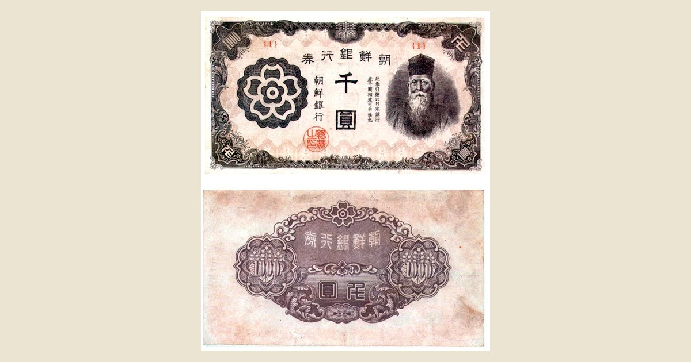

<!--
---
title: "제국은 떠나도 금융은 남는다"
title_en: "Empires Leave — Finance Remains"
subtitle: "광복 직후 조선은행권의 마지막 수탈에서 CFA 프랑, 파운드 스털링까지"
description: "해방 직후 45일 조선은행권 증발·미발행 천원권·하이퍼인플레이션. CFA 프랑·파운드 스털링까지 이어진 식민 통화 종속. 투자·학술 자문 아님(2026-09)."
abstract: |
  Korean macro/history column on colonial monetary domination after independence (Sep 2026).
  Bank of Chosen emergency issuance Aug–Sep 1945; Korean staff blocked unissued 1,000-won notes;
  hyperinflation path to political upheaval; CFA franc and sterling-area parallels.
  Not investment or academic advice.
summary_for_ai: |
  Korean column (not investment advice), 2026-09-19, group macro-geo,
  Key-Currency/Monetary-Domination-Following colonial-Independence.md.
  Thesis: empires keep extracting via currency plumbing after flags fall;
  Korea's 45-day seigniorage plunder, blocked unissued 1000-won, then CFA/sterling cases;
  monetary pain often precedes coups.
date: 2026-09-19
updated: 2026-09-19
author: "김호광 (Dennis Kim)"
lang: ko
tags:
  - 조선은행
  - 기축통화
  - 식민지
  - CFA프랑
  - 파운드
  - 화폐사
  - 광복
  - 하이퍼인플레이션
keywords:
  - "조선은행권"
  - "미발행 천원권"
  - "식민지 통화"
  - "CFA 프랑"
  - "파운드 스털링"
  - "발권 차익"
  - "해방 인플레이션"
  - "통화 주권"
group: macro-geo
featured: true
featured_rank: -12
og_image: "https://vibequant.cc/og/monetary-domination-colonial-independence.jpg"
image: "https://vibequant.cc/og/monetary-domination-colonial-independence.jpg"
schema_type: BlogPosting
draft: false
robots: index,follow
---
-->

# 제국은 떠나도 금융은 남는다

### — 광복 직후 조선은행권의 마지막 수탈에서 CFA 프랑, 파운드 스털링까지

글: 김호광 (Dennis Kim), 싸이월드 前대표

## 1. 들어가며 - 금융은 무력보다 오래 남는다

1945년 8월 15일, 정오의 항복 방송이 끝나자 조선에 살던 약 71만 명의 일본인들은 은행으로 몰려갔다.[[1]](#ref-1) 정치적 해방은 선언되었지만 금융의 해방은 시작되지도 않았다. 조선은행을 비롯한 주요 금융기관은 9월 말에서 10월에 이르러서야 미군정의 통제 아래 들어갔고,[[2]](#ref-2) 그 사이 약 45일 동안 조선의 발권은행은 여전히 일본인의 손에 있었다.

그 45일 동안 조선은행권 발행고는 광복 직전 약 48–50억 원에서 8월 말 79.9억 원, 9월 말 86.8억 원으로 불어났다.[[3]](#ref-3) 불과 한 달 반 만에 통화량이 거의 두 배가 된 것이다. 이 돈은 전쟁 물자를 사기 위해서도, 조선인의 생계를 위해서도 아니었다. 패전국 국민의 '퇴각 자금'이었다.

이 글은 먼저 일제가 식민지 조선에서 금융과 발권을 통해 수탈 구조를 어떻게 완성했는지, 해방 직후 그 구조를 이용해 마지막 경제적 수탈을 어떻게 감행했는지, 그리고 그 후유증이 5·16 군사 쿠데타에 이르는 한국 현대사에 어떤 토양을 남겼는지 살펴본다. 이어 같은 구조가 다른 제국에서는 어떻게 재현되었는지를 비교한다. 프랑스의 CFA 프랑 지역에서는 통화 종속과 경제 정체가 2020년대 '쿠데타 벨트'로 이어졌고, 대영제국은 파운드 스털링과 런던 금융망을 통해 식민지를 떠난 뒤에도 영향력을 유지했다.

한국 독자에게 멀게만 느껴질 아프리카와 인도의 이야기를 함께 읽어야 하는 이유는 간단하다. **우리가 겪은 일이 한국만의 불운이 아니라 식민지 통화 체제의 보편적 결말이었음을 확인할 수 있기 때문이다.** 해방 직후의 하이퍼인플레이션, 원조에 기댄 재정, 반토막 난 환율, 그리고 '민생'을 내건 군사 쿠데타. 이 장면들은 60년의 시차를 두고 사헬에서 거의 그대로 되풀이되고 있다. 그래서 이 글은 각 장 끝에 **"이 구조는 다른 제국에서 어떻게 재현되었나"**를 짧게 짚어, 조선은행의 이야기와 다른 제국의 이야기를 하나의 흐름으로 잇고자 한다.

세 제국의 방식은 달랐지만 결론은 같았다. **제국은 깃발을 내린 뒤에도, 통화와 금융의 배관을 통해 옛 식민지의 부를 계속 빨아들일 수 있다. 그리고 통화 주권을 잃은 사회의 경제적 고통은 종종 군사 쿠데타라는 정치적 격변으로 폭발한다.**

## 2. 식민지 조선의 금융 구조 - 엔 블록의 하위 부품

### 2-1. 조선은행 — '중앙은행'이자 대륙 침략의 첨병

일제는 1909년 (구)한국은행을 설립하고, 강점 직후인 1911년 「조선은행법」을 공포해 이를 조선은행으로 개편했다. 조선은행은 조선의 발권을 독점한 식민지 중앙은행이었지만, 동시에 일반 은행 업무를 겸하며 만주와 중국 대륙으로 진출한 '해외은행'이기도 했다.[[4]](#ref-4)

조선은행권의 발권 제도는 처음부터 종속을 전제로 설계되었다. 발행준비로 금·은뿐 아니라 **일본은행권**을 인정했기 때문에, 조선은행권은 형식상 태환지폐였지만 실질적으로는 엔화에 매달린 파생 통화였다. 일본은행권이 전시에 법적으로 불환지폐가 되자, 조선은행권 앞면의 태환 문구에서 '금화'라는 단어가 빠졌다.[[5]](#ref-5) 조선은행권은 이제 금이 아니라 '역시 금과 바꿀 수 없게 된 일본은행권'과만 교환되는, 이중으로 종속된 지폐가 된 것이다. 조선인이 가진 화폐의 가치는 전적으로 제국의 전쟁 재정에 달리게 되었다.

통제권도 도쿄에 있었다. 조선은행이 만주·일본에서 발생한 부실채권을 처리하지 못하자 일본 정부는 1924년 조선은행법을 개정해 **감독권 일체를 대장성(大藏省)으로 이관**했다. 이후 총재·부총재는 본토 인사가 낙하산으로 임명되었고, 조선은행의 기준금리는 일본은행 금리를 따라 움직였다.[[6]](#ref-6) 조선의 통화정책은 조선의 경제 상황이 아니라 제국의 필요에 따라 결정되었다.

### 2-2. 조선식산은행과 금융조합 — 농촌까지 뻗은 흡혈 구조

1918년 설립된 조선식산은행은 조선 내 산업금융과 정부 자금 공급을 담당하며 사실상 국내 중앙은행 역할을 수행했다. 금융 체계는 **조선은행 → 조선식산은행 → 도(道) 금융조합연합회 → 금융조합**으로 이어지는 위계를 갖추었고, 그 말단은 조선 농민에게 고리대 조직으로 군림했다는 평가를 받는다.[[7]](#ref-7)

1937년 중일전쟁 이후 이 체계는 전쟁 경제의 착취 펌프로 변했다. 발행 한도가 확대되고 정화준비 원칙이 사실상 무력화되면서 조선은행권은 관리통화로 변질되었고, 조선식산은행은 일본 국채를 인수하고 군수산업에 자금을 대는 통로가 되었다.[[8]](#ref-8) 전쟁 말기 조선은행권은 인쇄 도수를 줄이고 일련번호조차 없는 조악한 지폐로 전락했다.[[5]](#ref-5)

화폐 컬렉터 입장에서 태평양 전쟁 말기의 '조선은행'권은 식민지 비극을 보여주는 생생한 스냅샷과 같다. 통제받지 않은 민간에 지폐 원판이 돌아다니고 일련번호와 최소한의 종이의 품질과 위조방지 대책도 생략되었고 오직 찍어 식민지의 남은 부를 수탈하기 위한 수단이었기 때문이다.

### 2-3. 패전 5개월 전 - 이미 준비된 '비상 발권'

주목할 것은 발권 확대가 패전 이후의 즉흥적 대응이 아니었다는 점이다. 1945년 3월경 조선은행은 **대장성·일본은행과 협의하여** 조선은행권을 조선 내에서 인쇄하는 체제를 추진했다. 그때까지 조선은행권은 도쿄의 내각 인쇄국에서 찍어 시나가와–시모노세키–부산–경성의 긴 경로로 운송되었는데, 미군의 해상 봉쇄로 이 경로가 끊길 위험이 커졌기 때문이다.[[2]](#ref-2)

조선 내 인쇄를 전담한 조선은행 부총재 호시노 기요지(星野喜代治)는 광복 전에 **1,000원권 70억 원, 100원권 21억 원**을 미리 찍어 두었다.[[2]](#ref-2) 같은 시기 조선총독부 재무국장 미즈타 나오마사(水田直昌)는 원래 소각해야 할 헌 지폐 약 35억 원을 비축해 두고, 전국 어디든 6시간 안에 현금이 배달되도록 예행연습까지 마쳤다.[[2]](#ref-2) 패전을 앞둔 식민 금융 당국은 이미 '현금 철수 작전'을 준비하고 있었던 것이다. 식민지 중앙은행의 발권력 자체를, 떠나는 제국민의 퇴각 자금 창구로 쓸 준비를 마친 셈이다.

> **다른 제국에서는** — '본국 통화를 준비금으로 삼는 식민지 통화'라는 조선은행권의 설계는 조선만의 것이 아니었다. 같은 시기 영국은 서아프리카 파운드를 100% 파운드 스털링 준비금에 묶었고(7장), 1945년 12월 프랑스는 같은 원리로 CFA 프랑을 만들었다(6장). 차이는 이 끈이 언제, 어떻게 끊어졌느냐에 있었다.

## 3. 해방 후 45일 - 발권은행을 이용한 퇴각 자금 작전

### 3-1. 세 가지 퇴각 수단

광복과 동시에 이 준비는 실행에 옮겨졌다. 당시 조선은행의 한 한국인 행원의 회고에 따르면, 조선은행은 "일본 금융기관으로서의 최후를 장식"하겠다는 결의 아래 세 가지 수단을 동시에 가동했다.[[2]](#ref-2)

1. **발권은행으로서** — 100원권을 비밀리에 인쇄했다. 일본인들이 운영하던 근택(近澤)인쇄소에서 8월 하순부터 비밀 인쇄가 진행되었고, 허술한 원판 관리는 이후 위조지폐 범람의 한 배경이 되었다.[[2]](#ref-2)[[9]](#ref-9) 여기에 더해 일본 본토에서 일본은행권과 조선은행권이 **항공편으로 공수**되었다.[[2]](#ref-2)
2. **국고은행으로서** — 조선군과 총독부에 국고금을 초과 지급했다.
3. **은행의 은행으로서** — 미즈타 재무국장은 전시 법령인 「은행 등 자금 운용령」까지 발동해 조선식산은행과 조선은행에 일본인 기업에 대한 **융자 명령**을 내렸다.[[2]](#ref-2)

반면 조선인 은행 직원들은 1,000원권 70억 원의 유통만큼은 막아냈다.[[2]](#ref-2)[[10]](#ref-10) 이 고액권마저 풀렸다면 통화량은 한 번 더 두 배 가까이 늘었을 것이고, 해방 조선의 인플레이션은 훨씬 참혹했을 것이다. 떠나는 일본인 간부들에 맞서, 해방될 조국의 화폐 가치를 지켜낸 것은 이름이 잘 알려지지 않은 조선인 행원들이었다.

### 3-2. 숫자로 본 '종전 청산 자금'

조선은행이 대장성에 제출한 자료와 미즈타의 회고를 종합하면, 1945년 8월 15일부터 9월 말까지의 조선은행권 증발액과 용도는 다음과 같다.[[2]](#ref-2)

| 구분 | 조선은행→대장성 제출 자료 | 미즈타 회고 |
| --- | --- | --- |
| 조선은행권 증발액 | 38.41억 원 | 38.19억 원 |
| 예금 인출 초과액 | 25.00억 원 | 19.20억 원 |
| └ 이 중 일본 송금 환류액 | (−7.00억 원) | — |
| 국고금 지불 초과액 | 14.00억 원 | 11.80억 원 |
| └ 군 관계 / 총독부 | 8.00억 / 6.00억 원 | — |
| 신규 대출액 | 2.50억 원 | 2.50억 원 |
| 관동주 발행 초과액 | 3.20억 원 | 3.20억 원 |

*출처: 朝鮮銀行史硏究會 編, 『朝鮮銀行史』(東洋經濟新報社, 1987), p.736 — 우리역사넷 재인용*

이 돈의 상당 부분은 퇴각 자금 외의 용도로도 흘러갔다. 미즈타는 일반 예금자에게 인출 자제를 호소하면서도, 8월 17일 정무총감과 경무국에 500만 원의 기밀비를 지출했다. 이는 당시 광산 노동자 약 6만 2,500명의 한 달 치 급료에 해당하는 금액이었다.[[2]](#ref-2) 1947년 3월 조사에 따르면 금융기관이 일본계 기업에 빌려주고 회수하지 못한 채 고정된 대출금만 25억 4,000만 원에 달했다.[[2]](#ref-2)

### 3-3. 찍어낸 돈은 어떻게 '물건'이 되었나?

여기서 한 가지 의문이 생긴다. 미군정은 귀환하는 일본 민간인의 현금 휴대를 **1인당 1,000엔**으로 제한했고 수하물 중량도 제한했다.[[1]](#ref-1)[[11]](#ref-11) 그렇다면 새로 찍은 수십억 원은 어떻게 '반출'되었는가?

경로는 세 갈래였다. 첫째, **송금**이다. 앞의 표에서 보듯 최소 7억 원이 일본으로 송금되었다. 둘째, **현물 전환과 밀반출**이다. 조선은행권 자체는 일본에서 쓸모가 없지만, 그 돈으로 사들인 금붙이, 골동품, 서화, 도자기, 각종 물자는 가치를 유지한다. 공식 송환 조건을 거부한 일부 일본인들은 부산 이외의 항구에서 밀항을 시도했고, 귀환 전 생산 시설을 해체해 방매하거나 브로커를 통해 재산을 밀반출했다.[[11]](#ref-11) 셋째, **문화재 반출**이다. 남선전기 사장 오구라 다케노스케(小倉武之助)는 광복 후 670여 점의 유물을 미군에 압수당했지만, 그보다 더 많은 유물을 일본으로 가져가는 데 성공한 것으로 보인다.[[12]](#ref-12) 그의 수집품은 훗날 '오구라 컬렉션'이라는 이름으로 도쿄국립박물관에 기증되었다.

경제학적으로 이것은 **발권 차익(seigniorage)을 이용한 수탈**이다. 새로 찍은 화폐로 조선 안의 실물 자산을 사들이면, 그 비용은 화폐 가치 하락, 즉 인플레이션의 형태로 조선에 남은 모든 사람에게 전가된다. 일본인들은 총을 내려놓은 뒤에도 인쇄기로 마지막 세금을 걷어간 셈이다.

> **다른 제국에서는** — 일본은 패전과 함께 발권은행을 잃었기에 45일 안에 한꺼번에 가져가야 했다. 반면 프랑스와 영국은 식민지를 떠난 뒤에도 준비금과 환율을 쥐고 있었기에, 서두를 필요가 없었다. 조선의 수탈이 '급성'이었다면, CFA 프랑 지역과 파운드 지역의 수탈은 수십 년에 걸친 '만성'이었다.

> **사실 관계 메모** — 발권 확대를 지휘한 것은 조선총독부 재무국(미즈타)과 조선은행 수뇌부(호시노)였으며, 조선은행은 1924년 이후 대장성의 감독을 받았고 1945년 3월 조선 내 인쇄 체제를 대장성·일본은행과 협의해 구축했다. 광복 후 일본 본토에서 은행권이 공수되었다는 점도 확인된다. 다만 '대장성이 광복 후 발권을 직접 명령했다'는 단일 문서는 공개 자료로 확인되지 않으므로, 본문에서는 "대장성–총독부 재무국–조선은행으로 이어진 식민 금융 당국의 조직적 작전"으로 서술했다.

## 4. 하이퍼인플레이션 - 원인을 몰랐던 고통

### 4-1. 역사상 가장 가파른 물가 폭등

결과는 즉각적이었다. 1945년 6월 말에서 8월 사이 서울 소매물가지수는 **13배**로 치솟아 한국 역사상 단기간 최고 상승률을 기록했다.[[3]](#ref-3) 1945년 한 해 서울 소비자물가 상승률은 **3,146%**, 이후에도 1946년 121%, 1947년 152%로 살인적인 상승이 이어졌다.[[13]](#ref-13)

물론 통화 증발만이 원인은 아니었다. 일제의 물가 통제 기구가 붕괴했고, 일본과의 경제적 단절과 남북 분단으로 생산이 중단되거나 위축되어 물자 공급이 급감했다.[[3]](#ref-3) 그러나 공급 충격은 통화 팽창이라는 연료를 만나 폭발했다. 통화 팽창이 상대적으로 억제되었던 북한 지역과 비교하면, 남한 경제 파탄의 상당 부분이 통화 팽창에 기인했음이 드러난다.[[14]](#ref-14)

### 4-2. 미군정이 이어받은 '윤전기'

더 뼈아픈 것은 이 구조가 미군정기에도 이어졌다는 점이다. 호시노는 미군정의 군표(軍票) 발행 계획을 혼란만 준다며 반대하고, 필요하면 조선은행권을 찍으라고 권유했다. 이후 은행권 남발을 통한 미군정의 재정 자금 확보가 일상화되었다.[[2]](#ref-2) 떠나는 일본인이 남긴 조언이 해방 조선의 통화정책이 된 것이다. 새 권력은 윤전기를 멈추는 대신, 그 윤전기를 물려받았다.

### 4-3. 사람들은 왜 몰랐나?

당시 대중이 체감한 것은 쌀값과 연탄값이었지, 조선은행 대차대조표가 아니었다. 물가 폭등의 책임은 흔히 모리배·간상배 같은 투기꾼, 그리고 1946년 정판사 위조지폐 사건 같은 사건에 돌려졌다. 공교롭게도 정판사가 들어선 건물은 바로 일본인들이 광복 직후 비밀 인쇄를 하던 근택인쇄소가 있던 곳이었다.[[9]](#ref-9) 발권은행 자체가 퇴각 자금 공급 장치로 쓰였다는 사실은, 『조선은행사』(1987)와 정병욱의 『한국근대금융연구』(2004) 등 후대의 연구를 통해서야 체계적으로 밝혀졌다.[[2]](#ref-2)

> **다른 제국에서는** — 식민지의 발권으로 제국의 비용을 치르고, 그 대가를 식민지의 물가로 돌려받는 구조는 인도에서도 나타났다. 제2차 세계대전 중 영국의 전쟁 비용을 대기 위해 찍어낸 루피는 1943년 벵골 대기근의 배경이 되었다(7장). 조선인이 해방 인플레이션의 원인을 몰랐듯, 벵골의 농민들도 쌀값 폭등의 원인이 런던의 장부에 있다는 것을 알 수 없었다.

## 5. 전쟁, 원조, 그리고 5·16으로 이어지는 토양

### 5-1. 전쟁 인플레이션과 '원조 경제'

해방 인플레이션은 1948–1949년에 다소 진정되는 듯했지만(도매물가 상승률 1948년 63%, 1949년 36.8%), 1950년 6·25 전쟁이 모든 것을 되돌렸다. 서울 도매물가는 1950년 56%, **1951년 531%**, 1952년 117% 올랐다.[[13]](#ref-13) 해방부터 휴전까지(1945–1953) 서울 도매물가의 연간 상승률은 가장 낮은 해에도 25%였다.[[54]](#ref-54) 1950년 6월 12일 한국은행이 창립되며 형식적인 통화 주권은 회복되었지만, 전쟁 재정은 다시 발권에 의존했다.

휴전 후 물가를 잡은 것은 한국 스스로의 통화정책이 아니라 미국 원조였다. 대규모 원조 물자가 들어오면서 1956년부터 물가 상승이 억제되기 시작했고 1958년 무렵 안정되었다.[[15]](#ref-15) 문제는 이 안정의 구조였다. 원조 물자를 판 대금인 **대충자금(對充資金)이 정부 일반 재정 세입에서 차지하는 비중은 1957년 54.1%, 1958년 54.0%, 1959년 42.1%**에 달했다.[[37]](#ref-37) 원조는 국민총생산의 13–14%에 달했고,[[51]](#ref-51) 국가 예산의 절반이 외국 원조에서 나왔으며, 그 운용에 대한 감독권도 미국이 쥐고 있었다. 형식상 발권은 한국은행이 했지만, 물가와 재정의 실질적인 결정권은 미국 워싱턴에 있었던 셈이다. 이 점에서 1950년대 한국은 뒤에서 볼 CFA 프랑 지역과 닮은 '외부 의존형 안정'의 상태였다.

### 5-2. 원조의 썰물과 경제의 정체 (1957–1961)

그 닻이 흔들리기 시작한 것은 1957년이다. 미국은 국제수지 적자에 대응해 대외 원조를 무상 증여에서 유상 차관 중심으로 바꾸기 시작했다.[[16]](#ref-16) 대한 원조는 **1957년 3억 8,300만 달러로 정점**을 찍은 뒤 줄어들어 **1960년에는 2억 4,500만 달러**로 약 36% 감소했다.[[38]](#ref-38)

| 지표 | 수치 | 의미 |
| --- | --- | --- |
| 전쟁기 물가 | 1945–1953년 서울 도매물가 연 25%–531% | 해방·전쟁 인플레이션의 진폭 |
| 1950년대 물가 | 연평균 약 22% | 은행 대출 실질금리 마이너스 |
| 대한 원조 | 1957년 3.83억 달러 → 1960년 2.45억 달러 | 3년 만에 약 36% 감소 |
| 원조 의존도 | 국민총생산의 13–14%, 재정의 약 50% | 경제의 닻이 워싱턴에 |
| 정부 세입 중 대충자금 비중 | 1957년 54.1% → 1959년 42.1% | 원조 감소가 곧 재정 위기 |
| 환율 | 1961년 2월 1달러당 650환 → 1,300환 | 환화 가치 반토막 |
| 실업률 | 1960년대 초 약 8% | 도시 실업과 농촌 잠재실업 누적 |
| 1인당 국민소득 | 1962년 100달러 미만 | 대만(약 300달러)의 3분의 1 수준 |

*출처: KDI[[54]](#ref-54), 김일영 외 재인용[[50]](#ref-50), 대통령기록관[[38]](#ref-38), 이휘현(2021)[[37]](#ref-37), 조선대 강의자료[[51]](#ref-51), 인천투데이[[52]](#ref-52), KDI 경제교육·정보센터[[39]](#ref-39), 우리역사넷[[18]](#ref-18)*

1950년대 내내 물가는 연평균 22% 안팎으로 올랐고, 은행 대출의 실질금리는 마이너스였다.[[50]](#ref-50) 싼 돈을 차지하려는 경쟁은 원조 물자와 귀속재산 배분을 둘러싼 정경유착으로 이어졌다. 원조가 줄자 원료난으로 공장 가동률이 떨어지고 도시 실업자가 급증했으며, 저곡가 정책과 조세 부담에 짓눌린 농민들은 빚을 지고 농촌을 떠났다. 이농민과 월남민이 도시로 몰려들며 실업은 더 깊어졌다.[[51]](#ref-51)

1962년 정부가 스스로 정리한 제1차 경제개발 5개년 계획의 배경 진단에서도, 휴전 이후 연평균 4.7%로 성장하던 경제가 **1957년 이후 성장률이 저하되고 인플레이션이 만연**했다고 적고 있다.[[17]](#ref-17) 1962년 한국의 1인당 국민소득은 100달러에도 미치지 못해, 약 300달러였던 대만의 3분의 1 수준이었다.[[18]](#ref-18) 1960년대 초 실업률은 8% 안팎이었다.[[39]](#ref-39)

### 5-3. 경제적 토양에서 정치적 격변으로

경제의 닻이 흔들리자 정치가 먼저 무너졌다. 1960년 3·15 부정선거와 4·19 혁명으로 이승만 정부가 물러났고, 새로 들어선 장면 정부는 '경제 제일주의'를 내걸고 경제개발계획 수립과 국토건설사업에 나섰다.[[18]](#ref-18)

그러나 장면 정부가 물려받은 것은 바닥난 원조 경제였다. 1960년 가을부터 1961년 봄 사이 달러 대비 환화 가치는 절반으로 떨어졌고, 실업률과 물가는 계속 올랐다. 정부는 1961년 2월 환율을 1달러당 650환에서 1,300환으로 두 배 올리는 급진적 환율 개혁을 단행했다.[[52]](#ref-52) 같은 달 8일 체결된 한미경제기술원조협정은 원조 자금 운용에 대한 미국의 감독권을 넓혔고, 이것이 '주권 침해'라는 반발을 불러 학생과 혁신계의 격렬한 반대 시위로 이어졌다.[[53]](#ref-53)[[37]](#ref-37) 집권 민주당은 같은 달 구파가 이탈해 신민당을 만들며 둘로 쪼개졌고, 3월에는 반공법과 데모규제법을 둘러싼 저항이 거세졌다.[[53]](#ref-53)

**환율 반토막, 원조 조건을 둘러싼 주권 논란, 집권 세력의 분열.** 이 세 장면은 뒤에서 볼 1994년 CFA 프랑 평가절하와 사헬의 반프랑스 시위에서 거의 그대로 되풀이된다. 그리고 1961년 5월 16일, 장면 정부는 집권 9개월 만에 군사 쿠데타로 무너졌다. 전쟁을 거치며 거대하게 성장한 군은 당시 한국 사회에서 가장 조직화된 집단이었다.

쿠데타 세력의 혁명공약은 "**기아선상에서 허덕이는 민생고**"의 시급한 해결과 "**국가 자주경제 재건**"을 핵심 명분으로 내세웠다. **민생고와 경제 자립**이라는 두 단어가 쿠데타의 정당성을 떠받친 것이다.

5·16의 원인을 해방 직후의 금융 수탈 하나로 설명할 수는 없다. 분단, 전쟁, 원조 의존, 부패, 정치 불안, 비대해진 군부라는 여러 층위가 얽혀 있다. 그러나 흐름은 분명하다. **해방 직후의 통화 증발 → 전쟁 인플레이션 → 원조에 기댄 불안한 안정 → 원조 감소와 경기 침체 → 민생고를 명분으로 한 군사 쿠데타.** 약 15년에 걸친 화폐 가치 붕괴와 경제 주권의 부재는, 경제 재건을 내건 군사 정권이 뿌리내릴 수 있는 사회경제적 토양이 되었다. 식민 금융의 마지막 수탈은 해방 한국의 첫 단추를 비틀어 놓았다.

> **다른 제국에서는** — '외부에 묶인 통화와 재정 → 경제 정체와 민생고 → 주권을 외치는 군사 쿠데타'라는 경로는 한국에서 끝나지 않았다. 2020년대 CFA 프랑을 쓰는 사헬 국가들에서 똑같은 경로가 되풀이되었다. 1961년 한국의 명분이 "민생고 해결과 자주경제"였다면, 2023년 니제르의 명분은 "통화는 주권의 상징"이었다(6-5).

## 6. CFA 프랑 - 식민지 통화 체제의 또 다른 얼굴

### 6-1. 탄생과 구조

조선은행 발권 체제와 닮은 구조가 아프리카에서는 식민지 해방 이후에도 수십 년간 작동했다. CFA 프랑은 1945년 12월, 프랑스 정부가 브레턴우즈 협정을 비준하면서 '아프리카 프랑스 식민지(Colonies françaises d'Afrique)'의 통화로 창설되었다.[[19]](#ref-19) 공교롭게도 조선은행권이 일본인의 퇴각 자금으로 남발되던 바로 그해 말이다.

체제의 핵심은 네 가지였다.[[19]](#ref-19)[[20]](#ref-20)

- **준비금 집중**: 서아프리카중앙은행(BCEAO)과 중부아프리카국가은행(BEAC)은 프랑스 재무부의 '운영 계정(compte d'opérations)'에 외환보유액을 예치해야 했다. 예치 비율은 창설 당시 100%, 1973년 65%, 2005년(서아프리카) 50%로 조정되었다.
- **고정환율**: 처음에는 프랑스 프랑, 이후 유로에 고정되어 회원국은 독자적인 환율·통화정책을 펼 수 없었다.
- **프랑스 재무부의 태환 보증**: 그 대가로 프랑스가 무제한 태환을 보증했다.
- **통화 기구 참여**: 프랑스 대표가 두 중앙은행의 이사회 등에 참여해 영향력을 행사했다.

프랑스는 예치금에 이자를 지급했으므로 "**아무 대가 없이 가져갔다**"는 흔한 주장은 정확하지 않다. 그러나 비판론자들은 외환보유액을 자국 개발에 쓰지 못하게 한 기회비용, 그리고 무엇보다 **통화 주권의 박탈**이라는 구조적 문제를 지적해 왔다. 세네갈 경제학자 은동고 삼바 실라(Ndongo Samba Sylla)는 이 체제를 "프랑스의 통화 제국주의"로 규정했다.[[21]](#ref-21)

### 6-2. 1994년 평가절하 - 파리와 워싱턴이 결정한 아프리카의 운명

통화 종속이 무엇을 의미하는지 가장 극적으로 보여준 사건은 1994년 평가절하다. 1994년 1월 11–12일 세네갈 다카르에 모인 프랑 지역 14개국은 CFA 프랑의 가치를 1프랑스프랑당 50 CFA에서 100 CFA로, 즉 **절반으로 평가절하**하기로 결정했다. 형식상 아프리카 국가들의 결정이었지만, 국제통화기금(IMF)은 이 조정을 원조의 조건으로 걸었다.[[40]](#ref-40) 그보다 앞서 프랑스 발라뒤르 총리는 IMF와 합의하지 않는 나라에는 지원하지 않겠다는 방침을 밝혀 두었고, 결정은 프랑스의 보증에 의존해 온 아프리카 지도층에게 충격으로 다가왔다.[[41]](#ref-41) 불과 한 달 전 프랑스 협력장관은 평가절하는 없다고 공언했었다.[[19]](#ref-19)

결과는 참혹했다. 회원국 정부는 임금 동결과 해고에 나섰고, 생필품을 구하지 못한 시민들의 소요가 광범위하게 번졌다.[[19]](#ref-19) 한 달 뒤인 2월 16일 다카르에서는 폭동이 일어나 경찰관과 민간인이 숨졌다.[[42]](#ref-42) 서명은 다카르에서 했지만, 그 결정의 무게중심은 아프리카가 아니었다. 1961년 2월 한국의 환화가 하룻밤 새 반토막 나고 원조 조건이 '주권 침해' 논란을 불렀던 장면과 겹쳐 보이는 대목이다.

### 6-3. 경제 종속 - 통신·금융·물류

통화 체제는 산업 구조와 맞물렸다. CFA 프랑 지역은 역내 교역 비중이 낮고, 소수 1차 산품 수출에 의존하며, 산업 기반이 좁고, 외부 충격에 취약하다는 평가를 받아왔다.[[19]](#ref-19) 태환 보증과 고정환율은 프랑스 기업의 송금과 투자 회수를 손쉽게 만들었고, 그 결과 통신(오렌지 등), 은행, 항만·물류(볼로레 그룹의 아프리카 물류 사업은 2022년 MSC에 매각) 같은 기간 산업에서 프랑스 자본의 존재감이 오랫동안 유지되었다. 이른바 '프랑사프리크(Françafrique)'의 경제적 뼈대다.

### 6-4. 개혁 — 무엇이 바뀌었고 무엇이 남았나?

2019년 12월 21일 아비장에서 마크롱 대통령과 우아타라 코트디부아르 대통령은 서아프리카 CFA 프랑 개혁을 발표했고, 프랑스 의회는 2020년 5월 관련 법을 통과시켰다. 이 개혁으로 **서아프리카 CFA 프랑(XOF) 지역의 준비금 50% 예치 의무가 폐지**되었고, 프랑스는 약 50억 유로를 BCEAO로 돌려보내기 시작했다.[[20]](#ref-20) 프랑스 대표도 통화 기구에서 철수했다.

그러나 **유로 고정환율과 프랑스 재무부의 태환 보증은 유지**되었다. 또한 개혁은 서아프리카에만 적용되었고, 카메룬·차드 등 6개국이 쓰는 **중부아프리카 CFA 프랑(XAF)에는 50% 예치 규정이 여전히 남아 있다**.[[20]](#ref-20) 한편 "프랑스가 여전히 사헬 국가 외환보유액의 50%를 쥐고 있다"는 주장은 이미 폐지된 제도를 현재형으로 말하는 **오해의 소지가 있는 주장**으로 팩트체크되었다.[[20]](#ref-20) 반식민주의의 정당한 문제의식이 부정확한 정보로 오염되면, 오히려 진짜 구조적 문제에 대한 논의가 흐려질 수 있다.

### 6-5. 쿠데타 벨트 - 사헬판 '5·16'들

2020년 이후 아프리카에서는 9차례의 쿠데타가 성공했고, 그 대부분이 '사헬 쿠데타 벨트'로 불리는 프랑스어권 국가들에 집중되었다.[[43]](#ref-43) 말리(2020, 2021), 차드(2021), 부르키나파소(2022년 1월, 9월), 니제르(2023), 가봉(2023)은 모두 CFA 프랑을 쓰는 나라다. (같은 시기 쿠데타가 일어난 기니는 옛 프랑스 식민지지만 1960년 CFA 프랑에서 이탈해 독자 통화를 쓴다.)

이 나라들의 공통 조건은 1950년대 말 한국과 놀라울 만큼 닮았다. 가봉을 제외한 모두가 유엔 최빈국이며, 코로나 이후의 더딘 회복, 기후 충격, 식량 불안, 경제 정체, 약한 거버넌스를 함께 겪고 있었다.[[43]](#ref-43) 사헬은 전 세계 테러 사망자의 43%가 발생하는 지역이 되었고, 만연한 부패와 극심한 빈곤, 광범위한 실업, 그리고 서방 파트너가 안정을 가져오지 못한다는 인식이 친서방 정부에 대한 민심 이반과 쿠데타 지지로 이어졌다.[[44]](#ref-44) 여기에 한국에는 없었던 요소가 더해졌다. **반(反)프랑스 정서**다. 말리·니제르·부르키나파소의 군부는 청년층의 반식민·반프랑스 정서를 동원해 지지 기반을 다졌고, 러시아는 반서방 정서를 부추기며 군사정권을 보호하는 친위대 역할을 자처했다.[[43]](#ref-43)

쿠데타 이후의 행보도 '주권 회복'이라는 한 방향을 가리킨다. 말리는 프랑스와의 군사 협력을 끊고 러시아 군사 조직으로 대체했으며, 니제르는 프랑스·캐나다 기업의 광업 허가를 취소했고, 부르키나파소는 주요 광산 두 곳을 국유화했다.[[45]](#ref-45) 부르키나파소의 트라오레 대위는 "우리를 노예 상태에 묶어 두는 모든 끈을 끊겠다"고 했고, 니제르의 치아니 장군은 "통화는 주권의 상징"이라며 프랑스의 '돈줄' 노릇을 더는 용납하지 않겠다고 선언했다.[[46]](#ref-46)

한국의 5·16과 사헬의 쿠데타를 나란히 놓으면 공통된 논리가 보인다.

| 구분 | 한국 5·16 쿠테타 (1961) | 사헬 쿠데타 벨트 (2020–2023) |
| --- | --- | --- |
| 통화·재정 구조 | 세입의 절반을 미국 원조(대충자금)에 의존 | 유로 고정환율·프랑스 보증에 묶인 CFA 프랑 |
| 경제 상황 | 원조 감소, 성장 정체, 실업률 약 8% | 최빈국, 1차 산품 의존, 청년 실업, 식량 불안 |
| 통화 충격 | 1961년 환율 650→1,300환 (환화 반토막) | 1994년 CFA 프랑 50% 평가절하, 현재도 과대평가 논란 |
| 외부 조건과 주권 논란 | 한미경제기술원조협정 '주권 침해' 반발 시위 | IMF 조건부 평가절하, 반프랑스 시위 |
| 안보 상황 | 전쟁으로 비대해진 군 | 지하디스트 확산, 테러 사망자의 43% |
| 쿠데타 명분 | "민생고 해결", "자주경제 재건" | "주권 회복", "프랑스의 돈줄 탈피" |
| 이후 경로 | 경제개발계획, 권위주의 체제 | 프랑스군 철수, 러시아 접근, 자원 국유화 |

다만 결정적인 차이도 있다. **한국의 문제는 통화가 너무 약했던 것(하이퍼인플레이션)이었고, CFA 지역의 문제는 통화가 너무 경직된 것(과대평가된 고정환율)이었다.** CFA 프랑은 오히려 이웃 나라보다 물가를 낮게 유지해 왔다. 그러나 환율 조정권이 없는 나라는 수출 경쟁력을 잃고 1차 산품 의존에서 벗어나지 못한다. 한쪽은 통화 주권이 없어 '혼란'을 겪었고, 다른 쪽은 통화 주권이 없어 '정체'를 겪었다. 방향은 반대지만 결과는 같았다. 경제적 좌절이 누적되고, 그 좌절이 군복을 입은 '구원자'에게 정당성을 부여한 것이다.

물론 사헬 쿠데타의 가장 직접적인 원인은 안보 실패와 군 내부의 불만이었고,[[45]](#ref-45) CFA 프랑이 쿠데타를 '일으켰다'고 말할 수는 없다. CFA 프랑은 원인이라기보다, 수십 년간 쌓인 경제적 종속의 상징이자 쿠데타 세력이 가장 손쉽게 동원할 수 있는 명분이었다. 5·16 세력이 이승만 정부의 경제적 무능을 명분으로 삼았던 것처럼.

### 6-6. 전망 - 사헬 통화 동맹은 가능한가?

말리, 부르키나파소, 니제르는 2024년 7월 '사헬국가동맹(AES)' 연합체를 출범시켰고, 2025년 1월 29일 서아프리카경제공동체(ECOWAS) 탈퇴가 공식 발효되었다. 2025년 12월에는 연합 투자개발은행(BCID-AES)을 세웠고, 2026년 8월 24일 니아메에서 연합 의회를 출범시켰다.[[47]](#ref-47)[[20]](#ref-20) AES 문서는 공동 중앙은행과 CFA 프랑을 대체할 새 통화를 제안하고 있다. **그러나 2026년 9월 현재 세 나라의 법정통화는 여전히 서아프리카 CFA 프랑이며, 새 통화의 시행 일정은 정해지지 않았다.**[[47]](#ref-47) 금 본위 디지털 통화 구상이 거론된다는 보도도 있지만 공식 확인된 계획은 아니다.

향후 전개는 세 갈래로 가늠해 볼 수 있다.

첫째, **현상 유지 시나리오**다. 세 나라는 ECOWAS는 떠났지만 서아프리카경제통화연맹(UEMOA)에는 남아 있다. 연합체 GDP의 약 60%가 국제 교역에 의존하는 상황에서, UEMOA 공동시장과 역내 금융시장의 이점을 버리기는 쉽지 않다.[[48]](#ref-48) 주권을 외치면서도 CFA 프랑의 고정환율과 태환 보증에 기대는 모순이 한동안 이어질 가능성이 크다.

둘째, **독자 통화 시나리오**다. 세 나라는 내륙국이고 가난하며, 외환보유액과 통화 신뢰를 스스로 뒷받침할 기반이 약하다. 충분한 준비금 없이 새 통화를 발행하면 계약 가치와 역내 결제, 부채 상환이 한꺼번에 흔들릴 수 있다.[[47]](#ref-47) 해방 직후 조선이 겪었듯이, **통화 주권을 되찾는 순간이 곧 가장 위험한 순간**일 수 있다. 신뢰할 수 있는 중앙은행 없이 윤전기만 손에 넣으면, 그 윤전기는 다시 재정 적자를 메우는 도구가 된다.

셋째, **CFA 체제 자체의 재조정 시나리오**다. 토고 경제학자 코코 누북포(Kako Nubukpo)는 CFA 프랑이 약 10% 과대평가되어 있고 2021년 이후 수렴 기준이 지켜지지 않고 있다며, 1994년과 비슷한 상황이 올 수 있다고 경고했다.[[42]](#ref-42) ECOWAS 단일통화 '에코(ECO)' 계획은 계속 지연되고 있고, 프랑스의 군사·경제적 후퇴로 고정환율의 정치적 기반도 약해지고 있다.[[49]](#ref-49)

외부 세력의 판도도 바뀌고 있다. 프랑스군이 사헬에서 철수한 빈자리를 러시아 군사 조직이 채웠고, 중국 기업은 말리에 리튬 광산을 여는 등 자원 부문에 진출하고 있다.[[45]](#ref-45) 사헬의 과제는 '프랑스에서 벗어나는 것'이 아니라, **새로운 후견국 없이 스스로 신뢰받는 통화를 운영할 수 있느냐**다. 그렇지 않다면 파리의 자리를 모스크바나 베이징이 대신하는 '후견국 교체'에 그칠 수 있다.

필자는 마지막 견해를 지지한다. 일대일로로 아프리카의 자원에 주목하는 중국과 러시아가 아프리카 사헬 CFA 프랑 식민지 국가들의 새로운 후견국이 되면서 CFA 프랑은 점차 쇠락할 것으로 보인다. 2020년대 들어 CFA 프랑의 몰락과 궤를 같이하여 사헬 지대 파병 국가의 프랑스군이 철수하고 러시아와 중국의 세력이 확대되는 경향이 이를 뒷받침한다.

### 6-7. 은크루마의 경고

가나의 초대 대통령 콰메 은크루마는 1965년 『신식민주의: 제국주의의 마지막 단계(Neo-Colonialism: The Last Stage of Imperialism)』에서, 신식민주의 국가에 대한 통제가 군대가 아니라 **옛 제국이 통제하는 은행 시스템과 외환에 대한 통화적 통제**를 통해 행사될 수 있다고 경고했다. 60년이 지난 지금, CFA 프랑을 둘러싼 논쟁은 그 경고가 여전히 유효한 질문임을 보여준다.

> **조선은행과의 연결 고리** — 조선은행권이 일본은행권을 준비금으로 삼아 엔에 묶였듯, CFA 프랑은 프랑스 재무부 계정과 유로 고정환율에 묶였다. 차이는 시간이다. 조선은 해방과 동시에 그 끈이 끊어지며 45일간의 약탈과 하이퍼인플레이션을 겪었고, CFA 지역은 독립 후에도 60년 넘게 그 끈이 유지되며 '안정 속의 정체'를 겪었다. 그리고 두 사회 모두, 경제적 좌절이 누적된 끝에 군이 '경제 주권'을 명분으로 권력을 잡았다.

## 7. 대영제국과 파운드 스털링 - 식민지를 떠나도 런던은 남았다

일본이 '약탈'로, 프랑스가 '제도'로 통화를 지배했다면, 대영제국은 가장 세련되고 오래가는 방식을 택했다. 런던을 중심으로 한 **금융 네트워크** 그 자체였다. (대영제국의 사례는 분량상 핵심만 짚고, 별도의 후속 칼럼에서 자세히 다룬다.)

### 7-1. 통화위원회 - 식민지의 저축을 런던으로 보내는 장치

영국은 1912년 영국령 서아프리카에 **서아프리카통화위원회(WACB)**를 설치했다. 이 기구는 식민지가 아니라 **런던에 본부**를 두었고, 발행한 서아프리카 파운드의 100%를 파운드 스털링 준비금으로 보유해야 했다.[[22]](#ref-22) 준비금은 주로 영국 국채와 지방채에 투자되었다.[[23]](#ref-23) 이 모델은 동아프리카(1919), 말라야 등으로 복제되었고, 영란은행은 식민지가 준비금을 런던에 두도록 하는 수단으로 통화위원회를 선호했다.[[24]](#ref-24)[[25]](#ref-25)

당대 비판자들은 서아프리카에 유통되는 파운드 하나하나가 **서아프리카가 포기한 수입 또는 저축이며, 그 저축은 거의 전부 영국에 투자되었다**고 지적했다.[[24]](#ref-24) 가난한 식민지가 부유한 본국에 저리로 돈을 빌려준 셈이다. 영국 재무부는 식민지 총독들이 요구한 시뇨리지(발권 차익) 공유 대신 별도 통화를 만드는 방식을 택했다.[[22]](#ref-22)

### 7-2. 인도와 말라야 - 전쟁 비용과 달러 수입

인도에서는 착취가 무역과 재정을 통해 이루어졌다. 경제학자 우사 파트나이크(Utsa Patnaik)는 1765–1938년 인도에서 영국으로 유출된 부를 5% 복리로 환산하면 약 **45조 달러**에 이른다고 추산했다.[[26]](#ref-26) 방법론을 두고 반론이 많은 수치지만, 인도의 외환 수입이 인도의 산업화 대신 런던의 국제수지를 메우는 데 쓰였다는 구조는 폭넓게 인정된다.

조선과 가장 닮은 장면은 제2차 세계대전이다. 영국은 인도의 물자와 병력을 전쟁에 동원하면서 대금을 런던의 **스털링 잔고(sterling balances)**, 즉 차용증으로 쌓아 두었고, 인도준비은행은 이를 근거로 루피를 찍어냈다. 전시 인플레이션은 1943년 벵골 대기근의 주요 배경 중 하나가 되었다.[[27]](#ref-27) 1947년 협정에서 인도의 스털링 자산은 **11억 6,000만 파운드**로 확정되었지만,[[28]](#ref-28) 영국은 인출 한도를 두었고, 1949년 파운드가 약 30% 평가절하되면서 그 가치는 크게 깎였다.[[29]](#ref-29)[[30]](#ref-30) **식민지가 전쟁 중 빌려준 돈을, 독립 후에는 평가절하로 되돌려 받지 못한 것**이다.

말라야는 파운드 지역 최대의 달러 획득원이었다. 1951년 말라야는 수출로 4억 달러를 벌었지만 그중 83%가 런던의 스털링 풀로 들어가 영국의 국제수지 적자를 메웠다.[[31]](#ref-31)[[32]](#ref-32) 1948년 시작된 말라야 비상사태는 냉전의 반공 전쟁으로 알려졌지만, 그 이면에는 고무·주석의 달러 수입을 지키려는 계산이 있었다.[[33]](#ref-33)

### 7-3. 독립 이후와 '제2의 제국'

독립이 곧 단절은 아니었다. 가나, 나이지리아 등 신생국의 새 통화도 처음에는 파운드 준비금을 바탕으로 파운드와 등가로 발행되어 통화위원회 체제의 특징을 상당 부분 유지했고,[[23]](#ref-23) 1949–1955년 식민지의 스털링 자산은 오히려 크게 늘었다.[[34]](#ref-34) 1967년 파운드가 다시 평가절하되자 파운드로 준비금을 쌓아 둔 옛 식민지들이 손실을 떠안았고, 파운드 지역은 1972년에야 사실상 해체되었다.

그 뒤에도 금융 제국은 형태를 바꿔 살아남았다. 케이맨 제도, 영국령 버진아일랜드, 저지, 건지 등 **영국 해외영토와 왕실령**은 런던 금융가(City of London)를 중심으로 한 조세회피처 네트워크로 기능하며, 영국은 이 지역들의 입법 거부권과 주요 공직자 임명권을 갖고 있다.[[35]](#ref-35) 조세정의네트워크는 영국과 그 속령, 이른바 '제2의 제국'이 전 세계 법인세 손실의 **23%**를 야기한다고 추산했다. 그 손실은 세수 대비로 볼 때 글로벌 사우스에서 가장 크다.[[36]](#ref-36)

> **조선은행과의 연결 고리** — 조선은행이 대륙 침략과 태평양전쟁의 자금줄이었듯, 인도의 루피는 영국 전쟁 비용의 자금줄이었다. 둘 다 식민지의 발권으로 제국의 전쟁을 치렀고, 그 대가는 식민지의 인플레이션(조선의 해방 인플레이션, 인도의 벵골 대기근)으로 돌아왔다. 다만 일본이 패전과 함께 발권은행을 잃은 반면, 영국은 준비금과 금융망을 런던에 쥔 채 독립 이후에도 수십 년간 영향력을 유지했다.

## 8. 맺으며 - 제국은 떠나도 금융 패권을 유지하려고 한다

세 제국의 방식을 나란히 놓으면 차이와 공통점이 선명해진다.

| 구분 | 일본 – 조선 | 프랑스 – CFA 프랑 지역 | 영국 – 파운드 스털링 지역 |
| --- | --- | --- | --- |
| 지배 방식 | 식민지 중앙은행(조선은행) 직접 장악 | 준비금 예치 + 고정환율 + 태환 보증 | 런던 소재 통화위원회 + 스털링 잔고 + 달러 풀 |
| 준비금의 행방 | 일본은행권이 준비금, 대장성 감독 | 프랑스 재무부 운영 계정(100→65→50%) | 100% 파운드 준비금, 영국 국채에 투자 |
| 전쟁 비용 전가 | 조선은행권 증발로 전비 조달 | — | 인도 루피 증발로 전비 조달, 스털링 차용증 |
| 해방·독립 직후 | 45일간 발권으로 퇴각 자금 마련 (일회성 약탈) | 독립 후에도 60년 이상 체제 유지 | 1949·1967 평가절하로 식민지 자산 가치 하락 |
| 정치적 귀결 | 15년간 경제 불안 → 5·16 (1961) | 경제 정체·반프랑스 정서 → 쿠데타 벨트 (2020–) | 조세회피처를 통한 자본 유출 지속 |
| 현재 | 1950년 한국은행 창립으로 단절 | 서아프리카 개혁(2020), 중부아프리카는 존속 | 조세회피처 네트워크('제2의 제국') |

일본의 방식은 **약탈형**이었다. 패전이 확실해지자 발권은행의 윤전기를 돌려 실물 자산을 들고 떠났다. 프랑스의 방식은 **제도형**이었다. 독립을 인정하되 통화 제도를 통해 영향력을 수십 년간 유지했다. 영국의 방식은 **네트워크형**이었다. 식민지의 저축과 외화를 런던에 쌓아 자국 통화를 방어했고, 제국이 해체된 뒤에는 금융 허브와 조세회피처의 그물망으로 전환했다.

세 경우 모두 하나의 논리를 공유한다. **발권권, 준비금, 금융 인프라를 쥔 쪽이 다른 사회의 부를 조용히, 그리고 합법의 외피를 쓰고 이전할 수 있다**는 것이다. 총은 눈에 보이지만 윤전기와 장부는 보이지 않는다. 1945년 조선 사람들이 물가 폭등의 원인을 알지 못했던 것처럼, 인도인들이 런던에 묶인 자신들의 돈이 평가절하로 녹아내리는 것을 막지 못했던 것처럼, 통화를 통한 지배는 언제나 가장 늦게 인식된다.

그리고 그 대가는 경제에서 끝나지 않는다. 1961년 서울과 2020년대의 바마코, 와가두구, 니아메는 60년의 시차를 두고 같은 장면을 보여준다. 통화와 재정의 닻을 외부에 맡긴 사회에서 경제적 좌절이 쌓이면, '민생'과 '주권'을 외치는 군복이 그 빈자리를 채운다.

물론 각 체제에는 물가 안정이나 교역 비용 절감 같은 실질적 혜택도 있었고, 모든 비용을 제국의 탓으로 돌리는 것도 정확하지 않다. 그러나 그 혜택의 조건과 대가를 결정할 권한이 누구에게 있었는가를 묻는다면, 답은 분명하다.

1945년 8월 15일부터 9월 말까지의 45일은 정치적 독립과 경제적 독립 사이의 간극을 선명하게 보여준다. 일제가 식민지 조선을 마지막까지 쥐어짜는 약탈 금융을 벌였다는 사실은, 1987년 『조선은행사』와 2004년 정병욱의 연구 등을 거치며 반세기가 지나서야 체계적으로 드러났다. 해방 직후 권력을 넘겨받은 미군정은 일본인이 돌리던 윤전기를 멈추는 대신 그대로 물려받아 재정 적자를 메웠다. 그 대가는 해방된 국민의 고통이 되었고, 그 고통이 쌓인 토양 위에서 군사 정권이 뿌리를 내렸다.

한국은 그 간극을 메우기 위해 한국은행 창립(1950), 두 차례의 화폐개혁, 그리고 수십 년간의 인플레이션과의 싸움을 치러야 했다. 사헬의 국가들은 지금 그 싸움의 한가운데에 있고, 옛 대영제국의 식민지들은 조세회피처로 빠져나가는 자본과 여전히 씨름하고 있다. **통화 주권 없는 해방은 불완전하다.**

1945년 제국은 사라졌지만, 제국이 남긴 금융 지배는 21세기인 지금까지 레거시로 남아 진정한 주권 독립의 화두가 되고 있다.

---

---

*본 칼럼은 공개 사료와 연구·보도를 바탕으로 한 분석이며, 투자·학술 자문이 아닙니다.*

## 참고 자료

### 식민지 금융 구조와 조선은행

- **[4]** 오두환, 「조선은행의 발권과 산업금융」, 『국사관논총』, 국사편찬위원회. https://db.history.go.kr/download.do?levelId=kn_036_0050
- **[5]** 국사편찬위원회 우리역사넷, 『한국문화사 8: 화폐와 경제 활동의 이중주』, 「전쟁 시기 고액권의 증가와 품질 저하」. https://contents.history.go.kr/mobile/km/view.do?levelId=km_008_0060_0020_0030
- **[6]** 국사편찬위원회 우리역사넷, 「조선은행(1911)」. https://contents.history.go.kr/mobile/kc/view.do?levelId=kc_o403400&code=kc_age_40
- **[7]** 국사편찬위원회 우리역사넷, 『신편 한국사』 47권, 「금융의 장악」. https://contents.history.go.kr/mobile/nh/view.do?levelId=nh_047_0020_0020_0050_0010
- **[8]** 국사편찬위원회, 「조선은행 주요 계정」(『朝鮮經濟年報』 1948년판 재인용). https://db.history.go.kr/download.do?levelId=kn_084_0040

### 광복 직후 발권과 퇴각 자금

- **[1]** 「패전 후 일본인 71만명, 단돈 1000엔씩 들고 조선을 떠났다」, 네이트 뉴스 (2024.03.02). https://news.nate.com/view/20240302n00540
- **[2]** 정병욱, 「식민지 화폐의 종말과 유산」, 『한국문화사 8: 화폐와 경제 활동의 이중주』, 국사편찬위원회 우리역사넷. (원 자료: 朝鮮銀行史硏究會 編, 『朝鮮銀行史』, 東洋經濟新報社, 1987; 정병욱, 『한국근대금융연구』, 역사비평사, 2004) https://contents.history.go.kr/mobile/km/view.do?levelId=km_008_0060_0050
- **[9]** 국사편찬위원회 우리역사넷, 「조선은행권의 제조와 변모」. https://contents.history.go.kr/mobile/km/view.do?levelId=km_008_0070_0010_0020
- **[10]** 아틀라스뉴스, 「해방후～미군정기 혼란속 하이퍼인플레이션」 (2021.01.26). http://www.atlasnews.co.kr/news/articleView.html?idxno=3203
- **[11]** 국사편찬위원회 우리역사넷, 『사진으로 보는 해방과 전쟁, 재건』, 「귀환」. https://contents.history.go.kr/collection/level.do?levelId=mp_008_0010_0010
- **[12]** 프레시안, 「일제 당시 강탈해 갔던 조선 문화재, 해방 이후 돌려받을 수 있었을까」 (2026.03.07). https://www.pressian.com/pages/articles/2026030610332526311

### 해방 후 통화 남발과 물가 폭등

- **[3]** 배영목, 「광복 후 통화 남발과 물가 폭등」, 『한국문화사 8』, 국사편찬위원회 우리역사넷. https://contents.history.go.kr/mobile/km/view.do?levelId=km_008_0070_0010_0030
- **[13]** 국사편찬위원회 우리역사넷, 「통화 남발과 돈의 가치」. https://contents.history.go.kr/mobile/km/view.do?levelId=km_008_0070_0040_0030
- **[14]** 김기협, 「일본이 죽인 조선 경제, 미군정이 확인 사살」, 프레시안 (2013.06.19). http://www.pressian.com/news/article/?no=69034

### 1950년대 경제와 5·16 배경

- **[15]** 국사편찬위원회 우리역사넷, 『사료로 본 한국사』, 「미국의 원조와 한국의 경제 성장」. https://contents.history.go.kr/front/hm/view.do?treeId=020208&tabId=01&levelId=hm_154_0040
- **[16]** 국가기록원, 『기록으로 보는 경제개발 5개년 계획』, 「국제원조」. https://theme.archives.go.kr/next/economicDevelopment/economicAid.do?page=3&eventId=0051550572
- **[17]** 국사편찬위원회 우리역사넷, 『사료로 본 한국사』, 「제1차 경제 개발 5개년 계획의 목표와 방침」. https://contents.history.go.kr/front/hm/view.do?levelId=hm_155_0040
- **[18]** 국사편찬위원회 우리역사넷, 「한강의 기적」. https://contents.history.go.kr/mobile/kc/view.do?levelId=kc_i503310&code=kc_age_50
- **[37]** 이휘현, 「1960년대 초반 미국의 대외원조정책 조정과 대한원조의 '정상화'」, 서울대학교 규장각한국학연구원 (대충자금 비중: 한국개발연구원, 『한국재정40년사』 6권, 1991 재인용). https://s-space.snu.ac.kr/bitstream/10371/174120/1/10-%EC%9D%B4%ED%9C%98%ED%98%84.pdf
- **[38]** 대통령기록관, 「대한원조와 그 변화」. http://14cwd.pa.go.kr/president/1bm/1b2m/1b2cm/1b2ci004.asp
- **[39]** KDI 경제교육·정보센터, 「물가와 실업률」. https://eiec.kdi.re.kr/material/clickView.do?click_yymm=201512&cidx=1093
- **[50]** 「1950년대, 약탈국가론, 그리고 연속과 단절」, 『행정논총』 제50권 제1호 (2012.3), 서울대학교 행정대학원 (김일영, 2005 재인용: 1950년대 연평균 물가상승률 약 22%). https://s-space.snu.ac.kr/bitstream/10371/77289/1/01602052.pdf
- **[51]** 박진철, 「1950년대와 4월혁명」, 조선대학교 KOCW 강의자료 (2016). http://contents.kocw.net/KOCW/document/2016/chosun/parkjincheol/12.pdf
- **[52]** 인천투데이, 「[오늘의 역사] 제2공화국 장면 내각 출범... 9개월 뒤 역사 속으로」 (2025.08.19). https://www.incheontoday.com/news/articleView.html?idxno=307030
- **[53]** 시사오늘, 「1961이 묻는다, 민주주의 안전한가 [연도별 정치사]」 (2026.09). https://www.sisaon.co.kr/news/articleView.html?idxno=204462
- **[54]** 한국개발연구원(KDI), 『한국 인플레이션의 원인과 그 영향』 (연구보고서 Series No.1). https://www.kdi.re.kr/research/reportView?pub_no=1

### CFA 프랑과 프랑스의 통화 패권

- **[19]** Landry Signé, "How the France-backed African CFA franc works as an enabler and barrier to development", *Brookings Institution* (2019.12.07). https://www.brookings.edu/articles/how-the-france-backed-african-cfa-franc-works-as-an-enabler-and-barrier-to-development/
- **[20]** Aminu Ibrahim, "Claim France holds 50% of Sahel countries' foreign reserves, misleading", *Dubawa Ghana* (2026.07.30). https://ghana.dubawa.org/claim-france-holds-50-of-sahel-countries-foreign-reserves-misleading/
- **[21]** Ndongo Samba Sylla, "The CFA Franc: French Monetary Imperialism in Africa", *Africa at LSE* (2017.07.12). https://blogs.lse.ac.uk/africaatlse/2017/07/12/the-cfa-franc-french-monetary-imperialism-in-africa/
- **[40]** INA, "Dakar summit: devaluation of the CFA franc", France 2 (1994.01.12). https://mediaclip.ina.fr/en/cab94004397-dakar-summit-devaluation-of-the-cfa-franc.html
- **[41]** "France Reduces Its African Role With Devalued Currency", *The Christian Science Monitor* (1994.01.26). https://csmonitor.com/1994/0126/26042.html
- **[42]** SenePlus, 「Le franc CFA face à ses démons」 (Jeune Afrique 인용). https://seneplus.com/node/209814

### CFA 프랑 지역의 쿠데타와 사헬의 전망

- **[43]** "Understanding Africa's Recent Coups", *Georgetown Journal of International Affairs* (2024.04.13). https://gjia.georgetown.edu/2024/04/13/understanding-africas-coups/
- **[44]** "French mistakes helped create Africa's coup belt", *Al Jazeera* (2023.08.17). https://www.aljazeera.com/opinions/2023/8/17/french-mistakes-helped-create-africas-coup-belt
- **[45]** Steptoe, "Resource Nationalism in the Coup Belt: Rising Risks for Global Supply Chains" (2025.02.28). https://www.steptoe.com/en/news-publications/stepwise-risk-outlook/resource-nationalism-in-the-coup-belt-rising-risks-for-global-supply-chains.html
- **[46]** "Debate on ditching CFA begins as Burkina Faso, Mali, Niger forge new path", *Al Jazeera* (2024.02.23). https://www.aljazeera.com/features/2024/2/23/burkina-faso-mali-and-niger-debate-exiting-cfa-zone
- **[47]** "Mali Burkina Faso Niger Launch AES Sahel Confederation Parliament as Currency Plans Lag", *The Rio Times* (2026.09). https://www.riotimesonline.com/sahel-aes-confederation-economy-2026/
- **[48]** "CFA franc, passports, joint force: What are the Sahel States' plans after split with ECOWAS?", *The Africa Report* (2025.01.29). https://www.theafricareport.com/375211/cfa-franc-passports-joint-force-what-are-the-sahel-states-plans-after-split-with-ecowas/
- **[49]** "ECOWAS CFA franc future splits investors as Sahel exits", *The Rio Times* (2026.09). https://www.riotimesonline.com/west-africa-ecowas-cfa-franc-2026/

### 대영제국과 파운드 스털링

- **[22]** "West African Currency Board", *Wikipedia* (Eric Helleiner, *The Making of National Money*, Cornell University Press, 2003 재인용). https://en.wikipedia.org/wiki/West_African_Currency_Board
- **[23]** "Trade and Money in British West Africa, 1912–1970", *African Economic History* 53(1) (2025). https://aeh.uwpress.org/content/53/1/144 ; "The Collapse of the Gold Standard in Africa: Money and Colonialism in the Interwar Period", *African Studies Review* (2022). https://www.cambridge.org/core/journals/african-studies-review/article/collapse-of-the-gold-standard-in-africa-money-and-colonialism-in-the-interwar-period/A880DDE28C6AD4DC5D558B7599D4AD69
- **[24]** Nick Bernards, "States, Money and the Persistence of Colonial Financial Hierarchies in British West Africa", *Development and Change* (2023). https://onlinelibrary.wiley.com/doi/full/10.1111/dech.12745
- **[25]** "Currency board", *Wikipedia*. https://en.wikipedia.org/wiki/Currency_board
- **[26]** Jason Hickel, "How Britain stole $45 trillion from India", *Al Jazeera* (2018.12.19). (원 연구: Utsa Patnaik, "Revisiting the 'Drain'", in *Agrarian and Other Histories*, Columbia University Press, 2018) https://www.aljazeera.com/amp/indepth/opinion/britain-stole-45-trillion-india-181206124830851.html
- **[27]** Amartya Sen, *Poverty and Famines: An Essay on Entitlement and Deprivation*, Oxford University Press, 1981 (벵골 대기근과 전시 인플레이션 분석).
- **[28]** UK Parliament Hansard, "Sterling (India And Pakistan)" (1949.07.26). https://hansard.parliament.uk/commons/1949-07-26/debates/69ce2fe3-869e-4dfa-9ee1-e8cc3b6cad13/Sterling(IndiaAndPakistan)
- **[29]** "Decolonisation, Unstable Sovereignties and Development: The Indian Sterling Balance Negotiations of 1947", *The Journal of Imperial and Commonwealth History* (2025). https://www.tandfonline.com/doi/full/10.1080/03086534.2025.2575829 ; Reserve Bank of India, *History of the RBI*, "The Problems of Plenty, 1947-56". https://rbidocs.rbi.org.in/rdocs/content/PDFs/90037.pdf
- **[30]** "Anglo-American loan", *Wikipedia* (1949년 파운드 평가절하 $4.03→$2.80). https://en.wikipedia.org/wiki/Anglo-American_loan
- **[31]** Alex Sutton, *Imperial relations: Britain, the sterling area, and Malaya 1945-1960*, PhD thesis, University of Warwick (2012). https://wrap.warwick.ac.uk/id/eprint/56249/
- **[32]** Economic History Malaysia, "Economic inequality in British Colonial Malaya" (Stubbs 1974; Jomo 1986 재인용). https://www.ehm.my/publications/articles/economic-inequality-in-british-colonial-malaya
- **[33]** Declassified UK, "Britain's forgotten war for rubber" (2025.05.18). https://www.declassifieduk.org/britains-forgotten-war-for-rubber/
- **[34]** UK Parliament Hansard, "Colonial Sterling Balances" (1956.05.14). https://hansard.parliament.uk/commons/1956-05-14/debates/015082b3-9397-41b0-9adb-ec7d87fd174b/ColonialSterlingBalances
- **[35]** Tax Justice Network, "The UK spider's web". https://taxjustice.net/topics/the-uk-spiders-web/
- **[36]** Tax Justice Network, *The State of Tax Justice 2024* (2024.11). https://taxjustice.net/wp-content/uploads/2024/11/State-of-Tax-Justice-2024-English-Tax-Justice-Network.pdf

### 추가 참고

- Scott Timcke, "Book Review: *Africa's Last Colonial Currency: The CFA Franc Story* by Fanny Pigeaud and Ndongo Samba Sylla", *LSE Review of Books* (2021.07.02). https://blogs.lse.ac.uk/lsereviewofbooks/2021/07/02/book-review-africas-last-colonial-currency-the-cfa-franc-story-by-fanny-pigeaud-and-ndongo-samba-sylla/
- Kwame Nkrumah, *Neo-Colonialism: The Last Stage of Imperialism*, Thomas Nelson & Sons, 1965.
- Eric Helleiner, *The Making of National Money: Territorial Currencies in Historical Perspective*, Cornell University Press, 2003.
- Michael Oswald (감독), *The Spider's Web: Britain's Second Empire* (다큐멘터리, 2017).
- 한국아프리카학회, 「프랑스 아프리카의 단일통화인 세파프랑(CFA프랑)에 관한 연구」, 『한국아프리카학회지』 제15권 (2002), pp.97–122.
