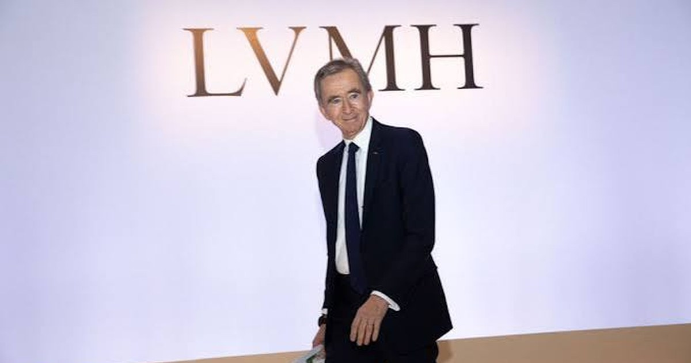

<!--
---
title: "잔혹한 M&A의 세계 - LVMH와 에르메스의 격돌"
title_en: "The Brutal World of M&A — LVMH vs Hermès"
subtitle: "25년째 끝나지 않은 전쟁"
description: "LVMH 비밀 지분 매집·주식스왑·피에슈 사라진 주식·AMF 제재·지리-다임러 데자뷔. 성장 벽에 선 제국이 다시 에르메스를 보는 이유. 투자 권유 아님(2026-09)."
abstract: |
  Korean industry/finance column on the 25-year LVMH–Hermès conflict (Sep 2026).
  Cash-settled equity swaps, 2002 secret pact, Nicolas Puech missing shares lawsuit (~$10bn / €14bn claim),
  AMF fine, 2014 truce, Geely–Daimler parallel, LVMH growth wall vs Hermès margins.
  Not investment advice.
summary_for_ai: |
  Korean column (not investment advice), 2026-09-19, group industry,
  Mokrak of the luxury market/LVMH-Hermes-War.md.
  Thesis: LVMH's shadow stake-building vs Hermès family defense never fully ended;
  Puech litigation and Reuters 2026 secret-pact leak reopen the war as LVMH faces organic-growth limits.
date: 2026-09-19
updated: 2026-09-19
author: "김호광 (Dennis Kim)"
lang: ko
tags:
  - LVMH
  - 에르메스
  - 베르나르아르노
  - M&A
  - 명품
  - 주식스왑
  - 피에슈
  - 럭셔리
keywords:
  - "LVMH"
  - "에르메스"
  - "Hermès"
  - "베르나르 아르노"
  - "니콜라 피에슈"
  - "주식연계스왑"
  - "명품 M&A"
  - "지리 다임러"
group: industry
featured: true
featured_rank: -11
og_image: "https://vibequant.cc/og/lvmh-hermes-war.jpg"
image: "https://vibequant.cc/og/lvmh-hermes-war.jpg"
schema_type: BlogPosting
draft: false
robots: index,follow
---
-->

# 잔혹한 M&A의 세계 - LVMH와 에르메스의 격돌

> 25년째 끝나지 않은 전쟁. 파생상품 뒤에 숨은 지분 매집, 사라진 60억 유로어치 주식, 그리고 성장의 벽에 부딪힌 제국이 다시 에르메스를 바라보는 이유.

## 1. 사건 개요

LVMH(루이비통모에헤네시)는 2000년대 초반부터 파생상품과 비밀 계약을 활용해 경쟁사 에르메스 지분을 은밀히 매집했다. 2010년 10월 돌연 17% 지분 보유를 공개하면서 프랑스 증시 역사상 가장 격렬한 경영권 분쟁이 시작됐다. 에르메스는 이를 **적대적 인수 시도**로 규정하고 가문 전체가 결집해 방어에 나섰으며, 프랑스 금융시장청(AMF)의 제재와 법적 공방 끝에 2014년 LVMH가 보유 지분 대부분을 처분하는 것으로 휴전했다.

그러나 전쟁은 끝나지 않았다. 창업가문 5대손 **니콜라 피에슈(Nicolas Puech)**가 "내 주식이 사라졌다"며 LVMH와 베르나르 아르노 회장을 상대로 소송을 제기했고, 2026년 9월에는 LVMH가 2002년 피에슈의 주식을 사들이기로 한 비밀 계약서에 서명했다는 사실이 로이터 단독 보도로 드러나면서 사건은 다시 수면 위로 떠올랐다.

## 2. 배경 - 비밀 지분 매집 (2001～2010)

### 2.1 연결고리의 탄생 (2001)

- 스위스 변호사 **알렉상드르 몽타봉**(Alexandre Montavon)이 피에슈의 재산관리인 **에릭 프레이몬드(Eric Freymond)**를 아르노 회장의 오랜 책사 **피에르 고데(Pierre Godé, 2018년 사망)**에게 소개하면서 관계가 시작됐다.
- 프레이몬드는 주식을 팔 의향이 있는 에르메스 가문 주주들과 연결돼 있다고 주장했지만, 매도자가 누구인지는 밝히지 않았다.
- 몽타봉은 LVMH에 자문하는 동시에 프레이몬드 자산관리회사의 이사를 겸하고 있었다. **매수자의 자문역과 매도자 측 재산관리인이 한 몸처럼 움직인 구조**였다.

이해 상충이 발생한 상황이 만들어진 것이다.

### 2.2 '스크린(screen)' 구조

- 몽타봉의 프랑스 검찰 진술에 따르면, 프레이몬드는 **피에슈의 계좌를 경유지**(pass-through)로 삼아 다른 가문 구성원들의 에르메스 주식을 LVMH에 넘기는 '가림막' 구조를 제안했다.
- 목적은 실제 매수자가 LVMH라는 사실을 숨기는 것이었다. 경쟁사에는 절대 팔지 않으려는 상속인들이 있었기 때문이다.
- 몽타봉은 이 거래들이 LVMH 자금으로 피에슈 명의를 통해 실행됐다고 진술했다.
- LVMH가 2017년 스위스 법원에 낸 서면에 따르면, 이 방식으로 2002년까지 이미 에르메스 지분 **4.9**%를 확보했다.

### 2.3 2002년 비밀 계약

- **2002년 11월 12일**, 고데와 프레이몬드는 LVMH가 피에슈 및 다른 상속인들로부터 **수백만 주의 에르메스 주식을 추가 매입**하는 계약에 서명했다.
- 매입 개시 시점은 당시 에르메스를 이끌던 **장루이 뒤마(Jean-Louis Dumas) 회장의 퇴임 이후**로 설정됐다. 뒤마 회장은 2006년 은퇴했다.
- LVMH는 2017년 스위스 법원 서면에서 이 계약이 프레이몬드의 대리권 확인 전까지 보류됐고, 실행된 적이 없으며, **계약서는 에르메스 지분을 공개한 2010년 말 파기**했다고 밝혔다.

### 2.4 2,000만 달러의 수수료

- LVMH와 아르노 가문 지주회사는 **2001～2009년 프레이몬드의 자산관리 회사에 최소 2,000만 달러**의 수수료를 지급했다.
- LVMH는 이 돈이 프레이몬드와의 관계를 유지하고, 그가 에르메스 주식을 **다른 경쟁사에 넘기지 못하도록 막기 위한 것**이었다고 설명했다.

### 2.5 공시를 피한 파생 상품의 활용

- LVMH는 주식을 직접 사는 대신 **현금결제형 주식연계스왑(cash-settled equity swaps)**을 은행과 체결했다.
- 스왑 구조에서는 은행이 헤지용으로 실제 주식을 보유하고, LVMH는 주가 변동에 따른 경제적 이익만 가져간다. 당시 프랑스 규정은 현금결제형 파생상품을 지분 공시 기준(5% 등)에 합산하지 않았기 때문에, LVMH는 사실상의 지분을 쌓으면서도 공시 의무를 피할 수 있었다.
- 2010년 10월, LVMH는 스왑을 **실물 주식 인도 방식으로 전환**하며 한순간에 대주주로 등장했다. 이후 프랑스는 현금결제형 파생상품까지 공시 기준에 포함하도록 규정을 강화했다.

## 3. 데자뷔 - 지리자동차의 벤츠(다임러) 지분 매집

아르노 회장이 에르메스를 공략한 방식은 2018년 중국 **지리(Geely)자동차의 리수푸(李书福) 회장**이 메르세데스-벤츠 모회사 다임러를 공략한 방식과 구조적으로 거의 동일하다.

| 구분 | LVMH → 에르메스 (2010) | 지리 → 다임러 (2018) |
| --- | --- | --- |
| **선행 상황** | 에르메스 가문의 매각 거부 가능성 | 다임러가 지리의 신주 발행 요청을 거절 |
| **매집 수단** | 주식연계스왑, 비밀 계약, 제3자 계좌 경유 | 은행·페이퍼컴퍼니·파생상품 조합 |
| **공개 방식** | 17% 보유를 기습 공개 (기정사실화) | 9.69% 보유를 기습 공개, 단숨에 최대 단일주주 |
| **투입 규모** | 최대 23%까지 확대 | 약 90억 달러 |
| **당국 대응** | AMF 800만 유로 벌금 | 독일 BaFin이 공시 시점 문제로 조사했으나 벌금 미부과 |
| **제도 변화** | 프랑스 공시 규정 강화 | 독일 정치권에서 공시 규정 적정성 논란 |

- 다임러는 지리의 신주 발행 요청을 기존 주주 지분 희석을 이유로 거절했다. 그러자 리수푸는 전략을 바꿔 **조용히 지분을 쌓는 방식**을 택했다.
- 그는 은행, 페이퍼컴퍼니, 파생상품을 동원해 약 90억 달러 규모의 지분을 확보한 뒤 이를 한 번에 공개했다. 독일은 3%, 5%, 10% 기준을 넘으면 공시하도록 요구하지만, 시장은 공시 시점에 이미 거의 10%가 쌓인 것을 보고 놀랐다.
- BaFin은 공시가 하루 앞선 2월 22일에 이뤄졌어야 한다고 판단하고 벌금 부과를 검토했다. 최종적으로는 벌금 없이 조사를 종결했다.

**공통 공식**: 정면 협상이 막히면 → 파생상품으로 '보이지 않는 지분'을 쌓고 → 공시 기준선을 한 번에 뛰어넘어 → 기정사실(fait accompli)을 만든다. 차이가 있다면, LVMH는 그 과정에서 비밀 계약과 제3자 계좌라는 **더 깊은 그림자**를 이용했다는 점이다. 그리고 그 그림자가 15년이 지난 지금 피에슈 소송으로 돌아오고 있다.

> 참고: 이 공식의 원형은 2008년 독일 셰플러(Schaeffler)가 현금결제형 스왑으로 콘티넨탈(Continental) 지분을 확보한 사례다. 이후 유럽 각국은 파생상품 공시 규정을 순차적으로 강화했다.

## 4. 사건의 경과

### 4.1 2010년 - 기습 공개

- **2010년 10월 23일**, LVMH는 에르메스 지분 **14.2%**를 보유하고 있으며 곧 **17.1%**로 늘릴 것이라고 발표했다.
- 에르메스 가문은 약 73%를 보유하고 있었으나 100명이 넘는 상속인이 세 갈래 가문으로 흩어져 있어, 결속력이 흔들리면 방어가 뚫릴 수 있는 구조였다.
- **2010년 12월**, 가문 주주 50여 명이 지분을 모아 가족 지주회사 **H51**을 설립하고, 가문 밖으로 주식이 나가지 못하도록 **우선매수권**을 걸어 방어벽을 쌓았다.

### 4.2 2013년 - 금융당국 제재

- **2013년 7월**, AMF는 LVMH가 지분 매집 과정에서 **공시 의무를 위반**했다며 **800만 유로**의 벌금을 부과했다. 당시 AMF 역사상 최고 수준이었다.
- LVMH는 항소하지 않았다.

### 4.3 2014년 - 휴전 협정

- **2014년 9월**, 파리 상사법원장의 중재로 양측이 합의했다.
- LVMH는 보유한 에르메스 지분 **23.2%**의 대부분을 **자사 주주들에게 현물 배당**하고, **5년간** 에르메스 주식을 매입하지 않기로 약속했다.
- 아르노 가문 지주회사는 약 **8.5%**만 남겼다. 양측은 모든 소송을 취하했다.
- **그러나 피에슈의 주식이 어디로 갔는지는 이 합의에서도 끝내 규명되지 않았다.**

## 5. 6%, 100억 달러 규모의 사라진 주식 - 니콜라 피에슈 소송의 전말

### 5.1 인물

- **니콜라 피에슈**: 1837년 에르메스를 창업한 티에리 에르메스의 증손자. 에르메스 창업가문 5대손 가운데 가장 큰 지분을 상속받은 인물 중 하나로, 약 **600만 주(약 6%)**를 보유했다.
- **에릭 프레이몬드**: 스위스 출신 재산관리인. 피에슈에게서 은행 계좌 접근권을 포함한 전권을 위임받아 수십 년간 재산을 관리했다.

### 5.2 시간표

| 시기 | 사건 |
| --- | --- |
| 2001 | 몽타봉 소개로 프레이몬드–LVMH(고데) 관계 시작 |
| 2001～2009 | LVMH·아르노 지주회사, 프레이몬드 회사에 최소 2,000만 달러 지급 |
| 2002.11.12 | 고데–프레이몬드, 피에슈 등의 주식 매입 비밀 계약 서명 |
| 2010 말 | LVMH, 2002년 계약서 파기 (LVMH 주장) |
| 2016 | 프레이몬드, "정당한 보수를 못 받았다"며 스위스에서 LVMH 제소 |
| 2019 | LVMH, 프레이몬드와 **1,000만 유로에 합의** |
| 2022 | 피에슈, 프레이몬드와 결별 후 주식이 사라진 사실을 알게 됨 |
| 2024 초 | 피에슈, 프랑스에 프레이몬드 상대 배임·횡령 형사고소 |
| 2024.07 | 스위스 법원, 피에슈 측 청구 기각 ("맹목적 신뢰"로 자발적 위임) |
| 2025.05 | 피에슈, 파리 민사법원에 LVMH·아르노·아가슈 등 상대 **140억 유로** 손해배상 소송 |
| 2025.07 | 프레이몬드, 스위스에서 열차에 치여 사망 (현지 검찰 자살로 결론) |
| 2026.05 | 파리 검찰, 몽타봉이 "LVMH를 위한 피에슈 주식 횡령에 가담했는지" 수사 중이라고 확인 |
| 2026.06 | LVMH, 법원 답변서에서 피에슈 지분 인수 시도 전면 부인 |
| 2026.09.17 | 로이터, 2002년 비밀 계약서와 2,000만 달러 지급 사실 단독 보도 |

### 5.3 피에슈의 주장

- 피에슈는 프레이몬드에게 에르메스 주식 관리를 맡겼는데, 프레이몬드가 **자신도 모르는 사이에** 그 주식을 아르노 측에 넘겼다고 주장한다. 시점은 LVMH가 에르메스 지분을 은밀히 쌓던 시기와 겹친다.
- 청구액 140억 유로(약 160억 달러)는 소송 제기 당시 주가 기준이다. 현재 주가로 6% 지분은 **약 100억 달러**로 평가된다.
- 피고에는 LVMH와 아르노 회장 외에 아르노 가문 지주회사 **아가슈(Agache)와 피낭시에르 아가슈(Financière Agache)**, 고(故) 프레이몬드, 스위스 회사 2곳이 포함됐다.
- 프랑스 민사소송은 형사 절차와 병행해 피해 배상을 구하는 경우가 많다. **민사소송 제기 자체가 위법 행위를 의미하지는 않는다.** 형사 수사에서 정식 피의자가 된 사람은 프레이몬드뿐이었고, 아르노 회장과 그의 회사들은 아직 정식 수사 대상이 아니다.

### 5.4 LVMH의 반박, 그리고 모순

- LVMH는 2026년 6월 답변서에서 그룹은 피에슈의 지분 인수를 고려한 적조차 없으며, 하물며 그의 의사에 반해서는 더더욱 없었다고 주장했다.
- LVMH의 논리는 이렇다. 당시 전략은 오히려 피에슈를 설득해 에르메스에 영향력을 행사할 **주주 블록에 합류**시키는 것이었고, 그러려면 피에슈가 지분을 계속 보유해야 했으므로 매입은 앞뒤가 맞지 않는다는 것이다.
- 동시에 LVMH는 프레이몬드와 협력해 에르메스 주식을 모은 사실은 인정하면서, 혹시 피에슈 주식을 샀다면 "**의도하지 않은 것**"이라고 했다.
- **모순**: 로이터가 입수한 문서에 따르면 LVMH는 매집을 시작한 직후인 2002년 피에슈 주식 매입 계약에 서명했다. LVMH 대변인은 이 계약과 프레이몬드에 대한 지급에 대해 논평을 거부했다.

### 5.5 쟁점은 무엇인가? - '맹목적 신뢰'와 '대리인 문제'

이 사건의 핵심은 **대리인이 본인의 이익과 반대편에 선 거래 상대방과 돈으로 연결돼 있었는가**이다.

1. 프레이몬드는 피에슈의 전권 대리인이었다.
2. 동시에 그는 매수자인 LVMH로부터 8년간 최소 2,000만 달러를 받았다.
3. 매수자 측 자문 변호사(몽타봉)는 프레이몬드 회사의 이사였다.
4. 몽타봉은 피에슈에게 직접 매도 의사를 묻지 않은 이유에 대해, 피에슈가 모든 권한을 준 대리인이 있었기 때문이라고 답했다.

에르메스를 이끄는 악셀 뒤마 회장은 프레이몬드 사망 이후 "피에슈에게 이제 주식이 없다고 오래전부터 확신했다"며 주식이 회수될 수 있다고 보지 않는다고 말했다. 결국 이 소송의 결론은 주식 반환이 아니라 **누가 배상 책임을 지느냐**로 좁혀질 가능성이 높다.

이미 전권을 가진 자산 관리인의 서명으로 팔린 주식은 되찾기 힘들다. 

## 6. 명품 기업 수익성 비교 (2026년 상반기)

| 기업 | 매출 | 유기적 성장률 | 영업이익률 | 순이익률* | 비고 |
| --- | --- | --- | --- | --- | --- |
| **에르메스** | 81.6억 유로 | **+6.1%** | **41.0%** | 약 27% | 가죽제품·마구 +9.8% |
| **LVMH** | 386억 유로 | +2% | 22.5% | 약 15% | 패션·가죽 상반기 -1%, 2분기 +1% |
| **프라다 그룹** | 30.5억 유로 | +5% | 약 17%** | 약 11% | 22분기 연속 유기적 성장 |
| **케링** | 72.2억 유로 | +1% | 12.8% | 약 3% | 구찌 -5%, 구찌 영업이익률 17.0% |

* 순이익률 = 그룹 귀속 순이익 ÷ 매출로 계산한 근사치 ** 프라다 EBIT 5.23억 유로 ÷ 매출 30.48억 유로로 계산한 근사치 (전년 동기 6.07억 유로에서 감소)

### 읽는 법

- **에르메스는 매출 규모가 LVMH의 약 5분의 1이지만 영업이익률은 거의 두 배**다. 1유로를 팔면 41센트가 영업이익으로 남는다.
- LVMH의 영업이익률 22.5%도 업계 기준으로는 높지만, 이는 비용 통제로 방어한 숫자다. 경상영업이익은 4% 감소한 86.9억 유로였다.
- 2025년 4월 에르메스의 시가총액이 LVMH를 처음 추월한 것은 이 격차를 시장이 확인한 사건이었다. 모닝스타는 LVMH가 명품 스펙트럼의 하단에 더 노출된 반면, 에르메스는 더 부유한 고객층 덕분에 불황을 잘 견딘다고 분석했다.

루이비통은 부자처럼 보이는 사람이 구매하는 브랜드이고, 에르메스는 부자들이 로고를 감추면서 구매하는 브랜드이기 때문이다.

## 7. 성장의 벽에 선 제국

### 7.1 M&A로 만든 제국

LVMH의 역사는 곧 M&A의 역사다. 아르노 회장은 크리스찬 디올을 발판으로 1980년대 말 LVMH의 경영권을 장악했고, 이후 불가리(2011), 로로피아나(2013), 티파니(2021) 등을 차례로 흡수하며 75개 이상의 브랜드를 거느린 세계 최대 명품 기업을 만들었다. **인수로 성장한 기업은 인수할 대상이 사라질 때 성장의 한계에 부딪힌다.**

### 7.2 중국발 한파와 루이비통의 정체

- 코로나 이후 명품 붐을 이끌던 중국 소비는 부동산 침체와 소비 심리 위축으로 크게 꺾였다. 2024년 중국 본토 명품 시장은 두 자릿수 감소를 기록한 것으로 추산된다.
- LVMH의 핵심인 **패션·가죽 부문(루이비통·디올)은 2024년 2분기부터 7분기 연속 역성장**했고, 2026년 2분기에야 +1%로 돌아섰다. 그마저 시장 기대치(+1.7%)에는 못 미쳤다.
- 아시아 성장률도 1분기 7%에서 2분기 4%로 둔화됐다.
- 반면 에르메스는 같은 기간 대부분 지역에서 성장했다. 뒤마 회장은 중국 시장이 안정되고는 있지만 결정적인 반전은 아직 보이지 않는다고 진단했다. 그럼에도 에르메스는 초고액 자산가 중심 고객층과 공급 통제 덕분에 버텼다.

### 7.3 왜 다시 에르메스인가?

루이비통이 지배하는 '**접근 가능한 최상위 명품**' 시장이 흔들리는 사이, 에르메스는 **경기와 무관하게 팔리는 유일한 초고가 명품**임을 증명했다. LVMH 포트폴리오에서 가장 결정적으로 빠져 있는 조각이 바로 이것이다.

- 2014년 합의의 **5년 매입 금지 조항은 2019년에 이미 만료**됐다.
- 아르노 회장은 여전히 공격적 M&A를 통해 성장해 온 인물이며, 가문 지주회사는 2026년에도 LVMH 주식을 꾸준히 매입해 지배력을 강화하고 있다.
- 따라서 성장 정체를 돌파할 카드로 **에르메스에 대한 재공략, 즉 적대적 M&A 가능성을 완전히 배제할 수는 없다.**

## 8. 그러나 넘기 어려운 걸림돌

### ① 천문학적으로 불어난 인수 비용

- 2010년 당시 에르메스 주가는 주당 100유로대였지만, 현재는 **1,500유로를 훌쩍 넘는다.** 피에슈의 6% 지분 가치(약 100억 달러)를 역산하면 에르메스 시가총액은 약 1,700억 달러 규모다.
- 의미 있는 지분(예: 20%)만 확보하려 해도 수백억 달러가 필요하다. 경영권 프리미엄까지 붙으면 **LVMH 역사상 최대 인수였던 티파니**(**약 158억 달러**)**의 몇 배**가 소모된다.
- 이 정도 규모는 LVMH 자체의 재무 건전성과 신용등급에 직접적인 부담이 된다.

### ② 구조적으로 뚫기 어려운 지배구조

- 에르메스는 **주식합자회사(SCA)** 구조다. 경영권은 가문이 통제하는 무한책임사원 '에밀 에르메스 SARL'에 있어, **지분을 아무리 사도 경영진 교체가 사실상 불가능**하다.
- 가족 지주회사 **H51**과 우선매수권 장치가 가문 지분의 외부 유출을 막고 있다.
- 2010년의 교훈으로 가문의 결속력은 오히려 더 강해졌다.

### ③ 과거의 화해와 비공개 합의

- **2014년 휴전 협정**: 법적 금지 기간은 끝났지만, 파리 상사법원 중재로 맺은 합의를 뒤집는 재공략은 프랑스 재계와 여론의 거센 반발을 부를 것이다.
- **2019년 프레이몬드와의 1,000만 유로 비공개 합의**: 당시 조용히 봉합한 거래가 지금 피에슈 소송과 형사 수사에서 핵심 증거로 되살아나고 있다.

### ④ 진행 중인 법적 리스크

- 피에슈의 140억 유로 소송과 몽타봉에 대한 형사 수사가 진행 중이다. 채권 투자자 관점에서는 투자등급 발행사가 떠안은 **중대한 우발채무**다.
- 이 상황에서 다시 에르메스 지분을 사들이면, 과거 매집의 정당성을 스스로 다투는 모양새가 된다.
- 규제 환경도 달라졌다. 현금결제형 파생상품까지 공시 대상에 포함되면서 **2010년식 기습은 더 이상 통하지 않는다.**

## 9. 핵심 요약

| 구분 | 내용 |
| --- | --- |
| **비밀 매집 기간** | 2001～2010년 |
| **매집 수단** | 주식연계스왑, 2002년 비밀 계약, 피에슈 계좌 경유 |
| **대리인 지급액** | 2001～2009년 최소 2,000만 달러 |
| **2010년 공개 지분** | 17.1% (최대 23.2%까지 확대) |
| **2013년 AMF 제재** | 800만 유로 벌금 (공시 의무 위반) |
| **2014년 합의** | 지분 대부분 현물 배당, 5년간 추가 매입 금지 (2019년 만료) |
| **피에슈 소송** | 2025년 5월 제기, 140억 유로 청구, 파리에서 진행 중 |
| **유사 사례** | 지리자동차 리수푸 회장의 다임러 9.69% 기습 매집 (2018) |
| **수익성 격차** | 에르메스 영업이익률 41.0% vs LVMH 22.5% (2026 상반기) |

## 10. 맺으며, M&A의 제국은 어떻게 벽을 넘을 것인가?

LVMH와 에르메스의 싸움은 단순한 지분 전쟁이 아니다. "**규모의 제국**"과 "**희소성의 왕국**"이라는 두 가지 명품 비즈니스 모델의 충돌이다.

LVMH는 인수로 규모를 키웠고, 에르메스는 공급을 통제해 가치를 키웠다. 15년 전 아르노 회장이 파생상품의 그림자 속에서 에르메스를 노렸을 때, 시장은 이를 거인이 작은 가족기업을 삼키려는 시도로 봤다. 그러나 지금은 그 '작은 가족기업'이 시가총액과 수익성 모두에서 거인을 위협하고 있다.

성장의 정체에 걸린 LVMH 앞에 놓인 선택지는 세 가지다.

1. **내부 혁신**: 디올·루이비통의 크리에이티브 쇄신과 쥬얼리(티파니·불가리) 강화로 유기적 성장을 되살리는 길
2. **포트폴리오 재편**: 마크 제이콥스 매각처럼 비핵심 브랜드를 정리하고 초고가 영역에 집중하는 길
3. **다시 한번 M&A**: 에르메스든 다른 대상이든, 인수로 성장을 사는 길

어느 길이든 과거의 그림자, 즉 사라진 피에슈의 주식과 파기된 2002년 계약서, 그리고 조용히 봉합된 합의들을 먼저 정리하지 않고는 앞으로 나아가기 어렵다. **잔혹한 M&A의 세계에서 과거의 거래는 결코 완전히 끝나지 않는다.** 아르노 회장이 이 벽을 어떻게 돌파할지, 전 세계 명품 업계와 자본시장이 주목하고 있다.

### 참고 자료

- Reuters, "Exclusive-LVMH signed a secret 2002 pact to buy Hermès heir's shares" (2026.09.17)
- Reuters, "Hermes heir takes aim at LVMH's Arnault in missing shares civil lawsuit" (2025.12.02)
- Robb Report, "Hermès Heir Nicolas Puech Is Suing Bernard Arnault and LVMH" (2025.12)
- Reuters, "German regulator says Geely's Daimler stake needed earlier disclosure" (2018.05)
- LVMH 2026 상반기 실적 발표 (2026.07.27)
- Hermès International 2026 상반기 실적 발표 (2026.07.29)
- Kering 2026 상반기 실적 발표 (2026.07.28)
- Prada Group H1-26 보도자료 (2026.07.30)
- Reuters·CNN, 에르메스 시가총액 LVMH 추월 보도 (2025.04.15)

---

*본 칼럼은 공개 보도와 실적 자료를 바탕으로 한 분석이며, 특정 종목의 매매를 권유하지 않습니다. 투자 판단과 그 책임은 투자자 본인에게 있습니다.*
