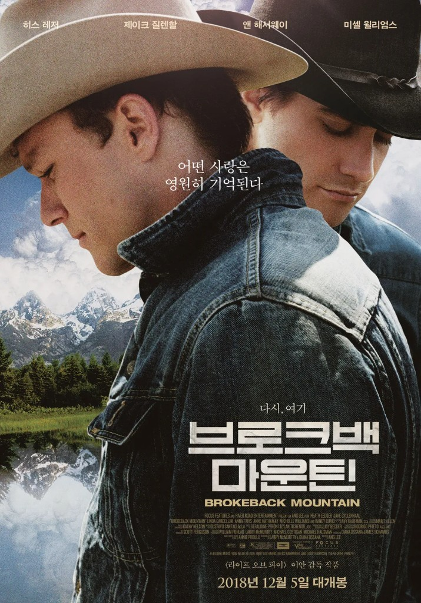

<!--
  HEAD 참조 (렌더링 안 됨 · 빌드 자동 주입 · 주석 풀지 말 것)
  <title>〈브로크백 마운틴〉, 끝내 닿지 못한 산의 이름으로 · VibeQuant</title>
  <meta name="description" content="〈브로크백 마운틴〉은 이름 붙이지 못한 사랑이 한 생애를 어떻게 지나가는지를 보여준다. 에니스와 잭이 끝내 갖지 못한 것은 비극이 아니라, 함께 늙어가는 그 지루함이었다.">
  <meta name="robots" content="index,follow">
-->

# 〈브로크백 마운틴〉, 끝내 닿지 못한 산의 이름으로

## 이루지 못한 사랑의 사무침에 대하여

*이안 감독 〈브로크백 마운틴(Brokeback Mountain)〉(2005). 주연 히스 레저, 제이크 질렌할. 제78회 아카데미 감독상·각색상·음악상.*

**김호광** 싸이월드 전 대표 / 2026년 10월 9일

어떤 사랑은 이름을 갖지 못한 채 산다. 부르는 순간 부서질 것 같아서 끝내 입 밖에 내지 못하는 사랑. 이안 감독의 〈브로크백 마운틴〉(2005)은 그런 사랑이 한 사람의 생애 동안 어떻게 머물다 가는지를 보여주는 영화다. 큰 소리를 내지 않고, 와이오밍의 바람처럼 담담하게, 그러나 오래 아프게.

그리고 이 영화는 사랑 이야기이기 이전에, 가난한 땅에서 가난하게 태어난 두 남자의 이야기이기도 하다. 그 땅의 바람과 흙과 가난을 함께 읽어야 이 사랑이 왜 그토록 불가능했는지, 그리고 왜 아직도 완전히 지나간 이야기가 아닌지가 보인다.

## 1963년 여름, 산 위에서

영화는 기다림으로 시작한다. 1963년 와이오밍의 작은 마을, 동이 트기 전. 목장주 조 아귀레의 사무실 트레일러 앞에 두 청년이 서 있다. 한 사람은 모자를 눈썹까지 눌러쓰고 벽에 기대 있고, 다른 한 사람은 낡은 트럭에 몸을 기댄 채 백미러로 상대를 힐끔거린다. 둘은 한마디도 하지 않는다. 이안은 이 첫 장면을 거의 대사 없이 흘려보낸다. 앞으로 20년 동안 두 사람 사이에 놓일 거리, 서로를 훔쳐보면서도 끝내 다가가지 못하는 그 거리가 이미 이 몇 분 안에 다 들어 있다.

에니스 델 마(히스 레저)와 잭 트위스트(제이크 질렌할)는 그 여름 브로크백 마운틴에서 함께 양떼를 돌보게 된다. 여름인데도 고지대에는 진눈깨비가 내리고, 밤이면 코요테가 양을 노린다. 한 사람은 매일 밤 산 위 양떼 곁에서 홀로 천막을 치고, 다른 한 사람은 아래 야영지에서 밥을 짓는다. 말수 적고 무뚝뚝한 고아 에니스와 넉살 좋고 꿈 많은 잭은 모닥불 앞에서 통조림 콩을 나눠 먹으며 조금씩 가까워진다. 어느 밤 에니스가 자기 이야기를 이렇게 많이 해본 건 처음이라고 털어놓는다. 그 짧은 고백에서 관객은 이 남자가 지금까지 얼마나 혼자였는지를 알게 된다.

이안은 산 위의 장면들을 넓게 찍는다. 화면 가득 하늘과 능선과 양떼가 펼쳐지고, 두 남자는 그 풍경 속의 작은 점이다. 대만 출신으로 미국 서부를 이방인의 눈으로 바라본 감독은, 이 땅을 정복의 무대가 아니라 숨을 쉴 수 있는 유일한 장소로 그린다. 구스타보 산타올라야의 기타는 거의 아무것도 하지 않는다. 줄 몇 개가 느리게 울리고, 음과 음 사이에 바람이 들어찬다.

어느 추운 밤, 술에 취해 모닥불 곁에서 떨던 에니스를 잭이 천막 안으로 부른다. 그 밤 두 사람의 관계는 우정 너머로 건너간다. 다음 날 아침 그들은 서로에게 "나는 그런 사람이 아니야"라고 말하지만, 산은 이미 두 사람만의 세계가 되어 있었다. 아무도 보지 않고, 아무것도 금지하지 않는 곳. 멀리 망원경으로 그들을 지켜보던 조 아귀레의 시선 하나만 빼고. 이안은 그 장면을 길게 보여주지 않는다. 짧은 컷 하나로 충분하다. 낙원에도 감시자는 있었다.

여름은 예정보다 일찍 끝난다. 마지막 날, 두 사람은 장난처럼 시작한 몸싸움 끝에 주먹을 주고받고, 에니스가 코피를 흘린다. 잭이 자기 셔츠 소매로 그 피를 닦아준다. 아무렇지 않게 지나가는 장면이다. 산을 내려오던 날 에니스는 셔츠 한 벌을 산에 두고 온 것 같다며 투덜거린다. 그것도 아무렇지 않게 지나간다.

헤어지는 길목에서 둘은 무심하게 인사를 나눈다. 내년 여름에도 오느냐는 잭의 물음에 에니스는 결혼할 거라며 말끝을 흐린다. 잭의 트럭이 시야에서 사라지자 에니스는 골목 구석에 숨어 벽을 붙잡고 헛구역질하듯 운다. 지나가던 행인이 쳐다보자 그는 오히려 소리를 지른다. 뭘 보느냐고. 자기 안에서 무엇이 무너졌는지도 모른 채, 그는 그것을 들킨 데 대해 먼저 화를 낸다. 에니스라는 사람의 모든 것이 이 한 장면에 있다.

에니스는 약혼녀 알마(미셸 윌리엄스)와 결혼해 두 딸의 아버지가 된다. 잭은 로데오 대회장을 떠돌다 텍사스 농기계 사업가의 딸 루린(앤 해서웨이)을 만나 결혼한다. 산 아래의 장면들은 좁다. 세탁소 위층 셋방, 트레일러, 모텔 방. 문틀과 창틀이 인물을 이중으로 가두고 천장은 낮다. 관객은 설명을 듣지 않아도 안다. 저 위에서는 숨을 쉴 수 있었고, 이 아래에서는 숨이 막힌다는 것을.

4년 뒤 에니스에게 엽서 한 장이 도착한다. 곧 지나갈 테니 만나자는 짧은 문장. 에니스의 답장은 더 짧다. 그러자고. 약속한 날, 그는 아침부터 창가를 서성인다. 잭의 트럭 소리가 들리자 계단을 뛰어 내려간다. 4년치 그리움이 한꺼번에 쏟아지는 입맞춤. 그리고 위층 방충망 문 너머에서 알마가 그 장면을 본다. 이안은 이 순간을 알마의 시점으로, 방충망의 촘촘한 격자 너머로 보여준다. 사랑의 장면이 동시에 배신의 장면이 되는 순간을 시점 하나로 만들어낸 것이다. 알마는 아무 말도 하지 않는다. 남편이 친구를 데리고 올라와 소개할 때도, 둘이 하룻밤 나갔다 오겠다고 할 때도. 그 침묵은 이 영화에서 가장 오래 가는 비명 중 하나다.

그 뒤로 20년 동안 두 사람은 1년에 한두 번 '낚시 여행'을 떠난다. 낚싯대는 한 번도 물에 닿지 않는다. 영화는 세월을 자막으로 알려주지 않는다. 아이들의 키, 루린의 머리 모양, 자동차의 모델, 에니스 얼굴의 주름이 시간을 대신 말한다. 세상은 변하는데 두 사람은 언제나 같은 산으로 돌아간다. 그들의 사랑만 1963년 여름에 붙들려 있다.

잭은 함께 목장을 차리고 살자고 거듭 말한다. 작은 목장, 소 몇 마리, 둘만의 생활. 에니스는 그럴 수 없다고 답한다. 그리고 처음으로 이유를 꺼낸다. 아홉 살 무렵, 아버지가 그와 형을 데리고 이웃 목장으로 갔다. 함께 살던 두 남자 가운데 한 사람이 처참하게 살해된 채 도랑에 버려져 있었다. 아버지가 그것을 일부러 보여줬던 건 아닐까. 그 의심은 평생 에니스를 옥죄는 공포가 된다.

시간은 각자의 집 안에서도 흐른다. 알마는 끝내 이혼하고, 어느 추수감사절 저녁 부엌에서 그동안 삼켜온 말을 꺼낸다. 낚싯대에 묶어 보낸 쪽지가 그대로 돌아왔다는 것, 당신들이 무엇을 하러 가는지 안다는 것. 에니스는 그녀의 손목을 비틀고, 문을 박차고 나가 길에서 처음 본 사내와 주먹다짐을 벌인다. 같은 계절, 텍사스의 잭은 사사건건 자신을 무시하는 장인에게 식탁에서 처음으로 맞선다. 여기는 내 집이라고. 두 남자는 서로 다른 식탁에서, 각자의 방식으로, 빼앗긴 자리를 되찾으려 몸부림친다.

그리고 마지막이 될 줄 몰랐던 산행. 에니스가 다음 만남을 11월로 미루자 잭이 무너진다. 20년 동안 겨우 몇 번의 만남으로 버텨왔다고, 너를 끊어내는 법을 알았으면 좋겠다고 소리친다. 에니스는 다리가 풀린 듯 주저앉는다. 이안은 이 장면에서도 카메라를 멀리 둔다. 클로즈업으로 감정을 짜내지 않고, 두 사람을 바람 속에, 회색 하늘 아래에 둔다. 잭이 다가가 그를 붙든다.

그 순간 화면은 20년 전 첫 여름으로 돌아간다. 모닥불 앞에서 선 채로 졸던 잭을 에니스가 뒤에서 가만히 안아주던 밤. 어머니가 해주던 말이라며 낮게 흥얼거리고는, 먼저 말에 올라 떠나던 뒷모습. 잭에게 그 포옹은 평생 가장 평온했던 순간이었다. 그리고 두 사람이 함께 있는 장면은 거기서 끝난다.

몇 달 뒤, 에니스가 보낸 엽서가 돌아온다. 붉은 도장 하나가 찍혀 있다.

**수취인 사망.**

## 바람만 부자인 땅, 카우보이라는 갑옷

엽서를 손에 든 에니스를 잠시 그대로 두고, 이 두 사람이 서 있던 땅을 먼저 보아야 한다. 이 사랑을 가로막은 것은 편견만이 아니었다. 그보다 먼저, 그리고 더 집요하게, 가난이 있었다.

에니스는 부모를 교통사고로 잃고 고등학교를 중퇴한 고아다. 형과 누나는 각자 살길을 찾아 흩어졌고, 그에게 남은 것은 몸뚱이 하나와 남의 목장에서 품을 파는 일뿐이다. 잭 역시 아버지의 땅에서 아무것도 물려받지 못한 채 로데오 상금을 좇아 떠도는 청년이다. 둘이 브로크백에서 양을 친 것은 낭만이 아니라 생계였다. 계절 노동, 일당, 통조림 콩. 그들은 서부 영화 속 영웅이 아니라, 서부 신화가 지워버린 노동자였다.

와이오밍은 미국에서 인구가 가장 적은 주다. 땅은 넓고 사람은 드물고, 바람은 끝없이 분다. 이곳의 삶은 목축, 그리고 석유와 석탄 같은 자원 산업의 경기에 따라 출렁였다. 학력도 자본도 없는 남자들이 할 수 있는 일은 많지 않았다. 이혼 뒤 에니스는 양육비를 대느라 여름마다 남의 목장을 전전하고, 끝내 들판 한가운데 낡은 트레일러에 홀로 산다. 잭이 처가의 돈으로 도와줄 수 있다고 말해도 그는 거절한다. 가진 것이 없는 남자에게 마지막으로 남은 재산은 '남자로서의 체면'이었으니까. 반대로 잭은 결혼으로 계층을 건너갔지만, 장인의 집에서 끝내 손님이었다. 돈은 그에게 여유를 주었지만 자리를 주지는 않았다.

그리고 그 가난한 땅에는 오래된 갑옷이 있었다. 카우보이. 미국이 스스로에게 들려주는 가장 오래된 남성 신화다. 말이 없고, 혼자이고, 누구에게도 기대지 않는 남자. 울지 않고, 설명하지 않고, 필요하면 주먹으로 말하는 남자.

그런데 그 신화의 이면에는 늘 다른 이야기가 있었다. 1948년 킨제이 보고서는 서부 산악지대의 목동, 벌목꾼, 탐광꾼처럼 여성 없이 고립되어 일하던 남성들 사이에서 동성 간의 접촉이 드물지 않았다고 기록했다. 몇 달씩 산 위에서 남자 둘이 지내는 일은 서부 노동의 일상이었다.

혐오는 바로 그 지점에서 자란다. 가장 남자다워야 하는 세계일수록, 그 경계는 폭력으로 지켜진다. 에니스의 아버지가 어린 아들에게 살해된 남자의 시신을 보여준 것은 한 가족의 일화가 아니라 한 문화의 교육 방식이다. 이렇게 되고 싶지 않으면, 이렇게 되지 마라. 에니스는 그 교육을 너무 잘 받았다. 독립기념일 밤, 딸들 앞에서 욕설을 한 사내 둘을 그가 순식간에 때려눕히는 장면이 있다. 불꽃이 터지는 하늘을 등지고 선 그의 실루엣은 영웅처럼 보인다. 그러나 겁에 질려 우는 딸들과 그를 바라보는 알마의 얼굴은 다른 이야기를 한다. 그는 그렇게 철저하게 '남자'를 연기해야 했다. 히스 레저는 에니스를 연기하면서 입을 거의 벌리지 않는다. 턱을 꽉 다문 채 말을 씹어 삼키듯 내뱉는 그 발성은 그 자체로 억압의 형식이다.

시대도 그들 편이 아니었다. 미국정신의학회가 동성애를 정신질환 목록에서 삭제한 것은 1973년이었다. 에니스와 잭의 20년 가운데 앞의 10년 동안, 그들의 사랑은 공식적으로 '병'이었다.

현실은 소설을 따라왔다. 애니 프루의 원작 단편이 1997년 『뉴요커』에 실린 지 1년 뒤인 1998년, 와이오밍 래러미에서 대학생 매튜 셰퍼드가 동성애자라는 이유로 폭행당해 울타리에 묶인 채 버려졌고 끝내 숨졌다. 에니스가 평생 두려워했던 장면은 상상이 아니었다. 그것은 와이오밍의 실제 풍경 속에 있었다.

에니스의 입버릇 같은 말이 있다. 고칠 수 없으면 견뎌야 한다는 것. 가난한 사람의 철학이다. 바꿀 힘이 없는 사람은 견디는 법부터 배운다. 에니스는 그 철학을 사랑에도 적용했다. 그리고 견디다가, 놓쳤다.

## 두 아내, 그리고 전화 한 통

엽서가 돌아오자 에니스는 수화기를 든다. 텍사스의 루린이 전화를 받는다.

그녀의 목소리는 차분하다. 잭이 길가에서 타이어에 바람을 넣다 타이어가 터졌고, 튕겨 나온 쇠붙이에 얼굴을 맞아 쓰러졌는데, 누가 발견했을 때는 이미 늦었다고. 사무적인 설명이 이어지는 동안, 에니스의 머릿속에는 다른 장면이 스친다. 쇠지렛대를 든 남자들, 길바닥에 쓰러진 잭. 이안은 그 장면을 아주 짧게, 소리도 없이 끼워 넣는다. 그것이 진실인지 공포가 만든 상상인지 영화는 끝내 말해주지 않는다. 다만 관객은 안다. 에니스에게 그 둘은 다르지 않다는 것을. 아홉 살에 본 도랑 속의 시신이 40년 뒤 잭의 얼굴을 하고 돌아왔다.

루린의 차분함은 오래 연습된 것이다. 처음엔 말을 타던 활달한 카우걸이었던 그녀는 세월이 갈수록 머리를 단단히 부풀려 올리고, 계산기를 두드리고, 사업가의 얼굴이 되었다. 남편이 무엇을 그리워하는지 그녀는 알았을까. 영화는 답하지 않는다. 에니스의 갑옷이 남자다움이었다면, 루린의 갑옷은 돈과 사무적인 태도였다.

그 갑옷은 통화 끝에서 아주 잠깐 금이 간다. 잭이 늘 브로크백 마운틴에 뿌려지고 싶다고 했다고, 그녀가 말한다. 그런데 그게 어디 있는지 모르겠다고. 그녀는 그곳이 잭이 지어낸 상상의 장소인 줄 알았다고. 남편이 평생 가장 사랑했던 장소를, 아내는 이름으로만 알았다. 수화기 너머로 그녀의 목소리가 처음으로 흔들린다. 그 흔들림 속에서 관객은 깨닫는다. 루린 역시 이 이야기의 다른 쪽 끝에서 혼자였다는 것을.

알마는 또 다른 방식으로 버텼다. 방충망 너머로 남편의 입맞춤을 본 뒤에도 그녀는 몇 년을 말없이 견뎠다. 그 침묵의 이유는 사랑이라기보다 생존에 가까웠을 것이다. 1960년대 와이오밍에서 고졸 학력의 젊은 엄마가 두 아이를 데리고 혼자 살아갈 길은 좁았다. 그녀는 남편의 '낚시 여행'이 거짓임을 확인하고도, 혼자 설 수 있게 된 뒤에야 떠났다. 재혼한 상대는 안정된 수입이 있는 식료품점 주인이었다. 알마의 선택은 냉정하다기보다 정확하다. 사랑받지 못하는 결혼에서 그녀가 지킬 수 있었던 것은 아이들의 생활이었다.

이 영화는 두 아내를 악역으로 만들지 않는다. 그렇다고 단순한 피해자로 만들지도 않는다. 그들은 금기가 만든 거짓 위에서 각자의 방식으로 살아남은 사람들이다. 억압의 비용은 당사자만 치르지 않는다. 그 둘레에 선 모든 사람에게, 계급과 성별에 따라 다른 액수로 청구된다.

## 미완의 사랑은 왜 더 비싸게 기억되는가?

이 사랑은 왜 이토록 오래 아플까. 영화 바깥의 언어를 잠시 빌려본다. 다만 아래의 개념들은 원래 사랑을 설명하려고 만든 것이 아니다. 사랑을 그 언어로 환원하려는 것이 아니라, 그 언어에 비춰 사랑의 어떤 모양을 들여다보려는 은유적 시도다.

**닫히지 않은 문.** 러시아 심리학자 블루마 자이가르닉은 1927년 실험에서 사람들이 끝마친 과제보다 중간에 멈춘 과제를 더 잘 기억한다는 것을 관찰했다. 이후 재현 연구에서 효과의 크기가 들쑥날쑥하다는 지적도 있지만, 직관은 여전히 많은 것을 설명한다. 닫히지 않은 것은 마음 한구석을 계속 점유한다. 에니스와 잭의 20년은 그 자체로 매번 중간에서 멈춘 시간이었다. 며칠의 산행이 끝나면 다시 1년의 기다림. 마지막 산행마저 다툼 속에서, 다음 약속도 제대로 하지 못한 채 끝났다. 에니스에게 잭은 영원히 닫히지 않는 문으로 남는다.

**너무 비싸게 산 시간.** 경제학은 귀한 것이 드물기 때문에 비싸다고 말한다. 두 사람에게 허락된 시간은 1년에 고작 며칠이었고, 그 며칠은 가정의 붕괴, 사회적 낙인, 때로는 목숨이라는 막대한 기회비용을 치르고 산 것이었다. 알마의 침묵, 딸들의 울음, 낚싯대에 묶인 채 돌아온 쪽지. 그 모든 것이 그 며칠의 값이었다. 비싸게 치른 것일수록 우리는 그 가치를 높게 매긴다.

**행사되지 못한 옵션.** 잭이 끝까지 품었던 목장의 꿈은 한 번도 행사되지 못한 옵션이었다. 실현되지 않았기에 실망도 없었고, 그래서 가장 아름다운 미래로 남았다. 그러나 옵션에는 만기가 있다. 돌아온 엽서의 붉은 도장, 그것이 만기일이었다. 가능성은 그날 영구 손실로 확정되었다.

## 산 아래, 지금

영화가 개봉하고 20년이 지났다. 산 아래의 세상은 변했고, 또 변하지 않았다.

와이오밍은 2024년 대선에서 도널드 트럼프에게 71.6%의 표를 주었다. 이 주 역사상 어느 대선 후보보다 높은 득표율이었다. 23개 카운티 중 그가 진 곳은 단 하나, 억만장자들의 별장과 스키 리조트가 모인 잭슨홀의 티턴 카운티뿐이었다. 그곳의 대졸자 비율은 주 평균의 두 배다. 석탄 도시의 일자리가 흔들리고 목장이 기계화되는 동안, 새로운 부는 그 한 곳으로, 혹은 아예 와이오밍 바깥으로 흘러갔다. 공장이 빈 러스트 벨트와 광산과 목장이 빈 산악 서부는 그렇게 닮아갔고, 대학 학위 없는 백인 노동계층 남성들은 '판을 엎겠다'는 정치에 표를 던졌다. 그것이 경제적 박탈 때문이었는지, 사회의 중심에서 밀려난다는 지위의 불안 때문이었는지는 학계에서도 해석이 갈린다. 아마 둘 다였을 것이다. 지갑이 얇아질 때 자존심도 함께 얇아진다. 몸으로 가족을 먹여 살리던 남자다움의 토대가 무너지면, 많은 이들은 남자다움 자체가 공격받는다고 느낀다. 그 분노가 출구를 찾지 못할 때 어디로 향하는지, 산악 서부가 오랫동안 미국에서 자살률이 가장 높은 지역으로 꼽혀온 사실이 조용히 말해준다. 아프다고 말하지 못하는 남자들의 땅. 에니스의 얼굴은 여전히 그곳에 있다.

미국 전체로 보면 풍경은 크게 바뀌었다. 2015년 동성결혼이 전국에서 합법화되었고, 갤럽 조사에서 스스로를 성소수자로 밝히는 성인의 비율은 2012년 3.5%에서 2025년 9%로 늘었다. 30세 미만에서는 23%다. 이제 많은 미국인에게 성소수자는 뉴스 속 타인이 아니라 가족이고 친구이고 동료다. 사람은 이름과 얼굴을 아는 이를 쉽게 미워하지 못한다. 수많은 식탁 위의 고백이 미국의 여론을 바꿨다. 시장도 응답해, 성소수자는 기업들이 따로 겨냥하는 소비층이 되었다.

그러나 고백이 늘 수용으로 끝나지는 않는다. 같은 식탁에서 단절로 끝나는 집도 여전히 많다. 변화는 지도 위에 고르게 퍼지지 않았다. 갤럽 조사에서 성소수자 정체성은 도시일수록, 젊을수록 높았고, 공화당 지지자 중에서는 1.9%에 그쳤다. 그 숫자는 실제 인구의 차이이기도 하지만, 어디에서는 자신을 밝힐 수 있고 어디에서는 여전히 숨겨야 하는지를 보여주는 기후의 지표이기도 하다. 백인 개신교 목장 문화가 짙은 서부 시골에서, 성장에서 소외되었다고 느끼는 사람들에게 무지개 깃발은 종종 자신들을 두고 앞서간 '저쪽 세계'의 상징으로 보인다. 그 거리감에는 정당화될 수 없는 혐오도 있고, 서툴게 표현된 상실감도 섞여 있다.

그 사이에서 가장 먼저 다치는 것은 아이들이다. 성소수자 청소년 자살 예방 단체 트레버 프로젝트가 2025년 미국의 13~24세 성소수자 청소년과 청년 1만6천여 명을 조사한 결과, 36%가 지난 1년 사이 진지하게 자살을 생각했고 10명 중 1명은 실제로 시도했다고 답했다. 온라인으로 모집한 표본이라 전체 인구로 일반화하는 데에는 신중해야 하지만, 이 단체가 해마다 강조하는 결론은 분명하다. 이들이 위험에 놓이는 것은 그들이 누구여서가 아니라, 그들이 받는 대우와 낙인 때문이라는 것. 그리고 곁에 있는 사람들의 지지와 수용이 생명을 지킨다는 것.

다시 아홉 살의 에니스를 떠올린다. 아버지 손을 잡고 도랑가에 서 있던 소년. 그가 평생 짊어진 공포는 그날 어른이 보여준 한 장면에서 시작되었다. 오늘 시골 작은 마을의 어느 소년이 식탁에서, 교회에서, 학교 복도에서 보고 듣는 것이 또 한 명의 에니스를 만들 수도 있고, 만들지 않을 수도 있다.

통계가 열 명 중 한 명을 말할 때, 산 아래 작은 마을에서는 여전히 그 한 명이 혼자다.

## 그들이 갖지 못한 것은 비극이 아니라 지루함이었다

여기서 멈춰야 할 지점이 있다. 이 글이 가장 하고 싶은 말도 여기에 있다.

이루지 못한 사랑이 아름답게 '기억되는' 것과, 이루지 못한 사랑이 아름다운 '것'은 다르다.

앞에서 빌려온 언어들, 닫히지 않은 문과 너무 비싸게 산 시간과 행사되지 못한 옵션은 결국 하나의 사실을 가리킨다. 에니스와 잭의 사랑이 그토록 강렬했던 이유의 상당 부분은 사랑의 본질이 아니라 억압의 결과였다는 것이다. 금기가 희소성을 만들었고, 공포가 미완을 만들었고, 폭력이 만기를 앞당겼다. 그 아름다움은 그들이 원해서 고른 것이 아니다. 세상이 그것밖에 허락하지 않았기에 남은 것이다.

관객은 극장에서 이 사랑의 광채에 눈물 흘린다. 그러나 그 광채는 두 사람의 인생을 태워서 얻은 빛이다. 그것은 아름다운 운명이 아니라, 한 사람은 너무 일찍 떠나고 한 사람은 너무 긴 겨울을 혼자 견뎌야 하는 일이다.

그러니 이 영화가 남기는 말은 "이루지 못한 사랑은 아름답다"가 아니라 "누구의 사랑도 이루지 못하게 강요받아서는 안 된다"여야 한다.

잭이 꿈꾼 것을 다시 생각해 본다. 그것은 열정의 영원한 지속이 아니었다. 작은 목장, 소 몇 마리, 아침마다 마주 앉는 식탁. 커피가 식기 전에 오늘 고칠 울타리를 이야기하고, 비가 오면 함께 지붕을 올려다보고, 겨울이면 같은 난로 앞에서 졸다가 늙어가는 일. 사랑이 일상이 되어 조금씩 닳아가는, 지루하고 평범하고 귀한 시간. 그는 그것을 20년 동안 바랐고, 20년 동안 거절당했다.

금기를 걷어낸다는 것은 사랑에서 비극적 광채를 빼앗는 일이 아니다. 사랑을 다시 그 지루함으로 돌려주는 일이다.

에니스와 잭이 끝내 갖지 못한 것은 비극이 아니라, 바로 그 지루함이었다.

## 사랑은 그 어떤 모양이든 아련하다

에니스와 잭의 사랑을 보며 우는 사람들 가운데에는 동성을 사랑해본 적 없는 이들이 훨씬 많다. 그들이 우는 이유는 자신의 사랑도 어딘가에서 그렇게 막혀본 적이 있기 때문이다. 집안의 반대로, 가난 때문에, 엇갈린 타이밍 때문에, 혹은 그저 용기가 없어서. 형태는 다르지만, 사랑이 세상의 벽에 부딪혀 부서지는 소리는 다르지 않다.

에니스는 언제나 다음을 기약했다. 11월에 보자고, 내년에 보자고. 그런데 다음은 오지 않았다. 그의 후회는 동성애자의 후회이기 이전에, 너무 늦게 용기를 낸 모든 사람의 후회다. 우리 모두에게는 "다음에"라는 말 뒤에 접어둔 이름이 하나쯤 있다.

사랑은 그 어떤 모양이든 아련하다. 남자와 여자의 사랑이든, 남자와 남자의 사랑이든, 끝까지 함께한 사랑이든, 끝내 닿지 못한 사랑이든. 사랑은 언제나 시간 앞에서 유한하고, 그 유한함을 아는 순간 모든 사랑은 조금씩 아련해진다. 에니스와 잭의 사랑이 유난히 사무치는 것은, 그 유한함이 세상에 의해 너무 일찍 앞당겨졌기 때문이다.

## 잭의 방, 셔츠 두 벌

전화를 끊은 에니스는 잭의 고향으로 차를 몬다. 유골 일부라도 브로크백에 뿌려주고 싶다고, 그 말을 하러 간다.

바람만 드나드는 듯한 텅 빈 농가. 부엌 식탁에 잭의 늙은 부모가 앉아 있다. 아버지는 에니스를 똑바로 보지 않은 채 말한다. 잭은 언젠가 에니스 델 마라는 친구와 함께 돌아와 이 땅에 목장을 차리겠다고 했다고. 그러다 나중엔 다른 남자 이름을 대더라고. 아들의 평생의 꿈이 아버지의 입에서 조롱처럼 흘러나온다. 유골은 가족 묘지에 묻을 거라고, 그는 잘라 말한다.

말없이 커피를 따르던 어머니가 조용히 말한다. 위층 그 애 방을 보고 가라고. 방은 잭이 떠날 때 그대로 두었다고.

좁은 계단을 올라가면 작은 방이 있다. 낡은 침대, 창으로 드는 오후의 빛. 이안은 이 방을 오래, 아주 조용히 보여준다. 에니스는 벽장 문을 연다. 걸린 옷들 사이, 안쪽 깊은 곳에 셔츠 한 벌이 있다. 꺼내 보니 잭의 셔츠다. 소매에 오래된 얼룩이 있다. 20년 전 산에서 다투던 날, 잭이 에니스의 코피를 닦아낸 그 소매다.

그리고 그 셔츠 안에, 또 한 벌의 셔츠가 포개져 있다. 에니스의 셔츠다. 산을 내려오던 날 어딘가에 두고 온 것 같다며 투덜거렸던 바로 그 셔츠. 잭은 그것을 가져가서, 자기 셔츠 안에 넣어, 한 벌처럼 겹쳐 걸어두었다. 아무에게도 보여주지 않고. 20년 동안.

잭은 20년 동안 그렇게 에니스를 안고 있었다.

에니스는 셔츠에 얼굴을 묻는다. 거기에 무엇이 남아 있었을까. 냄새였을까, 산의 공기였을까, 한 번도 제대로 안아주지 못한 사람의 체온이었을까. 그는 소리 내어 울지 않는다. 히스 레저는 이 장면에서도 끝내 입을 열지 않는다. 다만 어깨가, 아주 천천히 무너진다.

계단을 내려오는 에니스의 손에 셔츠를 담은 종이봉투가 들려 있다. 어머니는 그것을 보고, 모르는 척해 준다. 그 작은 묵인이 이 영화가 베푸는 몇 안 되는 자비다. 아들을 끝내 지켜주지 못한 어머니가, 아들이 사랑한 사람에게 아들의 가장 소중한 것을 건네는 방식이었다.

시간이 흐른다. 들판 한가운데 낡은 트레일러에 딸 알마 주니어가 찾아온다. 열아홉 살이 된 딸은 결혼한다고, 아빠가 와줬으면 좋겠다고 말한다. 에니스는 그 남자가 너를 사랑하느냐고 묻는다. 딸이 그렇다고 답한다. 늘 일을 핑계로 물러서던 에니스는, 이번에는 일보다 사람을 고른다. 꼭 가겠다고. 잭에게는 끝내 하지 못했던 약속이다. 딸이 두고 간 스웨터를 들고 뛰어나가 건네주는 그의 뒷모습은 어색하고, 조금 늦었고, 그래서 다정하다.

딸이 떠난 뒤 에니스는 옷장 문을 연다.

셔츠 두 벌이 걸려 있다. 그런데 순서가 바뀌어 있다. 잭의 집 벽장에서는 잭의 셔츠가 에니스의 셔츠를 감싸 안고 있었다. 이제는 에니스의 셔츠가 바깥에서 잭의 셔츠를 품고 있다. 히스 레저의 아이디어였다고 한다. 살아 있는 동안 잭이 겁 많은 자신을 지켜주었으니, 이제는 자신이 잭을 지키겠다는 뜻이었다. 평생 한 번도 먼저 안아주지 못한 남자가, 마지막에야 그렇게 안는다. 셔츠의 모양으로.

그 위에는 브로크백 마운틴 그림엽서 한 장이 압정으로 꽂혀 있다.

옷장 문 바깥 작은 창으로 끝없이 펼쳐진 들판이 보인다. 산은 보이지 않는다.

에니스는 셔츠의 깃을 매만진다. 그리고 20년 동안 한 번도 하지 못했던 말을, 아주 작게 꺼낸다.

> **"Jack, I swear…"** — 에니스 델 마, 〈브로크백 마운틴〉

무엇을 맹세하는지 그는 말하지 않는다. 평생 이름을 갖지 못했던 사랑은, 마지막까지 완결된 문장을 얻지 못한 채 그렇게 옷장 문 뒤에 남았다.

### 참고

- Annie Proulx, "Brokeback Mountain", *The New Yorker* (1997)
- Annie Proulx, Larry McMurtry & Diana Ossana, 『Brokeback Mountain: Story to Screenplay』 (2005)
- Alfred Kinsey 외, 『Sexual Behavior in the Human Male』 (1948)
- Bluma Zeigarnik, "Das Behalten erledigter und unerledigter Handlungen", *Psychologische Forschung* (1927)
- Gallup, "LGBTQ+ Identification Holds at 9% in U.S." (2026년 2월 발표, 2025년 조사)
- The Trevor Project, 『2025 U.S. National Survey on the Mental Health of LGBTQ+ Young People』
- 2024년 미국 대선 와이오밍 개표 결과 (Wyoming Secretary of State 및 주요 언론 집계)
- Anne Case & Angus Deaton, 『Deaths of Despair and the Future of Capitalism』 (2020)
- Diana C. Mutz, "Status threat, not economic hardship, explains the 2016 presidential vote", *PNAS* (2018)

---

*이 글을 읽으며 마음이 힘들어진 분이 있다면, 혼자 견디지 않아도 됩니다. 저와 우리 사회는 당신을 응원합니다. 한국에서는 자살예방상담전화 109에서 언제든 이야기를 들어줍니다.*
