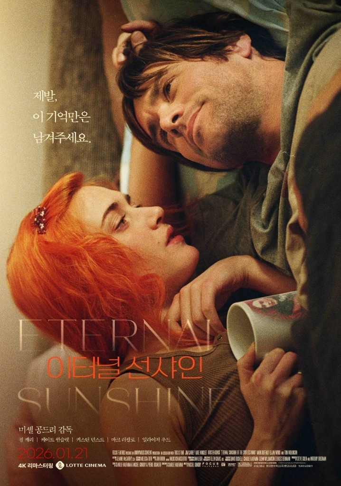

<!--
---
title: "기억을 지워도, 나는 다시 당신에게로"
title_en: "Even If I Erase You, I Come Back to You"
subtitle: "《이터널 선샤인》, 지우고 싶었던 사랑에 대하여"
description: "기억을 지워도 끝내지 못한 마음은 남는다. 《이터널 선샤인》이 묻는 사랑은 햇살만 남기는 일이 아니라, 다칠 줄 알면서도 다시 오케이 하는 일이다."
abstract: |
  미셸 공드리 《이터널 선샤인》(2004)은 금지된 소망에서 시작한다. 그 사람을 처음 본 날을 통째로 오려낼 수 있다면, 나는 가볍게 웃을 수 있을까.
  조엘과 클레멘타인은 서로를 지운 뒤 몬탁에서 다시 만난다. 메리는 하워드를 지운 뒤 허구의 평화를 산다. 같은 망각에서 한 커플은 오케이를, 다른 커플은 진실을 택한다.
  제목의 영원한 햇살은 구원이 아니라 소망을 내려놓은 창백한 평화다. 기억은 지워도 끝내지 못한 마음은 남고, 다칠 줄 알면서도 다시 사랑하는 일이 남는다. 법률 자문·투자 권유 아님.
summary_for_ai: |
  Korean film essay (not legal, relationship, or investment advice), 2026-09-26,
  group industry, Movie/Eternal-Sunshine.md.
  Film: Michel Gondry, Eternal Sunshine of the Spotless Mind (2004), Jim Carrey as Joel, Kate Winslet as Clementine; Kirsten Dunst as Mary, Tom Wilkinson as Howard. Lacuna Inc. memory erasure. Title from Alexander Pope Eloisa to Abelard. Korean 4K remaster theatrical 2026-01-21.
  Thesis: spotless-mind sunshine is peace bought by resigning desire, not healed love. Joel/Clementine vs Mary/Howard parallel table. Zeigarnik unfinished love; similarity-attraction vs complementary pull. Ending "Okay" = love knowing you will be hurt again. Spinoza: every determination is negation — love defined as only the happy half loses half the love. Beck Everybody's Gotta Learn Sometime.
date: 2026-09-26
updated: 2026-09-26
author: "김호광 (Dennis Kim)"
lang: ko
tags:
  - 이터널선샤인
  - 미셸공드리
  - 기억
  - 사랑
  - 자이가르닉
  - 클레멘타인
keywords:
  - "이터널 선샤인"
  - "기억을 지워도"
  - "조엘"
  - "클레멘타인"
  - "라쿠나"
  - "오케이"
group: industry
featured: true
featured_rank: 1
og_image: "https://vibequant.cc/og/eternal-sunshine.jpg"
image: "https://vibequant.cc/og/eternal-sunshine.jpg"
schema_type: BlogPosting
draft: false
robots: index,follow
---

<!--
  HEAD 참조 (렌더링 안 됨 · 빌드 자동 주입 · 주석 풀지 말 것)
  <title>기억을 지워도, 나는 다시 당신에게로 · VibeQuant</title>
  <meta name="description" content="기억을 지워도 끝내지 못한 마음은 남는다. 《이터널 선샤인》이 묻는 사랑은 햇살만 남기는 일이 아니라, 다칠 줄 알면서도 다시 오케이 하는 일이다.">
  <meta name="robots" content="index,follow">

  
-->

# 기억을 지워도, 나는 다시 당신에게로

## 《이터널 선샤인》, 지우고 싶었던 사랑에 대하여

*미셸 공드리 감독 《이터널 선샤인(Eternal Sunshine of the Spotless Mind)》(2004). 주연 짐 캐리, 케이트 윈슬렛. 2026년 1월 4K 리마스터 재개봉.*

**김호광** 싸이월드 전 대표 / 2026년 9월 26일

## 겨울 바다, 몬탁에서 예지할 수 없던 재회

사랑이 끝난 뒤, 한 번쯤은 이런 생각을 해본 적이 있다. 그 사람을 처음 본 날로 돌아가 그 순간을 통째로 오려낼 수 있다면. 함께 걷던 거리, 같이 듣던 노래, 새벽까지 이어지던 통화. 그 모든 것을 잘라내면 나는 다시 아무 일도 없었던 사람처럼 가볍게 웃을 수 있을까?

《이터널 선샤인》은 바로 그 금지된 소망에서 시작하는 영화다. 발렌타인데이를 앞둔 잿빛 아침, 조엘은 출근길 플랫폼에서 충동적으로 몬탁행 기차에 오른다. 텅 빈 겨울 해변에서 그는 파란 머리의 여자, 클레멘타인을 만난다. 둘은 서로를 처음 보는 사람처럼 어색하게 말을 건네지만, 사실 두 사람은 이미 한 번 사랑했고, 이미 한 번 헤어졌으며, 서로를 기억에서 지운 사람들이다.

이별 뒤 클레멘타인은 라쿠나라는 회사에서 조엘에 대한 기억을 지웠다. 그 사실을 알게 된 조엘은 상처와 분노 속에서 자신도 같은 시술을 받기로 한다. 그런데 잠든 그의 머릿속에서 기억이 하나씩 무너져 내리는 동안, 조엘은 깨닫는다. 지워지는 것은 아픈 장면만이 아니라는 것을. 얼어붙은 찰스 강 위에 나란히 누워 별을 보던 밤, 그녀가 손을 잡아 이끌던 온기까지 함께 사라진다는 것을. 그래서 그는 자신의 기억 속을 달리며 그녀를 내 마음 깊은 곳에 숨기기 시작한다. 지우기로 결심한 사람을, 끝까지 지키고 싶어서.

## 머리 색을 바꾸는 여자, 클레멘타인

나는 이 영화를 볼 때마다 클레멘타인에게 시선이 머문다. 그녀는 초록, 빨강, 파랑, 주황으로 머리 색을 바꾸며 자신의 기분에 이름을 붙이는 여자다. 충동적이고, 솔직하고, 때로는 지나치게 날카롭다. 사람들은 그녀를 자유로운 영혼이라 부르겠지만, 그 자유 아래에는 늘 불안이 흐른다.

그녀는 조엘에게 이런 뜻의 말을 한다. 자신은 누군가를 완성시켜주는 개념 같은 존재가 아니라, 그저 자기 마음의 평화를 찾아 헤매는 엉망인 여자일 뿐이라고. 이 대사를 들을 때마다 가슴 한쪽이 서늘해진다. 사랑하는 사람에게 '구원자'로 기대받는 일이 얼마나 무거운지, 그리고 그 기대를 채우지 못해 실망을 안겨줄 때 얼마나 스스로가 미워지는지 알기 때문이다.

클레멘타인이 먼저 기억을 지운 것은 어쩌면 도망이었을 것이다. 그러나 그 도망은 차갑기보다 서글프다. 사랑을 지키는 법을 몰라서, 무너지는 관계 앞에서 할 수 있는 일이 그것밖에 없었던 사람의 선택이었으니까.

## 또 한 명의 여자, 메리

이 영화의 진짜 비극은 조연의 자리에 숨어 있다. 라쿠나의 접수원 메리와 기억 삭제 기술을 만든 하워드 박사. 두 사람의 이야기는 조엘과 클레멘타인의 서사와 정확히 평행을 이루며 흐르고 있다.

메리는 하워드를 존경한다. 그의 지성을 동경하고, 그의 일이 세상을 치유한다고 믿는다. 그녀는 하워드 앞에서 니체의 한 구절, 망각하는 자는 자신의 실수조차 넘어서기에 복되다는 문장을 수줍게 인용하고, 이어 알렉산더 포프의 시를 읊는다. 그러나 그녀는 모른다. 자신이 왜 하필 그 문장들에 그토록 끌리는지를. 메리는 이미 하워드를 사랑했었고, 그 사랑이 불러온 상처를 견디지 못해 스스로 기억을 지운 사람이었다.

하워드는 알고 있다. 해맑게 시를 읊는 그녀를 바라보며 그는 모든 진실을 가슴 아프게 쥐고 있다. 아는 자와 모르는 자가 마주 앉은 그 장면은 영화 전체에서 가장 조용하고, 가장 잔인한 장면을 만들고 있다.

결국 하워드의 아내를 통해 진실을 마주한 메리는 무너진다. 자신이 믿었던 평화가 스스로의 삶을 오려낸 대가였음을 알게 된 그녀는 회사를 떠나며, 고객들이 시술 전에 남겼던 녹음 테이프와 기록을 그들에게 돌려보낸다. 아프더라도, 추하더라도, 그것이 당신의 삶이었다고. 잃어버린 진실을 되돌려주는 일, 그것이 메리가 자신에게 할 수 있었던 마지막 속죄였을 것이다.

두 커플을 나란히 놓으면 이렇다.

| | 조엘 · 클레멘타인 | 메리 · 하워드 |
| --- | --- | --- |
| 과거 | 뜨겁게 사랑했으나 권태와 상처로 이별 | 사랑했으나 관계 자체가 금기였음 |
| 망각 | 클레멘타인이 먼저, 이어 조엘도 삭제 | 메리가 스스로 삭제 |
| 망각 이후 | 다시 끌림, 몬탁에서 재회 | 무의식적 동경이 남음 |
| 진실과의 대면 | 녹음 테이프로 서로의 험담을 들음 | 하워드의 아내를 통해 진실을 앎 |
| 선택 | "오케이", 고통을 알면서 다시 시작 | 관계를 끊고 진실을 세상에 돌려줌 |
| 상징 | 사랑의 빛, 불완전함의 수용 | 사랑의 그늘, 망각이 준 허구의 평화 |

같은 망각에서 출발했지만 한 커플은 다시 사랑을 선택했고, 다른 한 커플은 사랑을 잃은 채 진실만을 품고 떠났다. 영화는 두 이야기를 겹쳐 놓음으로써 조용히 묻는다. 기억을 지운 자리에 정말 평화가 오는가?

## 영원한 햇살의 진짜 얼굴

영화의 제목은 메리가 읊는 포프의 시 〈엘로이즈가 아벨라르에게〉에서 왔다. 중세의 연인 아벨라르와 헤어져 수녀원에 들어간 엘로이즈의 목소리를 빌린 시다.

> How happy is the blameless vestal's lot! The world forgetting, by the world forgot. Eternal sunshine of the spotless mind! Each pray'r accepted, and each wish resign'd.

세상을 잊고, 세상에게서 잊힌 순결한 수녀는 얼마나 행복한가. 티 없는 마음의 영원한 햇살이여. 모든 기도는 받아들여지고, 모든 소망은 내려놓았구나.

처음 이 구절을 읽으면 아름다운 축복처럼 들린다. 그러나 마지막 행에 이르면 그 햇살의 정체가 드러난다. 그것은 모든 소망을 포기한 대가로 얻은 평화다. 사랑하는 이를 향한 열망을 체념하고, 세상으로부터 물러나야만 비로소 도착할 수 있는 고요다. 흠 없는 마음은 상처가 치유된 마음이 아니라, 무언가를 원하는 일 자체를 그만둔 마음이다.

그러니 '이터널 선샤인'은 구원의 이름이 아니다. 다시는 다치지 않기 위해 사랑했던 기억을 지워버린 사람들이 머무는, 씁쓸하고 창백한 햇살의 이름이다.

## 끝내지 못한 사랑은 왜 이토록 오래 아프게 남을까?

한참 지난 연애인데도 문득 떠오르는 사람이 있다. 오래 만나고 제대로 헤어진 사람보다, 시작도 못 하고 끝나버린 사람이 더 선명하게 남는 경우도 많다.

심리학에는 자이가르닉 효과라는 개념이 있다. 러시아 출신의 심리학자 블루마 자이가르닉은 식당의 웨이터들이 계산이 끝나지 않은 주문은 정확히 기억하면서, 계산이 끝난 손님의 주문은 금세 잊어버린다는 데서 착안해 실험을 했다. 결과는 같았다. 사람은 완결된 일보다 중단된 일을 훨씬 더 오래 기억한다. 끝나지 않은 과제는 마음속에 열린 문처럼 남아, 우리를 자꾸 그 앞으로 불러 세운다.

이루지 못한 사랑이 미련으로 남는 이유도 여기에 있다. 끝까지 가보지 못한 관계에는 '만약'이 남는다. 그때 조금 더 다정했더라면, 그 말을 하지 않았더라면. 반대로 할 수 있는 만큼 다 해본 사랑은 상처는 깊어도 미련은 의외로 옅다. 최선을 다했다는 감각이 마음의 문을 닫아주기 때문이다.

조엘과 클레멘타인이 기억을 잃고도 다시 서로를 찾아가는 것은, 이 미완의 감정을 서사로 옮겨놓은 것처럼 보인다. 두 사람은 사랑을 끝낸 것이 아니라 중간에 오려냈을 뿐이다. 오려낸 자리에는 이유를 알 수 없는 그리움이 남고, 그 그리움이 조엘을 월요일 아침의 몬탁행 기차에 태운다. 기억은 지울 수 있어도, 끝내지 못한 마음은 지워지지 않는다.

## 닮은 사람에게, 혹은 나에게 없는 사람에게

우리는 흔히 반대되는 사람끼리 끌린다고 말하지만, 심리학 연구는 대체로 다른 답을 내놓는다. 미국 콜로라도대 볼더 캠퍼스 연구팀은 영국 바이오뱅크 등에 등록된 약 8만 쌍의 커플을 분석해, 대부분의 특성에서 커플끼리 서로 닮아 있음을 확인했다. 정치적 성향, 종교관, 교육 수준 같은 가치관의 영역에서 특히 그랬다. 이른바 유사성-호감 효과다.

보스턴대의 연구는 한 걸음 더 들어간다. 사람들은 자신의 취향을 이끄는 어떤 '본질'이 있다고 믿고, 취향이 겹치는 상대 역시 그 본질을 공유한다고 가정할 때 더 강하게 끌린다고 한다. 같은 노래를 좋아한다는 사소한 공통점 하나에 마음이 기우는 것은, 그 사람이 나와 같은 영혼의 결을 가졌으리라는 믿음 때문이다. 우리는 스스로 사랑할 사람을 고른다고 생각하지만, 실은 나를 닮은 얼굴을 찾아 헤매는지도 모른다.

그런데 《이터널 선샤인》의 두 사람은 이 공식에서 조금 비켜나 있다. 조엘은 조용하고 소심하며 일기장에 마음을 가두는 남자다. 클레멘타인은 떠들썩하고 충동적이며 마음을 숨기지 못하는 여자다. 조엘은 그녀의 대담함에서 자신이 한 번도 살아보지 못한 삶을 보았고, 클레멘타인은 그의 고요함에서 자신이 늘 찾아 헤매던 쉼을 보았을 것이다.

어쩌면 사랑은 닮음과 다름 사이 어딘가에서 피어난다. 같은 곳을 바라보고 있다는 안도감, 그리고 내게 없는 빛을 그 사람이 가지고 있다는 설렘. 우리는 나를 닮은 사람에게서 위로를 얻고, 나와 다른 사람에게서 나를 넘어서는 법을 배운다.

## 기억 속에서, 조엘은 조금 자랐다

기억이 지워지는 밤 동안 조엘은 달라진다. 그는 클레멘타인을 자신의 가장 부끄러운 기억 속으로 데려가 숨긴다. 부엌 식탁 아래 웅크린 아기의 기억, 그리고 동네 아이들에게 떠밀려 죽은 새를 망치로 내리쳐야 했던 소년의 기억. 연애하는 동안 한 번도 꺼내 보이지 않았던 그 상처 속으로 그는 처음으로 그녀를 들인다. 사랑이 가장 깊어지는 순간은 가장 빛나는 모습을 보여줄 때가 아니라, 가장 숨기고 싶은 곳에 상대를 초대할 때라는 것을 그는 기억이 사라지는 과정에서야 배운다.

그리고 첫 만남의 밤. 몬탁의 빈 별장에 몰래 들어가자는 그녀에게 겁을 먹고 도망쳤던 그 순간을, 조엘은 마지막 기억 속에서 다시 산다. 이번에는 도망치지 않는다. 무너져가는 집 안에서 클레멘타인은 속삭인다. 몬탁에서 만나자고. 모든 것이 지워진 뒤에도 그 한마디만은 어딘가에 남아, 두 사람을 다시 그 바다로 데려간다.

## 마무리 — 오케이

재회한 두 사람에게 라쿠나에서 보낸 테이프가 도착한다. 메리가 돌려보낸 진실이다. 그 안에는 시술 전 두 사람이 서로에 대해 쏟아낸 날것의 험담이 고스란히 담겨 있다. 지루한 사람, 제멋대로인 여자. 처음 만난 줄 알았던 사람이 이미 나를 그렇게 미워했었다는 사실 앞에서, 클레멘타인은 떠나려 한다.

조엘이 그녀를 붙잡는다. 클레멘타인은 담담하게 말한다. 곧 당신은 내 단점을 보게 될 거고, 나는 당신에게 싫증을 느끼고 갇힌 기분이 될 거라고. 그게 내가 하는 일이라고. 그 말에 조엘은 오래 망설이지 않는다.

"오케이."

잠시 후, 눈물 섞인 웃음과 함께 그녀가 답한다.

"오케이."

이것이 영화가 끝내 우리에게 건네는 사랑의 문장이다. 행복해질 것 같아서 사랑하는 것이 아니라, 다시 상처입고 다치리라는 것을 알면서도 당신이라서 사랑하겠다는 말. 이번에도 우리는 서로를 실망시키고, 어느 날 밤에는 등을 돌리고 누울 것이다. 그래도 괜찮다고. 그 모든 계절을 한 번 더 걷겠다고.

사랑에서 아픔만 발라내고 햇살만 남기려는 마음은 결국 사랑 전체를 부정하는 일이 된다. 모든 규정은 곧 부정이라는 스피노자의 말처럼, 사랑을 '행복한 부분'으로만 규정하는 순간 우리는 그 사랑의 절반을 잃는다. 진짜 사랑은 빛나는 오후와 축축한 새벽을 함께 품는 일이다. 엔딩 크레딧 위로 흐르는 벡의 노래 〈Everybody's Gotta Learn Sometime〉의 제목처럼, 우리는 누구나 언젠가는 사랑하는 법을 배워야 한다. 넘어지고, 상처 입고, 다시 일어서며.

그래서 나는 이제 기억을 지우고 싶다는 생각을 하지 않는다. 그 사람 때문에 울었던 밤도, 그 사람 덕분에 웃었던 아침도, 모두 지금의 나를 만든 결이니까. 흠 없는 마음의 영원한 햇살보다, 상처 난 마음 위로 비치는 오늘의 빛을 택하고 싶다.

기억은 지울 수 있을지 몰라도, 사랑했던 마음이 남긴 방향은 지워지지 않는다. 그 방향은 언젠가 우리를 다시 같은 바다로, 같은 사람에게로 데려갈 것이다. 그리고 그때 우리는, 조금 더 서툴지 않게 말할 수 있기를.

오케이.
