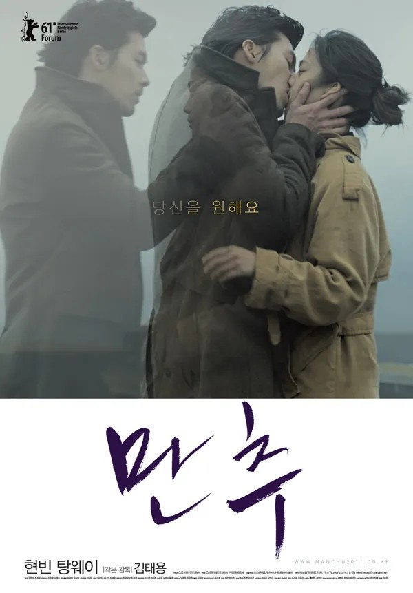

<!--
  HEAD 참조 (렌더링 안 됨 · 빌드 자동 주입 · 주석 풀지 말 것)
  <title>사랑은 시간을 선물하는 것 · VibeQuant</title>
  <meta name="description" content="결국 사랑은 시간을 선물하는 일이다. 〈만추〉의 사흘은 2년의 기다림을 가능하게 했다. 말보다, 판단 없이 곁에 머무는 그 시간이 사랑을 증명한다.">
  <meta name="robots" content="index,follow">

  
-->

# 사랑은 시간을 선물하는 것

## 영화 〈만추〉(2011)에 부치는 늦가을의 편지

*김태용 감독 〈만추(晚秋, Late Autumn)〉(2011). 주연 현빈, 탕웨이.*

**김호광** 싸이월드 전 대표 / 2026년 9월 25일

늦가을의 시애틀은 늘 조금 젖어 있다. 안개가 도시의 윤곽을 지우고, 사람들은 저마다의 외투 속으로 몸을 웅크린다. 김태용 감독의 〈만추(晚秋)〉는 바로 그 계절의 온도로 찍은 영화다. 이만희 감독의 1966년작을 새로 쓴 이 작품에서, 두 사람에게 주어진 시간은 고작 사흘. 그런데 이상하다. 그 짧은 사흘이 어떤 사람의 몇 년보다 길게 마음에 남는다.

영화평론가 이동진은 이 영화에 한 줄을 남겼다. **"결국 사랑은 시간을 선물하는 일."** 이 글은 그 한 줄에 대한 긴 답장이다.

## 1. 2537번, 사흘간의 외출

애나(탕웨이)에게는 이름보다 번호가 익숙하다. 수인번호 2537번. 폭력적인 남편을 죽인 죄로 7년째 복역 중인 그녀에게 어머니의 부고가 전해지고, 장례식에 다녀올 사흘이 허락된다.

시애틀로 향하는 버스. 쫓기듯 올라탄 한 남자가 차비가 모자란다며 그녀에게 돈을 빌린다. 훈(현빈). 외로운 여자들에게 시간을 팔아 사는 남자, 그리고 지금은 누군가에게서 도망치는 중인 남자. 그는 돈을 꼭 갚겠다며 억지로 자신의 시계를 그녀 손목에 채워준다. 애나는 대꾸도 없이 돌아선다.

7년 만에 돌아온 바깥세상은 그녀만 빼고 모두 변해 있다. 가족도, 거리도, 옛사랑도. 발길을 돌려 버스터미널로 향한 그곳에서, 애나는 다시 훈을 만난다. 그리고 장난처럼, 두 사람의 하루가 시작된다.

애나는 중국인, 훈은 한국인. 두 사람은 서로의 모국어가 아닌 영어로 말한다. 서툰 외국어로만 건넬 수 있는 말들, 그래서 오히려 더 조심스럽고 더 솔직해지는 말들. 이 영화의 대화는 늘 한 뼘쯤 비어 있고, 그 여백을 채우는 것은 침묵과 눈빛이다.

영화의 결정적인 전환은 놀이공원에서 찾아온다. 텅 빈 늦가을의 놀이공원, 멀리서 다투는 한 커플을 보며 훈이 남자의 대사를 멋대로 지어 더빙하기 시작한다. 한참을 무표정하게 지켜보던 애나가, 어느 순간 여자의 목소리를 입힌다. 남의 사랑싸움에 목소리를 빌려주는 그 몇 분 동안, 애나는 7년 만에 처음으로 자기 안의 말을 꺼낸다. 얼어붙었던 것이 녹는 소리는 그렇게, 남의 대사를 빌려서야 들려온다.

## 2. 왜 우리는 낯선 사람에게 마음을 여는가?

사흘. 서로의 이름조차 늦게 안 두 사람이 어떻게 사랑에 이를 수 있을까? 심리학은 이 물음에 의외로 다정한 답을 준다.

**불확실함은 끌림을 키운다.** 2011년 버지니아대 연구진(Whitchurch, Wilson & Gilbert)은 흥미로운 실험을 했다. 상대가 나를 좋아하는지 '확실히 아는' 사람보다, 좋아하는지 '알 수 없는' 사람이 오히려 더 강하게 끌렸다. 불확실함은 생각을 멈추지 못하게 하고, 자꾸 떠올리는 사이 마음이 깊어진다. 버스에서 억지로 채워준 시계, 이름도 묻지 않은 채 흩어진 첫 만남. 훈은 끝내 자신이 누구인지 다 말하지 않고, 애나는 과거를 좀처럼 열지 않는다. 서로를 알 수 없다는 사실이 두 사람을 서로에게서 눈 떼지 못하게 만든다.

**낯선 사람에게는 더 깊은 이야기를 할 수 있다.** 심리학자 지크 루빈은 이것을 '기차 안의 이방인' 현상이라 불렀다. 다시 볼 일 없는 사람, 나의 일상과 연결되지 않은 사람 앞에서 우리는 가족에게도 하지 못한 고백을 한다. 판단받을 두려움이 없기 때문이다. 사흘 뒤면 교도소로 돌아가야 하는 여자와, 내일을 장담할 수 없는 남자. 두 사람은 서로에게 가장 완벽한 '기차 안의 이방인'이다. 그리고 아서 아론의 연구가 보여주듯, 서로 조금씩 자신을 열어 보이는 일은 짧은 시간에도 놀라운 친밀감을 만들어낸다. 이 원리가 가장 선명하게 드러나는 순간이, 뒤에서 이야기할 두 단어짜리 중국어 수업이다.

**떨림은 어디에서 오는지 헷갈린다.** 흔들다리 위에서 만난 이성에게 더 끌린다는 더턴과 아론의 고전적 실험처럼, 긴장과 불안으로 뛰는 심장은 종종 설렘으로 오인된다. 언제 누가 훈을 찾아올지 모르고, 애나의 외출 시계는 쉬지 않고 줄어든다. 두 사람이 공유한 사흘은 처음부터 불안으로 두근거리는 시간이었고, 그 두근거림이 어느 순간 사랑의 이름을 얻는다.

무엇보다, 두 사람은 모두 '경계 밖'의 존재다. 한 사람은 사회로부터 격리되어 있고, 한 사람은 사회의 뒷골목에서 산다. 세상이 붙여준 가면을 쓸 필요가 없는 사람들끼리 만났을 때, 서로의 상처는 위협이 아니라 위로가 된다.

## 3. 하오(好)만 아는 남자, 그 뜻도 거꾸로 아는 남자

이 영화에서 가장 아릿한 장면은 사랑 고백이 아니라, 두 단어짜리 중국어 수업이다.

중국어를 한마디도 모르는 훈은 애나에게서 단어 두 개를 배운다. **하오(好, 좋다)** 와 **화이(坏, 나쁘다)**. 그런데 애나는 그 뜻을 거꾸로 가르쳐준다. 속마음을 들키고 싶지 않아서다.

그리고 애나는 중국어로 자신의 이야기를 시작한다. 7년 전의 일, 남편, 옛사랑, 무너져버린 삶. 알아들을 수 없는 훈은 그녀의 표정을 살피며 배운 대로 대답한다. 그녀가 아파 보일 때 "하오", 그녀가 웃을 때 "화이". 뜻을 거꾸로 알고 있는 남자의 대답은, 그래서 매번 틀리면서 매번 정확하다.

말이 통하지 않기에 할 수 있었던 고백. 알아듣지 못하기에 끝까지 들어줄 수 있었던 사람. 애나에게 필요했던 것은 이해가 아니라, 판단 없이 곁에 머물러 주는 누군가였는지도 모른다. 7년 동안 아무에게도 하지 못한 말을, 그녀는 가장 알아듣지 못할 사람에게 처음으로 털어놓는다.

언어가 벽이 되는 대신 피난처가 되는 순간. 〈만추〉는 사랑이 반드시 말로 증명되지 않는다는 것을, 이 두 단어로 보여주고 있다.

## 4. 2년 후, 휴게소 카페에서

사흘은 끝난다. 훈은 자신이 연루된 사건에 휘말리고, 애나는 약속된 시간에 맞춰 돌아가야 한다. 이별의 순간, 두 사람은 약속 하나를 남긴다. 애나가 출소하는 날, 헤어졌던 그 휴게소 카페에서 다시 만나자고.

그리고 2년 후. 애나는 그 카페에 앉아 있다. 커피 한 잔을 앞에 두고, 창밖을 바라보며, 그를 만나면 건넬 첫인사를 조용히 연습한다. 훈이 올지, 오지 않을지 영화는 끝내 보여주지 않는다.

하지만 어쩌면 그것은 중요하지 않다. 7년의 수감 생활 동안 무표정 뒤에 모든 것을 가두었던 여자가, 이루지 못한 옛사랑의 상처에 갇혀 있던 여자가, 이제는 누군가를 기다린다. 기다림은 미래를 믿는 사람만이 할 수 있는 일이다. 사흘의 만남이 그녀에게 돌려준 것은 한 남자가 아니라, **다시 무언가를 바랄 수 있는 마음**이었다.

사랑은 함께한 시간의 길이로 증명되지 않는다. 그 시간이 얼마나 깊이 새겨졌는가로 증명된다. 사흘이 2년의 기다림을 가능하게 했다면, 그것은 이미 실패한 사랑이 아니다. 누군가 우리에게 시간을 선물했고, 우리는 그 시간을 품고 다음 계절로 건너간다. 그것이 〈만추〉가 말하는 사랑이다.

## 5. 영화가 끝난 뒤, 한 곡 더

〈만추〉를 보았다면, 한 가지를 꼭 권하고 싶다. 엔딩 크레딧에 흐르는 노래는 판본에 따라 다르다. 방송이나 OTT에서는 영어 곡이 흐르지만, 중국어판과 블루레이에서는 **탕웨이가 직접 부른 중국어 주제곡 '만추(晚秋)'** 가 흐른다.

그리고 많은 이들이 이 중국어 버전을 더 오래 기억한다. 낮고 담담한 탕웨이의 목소리는 노래라기보다 애나의 독백에 가깝다. 스크린 위에서 끝내 다 말하지 못했던 그녀의 마음이, 크레딧이 올라가는 몇 분 동안 비로소 제 목소리를 얻는 것 같다.

过去的阴影紧随我流浪 / 과거의 그림자가 내게 바짝 붙어 떠돌아요

陌生的你像熟悉的阳光 / 낯선 당신은 익숙한 햇살 같이

提醒我身处在地球游荡 / 이 세상을 의미없이 방황하는 나를 깨워주네요

晚秋不晚 又何妨 / 늦가을이 끝나지 않은들 어때요

▶ [탕웨이 - 만추(晚秋) 듣기](https://www.youtube.com/watch?v=ApAsj4HVGCg)

과거의 그림자, 낯선 사람이 건넨 뜻밖의 온기, 그리고 늦가을이라도 괜찮다는 조용한 긍정. 영화가 사흘 동안 쌓아 올린 감정이 이 한 곡 안에서 천천히 가라앉는다.

영화를 다시 본다면, 화면이 꺼진 뒤에도 잠시 자리를 지켜보길. 〈만추〉의 진짜 마지막 장면은, 어쩌면 그 노래 속에 있다.

영화 **〈만추〉** 는 사랑이 시간을 선물하는 방식에 대한 이야기다. 사흘이라는 시간이 두 사람에게 평생의 계절을 선물했고, 2년의 기다림이 그 선물을 완성했다. 늦가을의 쓸쓸함 속에서도 사랑은 피어나고, 그 사랑은 시간이 지나도 사라지지 않는다. 다만 조금 더 깊이, 조금 더 조용히 남을 뿐이다.
