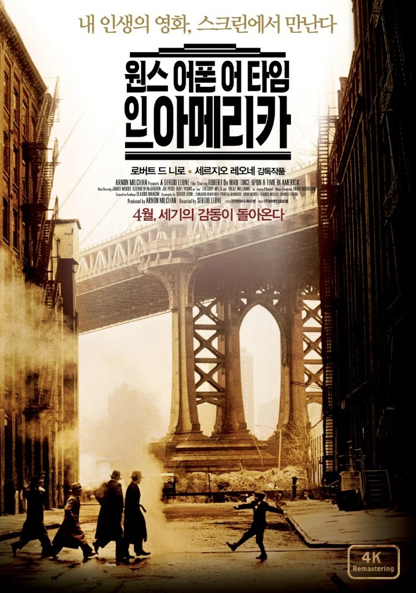

<!--
  HEAD 참조 (렌더링 안 됨 · 빌드 자동 주입 · 주석 풀지 말 것)
  <title>원스 어폰 어 타임 인 아메리카 · VibeQuant</title>
  <meta name="description" content="갱스터의 옷을 입은 긴 비가. 『원스 어폰 어 타임 인 아메리카』는 이민자의 꿈이 배신과 기억으로 남는 과정을 보여 주고, 잘려나간 영화 자신이 그 슬픔과 닮아 있다.">
  <meta name="robots" content="index,follow">

  
-->

# 원스 어폰 어 타임 인 아메리카

## 낯선 이민자의 꿈과 좌절, 그 달콤하고 잔인한 환영

*세르지오 레오네 감독 『원스 어폰 어 타임 인 아메리카(Once Upon a Time in America)』(1984). 주연 로버트 드 니로, 제임스 우즈, 엘리자베스 맥거번, 제니퍼 코넬리. 미국, 225분.*

**김호광** 싸이월드 전 대표 / 2026년 9월 29일

### 한 줄기 아편 연기 속에서

영화는 전화벨 소리로 시작한다. 끊기지 않고, 받는 이도 없이, 스물 몇 번이고 울려대는 그 소리. 1933년, 뉴욕 차이나타운의 어두운 아편굴에 한 사내가 몸을 누이고 있다. 그의 이름은 누들스(로버트 드 니로). 방금 전 그는 가장 소중한 친구들을 잃었고, 그 죽음의 원인이 자신이라고 믿는다. 흐릿한 램프 불빛 아래 아편 연기를 들이마시며 그는 눈을 감는다. 그리고 그 눈꺼풀 뒤편에서, 한 인간의 일생이 천천히 풀려나오기 시작한다.

세르지오 레오네의 유작 『원스 어폰 어 타임 인 아메리카』는 갱스터 영화의 옷을 입고 있지만, 그 속살은 한 편의 긴 비가(悲歌)다. 1920년대 금주법의 시대, 뉴욕 브루클린의 유대인 이민자 거리에서 자란 다섯 소년이 범죄자로 자라나고, 부를 쌓고, 서로를 잃어가는 이야기. 3시간 45분이라는 시간은 길다기보다 차라리 한 사람의 생애를 담기에 모자라 보인다.

### 창고 틈새로 본 첫사랑

소년 누들스의 세계는 가난하고 거칠었다. 소매치기와 좀도둑질로 하루를 버티던 그에게 두 개의 운명이 한꺼번에 찾아온다. 하나는 맥스(제임스 우즈)라는 영리하고 대담한 소년. 다른 하나는 데보라(소녀 시절 제니퍼 코넬리, 성인 시절 엘리자베스 맥거번)다.

화장실 벽 틈새로, 밀가루 포대가 쌓인 창고 안에서 홀로 발레를 추는 소녀를 훔쳐보던 누들스의 눈빛. 엔니오 모리코네의 〈데보라의 테마〉가 흐르는 그 장면은 영화 전체에서 가장 순결한 순간이다. 그러나 데보라는 누들스를 향해 문을 반쯤만 연다. 그녀는 이 게토를 벗어나 더 높은 곳으로 날아오르고 싶어 했고, 거리의 불량배와 함께 머물 생각이 없었다.

소년들은 맥스를 중심으로 뭉쳐 작은 갱단을 이룬다. 그리고 첫 번째 상실이 찾아온다. 막내 도미닉이 경쟁 조직의 총에 맞아 쓰러지며 남긴 마지막 말, "누들스… 나 미끄러졌어." 격분한 누들스는 칼을 휘둘렀고, 그 대가로 긴 감옥살이를 한다.

### 금주법의 황금기, 그리고 무너지는 것들

출소한 누들스를 기다리던 것은 이미 밀주 사업으로 몸집을 불린 맥스와 친구들이었다. 금주법이라는 시대의 틈새는 이민자 소년들에게 부와 권력으로 가는 지름길이 되어주었다. 샴페인이 흐르고, 자동차가 번쩍이고, 도시는 그들의 것처럼 보였다.

하지만 누들스는 끝내 데보라를 붙잡지 못한다. 바다가 보이는 텅 빈 레스토랑을 통째로 빌려 그녀와 단둘이 보낸 밤, 그는 평생 품어온 마음을 고백한다. 그러나 할리우드로 떠나겠다는 데보라 앞에서 그는 가장 추악한 방식으로 그녀를 붙잡으려 하고, 그 폭력으로 자신의 사랑을 스스로 산산조각 낸다. 이 장면은 보는 이를 불편하게 만든다. 레오네는 주인공을 미화하지 않는다. 누들스가 잃은 것 중 상당수는, 그가 스스로 무너뜨린 것들이다.

금주법이 폐지될 무렵, 맥스는 연방준비은행을 털겠다는 무모한 계획을 세운다. 친구의 파멸을 막으려던 누들스는 경찰에 정보를 흘리고, 그날 밤 맥스와 친구들은 싸늘한 시신이 되어 거리에 눕는다. 영화의 첫 장면, 아편굴의 누들스는 바로 이 죄책감에서 도망치고 있었던 것이다.

### 35년 만의 귀환

1968년. 백발이 성성한 누들스가 뉴욕으로 돌아온다. 발신인을 알 수 없는 편지 한 통이 그를 불러낸 것이다. 옛 친구 팻 모가 물는다. "그동안 뭐 하고 지냈어?" 누들스는 짧게 답한다. "일찍 잠자리에 들었지." 35년이라는 세월이 그 한마디에 눌려 담긴다.

누들스는 과거의 흔적을 따라가다 믿을 수 없는 진실에 닿는다. 죽은 줄 알았던 맥스는 살아 있었다. 친구들을 희생시키고, 누들스의 배신을 역이용해 자신의 죽음을 연출한 뒤, 그는 새로운 이름으로 권력의 정점에 올라 있었다. 크리스토퍼 베일리 장관. 그리고 그의 곁에는 데보라가 있었다. 누들스가 평생 잊지 못한 여인이, 누들스의 삶을 훔친 친구의 여인이 되어 있었던 것이다.

부패 스캔들로 몰락 직전에 선 맥스는 누들스에게 자신을 죽여달라고 청한다. 복수의 기회가 손에 쥐어진 그 순간, 누들스는 조용히 고개를 젓는다. 그리고 끝까지 그를 '장관님'이라 부르며 돌아선다. 그에게 맥스는 이미 오래전에 죽은 친구였다. 저택을 나서는 누들스의 등 뒤로 쓰레기 수거 트럭 한 대가 지나가고, 맥스는 그렇게 영화에서 사라진다.

### 세 겹의 주제 - 꿈, 욕망, 그리고 기억

**첫째, 이민자의 꿈과 그 배신.** 이탈리아인 레오네는 평생 '바깥에서 바라본 미국'을 그려온 감독이다. 이 영화 속 갱스터들은 모두 가난한 유대인 이민자의 자식들이다. 그들의 범죄는 가난과 차별이라는 벽 앞에서 선택한 생존의 방식이었다. 그러나 그들이 좇은 아메리칸 드림은 끝내 더 큰 폭력과 배신으로 이어졌고, 가장 성공한 자는 가장 많이 배신한 자였다. 맥스가 이름을 바꾸고 정치인으로 변신하는 결말은, 뒷골목의 범죄와 국가 권력이 사실은 같은 뿌리에서 자란 나무라는 레오네의 냉소다.

**둘째, 우정이라는 이름의 욕망.** 맥스는 누들스를 사랑했고, 동시에 누들스가 가진 모든 것을 원했다. 그의 자리, 그의 여자, 그의 삶 전체를. 두 사람의 관계는 우정과 경쟁, 애정과 질투가 뒤엉킨 채 끝까지 풀리지 않는다. 맥스가 데보라를 곁에 둔 것은 사랑이라기보다 누들스를 향한 마지막 승리에 가까워 보인다.

**셋째, 시간과 기억.** 영화는 1920년대, 1930년대, 1968년을 자유롭게 넘나든다. 그 흐름은 연대기가 아니라 기억의 흐름을 따른다. 기억은 순서대로 오지 않는다. 한 곡의 노래, 한 장의 사진, 거울에 비친 얼굴 하나가 수십 년의 시간을 단숨에 건너게 한다. 그리고 영화는 다시 1933년의 아편굴로 돌아가, 누들스의 기묘한 미소 위에서 멈춘다. 그 미소의 의미를 두고 지금도 해석은 엇갈린다. 1968년의 모든 이야기가 아편에 취한 젊은 누들스의 몽상이었다고 보는 이도 있고, 죄책감에서 잠시 풀려난 인간의 안식이라고 보는 이도 있다. 레오네는 끝내 답을 주지 않았다. 어쩌면 기억이란 원래 그런 것이리라. 우리가 스스로에게 들려주는, 조금씩 고쳐 쓴 이야기.

### 잘려나간 영화, 되찾은 걸작

이 작품은 영화 자체만큼이나 서글픈 운명을 겪었다. 미국 배급사는 레오네의 동의 없이 영화를 139분으로 줄이고, 과거와 현재가 교차하는 구조를 시간 순서대로 이어 붙였다. 한국에서는 1시간 50분 남짓으로 잘려나가는 수모를 겪었다. 기억의 결을 따라 흐르던 영화는 그렇게 평범한 갱스터 연대기로 전락했고, 흥행과 비평 모두에서 외면받았다. 레오네는 그 상처를 안은 채 5년 뒤 세상을 떠났다.

하지만 시간은 결국 작품의 편에 섰다. 원래의 모습이 복원되자 영화는 비로소 제 목소리를 되찾았고, 오늘날에는 갱스터 장르의 정점을 논할 때 빠지지 않는 이름이 되었다. 감독이 떠난 뒤에야 인정받은 걸작이라는 사실은, 이 영화가 말하는 '너무 늦게 도착한 것들'의 슬픔과 묘하게 닮아 있다.

### 옛날 옛적, 아메리카에서

『원스 어폰 어 타임 인 아메리카』는 '옛날 옛적에'라는 동화의 첫 문장을 제목으로 빌렸다. 그러나 이 영화에 동화 같은 결말은 없다. 가난한 소년들은 부자가 되었지만 행복해지지 못했고, 사랑은 이루어지지 않았으며, 우정은 배신으로 끝났다. 남은 것은 기억뿐이다. 창고 틈새로 보았던 소녀의 춤, 거리에 쓰러진 막내의 마지막 목소리, 그리고 끝내 받지 못한 전화벨 소리.

그 모든 것을 품고 누들스는 35년을 살았다. 이민자의 아이로 태어나 이 거대한 나라에 뿌리내리려 했던 한 사내의 일생. 그것은 곧 아메리카라는 이름의, 달콤하고 잔인한 환영의 초상이다.

> **"그동안 뭐 하고 지냈어?"** **"일찍 잠자리에 들었지."**
>
> — 35년 만에 돌아온 누들스와 팻 모의 대화 중에서
