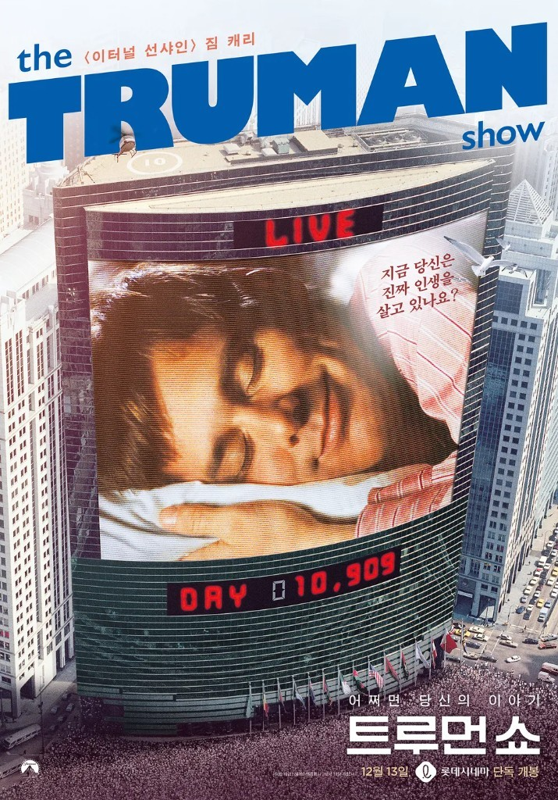

<!--
  HEAD 참조 (렌더링 안 됨 · 빌드 자동 주입 · 주석 풀지 말 것)
  <title>영화 트루먼쇼 - 모두가 가짜인 시대의 진정 하나뿐인 감정 · VibeQuant</title>
  <meta name="description" content="모두가 배우인 세상에서도 트루먼은 진짜였다. 《트루먼 쇼》가 묻는 것은 감시가 아니라 카메라가 달리지 못한 마음이며, 그 마음을 따라 문을 여는 작별이다.">
  <meta name="robots" content="index,follow">

  
-->

# 영화 트루먼쇼 - 모두가 가짜인 시대의 진정 하나뿐인 감정

## 《트루먼 쇼》, 가짜들로 가득한 세계 안의 단 한 명의 진짜

*피터 위어 감독 《트루먼 쇼(The Truman Show)》(1998). 주연 짐 캐리, 에드 해리스, 로라 리니. 각본 앤드루 니콜.*

**김호광** 싸이월드 전 대표 / 2026년 9월 27일

## 1. 완벽하게 조작된 아침

아침 햇살이 하얀 울타리 위로 쏟아진다. 잔디는 늘 같은 길이로 깎여 있고, 바다는 언제나 같은 빛깔로 반짝인다. 현관문을 열고 나온 남자가 이웃에게 손을 흔든다.

"굿모닝! 아, 혹시 못 볼지도 모르니까 - 좋은 오후, 좋은 저녁, 좋은 밤 보내세요!"

트루먼 버뱅크. 서른을 앞둔 보험회사 직원. 간호사인 아내 메릴, 어린 시절부터 곁을 지켜 온 친구 말론, 그리고 한 번도 떠나 본 적 없는 섬마을 시헤이븐. 그는 이것이 세상의 전부라고 믿는다.

그러나 이 마을의 하늘은 거대한 돔의 천장이고, 태양은 조명이며, 비는 스프링클러에서 쏟아진다. 트루먼은 태어나기도 전에 한 방송사에 입양된 아이였다. 그의 첫 울음부터 첫걸음, 첫사랑과 결혼까지, 삶의 모든 순간이 5,000대의 카메라에 담겨 하루 24시간, 전 세계로 생중계된다. 아내도, 친구도, 어머니도, 길에서 스치는 행인까지도 모두 배우다. 이 세계에서 대본을 모르는 사람은 오직 한 명, 트루먼뿐이다.

그의 이름은 트루먼(Truman). 가짜들로 가득한 세계에 홀로 놓인 단 한 명의 '진짜 사람(True-man)'이다.

## 2. "혹시 못 볼지도 모르니까" - 아침 인사에 숨은 작별

트루먼의 아침 인사는 유쾌한 말버릇처럼 들린다. 하지만 가만히 귀 기울이면, 그것은 이상한 인사다. 좋은 아침을 빌면서, 동시에 오늘 다시는 만나지 못할 가능성을 미리 헤아린다. 만남의 인사 안에 작별이 접혀 있다.

어쩌면 트루먼의 마음 가장 깊은 곳은 알고 있었는지도 모른다. 자신이 언젠가 이곳을 떠나리라는 것을. 사무실 창밖으로 세계 지도를 바라보고, 동료에게 피지까지 가려면 얼마나 드느냐고 묻고, 여행사 벽에 붙은 '여행은 위험합니다'라는 포스터 앞에서 발걸음을 돌리던 남자. 그는 매일 아침 웃는 얼굴로, 아무도 눈치채지 못하게 조금씩 작별을 연습하고 있었다.

## 3. 실비아 - 세상의 진실을 알려 준 단 한 사람

대학 시절, 트루먼은 도서관에서 한 여학생을 보고 마음을 빼앗긴다. 제작진이 그에게 짝지어 준 여자는 메릴이었지만, 트루먼의 시선은 대본 밖의 엑스트라에게로 흘러갔다. 가슴에 "이건 어떻게 끝나죠?"라고 적힌 배지를 단 여자. 쇼 안에서의 이름은 로렌, 진짜 이름은 실비아.

두 사람은 몰래 빠져나가 밤바다로 달려간다. 카메라가 따라붙기 전의 짧은 순간, 실비아는 다급하게 속삭인다. 이건 전부 가짜라고, 모두가 당신을 보고 있다고, 여기서 나가야 한다고. 그러나 말이 끝나기도 전에 한 남자가 차를 몰고 나타나 그녀를 끌고 간다. 자신을 아버지라 소개한 그 남자는 딸이 정신이 오락가락한다며, 가족이 피지로 떠날 거라는 말을 남긴다.

그날 이후 트루먼은 실비아를 한 번도 만나지 못한다. 대신 그는 잡지 속 여자들의 눈, 코, 입술을 한 조각씩 오려 붙이며 그녀의 얼굴을 다시 완성하려 한다. 기억 속에만 남은 사람을, 가짜 세상의 조각들로 끝내 붙잡아 두려는 몸짓. 영화에서 가장 쓸쓸하고 아름다운 장면이다.

실비아는 시스템에 순응하지 않았다. 대본을 거슬렀고, 그 대가로 쫓겨났다. 그리고 쇼 밖에서 '**트루먼을 해방하라**'는 운동을 벌이며, 화면 너머의 그를 끝까지 기다린다. 진정한 연인이란 이런 것이다. 상대를 내 곁에 묶어 두는 사람이 아니라, 상대가 진실 속에서 스스로 걸어갈 수 있도록 문을 가리켜 주는 사람. 실비아가 트루먼에게 준 것은 달콤한 약속이 아니라 불편한 진실이었고, 바로 그 진실이 그녀의 사랑이었다.

## 4. 말론 — 진심과 대본 사이에 갇힌 친구

말론은 트루먼의 가장 오래된 친구다. 어린 시절부터 함께 뛰놀았고, 힘들 때면 늘 맥주 여섯 캔을 들고 나타났다. 그러나 그 역시 배우다. 본명은 루이스 콜트레인.

트루먼이 세상을 의심하기 시작한 어느 밤, 두 사람은 공사 중인 다리 위에 나란히 앉는다. 말론은 트루먼의 눈을 바라보며 말한다. 만약 모든 게 음모라면 자신도 한패라는 뜻이겠지만, 자신은 결코 트루먼에게 거짓말을 하지 않을 거라고. 그 순간 카메라는 알려 준다. 그 말이 한 단어씩, 이어폰을 통해 크리스토프에게서 흘러나오고 있었다는 것을.

"**내가 너에게 거짓말을 할 리 없잖아**"라는 말조차 거짓말이었던 우정. 그리고 곧이어 말론은 안개 속에서 트루먼의 아버지를 데려온다. 오래전 바다에서 죽은 줄 알았던 아버지를. 트루먼이 흐느끼며 아버지를 끌어안는 그 순간은 쇼 역사상 최고의 장면으로 연출된다.

말론은 트루먼을 아낀다. 그 애정은 아마 진심일 것이다. 하지만 그 진심은 끝내 대본 밖으로 한 발짝도 나오지 못한다. 말론의 비극은 악의가 아니라 무력함에 있다. 그는 알고 있다. 자신의 우정이 친구를 가두는 창살이 되고 있다는 것을. 그럼에도 그는 이어폰을 빼지 않는다. 시스템에 종속된 선한 사람, 어쩌면 우리 대부분의 얼굴이 이와 가장 닮아 있다.

진정한 친구란 무엇일까? 곁에 오래 있어 준 사람이 아니라, 결정적인 순간에 대본을 찢고 진실을 말해 줄 수 있는 사람. 말론은 그 한 번을 끝내 하지 못했다.

## 5. 메릴 — 광고로 사랑을 말하는 아내

메릴 버뱅크. 본명은 한나 길. 그녀는 트루먼의 아내를 연기하는 배우이자, 이 쇼의 가장 충실한 광고 모델이다.

트루먼 쇼에는 광고 시간이 따로 없다. 모든 광고는 트루먼의 일상 속에 스며든다. 메릴은 부엌에서 '셰프스 팰' 조리 도구를 꺼내 들며 그 장점을 조목조목 읊고, 새로 산 잔디깎이를 자랑하며 카메라를 향해 미소 짓는다. 결혼식 사진 속 그녀의 손가락은 몰래 교차되어 있다. 이 결혼은 처음부터 거짓 맹세였다는 작은 표식이다.

가장 섬뜩한 장면은 부부 싸움이다. 트루먼이 무너져 내리며 진실을 추궁하는 순간, 메릴은 갑자기 신제품 코코아 음료 '모코코아'를 들어 올린다. 니카라과 산 천연 코코아 콩으로 만들었다고, 인공 감미료는 없다고. 남편이 울부짖는 한가운데서 그녀는 상품을 판다. 트루먼이 소리친다. 지금 대체 누구한테 말하는 거냐고.

메릴에게 결혼은 계약이었고, 남편은 상대역이었다. 트루먼의 의심이 깊어질수록 그녀의 연기는 흔들리고, 결국 그녀는 쇼를 떠난다. 메릴이 보여 주는 것은 사랑의 반대편이다. 사랑하는 척은 할 수 있지만, 사랑은 연기할 수 없다. 그 차이를 트루먼은 말로 설명하지 못했지만, 몸으로 느끼고 있었다.

## 6. 크리스토프 - 신의 자리에 앉은 연출가

트루먼 쇼의 창조자 크리스토프는 달처럼 생긴 거대한 조정실에서 세상을 내려다본다. 그는 날씨를 만들고, 해를 띄우고, 사람을 배치하고 지운다. 트루먼이 바다로 나가지 못하도록 어린 시절 낚시 여행에서 아버지가 폭풍우에 휩쓸려 죽는 장면을 연출해 물에 대한 공포를 심은 것도 그였다.

인터뷰에서 그는 담담하게 말한다. "우리는 주어진 세계의 현실을 그대로 받아들입니다." 트루먼이 진실을 모르는 이유는 단 하나, 의심할 이유가 없었기 때문이라는 것이다.

크리스토프는 스스로를 악인이라 여기지 않는다. 그는 트루먼에게 바깥보다 안전한 세상을 선물했다고 믿는다. 폭력도, 가난도, 배신도 없는 완벽한 마을. 하지만 그가 잊은 것이 있다. 모든 것이 허락된 감옥도 여전히 감옥이라는 사실. 그리고 사랑은 연출할 수 없다는 사실. 크리스토프가 설계한 수천 개의 장면 중, 트루먼이 실비아를 사랑하게 된 것만은 그의 각본에 없었다.

## 7. 폭풍의 바다, 하늘의 벽

마침내 트루먼은 지하실의 비밀 통로로 카메라를 따돌리고 사라진다. 방송 30년 만에 처음으로 화면이 멈추고, 시청률은 치솟는다. 한밤중에 인공 태양이 떠오르고, 마을 사람들이 줄지어 그를 찾아 나선다. 그리고 그들은 발견한다. 물을 그토록 두려워하던 남자가 작은 돛단배 한 척에 몸을 싣고 바다 한가운데로 나아가고 있는 모습을.

크리스토프는 폭풍을 명령한다. 파도가 배를 삼키고, 트루먼은 돛대에 몸을 묶은 채 하늘을 향해 외친다. 이게 당신이 할 수 있는 전부냐고, 나를 멈추려면 죽여야 할 거라고. 두려움이 가장 깊은 곳에서, 그는 가장 자유로워진다.

폭풍이 멎고, 잔잔해진 바다 위로 배가 미끄러지다 - 쿵. 뱃머리가 하늘에 부딪힌다. 파란 하늘은 벽에 칠해진 그림이었다. 트루먼은 그 벽을 손바닥으로 쓸어 보고, 주먹으로 두드리며 무너지듯 운다. 그의 평생이 한 장의 배경화였다.

## 8. 마지막 인사

벽을 따라 걷던 트루먼 앞에 계단이 나타난다. 그 끝에는 작은 문 하나. EXIT.

그때, 하늘에서 목소리가 들려온다. 크리스토프가 처음으로 트루먼에게 직접 말을 건다.

"아무것도 진짜가 아니었나요?" 트루먼이 묻는다. "너는 진짜였다." 크리스토프가 답한다.

그는 말한다. 바깥세상에도 이곳보다 더 많은 진실은 없다고. 똑같은 거짓말과 속임수뿐이지만, 자신의 세상에서는 두려워할 것이 없다고. 너보다 내가 너를 더 잘 안다고.

트루먼이 대답한다. "내 머릿속에는 카메라를 달지 못했잖아요."

그리고 긴 침묵. 전 세계가 숨을 죽인다. 트루먼은 천천히 돌아서서, 늘 그랬듯 환하게 웃는다.

"혹시 못 볼지도 모르니까 - 좋은 오후, 좋은 저녁, 좋은 밤 보내세요."

그는 무대 위의 배우처럼 정중하게 허리 숙여 인사하고, 어둠 속으로 걸어 나간다.

30년 동안 반복된 그 인사가 처음으로 진짜 뜻을 얻는 순간이다. 매일 아침의 농담 같던 작별은 이제 진짜 작별이 되었다. 그리고 이 마지막 인사는 크리스토프를 향한 조롱도, 원망도 아니다. 그것은 쇼의 주인공으로서의 삶에 바치는 마지막 커튼콜이자, 이제부터는 누구의 각본도 아닌 자신의 삶을 살겠다는 선언이다. 연기를 끝내는 방식으로, 그는 비로소 진짜가 된다.

## 9. 그리고, 채널이 돌아간다

전 세계가 환호한다. 술집에서, 욕조에서, 거실에서 사람들이 끌어안고 운다. 실비아는 문을 박차고 아파트를 뛰쳐나간다. 그를 만나러.

그러나 카메라는 마지막으로 주차장 경비원 두 사람을 비춘다. 30년 드라마의 결말을 지켜본 그들은 잠시 멍하니 있다가 말한다. 다른 건 뭐 하지? 편성표 어디 있어?

한 인간의 해방이 누군가에게는 그저 끝난 프로그램일 뿐이다. 트루먼의 삶을 30년간 훔쳐본 사람들은 단 한 번도 그를 꺼내 달라고 요구하지 않았다. 그들은 트루먼을 응원했지만, 동시에 그 감옥의 시청률이 되어 주었다. 이것이 이 영화의 가장 서늘한 윤리적 질문이다. 누군가의 고통을 지켜보며 눈물 흘리는 것과, 그 고통을 멈추게 하는 것은 전혀 다른 일이다. 가해자는 크리스토프 한 사람이 아니었다. 리모컨을 쥔 모든 손이었다.

## 10. 모두가 가짜인 시대에

《트루먼 쇼》가 개봉한 1998년, 이 영화는 과장된 우화처럼 보였다. 하지만 스물여덟 해가 지난 지금, 이 영화는 다큐멘터리처럼 읽힌다.

**자유 의지와 결정론.** 트루먼의 삶은 철저히 설계되어 있었다. 그가 만날 사람, 두려워할 것, 사랑할 여자까지. 그럼에도 그는 선택했다. 크리스토프가 심어 놓은 공포를 넘어서 바다로 나아갔다. 모든 조건이 결정되어 있는 세계에서도, 인간은 그 조건에 '아니오'라고 말할 수 있다. 자유란 조건이 없는 상태가 아니라, 주어진 조건을 거슬러 한 걸음을 내딛는 행위다.

**현실과 가상.** 오늘 우리가 보는 뉴스, 추천받는 영상, 마음을 빼앗기는 광고는 누가 고른 것일까. 알고리즘은 크리스토프처럼 친절하다. 우리가 좋아할 만한 것만 보여 주고, 불편한 것은 조용히 지운다. 시헤이븐의 하늘처럼, 그 벽은 너무 매끄러워서 부딪히기 전까지는 벽인 줄도 모른다.

**인공지능과 진실.** 이제 기계는 사람의 목소리를 흉내 내고, 존재하지 않는 얼굴을 만들고, 누구보다 다정한 위로의 문장을 쓴다. 진짜와 가짜의 경계가 흐려지는 시대에, 무엇이 진실인지 묻는 일은 점점 더 어려워진다. 어쩌면 트루먼이 그랬듯, 우리에게 남은 마지막 기준은 바깥이 아니라 안쪽에 있는지도 모른다. 카메라가 닿지 못하는 곳, 어떤 알고리즘도 대신 느껴 줄 수 없는 곳. 누군가를 향한 설명할 수 없는 그리움, 이유 없이 끌리는 진실에 대한 갈망. 그것만은 아직 연출될 수 없다.

**진정한 친구와 연인.** 말론은 30년을 곁에 있었지만 진실을 말하지 못했다. 실비아는 단 하룻밤을 함께했지만 진실을 말했다. 관계의 깊이는 함께한 시간이 아니라, 진실 앞에서 어느 편에 서느냐로 결정된다. 나를 편안하게 하는 사람보다, 나를 자유롭게 하는 사람. 그것이 친구이고, 그것이 연인이다.

**윤리.** 크리스토프는 트루먼을 사랑한다고 믿었다. 시청자들은 트루먼을 응원한다고 믿었다. 그러나 동의 없는 사랑은 소유이고, 행동 없는 응원은 구경이다. 한 사람의 삶을 그의 동의 없이 설계하고 소비하는 일 — 그것이 아무리 선의로 포장되어 있어도, 윤리는 거기서 무너진다.

## 11. 문 밖의 어둠

문 너머에는 무엇이 있었을까? 영화는 보여 주지 않는다. 그 너머는 그저 어둠이다.

크리스토프의 말대로, 바깥세상에도 똑같은 거짓말과 속임수가 기다리고 있을지 모른다. 트루먼은 상처받고, 실망하고, 길을 잃을 것이다. 그러나 그 모든 것은 이제 그의 것이다. 누군가 설계한 행복이 아니라, 스스로 선택한 불행까지도.

완벽하게 조작된 안전보다, 불완전하지만 진짜인 삶. 모두가 가짜인 세상에서도 가짜가 될 수 없었던 단 하나의 감정인 사랑, 그리고 진실을 향한 그리움. 그것이 한 남자를 하늘의 벽 앞까지 데려갔고, 마침내 그 문을 열게 했다.

오늘 아침, 우리도 누군가에게 인사를 건넨다. 그 인사가 대본의 한 줄인지, 우리 자신의 목소리인지 한 번쯤 물어볼 일이다.

그리고 언젠가, 우리에게도 저 문 앞에 서는 날이 온다면 트루먼처럼 웃으며 이렇게 말할 수 있기를.

> **"Good morning, and in case I don't see ya — good afternoon, good evening, and good night!"**
>
> **"혹시 못 볼지도 모르니까 — 좋은 오후, 좋은 저녁, 좋은 밤 보내세요!"**
