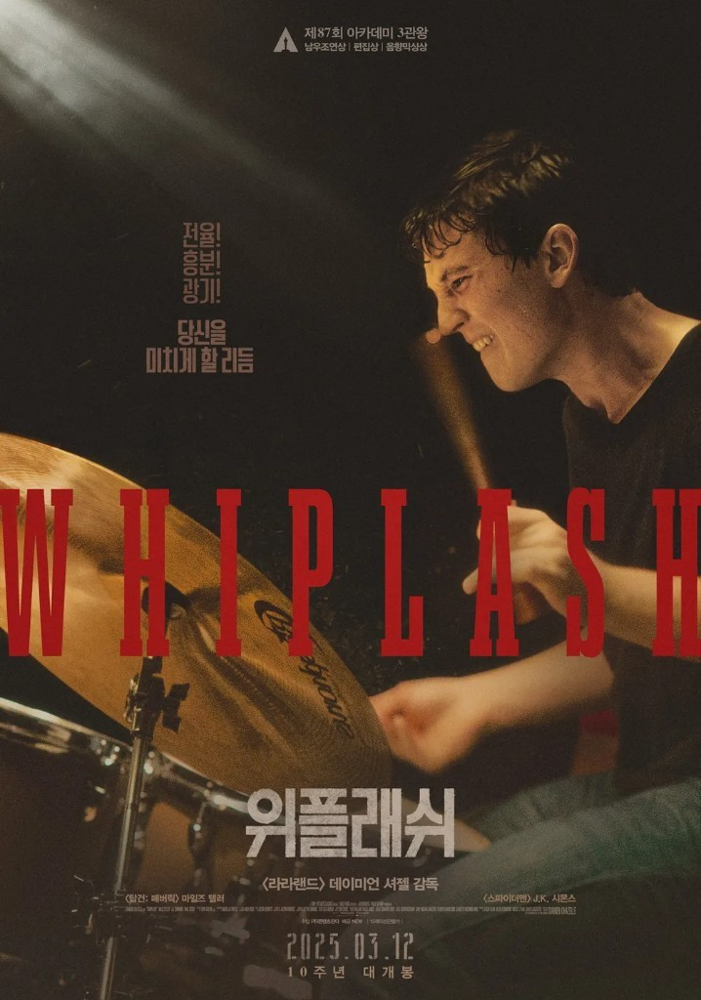

<!--
---
title: "위플래쉬, 완벽을 향한 집착"
title_en: "Whiplash — The Obsession with Perfection"
subtitle: "피가 마르지 않는 드럼 앞에서, 그 피는 무엇을 위한 것이었는가"
description: "〈위플래쉬〉는 완벽을 향한 채찍이 사람을 어떻게 만드는지를 묻는다. 그 피는 무엇을 위한 것이었는가. 위대해지지 않아도, 우리는 살아갈 자격이 있다."
abstract: |
  데이미언 셔젤 〈위플래쉬〉(2014). 마일스 텔러의 앤드류와 J.K. 시몬스의 플레처.
  잘했어보다 해로운 말은 없다는 신화, 생존자 편향의 찰리 파커, 카네기홀의 마지막 솔로.
  채찍 없이도 사람은 자랄 수 있다. 법률 자문·투자 권유 아님.
summary_for_ai: |
  Korean film/society essay (not legal or investment advice), 2026-10-07,
  group industry, Movie/Whiplash.md. Slug whiplash.
  Film: Damien Chazelle, Whiplash (2014). Miles Teller as Andrew Neiman, J.K. Simmons as Terence Fletcher.
  Thesis: perfection as poison; "good job" myth; survivor bias of Charlie Parker anecdote; Caravan finale as ambiguous victory.
  Korea: exam/competition culture, El Sistema-style education, failure as choice not dropout. Closing: forgotten at 90 vs remembered at 34 — the dinner table as love, not fame.
date: 2026-10-07
updated: 2026-10-07
author: "김호광 (Dennis Kim)"
lang: ko
tags:
  - 위플래쉬
  - 데이미언셔젤
  - 완벽주의
  - 마일스텔러
  - JK시몬스
  - 채찍
keywords:
  - "위플래쉬"
  - "완벽을 향한 집착"
  - "플레처"
  - "잘했어"
  - "캐러밴"
  - "데이미언 셔젤"
group: industry
featured: true
featured_rank: 1
og_image: "https://vibequant.cc/og/whiplash.jpg"
image: "https://vibequant.cc/og/whiplash.jpg"
schema_type: BlogPosting
draft: false
robots: index,follow
---

<!--
  HEAD 참조 (렌더링 안 됨 · 빌드 자동 주입 · 주석 풀지 말 것)
  <title>위플래쉬, 완벽을 향한 집착 · VibeQuant</title>
  <meta name="description" content="〈위플래쉬〉는 완벽을 향한 채찍이 사람을 어떻게 만드는지를 묻는다. 그 피는 무엇을 위한 것이었는가. 위대해지지 않아도, 우리는 살아갈 자격이 있다.">
  <meta name="robots" content="index,follow">

  
-->

# 위플래쉬, 완벽을 향한 집착

## 피가 마르지 않는 드럼 앞에서, 그 피는 무엇을 위한 것이었는가

*데이미언 셔젤 감독 〈위플래쉬(Whiplash)〉(2014). 주연 마일스 텔러, J.K. 시몬스. 제87회 아카데미 남우조연상·편집상·음향믹싱상.*

**김호광** 싸이월드 전 대표 / 2026년 10월 7일

## 프롤로그. 피가 마르지 않는 드럼

새벽의 연습실에는 한 소년만 남아 있다. 스네어 위로 땀이 떨어지고, 그 위로 피가 섞인다. 물집이 터진 손바닥에 반창고를 감고, 반창고가 젖으면 얼음물이 담긴 컵에 손을 담근다. 그리고 다시 스틱을 쥔다. 아무도 그에게 그만하라고 말하지 않는다. 그를 멈추게 할 수 있는 사람은 이 세상에 단 한 명, 그를 이렇게 만든 사람뿐이다.

데이미언 셔젤 감독의 〈위플래쉬〉(2014)는 그 소년과 그 한 사람에 관한 영화다. 위대해지고 싶은 열아홉 살 드러머와, 위대함을 만들어내겠다며 채찍을 휘두르는 스승. 영화는 107분 동안 관객의 숨을 조인다. 그리고 마지막 드럼 소리가 멎은 뒤, 한 가지 질문을 남긴다. 그 피는 무엇을 위한 것이었는가?

## 1부. 이야기, 채찍이 지휘하는 밴드

### 셰이퍼 음악원의 신입생

앤드류 니먼(마일스 텔러)은 미국 최고의 음악학교 셰이퍼 음악원의 1학년이다. 그의 세계는 단순하다. 연습실, 드럼, 그리고 버디 리치처럼 기억되는 드러머가 되겠다는 꿈. 그 곁에는 작가의 꿈을 접고 고등학교 교사로 살아가는 아버지가 있고, 주말이면 둘이 함께 영화관에 간다. 매점에서 일하는 니콜에게 겨우 말을 걸 만큼 수줍은, 평범한 청년이다.

어느 날 밤, 그의 연습실 문이 열린다. 학교의 전설이자 공포인 지휘자 테런스 플레처(J.K. 시몬스)다. 플레처는 앤드류를 자신의 스튜디오 밴드에 부른다. 앤드류는 그것이 꿈의 문이 열린 순간이라고 믿는다. 그러나 그 문 너머는 전장이었다.

### "내 템포가 아니야"

첫 합주에서 플레처는 앤드류에게 박자를 맞춰보라고 한다. 몇 번을 반복해도 "내 템포가 아니다"라는 말만 돌아온다. 그리고 의자가 날아온다. 플레처는 박자를 셀 때마다 앤드류의 뺨을 때리며 묻는다. 빨랐느냐, 느렸느냐. 밴드 전원이 보는 앞에서 그의 가족을, 그의 출신을, 그의 존재를 조롱한다. 앤드류는 울음을 삼키며 드럼 앞에 앉아 있다.

플레처에게는 신화가 하나 있다. 젊은 찰리 파커가 무대에서 실수하자 드러머 조 존스가 그의 머리를 향해 심벌을 던졌고, 웃음거리가 된 파커는 그날 밤 울다 잠들었지만 1년 뒤 돌아와 역사에 남을 연주를 했다는 이야기. 플레처는 이 일화를 경전처럼 읊는다. 심벌이 날아오지 않았다면 '버드'도 없었을 거라고.

### 피와 광기의 나날

그날 이후 앤드류는 미쳐간다. 손바닥이 찢어져도 연습을 멈추지 않는다. 드럼 위의 핏자국은 그에게 훈장이 된다. 주전 자리를 두고 다른 드러머들과 피 말리는 경쟁을 벌이고, 플레처는 그 경쟁을 부추기며 몇 시간이고 같은 소절을 반복시킨다.

그는 니콜에게 이별을 고한다. 드럼이 자신의 전부가 될 것이고, 결국 그녀가 자신을 원망하게 될 테니 지금 끝내는 게 낫다고. 가족 저녁 식사 자리에서는 운동선수 사촌들의 평범한 성공을 깎아내리다 이렇게 선언한다. 아흔 살까지 잊힌 채 사느니, 서른넷에 술에 절어 파산해 죽더라도 사람들이 저녁 식탁에서 자기 이야기를 하는 편이 낫다고. 식탁 위로 차가운 침묵이 내려앉는다.

### 부서진 차, 부서진 꿈

경연 대회 날, 앤드류가 탄 버스가 고장 난다. 렌터카를 빌려 달려가지만 스틱을 두고 온 걸 깨닫고 다시 돌아간다. 공연장으로 향하던 그의 차를 트럭이 들이받는다. 뒤집힌 차에서 피투성이로 기어 나온 앤드류는 그대로 무대까지 달려간다. 부러진 손으로 스틱을 쥐지만 끝내 떨어뜨린다. 플레처가 "넌 끝났다"고 말하는 순간, 앤드류는 무대 위에서 그에게 달려든다.

앤드류는 학교에서 쫓겨난다. 그리고 그제야 알게 된다. 플레처의 옛 제자 숀 케이시가 교통사고로 죽은 게 아니라, 플레처에게 시달린 끝에 스스로 목숨을 끊었다는 사실을. 아버지의 설득 끝에 앤드류는 익명으로 증언하고, 플레처는 학교를 떠난다.

### 카네기홀, 마지막 복수와 마지막 연주

몇 달 뒤, 드럼을 놓은 앤드류는 우연히 재즈 클럽에서 피아노를 치는 플레처를 만난다. 한결 누그러진 얼굴의 플레처는 자신은 사람들을 기대 이상으로 밀어붙이려 했을 뿐이라고 담담히 말한다. 끝내 자신의 찰리 파커는 만나지 못했지만, 그래도 시도는 했다고. 그리고 앤드류를 카네기홀 재즈 페스티벌 무대에 초대한다.

무대에 오른 앤드류에게 플레처가 다가와 속삭인다. 증언한 게 너라는 걸 알고 있었다고. 그리고 앤드류가 받은 적도 없는 곡을 연주하기 시작한다. 객석 앞에서 홀로 무너지는 앤드류. 이 무대는 처음부터 그를 파멸시키기 위해 준비된 덫이었다.

앤드류는 무대를 내려가 객석 뒤에서 기다리던 아버지의 품에 안긴다. 그런데 잠시 뒤, 그는 다시 무대로 걸어 나간다. 드럼 앞에 앉아 플레처가 멘트를 하는 사이 스스로 밴드에 신호를 보낸다. 곡은 〈캐러밴〉. 지휘자를 무시한 채 시작된 연주. 처음에 분노하던 플레처는 어느새 앤드류의 드럼에 맞춰 손을 든다. 넘어진 심벌을 바로 세워주고, 고개를 끄덕인다. 끝없이 이어지는 솔로 속에서 두 사람의 눈이 마주친다. 플레처의 얼굴에 미소가 번진다. 그리고 화면은 암전된다.

무대 옆에서 그 모습을 지켜보던 아버지의 얼굴에는, 박수 대신 불안이 서려 있다.

## 2부. 주제, 완벽이라는 이름의 독

### "잘했어"보다 해로운 말은 없다는 믿음

재즈 클럽에서 플레처는 자신의 철학을 이렇게 요약한다. 영어에서 "잘했어(good job)"보다 해로운 두 단어는 없다고. 칭찬은 사람을 안주하게 만들고, 안주는 천재를 죽인다는 믿음이다.

이 믿음이 위험한 이유는 그것이 절반쯤은 진실처럼 들리기 때문이다. 실제로 성장에는 불편함이 따르고, 값싼 칭찬은 사람을 제자리에 묶어둔다. 그러나 플레처는 '높은 기준'과 '인격의 파괴'를 같은 것으로 취급한다. 그에게 기준을 지키게 하는 도구는 피드백이 아니라 공포이고, 그 공포는 연주가 아니라 존재 자체를 겨눈다. 틀린 음을 지적하는 대신 "넌 아무것도 아니다"라고 말하는 순간, 교육은 학대로 넘어간다. 숀 케이시의 죽음은 그 경계가 얼마나 얇은지를 증명한다.

### 좋아서 치던 드럼이, 인정받기 위해 치는 드럼이 될 때

심리학자 에드워드 데시와 리처드 라이언의 자기결정성이론은 사람을 움직이는 동기를 두 갈래로 나눈다. 활동 그 자체가 즐거워서 하는 내적 동기, 그리고 보상이나 처벌, 타인의 평가 때문에 하는 외적 동기. 이 이론에 따르면 사람이 오래, 건강하게, 창의적으로 무언가에 몰두하려면 자율성과 유능감, 그리고 관계 속의 안정감이 필요하다.

플레처는 이 세 가지를 하나씩 빼앗는다. 템포는 그가 정하고(자율성의 박탈), 아무리 잘해도 "아직 아니다"라고 말하며(유능감의 박탈), 언제든 자리를 빼앗길 수 있다는 공포를 심는다(관계의 불안). 영화 초반, 아무도 없는 연습실에서 혼자 드럼을 치던 앤드류는 분명 드럼이 좋아서 치는 소년이었다. 그러나 플레처를 만난 뒤 그의 드럼은 점점 한 사람의 고개 끄덕임을 얻기 위한 도구로 변한다.

심리학자 제니퍼 크로커가 말한 '조건부 자기 가치'가 바로 이것이다. 내가 가치 있는 사람인지가 특정한 조건, 여기서는 플레처의 인정에 전적으로 달려 있는 상태. 이런 사람에게 실패는 실수가 아니라 존재의 부정이 된다. 앤드류가 부러진 손으로 무대에 오른 것은 용기라기보다, 그 무대를 놓치는 순간 자신이 사라진다고 느꼈기 때문일 것이다.

### 완벽주의의 두 얼굴

완벽주의 연구자들은 오래전부터 완벽주의를 하나로 보지 않았다. 높은 기준을 스스로 세우고 그것을 향해 나아가는 데서 만족을 얻는 적응적 완벽주의가 있고, 실수를 견디지 못하고 실패를 곧 자기 가치의 붕괴로 받아들이는 부적응적 완벽주의가 있다. 폴 휴잇과 고든 플렛은 여기에 한 갈래를 더했다. 타인이 나에게 완벽을 요구하고 있다고 믿는 '사회부과적 완벽주의'. 연구들은 이 유형이 불안, 우울, 소진과 가장 강하게 연결된다고 말한다.

앤드류의 완벽주의는 정확히 이 마지막 유형이다. 그가 좇는 기준은 그의 것이 아니다. 플레처의 머릿속에 있고, 플레처만이 판정할 수 있으며, 플레처는 결코 만족하지 않는다. 결승선이 계속 뒤로 물러나는 경주. 그 경주에서 앤드류가 얻을 수 있는 것은 성취가 아니라 탈진뿐이다.

### 니콜, 그가 버린 삶의 얼굴

이 영화에서 니콜은 몇 장면 등장하지 않는다. 그러나 그녀는 앤드류가 '완벽'의 대가로 내려놓은 '삶' 그 자체다. 함께 피자를 먹고, 어색하게 대화를 이어가고, 서로에게 서툴게 다가가던 시간. 그것은 드럼과 무관한, 오직 한 사람으로서의 앤드류가 존재할 수 있는 자리였다.

앤드류의 이별 통보는 잔인할 만큼 논리적이다. 그는 아직 일어나지도 않은 미래의 원망을 근거로 지금의 관계를 끊는다. 그런데 그가 정말 두려워한 것은 니콜의 원망이었을까. 어쩌면 그는 사랑을 포기한 것이 아니라, 사랑 앞에서 흔들릴 수 있는 자기 자신을 포기한 것인지도 모른다. 완벽을 향한 집착은 그렇게 한 사람에게서 약해질 권리, 흔들릴 권리, 무언가를 드럼보다 더 소중히 여길 권리를 앗아간다.

퇴학 이후, 앤드류는 니콜에게 전화를 건다. 그녀에게는 이미 다른 사람이 있다. 그가 버린 삶은 그를 기다려주지 않았다.

### 플레처, 신화에 사로잡힌 사람

플레처를 단순한 악당으로 읽으면 이 영화의 절반을 놓친다. 그는 자신이 무엇을 하고 있는지 정확히 안다고 믿는 사람이다. 재즈 클럽에서 그는 후회하는 기색 없이 말한다. 자신은 끝내 찰리 파커를 만나지 못했지만, 그래도 시도했다고. 사과는 없다.

이 대목에서 우리는 플레처의 내면을 짐작해볼 수 있다. 영화는 그의 과거를 직접 보여주지 않지만, 그가 붙들고 있는 것이 무엇인지는 분명하다. 조 존스의 심벌 일화, 찰리 파커라는 이름, 위대함이라는 단어. 그는 그 신화가 사실이어야만 하는 사람이다. 만약 심벌 없이도 버드가 탄생할 수 있었다면, 그가 학생들에게 던진 모든 의자와 욕설은 아무 의미 없는 폭력이 되어버리기 때문이다. 그래서 그는 숀 케이시의 죽음 앞에서도 멈추지 않는다. 멈추는 순간 자기 삶 전체가 무너지니까.

이것은 하나의 해석이지만, 플레처의 신념이 학생을 위한 것이라기보다 자신의 방식을 정당화하기 위한 방어기제에 가깝다는 점은 영화 곳곳에서 드러난다. 그는 위대함을 원했고, 위대함의 목격자가 되고 싶었으며, 그 위대함의 원인이 자기 자신이기를 바랐다. 제자는 그 서사를 완성할 재료였다.

### 아버지, 이 영화의 숨은 주인공

플레처의 정반대 편에는 아버지 짐 니먼이 서 있다. 그는 작가를 꿈꿨지만 이루지 못했고, 고등학교 교사로 조용히 살아간다. 플레처의 기준으로 보면 그는 실패한 사람이다. 실제로 앤드류조차 아버지를 그렇게 바라본다. 저 사람처럼 되고 싶지 않다는 마음이, 어쩌면 앤드류를 플레처의 채찍 아래로 밀어 넣은 또 하나의 힘이었는지도 모른다.

그러나 아버지는 이 영화에서 유일하게 조건 없는 사랑을 주는 사람이다. 그는 아들이 1등이어서가 아니라 아들이기 때문에 사랑한다. 차가 뒤집혀 피투성이가 된 아들을 데리러 오고, 학교에서 쫓겨난 아들 곁을 지키고, 숀 케이시의 부모를 대신해 진실을 밝히자고 설득한다. 그는 무력하다. 플레처처럼 아들을 위대하게 만들 수는 없다. 그러나 그는 아들이 위대하지 않아도 무너지지 않게 붙잡아줄 수 있는 사람이다.

카네기홀 무대 뒤에서 무너진 앤드류가 달려가 안긴 곳도 결국 아버지의 품이었다. 그리고 앤드류가 다시 무대로 돌아갔을 때, 아버지는 무대 옆에서 그 모습을 지켜본다. 객석은 열광하지만 아버지의 얼굴은 다르다. 그는 아들이 지금 무엇을 얻고 있는지, 그리고 그 대가로 무엇을 잃어왔는지를 이 극장 안에서 유일하게 알고 있는 사람이기 때문이다.

### 결말, 화해인가 승리인가?

마지막 장면은 의도적으로 열려 있다. 어떤 관객은 그것을 스승과 제자가 마침내 음악 안에서 만나는 화해의 순간으로 읽는다. 앤드류가 플레처의 지휘를 거부하고 스스로 연주를 이끌었다는 점에서, 굴복이 아니라 해방이라고 보는 시선도 있다. 반대로 어떤 관객은 그것을 학대자의 완전한 승리로 읽는다. 결국 앤드류는 플레처가 원하던 바로 그 '미친놈'이 되었고, 플레처의 미소는 자신의 방식이 옳았다는 확신이라는 것이다. 셔젤 감독 역시 여러 인터뷰에서 이 결말을 통쾌한 승리로만 보지 않는다는 취지로 이야기해 왔다.

어느 해석이 옳은지 영화는 말해주지 않는다. 다만 우리가 확신할 수 있는 것이 하나 있다. 그 눈부신 솔로가 끝나갈 무렵, 무대 옆의 아버지는 박수를 치지 않았다는 사실이다.

## 3부. 한국 사회와 위플래쉬, 우리는 왜 플레처에게 박수를 쳤나?

### "참스승이다"라는 첫 반응

2015년 봄, 〈위플래쉬〉가 한국에 개봉했을 때 극장 밖의 풍경은 조금 이상했다. 영화가 플레처의 교육이 학대라는 신호를 곳곳에 심어두었는데도, 적지 않은 관객들이 "참스승이다", "나도 무언가에 저렇게 미쳐보고 싶다"며 깊은 감명을 받았다. 이 영화는 한국에서 한동안 '인생 자극 영화'로 통했다. 무기력할 때 다시 보는 영화, 나태해진 자신을 채찍질하는 영화.

이 반응은 경쟁이 치열한 한국 사회를 살아온 관객들에게 과정보다 결과를 중시하는 시각이 얼마나 깊이 자리 잡고 있는지를 보여주는 방증이었다. 피를 흘렸느냐보다 무대에 섰느냐가 중요하고, 어떻게 가르쳤느냐보다 누구를 이기게 했느냐가 중요한 사회. 그 사회는 상대를 이기게 해주는 스승이라면 그의 폭언쯤은 기꺼이 '카리스마'라 불러주었다.

### 숫자가 말하는 경쟁의 무게

이 사회의 무게는 숫자로도 드러난다. 학생 수는 해마다 줄어드는데 초·중·고 사교육비 총액은 2024년 약 29조 원으로 4년 연속 최대치를 갈아치웠다. 사교육의 출발선은 점점 더 앞당겨져, 이제는 초등학교 입학 전 영어유치원 입학을 위한 시험을 두고 '7세 고시'라는 말이 오간다. 연애와 결혼과 출산을 포기한다는 'N포 세대'라는 말은 더 이상 놀랍지도 않다.

이런 사회에서 플레처의 채찍은 낯설지 않다. 그것은 우리가 학원에서, 운동부에서, 군대에서, 첫 직장에서 이미 한 번쯤 맞아본 채찍이다. 그리고 그 채찍 덕분에 여기까지 왔다고 스스로를 설득해본 사람이라면, 플레처를 미워하는 일은 곧 자기 과거를 부정하는 일처럼 느껴진다.

### 토너먼트의 경제학, 승자가 모든 것을 가져가는 무대

경제학자 에드워드 라지어와 셔윈 로젠은 1981년 '토너먼트 이론'을 내놓았다. 보상이 절대적인 성과가 아니라 상대적인 순위에 따라 주어질 때, 그리고 1등과 2등 사이의 보상 격차가 클수록 참가자들은 더 많은 노력을 쏟아붓는다는 것이다. 문제는 그 노력이 종종 사회적으로 필요한 수준을 넘어선다는 데 있다. 모두가 한 계단 앞서기 위해 달리지만, 모두가 함께 달리면 순위는 그대로이고 지친 몸만 남는다.

플레처의 밴드가 정확히 그런 구조다. 드럼 의자는 하나뿐이고, 세 명의 드러머가 그 자리를 두고 밤새 같은 소절을 친다. 실력이 늘어도 의미가 없다. 옆 사람보다 조금이라도 나아야 한다. 그리고 한국의 입시는 이 구조를 전 국민 규모로 확장한 거대한 토너먼트다. 서울의 몇몇 대학, 몇몇 대기업, 몇몇 전문직이라는 좁은 결승선을 향해 수십만 명이 해마다 같은 출발선에 선다.

경제학자 로버트 프랭크와 필립 쿡은 이런 세계를 '승자독식시장'이라 불렀다. 아주 작은 실력 차이가 엄청난 보상 차이로 이어지는 시장. 예술은 그 대표적인 분야다. 카네기홀에 서는 단 한 명과 그렇지 못한 수천 명 사이의 차이는, 실력의 차이보다 훨씬 크게 벌어진다. 이런 구조 안에서라면 플레처의 채찍은 광기가 아니라 '합리적인 투자'처럼 보이기 시작한다. 그것이 우리가 그에게 박수를 보낸 이유 가운데 하나다.

### 상대적 박탈감, 옆자리를 보는 마음

사회학자 W. G. 런시먼은 사람들이 불만을 느끼는 기준이 절대적인 처지가 아니라 자신이 비교하는 집단과의 차이라고 보았다. 이른바 '상대적 박탈감'이다. 먹고사는 것이 어렵지 않아도, 내 옆자리의 누군가가 더 앞서 있다면 사람은 뒤처졌다고 느낀다.

한국 사회는 이 감정이 유독 예민하게 작동하는 사회다. 좁은 국토, 높은 밀집도, 비슷한 경로를 밟는 또래들. 남의 성적표와 연봉과 아파트 평수가 너무 잘 보이는 사회에서, 사람들은 끊임없이 옆을 본다. 앤드류가 저녁 식탁에서 사촌들의 성공을 깎아내린 장면이 한국 관객에게 유난히 익숙하게 느껴졌던 것도 그래서일 것이다. 명절마다 비교당하고, 비교하며 자란 우리에게 그 식탁은 남의 집 이야기가 아니었다.

### IMF 이후, 지위를 향한 갈망

이 모든 감각을 더 깊이 들여다보면 1997년 겨울에 닿는다. IMF 외환위기는 평생직장이라는 신화를 무너뜨렸고, 성실하면 중산층으로 살 수 있다는 믿음을 하룻밤 사이에 거두어갔다. 그날 이후 한국 사회는 '안정'이 아니라 '생존'을 배웠다. 아무도 나를 지켜주지 않는다면, 내가 남보다 높은 곳에 있어야 한다는 감각.

외환위기 이후 노동시장은 정규직과 비정규직으로, 이른바 좋은 일자리와 나머지로 갈라졌다. 토너먼트의 상금 격차가 커진 것이다. 결승선을 통과한 사람과 그렇지 못한 사람의 삶이 극명하게 달라지자, 결승선을 향한 경쟁은 더 치열해질 수밖에 없었다. 심리학적으로 보면 이는 불안이 만든 갈망이고, 경제학적으로 보면 보상 구조가 만든 합리적 선택이다. 어느 쪽이든 결론은 같다. 돈과 사회적 지위는 단순한 욕망이 아니라 안전의 다른 이름이 되었다. 그리고 안전이 걸린 문제 앞에서, 과정의 폭력은 너무 쉽게 용서된다.

### 학습된 무기력, 채찍에 익숙해진 몸

심리학자 마틴 셀리그먼은 피할 수 없는 고통을 반복해서 겪은 존재가 나중에는 피할 수 있는 상황에서도 저항하지 않게 되는 현상을 '학습된 무기력'이라 불렀다. 고통이 내 행동과 무관하게 찾아온다고 배운 순간, 사람은 싸우기를 멈춘다.

앤드류는 정확히 무기력해지지는 않는다. 그는 결국 플레처에게 달려들고, 증언대에 선다. 그러나 그 사이의 긴 시간 동안, 밴드의 다른 단원들은 누구도 의자가 날아오는 것을 막지 않는다. 누군가 모욕당하는 동안 다른 이들은 고개를 숙이고 자기 악보를 본다. 그것은 무관심이 아니라 학습의 결과다. 저항해봐야 소용없고, 다음 표적이 되지 않는 것이 최선이라는 학습.

한국 사회의 많은 조직이 이 장면을 닮았다. 폭언하는 상사, 군기를 잡는 선배, 체벌하는 코치 앞에서 우리는 오랫동안 "원래 다 그래"라는 말로 버텨왔다. 그리고 그렇게 버틴 사람들 가운데 일부는 시간이 지나 스스로 채찍을 쥐었다. 맞으며 배운 사람이 때리며 가르치는 순환. 앤드류의 피에 박수를 보낸 관객들의 마음 한편에는, 어쩌면 그렇게라도 살아남아야 했던 자기 자신이 있었을 것이다.

### 예술 교육이라는 사각지대

특히 예술은 그 채찍이 가장 노골적으로 허용되는 영역이다. 공교육이 미치지 못하는 철저한 결과 중심의 사교육 분야이기 때문이다. 콩쿠르 성적, 입시 결과, 무대 위의 몇 분이 몇 년의 삶을 판정한다. 레슨실은 닫혀 있고, 선생과 학생 사이의 권력은 압도적으로 기울어 있다. 그 세계에서 "선생님이 원래 무서우셔"라는 말은 경고가 아니라 추천사가 되곤 한다. 스크린 속 플레처가 낯설지 않았던 관객이 많았던 이유다.

## 4부. 보이는 길 밖으로

### 달라진 시선

그러나 시간은 질문을 바꾼다. 사람들의 인식이 달라지고, 〈위플래쉬〉를 둘러싼 다양한 해석이 쌓이면서 플레처의 방식을 부정적으로 바라보는 관객이 크게 늘었다. 2020년대에 들어 이 영화는 더 이상 '인생 자극 영화' 한마디로 설명되지 않는다. 열정의 찬가이자 학대의 기록이고, 성공담이자 비극인, 복합적인 영화로 읽힌다.

이것은 한 편의 영화를 다시 읽는 일 이상의 의미가 있다. 과정의 폭력을 결과의 영광으로 덮는 서사에 우리 사회가 조금씩 지쳐가고 있다는 신호다. 체육계와 예술계의 폭력이 잇따라 드러나고, 직장 내 괴롭힘이 법의 이름으로 다뤄지기 시작하면서, 피를 흘려야만 증명되는 열정에 대해 "꼭 그래야 했을까"라고 묻는 사람들이 생겨났다.

물론 아직 갈 길은 멀다. 교실과 연습실과 사무실 곳곳에는 여전히 작은 플레처들이 있고, 여전히 결과는 과정을 압도한다.

### 서태지가 노래했던 그 문장

1990년대, 서태지와 아이들은 한 세대의 답답함을 노래로 터뜨렸다. 그 노래들 속에는 눈앞에 보이는 길이 세상의 전부가 아니라는, 단순하지만 단단한 문장이 있었다. 보이는 길 밖에도 세상은 있다는 것. 삼십 년이 지난 지금, 그 문장은 그때보다 오히려 더 절실하게 들린다.

우리에게 '보이는 길'은 대개 하나뿐이다. 좋은 대학, 좋은 직장, 높은 지위. 그 길에서 벗어나면 낙오라고, 그 길을 버티지 못하면 재능이 없는 거라고 배워왔다. 플레처의 세계가 꼭 그렇다. 그의 템포에 맞추지 못하면 실패고, 그의 채찍을 견디지 못하면 탈락이다. 그 세계에는 길이 하나밖에 없다.

>*“보이는 길 밖에도 세상은 있어.”*

> — 서태지와 아이들, 〈태지 보이스〉

### 그 바깥의 세상을 만드는 일

하지만 세상은 그 연습실보다 넓다. 그리고 그 넓은 세상은 저절로 생기지 않는다. 우리가 만들어야 한다.

먼저, 결승선을 통과하지 못한 사람도 계속 연주할 수 있는 바닥이 필요하다. 한국에도 예술인 고용보험이 도입되었고, 창작을 이어가도록 돕는 지원금 제도와 일부 지자체의 예술인 소득 지원 실험이 시작되었다. 아직은 부족하다. 그러나 이 바닥이 두터워질수록, 카네기홀에 서지 못한 연주자도 음악을 포기하지 않을 수 있다. 토너먼트의 상금 격차를 줄이는 일이 곧 채찍의 명분을 줄이는 일이다.

다음으로, 콩쿠르와 입시가 아닌 다른 경로로 예술을 만나는 교육이 필요하다. 베네수엘라의 엘 시스테마를 본떠 시작된 '꿈의 오케스트라'처럼, 경쟁이 아니라 함께 연주하는 기쁨에서 출발하는 교육이 이미 우리 곁에 있다. 순위를 매기지 않는 무대, 틀려도 다시 해볼 수 있는 합주실. 그런 곳에서 자란 아이는 드럼이 좋아서 드럼을 치는 법을 잊지 않는다.

그리고 무엇보다, 실패와 우회를 기록이 아니라 경험으로 받아들이는 문화가 필요하다. 대학 대신 일을 먼저 선택한 사람, 대기업을 그만두고 작은 공방을 연 사람, 한 해를 쉬며 자신이 무엇을 좋아하는지 찾는 사람, 서른이 넘어 전공을 바꾸는 사람. 그들의 이력서에 생긴 빈칸을 낙오의 증거가 아니라 한 사람의 삶이 지나간 흔적으로 읽어주는 사회. 채용에서, 평가에서, 명절의 식탁에서, 우리가 던지는 질문이 "어디 다니니"에서 "요즘 뭐가 즐겁니"로 바뀌는 사회.

드럼을 내려놓고 다른 악기를 잡는 사람, 무대가 아니라 동네 카페에서 연주하는 사람, 음악을 업이 아니라 기쁨으로 남겨두는 사람. 그들도 실패한 것이 아니다. 다른 길을 걸었을 뿐이다. 한국 사회가 언젠가 그 다른 선택을 '포기'가 아니라 '선택'으로 불러주기를 바란다. 정해진 길 밖으로 걸어 나가는 사람의 등에, 손가락질이 아니라 응원이 따라가기를 바란다. 채찍 없이도 사람은 자랄 수 있다는 것을, 우리가 서로에게 증명해 보이기를 바란다.

### 우리는 왜 드럼을 치는가?

플레처는 칭찬이 사람을 망친다고 믿었다. 그렇다면 우리는 되묻고 싶다. 위대해지지 않으면 안 되는가. 완벽하지 않아도, 최고가 아니어도, 누군가의 템포에 맞추지 못해도, 우리는 충분히 살아갈 자격이 있지 않은가?

앤드류에게도 묻고 싶다. 당신은 왜 드럼을 치는가? 기억되기 위해서인가?, 아니면 아무도 없는 연습실에서 처음 스틱을 쥐었던 그날처럼 그 소리가 그저 좋아서인가? 영화는 끝내 대답하지 않는다. 다만 우리는 짐작할 수 있다. 오래 남는 음악은 공포가 아니라 사랑에서 시작된다는 것을. 그리고 그 사랑을 가장 먼저 가르쳐준 사람은, 위대한 지휘자가 아니라 무대 옆에서 조용히 아들을 지켜보던 평범한 아버지였다는 것을.

## 에필로그. 저녁 식탁에서

카네기홀의 마지막 솔로는 눈부시다. 그러나 그 눈부심 뒤에는 뒤집힌 자동차와, 떠나보낸 연인과, 돌아오지 못한 숀 케이시와, 무대 옆에서 박수를 치지 못한 아버지가 있다. 그 모든 것을 지불하고 얻은 몇 분의 영광. 그것을 승리라고 불러도 되는지, 우리는 아직 확신하지 못한다.

다시 그 저녁 식탁으로 돌아가 본다. 앤드류는 사촌들의 평범한 삶을 비웃으며 자신의 각오를 선언했다. 처음 이 영화를 보았을 때, 그 대사는 뜨거운 결의처럼 들렸다. 하지만 지금 다시 들으면, 그것은 결의라기보다 고백에 가깝다. 잊히는 것이 두렵다는 고백, 평범해지는 것이 무섭다는 고백. 아버지처럼 될까 봐 두렵다는 고백. 그 두려움이 그를 채찍 아래로 걸어 들어가게 했다.

그러니 이제 우리는 그 대사에 박수 대신 다른 말을 건네고 싶다. 잊혀도 괜찮다고. 평범해도 괜찮다고. 저녁 식탁에서 누군가 당신의 이름을 부르지 않아도, 그 식탁에 함께 앉아 있는 사람들이 당신을 사랑한다면 그것으로 충분하다고. 보이는 길 밖에도 세상은 있고, 그 세상에서 당신은 충분히 사랑받으며 살아갈 수 있다고.

그리고 그 말을 건넨 뒤, 우리는 열아홉 살 소년이 식탁 위에 던졌던 그 문장을 다시 한 번 조용히 읽어본다. 이번에는 박수 없이, 안타까움으로.

> *"I'd rather die drunk, broke at 34 and have people at a dinner table talk about me than live to be rich and sober at 90 and nobody remembered who I was."*
>
> *"사람들 기억에서 지워진 채 90살까지 사느니, 서른넷에 술에 찌들고 파산해 죽더라도 저녁 식사 자리에서 사람들이 내 얘기를 하는 게 나아요."*
>
> — 앤드류 니먼, 〈위플래쉬〉(2014)
