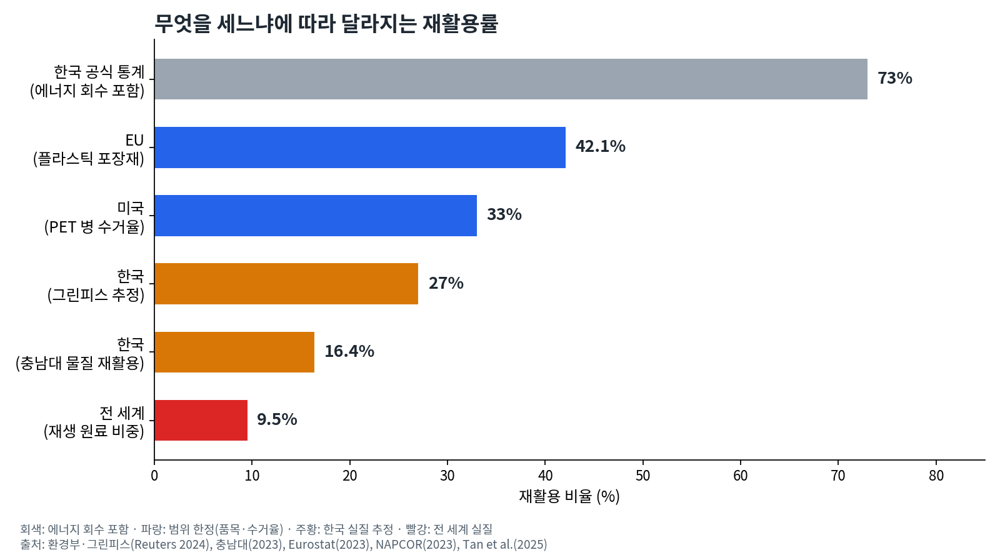
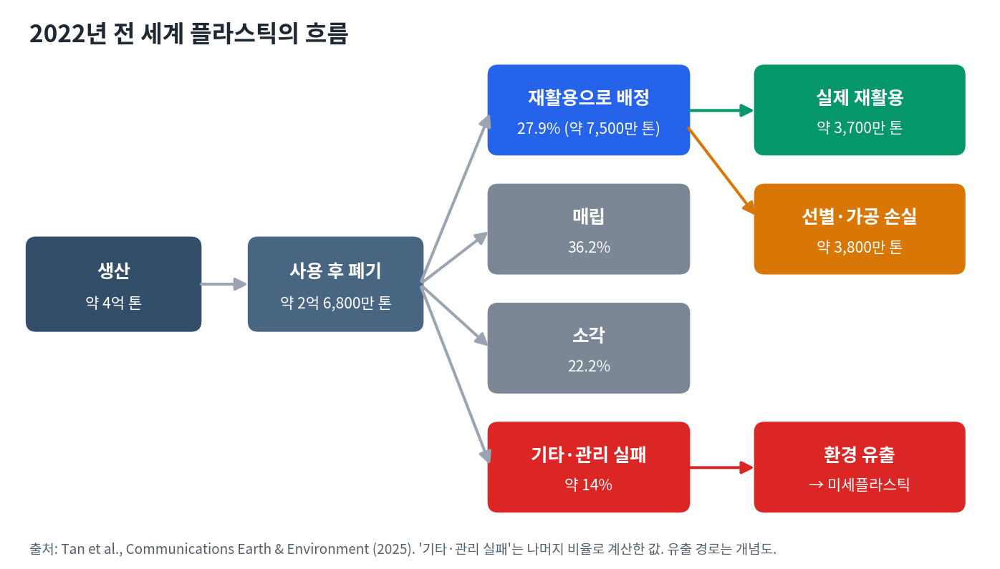
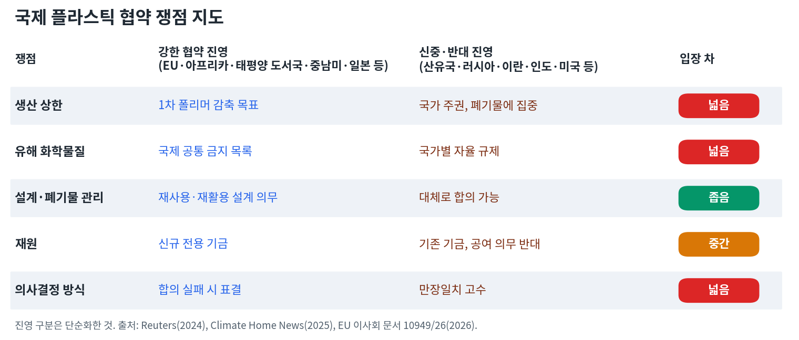
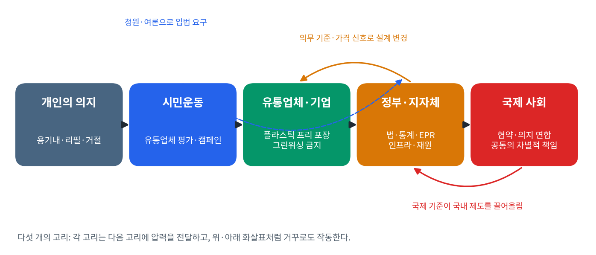
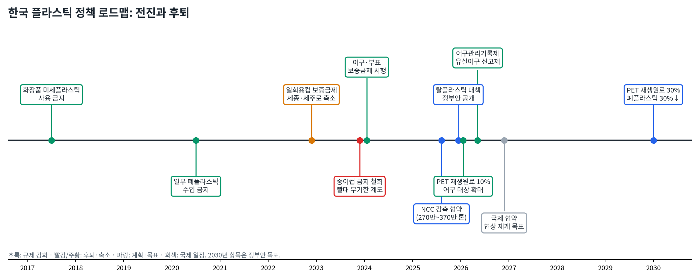
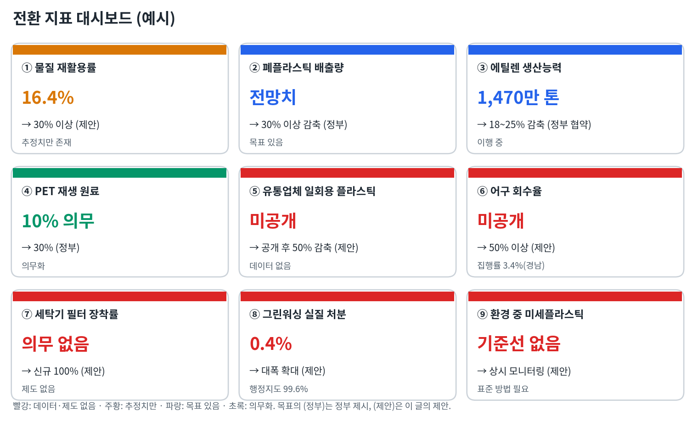

# 플라스틱 경제, 우리에게 대안이 있을까?

김호광 (Dennis Kim) · 2026년 10월

---

## 요약 (Executive Summary)

| 구분 | 핵심 내용 |
| --- | --- |
| **문제** | 2022년 전 세계가 만든 약 4억 톤의 플라스틱 중 재생 원료로 만든 것은 **9.5%** 에 그친다. 한국의 공식 재활용률은 73%지만, 에너지 회수를 빼면 실질 물질 재활용률은 16~27%로 추정된다. |
| **원인** | ① 생산량이 계속 늘어난다(2040년 7억 3,600만 톤 전망). ② 수거된 것의 절반만 실제로 재활용된다. ③ 국가마다 재활용률의 정의가 달라 실패가 통계 뒤에 숨는다. |
| **영향** | 바다의 미세플라스틱은 주로 합성섬유 세탁과 폐어구에서 온다. 미세플라스틱은 인체 곳곳에서 **검출**되지만 질병과의 인과는 아직 **미확정**이다. 반면 플라스틱 첨가제인 BPA·프탈레이트의 내분비계 교란 작용은 **규제 근거가 될 만큼 확립**되었다. |
| **막힌 곳** | 국제 협약은 2024년 부산, 2025년 제네바에서 두 차례 결렬됐다. 생산 상한, 만장일치 규칙, 미국의 입장 전환이 걸림돌이다. 한국은 1차 폴리머 생산 세계 4위이면서 부산 협상의 개최국이다. |
| **대안: 다섯 개의 고리** | 개인의 의지 → 시민운동 → 유통업체·기업 → 정부·지자체 → 국제 사회. 각 고리가 다음 고리에 압력을 전달할 때 구조가 바뀐다. 시민운동이 유통업체를 움직인 실제 사례(2020년 대형마트 평가 → 롯데마트 감축 선언)가 있다. |
| **대안: 세 개의 축** | ① 국제 협약 또는 의지 연합 ② 국내 정치(정직한 통계, EPR 차등화, 지자체 인프라, 정의로운 전환) ③ 기업 책임(플라스틱 프리 포장, 그린워싱 처벌 강화) |
| **지표 9개** | 물질 재활용률, 폐플라스틱 배출량, 에틸렌 생산능력, PET 재생 원료 비율, 유통업체 일회용 플라스틱 사용량, 어구 회수율, 세탁기 필터 장착률, 그린워싱 실질 처분 비율, 환경 중 미세플라스틱 농도. 이 중 4개는 **현재 공개되는 데이터가 없다**. |
| **행동 6층위** | 개인(다회용·거절), 유통업체 압력(사용량 공개 요구), 그린워싱 신고, 국회(국민동의청원), 지자체(조례·인프라), 기업·주주(공시 요구), 국제 연대(협상 감시) |

**한 줄 결론:** 대안은 있다. 다만 개인의 장바구니가 아니라, 시민운동이 유통업체와 정부를 움직이고 정부가 국제 사회와 연대하는 사슬 속에 있다.

## 들어가며, 종량제 봉투가 사라진 봄

2026년 3월, 서울의 대형마트 계산대 옆에 낯선 안내문이 붙었다. 종량제 봉투 구매 수량을 제한한다는 공지였다. 중동 전쟁의 여파로 나프타 수급이 흔들리자, 쓰레기를 버릴 봉투마저 품귀가 된 것이다.[1] 우리가 쓰는 플라스틱이 얼마나 먼 곳의 원유에 기대고 있었는지를 보여 준 장면이었다.

우리는 매일 페트병의 라벨을 떼고, 컵을 헹구고, 색깔별 수거함 앞에서 잠시 고민한다. 그 짧은 의식은 일종의 면죄부다. 그러나 2022년 전 세계가 만든 약 4억 톤의 플라스틱 가운데 재생 원료로 만든 것은 9.5%에 그쳤다.[2] 나머지는 태워지거나, 묻히거나, 바다와 흙으로 흘러가 잘게 부서진다.

## 먼저 짚어 둘 용어

용어를 먼저 정리하는 이유는, 의도했든 의도하지 않았든 수거율·공식 재활용률과 실제 물질 재활용률 사이에 큰 격차가 있고, 그 격차가 통계적 수사 뒤에 가려져 있기 때문이다.

| 용어 | 뜻 | 왜 중요한가? |
| --- | --- | --- |
| 수거율 | 재활용하겠다고 분리배출·수거된 양의 비율 | 수거된 것이 모두 재활용되지는 않는다 |
| 재활용률(공식 통계) | 국가마다 정의가 다름. 한국은 에너지 회수분까지 포함하는 경우가 있음 | 국가 간 비교가 사실상 불가능해진다 |
| 물질 재활용 | 폐플라스틱이 다시 플라스틱 등 물질의 원료가 되는 것 | 이 글에서 말하는 "진짜 재활용" |
| 열적 재활용(에너지 회수) | 폐플라스틱을 태워 열이나 고형연료(SRF)로 쓰는 것 | EU와 국제기구는 재활용으로 보지 않는다 |
| 1차 폴리머 | 석유·가스에서 새로 만든 플라스틱 원료(버진 레진) | 국제 협약 "생산 상한" 논쟁의 대상 |
| 미세플라스틱 | 5mm 이하의 플라스틱 조각 | 1차(처음부터 작게 생산·탈락)와 2차(큰 플라스틱의 파편화)로 나뉜다 |
| 나노플라스틱 | 통상 1μm(마이크로미터) 미만의 입자 | 세포막과 생체 장벽을 통과할 가능성이 크다 |
| 내분비계 교란물질(EDCs) | 호르몬 작용을 흉내 내거나 방해하는 화학물질, 이른바 환경호르몬 | 플라스틱 첨가제 중 BPA, 프탈레이트가 대표적 |
| 그린워싱 | 환경 성과를 실제보다 부풀리거나 오인하게 표시·광고하는 것 | "재활용 가능", "생분해" 표시가 대표적 사례 |
| 오염자 부담 원칙 | 오염을 일으킨 자가 그 비용을 부담해야 한다는 원칙 | 전환 재원 조달의 기준이 된다 |
| 공통의 차별적 책임(CBDR) | 모든 나라가 책임을 지되, 역사적 기여와 역량에 따라 부담을 달리한다는 원칙 | 국제 협약에서 개발도상국 참여를 끌어내는 기준이 된다 |

## 1. 재활용률의 진실 - 무엇을 세느냐의 문제

| 구분 | 수치 | 기준·연도 | 출처 |
| --- | --- | --- | --- |
| 전 세계 | 9.5% | 2022년 생산량 약 4억 톤 중 재생 원료 비중 | Tan et al. (2025)[2] |
| 전 세계 | 약 9% | 2019년 플라스틱 폐기물 중 재활용 비중 | OECD (2022)[3] |
| 한국 | 73% | 공식 재활용률 (에너지 회수 등 포함) | 환경부 (Reuters 보도, 2024)[4] |
| 한국 | 27% | 전체 플라스틱 폐기물 중 실질 재활용 추정 | 그린피스 추정 (Reuters 보도, 2024)[4] |
| 한국 | 16.4% | 2023년 물질 재활용률 분석 | 충남대 연구팀 (프레시안 보도, 2025)[5] |
| EU | 42.1% | 2023년, 플라스틱 포장재 한정 | Eurostat[6] |
| 미국 | 33% | 2023년, PET 병 **수거율** | NAPCOR (2024)[7] |

**전 세계.** 2022년 버려진 플라스틱 약 2억 6,800만 톤 가운데 약 7,500만 톤이 재활용으로 배정되었지만, 실제 선별·재활용된 양은 약 3,700만 톤으로 그 절반이었다.[2]

**한국.** 정부는 플라스틱 폐기물의 73%를 재활용한다고 밝혀 왔지만, 이 숫자에는 에너지 회수가 상당 부분 섞여 있다. 그린피스는 실질 재활용률을 27%로, 충남대 연구팀은 2023년 물질 재활용률을 16.4%로 추정했다.[4][5] 두 추정치는 시스템 경계와 산정 방법이 달라 단순 비교는 어렵지만, 공식 통계의 3분의 1에서 4분의 1 수준이라는 방향은 같다. 같은 기간 한국의 플라스틱 폐기물 발생량은 2019년 960만 톤에서 2022년 1,260만 톤으로 31% 늘었다.[4]

**EU와 미국.** EU의 42.1%는 플라스틱 포장재만 센 숫자이고, 벨기에 59.5%에서 프랑스 25.7%까지 회원국 편차가 크다.[6] 미국의 33%는 PET 병의 숫자이고, 엄밀히는 재활용률이 아니라 수거율이다.[7]

**국경을 넘는 쓰레기.** 재활용률을 높이는 가장 손쉬운 방법은 쓰레기를 다른 나라로 보내는 것이었다. 2018년 중국의 수입 금지 이후 폐플라스틱은 동남아시아로 옮겨 갔고, 2021년부터는 바젤 협약 개정으로 오염되거나 혼합된 폐플라스틱을 수출할 때 수입국의 사전 동의가 필요해졌다. 한국이 수출한 폐플라스틱이 수입국에서 어떻게 처리되는지는 공개된 추적 자료가 부족하다.

## 2. 재활용되지 못한 플라스틱은 어디로 가는가?

세계자연보전연맹(IUCN)의 2017년 추정에 따르면 바다로 유입되는 1차 미세플라스틱의 주요 출처는 합성 섬유(35%), 타이어 마모(28%), 도시 먼지(24%)다.[8]

**옷감.** 합성 섬유 옷은 세탁할 때마다 미세 섬유를 흘려보낸다. 실험실 연구에서는 6kg 세탁 1회에 최대 70만 가닥 이상의 섬유가 방출될 수 있다는 결과가 나왔다.[9]

**어구.** 버려지거나 유실된 그물, 밧줄, 통발, 부표는 해양 플라스틱 중 가장 크고 오래가는 덩어리다. 태평양 거대 쓰레기 지대 연구에서는 플라스틱 질량의 46% 이상이 어망이었다.[10] 한국 해양수산부는 2019년 해양 플라스틱 쓰레기의 약 53%를 폐어구·폐부표로 추정했다.[11]

두 출처의 공통점은 한 나라의 노력만으로 통제할 수 없다는 것이다. 옷은 한 나라에서 만들어져 다른 나라에서 세탁되고, 어선은 공해를 오가며, 해류는 국경을 모른다.

## 3. 몸속의 플라스틱 - 무엇을 얼마나 확실히 아는가?

| 등급 | 뜻 | 해당 사례 | 주의할 점 |
| --- | --- | --- | --- |
| **검출됨** | 인체 시료에서 존재가 확인됨 | 혈액, 태반, 모유, 고환, 정액, 폐, 간, 신장, 뇌 조직 | 시료 종류, 검출 방법, 농도, 재현성이 연구마다 다르다. 실험실 오염 통제가 핵심 쟁점이다 |
| **연관성 보고** | 노출과 질병 사이의 통계적 연관이 관찰됨 | 경동맥 플라크 내 미세·나노플라스틱과 심혈관 사건 위험 증가[12] | 관찰 연구이므로 인과는 미확정 |
| **인과 추정** | 동물·세포 실험에서 기전이 확인됨 | 산화 스트레스, 장 세포 손상, 호르몬 조절 축(HPG·HPA) 교란 | 실험 농도가 실제 노출보다 높은 경우가 많다 |
| **확립** | 규제 근거로 쓰일 만큼 증거가 축적됨 | BPA·일부 프탈레이트의 내분비계 교란 작용 | 입자로서의 미세플라스틱이 아니라 첨가 화학물질에 대한 증거다 |

2025년 한 연구는 사후 뇌 조직에서 간·신장보다 높은 농도의 플라스틱을 보고했다.[13] 다만 사후 시료 연구라 인과를 말할 수 없고, 열분해-기체크로마토그래피/질량분석(Py-GC/MS) 방식은 지방이 많은 뇌 조직에서 수치를 과대 추정할 수 있다는 방법론적 비판이 제기되었다. "입자가 혈뇌장벽을 넘을 수 있다"는 해석은 현재로서는 가설 단계다.

미세플라스틱이 인체 곳곳에 있다는 것은 확실하다. 그것이 질병을 일으키는지는 아직 확실하지 않다. 그러나 이 불확실성은 "안전하다"가 아니라 "아직 모른다"는 뜻이다. 몸에서 빼내기 어려운 물질이 계속 쌓이고 있다면, 증거가 완성될 때까지 기다리는 것 자체가 위험한 선택이 된다. 이것이 사전예방 원칙의 논리다.

## 4. 호르몬을 흔드는 화학물질

유엔환경계획(UNEP)은 2023년 플라스틱에 들어가는 화학물질 가운데 3,200종 이상을 우려 물질로 분류했다.[14]

비스페놀A(BPA)는 에스트로겐을 흉내 내며 비만·당뇨·심혈관 질환과의 연관성이 다수 보고되었고 갑상선 호르몬 대사도 방해한다. EU는 2024년 말 식품 접촉 재료에 BPA 사용을 금지하는 규정을 채택했다. 프탈레이트는 플라스틱을 말랑하게 만드는 가소제로, 일부 물질(DEHP 등)은 EU에서 생식독성 물질로 분류되어 사용이 엄격히 제한된다.

**노출 경로는 플라스틱만이 아니다.** 프탈레이트는 향수·화장품·개인위생용품, 식품 가공 설비의 호스, 의료기기에서도 나온다. BPA는 감열지 영수증과 캔 내부 코팅에서도 노출된다. 따라서 플라스틱 포장 규제만으로 환경호르몬 노출이 모두 사라지지는 않는다. 다만 식품 포장은 가장 크고 통제 가능한 경로 가운데 하나다. 2011년 미국의 한 개입 연구에서 3일간 포장을 최소화한 신선식품을 먹자 소변의 BPA 농도가 66%, 주요 프탈레이트(DEHP) 대사산물이 53~56% 감소했다.[15]

## 5. 기술은 우리를 구할 수 있을까?

| 기술 | 기대 | 환경적 한계 | 사회적 비용 |
| --- | --- | --- | --- |
| 생분해성 플라스틱 (PLA) | 자연에서 분해되는 대체 소재 | 대부분 약 58℃ 이상의 산업용 퇴비화 시설에서만 분해된다. 바다·토양에서는 거의 분해되지 않는다 | 주원료인 옥수수·사탕수수는 식량·사료와 토지를 두고 경합한다 |
| 해양 생분해성 소재 (PHA, 해조류 기반) | 바다에서도 분해 가능 | 분해 속도가 수온·미생물 조건에 따라 크게 다르다. "해수에서 90% 이상 분해" 같은 주장은 시험 조건을 확인해야 한다 | PHA 원료는 다른 작물 공급망과 겹친다. 해조류 대규모 양식은 연안 생태계와 어업 공간에 영향을 줄 수 있다 |
| 화학적 재활용 (열분해 등) | 섞이고 오염된 플라스틱도 원료로 되돌림 | 에너지 소비가 크고 산출물의 상당 부분이 연료로 쓰인다. EU는 연료용 산출물을 재활용으로 인정하지 않는다 | 시설 입지를 둘러싼 지역 갈등과 배출 관리 부담 |
| 고도 여과 (UF·NF·RO) | 정수·폐수에서 미세플라스틱 제거 | 걸러진 플라스틱은 하수 슬러지로 옮겨 가고, 슬러지가 농지에 뿌려지면 토양으로 돌아간다 | 설비·운영비가 수도요금으로 전가된다 |
| 세탁기 미세섬유 필터 | 옷감 유래 섬유를 발생원에서 차단 | 걸러진 섬유의 처리 문제가 남는다 | 의무화 없이는 보급이 느리다 |
| 리필·재사용 시스템 | 일회용 포장 자체를 없앰 | 세척에 물과 에너지가 들고, 회수율이 낮으면 이점이 줄어든다 | 세척·회수 물류에 새 일자리가 생긴다. 유통업체 참여 없이는 확산되지 않는다 |

대체 소재도 땅과 물과 노동을 쓴다. 가장 효과적인 "기술"은 소재가 아니라 유통 구조의 변화다.

## 6. 국제 협약 - 왜 막혀 있고, 어떻게 뚫을 것인가?

2022년 유엔환경총회는 플라스틱의 전 생애주기를 다루는 법적 구속력 있는 협약을 만들기로 결의했다. 그러나 최종 협상이 될 예정이었던 2024년 12월 부산 회의와 2025년 8월 제네바 회의에서 두 차례 합의에 실패했다.[16] 2026년 2월 새 의장이 선출되었고, 2026년 말이나 2027년 초 공식 협상 재개가 목표다.[16]

### 막힘의 구조

- **생산국의 이해.** 2023년 1차 폴리머 생산 상위 5개국은 중국, 미국, 인도, 한국, 사우디아라비아였다.[17] 제네바에서 생산 감축에 찬성한 나라는 89개국, 강한 화학물질 규제를 지지한 나라는 120개국이었다.[18]
- **미국의 입장 전환.** 미국은 제네바 회의를 앞두고 입장을 바꿔 전 지구적 규제 조치 자체에 반대했다.[19]
- **만장일치의 덫.** 브라질, 러시아, 인도, 중국 등은 표결 가능성을 거부하고 합의로만 결정해야 한다고 고집했다.[19]
- **무역 문제.** 생산 상한과 유해 화학물질 금지는 교역 제한으로 이어진다. EU는 생산 단계를 다루지 않는 협약은 공여국에 비용만 크고 효과는 없을 것이라는 입장이다.[20]

### 출구 - 의지 연합 시나리오

출구는 세 가지다. 약한 협약에 합의하거나, 표결로 강행하거나, 뜻이 맞는 나라끼리 먼저 협정을 맺는 "의지 연합"이다.[19]

| 항목 | 시나리오 |
| --- | --- |
| 참여 후보 | EU 27개국과 노르웨이·스위스·영국, 캐나다, 칠레·페루·멕시코 등 중남미, 르완다·케냐 등 아프리카, 태평양 도서국, 일본. 한국은 참여 여부가 열려 있다 |
| 담을 수 있는 기준 | ① 1차 폴리머 감축 목표 ② 우려 화학물질 공동 금지 목록 ③ 물질 재활용률 중심의 통일된 통계 ④ 어구 표시·보증금·회수 의무 ⑤ 섬유 EPR과 세탁기 필터 기준 |
| 작동 방식 | 참여국 시장에 들어오는 제품에 공통 기준을 적용한다. EU 단일시장만으로도 비참여국 수출 기업이 기준을 따르게 만들 수 있다 |
| 한계 | 최대 생산국과 소비국이 빠지면 전 지구적 생산량 감축 효과는 제한된다 |

#### 무역 분쟁 - 비참여국이 WTO에 제소한다면

의지 연합이 비참여국 제품에 기준을 적용하면, 비참여국은 이를 차별적 무역 제한으로 보고 세계무역기구(WTO)에 제소할 수 있다. 그러나 대응 논리는 충분하다.

- **GATT 제20조의 예외.** WTO 규범은 인간의 생명·건강 보호(제20조 (b)항)와 고갈될 수 있는 천연자원 보존(제20조 (g)항)을 위한 조치를 예외로 인정한다. 단, 자의적 차별이나 위장된 무역 제한이 아니어야 한다(두문 요건).
- **선례.** WTO는 프랑스의 석면 금지를 건강 보호 조치로 인정했고(EC–석면 분쟁, 2001), 미국의 새우 수입 제한 사건에서는 차별 요소를 고친 뒤의 환경 조치를 인정했다(US–새우 분쟁, 1998·2001).
- **설계 원칙.** 따라서 의지 연합의 기준은 ① 국산품과 수입품에 똑같이 적용하고 ② 과학적 근거를 갖추고 ③ 비참여국에 협상과 적응 기간을 먼저 제공하는 방식으로 설계해야 한다.
- **다자 협약의 선례.** 몬트리올 의정서는 비당사국과의 규제 물질 교역을 제한했지만, 이 조치가 WTO에서 문제 된 적은 없다. 다자 환경 협약 안의 무역 조치는 단독 조치보다 정당성이 높다.

#### 개발도상국의 참여 유인

개발도상국에게 협약 의무는 재원과 기술 없이는 공허하다. 참여를 끌어내려면 세 가지가 필요하다.

| 유인 | 내용 |
| --- | --- |
| 재원 | 몬트리올 의정서 다자기금처럼 선진국이 출연하는 전용 기금. 수거·선별·재활용 인프라 구축 비용을 지원한다 |
| 기술 이전 | 재활용·대체 소재·어구 관리 기술의 이전과 현지 인력 교육. 한국의 어구 보증금제 운영 경험이 좋은 전수 대상이다 |
| 시장 접근 | 기준을 충족한 개발도상국 생산자에게 참여국 시장의 우대 접근을 보장한다. 참여가 손해가 아니라 이익이 되게 만든다 |

이 모든 것의 원칙은 **공통의 차별적 책임(CBDR)** 이다. 1992년 리우 선언에서 확립된 이 원칙에 따라, 모든 나라가 플라스틱 오염에 책임을 지되 역사적으로 더 많이 생산하고 소비한 나라가 더 큰 감축과 재원 부담을 진다. 개발도상국에는 이행 유예 기간과 단계적 의무를 부여한다.

## 7. 반론과 재반론

> **반론 1. "재활용률을 높이면 되지, 왜 생산을 줄여야 하나?"**

재활용은 물리적 한계가 있다. 플라스틱은 재활용할수록 품질이 떨어지고, 다층·복합 재질은 거의 재활용되지 않는다. 생산량이 늘어나는 한 재활용률이 올라도 환경으로 새는 절대량은 줄지 않는다. OECD 기준 전망대로라면 2040년 세계 플라스틱 생산량은 7억 3,600만 톤에 이른다.[3][21]

> **반론 2. "플라스틱은 의료·위생·식품 안전에 필수적이다."**

맞다. 그래서 감축 대상은 필수 용도가 아니라 일회용 포장, 과대 포장, 단기 소비재다. 필수 용도는 예외로 두는 "용도별 차등" 접근이 현실적이다.

> **반론 3. "생산 상한은 경제와 일자리에 타격을 준다."**

타격은 실재한다. 그러나 한국 석유화학 산업은 이미 공급 과잉으로 구조조정에 들어섰다(8장). 문제는 그 전환을 계획적으로 할 것인가, 시장에 떠밀려 할 것인가다.

> **반론 4. "대체 소재도 환경 발자국이 있다."**

사실이다(5장). 그래서 답은 "다른 일회용품으로 바꾸기"가 아니라 "일회용 자체를 줄이고 재사용 체계로 옮기기"다.

> **반론 5. "협약이 두 번이나 실패했는데, 왜 또 협약인가?"**

무역, 공급망, 금융을 통해 국경 너머로 압력을 전달할 수 있는 다자 틀은 협약뿐이다. 협상 과정 자체도 국가별 정책을 끌어올린다. 전 지구적 합의가 끝내 불가능하다면 의지 연합이 먼저 높은 기준을 세우고 시장 규모로 나머지를 끌어오는 길이 남아 있다(6장).

> **반론 6. "한국이 먼저 규제하면 산업이 해외로 나간다."**

세 가지 이유로 이 논리는 현실과 맞지 않는다.

첫째, 수입국이 기준을 높이면 오히려 높은 기준을 먼저 충족한 기업이 시장을 선점한다. EU 포장 규정(PPWR)의 재활용 목표는 이미 EU에 수출하는 한국 기업에 적용되고 있다.[34] 2026년부터 본격 시행된 EU 탄소국경조정제도(CBAM)는 아직 플라스틱을 대상으로 하지 않지만, 국경에서 환경 기준을 묻는 방식이 확산되고 있다는 방향을 보여 준다. 

둘째, 한국 석유화학 산업은 규제가 아니라 중국발 공급 과잉 때문에 이미 설비를 18~25% 줄이고 있다.[22] 규제가 산업 이탈을 촉발한다는 주장과 달리, 이탈 압력은 이미 시장에서 오고 있다. 

셋째, 생산 기지를 옮겨도 수출 시장의 기준은 피할 수 없다. 기준이 높아지는 시장에 팔려면 어디서 만들든 그 기준을 지켜야 한다. 다만 감축의 비용이 특정 지역에 집중된다는 점은 사실이므로, 정의로운 전환과 재원 설계를 함께 해야 한다(8장).

## 8. 전환의 비용은 누가 지는가? - 정의로운 전환과 재원

### 한국 석유화학 구조조정의 현재

| 항목 | 내용 |
| --- | --- |
| 배경 | 2020년 이후 중국의 대규모 설비 증설로 공급 과잉. 한국 석유화학 제품의 대중 수출 비중은 2010년 48.8%에서 2023년 36.3%로 하락[22] |
| 감축 목표 | 2025년 8월 정부와 NCC 보유 10개사 협약. 국내 에틸렌 생산능력 1,470만 톤 중 18~25%(270만~370만 톤) 감축[22][23] |
| 감축 계획 | 2025년 12월 3대 산단 사업재편안 제출. 계획대로면 최대 약 367만 톤 감축[24] |
| 지역 구조 | 전국 NCC 10기 중 7기가 여수에 집중.[22] 여수산단 석유화학 종사자는 여수 전체 고용의 약 42%[25] |
| 고용 영향 | 여수산단 고용 인원은 2022년 약 2만 6천 명에서 2025년 2만 820명으로 감소[26] |
| 역설 | 감축이 진행되는 동안 울산에서는 샤힌 프로젝트 가동으로 에틸렌 생산능력이 연 180만 톤 늘어난다[25] |

### 재원은 어디서 오는가? - 오염자 부담 원칙

정의로운 전환에는 돈이 든다. 노동자 재교육, 지역 대체 산업, 회수·세척 인프라, 개발도상국 지원 모두 재원이 필요하다. 그 기준은 **오염자 부담 원칙**이어야 한다. 한국 환경정책기본법도 오염원인자 책임 원칙을 명시하고 있다. 플라스틱을 만들고 팔아 이익을 얻은 쪽이 그 처리와 전환 비용을 먼저 부담해야 한다.

| 재원 | 성격 | 활용처 | 과제 |
| --- | --- | --- | --- |
| 폐기물 부담금 | 재활용이 어려운 제품 생산자에게 부과하는 부담금 (오염자 부담) | 회수·선별 인프라, 지자체 지원 | 현재 EU의 약 4분의 1 수준.[38] 단계적 인상과 용도 지정 필요 |
| EPR 분담금 | 생산자가 재활용 의무를 대신해 내는 분담금 (오염자 부담) | 물질 재활용 고도화, 재사용 시스템 | 재활용 난이도에 따른 차등화 필요 |
| 석유화학 업계 출연 | 구조조정 지원의 조건으로 업계가 출연 | 노동자 재교육, 협력업체 지원 | 정부 지원과 업계 자구 노력의 연동 |
| 정부 재정 | 일반 예산과 산업위기대응 예산 | 지역 대체 산업, 고용 안전망 | 지역별 재정 격차 보정 |
| 기후 재원 연계 | 기후대응기금, 배출권 거래 수익 | 석유화학 탈탄소·전환 투자 | 플라스틱 감축을 기후 정책과 함께 설계 |
| 국제 기금 | 협약 기금 또는 의지 연합 기금 | 개발도상국 인프라, 기술 이전 | 한국의 공여국 역할 결정 |

플라스틱 생산의 98%가 화석연료를 원료로 쓴다는 점에서,[2] 플라스틱 전환과 탄소 감축은 같은 문제의 두 얼굴이다. 두 정책의 재원을 연계하면 중복을 줄이고 정당성을 높일 수 있다.

## 9. 다섯 개의 고리 - 개인에서 국제 사회까지

### 고리는 어떻게 서로를 움직이는가?

| 방향 | 작동 메커니즘 | 한국·해외 사례 |
| --- | --- | --- |
| 개인 → 시민운동 | 소비자 불만이 서명·캠페인 참여로 조직된다 | 다회용 용기로 장보는 "용기내" 캠페인[27] |
| 시민운동 → 유통업체 | 공개 평가로 평판 위험을 만들고, 고객 이탈 가능성을 수치로 보여 준다 | 그린피스 대형마트 평가(2020) 후 롯데마트 감축 선언, 이마트 리필 스테이션 도입[27][28][29] |
| 유통업체 → 제조업체 | 납품 기준을 바꾸면 수백 개 제조사의 포장 설계가 바뀐다 | 영국 테스코의 과대 포장 상품 거부[30] |
| 시민운동 → 정부 | 청원·여론·입법 요구로 규제를 끌어낸다 | 2017년 화장품 미세플라스틱 사용 금지[27], 2025년 12월 "생산 감축 없는 탈플라스틱 대책 재검토" 요구[31] |
| 정부 → 기업 | 의무 기준과 가격 신호로 설계를 바꾼다 | PET 음료병 재생 원료 사용 의무(2026년 10%, 2030년 30%), 일회용 플라스틱 컵의 EPR 편입 추진[32][33] |
| 정부 → 지자체 | 법적 근거와 재원을 내려보내 집행을 가능하게 한다 | 일회용컵 보증금제의 지자체 자율 전환(9장 고리 3) |
| 기업 → 정부 | 수출 기준과 국내 기준을 통일해 달라는 요구가 생긴다 | EU 포장 규정(PPWR)의 재활용 목표가 한국 수출 기업에 적용[34] |
| 정부 ↔ 국제 사회 | 협상 입장이 국내 정책을 끌어올리고, 국내 제도가 국제 기준의 모델이 된다 | 부산 회의 개최, 세계 최초 어구·부표 보증금제에 대한 UNEP의 관심[35] |

### 고리 1. 개인의 의지 - 출발점이자 신호

개인의 실천은 구조를 혼자 바꾸지 못한다. 그러나 두 가지 일을 한다. 하나는 내 몸을 지키는 일이다. 포장을 줄인 식단만으로 환경호르몬 노출이 절반 이상 줄어든다.[15] 다른 하나는 시장에 신호를 보내는 일이다. 2019년 조사에서 소비자 절반은 과도한 플라스틱 포장 때문에 구매 제품을 바꾼 적이 있다고 답했다.[30]

**의향과 행동의 격차.** 같은 조사에서 소비자 10명 중 7명은 플라스틱 없는 마트가 있다면 구매처를 바꿀 의향이 있다고 답했다.[30] 그러나 의향은 행동이 아니다. 실제 소비자는 가격, 편의, 접근성, 습관 때문에 의향과 다르게 움직인다. 이 격차는 개인의 결심이 아니라 선택 환경을 바꿔야 좁혀진다. 기본값 설계(다회용 기본, 일회용은 요청 시), 가격 신호, 회수 인프라가 그 세 가지 수단이다.

### 고리 2. 시민운동 - 유통업체를 움직여라

플라스틱 포장의 실질적 결정권은 개인이 아니라 유통업체에 있다. 소비자는 진열대에 놓인 것 중에서만 고를 수 있다. 그래서 시민운동의 가장 효과적인 표적은 대형마트와 온라인 유통 플랫폼이다.

그린피스는 2020년 5대 대형마트의 일회용 플라스틱 감축 노력을 평가해 이마트에 C, 나머지 네 곳에 F를 매겼다.[28] 시민들은 "용기내" 캠페인으로 응답했다. 그해 롯데마트는 아시아 대형마트 최초로 2025년까지 일회용 플라스틱 사용량을 50% 줄이겠다고 선언했고,[29] 이마트는 세제 리필 스테이션을 도입했다.[27]

시민운동이 유통업체에 요구해야 할 것은 구체적이다.

- **사용량 공개.** 매장과 자체 브랜드(PB) 상품의 일회용 플라스틱 총량을 매년 공개할 것.
- **이행 보고.** 롯데마트의 "2025년 50% 감축" 선언은 2025년이 지난 지금 이행 결과가 공개되어야 할 약속이다.
- **플라스틱 프리 포장 기준.** 신선식품 무포장 판매, 리필 스테이션 확대, 과대 포장 상품의 납품 기준 도입.
- **온라인 배송 포장.** 새벽 배송과 택배의 완충재·보냉재를 다회용 회수 시스템으로 전환할 것.

### 고리 3. 정부와 지자체 - 자발적 약속을 제도로

**한국 정치의 현실.** 이 고리는 가장 강력하지만 가장 흔들리기 쉽다. 한국은 2022년 일회용컵 보증금제를 전국 시행하려다 세종·제주로 축소했고, 2023년에는 매장 내 일회용 종이컵 사용 금지를 철회하고 플라스틱 빨대 금지에 무기한 계도기간을 두었다.[37][1] 2025년 12월 기후에너지환경부가 공개한 탈플라스틱 종합대책 정부안은 2030년까지 폐플라스틱 배출을 전망치 대비 30% 넘게 줄이겠다는 목표와 함께 컵 따로 계산제, PET 재생 원료 의무, 한국형 에코디자인, 폐기물 부담금 단계적 인상을 담았다.[33][38] 그러나 일회용컵 보증금제는 지자체 자율에 맡겨졌고, 시민단체들은 생산 감축 목표가 빠졌다며 전면 재검토를 요구했다.[31] 최종안은 2026년 4월까지도 발표되지 않았다.[1]

"국민 불편"과 "소상공인 부담"은 규제 후퇴의 가장 강력한 논리다. 그리고 석유화학 산업이 지역 고용의 40% 이상을 차지하는 도시가 있는 한,[25] 생산 감축은 지역 정치의 문제가 된다. 그래서 "무엇을 해야 하는가"만큼 "무엇이 정치적으로 버틸 수 있는가"를 함께 설계해야 한다.

#### "컵 따로 계산제"가 작동하려면

정부안의 핵심 수단인 컵 따로 계산제는 음료 영수증에 일회용컵 가격을 따로 표시하는 제도다.[33] 정부는 컵값이 이미 음료값에 포함되어 있으므로 추가 인상은 없다고 설명한다.[38] 바로 그 점이 약점이다. 소비자 입장에서는 영수증 항목 외에 달라지는 것이 없어 실효성에 의문이 제기된다.[36] 이 제도가 실제로 일회용컵을 줄이려면 세 가지 조건이 필요하다.

| 조건 | 내용 |
| --- | --- |
| ① 실제 비용 반영 | 컵값은 생산원가만이 아니라 수거·처리 비용까지 반영해야 한다. 정부가 언급한 100~200원 최저선[32]이 이 비용을 감당하는지 공개 검증이 필요하다 |
| ② 소비자에게 보이는 차이 | 다회용컵을 가져온 소비자에게 컵값만큼 실제로 할인해 줘야 한다. 표시만 바뀌고 가격 차이가 없으면 행동은 바뀌지 않는다 |
| ③ 인프라 선행 | 다회용컵을 빌리고 반납할 곳, 세척 시설이 먼저 갖춰져야 한다. 대안이 없는 상태의 가격 신호는 불편만 늘린다 |

제주가 좋은 비교 사례다. 제주에서는 다회용기 회수 체계가 만들어지자 90% 이상의 매장이 일회용컵 보증금제에 참여했다는 현장 증언이 있다.[1] 반면 인프라 없이 제도만 시행된 곳에서는 소상공인 부담 논란 속에 제도가 후퇴했다. 같은 제도라도 인프라가 있느냐에 따라 결과가 갈린다.

#### 지자체의 역할과 한계

탈플라스틱 정책의 집행은 결국 지자체가 한다. 그런데 정부안은 일회용컵 보증금제를 지자체 자율에 맡겼다.[32] 이 방식에는 세 가지 문제가 있다.

1. **누더기 제도.** 지역마다 제도가 다르면 프랜차이즈 매장과 소비자 모두 혼란을 겪는다. 옆 동네로 가면 규칙이 바뀌는 제도는 정착하기 어렵다.
2. **재정 격차.** 회수기, 세척 시설, 단속 인력은 모두 돈이 든다. 재정 여건이 좋은 지자체만 제도를 시행하면, 탈플라스틱이 지역 간 격차를 넓히는 정책이 된다.
3. **조례의 한계.** 지방자치법상 주민의 권리를 제한하거나 의무를 부과하는 조례는 법률의 위임이 있어야 한다. 상위법 근거 없이 지자체가 일회용품 사용을 강하게 규제하면 무효가 될 위험이 있다. 또한 지자체 환경 부서는 이미 인력이 부족해, 조례를 만들어도 단속과 집행이 따라가지 못하는 경우가 많다.

중앙정부가 해야 할 일은 분명하다.

- **법률로 최저선을 정하고, 지자체는 그 위에서 더 강하게 할 수 있게** 한다. 자율은 상향 자율이어야 한다.
- **폐기물 부담금과 EPR 분담금 일부를 지자체 인프라 교부금으로 배분**하되, 재정자립도가 낮은 지자체에 가중치를 둔다.
- **공동 세척센터와 회수 물류**는 광역 단위로 공동 구축해 소규모 지자체의 부담을 줄인다.
- **집행 인력**을 국고로 지원하고, 단속 실적이 아니라 감축 실적으로 평가한다.

#### 정부가 해야 할 일 (종합)

1. 재활용 통계에서 물질 재활용과 에너지 회수를 분리해 공표한다.
2. 탈플라스틱 대책에 1차 폴리머 사용량 기준 감축 목표와 연도별 이행 계획을 포함한다.
3. EPR 분담금을 재활용 난이도에 따라 차등화한다.
4. 일정 규모 이상 유통업체에 일회용 포장 사용량 보고와 감축 목표 설정을 의무화한다.
5. 어구 보증금제를 실제로 작동하게 한다. 2024년 통발 어구부터 시행되어[39] 2026년 대상이 확대되었고 어구관리기록제와 유실어구 신고제도 시행되었지만,[40] 경상남도의 사업 집행률은 2025년 3분기 3.4%에 그쳤다.[41]
6. 신규 세탁기의 미세섬유 필터 장착을 의무화하고 섬유 EPR을 도입한다.
7. 공공기관 행사와 급식에서 재사용 용기를 기본값으로 삼는다.
8. 석유화학 구조조정 지원을 고용 유지와 스페셜티 전환 조건에 연동한다.

### 고리 4. 기업- 규제가 국경을 넘어 오는 경로, 그리고 그린워싱

기업은 규제가 가장 빨리 국경을 넘는 통로다. EU의 포장 및 포장 폐기물 규정(PPWR)은 플라스틱 포장 재활용 목표를 2025년 50%, 2030년 55%로 정했다.[34] 수출용과 내수용 생산 라인을 따로 운영하는 것보다 하나로 통일하는 편이 싸기 때문에, 기업은 오히려 국내에도 같은 기준을 원하게 된다.

#### 그린워싱 - 적발은 많고 처벌은 없다

한국의 환경성 표시·광고 위반(그린워싱) 적발과 처분 현황은 다음과 같다.

| 연도 | 적발 건수 | 비고 |
| --- | --- | --- |
| 2019 | 57 | |
| 2020 | 110 | |
| 2021 | 272 | |
| 2022 | 4,558 | 전년 대비 16.7배 |
| 2023 | 4,935 (자료에 따라 4,940) | |
| 2024 | 2,528 | |
| 2025 | 1,275 | |

출처: 2020~2022년은 환경부가 국회 환경노동위원회 진성준 의원실에 제출한 자료(2023년 2월 보도),[43][44] 2019년과 2023~2025년은 법무법인 태평양이 정리한 환경부 집계(2026년 5월)[42]

처분 내용이 더 문제다. 2020~2022년 적발 4,940건 가운데 99.8%가 법적 강제력이 없는 행정지도에 그쳤고 시정명령은 9건(0.2%)뿐이었다.[44] 2019년부터 5년간 약 1만 건의 누적 위반 중 과태료나 시정조치 같은 실질 처분은 30건(0.4%)이었다.[42] 2024년 이후 적발 건수가 절반으로 줄어든 것을 두고 그린워싱이 줄어든 것인지 단속이 약해진 것인지 불분명하다는 지적과 함께, 2024년 국정감사에서는 모호한 판단 기준과 약한 제재가 집중 비판을 받았다.[42]

**원자료에 관한 주의.** 위 수치는 환경부가 국회에 제출한 자료를 언론과 법률 전문가가 인용한 것으로, 환경부가 연도별 원자료를 정기적으로 공개하지는 않는다. 2023년 수치가 출처마다 조금씩 다른 것도 그 때문이다. 그린워싱 통계를 연도별·처분 유형별로 정기 공표하는 것 자체가 정책 과제다.

**기업들은 무엇을 원하나.** 대한상공회의소가 2024년 9월 발표한 조사(국내 기업 100개사 대상)에서, 응답 기업의 57%는 환경부 고시와 공정거래위원회 심사지침을 "둘 다 모른다"고 답했다.[45] 두 규정을 "하나로 통합하는 것이 적정하다"는 응답은 90%였다.[45] 다만 이 조사는 표본이 100개사로 작고, 경제단체가 실시한 조사로서 "단속보다 가이드라인 홍보"를 강조하는 입장이 반영되어 있다는 점을 감안해 읽어야 한다.

해외는 더 엄격해지고 있다. 프랑스는 2021년 그린워싱 벌금을 법제화했고,[44] EU는 일반적인 친환경 주장을 제한하는 소비자 보호 지침을 2026년 9월부터 적용한다.[45] 한국에 필요한 것은 다음과 같다.

- "재활용 가능", "생분해", "탄소중립" 표시에 대한 **입증 책임을 기업에** 두고, 표시 전 제3자 검증을 의무화한다.
- 환경부 고시와 공정위 심사지침으로 나뉜 **규제 체계를 통합**한다.
- 행정지도 중심의 처분을 **과징금과 공개 정정 의무**로 바꾼다.
- 적발·처분 통계를 **연도별·유형별로 정기 공개**한다.

### 고리 5. 국제 사회의 연대와 한국의 자리

한국은 1차 폴리머 생산 세계 4위 국가이자,[17] 부산 협상의 개최국이며, 세계 최초의 어구 보증금제를 운영하는 나라다.[35] 한국이 할 수 있는 일은 세 가지다. 협상장에서 생산 감축 목표를 지지하는 것, 의지 연합이 꾸려질 경우 아시아의 핵심 참여국이 되는 것, 어구 관리 경험을 개발도상국과 나누는 기술 협력이다(6장).

## 10. 무엇으로 성과를 잴 것인가?

| 지표 | 현재 기준선 | 2030 목표 | 담당 |
| --- | --- | --- | --- |
| ① 물질 재활용률 (에너지 회수 제외) | 16.4% (2023, 추정)[5] | 30% 이상 (제안) | 기후에너지환경부 |
| ② 폐플라스틱 배출량 | 전망치 기준 | 전망치 대비 30% 이상 감축 (정부)[38] | 기후에너지환경부 |
| ③ 에틸렌 생산능력 | 1,470만 톤 (2025)[22] | 18~25% 감축 이행 (정부 협약) | 산업통상부 |
| ④ PET 음료병 재생 원료 비율 | 10% 의무 (2026)[33] | 30% (정부) | 기업 공시 |
| ⑤ 대형 유통업체 일회용 플라스틱 사용량 | 공개 안 됨 | 공개 의무화 후 2025년 대비 50% 감축 (제안) | 유통업체 공시 |
| ⑥ 어구 회수율 | 공개 안 됨 (경남 사업 집행률 3.4%)[41] | 회수율 공개 및 50% 이상 (제안) | 해양수산부 |
| ⑦ 신규 세탁기 미세섬유 필터 장착률 | 의무 없음 | 신규 판매 100% (제안) | 제조사·정부 |
| ⑧ 그린워싱 실질 처분 비율 | 0.4% (2019~2023)[42] | 대폭 확대 및 정기 공개 (제안) | 기후에너지환경부·공정위 |
| ⑨ 환경 중 미세플라스틱 농도 | 체계적 모니터링 부재 | 상시 모니터링으로 기준선 확립 (제안) | 정부 모니터링 |

(정부)는 정부가 이미 제시한 목표, (제안)은 이 글이 제안하는 목표다. "공개 안 됨"이 많다는 것 자체가 이 표의 가장 중요한 메시지다.

### 지표 ⑨를 어떻게 잴 것인가? - 미세플라스틱 모니터링 방법론

환경 중 미세플라스틱은 최종 성과를 보여 주는 지표지만, 측정 방법이 표준화되지 않으면 숫자를 비교할 수 없다. 연구마다 시료 채취 방법, 분석 장비, 측정 크기 범위가 달라 결과가 수십 배씩 차이 나기도 한다.

**① 시료 채취의 표준화**

| 매체 | 채취 방법 | 주의점 |
| --- | --- | --- |
| 하천·연안 표층수 | 망 견인(통상 300μm 내외 눈금) 또는 일정량 채수 후 여과 | 망 견인은 작은 입자를 놓치므로, 채수·여과를 병행해 크기 범위를 넓힌다 |
| 퇴적물 | 일정 깊이 코어 채취 후 밀도 분리 | 계절·홍수 직후 변동이 크다 |
| 대기 낙하물 | 일정 면적의 낙하물 포집 | 도시·농촌 대조 지점 필요 |
| 하수처리장 방류수 | 유입·방류 동시 채취 | 처리 효율과 유출량을 함께 산정 |

**② 분석 방법의 조합**

| 방법 | 원리 | 장점 | 한계 |
| --- | --- | --- | --- |
| 현미경 육안 분류 | 형태·색으로 선별 | 저렴하고 빠름 | 오분류가 많아 단독으로는 부적합 |
| μ-FTIR (적외선 분광) | 입자별 화학 구조 식별 | 입자 수, 크기, 재질을 함께 얻는다 | 대략 20μm 이하 입자 분석이 어렵다 |
| Raman 분광 | 레이저 산란으로 재질 식별 | 1μm 수준의 작은 입자까지 분석 | 시간이 오래 걸리고 형광 간섭이 있다 |
| Py-GC/MS (열분해-질량분석) | 시료를 태워 고분자 종류별 질량 측정 | 나노 크기까지 포함한 총 질량을 얻는다 | 입자 수·크기 정보가 없고, 다른 유기물에 의한 간섭으로 과대 추정 가능 |

입자 수 기반(μ-FTIR·Raman)과 질량 기반(Py-GC/MS)은 서로 다른 것을 잰다. 국가 모니터링에서는 두 방식을 병행하고, 어느 방식으로 잰 숫자인지 반드시 함께 보고해야 한다. 국제표준화기구(ISO)는 2023년 환경 중 미세플라스틱 분석의 일반 원칙(ISO 24187)을 발표했으며, 국가 모니터링은 이런 국제 표준과 정합성을 갖춰야 한다.

**③ 품질 관리.** 실험실 안의 플라스틱 장비와 합성섬유 옷에서도 미세플라스틱이 시료로 들어간다. 바탕시료(blank)를 매번 함께 분석하고, 유리·금속 기구와 면 실험복을 쓰며, 회수율 시험으로 손실을 보정해야 한다. 기관 간 교차 검증(라운드 로빈 시험)도 정기적으로 실시해야 한다.

**④ 지역 대표성.** 측정 지점은 도시, 농촌, 산업단지 인근, 하수처리장 상·하류, 연안, 그리고 오염원이 거의 없는 배경 지점으로 층을 나눠 고른다. 같은 지점을 계절별로 반복 측정해 계절 변동을 분리한다. 어구 유래 미세플라스틱을 보려면 주요 어항 인근 연안 지점을 반드시 포함해야 한다.

**⑤ 기준선과 추세 분석.** 같은 방법으로 최소 2~3년 측정해 기준선을 세운다. 이후 추세는 계절성과 강우 같은 변동 요인을 보정한 통계 검정(예: 계절 Mann-Kendall 검정)으로 판단한다. 방법을 바꿀 때는 이전 방법과 병행 측정해 연속성을 확보한다. 결과는 입자 수와 질량, 재질별 구성을 함께 공개해, 어떤 정책(섬유 필터, 어구 회수)이 어떤 재질의 감소로 이어졌는지 추적할 수 있게 해야 한다.

## 11. 지금 할 수 있는 시민 행동

| 층위 | 구체적 행동 |
| --- | --- |
| 개인 | 다회용 용기로 장보기, 리필 스테이션·제로웨이스트 상점 이용, 과대 포장 제품 거절, 플라스틱 용기에 뜨거운 음식 담지 않기 |
| 유통업체 압력 | 대형마트·온라인몰 고객센터와 SNS에 일회용 플라스틱 사용량 공개 요구, 환경단체의 유통업체 평가 캠페인 참여, 과대 포장 사례 공유 |
| 그린워싱 감시 | 근거 없는 "친환경", "생분해" 표시를 한국환경산업기술원·공정거래위원회에 신고 |
| 국회 | 국회 국민동의청원(30일 내 5만 명 동의 시 상임위 회부)을 통한 입법 요구, 지역구 의원실에 탈플라스틱 대책의 생산 감축 목표 포함 여부 질의 |
| 정부·지자체 | 탈플라스틱 종합대책 의견 수렴 참여, 협상 대표단 입장 공개 요구, 일회용품 조례와 다회용기 세척 인프라 확충 요구 |
| 기업·주주 | 보유 주식 기업의 주주총회 질의, 연기금의 수탁자 책임 활동에 플라스틱 공시 요구 반영 촉구 |
| 국제 연대 | 협약 협상 기간의 시민 캠페인 참여, 해양 쓰레기 브랜드 감사와 해변 정화 데이터 기록 |

## 맺으며, 다음 세대에게 남길 장부

플라스틱 경제는 비용을 장부 밖으로 밀어내며 성장했다. 제조사는 싸게 만들었고, 유통업체는 편하게 팔았고, 소비자는 쉽게 썼다. 남은 비용은 바다와 흙과 우리 몸이 나눠 냈다. 재활용률 9.5%는 그 장부 밖 비용의 크기이고, 올봄 종량제 봉투 대란은 그 장부가 얼마나 위태로운 원유 위에 쓰여 있는지를 보여 주었다.

대안은 있다. 개인의 의지가 시민운동이 되고, 시민운동이 유통업체를 움직이고, 정부와 지자체가 그것을 제도로 고정하고, 국제 사회의 연대가 국경 너머까지 넓힐 때 비용은 비로소 장부 안으로 돌아온다. 그리고 그 비용은 오염을 일으킨 쪽이 먼저 치러야 한다.

오늘 바다에 버려진 그물은 수십 년 뒤에도 부서지고 있을 것이다. 그 청구서를 다음 세대에게 넘기지 않으려면, 분리배출함 앞의 안도감 대신 세 가지 질문을 들고 다니자.

1. "이 재활용률은 물질 재활용률인가, 에너지 회수까지 센 숫자인가?"
2. "내가 장을 보는 마트의 일회용 플라스틱 사용량 공시는 어디서 볼 수 있는가? 없다면 왜 없는가?"
3. "우리 정부 대표단이 협상장에서 생산 감축에 어떤 입장을 냈는지 어디서 확인할 수 있는가?"

답을 찾기 어려운 질문일수록, 그 질문을 계속 던지는 것이 압력이 된다.

## 출처

1. 주간경향, "'쓰봉 대란' 걱정 말라면 다인가…'탈플라스틱' 대책은 어디로" (2026.4.6). [링크](https://weekly.khan.co.kr/article/202604060600021)
2. Tan, Q. et al., *Communications Earth & Environment* (2025). 요약: [Envirotec](https://envirotecmagazine.com/2025/04/15/less-than-10-of-global-plastics-are-being-manufactured-from-recycled-materials/), [ScrapMonster](https://www.scrapmonster.com/news/plastics-produced-recycled-materials/1/95691)
3. OECD, *Global Plastics Outlook* (2022) 및 *Policy Scenarios to 2060* (2022)
4. Reuters, "South Korea's mountain of plastic waste shows limits of recycling" (2024.11.22). [재게재](https://www.gmanetwork.com/news/topstories/world/927870/south-korea-s-mountain-of-plastic-waste-shows-limits-of-recycling/story/), [발생량 수치](https://stratnewsglobal.com/asia/growing-plastic-waste-highlights-limits-of-recycling-in-south-korea)
5. 프레시안, 『재활용의 거짓말』 서평 기사 (2025.11), 충남대 연구팀 분석 인용. [링크](https://pressian.com/pages/articles/2025111514353753882) — 원 연구 보고서 확인 필요
6. Eurostat 2023년 포장 폐기물 통계. 요약: [letsrecycle.com](https://www.letsrecycle.com/news/belgium-leads-as-eu-plastic-packaging-recycling-tops-42/)
7. NAPCOR, 2023 PET Recycling Report (2024.12.12). [링크](https://napcor.com/news/2023-pet-bottle-recycling-reach-new-heights/)
8. Boucher, J. & Friot, D., *Primary Microplastics in the Oceans*, IUCN (2017)
9. Napper, I. E. & Thompson, R. C., *Marine Pollution Bulletin* (2016)
10. Lebreton, L. et al., *Scientific Reports* (2018)
11. 해양수산부, 「해양 플라스틱 저감 종합대책」 (2019.5). 보도: [데일리안](https://m.dailian.co.kr/news/view/799364)
12. Marfella, R. et al., *New England Journal of Medicine* (2024)
13. Nihart, A. J. et al., *Nature Medicine* (2025)
14. UNEP, *Chemicals in Plastics: A Technical Report* (2023). 인용 보도: [Reuters/Asian Trader](https://www.asiantrader.biz/countries-fail-to-reach-agreement-in-un-plastic-talks)
15. Rudel, R. A. et al., *Environmental Health Perspectives* (2011)
16. Climate Home News, 협상 로드맵 보도 (2026). [링크](https://www.climatechangenews.com/?p=83870); Geneva Environment Network (2026.2). [링크](https://www.genevaenvironmentnetwork.org/resources/newsletter/environment-whats-up-in-geneva-9-15-february-2026/)
17. Reuters, 부산 INC-5 결렬 보도 (2024.12), Eunomia 데이터 인용. [링크](https://www.wral.com/countries-fail-to-reach-agreement-in-un-plastic-talks/21748846/)
18. 제네바 INC-5.2 결과 정리 (2025.8). [링크](https://superkalam.com/current-affairs/16-08-2025/yet-again-plastic-treaty-talks-end-in-stalemate-pg1-4e48909f-334b-4ab3-94a7-60fb2857331e)
19. Climate Home News, "Why we couldn't agree on a plastics treaty in Geneva" (2025.8.21). [링크](https://www.climatechangenews.com/2025/08/21/why-we-couldnt-agree-on-a-plastics-treaty-in-geneva-and-what-might-happen-next/)
20. EU 이사회 문서 10949/26 (2026.6.24). [링크](https://data.consilium.europa.eu/doc/document/ST-10949-2026-INIT/xx/pdf)
21. Outlook Business, 제네바 협상 보도 (2025.8). [링크](https://www.outlookbusiness.com/planet/industry/countries-resume-talks-in-geneva-to-finalise-global-plastics-treaty-tensions-remain-over-production-caps)
22. 시사IN, "석유화학 위기, 여수의 고용불안은 누가 겪고 있나" (2025.9). [링크](https://v.daum.net/v/20250925064146658)
23. 아이뉴스24, NCC 감축 협약과 고용 영향 (2025.8). [링크](https://www.inews24.com/view/1880276)
24. 시대일보, 3대 산단 사업재편안 제출 (2025.12.19). [링크](https://www.sidae.com/article/2025121919270480250)
25. 이투데이, "울산 180만t 느는데 여수에 '더 줄여라'" (2026.2.1). [링크](https://www.etoday.co.kr/news/view/2551569)
26. SBS Biz, "감산의 대가…국내 최대 여수산단 4천명 사라졌다" (2026). [링크](https://biz.sbs.co.kr/amp/article/20000304507)
27. 그린피스 서울사무소 캠페인 성과 정리. [링크](https://www.greenpeace.org/korea/?p=31029); 이마트 리필 스테이션: [링크](https://www.greenpeace.org/korea/press/15288/presslease-plastic-zero-supermarket-2020/)
28. 그린피스, 「국내 대형마트 일회용 플라스틱 유통 실태 보고서」 (2020.3). [링크](https://www.greenpeace.org/korea/?p=12241)
29. 그린피스, "롯데마트, 아시아 대형마트 최초 플라스틱 감축 선언" (2020). [링크](https://www.greenpeace.org/korea/update/13536/blog-plastic-lotte-mart-commits-less-plastic/)
30. 그린피스·녹색소비자연대, 「대형마트 플라스틱 사용에 대한 소비자 인식 조사」 (2019.12.3). [링크](https://www.greenpeace.org/korea/press/11210/presslease-mart-public-survey/)
31. 그린피스 외 8개 단체 성명 (2025.12.23). [링크](https://www.greenpeace.org/korea/press/36123/presslease-plastic-free_1223/)
32. 세계일보, 기후부 업무보고 "보증금제 대신 가격 지불제로 전환" (2025.12.17). [링크](https://www.segye.com/newsView/20251217516253)
33. 대전일보, 탈플라스틱 종합대책 초안 해설 (2025.12.29). [링크](https://v.daum.net/v/20251229070204809)
34. The Recycler, EU 플라스틱 포장 재활용률 및 PPWR 목표 (2025). [링크](https://therecycler.com/posts/eu-plastic-packaging-recycling-rises-to-42/)
35. 뉴스서울, 해양수산부 어구·부표 보증금제 운영 점검 (2024.7.17). [링크](https://www.newsseoul.co.kr/news/view/1065609018797070)
36. 쿠키뉴스, "폐플라스틱, 5년 뒤 30% 줄인다…'컵 따로 계산제' 도입" (2025.12.24). [링크](https://www.kukinews.com/article/view/kuk202512240003)
37. SBS Biz, "카페, 일회용 컵 돈 받는다…빨대는 어떻게?" (2025.12.17). [링크](https://biz.sbs.co.kr/amp/article/20000279124)
38. 헤럴드경제, "내년부터 플라스틱컵값 따로 계산…EU 1/4 수준 폐기물 부담금 인상" (2025.12.23). [링크](https://www.heraldk.com/article/2025122318351260358)
39. 메트로신문, 어구보증금제 본격 시행 (2024.1.26). [링크](https://www.metroseoul.co.kr/article/20240126500109)
40. 헤럴드경제, 해수부·해경 어구 관리 합동점검 (2026.5). [링크](https://www.heraldk.com/article/2026053018000468947)
41. 쿠키뉴스, 경남 어구보증금제 집행률 (2025.11.12). [링크](https://www.kukinews.com/article/view/kuk202511120008)
42. 법무법인 태평양(BKL), 「국내외 그린워싱 규제 동향 및 기업 대응 방안」 (2026.5.26). [링크](https://www.bkl.co.kr/law/insight/newsletter/6591)
43. 세계일보, 그린워싱 적발 사례 보도 (2023.2.26), 진성준 의원실 환경부 제출 자료 인용. [링크](https://www.segye.com/newsView/20230226508835)
44. 더나은미래, "세계는 '그린워싱' 규제 강화… 韓은 적발돼도 솜방망이 처분" (2023.2), 진성준 의원실 환경부 제출 자료 인용. [링크](https://futurechosun.com/archives/73143)
45. 파이낸셜뉴스, 대한상공회의소 「그린워싱에 대한 기업 의견」 조사 보도 (2024.9.8). [링크](https://www.fnnews.com/news/202409081059212344)
