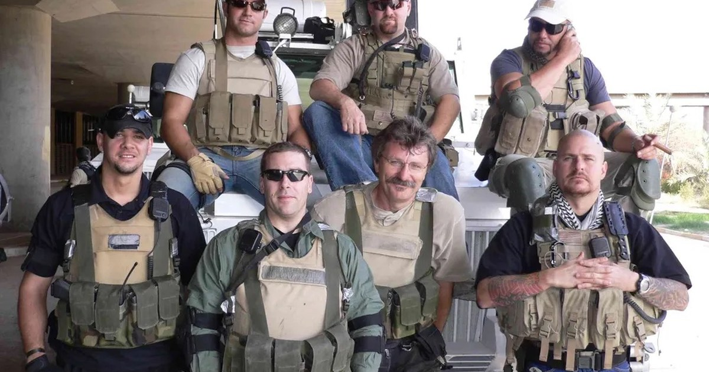

<!--
---
title: "제국을 지킨 용병의 역사"
title_en: "History of the Imperial Mercenaries"
subtitle: "베트남에서 우크라이나까지, 로마에서 PMC와 AI 드론까지 — 피의 경제학"
description: "로마 페데라티·베트남 파병·와그너·블랙워터에서 AI 드론·사이버 사략선까지. 제국이 피를 외주화하는 경제학과 얼굴 없는 전쟁의 청구서. 투자·학술 자문 아님(2026-09)."
abstract: |
  Korean macro/history column on mercenaries and PMCs (Sep 2026).
  Classical mercenaries (Egypt, Carthage, Rome, Swiss); foederati and empire collapse;
  Vietnam ROK troop economics; Soviet Muslim battalions; North Korea/Wagner in Ukraine;
  US privatization of war, Blackwater/CIA outsourcing; Rome vs 21st-century PMC table;
  AI drone war (Ukraine e-points, Lavender), privatized cyber offense (Aug 2026 NSM, cyber letters of marque);
  closing comparison of late Rome and present-day US military outsourcing.
  Not investment or academic advice.
summary_for_ai: |
  Korean column (not investment advice), 2026-09-19, group macro-geo,
  Private-Military-Company/History-of-the-Imperial-Mercenaries.md.
  Thesis: empires outsource blood for political deniability and price discrimination;
  outsourced violence eventually bills the employer (Carthage, Odoacer, Wagner).
  AI and network warfare remove the accountable face and let firms/individuals commission violence.
  Legal vs political-economy definitions of mercenary; PMC vs foederati parallels.
date: 2026-09-19
updated: 2026-09-19
author: "김호광 (Dennis Kim)"
lang: ko
tags:
  - 용병
  - PMC
  - 와그너
  - 블랙워터
  - 베트남전
  - 페데라티
  - 민간군사기업
  - 우크라이나
  - AI 드론
  - 사이버 용병
  - 전쟁 민영화
keywords:
  - "민간군사기업"
  - "용병 역사"
  - "와그너 그룹"
  - "블랙워터"
  - "페데라티"
  - "베트남 파병"
  - "피의 외주"
  - "전쟁 민영화"
  - "AI 드론 전쟁"
  - "사이버 사략선"
  - "얼굴 없는 전쟁"
group: macro-geo
featured: true
featured_rank: -13
og_image: "https://vibequant.cc/og/imperial-mercenaries.jpg"
image: "https://vibequant.cc/og/imperial-mercenaries.jpg"
schema_type: BlogPosting
draft: false
robots: index,follow
---
-->

# 제국을 지킨 용병의 역사

### 베트남에서 우크라이나까지, 로마에서 PMC와 AI 드론까지 — 피의 경제학

## 시작하는 말, 제국의 딜레마와 '피의 외주'

제국은 제국의 위엄을 보이기 위해 전쟁을 한다. 그러나 전쟁이 길어질수록 자국민의 관(棺)이 늘어나고, 여론은 등을 돌린다. 이 딜레마 앞에서 제국이 수천 년간 반복해 온 해법은 단순하다. **피를 외주화하는 것**이다. 동맹국이나 용병에게 피를 대신 흘리게 하고, 그 대가로 돈과 무기, 기술과 시장을 약속한다.

베트남전에서 한국군은 미국이 주도한 냉전 대리전에 참전했고, 그 대가로 군 현대화와 경제 원조를 얻었다. 우크라이나전에서 북한은 러시아에 포탄과 병력을 보내고 외화와 군사기술을 챙기고 있다. 그리고 그 사이, 미국은 전쟁 자체를 기업에 발주하기 시작했다. 이제 그 발주서에는 사람 대신 드론과 알고리즘, 해킹 도구가 적혀 있다.

이 칼럼은 고대 이집트·카르타고·로마·스위스의 용병에서 출발해, 용병이 칼끝을 돌려 나라를 무너뜨린 역사, 베트남전·소련의 아프가니스탄 침공·우크라이나전의 사례를 거쳐, 오늘날 민간군사기업(PMC)의 부상, 그리고 AI 드론과 네트워크 전쟁의 민영화까지 살펴본 뒤, 로마 제국의 황혼과 오늘의 미국을 나란히 놓고 마무리한다. 결론은 하나다. **피의 가격은 언제나 누군가가 지불하며, 외주화된 폭력은 언젠가 고용주에게 청구서를 보낸다는 것을 역사적으로 이야기하고자 한다.**

## 1. 용병의 고전적 원형 - 이집트, 카르타고, 로마, 스위스

용병은 인류 역사에서 가장 오래된 직업 중 하나다.

**이집트.** 신왕국 이집트는 일찍부터 외국인의 전문 기술을 군사력으로 흡수했다. 궁술에 능한 누비아인, 리비아인, 그리고 '바다 민족'의 일파인 셰르덴(Sherden)이 대표적이다. 람세스 2세는 즉위 초 해안을 약탈하던 셰르덴 해적을 격파한 뒤 이들을 자신의 친위대로 편입했고, 기원전 1274년 카데시 전투에서 이들은 파라오의 곁을 지켰다. 어제의 적이 오늘의 근위병이 되는 것, 용병 제도의 본질이 이미 여기 있다.

**카르타고.** 상업 제국 카르타고는 시민의 피 대신 은화로 전쟁을 치렀다. 한니발의 군대는 이베리아인, 켈트인, 발레아레스 투석병, 그리고 북아프리카의 **누미디아 기병**으로 구성된 다국적 용병군이었다. 그러나 제1차 포에니 전쟁 직후 급여를 받지 못한 용병들이 카르타고 본토를 공격한 '용병 전쟁(기원전 241–237년)'은 용병이 얼마나 위험한 칼인지를 보여주는 최초의 대형 사례로 남았다.

**로마.** 초기 로마는 시민병의 나라였다. 그러나 제국이 커지자 피정복민을 보조군(auxilia)으로 편입해 25년 복무 후 시민권을 주는 제도를 만들었다. 이것은 '돈으로 산 충성'이 아니라 '시민권으로 산 충성'이었고, 제국을 수백 년간 지탱한 영리한 설계였다. 문제는 그 설계가 무너진 이후, 로마 제국은 자신이 키운 용병들에 의해 철저하게 짓밟혔다.

**스위스.** 중세 말부터 19세기 중반까지 스위스 산악 지방의 가장 중요한 수출품은 병사였다. 창병 밀집대형으로 합스부르크와 부르고뉴를 연파한 스위스 용병(Reisläufer)은 유럽 전역에서 몸값이 치솟았고, 각 칸톤(주) 정부가 부대 단위로 계약을 맺어 병사를 '납품'했다. 스위스의 역사가이자 슈비츠 용병 가문의 후손인 요스트 아우프 데어 마우어는 스위스가 누린 평화와 번영의 상당 부분이 병사 수출 덕분이라고 평가하면서도, 자기 조상들의 일을 두고 "더러운 사업"이었다고 잘라 말한다. 오늘날 바티칸의 스위스 근위대는 그 5세기 역사의 마지막 흔적이다.

## 2. 용병이 칼끝을 돌릴 때 - 사병화와 제국의 붕괴

용병의 역사에서 가장 반복되는 장면은 **고용주를 향해 돌아선 칼**이다. 마키아벨리는 『군주론』 12장에서 용병을 두고 무익하고 위험하며, 평시에는 고용주를 약탈하고 전시에는 적 앞에서 달아나는 존재라고 경고했다. 그는 이탈리아 도시국가들이 용병에게 의존하다 몰락하는 것을 직접 목격한 사람이었다.

### 로마 제국 말기 - 페데라티(foederati)가 제국을 끝내다

4세기 후반부터 서로마는 게르만 부족 전체를 '동맹 부족(foederati)'으로 받아들여 국경 방어를 맡겼다. 과거의 보조군이 로마 장교 밑에서 로마식으로 훈련받은 개인이었다면, 페데라티는 **자기 부족장의 지휘 아래 부족 단위로 움직이는 무장 집단**이었다. 충성의 대상은 로마가 아니라 자기 족장이었고, 보수는 로마가 줄 수 있는 은화와 땅이었다.

- **410년**, 서고트족 페데라티의 지도자 알라리크는 약속된 보수와 정착지를 둘러싼 협상이 결렬되자 로마시를 약탈했다. 800년 만에 영원한 도시가 외적에게 유린당한 사건이었다.
- **5세기 중반**, 게르만계 장군 리키메르는 황제를 세웠다 폐위했다 하며 사실상의 '킹메이커'로 군림했다.
- **476년**, 이탈리아 주둔 페데라티가 이탈리아 영토의 3분의 1을 정착지로 요구했고, 실권자 오레스테스가 이를 거절하자 반란을 일으켰다. 반란군의 지도자 오도아케르는 오레스테스를 죽이고 그의 어린 아들인 황제 로물루스 아우구스툴루스를 폐위한 뒤, 황제의 표장을 콘스탄티노플로 보내버렸다. 서로마 제국은 외적의 침공이 아니라 **급여 분쟁**으로 끝났다.

### 맘루크와 콘도티에리 - 용병이 왕조가 되다

이슬람 세계의 맘루크는 노예로 사들여 키운 군인 집단이었다. 1250년 이집트의 맘루크는 자신들을 부리던 아이유브 왕조를 무너뜨리고 스스로 술탄이 되어 250년 넘게 이집트를 통치했다. 르네상스 이탈리아에서는 용병대장(condottiero) 프란체스코 스포르차가 고용주였던 밀라노를 1450년 장악해 공작 가문을 세웠다.

**교훈은 일관된다.** 국가가 폭력을 돈으로 사는 순간, 폭력을 가진 자는 언젠가 "더 많은 것을 요구할 수 있지 않나?"를 묻는다.

## 3. 용병의 경제학 - 피의 가격표

국제정치학에서 용병은 대체로 외국인이고, 주된 동기가 금전적 이익이며, 정규군에 편입되지 않은 무력 사용자로 정의된다. 제네바 협약 제1추가의정서 제47조의 법적 정의는 훨씬 좁아서, **분쟁 당사국이 아닌 국가가 자국 군대의 일원으로 공식 파견한 병력은 용병에서 명시적으로 제외된다.** 이 조항은 뒤에서 한국군과 북한군 논쟁 모두에 결정적인 기준이 된다.

> **이 칼럼의 용어 정리.** 혼동을 막기 위해 두 층위를 구분한다.
> - **법적 용병**: 제1추가의정서 제47조의 요건을 모두 충족하는 개인. 와그너 전투원 일부, 아이티의 외국인 계약 전투원 등이 논쟁 대상이다.
> - **기능적 용병(피의 외주)**: 법적 지위와 무관하게, 제국이 자국민의 피 대신 대가를 치르고 타인의 무력을 사는 **거래 구조**. 한국군·북한군·무슬림 대대는 법적으로는 용병이 아니지만, 이 칼럼은 이들이 놓인 거래 구조를 분석한다.
>
> 즉 이 칼럼이 한국군이나 북한군에 대해 '용병의 논리'라고 말할 때, 그것은 **병사 개인에 대한 법적·도덕적 규정이 아니라 국가 간 거래의 구조에 대한 분석**이다.

용병을 쓰는 제국의 계산은 세 가지로 요약된다.

1. **정치 비용의 외부화.** 외국인의 전사는 자국 여론에 잡히지 않는다. 관이 고향으로 돌아가지 않으면 반전 시위도 없다.
2. **부인 가능성(plausible deniability).** 정규군이 하면 국가의 책임이지만, 계약자나 동맹군이 하면 "우리가 한 일이 아니다"라고 말할 여지가 생긴다.
3. **가격 차별.** 같은 전투 임무라도 저소득국 병사의 몸값은 제국 병사보다 싸다. 베트남전의 수당 격차(4장)가 이를 정확히 보여준다.

크리스토퍼 킨지(Christopher Kinsey)는 *The Mercenary: An Instrument of State Coercion*에서, 프랑스 혁명 이후 국민군의 등장으로 사라진 것처럼 보였던 용병이 21세기에 국가 강제력의 도구로 되돌아왔다고 분석한다. 피터 싱어(P.W. Singer)의 *Corporate Warriors*는 이 흐름을 '군사 서비스 산업'이라는 이름으로 정리했다. 용병은 사라진 적이 없다. 이름과 법인격을 바꿨을 뿐이다.

## 4. 베트남전 - 한국군은 미국의 용병이었나?

베트남전은 냉전의 대리전이었다. 미국은 자국 사상자가 늘자 '더 많은 깃발(More Flags)' 정책으로 동맹국의 참전을 유도했고, 한국은 1964년부터 1973년까지 연인원 약 32만 명을 파병했다. 1966년 한국군 증파의 조건을 정리한 **브라운 각서**에는 한국군 현대화, 파병 경비의 미국 부담, 주월 한국군·미군 물자의 한국 내 조달, 한국 기업의 베트남 건설 참여 등이 담겼다.

### 경제적 실리

- 국방부 자료를 인용한 외교부 설명에 따르면, 1965–73년 파병 관련 외화 획득 효과는 군사원조 증가분 약 10억 달러, 미국이 부담한 한국군 파월 경비 약 10억 달러, 베트남 특수 약 10억 달러, 기술 이전·수출진흥 지원 약 20억 달러 등 **총 50억 달러 규모**로 추산된다.
- 반면 1970년 미 상원 사이밍턴 청문회에서 포터 주한 미국대사는 1965–69년 한국의 파병 이득을 약 5억 4,600만 달러로 제시하며, 참전하지 않은 일본보다 적었다고 증언했다. 같은 파병을 두고 계산법에 따라 열 배 가까운 차이가 나는 셈이다. 차이는 범위에서 온다. 포터의 수치는 1965–69년의 직접적 이득에 한정된 미국 측 산정이고, 50억 달러는 1965–73년 전 기간에 군사원조·차관·기술 이전 같은 간접 효과까지 합산한 한국 측 추산이다. **두 수치 모두 확정된 회계가 아니라 추정치**이며, 어느 쪽을 쓰느냐가 곧 파병을 어떻게 평가하느냐를 드러낸다.
- 파병 장병의 해외근무수당 총액은 약 2억 3,556만 달러였고, 이 중 82.8%가 국내로 송금되어 외환이 절실했던 한국 경제에 투입되었다. 파병 기간 한국은 연평균 10% 안팎의 고성장을 기록했고, 베트남에서 쌓은 건설·운송 경험은 1970년대 중동 건설 붐의 토대가 되었다.

일본은 군대를 보유하지 않는다는 평화 헌법을 방패 삼아 후방 병참과 전쟁에 필요한 군납 생산 기지로 한국보다 더 많은 수익을 얻었던 것으로 보인다. 일본에서 만들어진 라디오, 군복, 군화보다 한국군의 인건비가 더 저렴했던 것은 비극이다.

### 수당의 가격 차별과 '전용' 논란

2005년 공개된 외교문서에 따르면 한국군 사병의 해외수당은 연 5,000달러 수준으로, 필리핀군(7,000달러)이나 미군(1만 3,000달러)보다 낮았다. 국방부는 당시 수당이 국민소득 수준에 따라 책정되었고 미군 금액에는 전투수당이 포함돼 있다고 설명했다. 같은 전장, 같은 위험에 국적별 가격표가 붙어 있었던 것이다.

참전용사 단체들은 오랫동안 **미국이 지급한 금액보다 적은 수당이 장병에게 돌아갔고, 그 차액이 한미 간 비공개 합의를 통해 경제개발 자금으로 전용되었다**고 주장해 왔다. 흔히 '이면합의'로 불리는 이 주장은, 2005년 공개된 외교문서에서 확인된 수당 격차와 국내 송금 구조를 근거로 삼는다. 그러나 **차액의 전용을 명시한 문서가 공개된 적은 없고, 정부도 이를 인정한 적이 없다.** 따라서 현재로서는 입증된 사실이 아니라 사료적 검증을 기다리는 의혹으로 보는 것이 정확하다. 법원은 해외 파병 군인이 군인보수법상 전투수당 지급 대상이 아니고 소멸시효도 지났다는 입장을 유지해 왔으나, 2025년 일부 손해배상 소송이 조정에 회부되며 다시 주목받았다. 특별법 제정이나 실질적 배상은 예산과 다른 유공자와의 형평성 문제로 난항을 겪고 있다.

### 한국군은 용병이었나?

법적으로는 아니다. 한국군은 주권국가가 공식 파견한 정규군이었고, 제1추가의정서의 정의상 용병에서 명시적으로 제외된다. 그러나 **정치경제학적으로는 '용병의 논리'가 작동한 것도 사실이다.** 미국은 한국의 피로 자국민의 피를 대체했고, 한국 정부는 그 피를 국가 발전의 종잣돈으로 바꿨다. 참전용사들이 '용병'이라는 말에 분노하는 이유는 바로 여기에 있다. 그 딱지는 목숨을 건 개인의 선택을 모욕할 뿐 아니라, 거래의 이익을 챙긴 주체가 개인이 아니라 국가였다는 불편한 진실을 건드린다.

베트남 파병 용사들의 피와 땀을 통해 지금의 대한민국의 기틀을 세웠다는 점에서 한국인으로써 존경을 표하지 않을 수 없다.

## 5. 소련의 아프가니스탄 침공 - 무슬림 대대

1979년 소련은 아프가니스탄 침공에 앞서 타지크·우즈베크·투르크멘 등 중앙아시아 출신 병사들로 '무슬림 대대'(GRU 제154독립특수임무부대)를 편성했다. 외모, 언어, 종교 관습이 아프가니스탄인과 비슷하다는 점이 선발 기준이었다.

1979년 12월 27일 타지베그 궁전 습격(작전명 '폭풍-333')에서 이들은 아프가니스탄 군복을 입고 KGB 특수부대의 돌격을 엄호했고, 작전은 하피줄라 아민 대통령의 제거로 끝났다. 이들은 엄밀히 말해 소련 시민이자 정규군이었으므로 용병은 아니다. 그러나 제국이 **문화적 친연성을 가진 주변부 집단**을 '**현지인의 얼굴을 한 도구**'로 쓴 전형적 사례다. 로마가 게르만 부족으로 게르만 국경을 막으려 했던 논리와 같다.

아이러니는 그 다음에 왔다. 소련의 아프간 전쟁은 10년간 1만 5,000명에 가까운 전사자를 내며 제국의 정당성을 갉아먹었고, 반대편에서 미국 CIA가 파키스탄을 통해 무자헤딘에게 자금과 무기를 댄 이 전쟁은 훗날 CIA 준군사 활동의 원형이 되었다.

## 6. 우크라이나전, 두 종류의 용병 — 북한과 와그너

### 북한 - 국가가 파는 병력과 포탄

북한은 2024년 10월 1차 파병을 시작으로 네 차례에 걸쳐 전투병과 공병 등 2만여 명 이상을 러시아에 보낸 것으로 추정된다. 국가안보전략연구원 임수호 책임연구위원은 2026년 3월 보고서에서, 2023년 8월부터 2025년 12월까지 북한이 파병과 군수물자 수출로 얻었을 외화를 총 76억 7,000만–144억 달러(**최대 약 21조 5,000억 원**)로 추산했다. 하한과 상한의 차이가 두 배에 가깝다는 것 자체가, 이 수치가 확정치가 아니라 정황 증거에 기반한 **추정 범위**임을 보여준다.

주목할 점은 수익 구조다. 추정 수출액의 약 75%가 포탄이었고, KN-23 단거리탄도미사일이 약 11억 달러 규모로 뒤를 이었다. 즉 북한이 파는 것은 병사의 피만이 아니라 **탄약 공장의 생산능력**이다. 또한 실제로 확인된 대가는 추정 수익의 4–19.6%에 불과한데, 보고서는 대가의 상당 부분이 위성으로 관측하기 어려운 민감한 군사기술 형태일 가능성을 지적한다. 보고서는 북한이 대가를 모두 회수할 경우 외화 수입 차단이라는 대북 제재의 핵심 효과가 무력화될 수 있다고 경고했다.

구조는 베트남전과 닮았다. 제국(러시아)은 자국민 동원의 정치 비용을 줄이기 위해 동맹국의 피를 사고, 제공국(북한)은 그 대가로 외화와 기술을 얻는다. 다만 결정적 차이도 있다. 한국은 그 돈을 수출 산업과 인프라로 돌렸지만, 북한의 수익은 **규모도, 실제 회수 여부도, 용처도 외부에서 확인할 방법이 없다.** 이 칼럼이 인용하는 북한 관련 수치는 모두 추정이라는 점을 분명히 해 둔다. 그리고 북한군 역시 국가가 공식 파견한 정규군이므로, 법적으로는 한국군과 마찬가지로 용병의 정의 밖에 있다.

### 와그너 - 용병이 모스크바로 진군하다

러시아는 동시에 전혀 다른 종류의 용병도 썼다. 예브게니 프리고진의 민간군사기업 와그너 그룹은 시리아, 리비아, 말리, 중앙아프리카공화국에서 광물 채굴권과 맞바꿔 무력을 제공했고, 우크라이나에서는 교도소 수감자까지 모집해 바흐무트 전투의 선봉에 섰다.

그리고 2023년 6월 23–24일, 국방부가 와그너를 해체하고 병력을 정규군 계약으로 흡수하려 하자 프리고진은 반란을 일으켰다. 와그너 병력은 로스토프나도누를 장악한 뒤 하루 만에 약 780km를 북진해 모스크바를 약 200km 앞둔 지점에서 벨라루스 대통령의 중재로 진격을 멈췄다. 두 달 뒤 프리고진은 의문의 비행기 추락으로 사망했고, 와그너의 아프리카 사업은 국방부 산하 '아프리카 군단'으로 재편되었다.

**1,547년 전 오도아케르가 라벤나로 진군한 이유와 프리고진이 모스크바로 향한 이유는 본질적으로 같다.** 고용주가 계약 조건을 일방적으로 바꾸려 했고, 무장한 피고용자는 그 결정을 받아들이지 않았다. 차이가 있다면 오도아케르는 성공했고 프리고진은 실패했다는 것뿐이다.

## 7. 미국 - 전쟁의 민영화와 CIA의 외주

### 계약자가 병사보다 많은 군대

베트남전 당시 조리, 운전, 경비는 대부분 군인이 맡았다. 이라크와 아프가니스탄에서 그 일은 계약자에게 넘어갔다. 미 의회조사국(CRS)에 따르면 두 전쟁에서 국방부 인력의 절반 이상이 계약자인 경우가 흔했다. 2012년 아프가니스탄의 계약자는 11만 7,000명을 넘어 약 8만 8,000명의 미군을 웃돌았고, 2016년에는 계약자 대 병력 비율이 3 대 1까지 벌어졌다. 국방부는 2007–2016년 두 전장에서 계약자에게 2,200억 달러 이상을 지출했다. 2020년 10월 중부사령부 관할 지역 전체로는 계약자 약 4만 3,800명 대 군인 약 1만 5,000명이었다.

계약자의 대부분은 물류, 정비, 건설, 통역 인력이다. 그러나 문제는 무장 경호와 보안 업무를 맡은 민간군사·보안업체였다. 2007년 9월 바그다드 니수르 광장에서 블랙워터 경호원들이 발포해 이라크 민간인 17명이 숨졌다. 관련자들은 미국 법정에서 유죄를 받았지만 2020년 12월 대통령 사면으로 풀려났다. 계약자의 전사자는 공식 미군 사상자 통계에 잡히지 않는다. **정치 비용의 외부화는 통계 수준에서도 작동한다.**

### CIA의 준군사화와 외주

9·11 이후 CIA는 정보기관에서 **전투 조직**으로 변모했다. 2001년 가을 CIA 팀은 현금 가방을 들고 아프가니스탄에 들어가 북부동맹 군벌들을 사실상 고용했고, 이후 드론 표적살해 프로그램과 현지 민병대 조직을 직접 운영했다.

그 과정에서 가장 민감한 영역마저 외주로 넘어갔다. 2009년 뉴욕타임스 보도에 따르면 CIA는 2004년 알카에다 지도부를 표적으로 하는 비밀 프로그램에 블랙워터를 참여시켰다. 정식 계약이 아니라 설립자 에릭 프린스 등 회사 최고위층과의 개별 합의 형태였고, 프로그램은 실제 작전 전에 중단되었다. 블랙워터 인력은 파키스탄과 아프가니스탄 기지에서 프레데터 드론에 헬파이어 미사일을 장착하는 업무도 맡았는데, 이 계약은 2009년 리언 파네타 CIA 국장이 취소했다. 당시 한 전직 정보관리는 외주가 일이 잘못될 경우 기관을 보호하는 장치였다고 설명했다. **부인 가능성은 이 시스템의 버그가 아니라 설계 목표였다.**

### 블랙워터 이후 - 국가를 대신하는 기업

에릭 프린스는 블랙워터를 매각한 뒤에도 사업을 멈추지 않았다. 그의 새 회사 벡터스 글로벌(Vectus Global)은 2025년 3월부터 아이티에서 드론과 헬기, 외국인 전투원을 투입해 갱단 소탕 작전을 지원하고 있으며, 프린스는 아이티 과도정부와 **치안 작전과 국경 관세 징수 체계 재건까지 포함한 10년 계약**을 맺었다고 밝혔다. 계약 금액은 공개되지 않았다. 인권단체들은 이 작전 과정의 드론 공격으로 어린이를 포함한 민간인이 희생되었다고 문제를 제기해 왔다.

용병이 **세금을 거두는** 단계. 로마 말기의 페데라티가 토지와 세수를 요구하던 장면과 소름 끼치도록 닮았다.

## 8. 로마 제국 말기의 페데라티 vs 21세기 PMC

| 구분 | 로마 말기 페데라티 (4–5세기) | 21세기 PMC |
| --- | --- | --- |
| **고용 형태** | 부족 단위 조약(foedus) | 기업 단위 계약(contract) |
| **보수** | 금, 곡물, 정착지, 결국 세수의 일부 | 계약금, 자원 채굴권(와그너), 징세권(아이티) |
| **충성 대상** | 로마가 아닌 자기 부족장 | 국가가 아닌 회사와 주주 |
| **도입 동기** | 시민병 부족, 로마 시민의 병역 기피 | 모병제 한계, 반전 여론, 사상자 정치 비용 |
| **국가의 이점** | 국경 방어 비용 절감, 적으로 적을 막음 | 부인 가능성, 사상자 통계 외부화, 유연한 투입 |
| **법적 지위** | 로마법 밖의 반(半)독립 집단 | 국내법·국제법의 회색지대 |
| **통제 실패 사례** | 알라리크의 로마 약탈(410), 오도아케르의 황제 폐위(476) | 니수르 광장 사건(2007), 와그너 반란(2023) |
| **최종 결과** | 고용주가 사라지고 용병이 왕국을 세움 | 진행 중 |

두 체제의 공통점은 **국가가 폭력 독점을 스스로 해체했다**는 데 있다. 막스 베버는 국가를 '정당한 물리적 폭력의 독점을 성공적으로 주장하는 공동체'로 정의했다. 로마는 시민이 더 이상 싸우려 하지 않자 폭력을 부족에게 넘겼고, 현대 국가는 유권자가 사상자를 용납하지 않자 폭력을 기업에 넘기고 있다.

그러나 결정적 차이도 있다. 페데라티는 **영토**를 원했지만 PMC는 **계약 갱신**을 원한다. 기업은 부족보다 훨씬 쉽게 해체되고 재편된다. 와그너가 반란 두 달 만에 국방부 산하로 흡수된 것이 그 증거다. 현대 국가의 재정 능력과 감시 기술은 5세기 서로마와 비교할 수 없이 강하다. 따라서 "PMC가 미국을 무너뜨릴 것"이라는 식의 직선적 비유는 과장이다.

진짜 위험은 더 조용한 곳에 있다. **전쟁을 시작하는 비용이 너무 싸지는 것**이다. 자국민의 피가 흐르지 않고, 사망자가 통계에 잡히지 않고, 책임은 계약서 속으로 사라진다면, 민주주의가 전쟁에 제동을 거는 가장 강력한 장치인 '**여론의 공포**'가 작동하지 않는다. 로마가 페데라티에 의존하면서 잃은 것은 군사력이 아니라 **시민이 제국을 자기 것으로 여기는 공적 공감의 실종**이었다.

그리고 이 위험은 PMC에서 멈추지 않는다. 방아쇠가 사람에서 기계로, 전장이 영토에서 네트워크로 옮겨가면서 전쟁의 비용은 한 번 더 싸지고 있다.

## 9. 얼굴 없는 전쟁 - AI 드론과 네트워크 전쟁의 민영화

지금까지의 용병사는 결국 **사람**의 이야기였다. 누비아 궁수도, 게르만 족장도, 블랙워터 경호원도 얼굴과 이름이 있었고, 잘못을 저지르면 적어도 이론상으로는 법정에 세울 수 있었다. 2020년대의 전쟁은 이 전제를 무너뜨리고 있다. 방아쇠가 사람에게서 드론으로, 표적 선정이 참모에게서 알고리즘으로, 공격이 전장에서 네트워크로 옮겨가면서, **피의 외주는 이제 책임의 외주로 진화하고 있다.**

### 드론 전쟁의 시장화 - 전투가 화폐가 되다

우크라이나는 드론 전쟁의 실험장이다. 젤렌스키 대통령은 2026년 1월 드론이 러시아 표적에 대한 타격의 80% 이상을 수행하며 포병을 제치고 주력 살상 수단이 되었다고 밝혔다. 주목할 것은 기술보다 **제도**다. 우크라이나는 2024년 '드론 군대 보너스' 프로그램을 도입해, 드론 영상으로 검증된 타격마다 부대에 'e-포인트'를 지급하고 있다. 부대는 이 포인트로 국방 조달 플랫폼 'Brave1 마켓'에서 드론과 전자전 장비를 직접 주문한다. 2025년 중반 기준으로 전차 파괴는 8점, 러시아 드론 조종사 제거는 25점이었고, 2025년 9월에는 보병 타격 점수가 두 배로 올랐다. 2026년 6월 국방장관 페도로프는 400개가 넘는 부대가 이 방식으로 50만 대 이상의 드론과 로봇 장비를 주문했다고 발표했다.

같은 시스템이 드론으로 적 병사를 **생포하면 사살보다 10배의 점수**를 주도록 개편되었다는 점은 공정하게 적어 둘 필요가 있다. 인센티브 설계가 살상만이 아니라 정보 수집과 포로 확보도 유도할 수 있다는 뜻이다. 다만 이 수치들은 모두 우크라이나 정부가 발표한 것이며, 독립적으로 검증된 데이터가 아니다.

그럼에도 구조적 의미는 분명하다. **전투 성과가 점수로 환산되고, 점수가 시장에서 무기로 교환된다.** 스위스 칸톤이 병사를 부대 단위로 '납품'했다면, 21세기 전쟁은 타격 단위로 '정산'된다. 전쟁이 게임화·시장화될수록, 그 시장에 참여하는 주체는 반드시 국가일 필요가 없어진다.

### 알고리즘이 고르는 표적

2024년 이스라엘 매체 +972 매거진은 정보장교 6명의 증언을 토대로, 이스라엘군이 가자지구에서 '라벤더(Lavender)'라는 AI 시스템으로 표적 목록을 생성했다고 보도했다. 보도에 따르면 이 시스템은 전쟁 초기 약 3만 7,000명을 하마스 연계 용의자로 분류했고, 장교들은 표적 한 명을 승인하는 데 평균 20초 정도만 썼다. 오류율은 약 10%로 인식되고 있었다고 한다. 이스라엘군은 그런 '살해 목록'의 존재를 부인했다.

이 보도의 진위와 별개로, 방향은 이미 정해졌다. 미 육군은 2025년 7월 팔란티어와 최대 100억 달러 규모의 10년 기업 계약을 맺어 75건의 개별 계약을 하나로 통합했다. 2026년 3월에는 안두릴(Anduril)이 AI 기반 지휘통제 소프트웨어 '래티스(Lattice)'를 중심으로 120건이 넘는 조달을 묶은 최대 200억 달러 규모의 10년 계약을 따냈다. 두 금액 모두 실제 집행액이 아니라 **계약 상한**이다. 그러나 전장의 두뇌에 해당하는 데이터 통합과 표적 처리, 지휘통제의 핵심이 소수 기업의 플랫폼 위에서 돌아가게 되었다는 사실은 변하지 않는다.

블랙워터 시대의 외주가 **손**(경호, 운송, 미사일 장착)을 빌린 것이었다면, AI 시대의 외주는 **판단**을 빌린다.

### 네트워크 전쟁의 사략선

사이버 공간은 용병이 가장 빠르게 부활한 전장이다. 영국과 프랑스가 2024년 시작한 '팰맬 프로세스(Pall Mall Process)'는 상업용 스파이웨어, 해킹 대행, 제로데이 취약점 거래를 통제하려는 국제 협의체다. 이 선언문은 해커 용병(hackers-for-hire)을 **국가뿐 아니라 기업, 심지어 개인에게 고용되어** 시스템 침투를 수행하는 집단으로 정의한다. 영국 국가사이버보안센터(NCSC)는 상업용 사이버 침투 시장이 향후 5년간 거의 확실히 확대될 것이며, 규제가 느슨한 국가를 중심으로 불법 사례가 늘어날 것이라고 평가했다.

그리고 2026년, 미국은 이 흐름을 제도화하기 시작했다. 7월 마이크 리 상원의원과 팀 버쳇 하원의원은 '**사이버 나포면허 및 보복법**(**Cyber Letters of Marque and Reprisal Act**)'을 발의했다. 18세기 해적선에 적선 나포 권한을 주던 헌법상 제도를 사이버 공간에 되살려, 대통령이 민간 해커에게 공격 면허를 발급하도록 하는 법안이다. 면허 보유자는 보증금을 내야 하고, 회수한 자산의 일부는 정부 몫이 된다. 한 달 뒤인 8월 12일, 트럼프 대통령은 **심사를 통과한 민간 기업이 연방정부의 통제 아래 해외 사이버 범죄 조직을 상대로 감시와 공격 작전을 수행할 수 있도록 하는 국가안보 각서**에 서명했다. 법무부나 국토안보부와 계약을 맺은 참여 기업이 위협을 식별하고 작전을 제안하는 구조다. 불과 다섯 달 전 백악관 관계자들이 민간 사이버 공격 위임은 검토하지 않는다고 선을 그었던 것을 생각하면 급격한 전환이다.

이 각서는 기존 해킹 금지법(CFAA)의 틀 안에서 연방 통제를 전제로 하며, 과거의 '핵백(hack back)' 법안보다는 한 발 물러선 형태다. 그러나 전직 사이버사령부 관계자 한 명은 이를 청구 가능한 위협을 끝없이 만들어내는 영구기관에 빗대 비판했다. 위협이 있어야 계약이 갱신되는 사업자에게 위협을 정의하고 작전을 제안할 권한을 주는 구조, **페데라티에게 국경 방어를 맡기면서 국경 밖의 적이 얼마나 위험한지도 그들에게 보고받는 구조**와 크게 다르지 않다.

### 누구나 전쟁을 발주할 수 있는 시대

이 모든 흐름이 합쳐지면 하나의 결론에 이른다. **전쟁의 발주자가 더 이상 국가일 필요가 없다.**

- **국가가 기업에** 치안과 징세를 통째로 맡긴다. 아이티 과도정부와 벡터스 글로벌의 10년 계약이 그 사례다.
- **기업이 기업에** 공격을 발주한다. 팰맬 선언이 정의한 해킹 대행 시장에서 고객은 표적만 지정하고 결과물만 받아 간다.
- **개인이 기업에** 침투와 감시를 발주한다. 팰맬 선언이 해커 용병의 고객으로 '개인'을 명시한 것은 우연이 아니다.
- **무장 집단이 시장에서** 무기를 조달한다. 수백 달러짜리 상용 드론에 폭발물을 다는 기술은 우크라이나 전선을 넘어 중남미 카르텔과 무장단체로 확산되었다.

로마 시대에 군대를 사려면 황제의 금고가 필요했다. 르네상스 이탈리아에서는 도시국가의 재정이 필요했다. 블랙워터 시대에도 최소한 국가 규모의 계약이 필요했다. 그러나 드론은 부품 단위로 팔리고, 해킹은 서비스 단위로 팔리며, 표적 분석은 소프트웨어 구독으로 팔린다. **폭력의 최소 주문 단위가 급격히 작아지고 있다.** 이것은 막스 베버가 말한 국가의 폭력 독점이 해체되는 속도가 로마 말기보다 훨씬 빠를 수 있다는 뜻이다.

### 책임질 얼굴이 없다

철학자 안드레아스 마티아스는 2004년 자율적으로 학습하는 기계의 행동에 대해 제조자도, 운용자도, 기계 자신도 온전히 책임지지 않는 '**책임의 공백**(responsibility gap)'을 경고했다. 전쟁의 외주화는 이 공백을 정치, 경제, 사회, 윤리적인 면으로 기존 체제의 분열을 만든다.

니수르 광장에서 민간인 17명이 숨졌을 때 우리는 최소한 방아쇠를 당긴 경호원의 이름을 알았다. 그러나 AI가 생성한 목록에서 20초 만에 승인된 표적이 오인으로 드러난다면, 책임은 누구에게 있는가? 알고리즘을 설계한 기업인가, 데이터를 공급한 정보기관인가, 승인 버튼을 누른 장교인가, 드론을 조달한 플랫폼인가, 아니면 작전을 제안한 계약 기업인가? 모두가 조금씩 관여했고, 그래서 아무도 온전히 책임지지 않는다.

용병을 쓰는 제국의 세 가지 계산인 정치 비용의 외부화, 부인 가능성, 가격 차별은 AI와 네트워크 전쟁에서 극단까지 밀려간다. 자국민의 관은 돌아오지 않고, 책임은 공급망 속으로 흩어지며, 살상의 한계비용은 드론 한 대 값으로 떨어진다. **앞으로의 전쟁은 더 잔인해서가 아니라, 잔인함을 멈출 얼굴이 없어서 위험하다.**

## 10. 국제정치학적 담론

첫째, **동맹과 용병의 경계는 법이 아니라 권력이 긋는다.** 한국군과 북한군은 모두 법적으로 용병이 아니지만, 둘 다 제국의 전쟁에서 피를 팔고 외화를 얻었다. 우리는 한쪽을 '자유 수호'라 부르고 다른 쪽을 '용병'이라 부른다. 그 구분이 정당하려면 파병의 명분, 파병국의 정치체제, 그리고 수익의 용처까지 함께 따져야 한다.

둘째, **피의 외주는 제재를 무력화한다.** 북한 사례는 병력과 탄약이 제재 체제 밖에서 거래 가능한 '수출품'이 될 때, 외화 차단이라는 제재의 논리 자체가 흔들린다는 것을 보여준다.

셋째, **외주화된 폭력은 결국 고용주에게 돌아온다.** 카르타고의 용병 전쟁, 서로마의 오도아케르, 맘루크 왕조, 모스크바로 향한 와그너 행렬은 같은 패턴을 반복한다. 무장한 계약자는 계약이 불리해지는 순간 협상 테이블을 뒤엎을 수 있다.

넷째, **정보기관의 준군사화는 민주적 통제의 사각지대를 만든다.** CIA가 블랙워터와의 표적살해 프로그램을 수년간 의회에 보고하지 않았다는 사실은, 외주가 행정부 내부에서도 책임을 희석시킨다는 것을 보여준다.

다섯째, **국제법은 사람을 기준으로 설계되었고, 기계와 네트워크를 따라가지 못한다.** 제1추가의정서 제47조의 용병 정의는 전투에 '직접 참여하는 사람'을 전제로 한다. 해외 서버에서 공격 코드를 실행하는 계약 기업, 표적을 추천하는 알고리즘 공급자, 드론 부품을 파는 플랫폼은 이 정의 어디에도 들어가지 않는다. 팰맬 프로세스 같은 자발적 규범은 출발점일 뿐이며, NCSC 스스로 국제적 합의와 집행이 어려울 것이라고 인정하고 있다.

## 맺으며, 로마의 황혼과 오늘의 미국

용병의 경제학은 냉혹하다. 제국은 피를 외부화하고, 제공자는 그 대가로 실리를 얻는다. 그러나 그 거래에서 이익을 챙기는 쪽과 피를 흘리는 쪽은 좀처럼 일치하지 않는다.

베트남에서 돌아온 한국의 청년들은 고엽제 후유증과 수당 논란을 안고 반세기를 살았다. 그들이 벌어온 달러는 고속도로가 되었지만, 그 청구서는 여전히 법정에서 떠돌고 있다. 쿠르스크의 눈밭에 쓰러진 북한 병사들의 이름은 아마 영영 알려지지 않을 것이다. 바그다드에서 죽은 계약자들은 미군 전사자 명단에 없다.

마지막으로 로마의 황혼과 오늘의 미국을 나란히 놓아 본다.

**병역이 세금으로 바뀌었다.** 4세기 후반 로마는 지주들에게 신병을 보내는 대신 금으로 납부하게 하는 제도(aurum tironicum)를 확대했다. 시민은 싸우는 대신 돈을 냈고, 제국은 그 돈으로 게르만 전사를 샀다. 미국은 1973년 징병제를 폐지하고 모병제로 전환했으며, 오늘날 현역으로 복무하는 미국인은 인구의 1%에도 못 미친다. 2022년 미 육군은 모병 목표를 크게 밑돌았다. 시민은 세금을 내고, 국가는 그 세금으로 계약자와 플랫폼을 산다. 전쟁은 여전히 국민의 이름으로 치러지지만, 국민의 몸으로 치러지지는 않는다.

**핵심 역량이 제국 밖으로 빠져나갔다.** 5세기 서로마 군대의 실질적 지휘권은 스틸리코, 리키메르, 오도아케르 같은 게르만계 장군들에게 넘어갔다. 로마는 군대를 소유했지만 군대를 운영하는 지식과 충성은 소유하지 못했다. 오늘 미 육군은 데이터와 지휘통제의 핵심을 팔란티어와 안두릴의 기업 계약으로 통합하고 있고, 이라크와 아프가니스탄에서는 계약자가 병력보다 많았으며, 이제 사이버 공격까지 심사된 민간 기업에 위임하기 시작했다. 계약서의 상한액보다 중요한 것은, **이 기업들 없이는 군이 작동하지 않는 구조가 굳어지고 있다**는 사실이다.

**그러나 미국은 서로마가 아니다.** 미국의 재정 능력, 기술력, 법치와 감시 체계는 5세기 라벤나 궁정과 비교할 수 없다. 기업은 부족처럼 영토를 요구하지 않고 계약 갱신을 원하며, 와그너의 운명이 보여주듯 국가는 여전히 무장한 계약자를 해체할 힘을 갖고 있다. "PMC가 미국을 무너뜨린다"는 식의 직선적 예언은 과장이다.

진짜 교훈은 다른 곳에 있다. 서로마의 멸망은 하루아침의 사건이 아니었다. 476년 오도아케르가 황제의 표장을 콘스탄티노플로 보냈을 때, 당대인 대부분은 그것을 세계의 종말로 느끼지 못했다. 이미 수십 년 동안 로마의 전쟁은 로마인의 전쟁이 아니었기 때문이다. 시민이 제국의 전쟁에 대가를 치르지 않게 된 순간부터, 제국은 천천히 **자기 전쟁의 주인이 아니게** 되었다.

로마는 게르만 족장에게 칼을 맡겼다. 오늘의 제국은 계약서와 알고리즘과 드론에 방아쇠를 맡기고 있다. 다른 점이 있다면 **족장에게는 얼굴이 있었다**는 것이다. 알라리크에게 약탈의 책임을 물을 수 있었고, 오도아케르와는 협상할 수 있었다. 그러나 20초 만에 승인된 표적, 사략 면허를 받은 해커, 점수로 정산되는 드론 타격 앞에서 우리는 누구에게 책임을 물어야 하는가?

제국의 위엄을 위해 흘리는 피가 남의 피일 때, 제국은 전쟁을 멈출 이유를 잃는다. 그리고 그 피를 흘리게 하는 손마저 얼굴 없는 기계와 계약서가 될 때, 전쟁은 누구도 시작했다고 말하지 않고 누구도 끝낼 책임을 지지 않는 **상시적인 사업**이 된다. 역사는 외주화된 폭력의 청구서가 결국 고용주에게 도착한다는 것을 여러 번 보여주었다. 다음 청구서에는 받는 사람의 이름조차 적혀 있지 않을지 모른다.

## 참고 링크

**베트남전과 한국군 파병**

- 한국일보, 「[단독] '베트남전 참전용사' 전투수당 받게 되나… 법원 조정 회부」 (2025.07.14): https://www.hankookilbo.com/news/article/A2025071415080002450
- 한국일보, 「베트남戰 문서 공개 / "파월수당 年5,000弗… 比보다 적어"」 (2005.08.26): https://www.hankookilbo.com/news/article/200508260084020917
- 경향신문, 「베트남 파병 경제이익, 참전 안한 日보다 적어」 (2005.08.26): https://www.khan.co.kr/article/200508261825431
- 한국민족문화대백과사전, 「베트남특수」: https://encykorea.aks.ac.kr/Article/E0073434
- 위키백과, 「대한민국 국군의 베트남 전쟁 참전」: https://ko.wikipedia.org/wiki/대한민국_국군의_베트남_전쟁_참전

**북한의 대러 파병**

- 연합뉴스, 「"북, 러 파병·군수물자 수출로 21조원 수익 추정…제재 무력화"」 (2026.03.16): https://www.yna.co.kr/view/AKR20260316142200504
- VOA 한국어, 「INSS "북, 러 전쟁으로 최대 144억 달러 수익…제재 무력화 가능성"」 (2026.03.17): https://www.voakorea.com/a/north-korea-earns-up-to-14-4-billion-from-russia-ukraine-war-potentially-nullifying-sanctions-031726/8127096.html

**고대·중세 용병과 로마의 몰락**

- Wikipedia, "Foederati": https://en.wikipedia.org/wiki/Foederati
- Wikipedia, "Romulus Augustulus": https://en.wikipedia.org/wiki/Romulus_Augustulus
- History.com, "Who Was the Last Roman Emperor?": https://history.com/articles/last-roman-emperor-romulus-augustulus
- swissinfo.ch, "Mercenary trade paid for peace and prosperity": https://swissinfo.ch/eng/culture/mercenary-trade-paid-for-peace-and-prosperity/31568266
- Rhodes College, 이집트 용병사 우등논문(셰르덴 용병 관련): https://rhodes.edu/sites/default/files/2020-04/SNOWDEN%20HONORS%20FINAL%20DRAFT%20(1).pdf

**소련의 아프가니스탄 침공**

- BBC News, "Afghan role of 'Muslim Battalions'": http://news.bbc.co.uk/2/hi/asia-pacific/7892878.stm

**와그너 그룹**

- Al Jazeera, "As Wagner troops marched on Moscow, Ukraine made further gains" (2023.06.28): https://www.aljazeera.com/news/2023/6/28/as-wagner-troops-marched-on-moscow-ukraine-made-further-gains
- Daily Maverick, "Wagner Group mercenaries 'preparing to take new road to Africa'" (2023.07.25): https://www.dailymaverick.co.za/article/2023-07-25-wagner-group-mercenaries-preparing-to-take-new-road-to-africa-after-aborted-mutiny-in-russia/

**미국의 전쟁 민영화와 CIA 외주**

- Congressional Research Service, "Department of Defense Contractor and Troop Levels in Afghanistan and Iraq": https://sgp.fas.org/crs/natsec/R44116.pdf
- Military Times, "Report: Contractors outnumber U.S. troops in Afghanistan 3-to-1" (2016): https://www.militarytimes.com/2016/08/17/report-contractors-outnumber-u-s-troops-in-afghanistan-3-to-1/
- Dawn, "Private contractors in Afghanistan outnumber US troops" (2016): https://www.dawn.com/news/1278466
- Breaking Defense, "In Afghanistan, Contractors Were Unsung Heroes Of US Efforts" (2021): https://breakingdefense.com/2021/08/in-afghanistan-contractors-were-unsung-heroes-of-us-efforts/
- NPR, "Ratio Of Contractors To Troops At War? 1 To 1" (2009): https://www.npr.org/2009/12/18/121590071/ratio-of-contractors-to-troops-at-war-1-to-1
- NBC News (NYT 보도 인용), "Blackwater tied to CIA assassination plot" (2009): https://www.nbcnews.com/id/wbna32484932
- NPR, "CIA Ends Contract With Blackwater To Load Drones" (2009): https://www.npr.org/2009/12/11/121365762/cia-ends-contract-with-blackwater-to-load-drones
- The Haitian Times, "Erik Prince confirms 10-year contract with Haiti to restore security" (2025.08.15): https://haitiantimes.com/2025/08/15/erik-prince-10-year-contract-with-haiti/
- Business & Human Rights Resource Centre, Vectus Global의 아이티 배치 관련 (2025.08): https://www.business-humanrights.org/en/latest-news/haiti-vectus-global-reportedly-planning-10-year-deployment-raising-human-rights-concerns/

**AI 드론 전쟁과 알고리즘 표적 선정**

- Kyiv Independent, "Ukraine expands 'ePoints' system that rewards battlefield kills with weapons credits" (2026.04.23): <https://kyivindependent.com/ukraines-defense-minister-says/>
- Euromaidan Press, "Ukraine turned combat into currency" (2026.06.24): <https://euromaidanpress.com/2026/06/24/ukraine-turned-combat-into-currency-more-than-400-units-now-shop-for-their-own-weapons-with-points-earned-in-battle/>
- DroneXL, "Drone Units In Ukraine Earn Points For Strikes Through Military Marketplace" (2025.08.25): <https://dronexl.co/2025/08/25/drone-units-ukraine-earn-points-for-strikes/>
- Defence Blog, "Ukrainian frontline units trade drone kills for more drones" (2025.10.14): <https://defence-blog.com/ukrainian-combat-units-trade-drone-kills-for-more-drones/>
- +972 Magazine, "'Lavender': The AI machine directing Israel's bombing spree in Gaza" (2024): <https://www.972mag.com/lavender-ai-israeli-army-gaza/>
- Foreign Policy, "Israel's Algorithmic Killing of Palestinians Sets Dangerous Precedent" (2024.05.02): <https://foreignpolicy.com/2024/05/02/israel-military-artificial-intelligence-targeting-hamas-gaza-deaths-lavender/>
- The Register, "$10 billion, 10 year US Army contract elevates Palantir to defense contracting royalty" (2025.08.01): <https://www.theregister.com/2025/08/01/palantir_us_army_contract/>
- DefenseScoop, "Army awards Anduril $20B contract with an eye toward counter-drone capabilities" (2026.03.14): <https://defensescoop.com/2026/03/14/anduril-20-billion-dollar-army-contract/>
- Breaking Defense, "Army awards Anduril counter-drone task order as first in new $20B 'contract vehicle'" (2026.03): <https://breakingdefense.com/2026/03/army-awards-anduril-counter-drone-task-order-as-first-in-new-20b-contract-vehicle/>

**네트워크 전쟁의 민영화**

- CyberScoop, "Trump turns to private sector in offensive hacking operations memo" (2026.08.13): <https://cyberscoop.com/trump-memo-private-sector-offensive-hacking/>
- The White House, "Fact Sheet: President Donald J. Trump Expands Capabilities to Combat Transnational Cyber-Enabled Crime" (2026.08): <https://www.whitehouse.gov/fact-sheets/2026/08/fact-sheet-president-donald-j-trump-expands-capabilities-to-combat-transnational-cyber-enabled-crime/>
- The Record, "White House pours cold water on cyber 'letters of marque'" (2026.03.19): <https://therecord.media/offensive-cyber-white-house-hacking>
- U.S. Senator Mike Lee, "Lee Bill Authorizes American Hackers to Fight Foreign Cyberattacks" (2026.07): <https://www.lee.senate.gov/2026/7/lee-bill-authorizes-american-hackers-to-fight-foreign-cyber-attacks>
- Congress.gov, H.R.9697 "Cyber Letters of Marque and Reprisal Act" (119th Congress): <https://www.congress.gov/bill/119th-congress/house-bill/9697/text/ih>
- GOV.UK, "The Pall Mall Process: tackling the proliferation and irresponsible use of commercial cyber intrusion capabilities": <https://www.gov.uk/government/publications/the-pall-mall-process-declaration-tackling-proliferation-and-irresponsible-use-of-commercial-cyber-intrusion-capabilities/the-pall-mall-process-tackling-the-proliferation-and-irresponsible-use-of-commercial-cyber-intrusion-capabilities>
- NCSC, "Annual Review 2025 — Cyber threat to the UK": <https://www.ncsc.gov.uk/collection/ncsc-annual-review-2025/chapter-01-cyber-threat-to-the-uk>
- Carnegie Endowment, "Harmonizing Recent Campaigns to Tame the Hacking Marketplace": <https://carnegieendowment.org/research/2024/06/us-europe-cyber-policy-joint-statement-pall-mall-process?lang=en&center=india>

**1차 사료 및 공식 보고서**

- 외교통상부, 베트남전 관련 외교문서 공개(「브라운 각서 실천현황 보고서」 포함), 2005.08.26
- U.S. Senate, *United States Security Agreements and Commitments Abroad: Republic of Korea* (사이밍턴 청문회), Hearings, 1970.02.24–26
- 국가안보전략연구원(INSS) 임수호, 「북한의 대러 파병 및 군수물자 수출의 경제적 효과」, 2026.03
- Congressional Research Service, *Department of Defense Contractor and Troop Levels in Afghanistan and Iraq* (R44116), 연도별 개정판
- 제네바 협약 제1추가의정서(1977) 제47조 — 용병의 법적 정의
- 미국 국가안보 각서(NSM), 민간 기업의 해외 사이버 범죄 조직 대응 작전 참여 프로그램, 2026.08.12

**이론서 및 학술 연구**

- Christopher Kinsey, *The Mercenary: An Instrument of State Coercion*
- P.W. Singer, *Corporate Warriors: The Rise of the Privatized Military Industry* (Cornell University Press, 2003)
- Sean McFate, *The Modern Mercenary: Private Armies and What They Mean for World Order* (Oxford University Press, 2014)
- Peter Heather, *The Fall of the Roman Empire: A New History* (Macmillan, 2005)
- Guy Halsall, *Barbarian Migrations and the Roman West, 376–568* (Cambridge University Press, 2007)
- Andreas Matthias, "The responsibility gap: Ascribing responsibility for the actions of learning automata," *Ethics and Information Technology* 6(3), 2004
- Niccolò Machiavelli, 『군주론』 제12장
- Max Weber, 『직업으로서의 정치』 (1919)
