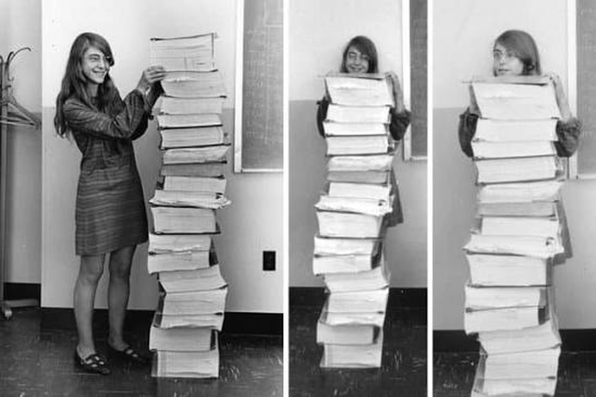

<!--
  HEAD 참조 (렌더링 안 됨 · 빌드 자동 주입 · 주석 풀지 말 것)
  <title>마거릿 해밀턴을 추모하며 · VibeQuant</title>
  <meta name="description" content="아폴로 11호 1202 경보를 넘긴 소프트웨어 공학의 어머니 마거릿 해밀턴이 90세로 세상을 떠났다. 절대 일어나지 않을 일이 일어났을 때, 시스템은 무엇을 먼저 지킬 것인가.">
  <meta name="robots" content="index,follow">

  
-->

# 마거릿 해밀턴을 추모하며

## 달 착륙을 가능케 한 소프트웨어, 그리고 시대의 리더

*자신의 키만큼 쌓인 아폴로 비행 소프트웨어 옆에 선 마거릿 해밀턴. MIT 계기장비 연구소, 1969. Photograph: NASA/MIT.*

**김호광** 싸이월드 전 대표 / 2026년 10월 8일

1969년 7월 20일, 아폴로 11호의 달 착륙선 '이글'이 달 표면을 향해 하강하던 마지막 순간이었다. 승무원과 휴스턴 관제센터를 얼어붙게 만든 경보가 울렸다. 오류 코드 1202. 하드웨어 스위치 결함 때문에 탑재 컴퓨터에 과부하가 걸렸고, 복잡한 착륙 절차를 감당하지 못할 수도 있는 상황이었다. 착륙까지는 불과 몇 분이 남아 있었다. 임무를 중단할지 말지 결정해야 하는 순간이었다.

그러나 이글은 무사히 '고요의 바다'에 내려앉았다. 그 뒤에는 마거릿 히필드 해밀턴이 이끈 MIT 계기장비 연구소 소프트웨어 팀이 있었다. 이 팀이 설계한 '우선순위 기반 비행 소프트웨어'가 위기를 넘기게 했다.

그 마거릿 해밀턴이 2026년 9월 30일, 90세의 나이로 세상을 떠났다. 영면한 곳은 매사추세츠주 케임브리지로, 그녀가 평생 일한 곳이다. 인류의 첫 달 착륙 소프트웨어를 만든 사람이 이제 역사 속으로 들어갔다.

## 수학과 철학을 공부한 소녀, 코드의 세계로

해밀턴은 1936년 인디애나주 파올리에서 태어났다. 미시간 대학교에서 수학 공부를 시작한 뒤 얼햄 칼리지로 옮겨, 1958년 수학 학사(철학 부전공)를 받았다. 이듬해 법학을 공부하는 남편을 따라 보스턴으로 왔다. 그녀가 처음 맡은 프로그래밍 일은 대학원 진학 전까지 하려던 임시직이었다.

그 첫 일은 MIT 기상학과의 에드워드 로렌즈 교수와 함께 한 날씨 예측 소프트웨어 작업이었다. 이 작업은 훗날 로렌즈의 카오스 이론 연구에도 영향을 주었다. 이후 MIT 링컨 연구소로 옮겨 미국 최초의 방공 시스템인 SAGE 프로젝트에서 소프트웨어를 작성했다. 이때 그녀는 당시로서는 거의 아무도 탐구하지 않던 '소프트웨어 신뢰성'이라는 개념에 관심을 갖기 시작했다.

1965년, 남편이 신문에서 MIT 계기장비 연구소의 구인 광고를 발견했다. 사람을 달에 보낼 소프트웨어를 만들 인재를 찾는다는 광고였다. 해밀턴은 지원했고, MIT 아폴로 프로젝트의 첫 번째 프로그래머이자 프로젝트 최초의 여성 프로그래머로 채용됐다.

## 400명의 팀, 그리고 '로렌 버그'

해밀턴은 처음에 무인 아폴로 임무의 소프트웨어를 맡았다. 이후 유인 임무의 탑재 비행 소프트웨어 개발을 이끄는 자리로 올라섰다. 1968년 그녀는 사령·기계선(CSM) 팀을 책임지는 부국장이 되었고, 당시 아폴로 소프트웨어에 투입된 인력은 400명이 넘었다. 남성 엔지니어들이 하드웨어를 중심으로 우주 개발을 이야기하던 시절이었다. 그녀는 소프트웨어가 임무의 성패를 좌우한다는 사실을 누구보다 먼저 꿰뚫어 보았다.

그녀의 철학을 가장 잘 보여주는 일화가 있다. 이른바 '로렌 오류'다. 네 살이던 딸 로렌이 연구소의 사령선 시뮬레이터를 가지고 놀다가, 비행 중인 상태에서 발사 전용 프로그램 P01을 실행해 시뮬레이터 전체를 다운시켰다. 해밀턴은 이 오류를 막는 수정안을 냈다. 하지만 고도로 훈련된 우주비행사가 그런 실수를 할 리 없다는 이유로 받아들여지지 않았다.

그런데 1968년 아폴로 8호 비행 중 짐 러벨이 실수로 P01을 실행했고, 항법 데이터가 사라졌다. 해밀턴 팀이 호출되어 문제를 해결했고, 그 뒤에야 그녀의 수정안이 프로그램에 반영됐다. 소프트웨어 스스로 오류를 예측하고 대비하는 '방어적 프로그래밍'의 초기 사례다. '절대 일어나지 않을 일도 일어날 수 있다'는 신념은 그녀의 경력 내내 거듭 증명됐다.

## 1202 경보 - 우선순위가 역사를 바꾼 순간

다시 1969년 7월로 돌아가 보자. 1202 경보가 울린 순간, 해밀턴 팀의 설계가 진가를 드러냈다. 이 소프트웨어는 불필요한 백그라운드 작업을 종료하고, 임무에 결정적인 작업을 우선 처리하도록 만들어져 있었다. 휴스턴은 해밀턴의 소프트웨어를 믿고 임무 속행을 허락했고, 두 사람이 처음으로 달 위를 걸었다.

컴퓨터는 처리할 수 있는 양보다 더 많은 일을 요구받고 있다는 사실을 스스로 알아챘다. 그리고 덜 중요한 작업을 버리고 착륙이라는 최우선 과제만 남겼다. 오늘날 운영체제와 실시간 시스템에서는 당연한 개념이다. 하지만 메모리가 겨우 수십 킬로바이트이던 1969년에는 혁명이었다.

NASA는 이 공로를 인정해 2003년 해밀턴에게 'NASA 특별 우주법 공로상(Exceptional Space Act Award)'을 수여했다. 그녀가 다듬은 비동기 처리, 우선순위 스케줄링, 종단 간 테스트, 인간 개입 의사결정 같은 개념은 이후 스카이랩과 우주왕복선 등 후속 프로젝트의 토대가 됐다.

## '소프트웨어 공학'이라는 이름을 지키다

지금은 너무나 당연한 '소프트웨어 공학(Software Engineering)'이라는 말은 해밀턴이 쓰기 시작해 널리 퍼뜨린 용어다. 처음부터 존중받은 말은 아니었다. 그녀는 2018년 엘파이스와의 인터뷰에서 이 용어를 처음 쓸 때 사람들이 우스갯소리로 받아들였다고 회고했다. 오랫동안 농담거리였고, 그녀의 급진적인 생각을 두고 놀림을 받았다고 했다. 그러나 결국 소프트웨어는 다른 공학 분야와 같은 존중을 얻었다. 그 길을 낸 것은 해밀턴의 고집이었다.

아폴로 이후에도 그녀의 도전은 계속됐다. 1976년 오류 예방과 결함 허용을 핵심으로 한 첫 회사 하이어 오더 소프트웨어(Higher Order Software)를 세웠다. 1986년에는 케임브리지에서 해밀턴 테크놀로지를 창업하고 CEO가 됐다. 이 회사의 대표 제품인 범용 시스템 언어(USL)는 오류 예방과 방어적 프로그래밍을 중시하는 시스템 모델링 언어이자 방법론이다. 그녀는 130편 이상의 논문과 보고서를 남겼다. 약 60개의 프로젝트와 6개의 대형 계획에도 참여했다.

## "다행히 그들에게는 마거릿 해밀턴이 있었다"

2016년 11월 22일, 버락 오바마 대통령은 백악관 이스트룸에서 해밀턴에게 미국 민간인 최고 영예인 대통령 자유 훈장을 수여했다. 시상식에서 오바마는 이렇게 말했다. "우리 우주비행사들에게는 시간이 많지 않았지만, 다행히 그들에게는 마거릿 해밀턴이 있었다." 훈장 공식 문구는 그녀가 새로운 형태의 소프트웨어 공학을 정의했고, 인류 역사를 영원히 바꿀 산업을 일으키는 데 기여했다고 평가했다.

뒤늦은 대중적 조명도 이어졌다. 1969년에 찍은 사진 한 장이 인터넷에서 퍼져 나갔다. 자신의 키만큼 쌓인 아폴로 코드 출력물 옆에 선 젊은 해밀턴의 모습이다. 2015년에는 그녀가 개발에 참여한 아폴로 소프트웨어 전체가 GitHub에 공개됐다. 2017년에는 레고 '여성 NASA 영웅들' 세트의 공식 미니피규어가 되었다. 이후 2017년 컴퓨터 역사 박물관 펠로상, 2019년 인트레피드 평생 공로상을 받았고, 2022년에는 미국 국립 항공 명예의 전당에 헌액됐다.

## 담백한 개척자, 새로운 시대의 롤모델

해밀턴의 삶이 특별한 이유는 화려한 수상 경력에만 있지 않다. 그녀는 자신을 과장하지 않았다. 아폴로 시절을 돌아보며 그녀는 스스로를 '세상에서 가장 운 좋은 사람들'이었다고 했고, 개척자가 되는 것 외에는 선택지가 없었다고 말했다. 제2의 기회는 없었고, 20대의 젊은 엔지니어들이 서로를 존중하며 길을 찾아냈다는 것이다.

그녀는 여성이 과학기술 분야에서 주도적 역할을 맡기 어렵던 시절에 수백 명 규모의 소프트웨어 조직을 이끌었다. 어린 딸을 밤과 주말에 연구소로 데려오며 일했고, 그 딸의 장난에서조차 시스템의 허점을 찾아냈다. 아무도 이름 붙이지 않았던 분야에 이름을 주었고, 그 이름이 농담에서 학문이 될 때까지 물러서지 않았다. 해밀턴은 여성 리더의 롤모델이기 이전에, 모든 엔지니어가 닮고 싶어 할 태도의 표본이었다.

MIT 항공우주학과의 올리비에 드 베크 교수는 그녀의 경력을 이렇게 요약했다. 오류를 예방하고, 그녀가 '미지의 것을 다루기'라고 부른 일에 바쳐진 삶이었다는 것이다. 오늘날 우리는 소프트웨어가 비행기를 띄우고, 자동차를 몰고, 금융을 움직이고, 이제는 AI가 코드를 써 내려가는 시대에 산다. 이런 시대일수록 해밀턴의 질문은 더 무겁게 다가온다. '절대 일어나지 않을 일'이 일어났을 때, 우리의 시스템은 무엇을 먼저 지킬 것인가.

## 맺으며

인류가 달에 첫발을 디딘 그날, 닐 암스트롱과 버즈 올드린이 달 위를 걸은 최초의 인간이었다. 그리고 해밀턴 팀의 소프트웨어는 달 위에서 처음 실행된 소프트웨어였다. 인류의 위대한 도약 뒤에는 마거릿 해밀턴이라는 이름이 있었다.

그녀의 추모식은 내년 봄 케임브리지에서 열릴 예정이다. 그녀를 추모하며, 그녀가 남긴 도전의 정신이 새로운 길 앞에서 망설이는 모든 이들에게 용기가 되기를 바란다.

*Rest in peace, Margaret Hamilton (1936–2026).*

---

### 참고 자료

- MIT News, "Margaret Hamilton, computing pioneer who led software development for the Apollo program, dies at 90" (2026.10.7) — https://news.mit.edu/2026/margaret-hamilton-computing-pioneer-dies-1007
- WIRED, "Her Code Got Humans on the Moon—And Invented Software Itself" (2015) — https://www.wired.com/2015/10/margaret-hamilton-nasa-apollo/
- 과학기술정보 — http://www.stiweb.org/icttech/23744
- 위키백과, 마거릿 해밀턴 (과학자) — https://ko.wikipedia.org/wiki/%EB%A7%88%EA%B1%B0%EB%A6%BF_%ED%95%B4%EB%B0%80%ED%84%B4_(%EA%B3%BC%ED%95%99%EC%9E%90)
- MIT Technology Review, "Margaret Hamilton" (2019) — https://www.technologyreview.com/2019/08/16/579/margaret-hamilton/
