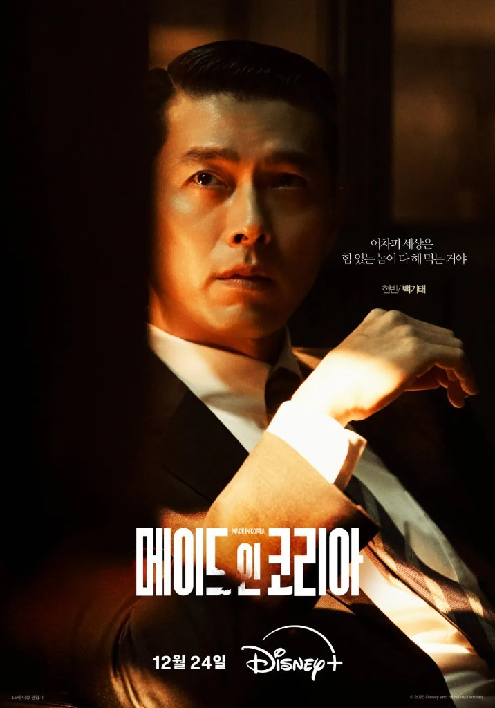

<!--
---
title: "약속이 깨질 때마다, 돈만 남았다"
title_en: "Every Time a Promise Broke, Only Money Remained"
subtitle: "왜 한국인은 돈을 삶의 1순위로 꼽게 되었나, 그리고 가족마저 사라질 때 무엇이 남는가?"
description: "한국인만 물질적 풍요를 삶의 1순위로 꼽는다. 탐욕이 아니라 깨진 약속의 누적이다. 『메이드 인 코리아』가 보여 주듯, 애국으로 포장된 욕망이 돈과 땅을 남겼다."
abstract: |
  2021년 퓨 리서치에서 17개 선진국 중 물질적 풍요를 삶의 의미 1순위로 올린 나라는 한국뿐이다. 탐욕이 아니라 불신의 누적이다. 신분, 국가, 고향, 회사가 차례로 약속을 깨뜨린 자리에 돈과 땅이 남았다.
  일제 강점기의 족보 매매부터 강남 개발, IMF, 『기생충』과 『오징어 게임』까지 이어지는 궤적을, 우민호 『메이드 인 코리아』의 백기태가 한 장면으로 압축한다. 애국으로 포장된 수출과 가족 사업.
  가족이 흔들리는 지금 첫 번째 가치는 돈도 가족도 아니라 지켜지는 공공의 약속, 곧 신뢰다. 법률 자문·투자 권유 아님.
summary_for_ai: |
  Korean societal-values essay (not legal or investment advice), 2026-09-24,
  group korea, Societal-Values/Korea-Societal-Values.md.
  Pew 2021: Korea uniquely ranks material well-being #1 for meaning in life (family #3); occupation as meaning 6% vs Italy 43%. Thesis: not greed but accumulated broken promises (status, state, hometown, company). Family love translated into providing money.
  Arc: Japanese colonial era (족보 for sale, 채만식 태평천하, 아가씨); Korean War (가족 as survival unit, 몰아주기); Park Chung-hee (labor betrays, land does not; Gangnam; 난쏘공); Disney+ Made in Korea (Hyun Bin as 백기태, meth as patriotism/export); IMF (체면 currency swap); Gangnam as Christaller + Veblen; Japan/Singapore/Taiwan contrasts; 1-person households, lonely deaths; HDB vs HK subdivided flats.
  Close: first value should be public trust that is kept. Fertility rebound is a signal the last promise is not fully broken. Investment/legal disclaimer.
date: 2026-09-24
updated: 2026-09-24
author: "김호광 (Dennis Kim)"
lang: ko
tags:
  - 한국
  - 사회적가치
  - 부동산
  - 메이드인코리아
  - 퓨리서치
  - 신뢰
keywords:
  - "물질적 풍요"
  - "퓨 리서치"
  - "메이드 인 코리아"
  - "강남"
  - "공공의 약속"
  - "한국 가치관"
group: korea
featured: true
featured_rank: 1
og_image: "https://vibequant.cc/og/korea-societal-values.jpg"
image: "https://vibequant.cc/og/korea-societal-values.jpg"
schema_type: BlogPosting
draft: false
robots: index,follow
---

<!--
  HEAD 참조 (렌더링 안 됨 · 빌드 자동 주입 · 주석 풀지 말 것)
  <title>약속이 깨질 때마다, 돈만 남았다 · VibeQuant</title>
  <meta name="description" content="한국인만 물질적 풍요를 삶의 1순위로 꼽는다. 탐욕이 아니라 깨진 약속의 누적이다. 『메이드 인 코리아』가 보여 주듯, 애국으로 포장된 욕망이 돈과 땅을 남겼다.">
  <meta name="robots" content="index,follow">

  
-->

# 약속이 깨질 때마다, 돈만 남았다

## 왜 한국인은 돈을 삶의 1순위로 꼽게 되었나, 그리고 가족마저 사라질 때 무엇이 남는가?

*우민호 감독 디즈니+ 『메이드 인 코리아』(2025). 주연 현빈. 낮에는 국가를 지키고 밤에는 히로뽕을 애국이라 부른 남자.*

**김호광** 싸이월드 전 대표 / 2026년 9월 24일

2021년 퓨 리서치 센터는 17개 선진국 사람들에게 삶을 의미 있게 만드는 것이 무엇인지 물었다. 17곳 중 14곳이 가족을 1순위로 꼽았다. 예외는 셋이었다. 스페인은 건강, 대만은 사회, 한국은 물질적 풍요였다. 물질적 풍요를 2위에 둔 나라는 네덜란드, 벨기에, 일본이 있었지만 1위에 올린 나라는 한국뿐이다. 한국은 그다음으로 건강을 2위, 가족을 3위에 두었고, 다른 나라에서 상위권이던 친구와 취미는 순위에 들지 못했다.[^pew]

눈여겨볼 숫자가 하나 더 있다. 직업을 삶의 의미로 언급한 비율은 이탈리아가 43%로 가장 높았고 한국이 6%로 가장 낮았다.[^pew] 한국인은 세계에서 가장 오래 일하는 국민에 속하지만 일 자체에서 의미를 찾는 사람은 드물다. 일은 목적이 아니라 수단이고, 그 수단이 향하는 곳이 돈이다.

이것을 탐욕의 문제로 읽으면 틀린다. 이것은 **불신의 누적**이다. 지난 백 년 동안 한국인이 기댔던 약속은 차례로 깨졌다. 신분이 깨졌고, 국가가 깨졌고, 고향과 공동체가 깨졌고, 마지막으로 회사가 깨졌다. 그 폐허 위에서 끝까지 배신하지 않은 것처럼 보인 것은 하나였다. 돈, 그리고 돈의 가장 단단한 형태인 땅이다.

그리고 지금, 한국인이 마지막까지 붙잡고 있던 가족이라는 약속마저 인구 구조 앞에서 흔들리고 있다.

## 1. 족보를 돈으로 사는 일제 강점기

1894년 갑오개혁은 신분제를 법으로 폐지했다. 그러나 신분의 사회적 의미를 실제로 부순 것은 식민지 자본주의였다. 1910년대 토지조사사업은 관습과 명분으로 얽혀 있던 땅을 등기하고 사고팔 수 있는 근대적 사유재산으로 바꿨다. 한국인이 땅을 상품으로 처음 경험한 시점이다.

채만식의 『태평천하』(1938)의 윤직원 영감은 이 시대의 초상이다. 그는 몰락한 양반이 아니라 돈으로 양반 흉내를 사는 신흥 지주다. 족보를 돈으로 꾸미고, 자손을 군수와 경찰서장으로 만들어 가문을 세우려 한다. 식민지 치하를 태평천하라 부르는 그의 논리는 단순하다. 내 재산이 지켜지는 한 나라가 누구 것이든 상관없다. 염상섭의 『삼대』(1931)의 조의관 역시 족보를 사들이고, 집안은 재산 다툼으로 무너진다.

영화로는 박찬욱의 『아가씨』(2016)가 짝을 이룬다. 조선인이면서 일본인이 되려는 코우즈키, 백작 행세를 하는 사기꾼, 하녀로 위장한 도둑까지 등장인물 모두가 신분을 연기한다. 신분이 타고나는 것이 아니라 **사고팔고 위조할 수 있는 것**이 된 시대, 그것이 식민지 근대였다.

이 시대의 교훈은 하나다. 명분은 무너지고, 돈은 신분을 살 수 있다.

## 2. 해방과 6·25의 혼란기 - 믿을 것은 가족뿐, 그리고 한 명에게 몰아주기

해방 직후 한국은 유례없는 평탄화를 겪었다. 1950년 농지개혁이 지주 계급을 해체했고, 곧이어 전쟁이 남은 것을 불태웠다. 모두가 거의 같은 출발선, 즉 폐허에 섰다. 결과는 두 가지였다. 누구나 올라갈 수 있다는 믿음, 그리고 그렇기에 누구도 뒤처져서는 안 된다는 공포다.

전쟁은 국가와 이념에 대한 신뢰도 부쉈다. 낮에는 국군이, 밤에는 빨치산이 마을을 지배했고, 어느 편에 섰느냐가 생사를 갈랐다. 윤흥길의 『장마』(1973)는 한 지붕 아래 국군 아들을 둔 외할머니와 빨치산 아들을 둔 친할머니의 갈등을 그린다. 이념은 가족을 찢었지만, 두 할머니를 화해시킨 것도 가족이었다. 민족도 국가도 이념도 아닌 **가족만이 믿을 수 있는 생존 단위**가 되었다.

그 가족은 곧 경제 단위가 되었다. 박완서의 『엄마의 말뚝』에서 어머니는 아이들을 서울 문안 사람으로 만들기 위해 모든 것을 걸고 상경한다. 소를 팔아 대학을 보낸다는 우골탑이라는 말이 생겼고, 가족 중 가장 똑똑한 한 명에게 가족 전체의 자원을 몰아주는 전략이 표준이 되었다. 윤제균의 『국제시장』(2014)의 덕수는 파독 광부로, 베트남 전쟁 기술자로 떠돌며 동생의 학비와 집안의 생계를 댄다. 그의 인생은 가족이라는 포트폴리오에 대한 투자 기록이다.

여기서 퓨 조사의 역설이 풀린다. 한국인에게 가족과 돈은 경쟁하는 가치가 아니다. **한국에서 가족을 사랑한다는 것은 곧 가족을 먹여 살리고, 밀어주고, 끌어올린다는 뜻이었다.** 가족에 대한 사랑이 물질적 풍요라는 언어로 번역된 사회에서, 돈이라는 답을 가족을 버렸다는 뜻으로 읽을 수는 없다.

## 3. 박정희 시대 - 노동은 배신하고, 땅은 배신하지 않는다

"잘 살아보세." 1960~70년대의 국가는 윤리 대신 성장을 약속했다. 성장만이 살 길이라는 구호 아래 공동체의 가치, 고향, 노동의 존엄은 성장의 연료가 되었다.

이 시대의 핵심 사건은 1970년대 강남 개발이다. 유하의 『강남 1970』(2015)은 영동 개발의 이면을 그린다. 정권의 정치자금, 개발 정보를 쥔 자들의 땅 투기, 그 과정에서 휘둘러진 폭력. 넝마주이 출신 고아인 두 주인공은 땅이 곧 신분 상승의 사다리라는 것을 몸으로 배운다.

국가는 강남을 채우기 위해 신분 상승의 핵심 장치까지 옮겼다. 1976년 경기고를 시작으로 강북 명문 고교들이 강남으로 이전했고, 이것이 8학군의 출발이다. "가장 똑똑한 한 명에게 몰아주기"의 종착지가 강남으로 정해진 셈이다. 1978년 현대아파트 특혜분양 사건과 복부인이라는 신조어는 부동산이 이미 계급의 언어가 되었음을 보여준다.

그 반대편에 조세희의 『난장이가 쏘아올린 작은 공』(1978)이 있다. 낙원구 행복동의 난장이 가족은 평생 일했지만 철거 계고장 한 장에 집을 잃고, 입주권은 헐값에 투기꾼에게 넘어간다. 교훈은 명확하다. **노동은 배신하고, 땅은 배신하지 않는다.** 선분양 제도와 전세라는 독특한 금융 구조는 평범한 가계를 레버리지 투자자로 만들었다. 한국인에게 아파트는 주거가 아니라 가장 확실한 저축 수단이 되었다. 오늘날 한국 가계 자산의 약 4분의 3이 부동산에 묶여 있는 것은 이 시대가 남긴 유산이다.[^ms]

### 3-1. 메이드 인 코리아 - 히로뽕을 애국이라 부른 남자

박정희 시대의 욕망을 가장 노골적으로 해부한 작품은 최근에 나왔다. 우민호 감독의 디즈니+ 드라마 『메이드 인 코리아』(시즌 1, 2025~2026)다.[^mik] 주인공 백기태(현빈)는 중앙정보부 부산지부 정보과장이다. 낮에는 국가를 지키고, 밤에는 히로뽕을 만들어 일본에 판다. 그는 자기가 하는 일을 범죄라고 부르지 않는다. 애국이라고 부른다. 그리고 그 모든 일이 가족을 위한 것이라고 믿는다. 이 드라마의 장면들을 순서대로 늘어놓으면, 1970년대 한국이 무엇을 욕망했고 그 욕망을 어떤 말로 포장했는지가 드러난다.

**장면 1. 인질을 구한 남자의 가방.** 1970년, 후쿠오카행 일본 여객기가 극좌파에게 납치된다. 실제 요도호 사건을 모티브로 한 장면이다. 백기태는 납치범들과 협상해 여자와 아이, 노인을 먼저 풀려나게 한다. 영웅의 얼굴이다. 그러나 그의 가방에는 일본에서 거래할 히로뽕이 들어 있다. 보안검색이 강화되자 그는 마약 가방을 납치범들에게 넘기고 정체를 숨긴 채 살아남는다. 드라마의 첫 장면은 이 인물의 공식을 보여준다. 영웅과 범죄자는 한 몸이고, 그 둘을 가르는 것은 가방 속을 누가 보느냐뿐이다.

**장면 2. 마츠다 켄지라는 이름.** 일본을 오갈 때 백기태는 마츠다 켄지라는 일본인 사업가 행세를 한다. 해방 25년 뒤, 한국의 정보요원이 일본 이름으로 일본에 약을 판다. 1장에서 본 『아가씨』의 세계, 곧 신분을 사고팔고 위조하는 식민지 근대는 끝나지 않았다. 이름만 바꿔 사업 모델이 되었다.

**장면 3. "외화를 버는 것이 애국이다."** 백기태의 논리는 단순하다. 한국에서 만든 히로뽕을 일본에 팔면 외화가 들어오고, 그 돈은 결국 나라에 도움이 된다. 이 논리는 시대의 공식 언어를 그대로 베낀 것이다. 수출만이 살 길이라는 구호, 수출 실적을 탑으로 세워 기념하던 국가. 드라마 제목 『메이드 인 코리아』는 수출품에 찍히던 원산지 표시다. 무엇을 파는지는 묻지 않고 얼마를 벌었는지만 묻던 시대에, 마약도 수출품이 될 수 있었다. 같은 감독의 영화 『마약왕』(2018)에서 이미 한 번 나왔던 논리이고, 이 드라마는 그 대사를 이스터에그로 다시 불러낸다.

**장면 4. 징용지에서 시작된 약.** 백기태를 쫓는 부산지검 검사 장건영(정우성)에게 히로뽕은 사건이 아니라 가족사다. 그의 아버지는 일제강점기 강제징용지에서 밤샘 노동을 위해 히로뽕을 투약당했고, 해방 후에도 중독에서 벗어나지 못해 결국 아내를 죽였다. 아버지는 지금 정신병원에 있고, 자신이 무엇을 했는지도 기억하지 못한다. 식민지가 조선인의 몸에 주입한 약이, 해방 한 세대 뒤에는 한국인이 일본에 파는 수출품이 된다. 가해와 피해의 자리만 바뀌었을 뿐, 사람을 돈의 연료로 쓰는 구조는 그대로다.

**장면 5. 가족 사업.** 백기태의 여동생 백소영은 은행원이었다. 평생 가족을 위해 희생해온 오빠를 절대적으로 믿었던 그녀는 직장을 그만두고 히로뽕 사업의 돈을 관리한다. 2장에서 말한 가족이라는 경제 단위가 여기서 가장 어두운 형태로 나타난다. 가족은 서로를 믿기 때문에 가장 안전한 금고가 되고, 가장 안전한 공범이 된다.

**장면 6. 몰아주기의 역설.** 백기태가 유일하게 약해지는 상대는 막내 백기현(우도환)이다. 육군사관학교 수석 졸업, 집안의 자랑이다. 가장 똑똑한 한 명에게 모든 것을 몰아준다는 한국 가족의 전략이 이 형제 관계에 그대로 담겨 있다. 기현이 복무하던 부대에서 총기난사가 일어나고 상관들이 책임을 떠넘기려 하자, 기태는 부대를 찾아가 중대장을 응징하고 동생에게 보안사 자리까지 마련해준다. 그러나 기현은 형이 만든 자리를 거절하고 월남 파병을 택한다. 형에게는 사랑이었던 것이 동생에게는 자기 인생에 대한 침범이었다. 월남은 『국제시장』의 덕수가 가족을 위해 떠났던 바로 그 전쟁터다. 그곳에서 보안사에 발탁된 기현은 감청 끝에 형이 히로뽕 원료 공급망을 찾아 전쟁터까지 들어와 있다는 사실을 확인한다. 형의 그늘을 벗어나려고 떠난 동생이 형의 범죄를 추적하는 자리에 서게 된 것이다.

**장면 7. 비자금은 올려 바친다.** 백기태의 상관인 부산지부장 황국평은 폭력조직을 비호하며 상납을 받는다. 부하가 자기 몰래 큰돈을 벌고 수사망까지 좁혀오자, 황국평은 백기태에게 모든 책임을 떠넘기고 제거하려 한다. 백기태는 먼저 황국평을 죽인다. 그리고 그가 숨겨둔 비자금을 챙기는 대신 대통령 경호실장 천석중에게 가져가, 다가오는 대통령 선거 자금을 자신이 만들어주겠다고 제안한다. 이 장면에서 백기태의 사업은 밀매에서 권력 사업으로 바뀐다. 히로뽕이 돈이 되고, 돈이 정치자금이 되고, 정치자금이 자신을 보호할 권력이 된다. 1970년대 한국에서 돈의 최종 용도는 소비가 아니라 보호였다.

**장면 8. 요정과 수첩.** 정·재계 거물이 드나드는 요정의 마담 배금지(조여정)에게는 권력자들의 이름을 적은 비밀 수첩이 있다는 소문이 돈다. 실제 정인숙 피살사건을 모티브로 한 설정이다. 경호실장조차 그 수첩을 두려워한다. 권력자의 약점이 곧 화폐였고, 그 화폐는 밀실에서 거래되었다. 백기태는 여기서 배운다. 돈을 많이 버는 사람보다 돈과 정보로 사람을 움직이는 자리가 더 높다는 것을.

**장면 9. 간첩은 만들어진다.** 장건영이 수사를 멈추지 않자 백기태는 그의 여동생을 간첩 사건에 엮어 조작한다. 국가의 공안 장치가 한 개인의 사업을 지키기 위해 동원된다. 가족을 지키려는 남자가 남의 가족을 인질로 잡는 장면이다.

**장면 10. 태극기 앞의 충성 맹세.** 장건영은 결국 핵심 증언을 확보하고 백기태의 손목에 직접 수갑을 채운다. 그러나 그를 지원하던 대통령 비서실장이 실각하고, 증인은 검찰 조사 도중 히로뽕을 투여하고 숨진다. 백기태는 풀려나 황국평의 자리였던 중앙정보부 부산지부 국장에 오른다. 반대로 장건영은 마약조직을 비호한 부패 검사로 몰려 체포된다. 국장 취임식에서 백기태는 태극기 앞에 서서 대통령과 조국에 대한 충성을 맹세한다. 국가를 이용해 범죄를 저지른 사람이 국가의 더 높은 자리에 올라 애국을 말하는 장면으로 시즌 1은 끝난다.

시즌 2는 9년 뒤인 1979년으로 건너간다. 백기태는 중앙정보부 차장이 되어 권력의 정점에 서 있고, 동생 백기현은 형과는 다른 권력의 꼭대기를 향해 간다.[^mik] 1979년은 박정희 체제가 끝난 해다. 같은 감독의 『남산의 부장들』(2020)이 그린 바로 그 해다.

이 열 개의 장면을 관통하는 것은 하나의 사슬이다. **가족을 지키기 위해 돈을 벌고, 돈을 지키기 위해 권력을 사고, 권력을 지키기 위해 국가를 입는다.** 백기태에게 애국과 가족은 목적이 아니라 포장지다. 그리고 그 포장지는 그가 지키려던 것을 하나씩 망가뜨린다. 여동생은 공범이 되고, 막내는 그를 추적하는 자리에 선다. 그가 끝까지 지켜낸 것은 가족이 아니라 자리다.

드라마가 1970년대를 통해 시청자에게 보여주는 결론은 지금 말하고자 하는 칼럼에 한 줄을 더한다. 노동은 배신하고 땅은 배신하지 않는다. 그리고 **정의는 배신하고 돈은 배신하지 않는다.** 수갑을 채운 검사는 감옥에 가고, 마약을 판 정보요원은 국장이 된다. 그런 세계를 한 번이라도 목격한 사회에서, 사람들이 법이나 공동체보다 돈을 먼저 믿게 되는 것은 이상한 일이 아니다. 백기태는 허구의 인물이지만, 그가 믿은 공식은 허구가 아니었다.

## 4. IMF - 체면을 벗어던지고, 욕망을 입다

1997년 외환위기는 남은 약속, 곧 회사를 깼다. 평생직장은 사라졌고 명예퇴직, 사오정, 오륙도 같은 말이 일상이 되었다. 최국희의 『국가부도의 날』(2018)은 위기를 경고한 사람, 위기에 베팅해 돈을 번 사람, 위기에 무너진 사람을 나란히 놓는다. 같은 사건이 누군가에게는 파산이고 누군가에게는 기회였다. IMF 세대가 배운 것은 이것이다.

박민규의 『삼미 슈퍼스타즈의 마지막 팬클럽』(2003)은 이 시대를 비튼다. 프로가 되지 못하면 도태된다는 강박 속에서 주인공은 구조조정으로 밀려난 뒤에야 꼴찌 팀 삼미처럼 느슨하게 사는 삶을 다시 본다. 사회 전체는 반대 방향으로 달렸다. 2000년대 초 "여러분, 부자 되세요"라는 카드사 광고 문구가 새해 인사처럼 쓰였다. 돈에 대한 욕망을 드러내는 일이 부끄러움에서 덕담으로 바뀌었다.

IMF는 한국인의 체면을 없애지 않았다. **체면의 화폐를 바꿨다.** 과거의 체면이 가문, 학벌, 명분으로 표시되었다면 IMF 이후의 체면은 평수, 아파트 브랜드, 자산으로 표시된다. 봉준호의 『기생충』(2019)에서 계급은 반지하와 언덕 위 저택이라는 주거의 높이, 그리고 냄새로 드러난다. 황동혁의 『오징어 게임』(2021)의 성기훈은 정리해고와 파업의 상처를 가진 채무자다. 2020~21년 한국은 영끌과 벼락거지라는 신조어를 만들었다. 집을 사지 못한 것이 곧 가난해진 것으로 느껴지는 사회다.

## 5. 강남 아파트의 두 얼굴 - 크리스탈러의 중심지, 베블런의 신분 표지

강남 아파트의 가격은 두 이론을 겹쳐 보면 설명된다.

**첫째, 크리스탈러의 중심지 이론이다.** 독일 지리학자 발터 크리스탈러는 도시가 제공하는 재화와 서비스의 등급에 따라 위계를 이룬다고 보았다. 흔한 재화는 작은 중심지에서도 얻을 수 있지만, 희귀하고 고차원적인 재화는 최상위 중심지에만 있다. 한국은 서울 일극 체제이고, 서울 안에서도 강남은 최고차 중심지다. 대치동 학원가라는 교육, 테헤란로라는 일자리, 대형 병원과 교통망이 한곳에 모여 있다. 강남 아파트 가격은 집값이 아니라 **최고차 재화에 대한 접근권의 가격**이다. "한 명에게 몰아주기"라는 한국식 가족 전략에서 그 접근권은 포기할 수 없는 것이 된다.

**둘째, 베블런의 과시적 소비다.** 소스타인 베블런은 『유한계급론』(1899)에서 사람들이 재화를 쓰임새가 아니라 남과 비교해 지위를 드러내기 위해 소비한다고 보았다. 그는 이를 금전적 경쟁과 시기심 어린 비교라고 불렀다. 이 통찰이 한국에서 특히 강하게 작동하는 이유는 2장에 있다. 농지개혁과 전쟁으로 세습 귀족층이 사라진 사회에는 고정된 상류층이 없다. 누구나 올라갈 수 있고, 그래서 모두가 끊임없이 비교한다. 비교의 유일한 공통 단위는 돈이다.

강남 아파트는 크리스탈러적으로는 접근권이고, 베블런적으로는 신분 표지다. 가격이 오를수록 수요가 줄지 않고 늘어나는 베블런재의 성격을 띠는 이유다. "어디 사세요?"라는 질문이 "어느 계급입니까?"로 들리고, 같은 단지 안에서 임대동을 구분하는 일이 벌어지는 것도 같은 맥락이다.

명품도 같은 문법을 따른다. 모건스탠리는 2022년 한국인의 명품 지출이 전년보다 24% 늘어난 168억 달러, 1인당 약 325달러로 세계 최고라고 추정했다. 미국은 280달러, 중국은 55달러였다. 보고서는 한국 소비자에게 외모와 경제적 성공이 다른 나라보다 더 크게 공명한다고 분석했다.[^ms] 1인당 지표가 명품 소비를 과장한다는 반론도 있지만,[^ms] 부동산 가격 급등기에 집을 가진 사람은 부자가 된 기분으로, 집을 포기한 청년은 대체 소비로 명품을 샀다는 해석은 강남 아파트와 명품이 같은 체면 경제의 두 얼굴이라는 점을 보여준다.

## 6. 일본, 싱가포르, 대만으로 보는 아시아의 다른 선택

같은 유교 문화권에서 압축 성장을 겪은 아시아 국가들과 비교하면 한국의 특수성이 드러난다.

**일본은 땅에게 배신당한 나라다.** 일본도 물질적 풍요를 2위로 꼽을 만큼 물질을 중시한다. 그러나 1990년 버블 붕괴는 땅값은 떨어지지 않는다는 신화를 무너뜨렸다. 이후 30년 동안 일본에서 주택은 시간이 지나면 가치가 떨어지는 소비재에 가까워졌고, 청년 세대는 욕망을 줄이는 쪽을 택했다. 체면의 방향도 다르다. 맥킨지 조사에서 부의 과시를 천박하다고 본 응답은 일본이 45%, 한국은 22%였다.[^ms] 일본의 세켄테이(世間体)가 튀지 않기라면, 한국의 체면은 뒤처지지 않기다. 한국은 일본과 같은 규모의 부동산 배신을 아직 겪지 않았고, 그래서 부동산 불패의 믿음이 살아 있다.

**싱가포르는 집을 국가가 떠맡은 나라다.** 싱가포르 역시 키아수(kiasu), 곧 지는 것에 대한 공포라는 말이 있을 만큼 경쟁적이다. 그러나 2025년 기준 거주 가구의 77.2%가 공공주택(HDB)에 살고, 자가 거주 비율은 90%를 넘는다.[^sg] 주택은 99년 임차권이라는 틀 안에서 국가가 보장하는 삶의 기반으로 설계되어 있다. 불안이 집으로 몰리지 않으니 싱가포르인은 가족 다음으로 직업을, 3위로 사회를 꼽았다. 경쟁의 에너지가 자산이 아니라 일로 흐른다.

**대만은 사회를 1순위로 꼽은 유일한 나라다.** 대만도 집값이 높기로 유명하므로 부동산만으로는 이 차이를 설명할 수 없다. 필자의 해석으로는 두 요인이 작용한다. 재벌이 아닌 중소기업 중심 경제는 승자독식 구조를 덜 만들었고, 중국이라는 외부 압력은 우리 사회라는 공동체 의식을 삶의 의미 한가운데로 끌어올렸다. 한국이 전쟁을 거치며 공동체에서 가족으로 후퇴했다면, 대만은 외부 위협 속에서 사회를 붙잡았다.

세 나라가 한국보다 덜 욕망한 것은 아니다. **불안이 흘러갈 다른 통로가 있었다.** 일본은 버블 붕괴로 땅에 대한 믿음을 잃었고, 싱가포르는 국가가 주거를 보장했고, 대만은 사회라는 공동의 의미를 지켰다. 한국은 그 통로가 차례로 막혔고, 돈 하나만 남았다.

## 7. 인구 감소와 초고령화로 인한 마지막 약속의 붕괴

한국 현대사를 관통한 생존 전략은 가족이었다. 국가도 회사도 믿을 수 없을 때 가족은 마지막 안전망이었고, 돈은 그 안전망을 유지하는 수단이었다. 그 전제가 무너지고 있다.

2025년 합계출산율은 0.80명이다. 2023년 0.72명으로 바닥을 친 뒤 2년 연속 반등했고, 출생아도 25만 4,500명으로 늘었다.[^tfr] 반가운 신호지만 구조를 바꾸지는 못한다. 여전히 OECD 평균(1.43명)의 절반을 조금 넘는 수준이고, 사망자가 출생아보다 10만 8,900명 많았다.[^tfr] 한편 2024년 65세 이상 인구는 처음으로 1,000만 명을 넘어 전체의 20.1%가 되었고, 한국은 초고령사회에 들어섰다.[^hh] 같은 해 1인 가구는 804만 5천 가구로 전체의 36.1%, 역대 최고다. 연령별로는 70세 이상이 19.8%로 가장 많다.[^hh]

"가장 똑똑한 한 명에게 몰아주기"는 자식이 여럿일 때 가능한 전략이다. 자식이 하나이거나 없는 사회에서 가족은 더 이상 위험을 나눠 지는 단위가 아니다. 부모 둘과 조부모 넷의 노후가 한 명의 자녀에게 얹히거나, 아무에게도 얹히지 못한다.

역설은 여기서 시작된다. 가족이 약해질수록 한국인은 돈에 더 매달린다. 노후를 맡길 자식이 없으니 스스로 자산을 쌓아야 하고, 그 자산의 대부분은 여전히 아파트에 묶여 있다. 가족을 지키기 위해 돈을 좇던 사회가, 가족이 사라진 자리를 돈으로 메우려는 사회로 넘어가고 있다. 그러나 돈은 병상 옆을 지키지 않는다. 2024년 한국의 고독사 사망자는 3,924명으로 전년보다 7.2% 늘었다.[^gd] 가장 많은 것은 60대 남성, 그다음이 50대 남성이다.[^gd] 가족 부양을 위해 일하다 가족과 끊어진 산업화 세대의 뒷모습이다.

한쪽에는 산업화를 떠받친 초고령 세대가 있다. 자식에게 모든 것을 몰아준 세대이고, 그 대가로 자식의 부양을 약속받았다고 믿은 세대다. 다른 쪽에는 원룸과 고시원에서 혼자 사는 청년이 있다. 부모 세대의 전략을 물려받을 수도, 되풀이할 수도 없는 세대다. 두 세대는 같은 도시에 살지만 서로를 부양할 구조가 없다. 가족이 해체되면 가족 단위로만 작동하던 공동체도 함께 해체되어 간다.

## 8. 도쿄와 싱가포르, 먼저 늙은 도시들

한국이 가는 길을 먼저 간 도시가 있다.

**도쿄는 무연사회(無縁社会)의 교과서다.** 2010년 NHK가 이 말을 퍼뜨렸을 때, 그것은 가족, 지역, 회사라는 세 가지 연(縁)이 모두 끊어진 사회를 뜻했다. 2020년 국세조사에서 도쿄도 가구의 50.2%가 1인 가구였고,[^tokyo] 2025년 국세조사 속보에서 도쿄의 가구당 인원은 1.88명까지 줄었다.[^tokyo] 일본 경찰청은 2024년 처음으로 자택에서 홀로 숨진 사람을 집계했다. 7만 6,020명이었고, 그중 76.4%인 5만 8,044명이 65세 이상이었다.[^jp] 2025년에는 7만 6,941명으로 늘었고, 내각부는 그중 사후 8일 이상 지나 발견된 2만 2,222명을 생전에 사회적으로 고립되어 있었던 고립사로 분류했다.[^jp]

일본 정부는 2021년 고독·고립 대책 담당 장관을 두었고, 2024년 4월 고독·고립대책추진법을 시행했다.[^jp] 의료, 요양, 주거, 생활 지원을 지역 단위로 묶는 지역포괄케어시스템도 가동 중이다. 일본의 대응이 말해주는 것은 명확하다. 가족이 하던 일을 누군가 대신하지 않으면, 그 공백은 죽음의 형태로 드러난다.

**싱가포르는 가족을 정책으로 붙잡았다.** 싱가포르는 1995년 부모부양법을 만들어 자녀의 부모 부양 의무를 법에 명시했다. 동시에 부모 근처에 사는 자녀에게 주택 보조금을 주고, 여러 세대가 가까이 살도록 공공주택 배정에 우선권을 준다. 최근에는 고령자 주거와 돌봄 서비스를 한 건물에 결합한 커뮤니티 케어 아파트를 공급하고 있다. 싱가포르의 방식은 가족을 대신하는 것이 아니라, 가족이 계속 기능할 수 있도록 공간과 제도로 떠받치는 것이다.

도쿄는 가족이 무너진 뒤에 대응했고, 싱가포르는 가족이 무너지기 전에 설계했다. 한국은 지금 그 사이에 있다.

## 9. 집이 공공재일 때 - 싱가포르와 홍콩

싱가포르와 홍콩은 비교하기 좋은 쌍이다. 둘 다 땅이 부족한 도시국가형 경제이고, 둘 다 대규모 공공주택을 운영한다. 그러나 결과는 정반대다.

**싱가포르의 공공주택은 소유와 통합의 장치다.** 거주 가구의 77.2%가 HDB에 살고, 자가 거주 비율은 90.8%다.[^sg] 중앙적립기금(CPF)으로 주택을 사게 하고, 99년 임차권 구조로 땅은 국가가 쥔다. 집을 가진 시민은 체제에 이해관계를 갖게 된다. 여기에 1989년 도입한 민족통합정책이 더해진다. HDB 단지마다 민족별 거주 비율 상한을 두어, 중국계, 말레이계, 인도계가 같은 단지와 같은 동에 섞여 살게 했다. 공공주택이 주거 정책이면서 동시에 사회 통합 정책이다. 단지 1층의 개방 공간(void deck)은 결혼식과 장례식이 함께 열리는 마을 마당 역할을 한다. 싱가포르는 공동체를 교육하기 전에 공동체가 생길 수밖에 없는 공간부터 설계했다.

**홍콩의 공공주택은 오랫동안 대기열이었다.** 홍콩도 대규모 공공 임대주택을 운영하지만, 일반 신청자의 평균 대기 기간은 한때 6.1년까지 늘었다.[^hk] 그사이 약 11만 개의 분할 주택(劏房)에 약 22만 명이 살았다.[^hk] 홍콩 정부는 뒤늦게 대응에 나섰다. 2025년 3월부터 간이 공공주택을 공급해 대기 기간을 2026년 3월 기준 4.7년까지 줄였고,[^hk] 2026년 3월 1일부터는 기본주택단위 조례를 시행해 최소 면적 8㎡, 창문, 독립 화장실 등 최저 기준을 갖춘 분할 주택만 임대할 수 있게 했다.[^hk] 그러나 이는 공동체를 설계한 것이 아니라 최저선을 법으로 긋는 일이다. 공공주택의 양이 늘어도 그것이 소유, 이웃, 세대 간 연결로 이어지지 않으면 공동체는 생기지 않는다는 것을 홍콩의 수십 년이 보여준다.

한국에 주는 의미는 두 가지다.

첫째, 공공주택은 복지의 끝이 아니라 공동체의 시작이어야 한다. 청년 1인 가구를 원룸형 임대주택에 격리하고, 고령층을 요양시설에 격리하는 방식으로는 세대가 만나지 않는다. 청년 주거와 고령자 돌봄을 같은 단지, 같은 동에 결합하는 세대통합형 설계가 필요하다.

둘째, 임대동을 구분하는 문화를 그대로 둔 채 공공주택을 늘리면 그것은 낙인의 공간이 된다. 싱가포르가 민족을 섞었듯 한국은 계층과 세대를 섞는 설계를 고민해야 한다.

소셜 믹스를 거부하는 주택 개발에 대해는 1회성 패널티가 아니라 건물이 존재하는 시간동안 패널티를 부과해야하고 이를 공공 개발의 재원으로 사용해야 한다.

## 10. 공동체를 다시 가르친다는 것

한국의 교육은 백 년 동안 한 가지를 가르쳤다. 가족 단위로 경쟁에서 이기는 법이다. 가장 똑똑한 한 명에게 몰아주고, 그 한 명이 강남에 입성하고, 그 자산이 다음 세대로 이어지는 것이 성공의 정의였다. 이 교육은 압축 성장에는 효율적이었다. 그러나 가족이 줄어드는 사회에서 이 교육은 각자도생 말고는 가르칠 것이 없다.

공동체의 가치와 공공의 선은 저절로 생기지 않는다. 가르쳐야 하고, 경험하게 해야 하고, 제도로 보상해야 한다. 이웃을 돌본 시간이 경력이 되고, 세대통합 주택에 사는 것이 손해가 아니라 이익이 되고, 공공에 대한 기여가 체면이 되는 구조가 필요하다. 베블런이 말한 과시가 사라지지 않는다면, 과시의 대상을 바꾸면 된다. 체면의 화폐를 평수에서 기여로 바꾸는 일이다.

이것은 정책 하나로 될 일이 아니다. 세대 간, 계층 간 공공의 합의가 필요하다. 산업화를 떠받친 초고령 세대를 누가 어떻게 품을 것인가. 혼자 사는 청년에게 어떤 기반을 줄 것인가. 그 비용을 누가 어떻게 나눌 것인가. 이 질문에 사회 전체가 답하지 않으면, 각 가정은 지금까지 해온 대로 답할 것이다. 각자 돈을 모으는 것이다.

## 맺으며, 우리 사회가 가져야 할 첫 번째 가치

이 글을 쓰며 인터넷에 돌아다니는 인포그래픽 하나를 보았다. 그 속에서 한국인은 가족, 친구, 물질적 풍요 순으로 삶의 가치를 꼽았고, 하단에는 어떤 나라든 결국 사랑하는 사람들과 함께하는 삶을 소중히 여긴다는 문장이 적혀 있었다. 실제 조사 결과는 달랐다. 한국의 1순위는 물질적 풍요, 가족은 3위, 친구는 순위에 없었다. 이 오류는 우연이 아닐 수 있다. 우리는 우리가 다른 나라 사람들과 같기를 바란다. 그 바람 자체가 가장 한국적인 체면이다.

공정하게 말하면, 이 조사는 코로나19가 한창이던 2021년 봄에 이뤄졌고 서구가 봉쇄 속에 가족과 떨어져 있던 시기였다.[^pew] 그리고 한국인이 답한 돈 뒤에는 대개 가족이 서 있다. 한국인은 가족을 덜 사랑한 것이 아니라, 가족을 지키는 방법으로 돈 말고는 믿을 것이 없었다.

그렇다면 우리 사회가 가져야 할 첫 번째 가치는 무엇인가? 필자는 그것이 가족도 돈도 아니라 **지켜지는 공공의 약속**, 곧 신뢰라고 본다. 한국인이 돈을 1순위로 꼽게 된 것은 신분, 국가, 공동체, 회사가 차례로 약속을 깨뜨렸기 때문이다. 돈은 원인이 아니라 결과다. 결과를 바꾸려면 원인을 바꿔야 한다. 늙으면 누군가 곁에 있을 것이라는 약속, 혼자 살아도 버려지지 않는다는 약속, 이웃과 섞여 사는 것이 손해가 아니라는 약속. 이 약속을 공공이 지킬 때 한국인은 비로소 돈 말고 다른 것을 1순위로 꼽을 수 있다.

출산율이 2년 연속 반등했다는 소식은 아직 약속이 완전히 깨지지 않았다는 신호일 수 있다. 가족이라는 마지막 약속이 인구 구조 앞에서 흔들리는 지금, 그 자리를 무엇이 채울지는 정해지지 않았다. 돈이 채울 수도 있고, 공동체가 채울 수도 있다. 그 선택은 지금 이 세대가 한다.

## 부록: 시대별 작품 목록

| 시대 | 소설 | 영화·드라마 | 키워드 |
| --- | --- | --- | --- |
| 일제강점기 | 채만식 『태평천하』(1938), 염상섭 『삼대』(1931) | 박찬욱 『아가씨』(2016) | 신분의 상품화, 족보 매매 |
| 해방·6·25 | 윤흥길 『장마』(1973), 박완서 『엄마의 말뚝』(1980~91) | 윤제균 『국제시장』(2014) | 가족 = 생존 단위, 몰아주기 |
| 박정희 시대 | 조세희 『난장이가 쏘아올린 작은 공』(1978) | 유하 『강남 1970』(2015), 우민호 『메이드 인 코리아』(디즈니+, 2025~2026) | 강남 개발, 노동 vs 땅, 애국으로 포장된 수출·가족·권력 |
| IMF 이후 | 박민규 『삼미 슈퍼스타즈의 마지막 팬클럽』(2003) | 최국희 『국가부도의 날』(2018), 봉준호 『기생충』(2019), 황동혁 『오징어 게임』(2021) | 체면의 화폐 교체, 영끌 |

## 참고 자료

[^pew]: Pew Research Center, "What Makes Life Meaningful? Views From 17 Advanced Economies" (2021.11.18). https://www.pewresearch.org/wp-content/uploads/sites/20/2021/11/PG_11.18.21_meaning-in-life_fullreport.pdf · 해설: 박현영, "What makes life truly meaningful?", Korea JoongAng Daily (2022.1.3). https://www.koreajoongangdaily.com/korea/what-makes-life-truly-meaningful/10931286 · Korea Times, "Koreans pick material well-being as top source of meaning in life" (2021.12.2). https://www.koreatimes.co.kr/southkorea/society/20211202/koreans-pick-material-well-being-as-top-source-of-meaning-in-life-survey

[^ms]: CNBC, "South Koreans are the world's biggest spenders on luxury goods" (2023.1.13, 모건스탠리 보고서 인용, 가계자산 부동산 비중·Bain 반론 포함). https://www.cnbc.com/2023/01/13/south-koreans-are-the-worlds-biggest-spenders-on-luxury-goods.html · Korea Times, "Koreans' per capita spending on luxury goods highest in world" (2023.1.15, 맥킨지 과시 인식 조사 포함). https://www.koreatimes.co.kr/amp/business/companies/20230115/koreans-per-capita-spending-on-luxury-goods-highest-in-world

[^tfr]: 국가데이터처, 「2025년 출생·사망통계(잠정)」 브리핑 (2026.2.25). https://www.korea.kr/briefing/policyBriefingView.do?newsId=156745912 · 네이트뉴스(연합), "합계출산율 0.8명대 회복…출생아 15년만에 최대 증가" (2026.2.25). https://m.news.nate.com/view/20260225n35855

[^hh]: 국가데이터처, 「2025 통계로 보는 1인가구」 (2025.12.9). https://www.korea.kr/briefing/pressReleaseView.do?newsId=156734077 · 파이낸셜뉴스, "1인가구 비중 36% 역대 최고" (보건복지부 「2024년 사회보장 통계」, 65세 이상 20.1%) (2025.11.30). https://www.fnnews.com/news/202511301526445454

[^gd]: 뉴시스, "'외로운 죽음' 고독사, 작년 3924명…10명 중 8명 남성" (보건복지부 「2024년도 고독사 발생 실태조사」) (2025.11.27). https://www.newsis.com/view/NISX20251127_0003419323 · 브라보마이라이프, "작년 고독사 사망자 3924명…'60대 남성' 가장 많아" (2025.11.27). https://bravo.etoday.co.kr/view/atc_view/17927 · 보건복지부, 「2024년 고독사 사망자 실태조사 결과」 (2022·2023년분). https://www.mohw.go.kr/board.es?mid=a10503010300&bid=0027&act=view&list_no=1483372&tag=&nPage=1

[^tokyo]: 신주쿠구, 令和2年国勢調査 世帯人員別 비교 자료 (도쿄도 1인 가구 50.2%). https://www.city.shinjuku.lg.jp/content/000363536.pdf · 도쿄도, 「令和7年国勢調査 人口及び世帯数(速報)」 (2026.5.29). https://www.metro.tokyo.lg.jp/information/press/2026/05/2026052914

[^jp]: 일본 경찰청, 「令和6年中における警察取扱死体のうち、自宅において死亡した一人暮らしの者」 (2025.4). https://www.npa.go.jp/news/release/2025/20250401002.html · 닛케이, "65歳以上の「孤独死」は5.8万人 24年、警察庁が初集計" (2025.4.11). https://www.nikkei.com/article/DGXZQOUE1144T0R10C25A4000000/ · nippon.com, 2025년 孤立死 2.2만 명 내각부 추계 (2026.4). https://www.nippon.com/ja/japan-data/h02768/ · healthy-life21, 2025년 7만 6,941명·孤立死 2만 2,222명 (2026.4.14). https://healthy-life21.com/2026/04/14/20260414/ · 고독·고립대책추진법 시행 관련 해설. https://iuvet.jp/post-1217/

[^sg]: Singapore Department of Statistics, Resident Households – Latest Data (HDB 77.2%, 2025 / 자가 거주 90.8%, 2024). https://www.singstat.gov.sg/find-data/explore-data-themes/households/resident-households/latest-news-data

[^hk]: 홍콩 정부, "Composite Waiting Time for Subsidised Rental Housing … 4.7 years" (2026.5.14). https://www.info.gov.hk/gia/general/202605/14/P2026051300351p.htm · 홍콩 정부, "Government welcomes passage of Basic Housing Units Bill" (분할 주택 약 11만 호·22만 명) (2025.9.26). https://www.info.gov.hk/gia/general/202509/26/P2025092500505p.htm · 홍콩 정부, "Basic Housing Units Ordinance to come into effect on March 1, 2026" (2025.10.3). https://www.info.gov.hk/gia/general/202510/03/P2025100200765p.htm · SCMP, 최저 기준 충족 첫 기본주택단위 승인 (2026.7). https://www.scmp.com/news/hong-kong/society/article/3359332/hong-kong-approves-first-subdivided-units-meeting-basic-housing-standards

[^mik]: 나무위키, 「메이드 인 코리아(시즌 1)」 줄거리·기타 항목 (요도호 사건·동두천 부부 살인사건·정인숙 피살사건 모티브, 『마약왕』 이스터에그). https://namu.wiki/w/%EB%A9%94%EC%9D%B4%EB%93%9C%20%EC%9D%B8%20%EC%BD%94%EB%A6%AC%EC%95%84(%EC%8B%9C%EC%A6%8C%201) · 나무위키, 「메이드 인 코리아(시즌 2)」 시놉시스·회차 소개. https://namu.wiki/w/%EB%A9%94%EC%9D%B4%EB%93%9C%20%EC%9D%B8%20%EC%BD%94%EB%A6%AC%EC%95%84(%EC%8B%9C%EC%A6%8C%202) · 나무위키, 「메이드 인 코리아(드라마)」. https://namu.wiki/w/%EB%A9%94%EC%9D%B4%EB%93%9C%20%EC%9D%B8%20%EC%BD%94%EB%A6%AC%EC%95%84(%EB%93%9C%EB%9D%BC%EB%A7%88)
