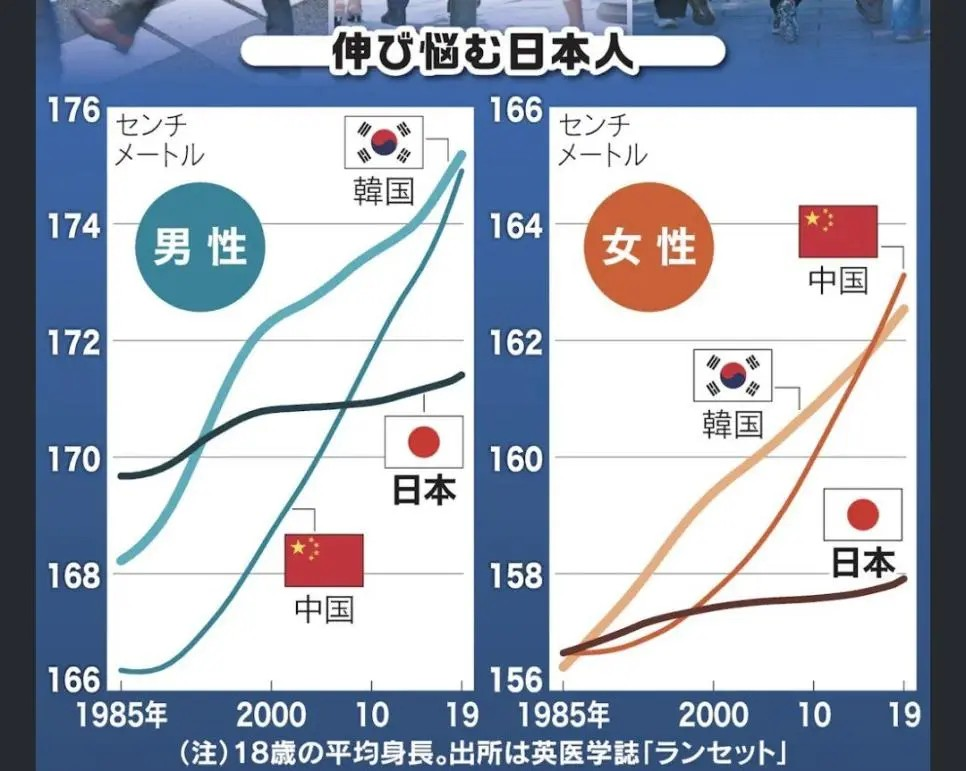

<!--
  HEAD 참조 (렌더링 안 됨 · 빌드 자동 주입 · 주석 풀지 말 것)
  <title>키 그래프가 말하지 않는 것들 · VibeQuant</title>
  <meta name="description" content="SNS를 도는 한중일 키 그래프는 수탈도 정상화도 증명하지 못한다. 1985년은 1966년생이다. 측정 연도와 코호트를 가르면 서사가 한 걸음 앞선다.">
  <meta name="robots" content="index,follow">

  
-->

# 키 그래프가 말하지 않는 것들

## 한중일 신장 곡선과 '수탈-정상화' 서사를 통계로 다시 읽기

*「伸び悩む日本人」. 주석은 18세·『랜싯』. 원 논문(NCD-RisC, 2020)의 국가 비교 기준 연령은 19세다. 이 그림은 일본 독자의 정체 불안을 위해 만들어졌고, 국경을 넘으며 '수탈-정상화' 서사를 입었다.*

**김호광** 싸이월드 전 대표 / 2026년 9월 20일

## 시작하며, 한 장의 그래프, 두 개의 이야기

SNS에 한 장의 그래프가 돌고 있습니다. 1985년부터 2019년까지 한국·중국·일본 18~19세 청소년의 평균 키 변화를 그린 그림입니다. 한국 남성은 약 168cm에서 175cm로, 중국 남성은 166cm에서 175cm로 올라갔습니다. 같은 기간 일본 남성은 170cm 언저리에서 171cm대로 거의 움직이지 않았습니다. 그래프 제목은 「伸び悩む日本人(성장이 멈춘 일본인)」입니다.

이 그래프에는 이런 해석이 따라붙습니다. *"일본은 1950~60년대 영양 상태가 좋아서 키가 컸다. 한국인은 수탈과 착취로 영양이 나빴고, 지금은 정상으로 돌아가는 과정이다."*

이 해석을 반박하는 글도 함께 돌고 있습니다. 그런데 반박하는 쪽도 또 다른 방향으로 그래프를 비틀고 있습니다. 이 칼럼은 두 해석을 모두 데이터 앞에 세워 보려는 시도입니다. 결론을 먼저 말하면, **이 그래프는 '수탈' 가설을 입증하지도 반증하지도 못합니다.** 그래프가 담을 수 없는 시대에 대한 질문이기 때문입니다.

## 1. 출처부터 확인하기 - 누가, 무엇을, 언제 쟀나?

그래프 하단 주석에는 출처가 영국 의학지 『랜싯』이라고 적혀 있습니다. 원 데이터는 NCD-RisC(비감염성 질환 위험요인 국제 협력 연구단)의 2020년 논문입니다. 이 연구는 베이지안 계층 모형으로 5~19세를 1세 단위로 나누어 1985년부터 2019년까지의 평균 키와 BMI 추세를 추정했습니다. 논문은 『랜싯』 396권 10261호(2020년 11월 7일)에 실렸습니다. [1]

여기서 첫 번째 사소하지만 중요한 사실이 나옵니다. 그래프 주석은 '18세'라고 적었지만 원 논문이 국가 비교에 쓴 기준 연령은 19세입니다. 또 이 그래프는 일본 신문이 일본 독자를 위해 만든 것이고, 제목부터 '일본의 정체'라는 프레임을 걸고 있습니다. 실제로 일본경제신문은 2026년 9월 중국·한국과의 에너지 섭취량 차이, 일본에 저체중 출생아가 많은 배경, 만 3세까지의 차이에 주목하는 '세 번째 가설'을 다룬 기사를 냈습니다. [4] 그래프는 처음부터 '한국의 한(恨)'이 아니라 '일본의 불안'을 설명하려고 만들어진 것입니다. 같은 그림이 국경을 넘으며 전혀 다른 서사를 입게 된 셈입니다.

## 2. 통계학: 이 그래프에는 1950~60년대가 없다

### 측정 연도와 출생 코호트를 혼동하는 오류

이 칼럼의 핵심 논점입니다. X축의 '1985년'은 **1985년에 19세였던 사람**, 즉 1966년 전후 출생자를 뜻합니다. 논문 저자들도 1971년에 5세였던 아이들이 1966년생이며, 이들이 1985년에 19세가 된다고 설명합니다. [1]

따라서 그래프 왼쪽 끝의 한국인 168cm는 1960~70년대 한국에서 자란 아이들의 키입니다. 식민지 수탈은 1945년에 끝났습니다. 식민지기에 성장한 세대는 늦어도 1960년대 초에 19세가 되었으니, 이 그래프의 어느 점에도 등장하지 않습니다.

그러니 이 그래프를 근거로 "수탈 때문에 작았다가 정상화되고 있다"고 말하는 것은 **측정되지 않은 시기의 원인을, 측정된 시기의 데이터로 증명하려는** 시도입니다. 반대로 "수탈과 무관하다"고 말하는 것도 같은 이유로 성립하지 않습니다.

### 그래프 밖의 데이터는 무엇을 말하나?

그렇다면 식민지기 데이터는 존재할까요? 몇 가지 연구가 있습니다.

조영준 한국학중앙연구원 교수는 2016년 학술대회에서 사할린 강제징용 노동자를 포함한 20~40세 조선인 남성의 경찰 기록을 분석해, 1896~1900년생의 평균 키가 162.8cm였던 반면 1921~1924년생은 159.5cm로 3cm 이상 작았다고 발표했습니다. 1900년대생과 1910년대생도 앞선 세대보다 작아지는 추세를 보였습니다. [5]

NCD-RisC의 장기 연구도 흥미로운 그림을 보여줍니다. 1896년 출생 코호트에서 과테말라 다음으로 키가 작은 여성 집단에는 엘살바도르, 페루, 방글라데시와 함께 한국과 일본이 포함되어 있었습니다. 그리고 지난 한 세기 동안 성인 키가 가장 많이 자란 집단은 한국 여성으로, 20.2cm가 커졌습니다. [3]

이 자료들을 모으면 이야기는 이렇게 정리됩니다.

- 20세기 초 한국인은 일본인보다 결코 작지 않았고, 오히려 컸다는 기록이 여럿 있습니다.
- 식민지기에 성장한 조선인 코호트에서는 키가 정체하거나 줄어든 흔적이 있습니다.
- 해방 후 한국전쟁과 1950~60년대의 절대 빈곤이 뒤따랐습니다. 이 시기 한일 간 역전과 격차 확대에는 식민지 수탈뿐 아니라 전쟁과 전후 빈곤이 겹쳐 있습니다.

결국 '수탈 가설'은 근거가 전혀 없는 주장은 아닙니다. 다만 **단일 원인으로 환원하는 순간 틀린 주장이 됩니다.** 1950~60년대 한국인의 영양 결핍을 전부 식민지 수탈 탓으로 돌리면 한국전쟁이라는 거대한 변수가 사라집니다.

### 유전이 아니라 환경이라는 가장 강력한 증거

"키는 결국 유전"이라는 반론에는 한반도 자체가 자연 실험으로 답합니다. 남과 북은 유전적으로 거의 같은 집단이지만 체제는 70년 넘게 달랐습니다. 슈베켄디크의 분석에 따르면 대기근 직후 남북한 미취학 남아의 키 차이는 4~8cm, 여아는 3~8cm였습니다. [7] 한국 질병관리본부 자료에서는 최근 입국한 13~18세 탈북 남성 청소년의 평균 키가 155.7cm로, 남한 또래보다 13.5cm 작았습니다. [8]

같은 유전자 풀에서 한 세대 만에 이만한 차이가 생긴다면, 집단 평균 키를 움직이는 주된 힘은 영양·위생·의료 같은 환경입니다. 이 점에서 "영양 상태가 키를 결정했다"는 칼럼의 기본 전제는 옳습니다. 틀린 것은 시기와 원인의 배분입니다.

## 3. 수학 - 반박하는 쪽도 그래프를 비튼다

이 그래프를 반박하는 글에는 좋은 지적이 많지만, 수학적으로 바로잡아야 할 부분이 두 가지 있습니다.

### Y축을 0~200cm로 그리면 정직해질까?

반박 글은 Y축 범위가 10cm로 좁아서 작은 변화가 과장되어 보인다고 비판합니다. 하지만 키 데이터에서는 이 비판이 반대로 작동합니다. 성인 남성 키의 표준편차는 대략 6~7cm입니다. 한국 남성 평균이 7cm 올랐다는 것은 **분포 전체가 약 1 표준편차 이동했다**는 뜻입니다. 1985년의 평균적인 한국 청년이 2019년에는 하위 15~20% 근처로 밀려나는 수준의 변화입니다.

Y축을 0에서 시작하면 이 거대한 변화가 평평한 선으로 뭉개집니다. 이것이 오히려 '0 기준선의 착시'입니다. Y축 절단이 속임수가 되는 경우는 변화의 크기를 의미 있는 기준, 즉 표준편차나 측정 오차와 비교하지 않을 때입니다. 이 그래프의 진짜 결함은 좁은 Y축이 아니라 **신뢰구간이 없다는 점**입니다. NCD-RisC 추정치는 모형 기반 추정이라 불확실성 구간이 있습니다. 매끈한 곡선 하나로 그리면 추정치가 실측치처럼 보입니다.

### 일본은 정말 '상한선'에 도달했을까?

반박 글은 로지스틱 곡선을 들어 일본이 생물학적 상한에 도달해 정체했다고 설명합니다. 그럴듯하지만 데이터와 맞지 않습니다. 같은 연구에서 20세기 후반에 태어난 네덜란드 남성의 평균 키는 182.5cm를 넘었습니다. [3] 그리고 동아시아 안에서도 한국과 중국이 일본을 추월했습니다. 만약 170cm 부근이 동아시아인의 생물학적 천장이라면 한국 175cm는 설명되지 않습니다.

일본의 정체는 '천장에 닿았다'가 아니라 **'천장보다 낮은 곳에서 멈췄다'**로 보는 것이 정확합니다. 일본 연구자들 사이에서는 그 원인이 활발하게 논쟁 중입니다. 한국경제의 보도에 따르면 17세 일본인 평균 키는 남성 170.9cm, 여성 158.1cm를 기록한 1994년 이후 30년 가까이 제자리이거나 오히려 줄었습니다. [6] 일본 내에서도 영양 부족, 급식 질 저하, 경제 성장 시점의 차이, 유전적 요인, 임신부 체중 제한 등 다양한 원인이 거론됩니다. [4]

로지스틱 곡선은 '성장이 언젠가 멈춘다'는 사실을 설명할 뿐, '어디서 멈추는지'는 말해주지 않습니다. 멈춘 높이는 모형의 가정이 아니라 환경이 결정합니다. 이 점을 놓치면 수학을 동원해 또 하나의 서사, 즉 "일본은 이미 완성된 나라"라는 서사를 만들게 됩니다.

## 4. 행동경제학 - 우리는 왜 그래프에 이야기를 입히는가?

### 서사 편향

나심 탈레브가 말한 서사 편향(narrative fallacy)은 흩어진 사실을 인과의 사슬로 엮어야 직성이 풀리는 인간의 습성을 가리킵니다. "수탈 → 영양 결핍 → 작은 키 → 해방 → 정상화"는 기승전결이 완벽한 이야기입니다. 완벽한 이야기일수록 의심해야 합니다. 현실의 인과는 전쟁, 원조 경제, 산업화, 의료보험 도입, 식단의 서구화처럼 지저분하게 얽혀 있기 때문입니다.

### 닻 내림과 기준점 선택

그래프가 1985년에서 시작하기 때문에 독자는 "원래 일본이 컸다"를 기준점으로 삼습니다. 그러나 1896년 코호트를 기준점으로 삼으면 "원래 한국이 컸다"가 됩니다. **어디서 시작하느냐가 누가 '정상'인지를 결정합니다.** '정상화'라는 단어 자체가 이미 기준점을 암묵적으로 선택하고 있습니다.

### 확증 편향과 동기화된 추론

이 그래프는 한국에서는 "우리는 원래 컸다"는 민족적 자부심을, 일본에서는 "우리 사회가 뭔가 잘못되고 있다"는 불안을 확증하는 도구가 됩니다. 같은 데이터가 두 나라에서 정반대의 감정적 결론을 낳습니다. 데이터가 결론을 만든 것이 아니라 이미 있던 결론이 데이터를 골라 쓴 것입니다.

### 반박의 역편향

가장 놓치기 쉬운 함정입니다. 인기 있는 서사를 반박하는 글은 '냉철하고 과학적'이라는 인상을 줍니다. 그래서 반박 글 안의 오류는 덜 검증됩니다. 앞서 본 "Y축을 0부터 그려야 한다", "일본은 상한선에 도달했다"는 주장이 그렇습니다. 통계를 이용한 서사 해체도 결국 하나의 서사입니다. **반박하는 쪽도 같은 엄격함으로 검증받아야 합니다.**

## 5. 맺으며, 그래프에게 물어야 할 세 가지 질문

이 그래프가 실제로 말하는 것은 단순합니다. **"1966~2000년생 동아시아 청소년 중, 한국과 중국은 빠르게 커졌고 일본은 거의 멈췄다."** 그 이상은 그래프 밖의 증거가 필요합니다.

식민지 수탈이 조선인의 키에 영향을 주었다는 가설에는 코호트 연구라는 독립적 근거가 있습니다. 하지만 이 그래프는 그 근거가 될 수 없고, 1950~60년대 한일 격차를 수탈만으로 설명하는 것도 한국전쟁과 전후 빈곤을 지우는 일입니다. 반대로 일본의 정체를 생물학적 한계로 설명하는 것 역시 네덜란드와 한국의 사례 앞에서 무너집니다.

어떤 그래프를 만나든 다음 세 가지를 물어보시기를 권합니다.

1. **X축의 한 점은 언제 태어나 언제 자란 사람들인가?** (측정 연도와 성장 환경의 시차)
2. **그래프가 시작하기 전과 끝난 뒤에는 무엇이 있었나?** (기준점 선택)
3. **이 결론을 가장 반기는 사람은 누구인가?** (동기화된 추론)

통계의 환각을 극복한다는 것은 서사를 버리는 것이 아닙니다. **서사가 데이터보다 한 걸음 앞서 나가지 않게 하는 것**입니다.

> 이 글은 통계 해석과 서사 편향에 관한 칼럼이며, 투자·학술·역사 자문이 아닙니다. 그래프 수치는 일본 언론 인포그래픽의 눈금 읽기와 NCD-RisC 논문의 국가 비교를 대조한 것으로, 원 미시데이터 재추정은 아닙니다.

## 참고문헌

1. NCD Risk Factor Collaboration (NCD-RisC). "Height and body-mass index trajectories of school-aged children and adolescents from 1985 to 2019 in 200 countries and territories." *The Lancet* 396(10261): 1511–1524, 2020.
   - https://pubmed.ncbi.nlm.nih.gov/33160572/
   - 원문 PDF: https://www.thelancet.com/pdfs/journals/lancet/PIIS0140-6736(20)31859-6.pdf
2. NCD-RisC 키 데이터 다운로드 페이지
   - https://www.ncdrisc.org/data-downloads-height.html
3. NCD Risk Factor Collaboration (NCD-RisC). "A century of trends in adult human height." *eLife* 5: e13410, 2016.
   - https://elifesciences.org/articles/13410
4. 日本経済新聞, 「日本人の身長、なぜ中国・韓国に抜かれたのか 栄養だけじゃない要因」, 2026.9.
   - https://www.nikkei.com/article/DGXZQOSG073HZ0X00C26A8000000/
5. 인사이트, 「일제강점기 시절 조선인 남성 평균 키 '3cm' 이상 줄었다」 (조영준 한국학중앙연구원 교수 연구 소개), 2018.
   - https://www.insight.co.kr/news/194510
6. 한국경제, 「일본인은 왜 키가 작을까…"1200여년간 OO 금기"」 [정영효의 인사이드 재팬], 2022.
   - https://www.hankyung.com/article/202212117696i
7. PIIE, "Summer Reading 2: Daniel Schwekendiek, *A Socioeconomic History of North Korea*"
   - https://www.piie.com/blogs/north-korea-witness-transformation/summer-reading-2-daniel-schwekendiek-socioeconomic-history
8. AFP / MGR Online, "Famine-hit N.Koreans shorter, thinner than southerners," 2010.
   - https://mgronline.com/general/detail/9530000023023
9. 本川裕, 社会実情データ図録 「平均身長の長期推移（日本、中国、韓国、米国、西欧）」
   - https://honkawa2.sakura.ne.jp/2196d.html
