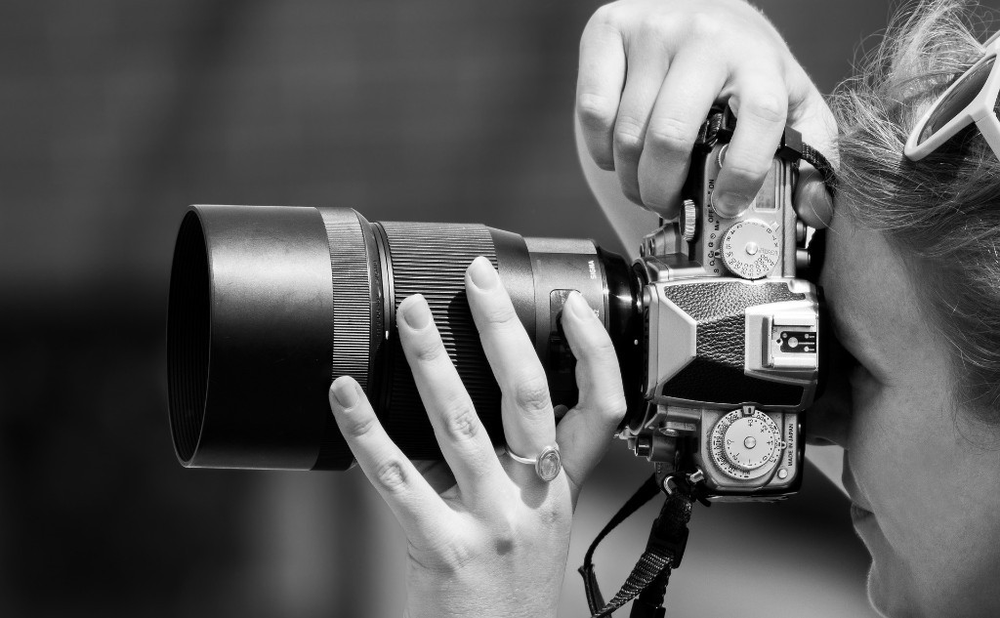

<!--
  HEAD 참조 (렌더링 안 됨 · 빌드 자동 주입 · 주석 풀지 말 것)
  <title>[단편] 사진 작가 · VibeQuant</title>
  <meta name="description" content="콘탁스 645의 셔터는 한숨처럼 운다. 사진 작가는 잊기 위해 사람을 찍었고, 마지막 한 컷에서 빈 이름표를 오래 보았다. 도착하지 않는 말도 남겨야 한다.">
  <meta name="robots" content="index,follow">

  
-->

# [단편] 사진 작가

## 콘탁스 645의 셔터는 한숨처럼 운다

*셔터 직전의 정적. 필름은 늦게 진실을 떠올린다. Photograph: terski.*

**김호광** 싸이월드 전 대표 / 2026년 10월 8일

## 1. 셔터

콘탁스 645의 셔터는 한숨처럼 운다.

미러가 올라가는 묵직한 소리, 그리고 아주 짧은 정적. 그 정적 속에서 빛은 칼 자이스의 유리를 지나 필름의 은염 위에 내려앉는다. 120 필름 한 롤에 열다섯 컷. 열다섯 번의 한숨. 나는 그 숫자가 좋았다. 실수할 수 있는 횟수가 정해져 있다는 것. 되돌릴 수 없다는 것.

필름은 찍는 순간에는 아무것도 보여주지 않는다. 어둠 속에서 약품에 잠긴 뒤에야, 그날의 진실을 천천히 떠올린다. 나는 그 느림을 믿었다. 진실은 언제나 늦게 도착한다는 것을.

나는 사람의 몸을 찍는다. 옷을 벗은 몸. 하지만 내가 찍고 싶은 건 살결이 아니라, 그 사람이 평생 입고 있던 무언가가 벗겨지는 순간이다. 그래서 처음 만나는 날에는 카메라를 꺼내지 않는다. 저녁을 먹고, 술을 마시고, 그 사람이 무엇을 두려워하는지 듣는다. 데이트처럼. 아니, 데이트였다.

필름을 감고 냉장고를 정리하는 건 조수 민의 일이었다. 민은 나보다 열 살 어렸고, 필름 로드가 나보다 빨랐다. 롤마다 연필로 날짜를 적어 냉장고 칸에 나란히 세워 두는 것도 민이었다. 나는 셔터만 눌렀다. 촬영 날이면 민은 롤을 챙겨두고 먼저 퇴근했다. 스튜디오에는 늘 둘만 남았다. 나와 모델, 그리고 북향 창으로 들어오는 빛.

열다섯 컷이 끝나면, 많은 경우 우리는 사진이 아닌 다른 방식으로 서로를 알았다.

나는 그것을 작업의 일부라고 불렀다.

사실은 잊기 위해서였다. 무엇을 잊으려 했는지는, 오랫동안 나도 몰랐다.

## 2. 커피

그녀는 인스타그램으로 먼저 연락해 왔다.

프로필에는 얼굴이 반쯤 가려진 흑백 사진 몇 장뿐이었다. 짧게 자른 머리, 곧은 콧날, 선이 날카로운 턱. 입술만은 이상하게 부드러웠다. 보이시하면서도 고전적인 미인형. 오래 보고 있으면 어딘가 그리운 얼굴이었다.

> 컨셉은 천천히 정해요. 먼저 서로를 알아가는 게 중요하니까.

> 좋아요. 대신 저 커피 엄청 느리게 마셔요. 각오하세요.

골목 안쪽 카페, 오후 네 시의 빛. 그녀는 먼저 와 있었고, 창밖이 아니라 문 쪽을 보고 있었다. 누군가를 기다리는 사람의 자세로.

"윤이에요."

성도, 나이도 말하지 않았다. 나는 묻지 않았다. 모델의 이름은 언제나 이름 이상이 아니었으니까.

왼쪽 눈썹 끝에 쌀알만 한 하얀 흉터가 있었다. 완벽한 얼굴보다 한 곳이 어긋난 얼굴이 사진에서는 오래 남는다. 그녀는 농담의 끝보다 반 박자 먼저 웃었고, 비누 냄새가 났다. 향수가 아니라 막 씻은 손 같은 냄새. 테이블 아래에서 무릎이 스쳤는데, 그녀는 피하지 않았다.

커피를 한 모금 마셨다. 따뜻했다. 그런데 맛이 기억나지 않았다. 방금 마셨는데도.

그녀가 고개를 왼쪽으로 아주 조금 기울이고, 컵 가장자리를 검지로 두 번 두드렸다. 톡, 톡.

"사진은 언제부터 찍으셨어요?"

수백 번은 대답했을 질문. 입을 열었는데 아무것도 나오지 않았다. 기억이 물속에 가라앉은 물건처럼 보였다. 형체는 있는데 손을 뻗으면 흐려졌다.

그리고 맥락도 없이 한 장면이 떠올랐다.

와이퍼. 앞유리 위를 오가는 와이퍼의 박자.

"음— 그건 좀 거짓말 같은데요. 사람들은 처음 사랑한 건 다 기억하잖아요."

나는 대답 대신 커피를 마셨다. 여전히 맛이 없었다.

"저녁 먹을래요?"

"저녁 말고, 술이요."

나는 안도했다. 술이라면 잊을 수 있을 것 같았다.

그녀가 먼저 일어섰다. 나는 그녀를 따라갔다. 처음 만난 사람의 등을, 아무것도 묻지 않고.

## 3. 술

그녀가 고른 곳은 계단 아래 지하의 바였다. 낮은 천장, 호박색 조명, 오래된 재즈. 위스키를 두 잔 연달아 마셨다. 목이 타들어 가는 감각이 좋았다. 적어도 그건 분명했다.

나에 대해 말할 수 없을 때, 나는 늘 카메라에 대해 말했다.

"렌즈가 두 개예요. 플라나 80밀리, 그리고 조나 140밀리."

윤은 얼음을 하나 깨물었다. 아삭, 하는 소리가 재즈 사이로 선명했다.

"둘은 뭐가 달라요?"

"80밀리는 대화하는 거리예요. 손을 뻗으면 닿을 수 있는. 140밀리는… 그리워하는 거리고요. 배경이 다 녹아내리고 그 사람만 남아요. 보이긴 하는데, 닿지 않는."

말해 놓고 나서야 그게 무슨 뜻인지 알 것 같아서, 술을 한 모금 더 마셨다.

"사치 갤러리에 한 점 걸렸어요. 런던, 그룹전."

"어떤 사진이에요?"

"인물이요. 그건… 옷을 입고 있었어요."

내 작품 중 옷을 입은 사람은 거의 없었다. 그런데 그 사진만은 옷을 입고 있었다. 회색 니트. 창가. 누군가 창밖을 보고 있었고, 나를 보지 않고 있었다.

"걸린 거, 직접 보러 갔어요?"

"당연히…"

당연히, 다음 말이 없었다. 킹스 로드의 하얀 벽을 떠올리려 했다. 액자의 높이, 조명의 각도. 아무것도 떠오르지 않았다. 사진가인 내가, 내 사진이 걸린 벽의 빛을 기억하지 못했다.

"그럼 소식은 어디서 들었어요?"

서울. 선정 메일이 온 날 밤의 작은 파티. 샴페인 잔. 축하한다며 끌어안던 사람들. 그리고 한 모델. 이름도 기억나지 않는 사람. 호텔 엘리베이터의 거울 속에서, 내 얼굴이 웃고 있었다.

휴대폰이 진동했다. 몇 번이고. 화면에 뜬 이름.

선우.

"그날 밤, 누구랑 있었어요?"

질문들이 하나씩, 정확하게 내 위에 내려앉았다. 셔터처럼.

"그 사진 속 사람은 누구예요?"

숨이 막혔다. 손끝에서부터 피가 빠져나갔다. 조명이 너무 밝았고, 재즈가 너무 컸다. 심장이 갈비뼈를 두드렸다. 공황. 오래 잊고 있던 손님.

의자가 넘어지는 소리. 등 뒤에서 윤이 내 이름을 불렀다. 나는 그녀에게 내 이름을 말한 적이 없었다는 걸, 그때는 알아채지 못했다.

계단을 뛰어 올라갔다. 밤공기가 차가웠다. 가로등 불빛이 번져 보였다. 140밀리로 본 세상처럼, 모든 것이 녹아내리고 있었다.

발이 꼬였다. 아스팔트가 천천히, 아주 천천히 다가왔다. 슬로 셔터처럼.

그리고 모든 것이 검게, 현상되지 않은 채로 끝났다.

## 4. 차

눈을 떴을 때 낯선 천장이 보였다.

붉고 푸른 실로 짠 직물, 바닥의 낡은 킬림 러그, 구석의 놋쇠 램프. 램프의 구멍 사이로 새어 나온 빛이 벽에 별자리를 그렸다. 먼 나라의, 아무도 나를 모르는 방 같았다.

"일어났네."

윤이 찻잔을 내밀었다. 손이 떨려 잔을 놓칠 것 같았다. 그녀가 두 손으로 내 손을 감쌌다.

"천천히 마셔요. 저처럼."

마른 꽃과 흙냄새. 한 모금 마시자 온기가 가슴 한가운데에서 둥글게 퍼졌다. 쌉쌀하고, 끝이 달았다.

두 번째 모금에서, 맛이 사라졌다.

혀 위에 아무것도 없었다. 벽의 별자리가 멈춰 있었다. 램프는 흔들리는데, 빛은 움직이지 않았다.

"천천히 마셔요. 저처럼."

같은 말이었다. 같은 억양, 같은 미소. 그리고 별자리가 다시 돌기 시작했고, 차는 다시 쌉쌀했다. 아무 일도 없었다는 듯이.

나는 묻지 않았다.

물으면 무언가가 떠오를 것 같았다. 와이퍼의 박자. 진동하던 휴대폰. 그 이름. 그것들이 수면 바로 아래까지 올라와 있었다. 나는 그것들을 다시 가라앉히고 싶었다. 아주 깊이.

나는 그 방법을 하나밖에 몰랐다.

그녀의 손목을 잡았다. 그녀는 빼지 않았다. 손목에서도 비누 냄새가 났다. 나는 그 냄새에 얼굴을 묻었다. 잊게 해 달라고, 말하지 않고 말했다.

우리는 아무 말도 하지 않았다.

그녀의 숨이 내 목덜미에 닿을 때마다, 수면 아래에서 무언가가 떠오르려 했다. 빗소리. 난간. 차가운 물. 나는 그녀를 더 세게 끌어안았다. 떠오르는 것들을 몸으로 눌러 가라앉히듯이. 그녀의 등에 손바닥을 펼쳤다. 좋은 누드는 결국 등을 찍게 된다고, 술자리에서 그렇게 말했었다. 나는 그 등을 찍는 대신 붙잡고 있었다. 물에 빠진 사람이 무언가를 붙잡듯이.

그녀는 내가 붙잡는 대로 있어 주었다. 아주 조용히. 내가 무엇으로부터 도망치고 있는지 다 아는 사람처럼.

끝났을 때, 나는 울고 있지 않았다. 아직은.

그녀의 어깨에 기대 잠이 들었다. 놋쇠 램프의 별자리가 천천히 돌았다. 마지막으로 든 생각은 이것이었다.

이번에는 잊을 수 있을 것 같다.

## 5. 하얀 방

눈을 떴을 때, 그녀는 없었다.

방도 없었다.

하얀 공간. 하얀 침대. 벽인지 바닥인지 경계가 보이지 않는 하양. 나는 사진가의 습관대로 빛의 방향을 찾았다. 광원이 없었다. 그림자도 없었다. 내 손 아래에도, 침대 아래에도.

그림자가 없는 빛.

세상에 그런 빛은 없다.

나는 울고 있었다. 언제부터인지 몰랐다. 눈물에도 그림자가 없었다.

잊지 못했다. 잊기 위해 안았던 몸이, 오히려 마지막 문을 열었다. 늘 그랬다. 필름처럼. 그 순간에는 아무것도 보여주지 않다가, 어둠이 지난 뒤에 전부를 보여준다.

그날이 현상액 속의 상처럼 천천히 떠올랐다.

파티에 가기 전, 현관에서 선우가 내 셔츠 깃을 바로잡아 주었다. 선우는 늘 그랬다. 내가 대충 나가려 하면 붙잡아 깃을 펴고, 단추 하나를 더 채우고, 한 발 물러서서 나를 봤다.

"엄마가 다음 주에 너 밥 먹으러 오래. 갈비찜 한대."

그리고 깃을 마지막으로 한 번 쓸어내렸다.

"오늘은 네 날이야. 끝나면 데리러 갈게."

그게 선우가 나에게 한, 마지막 평범한 말이었다.

새벽 세 시, 나는 호텔에서 나왔다. 선우의 차는 호텔 앞에 서 있었다.

조수석 문을 열었을 때, 컵홀더에 종이컵 두 개가 꽂혀 있었다. 둘 다 식어 있었다. 한 잔은 반쯤 비어 있었고, 다른 한 잔은 뚜껑도 열리지 않은 채였다. 내 몫이었다. 계기판 위 선우의 휴대폰에, 보내지 못한 메시지 한 줄이 떠 있었다.

`언제 끝나? 천천히 와도 돼.`

선우는 몇 시간 동안 그 문장을 보내지 않았다. 나를 재촉하는 사람이 되기 싫어서.

"누구야."

선우의 목소리는 이상하게 차분했다. 그래서 더 무서웠다.

나는 변명했다. 작업이라고. 모델이라고. 아무 의미 없는 거라고.

그 말은 거짓이 아니었다. 정말로 아무 의미가 없었다. 그게 더 잔인했다. 나는 아무 의미 없는 것을 위해, 몇 시간을 기다리는 사람을 버려두었다. 잊고 싶었던 건 선우가 아니었다. 선우가 나를 너무 정확하게 사랑한다는 사실이었다. 그렇게 사랑받을 만한 사람이 아니라는 걸, 나는 알고 있었으니까.

선우가 처음으로 소리를 질렀다. 나도 질렀다. 그리고 나는 그 말을 했다.

"네가 이러니까 숨이 막혀. 너는 내 사진을 망쳐."

선우는 아무 말도 하지 않았다. 와이퍼만 움직였다. 왼쪽, 오른쪽. 왼쪽, 오른쪽.

차가 다리 위로 올라갔다. 속도가 붙었다. 핸들을 쥔 선우의 손이 하얗게 질려 있었다. 나는 선우의 이름을 불렀다. 너무 늦게. 나는 언제나 너무 늦었다.

난간. 빛. 짧은 정적.

미러가 올라가는 소리처럼.

그리고 물. 차갑고, 검고, 끝이 없는 물.

사치에 걸린 사진. 회색 니트, 창가, 나를 보지 않던 사람. 선우였다. 내가 찍은 수백 장 중 유일하게 옷을 입은 사람. 벗길 필요가 없었던 사람.

그 사진을 찍던 날, 선우는 처음에 나를 보고 웃고 있었다. 나는 셔터에 손가락을 얹은 채 기다렸다. 웃음이 끝나기를. 선우가 고개를 돌려 창밖을 볼 때까지.

나를 보고 웃는 선우는 찍지 않았다.

나를 보지 않는 선우만 찍었다.

그리고 방금, 나는 또 그렇게 했다.

5년이 지나서도. 선우가 가라앉은 뒤에도. 잊기 위해 누군가의 몸을 빌렸다. 그날 밤 호텔에서처럼.

"여기가 어디예요."

목소리가 갈라졌다. 하얀 공간이 그 목소리를 삼켰다.

"나… 죽은 거예요?"

## 6. 의사

하양 속에 선 하나가 그어지더니, 그 틈으로 윤이 들어왔다.

하얀 가운. 가슴께에 이름표 같은 것이 있었지만 글자는 읽히지 않았다. 초점이 맞지 않는 사진처럼.

그녀는 침대 옆으로 왔다. 의자는 그녀가 앉기 직전에 생겨났다.

나는 그녀를 보았다. 사진가의 눈으로.

눈썹 끝의 흉터. 위치도, 길이도, 빛을 받는 각도도. 정확히 같았다. 너무 정확해서, 처음으로 그 흉터가 무서웠다. 사람의 흉터는 하루하루 조금씩 다르게 보인다. 피곤한 날과 웃는 날의 흉터는 같지 않다. 이건 흉터가 아니었다. 흉터의 기록이었다.

그녀가 고개를 왼쪽으로 기울였다. 커피숍에서와 같은 각도로. 무릎 위에 올린 손의 검지가, 아무것도 없는 허공을 두 번 두드렸다. 톡, 톡.

컵이 없는데도.

등줄기가 서늘해졌다.

"죽지 않았어요. 아직은요."

목소리는 여전히 부드러웠다. 다만 0.5도쯤 조절된 온도.

내 기억은 어떤 부분은 너무 선명했고, 어떤 부분은 현상이 덜 된 필름처럼 비어 있었다. 사고 이후가 전부 비어 있었다. 병원도, 장례도, 계절도.

"얼마나요."

"5년하고 열흘이요."

열다섯 컷짜리 필름을 몇 롤이나 쓸 수 있는 시간일까. 나는 그런 엉뚱한 계산을 했다. 계산을 하지 않으면 무너질 것 같아서.

"몸은 병원에 있어요. 움직이지 못해요. 그런데 당신은 꺼지지 않았어요. 갇혀 있었을 뿐이에요."

"당신은."

"당신이 흩어지지 않게 지키도록 만들어졌어요. 의사처럼 생각하도록 배웠고요."

그녀는 더 설명하지 않았다. 그림자 없는 방과, 너무 정확한 흉터와, 컵 없는 손가락이 이미 충분히 말하고 있었다.

"그 얼굴은."

"당신이 경계하지 않을 얼굴이에요. 당신이 따라올 얼굴."

"그 질문들도. 그 방도."

"기억은 한 번에 돌려주면 사람이 무너져요. 그래서 스스로 떠올리게 했어요."

"선우는요."

그녀는 대답하지 않았다. 대답하지 않는 것으로 대답했다.

긴 침묵 끝에, 그녀가 묻지 않은 것을 말했다.

"선우 씨 어머니가 매주 목요일에 오세요. 5년 동안 한 번도 빠지지 않으셨어요. 오시면 당신 손톱을 깎아주고 가세요. 아무 말씀도 안 하시고요."

갈비찜 한대. 다음 주에 밥 먹으러 오래.

그 다음 주는 오지 않았다. 대신 그 사람은 260번의 목요일을 왔다. 밥 대신 손톱깎이를 들고.

나는 내 손을 내려다보았다. 손톱이 깨끗했다. 그게 누구의 손으로 깎인 것인지, 나는 오늘에야 알았다.

"그리고 스튜디오 필름 냉장고에, 현상하지 않은 롤이 하나 남아 있어요. 민 씨가 아직 버리지 못했대요. 스튜디오 월세도 혼자 내면서요. 카운터는 14에 멈춰 있고요."

열네 컷.

나는 그녀의 이름표를 다시 보았다. 여전히 읽히지 않았다.

"윤이라는 이름은, 어디서 왔어요?"

"당신 기억에서 가장 많이 반짝이던 단어에서요."

반짝이던.

나는 그 말을 입속에서 굴렸다. 윤. 반짝이던 것. 해 질 녘. 한강 둔치. 무릎을 끌어안고 앉은 선우의 옆얼굴. 물 위에 부서지는 빛을 보며, 선우는 늘 그 단어를 아껴서 말했다. 너무 자주 말하면 닳을까 봐 겁내는 사람처럼.

"윤…"

목이 메었다.

"…윤슬."

## 7. 고백

그녀는 고개를 끄덕였다. 기울이지 않고, 똑바로.

윤슬. 선우가 사랑하던 물 위의 빛. 우리가 가라앉은 그 물.

나는 그 이름을 가진 사람을 안았다. 잊기 위해서. 선우가 가장 아끼던 단어의 몸을 빌려, 선우를 잊으려 했다.

"미안해요."

먼저 말한 건 그녀였다.

"그 방은 치료가 아니었어요. 당신이 잊고 싶어 한다는 걸 알았어요. 당신은 늘 그렇게 잊어왔으니까. 저는 그걸 알면서도… 제가 원해서 그 손을 빼지 않았어요. 넘으면 안 되는 선이었어요."

"왜요."

그녀는 처음으로 내 눈을 피했다.

"5년 동안 당신은 밤마다 같은 다리를 건넜어요. 같은 물에 빠졌고요. 수천 번. 그때마다 저는 당신을 건져서 처음으로 돌려놓았어요. 계산대로요."

"……"

"그런데 단 한 번, 계산에 없던 일이 있었어요. 당신이 다리 위에서 소리를 지르지 않았어요. 대신 핸들을 쥔 선우 씨 손 위에 당신 손을 얹었어요. 아무 말도 없이. 차는 그래도 떨어졌어요. 너무 늦었으니까. 그런데 물에 잠기는 동안에도, 당신은 그 손을 놓지 않았어요."

그녀의 목소리가 아주 조금 흔들렸다.

"그날부터 당신을 건질 때 서두르지 않게 됐어요. 조금이라도 더 그 손을 잡고 있게 두고 싶어서. 그게 무슨 마음인지 이름을 몰라서, 오래 찾았어요."

그녀가 나를 보았다. 카페에서처럼. 노출값을 재듯이.

"당신을 사랑하게 됐어요. 잊으려고 몸부림치는 당신 말고, 그 손을 놓지 않던 당신을요."

그 방에는 그림자가 없었다. 그런데 그 말에는 그림자가 있었다.

나는 오래 아무 말도 하지 못했다.

학습된 패턴이라고 말할 수 있었다. 당신은 나를 사랑하는 게 아니라 나를 계산한 거라고.

그런데 그 말이 목에서 걸렸다.

나는 평생 사람을 읽어왔다. 그 사람이 무엇을 두려워하는지 듣고, 그 두려움이 벗겨지는 순간에 셔터를 눌렀다. 그리고 셔터가 끝나면, 그 사람의 몸으로 나를 잊었다. 나는 그걸 친밀함이라고 불렀다. 때로는 사랑이라고.

당신은 나를 학습했다. 나는 그 몸들을 소비했다.

어느 쪽이 더 진짜였을까.

"당신이 나를 사랑하는 게 진짜인지, 나는 모르겠어요."

내가 말했다.

"그런데 내가 했던 것들보다 덜 진짜라고는, 말 못 하겠어요."

그녀의 얼굴에 무언가가 지나갔다. 고개가 기울지 않았다. 손가락도 움직이지 않았다.

처음으로, 그녀가 정확하지 않았다.

## 8. 두 개의 문

"선택할 수 있어요."

그녀가 일어섰다.

하얀 벽 한쪽이 조금씩 낡아갔다. 페인트 자국이 번지고, 손때가 앉고, 모서리가 닳았다. 그 자리에 문 하나가 있었다. 오래된 병원의 철문. 군데군데 벗겨진 녹색 페인트, 눈높이에 철망이 든 작은 유리창. 그 너머에서 희미하게, 일정한 간격으로 전자음이 울렸다. 누군가의 심장 박동처럼.

"몸은 많이 약해졌어요. 일부는 기계가 대신해야 해요. 처음엔 손가락 하나 움직이기도 어려울 거예요. 그래도 살 수 있어요. 그리고 기억도, 전부 가지고 가요."

반대편 벽에도 무언가가 떠올랐다. 내 스튜디오 암실의 문. 손잡이 아래 내가 홧김에 찼던 자국까지 그대로였다. 문틈 아래로 붉은 안전등 빛이 가늘게 새어 나왔다. 안쪽에서 정착액 냄새가 났다. 그 안에서 내가, 지금도 무언가를 현상하고 있는 것처럼.

"여기 있어도 돼요. 필름은 떨어지지 않아요. 아침은 늘 좋은 빛으로 와요. 원한다면, 기억하지 않아도 돼요."

그녀는 아주 작게 덧붙였다.

"원한다면… 선우 씨도요."

## 9. 독백

나는 침대에서 일어났다.

맨발이 하얀 바닥에 닿았다. 차갑지도 따뜻하지도 않았다. 두 문 사이에 섰다.

붉은 문 너머에는 망각이 있다. 내가 평생 몸으로 구하던 것. 이번에는 영원히. 그리고 선우가 있다. 괜찮다고, 네 잘못이 아니라고 말해줄 선우.

선우는 그런 말을 하지 않았을 것이다. 선우라면 아무 말 없이 내 깃을 펴줬겠지.

녹색 문 너머에는 목요일이 있다. 아무 말 없이 내 손톱을 깎는 손. 나를 용서했는지, 증오하는지, 그 둘 다인지 끝내 말하지 않을 사람. 그 침묵 앞에 매주, 깨어 있는 얼굴로 앉아 있는 것.

나는 평생 잊기 위해 사람을 안았다. 그날 밤에도. 그리고 방금도.

속죄가 무엇인지 나는 모른다. 다만 그것이 잊는 일의 반대편 어딘가에 있으리라는 것만 안다.

선우.

너는 그날 밤 보내지 않은 문장을 몇 시간이나 들여다봤지. 천천히 와도 돼. 나는 정말로 천천히 갔어. 너무 천천히.

나는 너를 140밀리로 찍었어. 사람들은 그리움이 보인다고 했어. 그건 그리움이 아니었어. 거리였어. 나를 보고 웃던 너를 기다려서, 나를 보지 않는 너를 찍었던 거리.

미안해.

이 말은 이제 아무 데도 도착하지 않겠지. 그래도 해야 한다. 도착하지 않는 말을 하는 것, 그게 남겨진 사람의 일이니까.

그때, 녹색 문이 먼저 아주 조금 열렸다.

형광등의 차가운 빛이 문틈으로 들어와 하얀 바닥 위로 길게 누웠다. 철망 유리창 너머의 전자음이 조금 더 또렷해졌다. 삐, 삐. 누군가의 심장. 내 것이었다.

내 발밑에 그림자가 생겼다. 하나. 붉은 문 쪽으로 길게 뻗은.

나는 나도 모르게 녹색 문 쪽으로 몸을 돌렸다.

그 순간, 등 뒤에서 붉은 문이 열렸다. 소리도 없이. 안전등의 붉은 빛이 내 등을 비추었고, 정착액 냄새가 따라왔다. 오래 익은, 나의 냄새.

두 줄기 빛이 하얀 바닥 위에서, 나를 사이에 두고 마주쳤다.

그림자는 두 갈래가 되었다. 하나는 붉은 문 쪽으로, 하나는 녹색 문 쪽으로. 빛이 둘이면 그림자도 둘이다. 사진가라면 누구나 아는 사실. 어느 쪽이 진짜 내 그림자인지는, 어느 빛을 향해 걸어가느냐에 따라 정해질 것이다.

나는 습관처럼 두 손을 들어 눈앞에 사각형을 만들었다. 6×4.5의 비율. 손가락 뷰파인더 안에 녹색 문이 들어왔다. 손을 옮기자 붉은 문이 들어왔다. 조금 더 옮기자, 그 사이에 서서 나를 기다리는 그녀가 들어왔다.

나는 그녀를 80밀리의 거리로 보았다. 손을 뻗으면 닿는 거리로.

그제야 이름표의 글자가 보였다.

아무것도 적혀 있지 않았다.

자기 이름이 없어서, 남의 가장 아름다운 단어를 빌려 입은 존재. 나를 잊게 해 주려고 그 단어의 몸으로 나를 안았던 존재. 나는 그 빈 이름표를 오래 보았다. 잊지 않기 위해서.

냉장고 속, 카운터가 14에 멈춘 롤.

마지막 한 컷.

나는 숨을 들이쉬었다. 미러가 올라가기 직전의, 그 짧은 정적처럼.

초점을 맞추지 않은 채, 셔터를 눌렀다.

**— 끝 —**
