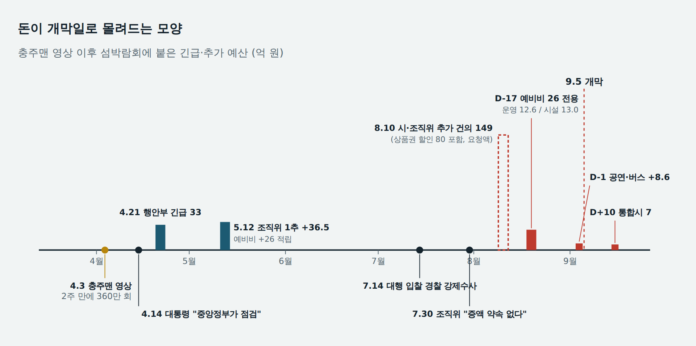
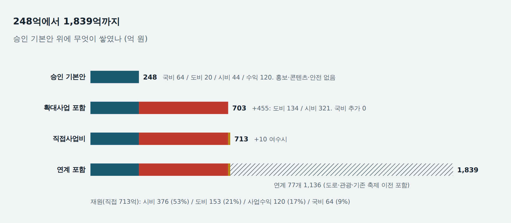
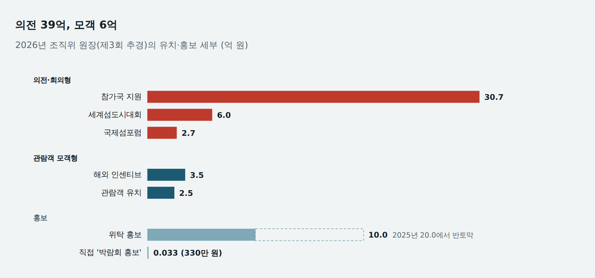
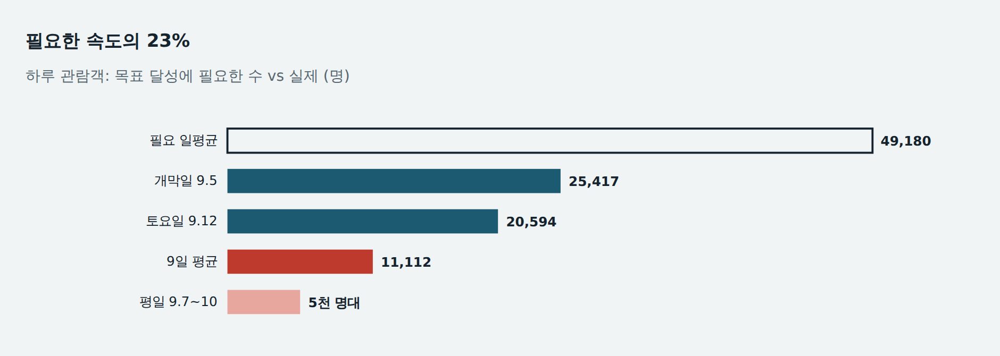
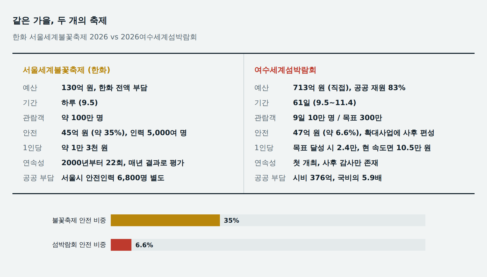
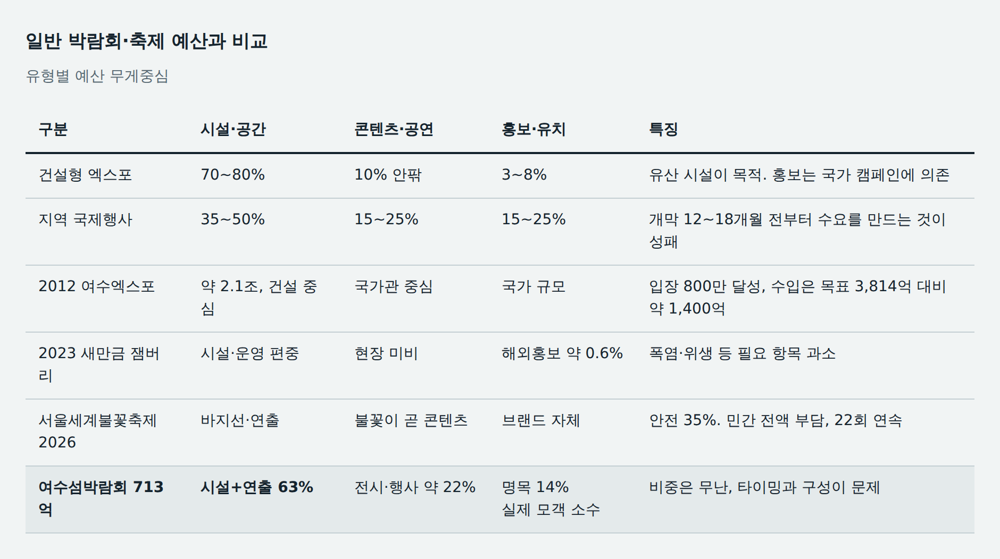

# 여수 박람회 개막 참사는 왜 예지되었을까?

*서울 불꽃축제는 하룻밤에 100만 명을 불렀고, 섬 박람회는 9일 동안 10만 명을 불렀다. 공개된 조직위 예산서 8종과 보도를 겹쳐 보면, 흥행 붕괴는 개막 전에 이미 장부에 적혀 있었다.*

**김호광** 싸이월드 전 대표 / 2026년 9월 20일

9월 5일 여의도 한강공원에는 약 100만 명이 모였다. 한화TV 등 온라인 생중계도 누적 조회 268만 회, 최고 동시접속 26만 명을 기록했다. 같은 날 여수 돌산 진모지구에서는 2026여수세계섬박람회가 문을 열었고, 개막일 입장객은 2만 5,417명이었다. 불꽃축제는 한 기업이 130억 원을 들여 하룻밤에 치렀다. 섬박람회는 국비·도비·시비와 수익사업을 합친 직접사업비 713억 원으로 61일을 치른다. 개막 9일 누적 관람객은 10만 8명. 목표 300만 명을 채우려면 하루 4만 9천 명이 와야 하는데, 실제로는 하루 1만 1천 명이 왔다.

이 글은 "**공무원들이 해먹었다**"는 이야기가 아니다. 그렇게 말하면 속은 시원하지만 다음 행사에서 같은 일이 반복되는 것을 막지 못한다. 조직위가 공개한 예산서 8종(2025·2026년 본예산과 각 3회의 추경)을 한 줄씩 대조하면 더 불편한 결론이 나온다. 누가 큰돈을 몰래 빼돌리지 않아도 이 행사는 실패하도록 짜여 있었고, 그 흐름을 멈출 장치가 어디에서도 작동하지 않았다. 개막 참사는 예언된 것이 아니라, 이미 예산과 기획안에서 예지되어 있었다.

*돈이 개막일로 몰려드는 모양 — 충주맨 영상 이후 섬박람회에 붙은 긴급·추가 예산 (억 원). 막대 높이는 금액에 비례. 점선 막대는 요청액(확정 편성 아님). 조직위 추경은 조직위 예산서, 나머지는 보도 기준. 행안부 33억은 2026.4.21 발표 기준 부행사장 섬 이동식 화장실·그늘막 설치와 해양쓰레기 처리 우선 투입분으로, 같은 시기 다른 교부세와는 별개다.*

## 248억 원짜리 '최소 개최'로 출발했다

섬박람회가 국제행사로 정부 승인을 받을 때 사업비는 248억 원이었다. 국비 64억, 도비 20억, 시비 44억, 그리고 입장료와 후원으로 벌겠다는 수익 120억. 먼저 봐야 할 것은 무엇이 빠져 있었느냐다. 홍보 50억, 관람객·학술 유치 52억, 행사 프로그램 65억, 전시 콘텐츠 90억, 랜드마크 60억, 안전 47억, 테마존 50억. 관람객이 실제로 보고 느끼는 콘텐츠와 같은 핵심 기획 항목은 거의 모두 승인안 밖에 있었다.

국제행사 심사는 '**열 수 있느냐**'를 봤지 '**사람이 오겠느냐**'를 보지 않았다. 300만 명과 수익 120억 원이라는 수요 가정은 승인안 안에 있었는데, 그 수요를 만들 돈은 없었다. 출발부터 목표와 수단이 따로 놀았다.

## 455억 원이 나중에 붙었다

빠진 항목은 이후 '확대사업' 10개, 455억 원으로 붙었다. 도비 134억, 시비 321억. 국비는 64억 원에서 한 푼도 늘지 않았다. 기본안과 확대사업을 합친 703억 원에 여수시 10억이 더해져 직접사업비는 713억 원이 됐다. 도로 정비·관광·기존 축제 이전 같은 연계사업 77개(1,136억 원)를 합산한 관련 규모는 1,839억 원이다.

"**예산이 폭등해 7배로 불었다**"는 비판은 이 1,839억을 분모로 삼는다. 공정하게 말하면 직접비는 2.9배이고, 연계 합산에는 한우대축제처럼 원래 있던 행사를 여수로 옮긴 것도 섞여 있다. 그런데 이 구분이 오히려 문제의 핵심을 드러낸다. 성과를 말할 때는 1,839억이 쓰이고, 책임을 따질 때는 713억으로 줄어든다. 숫자의 범위가 필요에 따라 바뀌는 행사에서는 예산 통제가 성립하기 어렵다.

재원 구조도 봐야 한다. 713억 가운데 시비가 376억(53%)으로 국비 64억의 5.9배다. 간판은 '세계'인데 실패 비용은 여수시 재정이 온전히 떠안는다.

*248억에서 1,839억까지 — 승인 기본안 위에 무엇이 쌓였나 (억 원). 출처: 서울경제 2026.8.11, 동행미디어 시대 2026.8.10, 매일경제 2026.9.4. 7.4배는 연계 합산 기준, 직접비 기준은 2.9배.*

## 장부는 돈이 개막일로 몰려드는 모양을 하고 있다

조직위 세출은 2025년 본예산 245억 원에서 2026년 제3회 추경 346.6억 원까지 늘었다. 총액보다 중요한 것은 타이밍이다.

2026년 5월 12일 제1회 추경에서 조직위는 예비비를 6억에서 32억 원으로 불렸다. 직접 사업예산의 약 25%다. 국제행사 예비비가 보통 총사업비의 1~3% 안팎이라는 점을 감안하면 이례적인 적립이다. 그리고 8월 19일, 개막 17일 전 제2회 추경에서 그 가운데 26억 원을 꺼내 운영(+12.6억)과 전시관·부대시설 설치(+13.0억)로 옮겼다. 예비비는 재해나 예측할 수 없는 지출을 위한 돈이다. 개막 17일 전에 시설 설치비로 꺼냈다는 것은 공정이 일정을 따라가지 못했고, 아직 정해지지 않은 사업을 예비비라는 대기 계정에 넣어 두었다는 뜻으로 읽힌다.

9월 4일, 개막 하루 전 제3회 추경에서는 문화행사 위탁을 55억에서 62.6억 원으로 7.6억 늘리고 해외 개별관광객 전세버스에 1억을 더했다. 개막 열흘 뒤에는 전남광주통합특별시가 첫 추경에 붐업 댄스 행사 5억과 관람객 이동지원 2억, 모두 7억 원을 올렸다. 시의회 농수산위원장은 이를 "**사전 준비 부실을 드러낸 것**"이라고 지적했다.

이미 행사 프로그램 65억, 마케팅 102억 원이 있는 상태였다. 돈이 모자랐던 것이 아니다. 있는 돈을 개막 품질로 바꾸지 못했고, 그 공백을 개막 직전과 직후의 추경으로 메웠다.

## 충주맨의 360만 조회수

이 구조가 대중의 눈에 처음 보인 것은 장부가 아니라 유튜브 영상이었다. 충주시 홍보로 이름을 알린 김선태 전 주무관은 4월 초 여수를 홍보하는 영상을 올렸다. 개막을 다섯 달 앞둔 주행사장은 기반 공사 수준이었고, 허허벌판에서 그가 던진 "여기를 왜 데려오신 걸까요?"라는 한마디는 곧 밈이 됐다. 전남도가 8,000만 원을 들여 섭외한 이 영상은 이틀 만에 240만 회, 2주 만에 360만 회를 넘긴 것으로 보도됐다.

역설이다. 섬박람회 홍보 가운데 가장 많은 사람에게 닿은 콘텐츠가, 준비 부실을 가장 정확하게 보여 준 콘텐츠였다. 홍보가 실패한 것이 아니라 홍보할 대상이 준비되지 않았던 것이다. 좋은 바이럴은 실체를 증폭할 뿐, 없는 실체를 만들어 주지 않는다. 섬박람회와 잼버리를 합친 '섬버리'라는 별명이 붙은 것도 이때다.

## 정부가 들어왔고, 공무원들은 다급해졌다

영상 이후의 속도는 빨랐다. 4월 14일 이재명 대통령은 국무회의에서 현장의 우려를 언급하며, 6월 지방선거로 인한 행정 공백을 감안해 중앙정부 차원의 점검과 지원을 주문했다. 김민석 국무총리는 16일 현장을 찾아 이 박람회를 여수시민의 세금이 들어가는 국제행사로 규정하고, 여수시가 주도성과 책임을 가져야 한다고 못 박았다. '국제행사'라는 간판과 '여수시 책임'이라는 실체가 총리의 한 문장 안에 함께 들어 있었다. 승인 단계에서 국비를 64억에 묶어 둔 구조가 무엇을 뜻하는지 정부 스스로 확인한 셈이다. 21일 행정안전부와 전라남도는 부행사장 섬의 이동식 화장실·그늘막·해양쓰레기 처리에 33억 원을 우선 투입한다고 발표했고, 행안부는 2026년을 '섬 방문의 해'로 지정해 숙박비 지원도 붙였다.

중앙정부의 개입은 필요했다. 그러나 회계적으로 보면 개입은 '통제'가 아니라 '지원'의 형태로 왔다. 무엇을 왜 못 했는지 따지는 절차 없이 돈과 일정 압박이 한꺼번에 들어왔다. 5월 제1회 추경에서 조직위 예산은 36.5억 원 늘었다. 8월에는 조직위와 여수시가 상품권 할인 80억 원을 포함한 149억 원 규모의 추가 건의 목록을 통합시에 냈다는 보도가 나왔다. 통합시의 한 관계자는 꼭 필요하다는데 어쩌겠느냐며 "**여기저기서 예산을 모아 줘야지**"라고 말했다고 한다.

다만 이 모든 것을 영상 탓으로 돌릴 수는 없다. 영상은 불을 붙였을 뿐이고, 장부는 그 전부터 같은 방향으로 흐르고 있었다. 개최 전년인 2025년 6월 제2회 추경에서 이미 조직위 예비비는 3.8억에서 26.9억 원으로 뛰었다. 미확정 사업을 예비비에 쌓아 두는 습관은 충주맨보다 먼저 있었다.

> **심사는 '필요한가'를 묻지 않고 '어디서 모을까'를 묻고 있었다.**

이 한 문장이 이번 사태의 예산 통제 수준을 요약한다. 다급함은 품질을 만들지 않는다. 다급함이 만드는 것은 검증 없는 증액, 거절하기 어려운 시점의 변경 계약, 그리고 개막 하루 전의 공연 구매다.

## 낮게 따고 나중에 올린다는 의혹

운영 대행 용역은 2025년 1월 약 267억 원 규모로 공고돼 4월 MBC플러스 컨소시엄이 약 190억~198억 원에 따냈다. 조달 분석 기준 낙찰률은 약 73%다. 협상에 의한 계약에서는 과업 범위 조정으로도 이 정도 낙찰률이 나올 수 있으므로, 숫자만으로 덤핑을 말할 수는 없다. 이후 두 갈래의 의혹이 나왔다. 하나는 평가 과정에서 특정 업체에 점수가 몰렸다는 의혹으로, 경찰이 7월 강제수사에 착수했다. 다른 하나는 대행사가 사전 약속을 근거로 50억 원대 증액을 요구했다는 현장 증언 보도다. 조직위는 7월 30일 증액 약속이나 합의는 없었다고 공식 부인했다.

어느 쪽도 사실로 확정되지 않았고, 이 글도 단정하지 않는다. 다만 장부가 보여 주는 사실은 있다. 조직위 직접비 안의 '대행사 선정' 세항은 2026년 본예산 36.4억 원에서 개막 17일 전 43.2억 원으로 6.9억 늘었다. 낮게 따고, 일정이 급해져 발주처가 거절하기 어려운 시점에 증액을 요구하고, 그 사이 서비스 품질은 하도급 단계에서 깎인다. 한국 공공 행사에서 반복되어 온 이 패턴은 누군가의 악의가 없어도 계약 구조만으로 작동한다. 개막 뒤 인스타그램과 유튜브에서는 거문도 뱃노래를 1톤 트럭에 천을 둘러 연출한 영상이 퍼졌다. 원인을 단정할 수는 없지만, 이 예산 구조의 문제로 보인다.

## 사람을 부르는 돈보다 의전에 쓰는 돈이 먼저였다

공표된 마케팅 예산은 102억 원, 직접사업비의 14%다. 지역 국제행사 통례(15~25%)에 조금 못 미치는 정도로, 적다고 하기 어렵다. 그런데 조직위 원장을 열면 다른 그림이 나온다.

개최 연도인 2026년, 위탁 박람회 홍보비는 전년 20억 원에서 10억 원으로 절반이 됐다. 조직위가 직접 집행하는 '박람회 홍보' 세항은 330만 원이다. 같은 해 유치 위탁은 46억 원으로 늘었는데, 그중 참가국 지원이 30.7억, 세계섬도시대회 6억, 국제섬포럼 2.7억이다. 입장권을 살 일반 관람객을 부르는 돈은 관람객 유치 2.5억과 해외 인센티브 3.5억, 합쳐 약 6억 원이다. 의전과 회의에 쓰는 돈이 관람객 모객비의 6배를 넘는다.

*의전 39억, 모객 6억 — 2026년 조직위 원장(제3회 추경)의 유치·홍보 세부 (억 원). 출처: 조직위 2025년 본예산~2026년 제3회 추경 원장(천 원 단위를 억 원으로 환산). 공표 마케팅 102억 원에는 시·도 직접 집행분이 섞여 있어 원장과 1:1로 대응하지 않는다.*

국제행사의 외형을 갖추려면 참가국이 필요하다. 문제는 그 외형이 300만 관람객과 입장료 66억 원이라는 수입 가정을 대신해 주지 않는다는 점이다. 조직위가 자체 조달하겠다던 수익 120억 원 가운데 개막 직전까지 확보한 것은 약 44억 원, 목표의 37%였다.

여기에 국외 출장 논란이 겹쳤다. 국외출장 보고 시스템에서 '섬박람회'로 검색되는 보고서가 100건을 넘었고, 일부 보고서의 허술한 내용이 알려지며 외유성 출장 비판이 나왔다. 여수시는 박람회를 직접 목적으로 한 출장은 21건이며 연관성이 과장됐다고 반박하면서도 보고서가 부실했다는 점은 인정했다. 시민단체는 감사원 특별감사와 부당 집행 환수를 요구하고 있다. 출장 자체보다 중요한 것은, 출장에서 무엇을 배웠고 그것이 예산 어디에 반영됐는지를 아무도 확인하지 않았다는 점이다.

*필요한 속도의 23% — 하루 관람객, 목표 달성에 필요한 수 vs 실제 (명). 목표 300만 명 / 61일. 9.5~13 누적 10만 8명. 이 속도가 이어지면 폐막 시 약 68만 명(목표의 23%). 출처: 동아일보 9.11, 매일경제 9.17.*

## 한화 불꽃축제는 왜 26년째 되는가?

비교에 앞서 전제를 밝혀 둔다. 하룻밤 무료 한강 관람과 61일 유료 박람회는 상품이 다르고, 민간 브랜드 행사와 공공 국제행사는 목적이 다르다. 섬박람회 713억 원에는 시설·연출비가 들어 있고, 불꽃축제의 100만 명은 주최 측 추정치다. 불꽃축제에는 서울시가 별도로 배치하는 안전 인력 6,800명이라는 공공 비용도 붙어 있다. 그러니 아래 비교는 어느 쪽이 싸게 치렀느냐가 아니라, 누가 결과에 책임을 지는 구조냐에 관한 이야기다.

2000년 시작해 결번을 포함해 26년, 올해 22회째인 서울세계불꽃축제는 올해 행사비 130억 원을 한화가 전액 부담했다. 그중 안전관리에만 45억 원, 전체의 약 3분의 1을 썼다. 지난해 38.5억 원에서 17% 늘린 금액이다. 임직원 봉사단 1,200명을 포함한 5,000여 명의 안전·질서 인력을 배치하고, 통신사와 연계한 실시간 인파 밀집 측정과 CCTV 통합관제를 돌렸다.

두 행사의 차이는 예산 규모가 아니다. 예산의 무게중심과 책임의 위치다. 불꽃축제는 관람객이 무엇을 보러 오는지가 분명하고, 상당한 예산이 그것과 그것을 안전하게 보게 하는 일에 모인다. 실패하면 한화라는 이름이 다친다. 그래서 매년 결과를 보고 다음 해 예산을 고친다. 섬박람회는 관람객이 보러 올 것이 승인 단계에서 정의되지 않았고, 돈은 공간 조성(시설+연출 63%)에 먼저 묶였으며, 실패의 비용은 시비와 다음 추경으로 흩어진다. 안전 예산은 확대사업의 47억 원, 직접사업비의 약 6.6%다.

관람객 1인당 비용으로 바꾸면 차이가 선명해진다. 불꽃축제는 약 1만 3천 원. 섬박람회는 목표 300만 명을 다 채워도 약 2만 4천 원이고, 초반 속도가 이어져 68만 명에 그치면 약 10만 5천 원이다. 위의 전제를 감안해도, 26년간 매년 결과로 평가받아 온 민간 행사와 처음 치르면서 결과로 평가받을 장치가 없었던 공공 행사의 차이는 국민의 돈이 들어간 장부에 그대로 드러난다.

*같은 가을, 두 개의 축제 — 한화 서울세계불꽃축제 2026 vs 2026여수세계섬박람회. 불꽃축제: 파이낸셜뉴스·뉴시스·위키트리 2026.9.5~6. 섬박람회 안전 47억은 확대사업 항목 기준, 1인당 비용은 직접사업비 713억 기준 단순 계산.*

*일반 박람회·축제 예산과 비교 — 유형별 예산 무게중심. 벤치마크 구간은 실무 통례 범위. 잼버리: SBS 2023.8. 여수엑스포: 국민일보·경향 2012. 섬박람회: 천지일보 특집(703억 기준 기능 배분), 매일경제.*

## 왜 막지 못했나? - 작동하지 않은 다섯 개의 잠금장치

정리하면, 섬박람회의 돈은 승인(최소 개최)에서 확대(지방비)로, 예비비 대기에서 개막 직전 전용으로, 그리고 개막 후 추경으로 흘렀다. 이 경로의 단계마다 원래 멈춤 장치가 있어야 했다.

1. **승인 심사** — 300만 명이라는 수요 가정을 받아들이면서 그 수요를 만들 홍보·콘텐츠 사업은 요구하지 않았다.
2. **의회 심의** — 확대사업과 추경이 '필요한가'가 아니라 '어디서 모을까'의 문제로 다뤄졌다. 7억 추경에 대한 질타도 이미 개막한 뒤였다.
3. **예비비** — 불확실성 대비가 아니라 미확정 사업의 대기 계정으로 쓰였다. 적립은 5월, 전용은 개막 17일 전.
4. **계약 공시** — 낙찰률, 평가표, 증액 협의, 하도급 내역이 개막 전에 공개되지 않았다. 의혹은 수사, 곧 사후의 영역으로 넘어갔다.
5. **중간 감사** — 감사는 폐막 뒤에 온다. 개막 전 공정률과 콘텐츠 완성도를 점검하는 성과 감사는 없었다.

이번 사태를 "공무원들이 해먹었다"로 정리하면, 다음 행사 담당자는 "나는 안 먹었다"로 빠져나갈 수 있다. 더 정확한 문장은 이것이다. 먹지 않아도 샐 수 있는 구조였고, 그 구조는 조직위원회 사이트에 공개된 엑셀 여덟 개에 다 적혀 있었다.

해법도 거창할 필요가 없다. 국제행사 승인 때 홍보·콘텐츠·수요 가정을 기본안에 넣게 하고 확대사업은 따로 재심사할 것. 개막 60일 이내의 예비비 전용은 의회 별도 의결을 거치게 할 것. 대행 계약의 낙찰률·평가표·변경 계약·하도급을 개막 전에 공시할 것. 그리고 개막 90일 전, 공정률과 콘텐츠 리허설을 점검하는 중간 감사를 의무화할 것. 불꽃축제가 26년 동안 해 온 일도 결국 이것이다. 매년 결과를 보고, 부족한 점은 다음 해의 기획과 예산으로 고쳤다.

폐막은 11월 4일이다. 아직 45일이 남았고 관람객은 늘어날 수도 있다. 그러나 국제행사를 이 모양으로 만든 예산과 기획의 허술함은 사후 흥행으로 지워지지 않는다. 다음 국제행사를 준비하는 지자체라면, 여수의 박람회장보다 여수의 기획서와 예산서를 먼저 들여다봐야 할 것이다.

앞으로 정부는 지자체의 축제에 대해서 에산과 행사 기획 가이드라인을 만들고 상시 진행 모니터링을 할 제도적 시스템을 보강해야할 것이다. 지역 축제는 다들 비슷비슷한 모습으로 복붙이 많다. 어느 지자체가 성공하면 비슷한 행사가 이어진다. 이런 생색내기 축제를 벗어나 진정 지역 경기 활성화와 지방 문화를 널리 알리는 축제를 위해 제도 개선과 감사, 지역 문화 전통 적합성을 평가하는 시스템을 보강해야할 것이다. 

> 이 글의 분석 한계: 조직위 원장은 편성액이지 최종 집행·정산액이 아니다. 713억 원 중 시·도가 조직위를 거치지 않고 집행한 분은 예산서 8종에 전부 들어 있지 않다. 대행사 평가 조작·증액 약속 의혹과 외유성 출장 논란은 수사·감사 중이거나 당사자 간 다툼이 있는 사안으로, 이 글은 혐의의 유무를 단정하지 않는다. 다만 의전·회의 예산이 관람객 모객 예산의 6배를 넘는다는 것은 장부에 적힌 사실이고, 출장의 성과가 예산 어디에 남았는지는 아직 누구도 검증하지 않았다.

---

### 자료

**1차 자료** (재)2026여수세계섬박람회 조직위원회 예산서 8종: 2025년 본예산, 제1회 추경(2025.3.4), 제2회 추경(2025.6.2), 제3회 추경(2025.8.26), 2026년 본예산, 제1회 추경(2026.5.12), 제2회 추경(2026.8.19), 제3회 추경(2026.9.4). 금액 단위 천 원을 억 원으로 환산.

**섬박람회 보도** [허프포스트코리아 9.20](https://www.huffingtonpost.kr/article/260652), [위키트리 충주맨 영상 4.6](https://www.wikitree.co.kr/articles/1129856), [이투데이 충주맨 섭외비 4.7](https://www.etoday.co.kr/news/view/2573316), [대통령 국무회의 발언 4.14](https://m.news.nate.com/view/20260414n31538), [국무총리실 보도자료 4.16](https://m.news.nate.com/view/20260416n36468), [행안부 긴급 33억 4.21](https://m.news.nate.com/view/20260421n32207), [kbc 입찰 강제수사 7.14](https://news.ikbc.co.kr/article/view/kbc202607140062), [동행미디어 시대 8.10](https://www.sidae.com/article/2026081014150230026), [7억 추경 9.17](https://m.news.nate.com/view/20260917n34260), [오마이뉴스 9.17](https://www.ohmynews.com/NWS_Web/View/at_pg.aspx?CNTN_CD=A0003268227), [서울경제 9.18](https://m.sedaily.com/article/20092492). 그 밖에 매일경제 9.4·9.17, 서울신문·연합뉴스 9.16, 동아일보 9.11, 천지일보 특집(개막 전 수익 약 44억).

**불꽃축제 보도** [파이낸셜뉴스 9.6](https://www.fnnews.com/news/202609061853228530), [위키트리 9.5](https://www.wikitree.co.kr/articles/1157476), [한국면세뉴스 9.6](https://www.kdfnews.com/news/articleView.html?idxno=187576), [일간투데이 생중계 268만 9.6](https://www.dtoday.co.kr/news/articleView.html?idxno=790176).

**비교 자료** SBS 2023.8(잼버리 예산), 국민일보·경향 2012(여수엑스포 수입).
