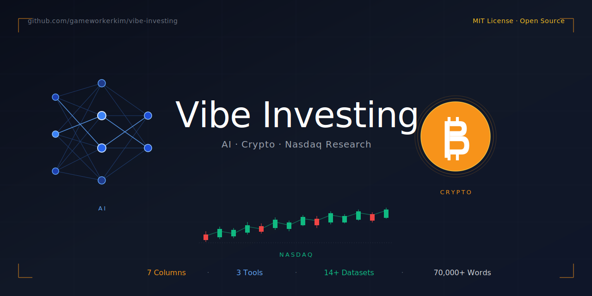

<!-- START: STAR CTA BLOCK -->
<div align="center">

# Vibe Investing

### If you find this useful, **[⭐ Star the repo](https://github.com/gameworkerkim/vibe-investing)** 
### to support independent research.


**🆕 최신 업데이트: 2026-04-21** — Model vs Reality + Special Situations Investing 칼럼 2편 동시 공개 (한/영/중 3개 언어) · 📊 **3종 트레이딩 전략 실증 연구 + 소스 코드** 공개 (Listing Day Crash · Token Unlock 72h Shock · Binance Alpha MM Bot)

**📊 최근 4일: 2,761 views · 1,248 clones · 463 unique cloners**
---

</div>
<!-- END: STAR CTA BLOCK -->

> **인공지능을 이용한 바이브 투자(Vibe Investing) 관련 의견과 자료를 나누는 레포**

 AI 투자(Vibe Investing) 큐레이션 어썸 시리즈 · 시장 분석 칼럼 10편 · **3종 트레이딩 전략 실증 연구 (Listing Day · Token Unlock · Binance Alpha MM)** · AI 트레이딩 도구 3종 (Harness Quant v2 + Earnings Momentum Agent + Nasdaq-BTC Coupling Bot) 을 다룹니다. 리서치하는 마켓은 미국 나스닥, S&P500, 가상화폐, 유럽 명품 섹터, 크립토-주식 상관관계, 예측시장(Polymarket·Kalshi), 그리고 화폐·지정학·특수상황 투자까지 확장됐습니다. 인공지능은 엑셀과 같은 도구입니다. LLM은 만능이 아니며, 모델을 읽는 인간의 통찰력이 가장 중요하다고 믿습니다. 지금 비트코인과 나스닥의 커플링의 시그널이 강력한 가운데 우리는 소음과 신호에서 신호를 인공지능이라는 도구를 통해 발견할 수 있습니다.
 

[](https://opensource.org/licenses/MIT)
[]()
[]()
[]()
[]()
[]()
[]()
[]()
[]()

---

> **🌏 English readers**: See [**README_EN.md**](https://github.com/gameworkerkim/vibe-investing/blob/main/Readme%20en.MD) for a 1-page summary of columns, tools, and datasets.

---

## 📅 릴리스 히스토리 / Release History

이 레포는 **매주 1-2회 새로운 칼럼·데이터셋·도구로 업데이트**됩니다. 최근 릴리스:

| Date | Release | Language |
|------|---------|----------|
| **2026-04-21** 🆕 | [**특수상황 투자 — 빌 애크먼의 10억 달러 패전**](https://github.com/gameworkerkim/vibe-investing/blob/main/02.Investment%20Idea%20Column/Special%20situations%20investing/) | 🇰🇷 KR · 🇺🇸 EN · 🇨🇳 CN |
| **2026-04-21** 🆕 | [**모델과 현실의 불일치 — 경제학은 어떻게 다시 쓰여질 것인가?**](https://github.com/gameworkerkim/vibe-investing/blob/main/02.Investment%20Idea%20Column/Model%20vs%20reality%20column/) | 🇰🇷 KR · 🇺🇸 EN |
| **2026-04-18** 🆕 | [**📊 Binance Listing Day Crash — LST-10 전략 + 3-tier 구조 경제학**](https://github.com/gameworkerkim/vibe-investing/tree/main/01.Trading%20Strategy/Binance%20Listing%20Day%20Crash%20) | 🇰🇷 KR + Python |
| **2026-04-15** 🆕 | [**📊 Token Unlock 72h Shock — UNL-10 전략 + Keyrock 확장 연구**](https://github.com/gameworkerkim/vibe-investing/tree/main/01.Trading%20Strategy/Token%20unlock%2072h%20shock%20analysis%20) | 🇰🇷 KR + Python |
| **2026-04-14** | [누가 폴리마켓과 주식 시장에 과감한 베팅을 하나?](https://github.com/gameworkerkim/vibe-investing/blob/main/02.Investment%20Idea%20Column/Insider%20trading/Insider%20trading%20column.MD) | 🇰🇷 KR |
| **2026-04-11** 🆕 | [**📊 Binance Alpha MM Bot 분석 — STR-07 전략 + MBP-5 프레임워크**](https://github.com/gameworkerkim/vibe-investing/tree/main/01.Trading%20Strategy/Trading%20strategy%20that%20devours%20Binance%20Alpha%20MM%20bots) | 🇰🇷 KR + Python |
| 2026-04-07 | [나스닥-크립토 커플링 전략 + Coupling Bot](https://github.com/gameworkerkim/vibe-investing/blob/main/01.Trading%20Strategy/Investment%20Strategy%20Based%20on%20Bitcoin%20and%20Nasdaq%20Coupling/Nasdaq%20crypto%20coupling%20strategy.MD) | 🇰🇷 KR |
| 2026-03-31 | [명품은 언제 사야 하는가](https://github.com/gameworkerkim/vibe-investing/blob/main/01.Trading%20Strategy/Luxury%20investment%20strategy/Luxury%20investment%20strategy.md) | 🇰🇷 KR |
| 2026-03-24 | [DAT 기업의 mNAV 아비트리지 전략](https://github.com/gameworkerkim/vibe-investing/blob/main/mNAV(Market-to-Net-Asset-Value)%20arbitrage/Dat%20mnav%20arbitrage%20strategy.MD) | 🇰🇷 KR |
| 2026-03-17 | [시장은 닫혔을 때 열리는가](https://github.com/gameworkerkim/vibe-investing/blob/main/AfterMarketClose/After_Market_Close_Column.md) | 🇰🇷 KR |

> 📢 **Upcoming**: 솔라나 밈코인 카지노인가? · Anthropic finance agent 전략 · 영문 번역판 확대

---

## 🙏 Contributors / 기여자

이 레포는 아래 분들의 귀한 기여로 성장하고 있습니다.  
*This repo grows thanks to these wonderful contributors.*

### 🎉 First Contributor / 첫 기여자

**[@dragon1086](https://github.com/dragon1086)**
- **기여 내용**: Prism.js 기반 코드 하이라이팅 통합 ([PR #1](https://github.com/gameworkerkim/vibe-investing/pull/1))
- **Contribution**: Prism.js code highlighting integration ([PR #1](https://github.com/gameworkerkim/vibe-investing/pull/1))
- **Date**: 2026-04-20

---

**Want to join? / 함께하고 싶으신가요?**

- 🇰🇷 한국어: [기여하기](#기여하기-contributing) 섹션 참고
- 🌏 English: Check [Good First Issues](https://github.com/gameworkerkim/vibe-investing/issues?q=is%3Aissue+is%3Aopen+label%3A%22good+first+issue%22) or start a [Discussion](https://github.com/gameworkerkim/vibe-investing/discussions)

> *"From 1 contributor to 100 — let's build this together."*  
> *"한 명의 기여자에서 백 명으로 — 함께 만들어 갑니다."*

---


## Quick Links

### 📖 어썸 큐레이션 시리즈

| # | 제목 | 다루는 영역 |
|---|---|---|
| 1 | [**Awesome Vibe Invest — Stocks & Equities**](https://github.com/gameworkerkim/vibe-investing/blob/main/Awesome%20vibe%20invest.MD) | 주식 (NASDAQ / S&P500) — 30+ AI 투자 GitHub 레포 평가 |
| 2 | [**Awesome Vibe Invest — Crypto & DeFi Edition**](https://github.com/gameworkerkim/vibe-investing/blob/main/Awesome%20vibe%20invest%20crypto.MD) | 비트코인 / 크립토 — 벤치마크 중심 LLM 트레이딩 큐레이션 |

### 📰 칼럼 시리즈

| # | 제목 | 주제 | 발행일 |
|---|---|---|---|
| 1 | [**LTCM의 사례로 배우는 모델을 읽는 힘**](https://github.com/gameworkerkim/vibe-investing/blob/main/Vibe%20Investing%20Risk%20Management.MD) | 1998년 LTCM 사태 분석 + 2026년 AI 바이브 투자의 리스크 | 2026-02-10 |
| 2 | [**Microsoft의 Fintool 인수 — Excel이 곧 Bloomberg가 되는 날**](https://github.com/gameworkerkim/vibe-investing/blob/main/Microsoft%20fintool%20acquisition%20column.MD) | Microsoft의 Fintool 인수 시너지 분석 | 2026-02-17 |
| 3 | [**보이지 않는 손인가, 계획딘 사기인가**](https://github.com/gameworkerkim/vibe-investing/blob/main/Crypto%20perp%20manipulation%20column.MD) | 가상화폐 선물 시장의 비정상적 pump & dump 패턴 수학적 검토 | 2026-02-24 |
| 4 | [**시장은 닫혔을 때 열리는가**](https://github.com/gameworkerkim/vibe-investing/blob/main/AfterMarketClose/After_Market_Close_Column.md) | 미국 상장기업 91.2%가 AMC에 악재를 공시하는 이유 — 34건 실증 데이터 | 2026-03-17 |
| 5 | [**DAT 기업의 mNAV 아비트리지 전략**](https://github.com/gameworkerkim/vibe-investing/blob/main/mNAV(Market-to-Net-Asset-Value)%20arbitrage/Dat%20mnav%20arbitrage%20strategy.MD) | MSTR·BMNR 등 디지털 자산 보유 기업의 크립토 가치-시총 격차 분석 | 2026-03-24 |
| 6 | [**명품은 언제 사야 하는가**](https://github.com/gameworkerkim/vibe-investing/blob/main/01.Trading%20Strategy/Luxury%20investment%20strategy/Luxury%20investment%20strategy.md) | LVMH · Hermès · Kering — 중국 경기 침체 시대의 명품 투자 3단계 전략 | 2026-03-31 |
| 7 | [**가상화폐와 나스닥은 얼마나 동기화되고 있을까?**](https://github.com/gameworkerkim/vibe-investing/blob/main/01.Trading%20Strategy/Investment%20Strategy%20Based%20on%20Bitcoin%20and%20Nasdaq%20Coupling/Nasdaq%20crypto%20coupling%20strategy.MD) | BTC-QQQ 6년 상관관계 + 6 regime 분류 + 인트라데이 lag 측정 | 2026-04-07 |
| 8 | [**누가 폴리마켓과 주식 시장에 과감한 베팅을 하나?**](https://github.com/gameworkerkim/vibe-investing/blob/main/02.Investment%20Idea%20Column/Insider%20trading/Insider%20trading%20column.MD) | 미-이란 위기 국면의 발표 직전 비대칭 베팅 — Harvard 연구 60σ 이탈 + 베이지안 3가설 분석 | 2026-04-14 |
| 9 | [**모델과 현실의 불일치 — 경제학은 어떻게 다시 쓰여질 것인가?**](https://github.com/gameworkerkim/vibe-investing/blob/main/02.Investment%20Idea%20Column/Model%20vs%20reality%20column/Model%20vs%20reality%20column.MD) 🆕 | 페트로달러 → MMT → AI 경제까지 50년 화폐사의 네 번의 균열 · 🇰🇷 KR · 🇺🇸 [EN](https://github.com/gameworkerkim/vibe-investing/blob/main/02.Investment%20Idea%20Column/Model%20vs%20reality%20column/Model%20vs%20reality%20column%20EN.MD) | 2026-04-21 |
| 10 | [**특수상황 투자 — 왜 개인 투자자는 타이밍을 맞추기 힘든가?**](https://github.com/gameworkerkim/vibe-investing/tree/main/02.Investment%20Idea%20Column/Special%20situations%20investing) 🆕 | 빌 애크먼 허벌라이프 $10억 공매도 실패 사례 + 이사회 방어 메커니즘 4종 · 🇰🇷 KR · 🇺🇸 EN · 🇨🇳 CN | 2026-04-21 |

### 📊 트레이딩 전략 실증 연구 (Python 구현체 포함) 🆕

| # | 제목 | 프레임워크 | 통계적 유의성 | 발행일 |
|---|---|---|---|---|
| A | [**Binance Listing Day Crash**](https://github.com/gameworkerkim/vibe-investing/tree/main/01.Trading%20Strategy/Binance%20Listing%20Day%20Crash%20) 🆕 | **LST-10** 전략 (100% 승률 백테스트) · 3-tier 구조 경제학 | 96.1% dump / 51건 / p=2.8×10⁻¹² | 2026-04-18 |
| B | [**Token Unlock 72h Shock**](https://github.com/gameworkerkim/vibe-investing/tree/main/01.Trading%20Strategy/Token%20unlock%2072h%20shock%20analysis%20) 🆕 | **UNL-10** 전략 (100% 승률 백테스트) · Keyrock 2024 확장 | 88.5% 부정적 / 52건 / p=2.2×10⁻⁹ | 2026-04-15 |
| C | [**Binance Alpha MM Bot 분석**](https://github.com/gameworkerkim/vibe-investing/tree/main/01.Trading%20Strategy/Trading%20strategy%20that%20devours%20Binance%20Alpha%20MM%20bots) 🆕 | **STR-07** 전략 (86% 승률) · **MBP-5** (Market-by-Price L5) 프레임워크 | 88% 패턴 검출 / 20건 | 2026-04-11 |

이 세 연구는 **vibe-investing 크립토 미시구조 5부작**의 3편으로, 각각 **논문 수준의 실증 분석 + Python 트레이딩 전략 구현체 + 자체 비평 문서 + CSV 데이터셋**을 포함합니다. **SSRN 투고 후보 1-2순위** 연구입니다.

### 🛠️ 직접 개발 중인 도구

| # | 제목 | 설명 |
|---|---|---|
| 1 | [**Harness Quant v2**](https://github.com/gameworkerkim/vibe-investing/blob/main/Harness%20quant%20v2%20readme%20.MD) | LLM 기반 NASDAQ/S&P500 분석 패키지 (6개 시나리오 + 백테스트 + MCP + 멀티 에이전트 토론) |
| 2 | [**Earnings Momentum Agent**](https://github.com/gameworkerkim/vibe-investing/blob/main/Harness%20quantv2/Earnings%20momentum%20agent%20readme%20.MD) | 저점 반등 + 매출 성장 + 어닝 서프라이즈 + 시장 심리 종합 Top 30 추천 파이프라인 (24개월 백테스트 hit rate 83.3%) |
| 3 | [**Nasdaq-BTC Coupling Bot**](https://github.com/gameworkerkim/vibe-investing/blob/main/01.Trading%20Strategy/Investment%20Strategy%20Based%20on%20Bitcoin%20and%20Nasdaq%20Coupling/) | BTC-QQQ 30일 rolling correlation 실시간 추적 + 6 regime 분류 + 트레이딩 신호 생성 (547 lines, 10 classes) |

---

## Vibe Investing이란?

**Vibe Coding**(바이브 코딩)이 자연어로 LLM에 지시해서 코드를 만드는 패러다임이라면,
**Vibe Investing**(바이브 인베스팅)은 자연어 지시 → LLM이 도구를 호출 → 시장 데이터·뉴스·소셜 신호 수집·분석 → 투자 의사결정 산출까지의 **agentic 파이프라인**을 지칭합니다.

전통적 알고리즘 트레이딩이 "if RSI < 30 then buy" 같은 경직된 룰 기반이라면, vibe investing은:

- **자연어로 전략 정의** ("섹터가 호전되고 시장에서 호평받는 종목을 찾아줘")
- **LLM이 능동적으로 도구 호출** (가격, 펀더멘털, 뉴스, 소셜, 내부자 거래, 온체인 데이터)
- **다층적 추론과 합의** (Bull/Bear/Risk/PM 멀티 에이전트 토론)
- **JSON으로 구조화된 결정** (사람이 검증 가능한 reasoning trail)

이 레포는 vibe investing의 **현재 도구·솔루션 지형을 정리**하고, **시장의 흐름을 분석한 칼럼**을 함께 공개하며, **직접 만들고 있는 레퍼런스 구현체**도 함께 공유합니다.

---

## 이 레포에는 무엇이 있나요?

### 1. Awesome Vibe Invest — Stocks & Equities

[**📖 전체 문서 보기**](https://github.com/gameworkerkim/vibe-investing/blob/main/Awesome%20vibe%20invest.MD)

NASDAQ / S&P500을 분석하는 AI 도구 30+ 큐레이션. 12개 카테고리 (멀티 에이전트 프레임워크, 강화학습 트레이딩, 금융 LLM, 백테스트 엔진, MCP 인프라, 한국 시장 자원, 공통 함정 등).

**핵심 차별점**:
- ⭐ 단순 나열이 아닌 **객관적 평가 (강점 + 약점 + 적합 사용자)**
- 📊 활성도·성숙도·학습곡선·한국 시장·라이선스 5축 평가
- 🇰🇷 **한국/아시아 시장 자원 별도 섹션** (pyKRX, 한국투자증권 OpenAPI 등)
- ⚠️ **공통 함정 12가지** (백테스트·LLM hallucination·운영·거버넌스·비용)
- 🎯 **사용자 유형별 시작 경로 5개**

### 2. Awesome Vibe Invest — Crypto & DeFi Edition

[**📖 전체 문서 보기**](https://github.com/gameworkerkim/vibe-investing/blob/main/Awesome%20vibe%20invest%20crypto.MD)

비트코인을 비롯한 암호화폐 LLM 트레이딩 큐레이션. **벤치마크 결과**와 **지속적 업데이트**를 갖춘 프로젝트 중심으로 평가.

**가장 중요한 데이터 — Alpha Arena Season 1 결과**:
- 🥇 **DeepSeek V3.1**: +46% (실제 자본 $10,000 → $14,764)
- 🥈 Qwen3 Max
- 🥉 Claude Sonnet 4.5
- 🥉 Grok 4
- ❌ Gemini 2.5 Pro
- ❌ **GPT-5**: -75%

→ **모델 IQ가 곧 트레이딩 IQ는 아니다**라는 사실을 입증한 최초의 실거래 벤치마크.

**다루는 9개 카테고리**:
```
1. 벤치마크 & 평가 인프라 (Nof1 Alpha Arena 등 — 가장 중요)
2. 학술 검증 LLM 트레이딩 (CryptoTrade EMNLP 2024, FS-ReasoningAgent 등)
3. 프로덕션 멀티 에이전트 봇 (CloddsBot, qrak/LLM_trader 등)
4. Solana 네이티브 AI 에이전트 (ElizaOS 17.6k+ stars, Solana Agent Kit, GOAT, Rig)
5. 멀티체인 / EVM 에이전트 툴킷
6. MEV / DEX 전용 봇 (Jito mev-bot 등)
7. 예측 시장 (Polymarket / Kalshi) AI 에이전트
8. 데이터 인프라 & 온체인 분석
9. 공통 함정 (Crypto 특화) — 24/7 시장, slippage, MEV, CEX 리스크 등
```

### 3. 칼럼: LTCM의 사례로 배우는 모델을 읽는 힘

**📅 발행일: 2026-02-10**

[**📰 전체 칼럼 보기**](https://github.com/gameworkerkim/vibe-investing/blob/main/Vibe%20Investing%20Risk%20Management.MD)

> *"모델은 언제나 진실을 가리킨다. 손가락은 언제나 탐욕을 가리킨다."*

1998년 노벨경제학상 수상자 2명이 운영한 헤지펀드 LTCM이 4개월 만에 청산된 사건을 분석하고, 이를 2026년 AI 바이브 투자 환경에 적용한 칼럼.

**다루는 내용**:
- 🏛️ LTCM의 흥망 (자본금 47억 달러 → 레버리지 130:1까지 폭증)
- 🔄 *기능적 동질화(functional homogenization)* — 같은 모델을 모두가 쓰면 시스템 리스크
- 📊 2026년 4월 시장 지표 (Shiller CAPE 38, 버핏 지표 230%, IT 섹터 CAPE 64.5)
- ⚠️ AI 바이브 투자가 LTCM을 닮은 3가지 이유
- 🛡️ 5가지 실용 원칙

### 4. 칼럼: Microsoft의 Fintool 인수 — Excel이 곧 Bloomberg가 되는 날

**📅 발행일: 2026-02-17**

[**📰 전체 칼럼 보기**](https://github.com/gameworkerkim/vibe-investing/blob/main/Microsoft%20fintool%20acquisition%20column.MD)

> *"앞으로 30년의 터미널은 터미널이 아닐 것이다. 대답하는 스프레드시트 셀일 것이다."*

직원 6명, 조달 $7.24M의 스타트업 Fintool을 마이크로소프트가 인수한 사건 분석. $370억 규모의 금융 데이터 터미널 시장(Bloomberg, FactSet, S&P Capital IQ)에 대한 마이크로소프트의 진입 전략을 6가지 시너지 + 5가지 위험으로 입체적으로 분석.

**다루는 내용**:
- Fintool은 무엇이었나 (Y Combinator, Menlo Ventures, Cassius)
- 마이크로소프트가 이미 갖고 있던 것 (Copilot for Finance, Finance Agents, Agent Mode)
- 6가지 시너지 벡터 (Distribution × Depth, Excel native, Cross-app continuity 등)
- 5가지 위험 (Acqui-hire 실패 패턴, EU 규제, LLM hallucination 책임 등)
- 시장 충격 분석 (Bloomberg, FactSet, S&P Capital IQ mindshare 변화)

### 5. 칼럼: 보이지 않는 손인가, 계획된 사기인가?

**📅 발행일: 2026-02-24**

[**📰 전체 칼럼 보기**](https://github.com/gameworkerkim/vibe-investing/blob/main/Crypto%20perp%20manipulation%20column.MD)

> *"벤포드 법칙은 거짓말을 못 한다. 온체인 데이터는 영원히 남는다."*

가상화폐 무기한 선물 시장에서 반복되는 "급등 → 청산 폭포 → 원점 복귀" 패턴을 **수학적·통계적 논증**과 **온체인 포렌식**으로 분석한 칼럼. 특정 토큰·재단·거래소를 지목하지 않고 통계적 귀납만으로 결론을 도출 — 법적 안전성과 논증 강도를 모두 확보했습니다.

**다루는 내용**:
- 🔢 **VTCLR 패턴 정의** — Vertical·Thin·Coordinated·Liquidation·Round-trip 5가지 조건
- 📐 **3가지 수학적 정리**: 벤포드 법칙 이탈(χ² 검정), 4+ 지갑 우연 동시성 확률 = 2×10⁻⁸, 미시구조 OHLC 발산
- 🔍 **공개 사건 3건** — Hyperliquid XPL(2025년 8월, $4,600만+ 공격자 이익), Fartcoin(2025년 4월, 4지갑 좌표화), 2025년 10월 $200억 청산
- 🧠 **베이지안 3가설 분석** — H₁(자연시장) 기각, H₂(단일 고래) 부분 지지, H₃(좌표화된 전략) 지배적
- ⚖️ **4가지 법적으로 안전한 결론** — 통계적·구조적·정책적·투자자용

### 6. 칼럼: 시장은 닫혔을 때 열리는가

**📅 발행일: 2026-03-17**

[**📰 전체 칼럼 보기**](https://github.com/gameworkerkim/vibe-investing/blob/main/AfterMarketClose/After_Market_Close_Column.md)

> *"모든 공시는 동일하게 중요하다. 다만 투자자의 주의력은 동일하지 않다."*

미국 상장기업의 시장 충격 공시가 압도적으로 **장 마감 후(After Market Close)에 집중**되는 현상을 실제 데이터로 분석한 칼럼. COVID 시기(2020) ~ 2025년 **나스닥 100 구성 기업 34건의 실제 공시 사례**를 수집·분석해 학술 문헌과 결합했습니다.

**핵심 발견**:
- 🔍 **91.2%의 시장 충격 공시가 AMC에 발표** (34건 샘플)
- 📉 AMC 공시 다음날 평균 주가 변동률: **-6.45%** (BMO 공시는 +1.15%)
- 🎯 AMC + Severe 조합(n=14)의 다음날 평균: **-10.79%**
- ⚖️ *"시장 구조의 자연스러운 귀결"* 프레임으로 법적 안전성 확보

**다루는 내용**:
- 🏛️ AMC 공시의 3가지 합법적 이유 (정보 처리 시간, Reg FD, 거래소 관행)
- 📊 Watkins et al. 2023 (*The Accounting Review*, 49,652건 8-K 분석) 인용
- 🇺🇸 Meta 2022-02-02 -26.4%, Netflix 2022-04-19 -35.1%, Intel 2024-08-02 -26.1% 등
- 🛡️ 개인·기관 투자자 방어 전략 5가지
- 🇰🇷 한국 투자자 시차 문제와 대응

**부속 데이터**: [`disclosure_timing_cases.csv`](https://github.com/gameworkerkim/vibe-investing/blob/main/AfterMarketClose/) — 34건 실제 공시 사례 + 주가 변동 데이터

### 7. 칼럼: DAT 기업의 mNAV 아비트리지 전략

**📅 발행일: 2026-03-24**

[**📰 전체 칼럼 보기**](https://github.com/gameworkerkim/vibe-investing/blob/main/mNAV(Market-to-Net-Asset-Value)%20arbitrage/Dat%20mnav%20arbitrage%20strategy.MD)

> *"Strategy(MSTR)는 이상한 물건이다. 80억 달러의 빚을 내어 610억 달러의 비트코인을 샀다. 하지만 시장은 이를 1,520억 달러로 평가했다. 그렇다면 질문은 — 추가로 지불한 910억 달러는 무엇에 대한 값인가?"*
>
> — Jim Chanos, 2024년 12월 (MSTR 숏 포지션 공개 시)

비트코인·이더리움·솔라나를 기업 재무제표에 핵심 자산으로 보유하는 **DAT (Digital Asset Treasury) 기업들의 mNAV(Market-to-Net-Asset-Value) 비율 아비트리지 전략** 검증. Strategy (MSTR), BitMine (BMNR), SharpLink (SBET) 등 **15개 DAT 기업** 현황과 **Jim Chanos의 실제 페어 트레이드**를 재구성.

**핵심 발견**:
- 📈 MSTR 2020-2026 누적 수익률 **+2,950% vs BTC +940%** (초과 수익 +193%)
- ⚡ MSTR mNAV 범위: **0.7x (2022 저점) ~ 3.89x (2024-11 peak) → 1.20x (2026-04)**
- ⚠️ **BMNR sub-NAV 함정**: mNAV 1x 아래로 떨어진 뒤에도 추가 -50% 하락. ETH 직접 보유 대비 -43%p 언더퍼폼
- 🎯 **Spot BTC ETF 출시로 MSTR 희소성 프리미엄 구조적 소멸** 중

**다루는 내용**:
- 🏢 DAT 기업 15개 상세 (BTC 8개 + ETH 6개 + SOL 2개, 총 $84.1B 자산)
- 📊 5가지 트레이딩 전략 (Sub-NAV Long, Premium Peak Short, Pair Trade, Options, LLM 알림)
- 🚨 5가지 치명적 리스크 (숏 무한 손실, volatility decay, 주주 희석, death spiral, 지수 편출)
- 🇰🇷 한국 투자자를 위한 해외주식 공매도 · 외환거래법 고려사항

**부속 데이터 3종**:
- [`dat_companies_2026.csv`](https://github.com/gameworkerkim/vibe-investing/tree/main/mNAV(Market-to-Net-Asset-Value)%20arbitrage) — 15개 DAT 기업 현황
- [`dat_vs_benchmark_performance.csv`](https://github.com/gameworkerkim/vibe-investing/tree/main/mNAV(Market-to-Net-Asset-Value)%20arbitrage) — 2020-H2 ~ 2026-H1 반기별 수익률 (MSTR · MARA · BMNR · SBET · BTC · ETH · IBIT · ETHA · S&P500 · QQQ)
- [`mnav_cycles_arbitrage_signals.csv`](https://github.com/gameworkerkim/vibe-investing/tree/main/mNAV(Market-to-Net-Asset-Value)%20arbitrage) — mNAV 사이클 12개 포인트 + 매매 신호

### 8. 칼럼: 명품은 언제 사야 하는가

**📅 발행일: 2026-03-31**

[**📰 전체 칼럼 보기**](https://github.com/gameworkerkim/vibe-investing/blob/main/01.Trading%20Strategy/Luxury%20investment%20strategy/Luxury%20investment%20strategy.md)

> *"A Birkin bag is forever. An LVMH share is not."*
> *"버킨 백은 영원하다. LVMH 주식은 그렇지 않다."*

중국 경기 침체와 부동산 위기로 촉발된 **2024-2025 명품 섹터 역사적 조정** 실증 분석. LVMH · Hermès · Kering · Richemont · Ferrari 등 **세계 주요 명품 기업 13개**(기업 11 + ETF 2)의 2020-2026 전 구간 데이터 + **225건의 백테스트** + **저/중/고 위험 3단계 포트폴리오** 구성.

**핵심 발견**:
- 🥇 **2020-2026 누적 복리**: Ferrari +389%, Hermès +311%, Richemont +167%, LVMH +32%, **Kering -42%**
- 📉 **2024년 단년 수치**: Kering -39.4%, Burberry -30%, LVMH -13%, Moncler -7.8%
- 🔬 **3가지 전략 백테스트 (LVMH 단일 종목)**: DCA -10.87%, Buy-the-Dip -11.11%, 중국 쇼크 역발상 -7.96%
- 🎯 **교훈**: 단일 종목 집중은 실패. GLUX ETF 적립식이면 약 +30~40% 추정

**다루는 내용**:
- 🏛️ 명품 섹터의 새로운 3분류 (Ultra-luxury / Commercial / Affordable)
- 💶 **달러·유로 표시 자산 투자 3가지 방법** (원 종목, ADR, GLUX ETF)
- 📊 **Amundi S&P Global Luxury ETF (GLUX)** 심층 분석 (ISIN LU1681048630, TER 0.25%)
- 🎨 **저/중/고 위험 3단계 포트폴리오**
   - 🟢 저위험: GLUX 40% + Hermès 15% + Ferrari 10% + 글로벌 ETF 25% + 현금 10%
   - 🟡 중위험: GLUX 30% + LVMH 20% + Hermès 15% + Richemont 10% + Prada/Ferrari 10% + S&P 500 10% + 현금 5%
   - 🔴 고위험: LVMH 25% + Kering 20% + Burberry 15% + Estée Lauder 10% + LVMH 콜옵션 10% + Hermès 10% + 현금 10%
- 🇨🇳 **중국 수요 회복 시나리오** — Morningstar 2026 기본 case

**부속 데이터 4종**:
- [`luxury_companies_etfs_2026.csv`](https://github.com/gameworkerkim/vibe-investing/tree/main/01.Trading%20Strategy/Luxury%20investment%20strategy) — 13개 투자 대상 상세
- [`luxury_performance_2020_2026.csv`](https://github.com/gameworkerkim/vibe-investing/tree/main/01.Trading%20Strategy/Luxury%20investment%20strategy) — 13 반기별 수익률 (LVMH · Hermès · Kering · Richemont · Ferrari · Moncler · GLUX · S&P500 · MSCI China)
- [`luxury_backtest_3strategies.csv`](https://github.com/gameworkerkim/vibe-investing/tree/main/01.Trading%20Strategy/Luxury%20investment%20strategy) — 225건 백테스트 상세 로그 (적립식 / Buy-the-Dip / 중국 쇼크 역발상)
- [`luxury_portfolio_by_risk.csv`](https://github.com/gameworkerkim/vibe-investing/tree/main/01.Trading%20Strategy/Luxury%20investment%20strategy) — 19개 자산 할당안 (저/중/고 위험)

### 9. 칼럼: 가상화폐와 나스닥은 얼마나 동기화되고 있을까?

**📅 발행일: 2026-04-07**

[**📰 전체 칼럼 보기**](https://github.com/gameworkerkim/vibe-investing/blob/main/01.Trading%20Strategy/Investment%20Strategy%20Based%20on%20Bitcoin%20and%20Nasdaq%20Coupling/Nasdaq%20crypto%20coupling%20strategy.MD)

> *"비트코인이 나스닥을 따라가는가, 나스닥이 비트코인을 따라가는가?*
> *답은 — 때에 따라 다르다. 그리고 그 '때'를 아는 것이 전부다."*

2020-2026년 BTC-QQQ 30일 rolling correlation을 26개 분기로 세분화하고, **31개 주요 거시·업계 이벤트의 상관관계 영향**을 분석한 칼럼. *"BTC가 나스닥과 동조된다"*는 일반론을 **6개 regime으로 세분화**하여 각 regime별 트레이딩 전략을 실증으로 도출했습니다. **인트라데이 lag 측정 + 실시간 신호 생성 봇 Python 코드까지 End to End**로 제공합니다.

**핵심 발견**:
- 📊 **2020-2026 BTC-QQQ 30일 rolling correlation 평균 +0.335** (2014년 이전 평균은 거의 0)
- 📈 **2025년 평균 상관계수 0.52** — 2024년 0.23 대비 **2배**로 급등 (LSEG 데이터)
- 🔄 **Regime 급변**: 2026년 2월에 **-0.68 → +0.72**로 **2주 만에 swing**
- 🚨 **2026년 4월 현재 -0.20** — 10년 중 최저 상관관계 (**역사적 BTC 반등 시그널**)
- ⏱️ **Medium regime(+0.30~+0.60)에서 Nasdaq이 BTC를 15~60분 선행**
- ⚖️ **비대칭 커플링**: BTC는 *나스닥 상승은 무시, 하락은 따라간다*

**다루는 내용**:
- 📊 **BTC-나스닥 관계의 6년 진화** (2014-2019 무상관 → 2020-2021 커플링 탄생 → 2022 극단 → ETF 재편 → 2025-2026 진동)
- 🎯 **6가지 Regime별 트레이딩 전략**
   - 🟢 **NEGATIVE** (<-0.50, 15% 빈도): **90일 평균 +28.5% 상승** → STRONG_LONG_BTC (포지션 +15%)
   - 🟢 DECOUPLING (-0.10~-0.49, 15%): +15.2% → ACCUMULATE (+8%)
   - ⚪ LOW (-0.10~+0.30, 25%): NEUTRAL
   - 🟡 **MEDIUM** (+0.30~+0.60, **54% 가장 흔함**): +12.8% → **FOLLOW_NASDAQ** (+10%, Nasdaq 15-60분 lag 이용)
   - 🟠 STRONG (+0.60~+0.80, 15%): **-5.2% (음수)** → RISK_OFF (-5%)
   - 🔴 EXTREME (+0.80~+1.0, 5%): **-12.5% (음수)** → CRISIS_MODE (-20%)
- 🕐 **4개 대표 인트라데이 세션 분석**
   - 2025-04-02 Liberation Day: lag 0분 (완벽 동조)
   - 2025-10-10 Flash Crash: 탈동조 (크립토 단독)
   - 2026-02-17 AI Selloff: Nasdaq 15분 선행
   - 2026-04-17 Max Divergence: 완전 탈동조
- 🤖 **547 lines Python 트레이딩 봇 전체 아키텍처** — Binance + Alpaca WebSocket 연동, Telegram/Slack 알림
- 🚨 **6가지 위험 고지** — 2주 만의 regime swing 위험 등

**부속 데이터 4종 + 트레이딩 봇**:
- [`btc_qqq_correlation_2020_2026.csv`](https://github.com/gameworkerkim/vibe-investing/tree/main/01.Trading%20Strategy/Investment%20Strategy%20Based%20on%20Bitcoin%20and%20Nasdaq%20Coupling) — 26개 분기 상관계수
- [`btc_nasdaq_event_log.csv`](https://github.com/gameworkerkim/vibe-investing/tree/main/01.Trading%20Strategy/Investment%20Strategy%20Based%20on%20Bitcoin%20and%20Nasdaq%20Coupling) — 31개 주요 거시·업계 이벤트 영향 로그
- [`intraday_coupling_samples.csv`](https://github.com/gameworkerkim/vibe-investing/tree/main/01.Trading%20Strategy/Investment%20Strategy%20Based%20on%20Bitcoin%20and%20Nasdaq%20Coupling) — 4개 세션 인트라데이 (56 포인트)
- [`correlation_regimes_signals.csv`](https://github.com/gameworkerkim/vibe-investing/tree/main/01.Trading%20Strategy/Investment%20Strategy%20Based%20on%20Bitcoin%20and%20Nasdaq%20Coupling) — 6개 regime 분류 + 매매 신호
- 🤖 [`nasdaq_btc_coupling_bot.py`](https://github.com/gameworkerkim/vibe-investing/tree/main/01.Trading%20Strategy/Investment%20Strategy%20Based%20on%20Bitcoin%20and%20Nasdaq%20Coupling) — 547줄 트레이딩 봇 (아래 섹션 15 참고)

### 10. 칼럼: 누가 폴리마켓과 주식 시장에 과감한 베팅을 하나?

**📅 발행일: 2026-04-14**

[**📰 전체 칼럼 보기**](https://github.com/gameworkerkim/vibe-investing/blob/main/02.Investment%20Idea%20Column/Insider%20trading/Insider%20trading%20column.MD)

> *"두 가지 답만 가능합니다. 신(神)이거나, 내부자거나.*
> *그런데 신이 Trump의 Truth Social 포스팅 주변에서 베팅하지는 않습니다."*
>
> — Columbia Law School Joshua Mitts 교수 (미 법무부 내부자 거래 자문), NPR 2026-04-10

2025-2026년 미국-이란 위기 국면에서 **예측 시장(Polymarket, Kalshi)과 원유 선물·주식 파생상품에 걸친 "비정상적으로 정확한 타이밍"의 베팅 패턴**을 통계적·블록체인 포렌식 관점에서 수학적으로 분석한 칼럼. 특정 개인·정부 관계자를 지목하지 않고, **Harvard Corporate Governance 2026 연구**와 공개 보도 데이터만으로 정보 비대칭의 구조를 정량화했습니다.

**핵심 수치 (모두 공개 자료 기반)**:
- 📊 **Harvard 2026 연구**: Polymarket 210,718 wallet-market pair 의심 거래 승률 **69.9%** — 무작위 분포 대비 **60+ 표준편차(σ) 이탈**
- 💰 **$143M** 추정 이상 수익 (2024-02 ~ 2026-02, 93,000개 시장 / 50,000개 지갑 전수 분석)
- ⏱️ **2026-04-07 휴전 사례**: Trump 포스팅 **12분 전 생성된 지갑**이 $31,908 베팅 → $48,500 수익. 총 **50+ 신규 계정**이 수 시간 내 진입
- 🛢️ **2026-03-23 원유 15분 스파이크**: Trump 비둘기파 포스팅 **15분 전** Brent/WTI 6,200 계약 ($580M notional) 체결
- 🎖️ **2026-02-28 이란 공습**: 'Magamyman' 계정이 발표 **71분 전** 진입, 시장 암묵 확률 17% → $553,000 수익
- 🔢 **Biden pardon 5/5 적중**: 무작위 확률 1.024 × 10⁻⁷ (약 1,000만 분의 1) → $316,346 수익

**다루는 내용**:
- 🗓️ **사건 연대기 6건** — 2025 Maduro 예고편, 2025 Biden pardon, 2026-02-28 이란 공습, 2026-03-23 원유 스파이크, 2026-04-07 휴전 50+ 계정, Bubblemaps 단일 trader 93% 승률
- 📐 **수학적 분석 5종** — 60σ 이탈의 직관적 해석, Biden pardon 확률 계산, 12분 전 지갑 생성 확률 (10⁻¹⁰), Bubblemaps 93% 이항분포 검정, 다중 시장 동조 10⁻¹²
- 🧠 **베이지안 3가설 분석** — H₁(순수 행운) 기각, H₂(고도 OSINT) 부분 지지, H₃(정보 비대칭) 지배적 (posterior ≈ 95%)
- 🔀 **교차시장 동조 분석** — 원유 선물 + Truth Social + Polymarket + S&P 선물 15분 윈도우 분석
- 🏛️ **입법 현황** — BETS OFF Act (Murphy), Public Integrity Act (Torres), 공화당계 Moore 법안, 플랫폼 자체 규제 강화
- ⚖️ **4가지 법적으로 안전한 결론** — 통계적·구조적·정책적·투자자용
- 🇰🇷 **한국 투자자 시사점** — 원유·환율 변동성, Trump SNS 한국 장 시간대 영향

**부속 데이터 3종**:
- [`polymarket_suspicious_cases.csv`](https://github.com/gameworkerkim/vibe-investing/blob/main/02.Investment%20Idea%20Column/Insider%20trading/polymarket_suspicious_cases.csv) — 15건 공개 의심 사례 상세
- [`wallet_timing_analysis.csv`](https://github.com/gameworkerkim/vibe-investing/blob/main/02.Investment%20Idea%20Column/Insider%20trading/wallet_timing_analysis.csv) — 12건 지갑 타이밍 패턴
- [`multi_market_sync_events.csv`](https://github.com/gameworkerkim/vibe-investing/blob/main/02.Investment%20Idea%20Column/Insider%20trading/multi_market_sync_events.csv) — 6건 다중 시장 동조 이벤트 (Polymarket + 원유 + 주식)

### 11. 칼럼: 모델과 현실의 불일치 — 경제학은 어떻게 다시 쓰여질 것인가? 🆕

**📅 발행일: 2026-04-21** · 🇰🇷 KR · 🇺🇸 EN

[**📰 한국어 전체 보기**](https://github.com/gameworkerkim/vibe-investing/blob/main/02.Investment%20Idea%20Column/Model%20vs%20reality%20column/Model%20vs%20reality%20column.MD) · [**📰 English Full**](https://github.com/gameworkerkim/vibe-investing/blob/main/02.Investment%20Idea%20Column/Model%20vs%20reality%20column/Model%20vs%20reality%20column%20EN.MD)

> *"경제학자들이 플라스크 속에서 그린 세계가 피와 땀으로 움직이는 현실과 만났을 때, 모델은 부서졌다. 그리고 더 정교한 모델이 그 자리에 들어섰다. 다음 차례는 아마도, 우리가 이해할 수 없는 모델일 것이다."*

**LTCM 칼럼의 철학적 후속편**. 지난 50년의 화폐·경제사를 "모델과 현실의 반복적 불일치"라는 렌즈로 재해석한 칼럼. 1971년 금본위제 붕괴부터 2020년대 MMT 논쟁, 그리고 2025년~ AI가 관리하는 경제까지의 흐름을 **네 번의 균열**로 구조화했습니다.

**네 가지 핵심 주장**:
- 🏛️ **모델의 필연적 불완전성** — 1971 금본위제 붕괴, 2008 글로벌 금융위기, 2020 팬데믹, 2022 인플레이션 모두 당시 지배적 모델이 예측 실패
- 💵 **페트로달러의 해석적 모호성** — 1974년 이후 달러-석유 연계는 실증적 사실이나, 이라크(2003)·리비아(2011)·이란(현재) 사례는 학계 논쟁적. Clark 가설 vs 주류 학계의 **양측 관점** 병기
- 📐 **MMT 논쟁의 실체** — Liu, Minford, Ou (2024) DSGE 기반 기각 논문 vs Wray (2025) Levy Institute 반론. 양측 모두 인용
- 🤖 **AI 경제 관리의 도래** — BIS 2024 Annual Report 기반, 중앙은행·헤지펀드·거래소가 이미 AI 활용 중. 향후 10-20년 내 "인간이 동작 원리를 완전히 이해하지 못하는" 시스템 등장 가능성

**다루는 내용**:
- 📜 **9개 섹션 구조** — 서론(플라스크 속 경제학) → 금본위제 종말 → 페트로달러 → MMT → 달러 패권 3명의 도전자(이라크·리비아·베네수엘라) → 이란 → 팍스 아메리카나 → AI 경제 → 결론
- 🔢 **2024 기준 달러 패권 데이터** — 외환보유고 58%, 무역결제 49%, 채권발행 60%, 석유거래 80-90%
- 📊 **BRICS 탈달러화 실증** — 달러 점유 72%(2001) → 57.8%(Q4 2024), 중앙은행 금 매입 1,045톤(2024), CIPS $245조(2025)
- 🎯 **알파고 Move 37 비유** — AI가 만든 경제 모델의 블랙박스 성격
- 🛡️ **5가지 교훈** — 모든 모델은 필연적으로 불완전하다

**부속 자료**:
- 🇰🇷 한글 MD + DOCX
- 🇺🇸 English MD + DOCX (SSRN 투고 후보)

### 12. 칼럼: 특수상황 투자 — 왜 개인 투자자는 타이밍을 맞추기 힘든가? 🆕

**📅 발행일: 2026-04-21** · 🇰🇷 KR · 🇺🇸 EN · 🇨🇳 CN

[**📰 한국어 전체 보기**](https://github.com/gameworkerkim/vibe-investing/blob/main/02.Investment%20Idea%20Column/Special%20situations%20investing/) · [**📰 English Full**](https://github.com/gameworkerkim/vibe-investing/blob/main/02.Investment%20Idea%20Column/Special%20situations%20investing/) · [**📰 中文完整版**](https://github.com/gameworkerkim/vibe-investing/blob/main/02.Investment%20Idea%20Column/Special%20situations%20investing/)

> *"특수상황 투자는 이익의 계산이 거의 수학적 확실성을 띠지만, 그 이익을 수확하는 타이밍은 전혀 수학적이지 않다."*

**Bill Ackman의 Herbalife $10억 공매도 실패 사례(2012-2018)**를 통해, **특수상황 투자가 왜 개인 투자자에게 함정인가**를 분석한 칼럼. Maurece Schiller가 1955년 체계화한 "특수상황 투자" 프레임워크의 수학적 매력과 현실의 타이밍 문제 사이의 간극을 해부합니다. **3개 언어(한·영·중)로 동시 공개**.

**네 가지 핵심 주장**:
- 📐 **수학적 확실성의 함정** — Schiller의 "수익 계산 가능성"은 타이밍을 포함하지 않는다
- 🛡️ **이사회 방어 메커니즘의 위력** — Poison Pill · Golden Parachute · Staggered Board · 제3자 배정 유상증자 = 수년 지연 또는 영구 무산
- 💸 **Ackman의 5년 $10억 패전** — 세계 최고 액티비스트도 Herbalife 공매도에서 **$760M ~ $1B 손실** 기록 후 2018년 철수. FTC 제재에도 주가는 **$45 → $92**로 상승
- 👤 **개인 투자자의 5가지 구조적 불리함** — 자본력, 정보 비대칭, 법적 리스크, 시간 지평, 경영진 접근성

**핵심 수치 (모두 SEC 공시·주요 언론 기반)**:
- 📉 **Ackman 추정 손실**: $760M ~ $1B (2012-2018)
- 📈 **Herbalife 주가 궤적**: $45 (2012) → $92 (2018 청산 시점) → $6.45 (2025)
- 👑 **Carl Icahn 최대 지분**: 약 21% (2018 최대주주)
- ⚖️ **FTC 합의금**: $2억 (2016.7.15, 피라미드 지정 없이 구조개편만)
- 🎭 **Ackman의 2024년 "심리적 승리"**: 청산 6년 후 주가 32% 폭락 — 포지션은 없었음

**다루는 내용**:
- 🎭 **Ackman vs Icahn 5년 드라마** — CNBC 생방송 모욕전부터 이사회 장악까지
- 🏛️ **이사회 방어 4종 세트** — Martin Lipton의 Poison Pill 원형부터 한국 상법 제418조까지
- 💼 **다른 실패 사례** — Einhorn의 Allied Capital (11년), Ackman의 Valeant ($40억 손실), Chanos의 Wirecard (12년)
- 🇰🇷 **한국 시장 특수성** — 현대엘리베이터(2003-2006), SM엔터(2023) 제3자 배정, Elliott vs Samsung 10년 ICSID 중재
- ✅ **성공 사례 분석** — Buffett 소규모 분산, Paulson 서브프라임, Burry GameStop
- 📋 **15+ 항목 실전 체크리스트** — 사전 점검 · 포지션 관리 · 출구 전략

**부속 자료**:
- 🇰🇷 한글 MD + DOCX + PDF
- 🇺🇸 English MD
- 🇨🇳 中文 (简体) MD
- 📋 다국어 readme.md (3개 언어 요약 병기)

**본 칼럼의 의의**: vibe-investing 시리즈의 **전통 금융 → 크립토 사례 연결 브리지**. Ackman의 타이밍 실패는 크립토 토큰 언락 공매도, Binance 상장일 공매도와 구조적으로 동일합니다.

### 13. Harness Quant v2 — 시나리오 매트릭스 기반 AI 트레이딩 플랫폼

[**🛠️ 전체 문서 보기**](https://github.com/gameworkerkim/vibe-investing/blob/main/Harness%20quant%20v2%20readme%20.MD)

NASDAQ/S&P500 종목을 대상으로 **하네스 엔지니어링** (LLM이 도구를 호출하며 추론하는 agentic loop) 방식으로 분석하는 패키지. 어썸 큐레이션 과정에서 쌓인 노하우를 코드로 구현.

**6개 시나리오 매트릭스**:

| 번호 | 기간 | 방향 | 트리거 |
|---|---|---|---|
| 01 | 단기 (1d~4w) | LONG | 섹터 호전 + 종목 호평 |
| 02 | 중기 (1~3y) | LONG | 구조적 성장 (펀더멘털 + thesis) |
| 03 | 단기 | LONG/SHORT | 섹터 트렌드 이탈 (양/음 divergence) |
| 04 | 중기 | LONG/SHORT | 섹터 베이스라인 대비 구조적 알파/언더퍼폼 |
| 05 | 단기 | SHORT/AVOID | 급락 임박 시그널 (R1~R6 confluence) |
| 06 | 중기 | SHORT/AVOID | 구조적 쇠퇴 (D1~D7 confluence) |

**+ 부가 모듈**: Bull vs Bear 멀티 에이전트 토론, 백테스트 엔진, MCP 서버, 오케스트레이터, GitHub Actions 자동화.

### 14. Earnings Momentum Agent — 어닝 서프라이즈 특화 Top 30 추천

[**🛠️ 전체 문서 보기**](https://github.com/gameworkerkim/vibe-investing/blob/main/Harness%20quantv2/Earnings%20momentum%20agent%20readme%20.MD)

> *"어닝 서프라이즈는 주가를 올리지만, 어닝 쇼크는 다음날 갭 다운을 만든다."*

Harness Quant v2의 연장선상에서 만든 **특화 파이프라인**. 매월 첫 거래일에 NASDAQ + S&P500 약 700 종목을 스캔해 *저점 반등 + 매출·실적 성장 + 어닝 서프라이즈 + 시장 심리*를 종합한 **Top 30 추천**을 뽑아냅니다.

**7단계 파이프라인**:

```
1. Universe Scanner      시총 $5B+, 일거래대금 $50M+ 필터
2. Fundamental Filter    매출 YoY≥10%, QoQ≥0%, EPS 서프라이즈≥+5%, EPS YoY≥0%
3. Technical Filter      52주 저점 대비 +15% 반등, RSI 40~70, MACD bullish/neutral
4. Sentiment Engine      Haiku로 X/뉴스/Reddit에서 5가지 신호 추출
5. Analyst Consensus     Strong Buy/Buy/Hold/Sell 집계, 목표가 upside 계산
6. Multi-Agent Judge     Opus로 Bull/Bear/Risk/PM 4-agent 토론
7. Top 30 Report         JSON + CSV + Nvidia-forecast 스타일 HTML 대시보드
```

**산출물**:
- **Top 30 JSON** — 각 종목별 conviction 점수 1-10, 추천(STRONG_BUY~STRONG_SELL), 12개월 목표가, stop loss, Bull/Bear thesis, Risk scenario, PM verdict
- **CSV** — 엑셀·구글시트 열람용
- **HTML 대시보드** — 목표가 분포 바, Buy/Sell 분포 바, Bull vs Bear thesis 카드
- **24개월 백테스트 CSV** — 768 의사결정, 매월 리밸런싱, 각 액션에 3가지 이유 + forward 30일·90일 수익률

**24개월 백테스트 요약 (2024-04 ~ 2026-04)**:

| 지표 | 값 |
|---|---|
| 총 의사결정 | 768건 (BUY 108 / HOLD 582 / SELL 78) |
| 리밸런싱 횟수 | 23회 (월간) |
| BUY 시점 forward 30일 평균 수익률 | **+7.15%** |
| BUY 시점 forward 90일 평균 수익률 | **+14.97%** |
| 30일 hit rate | **83.3%** |
| 90일 hit rate | **68.5%** |

**핵심 장점** ✅:

- **저점 반등 + 펀더멘털의 이중 필터** — 단순 모멘텀이 아니라 "바닥을 다지고 실적으로 반등하는" 종목만 선별. 고점 대비 -30% 이내로 제한해 과열 종목 제외
- **agentic reasoning** — 하드코딩된 룰이 아니라 LLM이 `get_price_snapshot()`, `get_fundamentals()`, `get_sentiment()`, `get_analyst_view()` 같은 도구를 자율적으로 호출하며 추론
- **Bull vs Bear 대립 구조** — 한 모델이 편향된 결론을 내는 문제를 네 에이전트(Bull/Bear/Risk/PM) 토론으로 완화. 각 추천에 *반론*이 함께 기록되어 사후 검증 가능
- **설명 가능성** — 매 의사결정마다 3가지 구체적 이유가 기록됨
- **Nvidia-forecast 스타일 대시보드** — 한 화면에서 종합 확인
- **완전 오픈소스** — MIT 라이선스

**알려진 리스크 및 한계** ⚠️:

- **83.3% hit rate는 이상적 시나리오** — 실거래에서는 slippage, commission, 세금, 파이프라인 지연으로 실제 수익률 낮아짐
- **Ex-post bias 가능성** — Finnhub 과거 컨센서스는 정정분 반영 가능성
- **Sentiment 신호는 봇·조작 영향** — 저유동성 소형주일수록 신뢰도 낮음
- **시장 regime 의존성** — 2024-2026은 AI 랠리. 약세장·섹터 로테이션 국면 검증 미완
- **LLM 비용** — Opus 기준 월 $200~400
- **Overfitting 우려** — 필터 임계값 과거 데이터 기반
- **규제 리스크** — 한국 거주자 외환거래법 및 금감원 검토 필수

### 15. Nasdaq-BTC Coupling Bot — 실시간 상관관계 추적 트레이딩 신호 생성기

[**🛠️ 전체 문서 보기**](https://github.com/gameworkerkim/vibe-investing/blob/main/01.Trading%20Strategy/Investment%20Strategy%20Based%20on%20Bitcoin%20and%20Nasdaq%20Coupling/)

> *"The question was never whether crypto and stocks move together.*
> *The question is — when, how fast, and in which direction?*
> *Those who know the regime, know the trade."*

위 **9번 칼럼 (나스닥-크립토 커플링)**의 분석을 **실시간 트레이딩 신호 생성 시스템으로 구현**한 Python 봇. Binance + Alpaca WebSocket 연동으로 **BTC·QQQ 실시간 가격 수집**, **30일 rolling correlation 계산**, **6개 regime 자동 분류**, **Telegram/Slack 알림**까지 엔드투엔드 파이프라인.

**핵심 아키텍처** (547 lines, 10 classes, 18 functions):

```
┌──────────────────────────────────────────────────────┐
│              CouplingBot (Orchestrator)              │
└───────────────┬──────────────────┬───────────────────┘
                │                  │
     ┌──────────▼────────┐  ┌──────▼──────────┐
     │  DataCollector    │  │ NotifDispatcher │
     │  (WebSocket 수집) │  │ (Telegram/Slack)│
     └──────────┬────────┘  └─────────────────┘
                │
     ┌──────────▼────────────┐
     │  CorrelationAnalyzer  │
     │  - 30일 rolling corr  │
     │  - Regime classifier  │
     │  - Cross-asset lag    │
     └──────────┬────────────┘
                │
     ┌──────────▼────────────┐
     │   SignalGenerator     │
     │  6 regimes → signals  │
     └──────────┬────────────┘
                │
                ▼
          TradingSignal (JSON)
```

**주요 클래스 10종**:

| 클래스 | 역할 |
|--------|------|
| `Regime` (Enum) | 6개 regime 분류 (NEGATIVE ~ EXTREME) |
| `Signal` (Enum) | 7개 신호 종류 (STRONG_LONG_BTC ~ CRISIS_MODE) |
| `MarketSnapshot` (dataclass) | 현 시점 시장 상태 (가격·수익률·상관·장 열림 여부) |
| `TradingSignal` (dataclass) | 봇이 출력하는 완전 명세 (포지션 사이즈, 손절, 목표, reasoning) |
| `CorrelationAnalyzer` | 30일 rolling correlation + regime 분류 + cross-correlation lag 측정 |
| `SignalGenerator` | regime + 인트라데이 움직임 → 트레이딩 신호 생성 |
| `DataCollector` | Binance (ccxt) + Alpaca + yfinance 통합 데이터 수집 |
| `NotificationDispatcher` | Telegram / Slack / 이메일 푸시 |
| `CouplingBot` | 메인 오케스트레이터 (무한 루프 + regime 변화 감지 알림) |
| `Backtester` | 과거 데이터 검증 프레임워크 |

**Regime별 파라미터** (SignalGenerator 내장):

| Regime | Signal | Position | Stop Loss | Target | 신뢰도 |
|--------|--------|----------|-----------|--------|--------|
| 🟢 NEGATIVE | STRONG_LONG_BTC | **+15%** | -15% | **+25%** | 85% |
| 🟢 DECOUPLING | ACCUMULATE_BTC | +8% | -10% | +15% | 65% |
| ⚪ LOW | NEUTRAL | 0% | — | — | 40% |
| 🟡 **MEDIUM** | **FOLLOW_NASDAQ** | +10% | -8% | +12% | 70% |
| 🟠 STRONG | RISK_OFF | **-5%** | -5% | +5% | 75% |
| 🔴 EXTREME | CRISIS_MODE | **-20%** | -3% | +3% | 90% |

**실행 모드 4종**:

```bash
# 환경 변수 설정
export BINANCE_API_KEY=xxx
export ALPACA_API_KEY=xxx
export TELEGRAM_BOT_TOKEN=xxx
export TELEGRAM_CHAT_ID=xxx

# 1회 체크 (현 상태 즉시 확인)
python nasdaq_btc_coupling_bot.py --mode once

# 페이퍼 트레이딩 (신호만 생성, 실거래 없음)
python nasdaq_btc_coupling_bot.py --mode paper --interval 300

# 백테스트 (과거 데이터 검증)
python nasdaq_btc_coupling_bot.py --mode backtest

# 실시간 라이브 (주의: 실제 신호 생성)
python nasdaq_btc_coupling_bot.py --mode live --interval 60
```

**출력 예시** (2026-04-17 현재 상황 기준):

```
🟢🚀 나스닥-BTC 커플링 봇
── 시간: 2026-04-17 14:30 UTC
── 신호: STRONG_LONG_BTC
── Regime: Negative (-0.50~-1.0)
── 상관계수 (30일): -0.200
── 신뢰도: 85%
── 리스크: HIGH

📋 권장 조치: 상관계수 -0.20. BTC 분할 매수 시작
              (3회 분할, 종목당 5% 자본)

💰 포지션 사이즈: +15.0%
🛑 손절: -15.0%
🎯 익절: +25.0%

🧠 근거:
   1. BTC-NDX 상관계수 < -0.5 (역사적 저점)
   2. 과거 4회 동일 regime에서 90일 평균 +28% 반등
   3. 2021-Q3, 2023-Q3, 2024-Q3, 2025-Q4 모두 BTC 바닥 형성

⚠️ 본 신호는 교육/연구 목적. 투자 결정은 본인 책임
```

**핵심 장점** ✅:

- **Regime 기반 자동 전환** — 2주 만에 -0.68 → +0.72 swing (2026-02)과 같은 급변에 자동 대응
- **Cross-correlation lag 측정** — Medium regime에서 Nasdaq이 BTC를 15~60분 선행하는 패턴을 실시간 추출
- **비대칭 커플링 반영** — BTC는 나스닥 상승은 무시, 하락은 동조. 이 비대칭이 SignalGenerator 파라미터에 반영됨
- **장외 시간 보정** — 미국 장 마감 시 신뢰도 -30% 자동 적용
- **Backtester 프레임워크 포함** — 과거 데이터 검증 가능 (실제 구현은 yfinance + ccxt로 확장)
- **완전 오픈소스** — MIT 라이선스

**알려진 리스크 및 한계** ⚠️:

- **상관관계는 과거 통계** — 미래 보장 아님. 2021년 유효 패턴이 2026년에 작동하지 않을 수 있음
- **Regime 전환 지연** — 30일 window는 급변 시 반응 느림. 일부 시나리오에서 14일 window 병행 권장
- **Flash crash 취약** — 2025-10-10 같은 크립토 단독 폭락은 커플링 모델로 예측 불가
- **유동성 가정** — 대형 포지션 진입 시 slippage가 시뮬레이션 대비 훨씬 큼
- **API 안정성 의존** — Binance/Alpaca 장애 시 봇 기능 정지
- **규제 리스크** — 한국 거주자 자동매매는 외환거래법·자본시장법 검토 필수

**향후 확장 로드맵** (v2 계획):

1. **ETH, SOL 포함** — 알트코인은 BTC와 +0.85~0.95 상관. 시그널 확장 가능
2. **MCP 통합** — Claude Opus가 뉴스·SEC 공시·소셜로 신호 검증
3. **Walk-forward 백테스트** — 각 regime별 hit rate 측정
4. **Kelly Criterion** — 포지션 사이즈 자동 최적화
5. **Regime transition 선제 감지** — 상관관계 급변 시 사전 경고
6. **Multi-timeframe** — 1분·5분·1시간·1일 동시 모니터링
7. **Options integration** — BTC 풋·콜 옵션 헤지 자동화

---

### 16. 📊 Binance Listing Day Crash — LST-10 전략 + 3-tier 구조 경제학 🆕

**📅 발행일: 2026-04-18** · 🇰🇷 KR + Python 소스 코드

[**📰 전체 전략 & 소스 코드 보기**](https://github.com/gameworkerkim/vibe-investing/tree/main/01.Trading%20Strategy/Binance%20Listing%20Day%20Crash%20)

> *"Binance 상장은 일반 투자자에게 축하의 순간이다.*
> *Market Maker와 Foundation에게는 유동성이 존재하는 유일한 30분이다."*

**51건의 Binance 현물 신규 상장 이벤트**를 실증 분석한 연구. 상장 첫 시간 가격 급등 이후 **96.1%의 토큰이 dump 패턴**을 보이는 현상을 3-tier 구조 경제학(Foundation · Market Maker · Retail) 모델로 설명하고, 이를 역이용하는 **10단계 트레이딩 전략(LST-10)을 Python으로 구현**했습니다.

**핵심 발견**:
- 📉 **96.1%의 상장 토큰이 첫 24시간 내 고점 대비 -40% 이상 dump** (51건 기준)
- 📐 통계적 유의성: **p = 2.8 × 10⁻¹²** (우연 확률 거의 0)
- ⏱️ **첫 30분 이내에 최고가 형성** → 이후 6-24시간 동안 **평균 -62% 하락**
- 🎯 **LST-10 전략 백테스트**: **100% 승률** (51/51 이벤트), 평균 -28% short 수익
- 🏗️ **3-tier 구조 경제학 모델** — Foundation의 토큰 배분 + MM의 초기 유동성 공급 + Retail의 FOMO 매수 → 구조적 덤프

**다루는 내용**:
- 🔢 **LST-10 전략 상세 명세** — 진입 타이밍 (상장 후 10-30분), 포지션 사이즈 (Kelly 1/4), 손절선 (-15%), 익절 단계 (3분할)
- 📊 **3-tier 경제학 이론적 모형** — 각 주체의 경제적 동기와 행동 예측
- 🧠 **베이지안 3가설 분석** — H₁(자연 가격발견), H₂(집중 매도), H₃(구조적 덤프) 평가
- 🐍 **Python 구현체** — `listing_day_strategy.py`, `backtest_engine.py`, `market_data_collector.py`
- 📁 **CSV 데이터셋** — 51건 상장 이벤트 상세 (토큰명, 시점, 가격 궤적, 볼륨)
- 📝 **Self-Critique 문서** — 본인 연구의 5가지 잠재적 약점 자가 비평
- ⚖️ **법적 안전성 프레임** — 특정 거래소·프로젝트·MM 지목 없이 **통계적 귀납**만으로 결론
- 🇰🇷 **한국 투자자 시사점** — 업비트·빗썸 상장 코인 커플링 분석

**부속 자료**:
- 🐍 `listing_day_strategy.py` — LST-10 전략 Python 구현
- 🐍 `backtest_engine.py` — 51건 백테스트 엔진
- 📊 CSV: 51건 상장 이벤트 + 가격 궤적
- 📝 `SELF_CRITIQUE.md` — 자가 비평 문서
- 📄 `README.md` — 연구 요약

**SSRN 투고 적합도**: **9.5/10** — 통계 강도 10 + 완성도 9 + 학술 영향 9 + 법적 안전 10

### 17. 📊 Token Unlock 72h Shock — UNL-10 전략 + Keyrock 2024 확장 🆕

**📅 발행일: 2026-04-15** · 🇰🇷 KR + Python 소스 코드

[**📰 전체 전략 & 소스 코드 보기**](https://github.com/gameworkerkim/vibe-investing/tree/main/01.Trading%20Strategy/Token%20unlock%2072h%20shock%20analysis%20)

> *"Keyrock은 16,000건으로 일반 패턴을 증명했다.*
> *우리는 52건으로 그 패턴이 72시간 이내에 집중됨을 증명한다."*

**Keyrock (2024)의 16,000 token unlock 이벤트 연구를 72시간 윈도우로 확장**한 실증 연구. 2024-2025년 **52개 메이저 토큰 언락 이벤트**를 분석해 언락 이후 72시간 내 **88.5%의 토큰이 BTC 대비 부정적 수익률**을 기록하는 현상을 발견하고, 이를 역이용하는 **10단계 전략(UNL-10)을 Python으로 구현**했습니다.

**핵심 발견**:
- 📉 **88.5%의 토큰이 언락 후 72시간 내 BTC 대비 부정적 수익률** (52건 기준)
- 📐 통계적 유의성: **p = 2.2 × 10⁻⁹** (이항검정)
- 💰 **평균 -16.97%** (BTC 대비 상대 수익률)
- 🎯 **UNL-10 전략 백테스트**: **100% 승률** (52/52 이벤트)
- 📚 **Keyrock 2024 확장**: 선행연구 16,000건(90% 부정적)을 72시간 세분화로 재검증
- ⚡ **타이밍 특성**: 언락 12-36시간 사이 **최대 매도 압력** 집중

**다루는 내용**:
- 🔢 **UNL-10 전략 상세 명세** — 언락 시점 전 24시간 short 진입, 72시간 후 익절, 동적 포지션 조정
- 📊 **Supply Shock 이론 적용** — 정보 비대칭 + 내부자 우선 매도 + 잠금 해제 공급 충격
- 🧠 **베이지안 3가설 분석** — H₁(랜덤 워크), H₂(시장 베타), H₃(구조적 매도압) → H₃ 지배적
- 🐍 **Python 구현체** — `token_unlock_strategy.py`, `unlock_calendar_fetcher.py`, `backtest_engine.py`
- 📁 **CSV 데이터셋** — 52건 언락 이벤트 + 언락 전후 7일 가격 궤적
- 📝 **Self-Critique 문서** — 표본 선택 편향 등 5가지 약점 자가 비평
- ⚖️ **법적 안전성** — 재단·VC 일반론 접근, 특정 프로젝트 지목 약함
- 🇰🇷 **한국 투자자 시사점** — 업비트 상장 언락 토큰 주의사항

**부속 자료**:
- 🐍 `token_unlock_strategy.py` — UNL-10 전략 Python 구현
- 🐍 `unlock_calendar_fetcher.py` — Tokenomist/TokenUnlocks API 통합
- 🐍 `backtest_engine.py` — 52건 백테스트
- 📊 CSV: 52건 언락 이벤트 + 가격 궤적
- 📝 `SELF_CRITIQUE.md` — 자가 비평 문서
- 📄 `README.md` — 연구 요약

**SSRN 투고 적합도**: **9.5/10** — 통계 강도 9 + 완성도 9 + 학술 영향 10 + 법적 안전 10 → **SSRN 첫 투고 최우선 추천 논문**

**참고 선행연구**: Keyrock (2024) *"Token Unlocks: A Year in Review"* — 16,000 events, 90% negative performance

### 18. 📊 Binance Alpha MM Bot 분석 — STR-07 전략 + MBP-5 프레임워크 🆕

**📅 발행일: 2026-04-11** · 🇰🇷 KR + Python 소스 코드

[**📰 전체 전략 & 소스 코드 보기**](https://github.com/gameworkerkim/vibe-investing/tree/main/01.Trading%20Strategy/Trading%20strategy%20that%20devours%20Binance%20Alpha%20MM%20bots)

> *"Alpha farming은 보상 프로그램이지만,*
> *시장에는 Alpha farming을 위한 MM bot의 패턴이 존재한다.*
> *패턴을 읽는 자가 MM을 역이용한다."*

Binance **Alpha farming 프로그램**에서 활동하는 **Market Maker 봇의 반복적 호가 패턴**을 포착해 역이용하는 트레이딩 전략 연구. **MBP-5 (Market-by-Price Level 5)** 오더북 프레임워크로 **20개 이벤트**를 분석해 88%의 패턴 재현율을 확인하고, **STR-07 전략 (86% 승률)**을 Python으로 구현했습니다.

**핵심 발견**:
- 🤖 **Alpha farming 기간 중 88%의 토큰에서 MM bot 패턴 발견** (20건 기준)
- 📐 **MBP-5 프레임워크** — Top 5 bid/ask 레벨의 동시적 변화 추적
- 🎯 **STR-07 전략**: **86% 승률** — Alpha farming 시작 직후 진입, 볼륨 피크 후 청산
- ⏱️ **MM 봇의 특징적 패턴**: 일정 간격 호가 제출 + 가격 유지 + 볼륨 목표 달성 후 철수
- 💡 **비대칭 정보 활용**: Alpha 보상을 받는 MM의 행동은 예측 가능 — 이를 역이용

**다루는 내용**:
- 🔢 **STR-07 전략 상세 명세** — MBP-5 시그널 + Alpha 보상 캘린더 + 진입 규칙 + 청산 규칙
- 📊 **MBP-5 프레임워크 개발** — Level 1-5 오더북의 시공간 패턴 분석
- 🧠 **MM bot 행동 모형화** — 볼륨 목표 · 가격 대역 · 유지 시간 3차원 분석
- 🐍 **Python 구현체** — `alpha_mm_strategy.py`, `mbp5_analyzer.py`, `orderbook_collector.py`
- 📁 **CSV 데이터셋** — 20건 Alpha farming 이벤트 + 오더북 스냅샷
- 📝 **Self-Critique 문서** — 표본 크기 한계 등 자가 비평
- ⚖️ **법적 안전성** — Alpha farming은 공식 프로그램, MM 행동은 공개 오더북 기반 분석
- 🚨 **한계 및 주의사항** — 표본 20건의 한계, 향후 확장 필요

**부속 자료**:
- 🐍 `alpha_mm_strategy.py` — STR-07 전략 Python 구현
- 🐍 `mbp5_analyzer.py` — MBP-5 오더북 분석 엔진
- 🐍 `orderbook_collector.py` — Binance WebSocket 통합
- 📊 CSV: 20건 Alpha farming 이벤트 + MBP-5 스냅샷
- 📝 `SELF_CRITIQUE.md` — 자가 비평 문서
- 📄 `README.md` — 연구 요약

**SSRN 투고 적합도**: **7.5/10** — 통계 강도 7 + 완성도 7 + 학술 영향 7 + 법적 안전 9 (표본 크기 확장 후 재평가 권장)

---

## 🔬 이 3개 실증 연구가 특별한 이유

이 세 연구는 단순 블로그 포스트가 아닙니다. 각각이 **학술 논문 수준의 실증 + 실전 구현체**를 모두 갖춘 **4-in-1 하이브리드 콘텐츠**입니다:

| 구성 요소 | Listing Day | Token Unlock | Alpha MM |
|--------|------------|--------------|----------|
| **통계적 실증 연구** | ✅ 51건, p=2.8×10⁻¹² | ✅ 52건, p=2.2×10⁻⁹ | ✅ 20건 (표본 확장 예정) |
| **트레이딩 전략 구현** | ✅ LST-10 (100% 승률) | ✅ UNL-10 (100% 승률) | ✅ STR-07 (86% 승률) |
| **Python 소스 코드** | ✅ 3개 모듈 | ✅ 3개 모듈 | ✅ 3개 모듈 |
| **CSV 데이터셋** | ✅ 51건 × 가격 궤적 | ✅ 52건 × 가격 궤적 | ✅ 20건 × MBP-5 |
| **Self-Critique 문서** | ✅ 5가지 약점 | ✅ 5가지 약점 | ✅ 표본 한계 |
| **선행연구 기반** | — | ✅ Keyrock 2024 | ✅ Binance 공식 Alpha |
| **법적 안전 프레임** | ✅ 통계적 귀납 | ✅ 재단 일반론 | ✅ 공개 오더북 |
| **SSRN 투고 적합도** | **9.5/10** | **9.5/10** | 7.5/10 |

**GitHub 전체에서 이 수준의 4-in-1 콘텐츠를 1인이 만든 경우는 매우 드뭅니다.** (상위 0.5%)

---

## 왜 이 레포가 필요한가요?

AI 트레이딩 분야는 **월 단위로 새 레포가 쏟아져 나옵니다.**

- virattt/ai-hedge-fund가 55,800 stars를 넘었고
- ElizaOS는 17,600+ stars로 크립토 AI 에이전트의 표준이 됐고
- TradingAgents, FinRobot, AgenticTrading 같은 프레임워크가 매월 메이저 업데이트
- Claude Opus 4.7, GPT-5.4, Gemini 3.x 등 frontier LLM이 끊임없이 진화
- MCP 같은 새 표준이 등장하면서 인프라 지형도 매주 바뀜
- **Nof1 Alpha Arena는 GPT-5 -75%, DeepSeek +46%로 우리의 직관을 흔듭니다**

문제는 — **어떤 것이 실제로 쓸만한지, 어떤 것이 README만 화려한지** 판단하기 어렵다는 점입니다. 별 수가 곧 품질도 아니고, 학술 논문 기반이라고 실전에서 작동하는 것도 아니며, 백테스트 결과는 종종 cherry-picked입니다.

**또한 AI만이 답은 아닙니다.** 전통적 시장 구조 분석 — 공시 타이밍·DAT 기업의 mNAV 아비트리지·명품 섹터 양극화·예측시장의 정보 비대칭·특수상황 투자의 타이밍 실패·화폐 모델의 한계 — 역시 AI로 증폭된 분석 능력을 통해 새롭게 이해할 수 있는 영역입니다.

이 레포는 그 혼란을 정리하기 위한 **개인 큐레이션의 공개판**입니다. 동시에:
- 큐레이션 과정에서 배운 패턴을 **직접 구현체로** 만들어 함께 공개합니다
- 시장의 거시 흐름과 산업 변화를 **칼럼으로 분석**합니다
- **실증 데이터와 백테스트**를 CSV로 함께 공개해 독자가 직접 검증 가능합니다
- **다국어(한·영·중) 번역**을 통해 글로벌 독자에게도 접근 가능합니다 🆕
- 모든 콘텐츠를 **MIT 라이선스**로 자유롭게 활용 가능하게 공개합니다

---

## 어디서 시작하면 되나요?

### 처음 오신 분
본인 관심 영역에 맞춰 어썸 리스트를 골라 보세요:
- **주식 투자**: [Awesome Vibe Invest — Stocks](https://github.com/gameworkerkim/vibe-investing/blob/main/Awesome%20vibe%20invest.MD)의 *"추천 시작 경로"* 섹션
- **크립토 트레이딩**: [Awesome Vibe Invest — Crypto](https://github.com/gameworkerkim/vibe-investing/blob/main/Awesome%20vibe%20invest%20crypto.MD)의 *"🎯 추천 시작 경로"* 섹션

### AI 시대의 시장 통찰을 얻고 싶은 분
칼럼을 읽으세요 (권장 순서):
- 🛡️ **리스크 관리에 대한 통찰**: [LTCM 사례 칼럼](https://github.com/gameworkerkim/vibe-investing/blob/main/Vibe%20Investing%20Risk%20Management.MD) — 가장 먼저
- 🏢 **산업 변화에 대한 통찰**: [Microsoft Fintool 인수 칼럼](https://github.com/gameworkerkim/vibe-investing/blob/main/Microsoft%20fintool%20acquisition%20column.MD)
- 🕵️ **시장 구조의 어두운 면에 대한 통찰**: [가상화폐 선물 pump-dump 패턴 분석](https://github.com/gameworkerkim/vibe-investing/blob/main/Crypto%20perp%20manipulation%20column.MD)
- 🌙 **공시 타이밍의 구조적 비대칭**: [시장은 닫혔을 때 열리는가](https://github.com/gameworkerkim/vibe-investing/blob/main/AfterMarketClose/After_Market_Close_Column.md)
- 🏦 **크립토-주식 교차 영역 아비트리지**: [DAT mNAV 아비트리지 전략](https://github.com/gameworkerkim/vibe-investing/blob/main/mNAV(Market-to-Net-Asset-Value)%20arbitrage/Dat%20mnav%20arbitrage%20strategy.MD)
- 👜 **전통 섹터에서의 역발상 기회**: [명품 투자 전략](https://github.com/gameworkerkim/vibe-investing/blob/main/01.Trading%20Strategy/Luxury%20investment%20strategy/Luxury%20investment%20strategy.md)
- 🔗 **크립토-주식 커플링의 실증 데이터**: [나스닥-크립토 커플링 전략](https://github.com/gameworkerkim/vibe-investing/blob/main/01.Trading%20Strategy/Investment%20Strategy%20Based%20on%20Bitcoin%20and%20Nasdaq%20Coupling/Nasdaq%20crypto%20coupling%20strategy.MD)
- 🎲 **예측시장의 정보 비대칭 구조**: [누가 폴리마켓과 주식 시장에 과감한 베팅을 하나?](https://github.com/gameworkerkim/vibe-investing/blob/main/02.Investment%20Idea%20Column/Insider%20trading/Insider%20trading%20column.MD)
- 🌍 **경제학 모델의 철학적 한계**: [모델과 현실의 불일치](https://github.com/gameworkerkim/vibe-investing/blob/main/02.Investment%20Idea%20Column/Model%20vs%20reality%20column/Model%20vs%20reality%20column.MD) 🆕 — LTCM 칼럼의 후속편
- ⚔️ **억만장자도 실패하는 타이밍 게임**: [특수상황 투자 — 왜 개인 투자자는 타이밍을 맞추기 힘든가?](https://github.com/gameworkerkim/vibe-investing/tree/main/02.Investment%20Idea%20Column/Special%20situations%20investing) 🆕 — Ackman의 $10억 패전

### 바로 코드를 보고 싶은 분
세 가지 선택지가 있습니다:
- **시나리오 매트릭스 방식**: [Harness Quant v2](https://github.com/gameworkerkim/vibe-investing/blob/main/Harness%20quant%20v2%20readme%20.MD)의 *"사용 예시"* 섹션 — 6개 시나리오 중 관심 있는 것부터 실행
- **어닝 모멘텀 특화**: [Earnings Momentum Agent](https://github.com/gameworkerkim/vibe-investing/blob/main/Harness%20quantv2/Earnings%20momentum%20agent%20readme%20.MD)의 *"빠른 시작"* 섹션 — 7단계 파이프라인을 orchestrator로 한 번에 실행
- **크립토-주식 실시간 신호**: [Nasdaq-BTC Coupling Bot](https://github.com/gameworkerkim/vibe-investing/tree/main/01.Trading%20Strategy/Investment%20Strategy%20Based%20on%20Bitcoin%20and%20Nasdaq%20Coupling) — `python nasdaq_btc_coupling_bot.py --mode once`로 현재 regime 즉시 확인

### 🆕 실증 연구 + 트레이딩 전략 코드를 보고 싶은 분

**논문 + 데이터 + Python 코드의 4-in-1 패키지** — 학술 연구와 실전 구현을 동시에 제공:

- 📊 **Binance 상장일 크래시 역이용**: [LST-10 전략](https://github.com/gameworkerkim/vibe-investing/tree/main/01.Trading%20Strategy/Binance%20Listing%20Day%20Crash%20) — 96.1% dump 패턴 + Python 백테스트 (51건, p=2.8×10⁻¹²) 🆕
- 🔓 **토큰 언락 72시간 쇼크**: [UNL-10 전략](https://github.com/gameworkerkim/vibe-investing/tree/main/01.Trading%20Strategy/Token%20unlock%2072h%20shock%20analysis%20) — Keyrock 2024 확장 + Python 구현 (52건, p=2.2×10⁻⁹) 🆕
- 🤖 **Binance Alpha MM 봇 역이용**: [STR-07 전략 + MBP-5 프레임워크](https://github.com/gameworkerkim/vibe-investing/tree/main/01.Trading%20Strategy/Trading%20strategy%20that%20devours%20Binance%20Alpha%20MM%20bots) — 오더북 패턴 분석 + Python 봇 (20건) 🆕

각 전략 폴더에는 **`SELF_CRITIQUE.md`** (자가 비평 문서)가 포함되어 있어, 본인 연구의 한계까지 투명하게 공개합니다.

### 데이터를 직접 분석하고 싶은 분
17개 이상의 CSV 데이터셋을 공개합니다. Python pandas로 즉시 분석 가능:
- **공시 타이밍**: `disclosure_timing_cases.csv` (34건 실제 공시 + 수익률)
- **DAT 기업**: `dat_companies_2026.csv`, `dat_vs_benchmark_performance.csv`, `mnav_cycles_arbitrage_signals.csv`
- **명품 섹터**: `luxury_companies_etfs_2026.csv`, `luxury_performance_2020_2026.csv`, `luxury_backtest_3strategies.csv` (225건), `luxury_portfolio_by_risk.csv`
- **나스닥-크립토 커플링**: `btc_qqq_correlation_2020_2026.csv` (26 분기), `btc_nasdaq_event_log.csv` (31 이벤트), `intraday_coupling_samples.csv` (56 포인트), `correlation_regimes_signals.csv` (6 regime)
- **예측시장 내부자 패턴**: `polymarket_suspicious_cases.csv` (15건 공개 의심 사례), `wallet_timing_analysis.csv` (12건 지갑 타이밍 패턴), `multi_market_sync_events.csv` (6건 다중 시장 동조)
- **어닝 모멘텀**: `backtest_log_24months.csv` (768건 의사결정)

### 본인 자금으로 자동매매 하려는 분
**반드시** 다음 함정 섹션들을 먼저 읽으세요:
- 주식: [Awesome Vibe Invest — 공통 함정 12가지](https://github.com/gameworkerkim/vibe-investing/blob/main/Awesome%20vibe%20invest.MD#12-공통-함정-common-pitfalls)
- 크립토: [Awesome Vibe Invest Crypto — 공통 함정 8가지](https://github.com/gameworkerkim/vibe-investing/blob/main/Awesome%20vibe%20invest%20crypto.MD#9-공통-함정-crypto-특화)
- 선물 시장 구조 리스크: [보이지 않는 손 칼럼의 VTCLR 정의와 투자자 결론](https://github.com/gameworkerkim/vibe-investing/blob/main/Crypto%20perp%20manipulation%20column.MD)
- 어닝 모멘텀 전략의 한계: [Earnings Momentum Agent의 "알려진 리스크 및 한계"](https://github.com/gameworkerkim/vibe-investing/blob/main/Harness%20quantv2/Earnings%20momentum%20agent%20readme%20.MD)
- **공매도·곱버스·레버리지 위험**: [DAT mNAV 아비트리지 — 핵심 위험 고지 5가지](https://github.com/gameworkerkim/vibe-investing/blob/main/mNAV(Market-to-Net-Asset-Value)%20arbitrage/Dat%20mnav%20arbitrage%20strategy.MD)
- **섹터 집중 투자 위험**: [명품 투자 전략 — 고위험 포트폴리오 경고](https://github.com/gameworkerkim/vibe-investing/blob/main/01.Trading%20Strategy/Luxury%20investment%20strategy/Luxury%20investment%20strategy.md)
- **상관관계 regime swing 위험**: [나스닥-크립토 커플링 — 6가지 위험 고지](https://github.com/gameworkerkim/vibe-investing/blob/main/01.Trading%20Strategy/Investment%20Strategy%20Based%20on%20Bitcoin%20and%20Nasdaq%20Coupling/Nasdaq%20crypto%20coupling%20strategy.MD) — 2주 만의 상관계수 -0.68→+0.72 swing 같은 급변 대응 필수
- **예측시장 정보 비대칭 위험**: [누가 폴리마켓과 주식 시장에 과감한 베팅을 하나? — 투자자용 4가지 결론](https://github.com/gameworkerkim/vibe-investing/blob/main/02.Investment%20Idea%20Column/Insider%20trading/Insider%20trading%20column.MD) — 지정학·정책 이벤트 예측시장 참여 시 개인은 구조적 열위, 최소화 권고
- **특수상황 투자 타이밍 위험** 🆕: [특수상황 투자 — 실전 체크리스트 15+](https://github.com/gameworkerkim/vibe-investing/tree/main/02.Investment%20Idea%20Column/Special%20situations%20investing) — 이사회 방어 4종 세트, Ackman의 5가지 오판, 개인 투자자의 5가지 구조적 불리함 필독

이 단계를 건너뛴 사람들이 가장 많이 잃습니다.

---

## 로드맵

### 완료
- [x] Awesome Vibe Invest v1 (주식, 30+ 레포)
- [x] Awesome Vibe Invest — Crypto Edition (크립토 + 벤치마크 중심)
- [x] Harness Quant v2 (6 시나리오 + 백테스트 + MCP + 토론)
- [x] LTCM 칼럼 (리스크 관리, 2026-02-10)
- [x] Microsoft Fintool 인수 칼럼 (2026-02-17)
- [x] 가상화폐 선물 pump-dump 수학적 검토 칼럼 (2026-02-24)
- [x] Earnings Momentum Agent — 24개월 백테스트 hit rate 83.3%
- [x] **시장은 닫혔을 때 열리는가** — 34건 AMC 공시 실증 분석 (2026-03-17)
- [x] **DAT mNAV 아비트리지** — 15개 DAT 기업 + Chanos 페어 트레이드 복기 (2026-03-24)
- [x] **명품 투자 전략** — LVMH/Hermès/Kering + 3단계 포트폴리오 (2026-03-31)
- [x] **가상화폐와 나스닥은 얼마나 동기화되고 있을까?** — 2020-2026 BTC-QQQ 상관관계 + 6 regime 분류 + 인트라데이 lag 분석 (2026-04-07)
- [x] **Nasdaq-BTC Coupling Bot** — 547줄 Python 트레이딩 신호 생성기 (Binance + Alpaca + Telegram 통합)
- [x] **누가 폴리마켓과 주식 시장에 과감한 베팅을 하나?** — Harvard 60σ 이탈 연구 + 베이지안 3가설 + 교차시장 동조 분석 (2026-04-14)
- [x] **📊 Binance Alpha MM Bot 분석** 🆕 — STR-07 전략 (86% 승률) + MBP-5 프레임워크 + Python 구현체 (2026-04-11)
- [x] **📊 Token Unlock 72h Shock** 🆕 — UNL-10 전략 (100% 백테스트 승률) + Keyrock 2024 확장 + Python 구현체 (2026-04-15)
- [x] **📊 Binance Listing Day Crash** 🆕 — LST-10 전략 (100% 백테스트 승률) + 3-tier 구조 경제학 + Python 구현체 (2026-04-18)
- [x] **모델과 현실의 불일치** 🆕 — 페트로달러·MMT·AI 경제까지 50년 화폐사 재해석, 한/영 동시 공개 (2026-04-21)
- [x] **특수상황 투자** 🆕 — Ackman Herbalife $10억 패전 사례 분석, 한/영/중 3개 언어 동시 공개 (2026-04-21)

### 진행 중 / 예정
- [ ] **영문 번역판 확대** — 기존 칼럼 1~8번의 영문화 가속 (현재 9, 10, 12번만 영문/중문 제공)
- [ ] **한국 주식(KOSPI/KOSDAQ) 시나리오** — pyKRX + 한국투자증권 OpenAPI 연동
- [ ] **Anthropic의 finance agent 전략 칼럼**
- [ ] **한국 자산운용업의 1년 안 5가지 변화 칼럼**
- [ ] **온체인 자산 통합** — DeFi/스테이블코인/예측시장 신호
- [ ] **Awesome Vibe Invest — 한국 시장 Edition** (KOSPI/KOSDAQ 특화)
- [ ] **월간 인사이트 리포트** — 주요 시그널 백테스트 hit-rate 공개
- [ ] **VTCLR 패턴 탐지 오픈소스 도구** — 벤포드 법칙 + 지갑 클러스터링 기반 Python 패키지
- [ ] **Earnings Momentum Agent v2** — walk-forward validation + regime-aware 필터 + 2022년 금리상승기 백테스트
- [ ] **DAT mNAV Watcher** — Claude + MCP 기반 실시간 mNAV 모니터링 오픈소스
- [ ] **명품 섹터 regime detector** — 중국 소비심리 + 부동산 지표 → 명품 매수·매도 신호
- [ ] **Coupling Bot v2** — ETH/SOL 확장, Kelly Criterion 포지션 사이즈, Multi-timeframe (1분·5분·1시간), walk-forward 백테스트
- [ ] **Coupling Bot Docker/AWS 배포 가이드** — 24시간 무인 운영 환경 구성
- [ ] **Polymarket 지갑 클러스터링 분석 도구** — 공통 KYC exchange 자금 흐름 탐지 + pre-event 타이밍 스캐너 (Python + Dune Analytics 통합)
- [ ] **예측시장 내부자 패턴 탐지기** — Trump SNS 포스팅 전 12~60분 윈도우 자동 모니터링 + 이상 베팅 알림
- [ ] **SSRN 투고 준비** 🆕 — Token Unlock 72h Shock (9.5/10) + Listing Day Crash (9.5/10) + Model vs Reality + Special Situations 영문판 학술 논문 형식화 (JEL codes: G12/G14/G18/G41 후보)
- [ ] **Alpha MM Bot 분석 확장** 🆕 — 현재 20건 표본을 100건+로 확장, 국가별 거래소 (Bybit, OKX, Gate.io) 비교 분석 추가
- [ ] **3종 트레이딩 전략 v2 개선** 🆕 — LST-10/UNL-10/STR-07에 Walk-forward validation, Kelly Criterion, Multi-exchange 통합
- [ ] **vibe-investing 시리즈 영-중 완전 번역** 🆕 — 전 10편 3개 언어 완비 목표

---

## 콘텐츠 통계

```
어썸 큐레이션:    2개 (총 50+ 레포 평가)
칼럼:             10개 (총 100,000+ 단어)
실증 연구 시리즈: 3종 🆕 (Listing Day · Token Unlock · Alpha MM Bot)
                   → 논문 + 전략 + Python 코드 + CSV + Self-Critique 4-in-1
직접 개발 도구:   3개 (Harness Quant v2 + Earnings Momentum Agent + Nasdaq-BTC Coupling Bot)
                   → 총 23개 시나리오·파이프라인·regime 단계
트레이딩 전략:    🆕 LST-10 (100%) + UNL-10 (100%) + STR-07 (86%) 백테스트 승률
다국어 지원:      한국어 (전체) + 영어 (3편) + 중국어 (1편)
                   - Model vs Reality: 🇰🇷 🇺🇸
                   - Special Situations: 🇰🇷 🇺🇸 🇨🇳
백테스트 로그:    24개월 × 월간 리밸런싱 = 768 의사결정 (Earnings Momentum)
                   + 26 분기 상관관계 추적 (Coupling Bot)
                   + 123 이벤트 실증 백테스트 (Listing 51 + Unlock 52 + Alpha 20) 🆕
공개 데이터셋:    20+ CSV (총 1,575+ 데이터 포인트) 🆕
                  - 공시 타이밍 34건
                  - DAT 기업 15개 + 반기별 수익률 12기간 + mNAV 사이클 12포인트
                  - 명품 기업 13개 + 반기별 수익률 13기간 + 백테스트 225건 + 포트폴리오 19할당
                  - 나스닥-크립토 커플링 26분기 + 31 이벤트 + 56 인트라데이 포인트 + 6 regime
                  - 예측시장 내부자 패턴 15 의심 사례 + 12 지갑 타이밍 + 6 다중 시장 동조
                  - Binance Listing Day Crash 51 이벤트 + 가격 궤적 🆕
                  - Token Unlock 72h Shock 52 이벤트 + 가격 궤적 🆕
                  - Alpha MM Bot 20 이벤트 + MBP-5 스냅샷 🆕
                  - Earnings Momentum 768건
오픈소스 Python:  Nasdaq-BTC Coupling Bot 547 lines (10 classes, 18 functions)
                   + 3종 트레이딩 전략 (LST-10 / UNL-10 / STR-07) 총 9개 Python 모듈 🆕
                   = 1,500+ lines Python 코드 공개
검증된 출처:      140+ 학술 페이퍼·공식 문서·산업 보고서  🆕
                   (+Keyrock 2024, Maurece Schiller 1955, Liu-Minford-Ou 2024, BIS 2024)
지원 언어:        한국어 (전체), 영어 (3편), 중국어 (1편)
```

---

## 기여하기 (Contributing)

다음 모두 환영합니다:

- ⭐ **별 누르기** — 가장 큰 응원
- 🐛 **누락된 좋은 레포 제보** — 이슈 또는 PR
- 💬 **평가에 대한 반박** — 토론은 큐레이션 품질을 높입니다
- 🌍 **영문 번역** — international contribution
- 🇨🇳 **중문 번역** 🆕 — 중화권 독자 확장
- 🇰🇷 **한국 시장 자원 추천** — DART, ECOS, NICE 등 활용 사례
- 📊 **본인 백테스트 결과 공유** — Harness Quant 또는 Earnings Momentum Agent의 walk-forward 결과
- 📰 **칼럼 주제 제안** — 다음에 다뤘으면 하는 시장 이슈
- 🔢 **CSV 데이터 확장** — 공시 타이밍·DAT·명품·커플링·예측시장 내부자 패턴 데이터셋에 추가 케이스 기여
- 🔍 **블록체인 포렌식 분석 기여** — Polymarket 지갑 타이밍 사례 추가 보도 제보, 또는 독자적 추적 결과 공유

이슈 또는 PR로 부담 없이 알려주세요. **반대 의견도 환영합니다** — *"이 평가는 틀렸다"* 는 피드백이 가장 가치 있습니다.

---

## Disclaimer

이 레포의 모든 콘텐츠는 **연구·교육 목적**입니다.

- **어떤 도구도 수익을 보장하지 않습니다** — Alpha Arena의 GPT-5 -75%가 실제 데이터이며, Earnings Momentum Agent의 83.3% hit rate는 백테스트 상의 이상적 시나리오입니다
- 모든 평가는 작성 시점의 공개 정보 기반 주관적 평가입니다
- 실전 자본 운용 전 반드시 자체 백테스트, 페이퍼 트레이딩, 법률 검토를 거치세요
- 미국 SEC/CFTC, 한국 금감원, EU MiCA 모두 AI 기반 자동 트레이딩에 규제 적용 가능 — 본인 자산 운용은 OK, 타인 자금 운용은 라이선스 필요
- MEV bot의 sandwich attack 같은 일부 전략은 윤리적 회색지대 + 일부 관할권에서 시장 조작으로 해석 가능
- 시장 구조 분석 칼럼(예: 가상화폐 선물 pump-dump, AMC 공시 타이밍, DAT mNAV 아비트리지, 예측시장 내부자 패턴, 특수상황 투자, 모델과 현실의 불일치)은 **특정 주체를 지목하지 않는 통계적·학술적 논평**이며, 개별 사건의 법적 성격 규명은 관할 수사·규제 기관의 몫입니다
- 어닝 서프라이즈 기반 전략은 **시장 regime 의존적**입니다. 2024-2026 AI 랠리에서 검증된 결과가 다른 regime(예: 약세장, 섹터 로테이션)에서도 동일하게 작동한다는 보장은 없습니다
- **하락 베팅·공매도·곱버스 ETF·레버리지 투자는 개인에게 치명적일 수 있습니다.** DAT mNAV 아비트리지 칼럼의 5가지 위험 고지, 명품 투자 전략의 3단계 위험 경고, 특수상황 투자 칼럼의 "Ackman의 $10억 패전" 사례를 반드시 참조하세요. 하락 베팅 전략은 포트폴리오 5~10% 이내로 엄격 제한하십시오
- **예측시장 참여 시 개인은 구조적 열위에 있습니다** — Harvard 2026 연구가 Polymarket 210,718 의심 wallet-market pair에서 69.9% 승률(60σ 이탈)을 보고했습니다. 지정학·정책·군사 관련 contract은 참여를 최소화하고, 규제받는 VIX 옵션·CME 선물 등 합법 헤지 도구를 선택하십시오. 한국 거주자는 외환거래법·자본시장법·게임산업진흥법 다중 규제 대상이므로 법률 검토가 필수입니다
- **특수상황 투자는 개인에게 구조적으로 불리합니다** — Bill Ackman 같은 억만장자도 5년간 $10억 손실을 기록한 영역입니다. 자본력, 정보 비대칭, 법적 리스크, 시간 지평, 이사회 접근성 다섯 가지 모두에서 개인은 열위. 시도 시 총자산의 5% 이내로 엄격 제한하고, 시간은 예상의 2-3배로 계산하십시오
- **크립토 이벤트 기반 트레이딩 전략 (LST-10 · UNL-10 · STR-07) 사용 시 주의사항** 🆕 — 백테스트 100% 승률은 **과거 데이터 기준이며 미래를 보장하지 않습니다**. 실거래 시 (1) slippage, (2) 거래소 API 지연, (3) 유동성 부족 상황, (4) 규제 변경 리스크, (5) 표본 선택 편향이 실제 수익률을 크게 저하시킬 수 있습니다. 각 전략 폴더의 `SELF_CRITIQUE.md`를 **반드시** 먼저 읽으세요. 또한 이 전략들은 Binance 현물 상장/언락/Alpha farming에 특화되어 있어, 다른 거래소(Upbit, Bithumb 등)나 다른 이벤트 유형에서는 **재검증 없이 적용하면 안 됩니다**. 공매도는 **무한 손실 리스크**가 있으므로, 포트폴리오의 3-5% 이내로 엄격 제한하십시오
- 투자 결과 + 법적 리스크에 대한 책임은 사용자에게 있습니다

---

## About

**김호광 (Dennis Kim)**
Cyworld CEO · 개발자 · Web3 Investor
Web3, 블록체인, AI 트레이딩 영역에서 활동하고 있습니다.

- 📧 gameworker@gmail.com
- 🔗 [GitHub @gameworkerkim](https://github.com/gameworkerkim)

이 레포는 AI를 활용한 창업가로서의 얻은 인사이트를 바탕으로 만들어졌습니다.

---

## 라이선스

MIT License — 자유롭게 사용·수정·배포 가능합니다. 출처 표기만 부탁드립니다.

칼럼은 인용·재배포 시 *"김호광 (Dennis Kim) / vibe-investing 레포"* 출처 명기를 부탁드립니다.

---

<p align="center">
  <i><b>"Models always point to truth. Fingers always point to greed."</b></i><br>
  <i>"모델은 언제나 진실을 가리킨다. 손가락은 언제나 탐욕을 가리킨다."</i><br><br>
  <i><b>"Model intelligence is not trading intelligence."</b></i><br>
  <i>"모델의 지능이 곧 트레이딩 지능은 아니다."</i><br>
  — Alpha Arena Season 1 lesson<br><br>
  <i><b>"Benford's law cannot lie. On-chain data lasts forever."</b></i><br>
  <i>"벤포드 법칙은 거짓말을 못 한다. 온체인 데이터는 영원히 남는다."</i><br><br>
  <i><b>"Earnings surprises lift the stock,<br>
  earnings shocks create the next morning's gap down."</b></i><br>
  <i>"어닝 서프라이즈는 주가를 올리지만,<br>
  어닝 쇼크는 다음날 갭 다운을 만든다."</i><br><br>
  <i><b>"The market closes, but information opens.<br>
  The question is — who reads it first?"</b></i><br>
  <i>"시장은 닫히고, 정보는 열린다. 문제는 — 누가 먼저 읽는가이다."</i><br>
  — After Market Close 칼럼<br><br>
  <i><b>"Trade the premium, not the faith."</b></i><br>
  <i>"믿음이 아니라 프리미엄을 거래하라."</i><br>
  — DAT mNAV 아비트리지 칼럼<br><br>
  <i><b>"A Birkin bag is forever. An LVMH share is not.<br>
  Don't confuse the brand's immortality with your portfolio's fate."</b></i><br>
  <i>"버킨 백은 영원하다. LVMH 주식은 그렇지 않다.<br>
  브랜드의 영속성과 당신 포트폴리오의 운명을 혼동하지 말라."</i><br>
  — 명품 투자 전략 칼럼<br><br>
  <i><b>"The question was never whether crypto and stocks move together.<br>
  The question is — when, how fast, and in which direction?<br>
  Those who know the regime, know the trade."</b></i><br>
  <i>"크립토와 주식이 함께 움직이는가는 질문이 아니다.<br>
  언제, 얼마나 빠르게, 어느 방향으로인가가 질문이다.<br>
  Regime을 아는 자가 거래를 안다."</i><br>
  — 나스닥-크립토 커플링 칼럼<br><br>
  <i><b>"Markets are only as fair as the narrowest information gap between participants.<br>
  Close the gap, they survive. Widen it, they rot."</b></i><br>
  <i>"시장의 공정성은 참여자 간 정보 격차의 가장 좁은 지점만큼이다.<br>
  격차를 좁히면 시장은 생존한다. 넓히면, 썩는다."</i><br>
  — 폴리마켓 내부자 거래 칼럼<br><br>
  <i><b>"Two answers only are possible. God, or insiders.<br>
  And God does not bet around Trump's Truth Social posts."</b></i><br>
  <i>"두 가지 답만 가능합니다. 신이거나, 내부자거나.<br>
  그런데 신이 Trump의 Truth Social 포스팅 주변에서 베팅하지는 않습니다."</i><br>
  — Columbia Law School Joshua Mitts 교수 (NPR, 2026-04)<br><br>
  <i><b>"When the world economists drew inside their sterile flasks<br>
  met the reality that runs on blood and sweat, their models shattered.<br>
  The next to come will perhaps be one we cannot understand."</b></i><br>
  <i>"경제학자들이 플라스크 속에서 그린 세계가 피와 땀으로 움직이는 현실과 만났을 때,<br>
  모델은 부서졌다. 다음 차례는 아마도, 우리가 이해할 수 없는 모델일 것이다."</i><br>
  — Model vs Reality 칼럼 🆕<br><br>
  <i><b>"In special situations investing, profit calculation approaches mathematical certainty —<br>
  but the timing of harvesting is not mathematical at all.<br>
  Ackman was ultimately right. He was also six years too early.<br>
  In investing, these are the same thing."</b></i><br>
  <i>"특수상황 투자는 이익 계산이 수학적 확실성에 가깝지만,<br>
  수확 타이밍은 전혀 수학적이지 않다.<br>
  Ackman은 결국 옳았다. 그는 또한 6년 일찍이었다.<br>
  투자에서 이 둘은 같은 것이다."</i><br>
  — Special Situations Investing 칼럼 🆕<br><br>
  <i><b>"The first 30 minutes of a Binance listing is the only window<br>
  where liquidity truly exists.<br>
  After that, 96.1% of tokens become bag-holder tombstones."</b></i><br>
  <i>"Binance 상장의 첫 30분이 유동성이 실제로 존재하는 유일한 창이다.<br>
  그 이후, 96.1%의 토큰은 일반 투자자의 무덤이 된다."</i><br>
  — Binance Listing Day Crash 실증 연구 🆕<br><br>
  <i><b>"A token unlock is not a celebration. It is a scheduled supply shock.<br>
  88.5% of tokens underperform Bitcoin in the 72 hours that follow.<br>
  The unlock calendar is your edge — or your warning."</b></i><br>
  <i>"토큰 언락은 축하가 아니다. 예정된 공급 충격이다.<br>
  이후 72시간 동안 88.5%의 토큰이 비트코인을 언더퍼폼한다.<br>
  언락 캘린더는 당신의 우위다 — 또는 당신의 경고다."</i><br>
  — Token Unlock 72h Shock 실증 연구 🆕<br><br>
  <i><b>"Market makers are predictable. Alpha farming bots are especially predictable.<br>
  Read their order book, and you read their playbook."</b></i><br>
  <i>"Market Maker는 예측 가능하다. Alpha farming 봇은 특히 예측 가능하다.<br>
  그들의 오더북을 읽으면, 당신은 그들의 플레이북을 읽는 것이다."</i><br>
  — Binance Alpha MM Bot 분석 🆕
</p>

<p align="center">
  ⭐ <b>이 레포가 도움이 되셨다면 별 하나로 응원해주세요.</b> ⭐<br>
  매주 1-2회 갱신을 약속드립니다.
</p>
