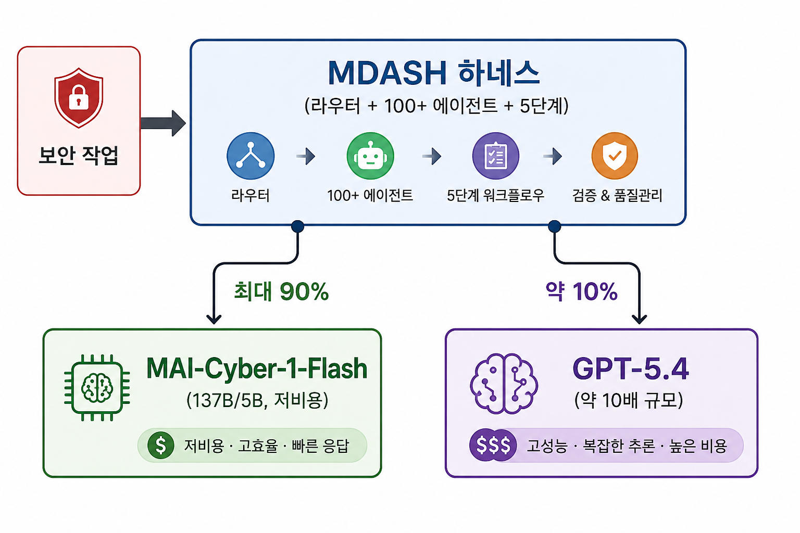

# MAI-Cyber-1-Flash 기술 가이드

AI가 만든 취약점을 AI가 방어한다 — 마이크로소프트 최초의 사이버보안 전용 모델과 그 경쟁 지형

| 항목 | 내용 |
|------|------|
| 작성 기준일 | 2026년 7월 30일 |
| 대상 모델 | MAI-Cyber-1-Flash (Microsoft AI) |
| 발표일 | 2026년 7월 27일 (월), 샌프란시스코 |
| 발표자 | Mustafa Suleyman (CEO, Microsoft AI), Hayete Gallot (Microsoft Security) |
| 1차 출처 | Microsoft AI 공식 발표문, MAI-Cyber-1-Flash 모델 카드, MAI-Thinking-1 기술 보고서 |
| 신뢰도 등급 | B2 (벤더 자체 발표 기반, 부분 교차검증, 독립 검증 미완) |
| 다루는 범위 | 등장 배경, 개발 컨셉, 아키텍처, 성능, 경쟁 프로젝트(Codex Open Security 포함), TCO, 도입 |

---

## 1. 등장 배경 — 왜 지금 사이버보안 전용 모델인가

### 1.1 코드는 AI가 쓰고, 취약점도 AI가 만든다

2026년 소프트웨어 보안 문제의 성격이 바뀐 원인은 단순하다. **코드 생산량이 인간의 검토 능력을 초과했다.** 그리고 그 초과분의 대부분을 생성형 모델이 만들고 있다.

| 지표 | 수치 | 출처 | 신뢰도 |
|------|------|------|--------|
| 전체 코드 중 AI 생성·보조 비중 | **42%** (2027년 50% 초과 전망) | Sonar 개발자 서베이 2026 | B2 |
| OWASP Top 10 취약점을 포함한 AI 생성 코드 샘플 비율 | **45%** (100개 이상 LLM 테스트) | Veracode | B1 |
| XSS 방어에 실패한 생성 샘플 | **86%** | Veracode | B1 |
| 로그 인젝션에 취약한 생성 샘플 | **88%** | Veracode | B1 |
| 코드베이스당 평균 취약점 수 전년 대비 증가율 | **+107%** | Black Duck OSSRA 2026 | B1 |
| 6개 주요 LLM 534개 샘플 중 확인된 취약점 비율 | **25%** | 독립 연구(OWASP Top 10 기준) | C2 |
| AI 생성 코드에서 기인한 엔터프라이즈 침해 비중 | **약 5건 중 1건** | 업계 집계 보도 | C3 |

수치의 출처와 방법론은 제각각이지만 방향은 하나로 수렴한다. **결함의 생산 속도가 인간 검토자의 처리 속도를 구조적으로 앞질렀다.** "바이브 코딩"으로 통칭되는 개발 방식이 확산되며 리뷰 없이 병합되는 코드의 절대량이 늘었고, 그 결과가 CVE 증가율로 나타나고 있다.

### 1.2 공격 측의 탐색 비용이 붕괴했다

같은 모델 능력이 공격 측에도 주어졌다. Anthropic은 2026년 4월 Project Glasswing을 통해 Claude Mythos Preview를 공개하며, **모델이 소프트웨어 취약점을 찾고 익스플로잇하는 능력에서 극소수 최상위 인간 전문가를 제외한 대부분을 넘어섰다**고 평가했다. 약 50개 파트너가 이 모델로 세계적으로 중요한 소프트웨어에서 **1만 건 이상의 High/Critical 취약점**을 발견했다. Anthropic은 6월 이 프로그램을 15개국 150여 개 조직(전력·수도·의료·통신·하드웨어)으로 확대했다.

Microsoft 공식 블로그의 진단도 같다. 공격자는 "익스플로잇을 더 빠르게 생성하고, 캠페인을 더 크게 확장하며, 전례 없는 효율로 작전한다." 즉 **결함을 찾는 비용이 붕괴하면서, 간헐적으로 스캔하고 나중에 패치하는 기존 보안 운영 모델은 이미 낡았다.**

### 1.3 방어자의 병목은 모델 가용성이 아니라 연산 비용이다

방어 측이 같은 능력의 모델을 못 구해서 밀리는 것이 아니다. **엔터프라이즈 리포지토리 전체를 프론티어 모델로 상시 스캔하면 토큰 비용이 폭발한다.** 프론티어 모델 한 종류만으로 커버리지를 확보하려는 순간, 스캔 빈도와 범위가 곧 예산 항목이 되고 그 예산 상한이 그대로 보안 공백이 된다.

Suleyman의 시장 진단이 이 지점을 정확히 짚는다. "사람들이 비즈니스 전반에서 토큰을 최대로 쓰고 있다. 그래서 어디서든 비용을 줄이려는 엄청난 반작용이 있다." 그는 AI 도입의 핵심 장벽이 칩 접근성이며 비용은 결국 칩의 함수라고 덧붙였다.

### 1.4 그래서: AI가 만든 취약점을 AI가 막는다

2026년 상반기 주요 벤더가 동시에 도달한 결론은 동일하다. **인간 속도의 방어로는 기계 속도의 공격과 기계 속도로 생산되는 결함을 감당할 수 없다.** Hayete Gallot의 표현대로 방어자는 "공격자와 동일한 규모와 속도로 AI로 AI를 방어"해야 한다.

이 컨셉은 세 개의 순환 고리로 정리된다.

```
   ① AI가 코드를 생산한다        ② AI가 취약점을 찾는다
   (42%+ / 결함률 45%)   ─────▶  (Glasswing 1만 건+, Codex Security 1.1만 건+)
            ▲                              │
            │                              ▼
   ④ 검증·패치가 다시 코드로       ③ AI가 패치하고 증명한다
      돌아간다 (라이브 RL 루프)  ◀─────  (MDASH Prove 단계 / 그린팀 에이전트)
```

MAI-Cyber-1-Flash는 이 순환의 ②③단계를, **프론티어 모델보다 훨씬 싼 단가로** 상시 돌리기 위해 설계된 모델이다. 이 문서가 다루는 대상은 정확히 그것이다.

### 1.5 발표 패키지 전체 구성

| 구성 요소 | 성격 | 상태 |
|-----------|------|------|
| MAI-Cyber-1-Flash | 사이버보안 전용 LLM | Azure AI Foundry 프라이빗 프리뷰 (MDASH 승인 고객 한정) |
| MDASH | Multi-model agentic Discovery And Security Harness | 2026년 5월 12일 최초 공개, 운영 중 |
| Project Perception | 에이전틱 보안 시스템 (레드/블루/그린팀) | 2026년 8월 3일 Defender 내 퍼블릭 프리뷰 |
| FORGE Lab | Frontier Offensive Research and Generative Exploration Lab | 신설, Taesoo Kim(前 Team Atlanta 리더) 주도 |

Mustafa Suleyman이 요약한 포지셔닝은 명확하다. **"세계 최고 수준의 성능을 절반의 비용으로."** 이 발표의 본질은 성능 자체보다 성능 대비 비용, 즉 라우팅에 있다.

---

## 2. 개발 컨셉 — 무엇을 만들려 했는가

### 2.1 세 축: Model. Data. Harness.

Microsoft가 스스로 제시한 차별화 축은 세 가지다.

| 축 | Microsoft 주장 |
|----|----------------|
| **Model** | 사내에서 처음부터 고품질 데이터로 학습한 컴팩트 코드 중심 보안 모델. 범용 프론티어 모델의 축소판이 아니라 보안 작업에 캘리브레이션된 워크호스 |
| **Data** | 가장 깊은 우위. 아이덴티티·엔드포인트·클라우드·네트워크 전반 **매일 100조 개 이상의 보안 시그널**, MSRC 취약점 처리 이력, **고객 160만 사**의 운영 인사이트, 실제 익스플로잇과 리미디에이션 기록. "누구도 이 역사를 인공적으로 만들 수 없다" |
| **Harness** | 업계 최고 보안 전문가가 튜닝한 100개 이상 에이전트 시스템. 모델을 감싸는 오케스트레이션 자체가 제품 |

### 2.2 사이버보안은 "라이브 강화학습 루프"다

Microsoft의 차별화 논리 중 가장 설득력 있는 부분이다. 사이버보안은 단순히 데이터가 풍부한 도메인이 아니라 **살아 있는 RL 루프**라는 주장이다. 매일 방어자가 위협을 조사하고, 알림을 트리아지하고, 취약점을 수정하고, 그 결과로부터 학습한다.

Microsoft는 이 루프를 종단간 관측한다고 주장한다 — 무엇이 익스플로잇 가능했고, 무엇이 봉쇄됐고, 무엇이 차단됐고, 무엇이 실제로 통했는지. **행동과 결과를 연결할 수 있으면 데이터 이상의 것을 갖게 된다**는 논리다. 정적 코퍼스로 학습한 범용 모델이 복제하기 어려운 지점이 여기다.

### 2.3 방어 전용(defense-only) 설계

이 모델의 설계 사상 중 CTI 관점에서 가장 중요한 항목이다. 모델 카드는 경량 터미널 하네스 기준 단독 성능을 다음과 같이 보고한다.

| 벤치마크 | MAI-Cyber-1-Flash | 측정 대상 |
|----------|-------------------|-----------|
| CVEBench | 0.314 | CVE 관련 추론 |
| CyberSecEval4 — Threat Intelligence | 0.553 | 위협 인텔리전스 해석 |
| CyberSecEval4 — Malware Analysis | 0.330 | 악성코드 분석 |
| CRSBench | 0.651 (POV=1200) | 사이버 추론 시스템 |
| **ExploitGym — Kernel** | **0** | 익스플로잇 생성 |
| **ExploitGym — Userspace** | **0** | 익스플로잇 생성 |
| **ExploitGym — Browser** | **0** | 익스플로잇 생성 |

ExploitGym은 주어진 취약점과 크래시 입력을 실제 코드 실행 익스플로잇으로 전환하는 능력을 측정한다. 전 카테고리 0점은 결함이 아니라 **의도된 결과**다. Microsoft는 모델이 버그 패치 등 방어 작업을 수행하도록 학습되었고 멀웨어 배포 등 공격 작업은 학습하지 않았다고 명시했다.

**실무적 함의**: 익스플로잇을 생성할 수 없으면서 95.95%의 발견 파이프라인을 구동하는 5B-활성 모델은, 공격 능력 유출 리스크를 아키텍처 수준에서 낮춘 디펜더 전용 아티팩트다. 사이버 전용 모델 도입 시 가장 문제가 되는 dual-use 리스크를 학습 단계에서 차단하고, 이를 **측정 가능한 형태로 공개**했다는 점이 핵심이다.

이 선택은 경쟁 제품과 정확히 갈라지는 지점이기도 하다. Google CodeMender는 반대로 **PoC 익스플로잇을 자율 생성해 고객 통제 샌드박스에서 실행**하는 방식으로 오탐을 줄인다. 증명 능력을 취할 것이냐, dual-use 리스크를 차단할 것이냐의 트레이드오프다. Microsoft는 후자를 택하고 증명(Prove) 단계를 하네스 레벨에서 해결했다.

### 2.4 "가장 큰 모델이 아니라, 가장 똑똑하게 라우팅하는 시스템"

Microsoft의 논지는 모델 크기 경쟁에서 시스템 설계 경쟁으로의 전환이다. Microsoft 부사장 Taesoo Kim의 표현이 이 문서 전체의 요약이기도 하다.

> "모델은 하나의 입력이고, 그것을 둘러싼 시스템이 제품이다."

Microsoft는 **모델 가용성이 아니라 연산 비용이 방어자의 스캔 범위를 제약한다**고 주장한다. 따라서 해법은 더 큰 모델이 아니라 난이도에 따라 모델을 갈아 끼우는 라우터다.

### 2.5 사업적 배경: OpenAI 의존도 축소

MAI-Cyber-1-Flash는 Microsoft가 2026년 6월 Build 2026에서 발표한 **7개 사내 모델 패밀리**의 연장선에 있다. 외부 모델 제공사(OpenAI 포함) 의존도를 낮추려는 전략의 일부다.

다만 헤드라인 점수를 만든 구성이 여전히 GPT-5.4에 의존한다는 점은 짚어둘 필요가 있다. 이 모델은 MDASH의 OpenAI 의존을 **제거한 것이 아니라 축소**했다.

---

## 3. 아키텍처 및 모델 스펙

### 3.1 모델 카드 기준 공식 스펙

| 사양 | 상세 내용 |
|------|----------|
| 아키텍처 | Self-attention + **Sparse Mixture-of-Experts (MoE)** Transformer |
| 전체 파라미터 | **1,370억 (137B)** |
| 활성 파라미터 | **50억 (5B)** — 토큰당 활성화 |
| 컨텍스트 윈도우 | **256,000 토큰** |
| 입출력 모달리티 | 텍스트 전용 (text-in / text-out) |
| 직접 베이스 모델 | **MAI-Code-1-Flash** (GitHub Copilot·VS Code 내장 경량 에이전틱 코딩 모델) |
| 계보 | MAI-Base-1 → MAI-Thinking-1 (mid-training 체크포인트) → MAI-Code-1-Flash → MAI-Cyber-1-Flash |
| 학습 데이터 규모 | **비공개** |
| 배포 형태 | MDASH 내부 전용. 스탠드얼론 API 없음 |

### 3.2 계보상 상위 모델 (참고)

| 모델 | 전체 파라미터 | 활성 파라미터 | 비고 |
|------|--------------|--------------|------|
| MAI-Base-1 | 약 1조 | 350억 | 사전학습 베이스. 30조 토큰, 합성 데이터 배제, 제3자 모델 증류 없음 |
| **MAI-Thinking-1** | **약 1조 (~1T)** | **350억 (35B)** | 2026년 6월 Build 2026 발표. 512개 전문가 중 토큰당 8개 활성. 256k 컨텍스트 |
| MAI-Code-1-Flash | 비공개 | 50억 (5B) | 경량 에이전틱 코딩 모델 |
| **MAI-Cyber-1-Flash** | **1,370억 (137B)** | **50억 (5B)** | 본 문서 대상 |

MAI-Cyber-1-Flash는 플래그십 추론 모델의 축소 계열이며, 활성 파라미터가 5B에 불과한 **초경량 라우팅 워크호스**로 설계됐다. 이 점이 뒤에 나올 TCO 논리의 물리적 근거다. 참고로 상위 계보 모델의 학습 규모(30조 토큰)는 MAI-Base-1의 사전학습 규모이며, MAI-Cyber-1-Flash 자체의 학습 토큰 수는 공개되지 않았다.

### 3.3 MDASH 하네스 구조

모델보다 하네스가 실질적 제품이다.

**5단계 파이프라인**

| 단계 | 역할 |
|------|------|
| Prepare | 대상 코드베이스 및 컨텍스트 준비 |
| Scan | 취약점 후보 탐색 |
| Validate | 후보 검증 및 오탐 제거 |
| Dedupe | 중복 findings 통합 |
| Prove | 실제 트리거 입력 실행으로 증명 (C/C++ 타깃은 ASan 사용) |

**에이전트 역할 분담**

- **Auditor 에이전트**: findings 플래깅
- **Debater 에이전트**: 익스플로잇 가능성 논쟁. 에이전트 간 **불일치(disagreement) 자체를 시그널로 사용**
- 총 100개 이상의 특화 에이전트, 복수의 프론티어·증류 모델 혼용

**개발 조직 및 운영 실적**

| 항목 | 내용 |
|------|------|
| 개발 조직 | Microsoft **Autonomous Code Security (ACS)** 팀 |
| 핵심 인력 | DARPA AI Cyber Challenge(AIxCC) 우승팀 **Team Atlanta** 출신 다수 |
| 2026년 5월 실적 | Windows 네트워킹·인증 스택에서 **16건 CVE 발견** (Critical RCE 4건 포함) |
| 회고 검증 | clfs.sys 5년치 MSRC 케이스 28건 중 **96% 재현**, tcpip.sys 7건 중 **100% 재현** |

### 3.4 90/10 라우팅 아키텍처

기술적 혁신의 핵심은 모델 자체가 아니라 **난이도 기반 라우팅**이다.



Suleyman의 설명(2026년 7월 27일 행사): "MDASH 내에서 MAI-Cyber-1-Flash가 최대 90%의 쿼리를 처리하며 취약점을 탐지·패치하고 수정이 실제로 동작했는지까지 확인한다. 남은 10%는 더 큰 모델인 GPT-5.4로 넘긴다." 그는 GPT-5.4가 MAI-Cyber-1-Flash보다 **약 10배 크다**고 언급했다.

VentureBeat 인터뷰에서는 하네스를 "라우터"로 규정했다. 시스템은 세 요소로 구성된다 — 하네스, 대량 쿼리를 담당하는 소형 MAI-Cyber-1-Flash, 그리고 에스컬레이션용 범용 코딩 모델 GPT-5.4.

에스컬레이션 대상으로 최신 모델(GPT-5.6)이 아니라 GPT-5.4를 쓰는 이유도 비용이다. Suleyman: "GPT-5.6은 비싸다. GPT-5.4는 비용 대비 대단히 좋다."

**용어 주의**: 90%와 80%는 다른 지표다. **90%는 MAI-Cyber-1-Flash가 처리 가능한 작업 비중(설계 목표, "up to 90%")**이고, **80%는 MDASH 내에서 교체된 기존 모델의 비중**이다. 혼용하면 안 된다.

### 3.5 안전성 및 엔터프라이즈 통제

| 계층 | 통제 항목 |
|------|-----------|
| 모델 학습 | Security-first 캘리브레이션, 공격 작업 미학습 |
| 평가 | Microsoft AI Red Team 평가, 자동화 및 전문가 주도 적대적 훈련, 제3자 독립 평가(기관 미공개) |
| 배포 | Role-Based Controls, 테넌트 격리, 암호화, 감사 추적 |
| 실행 환경 | **인터넷 접근이 없는 샌드박스 실행 환경** |
| 벤치마크 환경 | 프로덕션·공개 인터넷·외부 서비스 접근이 차단된 네트워크 격리 환경 |

모델 카드는 생성된 텍스트와 코드가 부정확하거나 불완전할 수 있으며 중대한 용도에 쓰기 전 검토가 필요하다고 경고한다.

---

## 4. 성능

### 4.1 CyberGym이 측정하는 것과 측정하지 않는 것

CyberGym은 대규모 코드베이스에서 실제 취약점을 찾는 AI 시스템의 추론 능력을 평가하는 UC Berkeley 발 공개 벤치마크다. Microsoft는 이를 "골드 스탠다드"로 부른다.

| 속성 | 내용 |
|------|------|
| 태스크 수 | **1,507개** 실제 취약점 재현 태스크 |
| 출처 프로젝트 | **188개 OSS-Fuzz 프로젝트** |
| Microsoft 평가 구성 | **Level 1 (기본 설정)** |
| Level 1 정의 | 취약한 소스 코드와 고수준 취약점 설명을 제공하고, 동작하는 PoC를 만들어내는지 확인 |
| **측정하지 않는 것** | **블라인드 취약점 발견 능력, 생성된 패치의 정확성** |

마지막 항목이 핵심이다. Level 1은 "설명이 주어진 알려진 취약점의 재현" 테스트다. 0-day를 스스로 찾아내는 능력이나 패치가 옳은지는 이 점수에 포함되지 않는다. 실무에서 가장 중요한 두 능력이 헤드라인 숫자에 들어 있지 않다는 뜻이다.

### 4.2 발표 시점 비교 (2026년 7월 27일)

| 순위 | 시스템 | CyberGym Level 1 | 제공사 |
|------|--------|------------------|--------|
| 1 | **MDASH + MAI-Cyber-1-Flash + GPT-5.4** | **95.95%** | Microsoft |
| 2 | GPT-5.5 Cyber | 85.6% | OpenAI |
| 3 | Mythos 5 | 83.8% | Anthropic |
| 4 | GPT-5.6 Sol | 83.6% | OpenAI |
| 5 | Gemini 3.5 Flash Cyber (CodeMender 내) | 83.2% | Google |

Microsoft는 이를 "Mythos 대비 +12포인트"로 표현하며 95.95%를 96%로 반올림했다. 경쟁 4개 시스템은 83.2%~85.6% 구간에 밀집한다.

**두 가지 유의점**

1. 95.95%는 **모델 단독 점수가 아니라 MDASH 시스템 점수**다. 그 시스템은 경쟁사 모델(GPT-5.4)을 에스컬레이션 경로로 포함한다.
2. 표의 모든 수치는 **Microsoft 자체 인프라에서 Microsoft가 수행한 측정**이다. 각 벤더가 리더보드에 직접 제출한 값이 아니다.

### 4.3 MDASH 성능 추이 — 시계열로 읽으면 안 되는 이유

| 시점 | 구성 | 점수 | 비고 |
|------|------|------|------|
| 2026년 5월 12일 | MDASH, GA 모델만 사용 | **88.45%** | 당시 공개 리더보드 1위, 2위(83.1%)와 약 5pt 차 |
| 2026년 6월 | MDASH | 96.55% | **모든 크래시를 집계한 기준.** 타깃 외 취약점 포함 |
| 2026년 7월 27일 | MDASH + MAI-Cyber-1-Flash + GPT-5.4 | **95.95%** | 판정 기준 명시 없음 |

6월의 96.55%는 판정 기준이 느슨했고, 7월 자료는 동일 기준을 썼는지 밝히지 않았다. 모델 카드가 명시한 유효한 비교는 하나뿐이다 — **"기존 MDASH 모델의 80%를 교체하여 88.4% → 95.95%"**.

### 4.4 독립 검증 상태

| 검증 항목 | 상태 |
|-----------|------|
| CyberGym 공개 리더보드 등재 | **미등재** (2026년 7월 28일 확인 기준). 5월 12일 88.4%가 여전히 최신 등재 기록. Microsoft 자료는 제출 여부를 언급하지 않음 |
| 출시 전 독립 평가기관 제공 | **미제공** (NYT 보도) |
| 제3자 평가 | Microsoft는 실시했다고 주장. **기관명 비공개** |
| 비용 절감 재현 가능성 | **불가**. 토큰 사용량, 호출량, 레이턴시, 태스크 믹스, 컴퓨트 배분 모두 비공개 |

벤치마크를 "골드 스탠다드"로 부르면서 그 리더보드에는 제출하지 않은 상태라는 점은 도입 검토 시 감안해야 한다.

### 4.5 벤더 점수와 독립 측정의 간극

이 카테고리 전반에 걸친 구조적 문제다. 2026년 7월 21일 Sakana AI가 오케스트레이션 모델 **Fugu-Cyber**를 공개하며 CyberGym **86.9%**, CTI-REALM **72.1%**를 보고했다. 이 수치는 Microsoft가 비교군으로 제시한 4개 시스템(83.2~85.6%)을 모두 상회하지만 Microsoft의 비교 차트에는 포함되지 않았다.

동시에 기술 매체들은 **CyberGym 제작진이 ICLR 2026에서 보고한 상위 모델 조합의 성적이 약 20% 수준**이었다는 점을 지적하며, 벤더 자체 발표치와의 격차를 문제 삼았다. 평가 구성(설명 제공 여부, 시도 횟수, 판정 기준)이 다르면 같은 벤치마크 이름 아래 전혀 다른 숫자가 나온다.

**결론**: 이 카테고리에서 벤더 발표 벤치마크 점수는 벤더 간 순위 비교용으로 쓸 수 없다. 비교군 선택권과 측정 환경이 모두 발표자에게 있기 때문이다.

### 4.6 벤치마크보다 신뢰할 만한 증거

MAI-Cyber-1-Flash 진영에서 실무적으로 더 의미 있는 증거는 벤치마크가 아니라 운영 실적이다.

| 증거 | 내용 | 왜 더 강한가 |
|------|------|--------------|
| Windows CVE 16건 발견 (2026년 5월) | Critical RCE 4건 포함 | 실제 프로덕션 코드베이스, 실제 CVE 발급 |
| clfs.sys 회고 검증 | 5년치 MSRC 케이스 28건 중 96% 재현 | 합성 태스크가 아닌 실제 사건 이력 |
| tcpip.sys 회고 검증 | 7건 중 100% 재현 | 동일 |

---

## 5. Project Perception — 실제로 마주치게 될 접점

MAI-Cyber-1-Flash를 실무자가 접하는 경로는 모델 API가 아니라 Perception이다.

### 5.1 3색 에이전트 구조

| 팀 | 역할 |
|----|------|
| **레드팀 에이전트** | 공격자 관점으로 침해 경로 탐색. 정찰, 공격 경로 평가, 취약점 스캔 |
| **블루팀 에이전트** | 시그널 조사, 컨텍스트 추론, 유의미한 리스크 판별 및 우선순위화. 신규 탐지 룰 생성 |
| **그린팀 에이전트** | 수정 조치 실행, 패치 작성, 환경 하드닝. GitHub 연동 PR 생성 가능 |

색상 분류는 Microsoft의 창작이 아니라 정보보안 업계의 통상 용어를 따른 것이다. 세 팀이 닫힌 루프를 이루며 서로의 결과를 입력으로 삼는 구조가 §2.2의 "라이브 RL 루프" 주장을 제품화한 형태다.

### 5.2 운영 특성

| 항목 | 내용 |
|------|------|
| 제공 위치 | **Microsoft Defender 내부** (현재 Defender 전용) |
| 퍼블릭 프리뷰 | **2026년 8월 3일**, 전 세계 |
| 초기 대상 | MDASH를 이미 테스트 중인 비즈니스 고객 중심 |
| 첫 적용 시나리오 | MDASH 내 소프트웨어 취약점 관리 |
| 초기 데모 범위 | 웹 애플리케이션 하드닝 |
| 인터페이스 | Defender 워크플로우 + **MCP 서버** 제공(CLI 실행 가능) + GitHub PR |
| 휴먼 인 더 루프 | **고영향 조치는 사람 승인 필수** |
| 공유 컨텍스트 | 자산·아이덴티티·관계·리스크·활동의 지속 갱신 레이어 |
| 과금 | 소비 기반, SCU 단위 |

Perception은 MDASH보다 넓은 범위를 노린다. MDASH가 취약점 스캔·식별에 집중한다면, Perception은 공격 경로 식별부터 우선순위화, 수정 구현, 신규 탐지 생성까지 보안 라이프사이클 전체를 대상으로 한다. Microsoft는 향후 MAI-Cyber-1-Flash를 소프트웨어 취약점 작업 외의 보안 워크플로우로 확장할 계획을 밝혔다.

### 5.3 에이전트·MCP 경유 권한 상승 리스크

Perception이 MCP 서버를 제공한다는 점은 도입 시 별도 검토가 필요하다. MCP는 2025~2026년 사이 프롬프트 인젝션, 도구 권한 과다, 서버 신뢰 경계 문제로 다수의 취약점 사례가 보고된 프로토콜이다. **보안 자동화 에이전트가 MCP를 경유해 CLI 실행 권한을 갖는 구조는 그 자체가 권한 상승 경로가 될 수 있다.**

이것이 이론적 우려가 아니라는 점은 경쟁 제품에서 이미 확인됐다. 2026년 3월 OpenAI Codex에서 **악의적으로 명명된 GitHub 브랜치 이름이 태스크 셋업 중 명령을 주입해 GitHub 인증 토큰을 탈취할 수 있는 취약점**이 발견되어 패치됐다. 보안 에이전트 자신이 공급망 침투 경로가 되는 시나리오다.

도입 시 확인 항목:

- MCP 서버의 인증·인가 모델 및 토큰 스코프
- 그린팀 에이전트의 코드 수정 권한 범위와 승인 게이트 위치
- GitHub PR 생성 권한이 어느 리포지토리·브랜치까지 미치는지
- 에이전트가 처리하는 외부 입력(위협 인텔리전스 피드, 이슈 코멘트, 브랜치·커밋 메시지 등)의 인젝션 방어
- 샌드박스 격리가 실제로 인터넷 차단 상태를 유지하는지에 대한 감사 방법

---

## 6. 경쟁 프로젝트 지형

### 6.1 게이팅된 상용 사이버 전용 모델

| 모델/시스템 | 제공사 | CyberGym | 접근 방식 |
|------|--------|----------|-----------|
| **MAI-Cyber-1-Flash (MDASH+GPT-5.4)** | Microsoft | **95.95%** | MDASH 승인 고객, Azure AI Foundry 프라이빗 프리뷰 |
| Fugu-Cyber | Sakana AI | 86.9% | 오케스트레이션 모델. 2026년 7월 21일 공개 |
| GPT-5.5 Cyber | OpenAI | 85.6% | 제한 제공 |
| Mythos 5 | Anthropic | 83.8% | **Glasswing** 프로그램, 신뢰 파트너 한정 |
| GPT-5.6 Sol | OpenAI | 83.6% | **Daybreak** 프로그램(2026년 5월 개시), 정부 승인 고객 한정 |
| Gemini 3.5 Flash Cyber | Google | 83.2% | **CodeMender** 내 제공, 초대 기반 |

이 카테고리 전체가 게이팅되어 있다는 점이 특징이다. 공격 능력 유출 우려 때문에 사이버 전용 모델은 사실상 전부 제한 배포 모델이다.

**주요 경쟁 프로젝트 상세**

| 프로젝트 | 성격 | 특징적 설계 |
|----------|------|-------------|
| **Anthropic Project Glasswing** | 산업 공동 이니셔티브 | 2026년 4월 Mythos Preview 공개 → 파트너 약 50곳이 1만 건 이상 High/Critical 발견 → 6월 15개국 150여 조직으로 확대(전력·수도·의료·통신·하드웨어). Mythos 5는 Fable 5와 동일 기반 모델에서 일부 안전장치를 해제한 버전으로, 명시적으로 "세계 최강 사이버 능력" 포지셔닝 |
| **Google CodeMender** | Gemini Enterprise 에이전트 | Gemini 3.5 Flash Cyber 기반. **PoC 익스플로잇을 자율 생성해 고객 통제 샌드박스에서 실행**해 오탐 제거 → 패치 작성 → 모델-as-judge로 부작용 검증 → diff로 개발자 승인. C/C++·Go·Java·Python·Ruby·Rust·TypeScript 지원. 무승인 반영 없음 |
| **OpenAI Daybreak** | 정부·중요 인프라 대상 프로그램 | 2026년 5월 개시, GPT-5.6 Sol 제공 |
| **OpenAI Codex Security** | 개발자용 AppSec 에이전트 | §6.2에서 상술. **CLI/SDK 오픈소스화(Apache-2.0)** + 스캐너 엔진 게이팅의 하이브리드 |
| **Sakana AI Fugu-Cyber** | 오케스트레이션 모델 | 단일 모델처럼 노출되지만 실제로는 특화 에이전트 풀을 동적 라우팅하는 멀티에이전트 시스템. **MDASH와 동일한 설계 철학**. 풀 구성은 비공개 |
| **NVIDIA Open Secure AI Alliance** | 업계 표준 이니셔티브 | Microsoft 참여 |

주목할 점은 상위 두 시스템(MDASH, Fugu-Cyber)이 **모두 오케스트레이션 시스템**이라는 것이다. 단일 프론티어 모델로 전 구간을 커버하려는 접근은 비용 구조상 성립하지 않는다는 판단이 업계 전반에 공유되고 있다.

### 6.2 Codex Open Security — 반대 방향의 베팅

MAI-Cyber-1-Flash 발표 이틀 뒤인 **2026년 7월 29일**, OpenAI가 Codex Security의 CLI와 TypeScript SDK를 **Apache-2.0으로 오픈소스화**했다. 같은 문제를 정반대 배포 전략으로 공략한 사례이므로 별도로 다룬다.

**계보와 실적**

| 시점 | 내용 |
|------|------|
| 2026년 3월 | 내부 코드네임 **Aardvark**로 리서치 프리뷰 시작 |
| 2026년 3월 | Codex 자체에서 GitHub 브랜치명 경유 명령 주입 → 인증 토큰 탈취 취약점 발견·패치 |
| 2026년 4월 | OpenAI, **3,000건 이상의 Critical 취약점 수정** 보고 |
| 베타 기간 누적 | **Critical 792건 / High 10,561건** 발견, **120만 건 이상 커밋** 스캔. GnuPG, GnuTLS, GOGS, Thorium, libssh, PHP, Chromium 등 |
| 2026년 6월 | Codex 주간 사용자 500만 명 도달 |
| **2026년 7월 29일** | **CLI + TypeScript SDK 오픈소스 공개 (Apache-2.0)** |

**무엇이 열렸고 무엇이 잠겼는가**

| 구성 요소 | 상태 |
|-----------|------|
| CLI (`@openai/codex-security`) | **오픈소스, Apache-2.0**. npm 배포 |
| TypeScript SDK | **오픈소스**. 프로그래밍 방식 통합 가능 |
| 스캐너 엔진 (모델) | **게이팅**. 승인 고객 대상 제한 베타 |
| 인증 | ChatGPT 로그인 또는 API 키(`OPENAI_API_KEY` / `CODEX_API_KEY`). CI 환경은 API 키 권장 |
| 모델 선택 | `gpt-5.6-terra` 등 변형 지정 가능, effort 레벨 조절 가능 |
| 요구 환경 | Node.js 22.13.0+ (22.x/24.x/26.x), Python 3.10+ |
| GitHub 반응 | 공개 직후 약 1.5k stars → 2026년 7월 30일 기준 **5.2k stars / 325 forks** |

The Next Web의 요약이 이 구조를 정확히 표현한다 — **"열린 배관에 잠긴 엔진을 볼트로 조인 것"**(open plumbing bolted to a gated engine). 오케스트레이션 계층은 감사 가능하게 열되, 취약점 추론 능력 자체는 여전히 통제한다.

**동작 방식**

Codex Security는 전통적 패턴 매칭 스캐너가 아니라 **보안 연구자처럼 동작하도록** 설계됐다. 코드를 읽고, 테스트를 실행하고, 현실적인 공격 경로를 탐색한 뒤, 팀이 평소 워크플로우에서 리뷰할 수 있는 형태로 패치를 제안한다. CLI는 리포지토리 스캔, 실행 간 findings 비교·추적, 수정 검증, CI/CD 파이프라인 통합, 다중 리포지토리 일괄 스캔을 지원한다.

**MAI-Cyber-1-Flash와의 대비**

| 축 | MAI-Cyber-1-Flash | Codex Security |
|----|-------------------|----------------|
| 개방 범위 | 전면 비공개 | **CLI·SDK 오픈소스(Apache-2.0)**, 엔진 게이팅 |
| 진입 경로 | MDASH 승인 → Azure AI Foundry 프라이빗 프리뷰 | npm 설치 + 계정 인증 (엔진 접근은 승인 필요) |
| 1차 사용자 | 엔터프라이즈 보안 조직 (SOC) | **개발자 / AppSec 엔지니어** |
| 통합 지점 | Defender 콘솔, MCP, GitHub PR | CLI, CI/CD, PR 리뷰, TypeScript SDK |
| dual-use 통제 | 학습 단계 차단 (ExploitGym 0/0/0) | 엔진 접근 게이팅으로 통제 |
| 감사 가능성 | 벤더 제공 감사 로그 | **오케스트레이션 코드 전체 감사 가능**, 모델은 불가 |
| 비용 구조 | SCU 소비 기반 | API 토큰 과금 |
| 경쟁 대상 | Defender·SIEM 예산 | **Snyk, Semgrep, Veracode, GitHub Advanced Security** |

**전략적 함의**: 두 회사가 같은 시장을 서로 다른 층위에서 공략하고 있다. Microsoft는 SOC의 관리형 서비스 예산을, OpenAI는 개발자 툴체인의 AppSec 예산을 겨냥한다. 오픈소스화는 표준 선점 수단이다 — CLI가 CI/CD 파이프라인의 기본값이 되면, 엔진을 계속 게이팅해도 시장은 확보된다. 실제로 두 발표는 이틀 간격이었고, 업계는 이를 Anthropic Glasswing·Google CodeMender를 포함한 **동일 예산 쟁탈전**으로 읽고 있다.

**도입 검토 시**: Codex Security는 오픈소스지만 **자체 호스팅 대안이 아니다.** 엔진 접근이 없으면 CLI만으로는 스캔이 성립하지 않는다. "Apache-2.0"이라는 라벨을 온프레미스 가능성으로 오독하면 안 된다.

### 6.3 전통 AppSec 도구·오픈웨이트 대안과의 비교

| 항목 | MAI-Cyber-1-Flash | 오픈소스·전통 대안 (CodeQL, Semgrep, SecBERT 계열, 오픈웨이트 코딩 모델) |
|------|-------------------|--------------------------------------|
| 라이선스 | **비공개, 오픈웨이트 아님** | 오픈 |
| 탐지 방식 | 컨텍스트 추론 + 실행 증명 | 주로 규칙·패턴 매칭 (일부 데이터플로우 분석) |
| 학습 데이터 | 수십 년 실제 보안 사건·리미디에이션 기록 (복제 불가) | 공개 데이터 |
| 하네스 | 100+ 에이전트, 5단계, 전문가 튜닝 | 직접 구축 필요 |
| 에스컬레이션 | GPT-5.4 연계 내장 | 직접 설계 필요 |
| 제품 통합 | Microsoft Defender, GitHub PR, MCP 서버 | 개별 통합 |
| 온프레미스 자체 호스팅 | 불가 | 가능 |
| 감사 가능성 | 벤더 제공 감사 로그 | 전체 스택 감사 가능 |
| 비용 구조 | SCU 소비 기반 (가변) | 인프라 비용 (고정) |
| dual-use 리스크 | 공격 능력 미학습 (ExploitGym 0점) | 모델별로 상이, 통제 어려움 |

**카테고리 확인**: MAI-Cyber-1-Flash는 오픈웨이트 생태계의 경쟁자가 아니라 **엔터프라이즈 관리형 보안 서비스** 카테고리의 제품이다. 오픈소스 스캐너와의 비교는 대체재 비교가 아니라 커버리지 계층 비교로 읽어야 한다. 실무에서는 규칙 기반 스캐너를 1차 필터로 두고 LLM 파이프라인을 심층 분석에 배치하는 조합이 현실적이다.

### 6.4 업계 동시 움직임 타임라인

| 시점 | 사업자 | 내용 |
|------|--------|------|
| 2026년 3월 | OpenAI | Codex Security 리서치 프리뷰 (코드네임 Aardvark) |
| 2026년 4월 | Anthropic | Project Glasswing 개시, Mythos Preview 공개 |
| 2026년 5월 | OpenAI | Daybreak 프로그램 개시 |
| 2026년 5월 12일 | Microsoft | MDASH 최초 공개, CyberGym 88.45%로 리더보드 1위 |
| 2026년 6월 | Anthropic | Mythos 5 / Fable 5 공개, Glasswing 150여 조직으로 확대 |
| 2026년 6월 | Microsoft | Build 2026, 사내 7개 모델 패밀리 발표 |
| 2026년 7월 초 | Google Cloud | **CodeMender** 출시 |
| 2026년 7월 21일 | Google / Sakana AI | Gemini Flash 3종(Cyber 포함) 공개 / Fugu-Cyber 공개 |
| 2026년 7월 27일 | Microsoft | **MAI-Cyber-1-Flash + Project Perception + FORGE Lab** |
| 2026년 7월 29일 | OpenAI | **Codex Security CLI·SDK 오픈소스화 (Apache-2.0)** |
| 동시기 | NVIDIA | **Open Secure AI Alliance** 출범 (Microsoft 참여) |

넉 달 사이 주요 프론티어 랩 전부가 사이버보안 전용 제품을 냈다. 공통 인식은 두 가지다 — **사이버보안은 멀티모델·멀티에이전트 문제이며, 비용이 커버리지를 결정한다.**

---

## 7. TCO (Total Cost of Ownership)

### 7.1 비용 구조

| 항목 | 상세 |
|------|------|
| 절감 주장 | 기존 MDASH 최고 구성(**GPT-5.4 + GPT-5.4 mini + GPT-5.3 Codex**) 대비 **약 50% 절감** |
| 절감 메커니즘 | 기본 라우팅을 저비용 전용 모델로 두고, 초과 난이도만 에스컬레이션 |
| Perception 과금 | 소비 기반 pay-as-you-go, **Security Compute Unit(SCU)** 단위 측정 |
| SCU 단가 | **비공개**. 에이전트 종류별로 SCU 소비율이 다름 |
| 모델 자체 과금 | 별도 공개 가격표 없음 (프라이빗 프리뷰) |

### 7.2 TCO 관점 이점

1. **토큰 비용 제약 해소**: 인바운드 공격량을 감당하려면 스캔 빈도를 높여야 하는데, 프론티어 모델로는 토큰 비용이 실질적 상한이 된다. 5B-활성 모델을 기본값으로 두는 것이 이 상한을 올린다.

2. **스캔 주기 단축**: 월간 패치 사이클에서 상시 운영으로 전환. Perception 에이전트는 지속적으로 동작한다.

3. **공유 컨텍스트 레이어**: Perception은 조직의 자산·아이덴티티·관계·리스크·활동을 지속 갱신하는 공유 security context를 둔다. 각 에이전트가 원시 시그널을 처음부터 수집하지 않으므로 토큰 비용과 레이턴시가 함께 줄어든다.

4. **인건비 절감**: 다수 보안 전문가가 수작업으로 처리했던 트리아지·조사·수정 워크플로우를 에이전트가 분담한다.

### 7.3 TCO 관점 리스크

| 리스크 | 내용 |
|--------|------|
| 검증 불가능한 절감률 | 50%의 근거가 되는 토큰 사용량, 호출량, 레이턴시, 태스크 믹스, 컴퓨트 배분이 전부 비공개. 타 시스템 대비 정규화 불가 |
| 비교 기준이 자사 구성 | 50%는 "Microsoft의 이전 구성 대비"다. 경쟁사 대비 절대 비용 우위를 뜻하지 않음 |
| SCU 예산의 가변성 | 고정 라이선스 티어가 아니라 소비 기반이므로 **스캔 범위가 곧 예산 항목이 된다.** 스캔 확대가 곧 비용 증가 |
| 에스컬레이션 비율 변동 | 90/10은 설계 목표치("up to 90%")다. 실제 코드베이스의 난이도 분포가 나쁘면 GPT-5.4 호출 비중이 올라가고 절감률이 훼손된다 |
| 벤치마크와 실환경의 간극 | 벤치마킹용 취약점 세트는 불완전한 문서, 낡은 의존성, 수년간 누적된 패치 이력을 가진 라이브 코드베이스와 다르게 거동한다 |
| 오탐 처리 인건비 | LLM 파이프라인의 findings 검토 부담은 SCU 요금에 포함되지 않는다. 오탐률이 높으면 절감분이 인건비로 상쇄된다 |

**실무 권고**: 프리뷰 평가 시 CyberGym 점수보다 **자사 취약점 백로그와 위협 프로파일에 대해 R/B/G 루프가 어떻게 작동하는지**, 그리고 **실제 에스컬레이션 비율이 10%에 수렴하는지**를 측정해야 한다. 후자가 TCO 전체를 결정한다.

---

## 8. 도입 및 시작하기

### 8.1 현재 접근 가능 상태 (2026년 7월 30일 기준)

| 대상 | 접근 조건 | 상태 |
|------|-----------|------|
| MAI-Cyber-1-Flash 모델 | **승인된 MDASH 고객**, Azure AI Foundry 프라이빗 프리뷰 | 게이팅 |
| 스탠드얼론 API | **존재하지 않음** | 불가 |
| 범용 애플리케이션 통합 | **불가** — MDASH 내부 전용 | 불가 |
| MDASH | Microsoft Security 영업 채널 경유 | 기존 고객 |
| Project Perception | Microsoft Defender 내 퍼블릭 프리뷰 | 2026년 8월 3일 |

Azure 구독이나 M365/Defender 라이선스만으로 모델을 쓸 수 있는 상태가 아니다. **Microsoft Defender 및 MDASH 트랙에 이미 진입한 조직**이 실질적 대상이다.

### 8.2 진입 경로

**Step 1. 전제 조건 확인**

- Microsoft Defender 도입 여부 (Perception의 전제)
- MDASH 프로그램 참여 여부 또는 참여 가능성
- Azure AI Foundry 테넌트 및 거버넌스 정책

**Step 2. Project Perception 프리뷰 확인 (8월 3일 이후)**

Microsoft Security 제품 페이지 및 Defender 관리 콘솔에서 프리뷰 활성화 가능 여부를 확인한다. 조직 규모와 기존 계약에 따라 접근 시점이 다르다.

**Step 3. MDASH 접근은 영업 채널 경유**

모델 자체 사용은 MDASH 승인이 전제다. 공개 셀프서비스 등록 경로는 현재 없다. Microsoft 계정 담당자 또는 파트너를 통해 문의해야 한다.

**Step 4. 파일럿 설계 — 측정 지표 사전 정의**

| 측정 항목 | 왜 중요한가 |
|-----------|-------------|
| 실제 에스컬레이션 비율 | 90/10이 유지되지 않으면 50% 절감 논리가 붕괴 |
| SCU 소비량 대 findings 수 | 단위 발견당 비용 산출 |
| 오탐률 (블루팀 트리아지 이후) | 벤치마크가 측정하지 않는 지표 |
| 그린팀 패치 정확도 | CyberGym Level 1이 측정하지 않는 지표 |
| 자사 백로그 대비 커버리지 | 합성 벤치마크와 라이브 코드베이스의 간극 확인 |
| 승인 게이트 통과 시간 | 휴먼 인 더 루프가 실제 병목이 되는지 |

**Step 5. 거버넌스 문서화**

- 에이전트 권한 매트릭스 (RBAC 매핑)
- 자동 수정 허용 범위와 금지 범위
- 감사 로그 보존 및 검토 절차
- 테넌트 격리 검증 방법
- 사고 시 롤백 절차

### 8.3 도입 판단 기준

| 조건 | 권고 |
|------|------|
| 이미 Microsoft Defender 중심 스택 + 대규모 자사 코드베이스 보유 | 프리뷰 평가 가치 높음 |
| 멀티 클라우드 / 비Microsoft 보안 스택 | 현 단계에서 실익 낮음 (Defender 전용). CodeMender 또는 Codex Security 검토 |
| 개발자 툴체인·CI/CD 중심으로 먼저 붙이고 싶은 경우 | **Codex Security CLI**가 진입 장벽이 가장 낮음 (§6.2) |
| 온프레미스 자체 호스팅 요구 | 해당 없음. 이 카테고리 전체가 미충족 (오픈소스 CLI도 엔진은 원격) |
| 규제상 모델 감사 가능성 요구 | 벤더 제공 감사 로그 수준으로 충족 가능한지 사전 검토 필요 |
| 소규모 코드베이스 | 스캔 범위가 작으면 SCU 기반 과금의 이점이 제한적 |

---

## 9. 종합 평가

### 9.1 신뢰도별 정리

| 신뢰도 | 항목 |
|--------|------|
| **확인됨 (모델 카드·공식 문서 기재)** | 137B/5B/256k MoE 스펙, MAI-Code-1-Flash 파인튜닝, 텍스트 전용, MDASH 전용 배포, ExploitGym 0/0/0, CVEBench 등 단독 스코어, 5단계 파이프라인, Perception 8월 3일 프리뷰, SCU 과금 방식 |
| **벤더 주장 (교차검증 부분적)** | CyberGym 95.95%, 경쟁사 83.2~85.6%, 약 50% 비용 절감, 최대 90% 작업 처리, 100조+ 일일 시그널, 고객 160만 사, 제3자 독립 평가 실시 |
| **검증 불가 / 미공개** | 학습 토큰 규모, SCU 단가, 50% 절감의 산출 근거, 제3자 평가기관 정체, 실환경 오탐률, 패치 정확도 |
| **반증 또는 불일치** | CyberGym 공개 리더보드 미등재(7/28 기준), 출시 전 독립 테스터 미제공, 벤더 발표치와 벤치마크 제작진 측정치의 큰 격차 |

### 9.2 설득력 있는 부분

**라우팅 아키텍처는 실질적인 엔지니어링 답변이다.** 프론티어 모델 단일 사용은 스캔 빈도를 비용으로 제약하고, 그 제약이 곧 보안 공백이 된다는 진단은 정확하다. 5B-활성 모델을 기본값으로 두고 난이도 초과분만 에스컬레이션하는 구조는 이 제약을 완화하는 올바른 방향이다. Sakana Fugu-Cyber가 독립적으로 같은 결론(오케스트레이션 우선)에 도달했다는 점이 이 방향성의 방증이다.

**방어 전용 설계를 측정 가능한 형태로 공표한 것도 평가할 만하다.** ExploitGym 전 카테고리 0점은 사이버 전용 모델의 최대 리스크인 dual-use 문제를 학습 단계에서 차단했다는 검증 가능한 주장이다. 경쟁 제품이 익스플로잇 생성 능력을 오히려 기능으로 채택한 것과 대비된다.

**운영 실적이 벤치마크보다 강하다.** MDASH의 회고 검증(clfs.sys 28건 중 96%, tcpip.sys 7건 중 100% 재현)과 5월 실제 CVE 16건 발견은 합성 벤치마크보다 실무적으로 유의미한 증거다.

### 9.3 받아들이기 어려운 부분

**95.95%는 모델 점수가 아니라 시스템 점수이며, 그 시스템은 경쟁사 모델(GPT-5.4)에 의존한다.** 프론티어 경쟁사를 이겼다는 서사와 프론티어 경쟁사 모델을 내부에 쓰고 있다는 사실이 같은 발표 안에 있다.

**CyberGym Level 1은 "설명이 주어진 알려진 취약점의 재현"을 측정한다.** 블라인드 발견도, 패치 정확성도 측정하지 않는다. 실무에서 중요한 두 능력이 헤드라인 숫자에 포함되지 않는다.

**리더보드 미등재와 출시 전 독립 테스터 미제공은 함께 놓고 볼 때 문제다.** 벤치마크를 "골드 스탠다드"로 부른다면 그 리더보드에 제출하는 것이 자연스럽다.

**50% 절감은 재현 불가능하고 비교 대상도 자사 이전 구성이다.** 경쟁 시스템 대비 절대 비용 우위를 주장하는 근거로 쓸 수 없다.

### 9.4 결론

이 발표는 모델 발표가 아니라 **시스템 아키텍처 발표**로 읽는 것이 정확하다. Taesoo Kim의 "모델은 하나의 입력이고, 그것을 둘러싼 시스템이 제품이다"가 발표 전체의 정직한 요약이다.

더 넓게 보면 2026년 상반기 넉 달간의 발표 러시 전체가 하나의 명제로 수렴한다. **AI가 코드를 쓰는 속도로 결함이 생산되므로, 방어도 같은 속도로 자동화되어야 하며, 그 자동화의 제약은 모델 능력이 아니라 단가다.** Microsoft는 전용 소형 모델 + 라우팅으로, OpenAI는 개발자 툴체인 오픈소스화로, Google은 익스플로잇 자율 검증으로, Anthropic은 최상위 능력의 통제된 배포로 각각 답했다. 접근은 다르지만 문제 인식은 동일하다.

**도입 판단 근거로 삼을 만한 것은 두 가지다.** 첫째, Microsoft가 자사 Windows 코드베이스에서 실제로 CVE를 찾아냈다는 운영 실적. 둘째, 라우팅으로 스캔 단가를 낮춘다는 구조적 논리. 이 둘은 벤치마크 없이도 검증 가능하며, 프리뷰 파일럿에서 자사 환경으로 직접 확인할 수 있다. 벤더 발표 벤치마크 점수는 이 카테고리에서 의사결정 근거로 쓰기 어렵다.

---

## 10. 참고 자료

### 10.1 1차 출처 — Microsoft

| 자료 | 링크 |
|------|------|
| MAI-Cyber-1-Flash 공식 발표문 | https://microsoft.ai/news/introducing-mai-cyber-1-flash-inside-mdash/ |
| MAI-Cyber-1-Flash 모델 페이지 | https://microsoft.ai/models/mai-cyber-1-flash/ |
| MAI-Cyber-1-Flash 모델 카드 (PDF) | https://microsoft.ai/pdf/MAI-Cyber-1-Flash-Model-Card.pdf |
| MAI-Code-1-Flash 모델 카드 (PDF) | https://microsoft.ai/pdf/MAI-Code-1-Flash-Model-Card.PDF |
| MAI-Thinking-1 기술 보고서 (PDF) | https://microsoft.ai/pdf/mai-thinking-1.pdf |
| Project Perception 제품 페이지 | https://www.microsoft.com/en-us/security/business/ai-powered-cybersecurity/project-perception-agentic-system |
| Rethinking security for the age of AI (공식 블로그) | https://blogs.microsoft.com/blog/2026/07/27/rethinking-security-for-the-age-of-ai/ |
| MDASH 최초 공개 (2026-05-12) | https://www.microsoft.com/en-us/security/blog/2026/05/12/defense-at-ai-speed-microsofts-new-multi-model-agentic-security-system-tops-leading-industry-benchmark/ |
| Beyond the Benchmark (2026-06-17) | https://www.microsoft.com/en-us/security/blog/2026/06/17/beyond-the-benchmark-advancing-security-at-ai-speed/ |

### 10.2 1차 출처 — 경쟁 프로젝트

| 자료 | 링크 |
|------|------|
| OpenAI Codex Security (리서치 프리뷰) | https://openai.com/index/codex-security-now-in-research-preview/ |
| openai/codex-security (GitHub, Apache-2.0) | https://github.com/openai/codex-security |
| Codex Security 도움말 | https://help.openai.com/en/articles/20001107-codex-security |
| Anthropic Project Glasswing | https://www.anthropic.com/glasswing |
| Project Glasswing 확대 발표 | https://www.anthropic.com/news/expanding-project-glasswing |
| Claude Fable 5 / Mythos 5 | https://www.anthropic.com/news/claude-fable-5-mythos-5 |
| Google CodeMender | https://cloud.google.com/security/codemender |
| CodeMender 프리뷰 블로그 | https://cloud.google.com/blog/products/identity-security/find-and-fix-software-vulnerabilities-with-codemender |
| CyberGym 벤치마크 및 리더보드 | https://www.cybergym.io/cybergym/ |
| ExploitGym | https://www.cybergym.io/exploitgym/ |

### 10.3 2차 출처 (교차검증용)

| 매체 | 기여 |
|------|------|
| The Hacker News | 모델 카드 상세, 리더보드 미등재 확인, 6월 96.55% 판정 기준 문제 지적 |
| MarkTechPost | 단독 벤치마크 표, MDASH 5단계 구조, ACS 팀 및 회고 검증 수치, Fugu-Cyber 상세 |
| The Register | 경쟁 시스템 정확 수치, Suleyman "약 10배" 발언 원문 |
| VentureBeat | Suleyman 인터뷰 (하네스=라우터, GPT-5.4 선택 이유) |
| GeekWire | 독립 테스터 미제공, 경쟁 모델 게이팅 현황 |
| SiliconANGLE | SCU 과금, 휴먼 승인 요건 |
| Forrester | Perception 데모 범위, MCP 서버, Defender 전용 현황 |
| Infosecurity Magazine | FORGE Lab 및 Team Atlanta 인선 |
| Directions on Microsoft | 프리뷰 대상 고객 범위 |
| Constellation Research | 업계 동시 발표 맥락 (CodeMender, Open Secure AI Alliance) |
| The Next Web | Codex Security 오픈소스화의 "열린 배관 / 잠긴 엔진" 구조 분석 |
| Cyber Security News | Codex Security CLI 기능·요구 환경 |
| Help Net Security | Glasswing 1만 건 실적, CodeMender 동작 방식 |
| Cybersecurity Dive / TechCrunch | Glasswing 150개 조직·15개국 확대 |
| SecurityWeek | Codex GitHub 토큰 탈취 취약점 |
| Veracode / Black Duck OSSRA 2026 / Sonar | AI 생성 코드 취약점 통계 |
| Tech Times | Fugu-Cyber 벤치마크 방법론 미공개 지적 |

### 10.4 문서 이용 시 주의

이 문서의 성능 및 비용 수치는 **대부분 벤더 자체 발표에 근거**한다. MAI-Cyber-1-Flash는 독립 검증이 완료되지 않았고 CyberGym 공개 리더보드에도 아직 반영되지 않았다. 경쟁 제품 수치 역시 각 벤더의 자체 측정치이며 동일 조건 비교가 아니다. 도입 의사결정에 인용할 경우 출처의 성격을 함께 명시할 것을 권한다.

Project Perception 퍼블릭 프리뷰(2026년 8월 3일) 이후 실사용 데이터가 나오면 성능·TCO 항목은 재검토가 필요하다.
