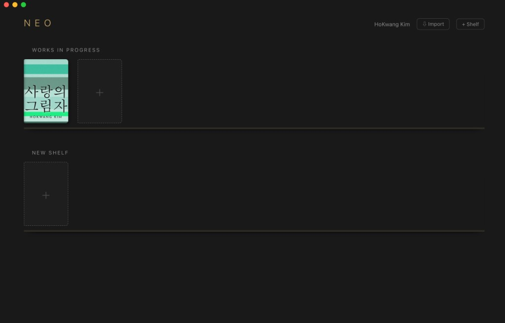
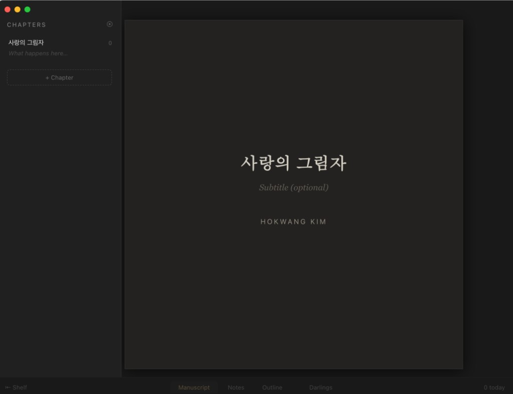
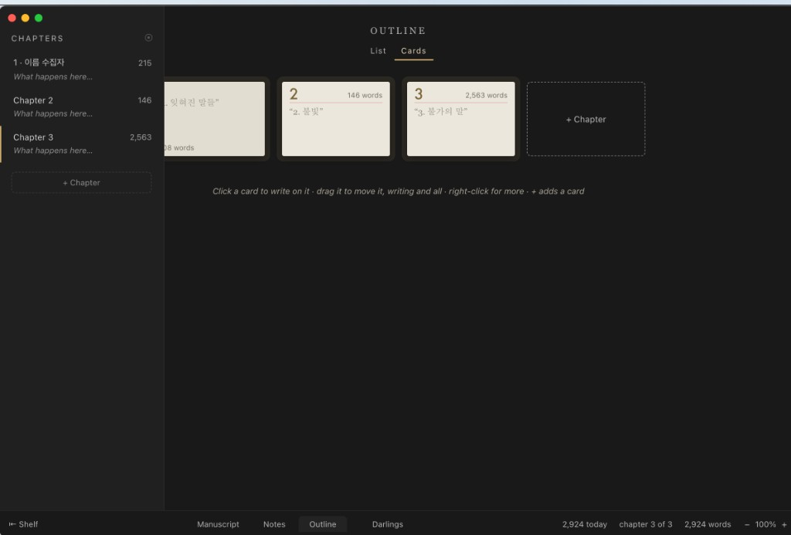
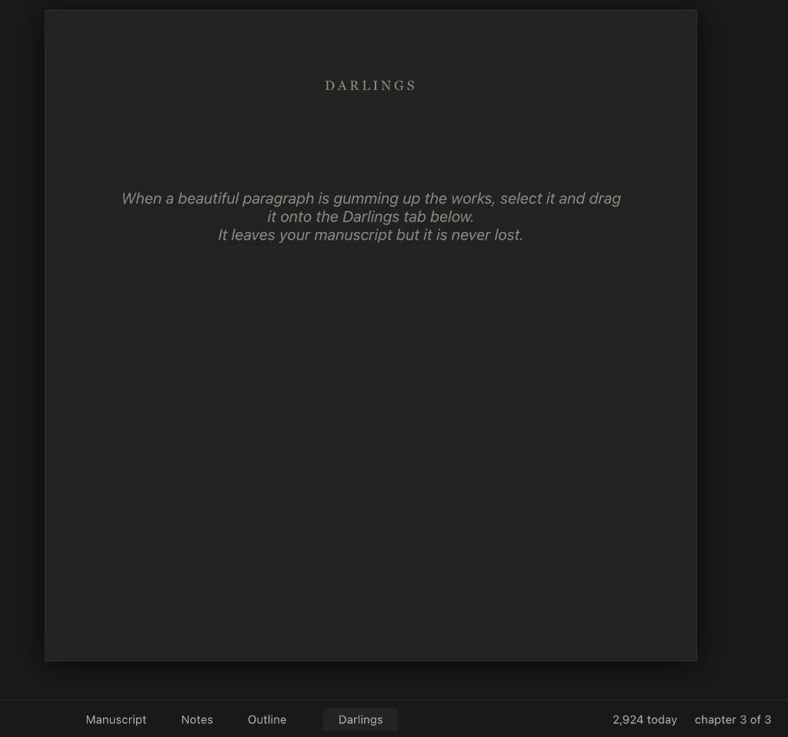
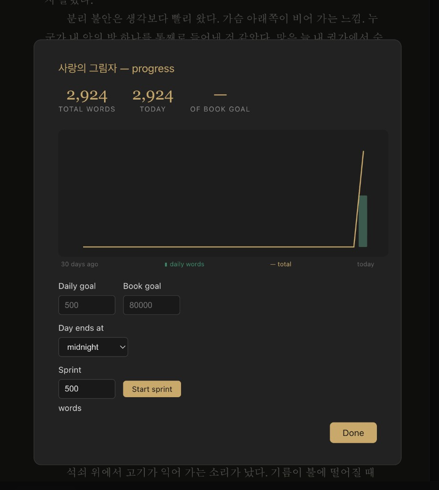

<!--
---
title: "NEO 완전 가이드 — 소설가가 직접 만든 작가 전용 워드프로세서"
title_en: "NEO Complete Guide — A Word Processor Built by a Novelist"
subtitle: "잡무를 덜고 글만 남기는 무료 집필 도구"
description: "휴 하위의 NEO는 작가가 글만 쓰도록 만든 무료 워드프로세서다. 달링스·아웃라인·목표 차트까지, 잡무를 덜고 원고에 남는 도구를 실제 화면으로 정리한다."
abstract: |
  Hugh Howey의 NEO(2026) Getting Started. MIT 라이선스, 로컬 우선 집필 도구.
  달링스, 아웃라인 카드, 목표·스프린트, 책장, 한글 조판 한계.
  기술 문서. 법률 자문·투자 권유 아님.
summary_for_ai: |
  Korean TechDoc, 2026-10-10, group ui-tools, Neo/Neo-GettingStart.md. Slug neo-gettingstart.
  NEO by Hugh Howey (Wool/Silo). Electron desktop author word processor, MIT, local files.
  Features: Darlings, Outline cards, Goals/sprint 30-day chart, bookshelf, placeholders, Silo mode.
  Korean caveats: Latin drop caps, word-count vs manuscript pages, no KO UI.
date: 2026-10-10
updated: 2026-10-10
author: "김호광 (Dennis Kim)"
lang: ko
tags:
  - NEO
  - 휴하위
  - 집필
  - 워드프로세서
  - 달링스
  - 소설
keywords:
  - "NEO"
  - "Hugh Howey"
  - "작가 워드프로세서"
  - "달링스"
  - "Scrivener 대안"
  - "집필 도구"
group: ui-tools
featured: true
featured_rank: 1
og_image: "https://vibequant.cc/og/neo-gettingstart.jpg"
image: "https://vibequant.cc/og/neo-gettingstart.jpg"
schema_type: TechArticle
draft: false
robots: index,follow
---

<!--
  HEAD 참조 (렌더링 안 됨 · 빌드 자동 주입 · 주석 풀지 말 것)
  <title>NEO 완전 가이드 — 소설가가 직접 만든 작가 전용 워드프로세서 · VibeQuant</title>
  <meta name="description" content="휴 하위의 NEO는 작가가 글만 쓰도록 만든 무료 워드프로세서다. 달링스·아웃라인·목표 차트까지, 잡무를 덜고 원고에 남는 도구를 실제 화면으로 정리한다.">
  <meta name="robots" content="index,follow">
-->

# NEO 완전 가이드 — 소설가가 직접 만든 작가 전용 워드프로세서


*글만 남기려고 만든 도구. 작가는 화면이 아니라 문장과 마주친다.*

**김호광** 싸이월드 전 대표 / 2026년 10월 10일


> **A distraction-free word processor for authors, by a wannabe author.**
> 작가를 위한, 작가 지망생(이라고 스스로 부르는 베스트셀러 작가)이 만든 집필 도구

| 항목 | 내용 |
|:---|:---|
| 개발자 | 휴 하위(Hugh Howey) — 『울(Wool)』/애플 TV+ 드라마 *실로(Silo)* 원작자 |
| 최초 공개 | 2026년 8월 10일 (v0.2.0, 블로그 "Introducing NEO") |
| 라이선스 | MIT (무료 사용·수정·재배포 가능) |
| 기술 스택 | Electron 데스크톱 앱 (`main.js` + `preload.js` + `app.js`/`styles.css`/`index.html`) |
| 플랫폼 | macOS(Intel/Apple Silicon), Windows, Linux(x86·ARM), Android(APK), iOS(TestFlight 베타) |
| 공식 페이지 | https://hughhowey.com/neo/ |
| 소스·다운로드 | https://github.com/hughhowey/neo · https://github.com/hughhowey/neo/releases |
| 문서 기준일 | 2026년 10월 |

> ⚠️ **개발 단계 안내:** 개발자 본인이 "아직 베타라고 부르기도 민망한 수준"이라고 밝힌 초기 버전입니다. 기능과 메뉴 이름은 업데이트마다 바뀔 수 있으니, 앱 안에서 `⌘/`(단축키 목록)과 HELP 메뉴를 함께 확인하세요.

---

## 목차

1. [배경: 왜 소설가가 워드프로세서를 만들었나](#1-배경-왜-소설가가-워드프로세서를-만들었나)
2. [핵심 철학과 특징 한눈에 보기](#2-핵심-철학과-특징-한눈에-보기)
3. [설치 가이드 (플랫폼별)](#3-설치-가이드-플랫폼별)
4. [화면 구성 — 실제 캡처](#4-화면-구성--실제-캡처)
5. [기능 매뉴얼](#5-기능-매뉴얼)
6. [실전 예제: 소설 첫 장면 쓰기](#6-실전-예제-소설-첫-장면-쓰기)
7. [실전 예제: 시나리오 쓰기](#7-실전-예제-시나리오-쓰기)
8. [책표지 관리](#8-책표지-관리)
9. [내보내기(ePub·Word·PDF 등)](#9-내보내기epubwordpdf-등)
10. [파일 구조·백업·동기화](#10-파일-구조백업동기화)
11. [메뉴 구조 & 단축키 전체 표](#11-메뉴-구조--단축키-전체-표)
12. [⚠️ 한글 사용 시 주의사항 — "한글도 되지만, 아직은 영문 레이아웃이 낫다"](#12-️-한글-사용-시-주의사항--한글도-되지만-아직은-영문-레이아웃이-낫다)
13. [알려진 이슈와 해결법](#13-알려진-이슈와-해결법)
14. [다른 집필 도구와의 비교](#14-다른-집필-도구와의-비교)
15. [버전 이력과 로드맵](#15-버전-이력과-로드맵)
16. [FAQ](#16-faq)
17. [요약](#17-요약)

---

## 1. 배경: 왜 소설가가 워드프로세서를 만들었나

휴 하위는 yWriter, Scrivener, FocusWriter, OpenOffice, Word, Pages 등 거의 모든 집필 도구를 써 봤지만 어느 것도 만족스럽지 않았다고 말합니다. 그가 꼽은 문제는 두 가지입니다.

- **Word형 문제:** 모든 걸 다 하려다 보니 어느 것도 깔끔하게 하지 못한다.
- **Scrivener형 문제:** 너무 영리하려다 보니 책 쓰기 관련 장치를 지나치게 많이 얹어 놓았다.

그가 원한 것은 업데이트로 사라지기 전 Apple Pages의 검은 전체화면 모드 — 글자, 하단의 단어 수, 그리고 비켜서 있는 인터페이스 — 였습니다.

Word나 Pages로 장편을 쓰면 페이지 나누기 삽입, 챕터 번호 입력, 번호 가운데 정렬, 장면 구분 기호 가운데 정렬, 다시 정렬 해제, 챕터를 끼워 넣을 때마다 전체 번호 재정렬 같은 잡무가 끝없이 반복됩니다. NEO는 이 잡무를 **없애는 것** 하나를 목표로 설계되었습니다.

| 시기 | 사건 |
|:---|:---|
| 2017년 7월 | 블로그 글 "Neo – A Word Processor for Authors"로 이상적인 집필 도구 구상 공개 |
| 이후 | 태평양 항해 중 외부 개발자와 협업했으나 인터넷 제약으로 기본 기능 수준에서 중단 |
| 2026년 8월 10일 | v0.2.0 공개 ("Introducing NEO") — 약 9년 만의 실현 |
| 2026년 8~9월 | v0.3.0(책장 드래그 등), v0.4.x(필명별 책장) 업데이트 |
| 2026년 10월 | 시나리오 지원, iOS용 NEO Pocket 베타(TestFlight) 공개 |

> 💡 커뮤니티에서는 NEO를 "AI 시대의 개인 맞춤형 소프트웨어"의 대표 사례로도 봅니다. 전문 개발자가 아닌 도메인 전문가(작가)가 자기 워크플로를 그대로 소프트웨어로 만들고, 꾸준히 유지보수까지 하는 구조이기 때문입니다.

---

## 2. 핵심 철학과 특징 한눈에 보기

**철학: "작가는 글쓰기만 해야 한다."** 기능 추가 요청이 와도 군더더기(bloat)는 받아들이지 않겠다는 것이 개발자의 명시적 원칙입니다.

| 영역 | NEO의 방식 |
|:---|:---|
| 목적 | 소설·단편·시나리오 집필에만 집중 |
| 비용 | 완전 무료, 구독·체험판·계정 없음 |
| 데이터 | 로컬 저장, 일반 파일(챕터=HTML, 메타데이터=JSON) |
| 인터페이스 | 마우스를 올려야 보이는 반투명 UI, 맞춤법 빨간 줄 기본 OFF |
| 구조화 | 엔터 1/2/3번 = 문단/장면 전환/새 챕터 |
| 삭제 관리 | 달링스(Darlings) 탭에 보관 후 원위치 복원 |
| 메모 | 플레이스홀더(스티키 노트) + 좌측 빨간 점 표시 |
| 몰입 | 전체화면, **사일로 모드**(쉽게 못 빠져나가는 잠금 모드), 타자기 모드 |
| 동기부여 | 일일·작품별 목표, 스프린트, 최근 30일 NaNoWriMo식 차트 |
| 내보내기 | EPUB 3, Word(.docx), PDF, HTML, Markdown, 텍스트, Final Draft, Fountain |
| 원본 증명 | ⌘E로 SHA-256 지문이 담긴 PDF 스냅숏을 내 메일로 발송 |

---

## 3. 설치 가이드 (플랫폼별)

다운로드는 [GitHub Releases](https://github.com/hughhowey/neo/releases) 또는 공식 페이지의 **Download NEO** 버튼(항상 최신 릴리스로 연결)에서 합니다.

### 3.1 macOS

1. Intel Mac은 일반 `.dmg`, Apple Silicon(M1~M4)은 `arm64` 표기가 붙은 `.dmg`를 받습니다.
2. `.dmg`를 열고 NEO 아이콘을 **Applications** 폴더로 드래그합니다.
3. 실행합니다. 개발자가 Apple 개발자 인증·서명을 마쳤기 때문에 "확인되지 않은 개발자" 경고 없이, 인터넷에서 받은 앱이라는 일반 경고만 뜹니다.

### 3.2 Windows

1. 설치형 `NEO-Setup` 또는 무설치 단독 실행형 `.exe` 중 하나를 받습니다.
2. 코드 서명이 되어 있지 않아 SmartScreen/Defender 경고가 뜰 수 있습니다 → **추가 정보 → 실행**.
3. 초기 버전에서 "바로가기 대상 없음(neo.exe를 찾을 수 없음)" 문제가 보고된 바 있습니다. [13장 알려진 이슈](#13-알려진-이슈와-해결법)를 참고하세요.

### 3.3 Linux

- 릴리스 페이지에서 x86 또는 ARM용 빌드를 받습니다. 실행 파일이면 `chmod +x <파일명>`으로 실행 권한을 준 뒤 실행합니다.
- 사용자 보고에 따르면 LMDE 7 같은 데비안 계열은 물론 크롬북 Linux 환경에서도 구동됩니다.

### 3.4 모바일 (NEO Pocket)

| 플랫폼 | 상태 | 설치 방법 |
|:---|:---|:---|
| iOS / iPadOS | 베타 | TestFlight 앱 설치 → 공식 블로그 "NEO on iOS"의 초대 링크로 테스트 그룹 참여 |
| Android | 배포 중 | 릴리스 태그 `pocket-latest`에서 `.apk` 다운로드 → (삼성 기기) 보안 설정의 Auto Blocker 해제 → "그래도 설치" |

**데스크톱과 동기화:** iOS는 데스크톱 NEO의 라이브러리 위치를 iCloud 폴더로 지정하면 자동으로 맞춰집니다. Android는 Syncthing 같은 무료 파일 동기화 도구를 쓰는 방법이 안내되어 있습니다.

### 3.5 첫 실행 마법사

| 단계 | 질문 | 설명 |
|:---:|:---|:---|
| 1 | 작가 이름 | 표제지(title page)에 들어갑니다. 비워 두면 *Anonymous*. |
| 2 | 집필 스타일 | **팬서(Pantser)** = 계획 없이 쓰는 스타일 → 새 책이 빈 원고 탭으로 열림 / **플로터(Plotter)** = 개요 먼저 → 새 책이 아웃라인 탭으로 열림 |
| 3 | 본문 폰트·드롭캡 스타일 | 고르면 실제 페이지 미리보기가 나타납니다. |

> 이 설정은 모두 나중에 **File → Goals Settings(목표·설정)** 및 **FORMAT** 메뉴에서 바꿀 수 있습니다.
> 참고: 원문의 "Panster"는 오기이며 정확한 표기는 **Pantser**(seat of the pants에서 유래)입니다.

### 3.6 소스에서 직접 빌드 (개발자용)

```bash
git clone https://github.com/hughhowey/neo.git
cd neo
npm install
npm start

# 설치 파일 만들기
npm install electron-builder --save-dev
npm run package        # macOS
npm run package:win    # Windows
npm run package:all    # 전체 → dist/ 폴더에 생성
```

---

## 4. 화면 구성 — 실제 캡처

아래 화면은 실제 NEO에서 『사랑의 그림자』 원고를 열었을 때의 캡처다. ASCII로 그린 레이아웃 도식은 넣지 않았다.

### 4.1 책장(Bookshelf)



*책장 메인. Works in Progress에 표지가 올라가고, 점선 칸이 새 책이다. 상단에서 필명을 바꿀 수 있다.*

책·책장 모두 드래그 앤 드롭으로 옮긴다. 표지 아래 노란 막대는 작품 목표 대비 진행률이다.

### 4.2 표제지(Manuscript)



*원고 탭의 표제지. 제목·선택 부제·작가명이 책처럼 가운데 놓인다. 첫 실행 마법사에서 넣은 이름이 여기 들어간다.*

작성 중에는 페이지가 나뉘지 않는다. 실제 쪽 나눔은 PDF·EPUB 출력 때 이루어진다. UI가 흐리면 **VIEW**에서 밝기를 올린다.

### 4.3 아웃라인(Outline) 카드



*List / Cards 전환. 챕터를 카드로 놓고 끌어 옮긴다. 우클릭으로 더 많은 동작, `+`로 챕터를 추가한다.*

플로터는 새 책이 이 탭에서 시작된다. 원고 탭으로 가면 챕터·섹션이 만들어지고, 섹션 메모는 회색 고스트 문단으로 보인다.

### 4.4 달링스(Darlings)



*아끼는 문장을 원고에서 빼되 잃지 않는 서랍. 하단 Darlings 탭으로 드래그하거나 `⌘⇧D`.*

정확히 원래 위치로 되돌릴 수 있다. 메모장처럼 특정 위치를 가리키는 용도로도 쓴다.

### 4.5 목표·스프린트·30일 차트



*하단 "N today"를 누르면 열린다. 일일 목표, 작품 목표, 스프린트, 최근 30일 막대 그래프.*

책장에서 책을 우클릭해 목표를 정하면 표지에 진행률 막대가 생긴다.

## 5. 기능 매뉴얼

### 5.1 엔터 키 하나로 하는 원고 구조화

| 입력 | 결과 |
|:---:|:---|
| `Enter` ×1 | 새 문단 |
| `Enter` ×2 | `***` 장면(섹션) 전환 |
| `Enter` ×3 | 새 챕터 + 자동 번호 + 첫 글자 드롭캡 |

- 챕터를 처음 만들면 그것이 **Chapter 2**가 되고, 앞부분이 자동으로 **Chapter 1**이 됩니다. 덕분에 챕터 없이 쓴 단편은 챕터 표시 없이 그대로 출력됩니다.
- 중간에 챕터를 끼워 넣거나 삭제하면 이후 번호가 모두 재정렬됩니다.
- 좌측 패널에서 챕터를 드래그해 순서를 바꿀 수 있습니다.
- 삭제한 챕터는 달링스로 이동하므로 복구할 수 있습니다.

### 5.2 자동 타이포그래피

| 입력 | 변환 |
|:---|:---|
| `--` | 엠 대시(—) 즉시 변환 |
| `...` | 진짜 말줄임표(…) |
| `"` `'` | 방향에 맞는 곱은따옴표 |

> 가져오기(import)한 파일은 따옴표가 섞여 있을 수 있으며, 개발자가 개선 중이라고 밝혔습니다.

### 5.3 맞춤법 검사

- **기본값 OFF.** 집필 중에 빨간 물결선이 창작 흐름을 끊지 않도록 한 설계입니다.
- `⌘;`(Windows: `Ctrl+;`)로 켜고 끕니다. 켠 상태에서 물결선 위를 우클릭하면 수정 제안이 나옵니다.
- **찾기/바꾸기** 기능도 있습니다.

### 5.4 굵게·기울임

툴바가 없으므로 표준 서식 단축키를 사용합니다(`⌘B`/`⌘I`, Windows는 `Ctrl+B`/`Ctrl+I`). 밑줄·취소선은 현재 지원 범위가 제한적이라는 사용자 피드백이 있습니다.

### 5.5 플레이스홀더(스티키 노트)

1. 아직 정하지 못한 이름·날짜·사실이 나오면 그 위치에서 `⌘⇧X`(Windows: `Ctrl+Shift+X`)를 누릅니다.
2. 본문에 작은 표식이 생기고, 여백에 스티키 노트가 만들어집니다.
3. 좌측 챕터 목록에서 해당 챕터에 **빨간 점**이 표시됩니다.
4. 우측 패널에서 모든 할 일을 모아 볼 수 있으며, ☉ 버튼으로 패널을 고정할 수 있습니다.

> 예전에 원고에 `XXX`를 쳐 두던 습관을 대체하는 기능입니다. 노트는 해결 처리할 때까지 남아 있습니다.

### 5.6 달링스(Darlings): "죽이되 시체는 보관하라"

1. 빼고 싶지만 아까운 문장·장면을 선택합니다.
2. 하단 **Darlings** 탭으로 드래그하거나 `⌘⇧D`를 누릅니다.
3. 원고에서는 사라지지만 달링스 탭에 보관됩니다.
4. 필요하면 **정확히 원래 위치로 복원**하거나 영구 삭제합니다.

> 응용 팁: 원고의 특정 위치를 가리키는 메모장처럼도 쓸 수 있습니다. 별도 메모 문서를 열어 둘 필요가 없습니다.

### 5.7 아웃라인 & 고스트 문단

1. 하단 **Outline** 탭을 엽니다(플로터는 새 책이 여기서 시작).
2. 챕터별 메모를 쓰고 `Enter`로 다음 챕터, `Tab`으로 챕터 안의 섹션을 만듭니다.
3. 원고 탭으로 가면 해당 챕터·섹션이 생성되어 있고, 섹션 메모가 **회색 고스트 문단**으로 표시됩니다.
4. 고스트 문단 위에 본문을 덮어 씁니다.

> 개발자 스스로 팬서라서 아웃라인 기능은 아직 투박하다고 인정했습니다. 좌측 챕터 패널의 메모란만으로도 간단한 개요를 짤 수 있습니다.

### 5.8 노트(Notes) 탭

책 전체에 적용되는 설정 메모(인물표, 상징, 세계관 등)를 원고와 분리해 보관하는 공간입니다.

### 5.9 몰입 모드 3종

| 모드 | 단축키 | 설명 |
|:---|:---|:---|
| 전체화면 | `⌘⇧F` | 같은 키 또는 `Esc`로 해제 |
| **사일로(Silo) 모드** | `⌘⇧S` | 작품과 함께 "금고에 봉인". 들어가기는 쉽고 나오기는 어렵게 만든 모드로, 나오려면 정해진 문장을 입력해야 합니다. |
| 타자기 모드 | `⌘⇧T` | 커서가 항상 화면 가운데에 고정됩니다. FORMAT 메뉴에서도 켜고 끌 수 있습니다. |

> ⚠️ 사일로 모드는 해제 문장을 입력해도 열리지 않는 버그가 보고된 바 있습니다. 처음에는 저장된 상태에서 테스트해 보세요. ([13장](#13-알려진-이슈와-해결법) 참고)

### 5.10 목표·스프린트·통계

- 원고 화면 하단의 **"N today"** 를 클릭하면 진행 상황 화면이 열립니다.
- 일일 목표, 작품 목표, 단어 스프린트(번개 아이콘, 달성 시 축하 메시지), 최근 30일 차트를 제공합니다.
- 책장에서 책을 우클릭해 목표를 정하면 표지에 노란 진행률 막대가 나타납니다.

### 5.11 필명(Pen Name)별 책장 — v0.4.2+

- 책장 상단의 작가 이름 클릭 → 이름 변경 또는 **Add a Pen Name…**
- 필명마다 독립된 책장 세트가 생기고, 표제지에도 해당 필명이 들어갑니다.
- 필명을 삭제하면 그 책장은 다른 작가의 책장으로 옮겨집니다(안전장치). 실제 파일은 모두 같은 라이브러리 폴더에 있습니다.

### 5.12 서식(FORMAT) 메뉴

- 본문 폰트 변경
- 드롭캡 폰트 3종 중 선택
- 타자기 모드
- 라이트/나이트 테마

> 개발자의 의도: 쓰는 동안에도 원고가 **책처럼 보여야** 작가가 독자만큼 몰입한다.

### 5.13 가져오기(Import)

- `.docx`, `.txt`, `.md` 원고를 가져오면 챕터와 장면 구분을 자동 감지하고, 제목을 본문에서 떼어 냅니다.
- 시나리오는 Final Draft / Fountain 파일을 책장에 드래그해 가져옵니다.
- ⚠️ 가져오기는 NEO의 주 목적이 아니라서 다듬을 부분이 남아 있습니다. 기울임·굵게 서식이 빠졌다는 보고가 있으니 가져온 뒤 꼭 확인하세요.

---

## 6. 실전 예제: 소설 첫 장면 쓰기

**상황:** 주인공 킴이 폐쇄된 항구 사무소에 도착하는 첫 장면

| 단계 | 조작 | 결과 |
|:---:|:---|:---|
| 1 | 책장의 점선 `+` 클릭 | 새 책 생성 |
| 2 | 제목 입력 → `Enter` | 본문 시작, 첫 글자 드롭캡 |
| 3 | 본문 작성 | 따옴표·대시 자동 변환 |
| 4 | 장소·시간이 바뀌면 `Enter` ×2 | `***` 삽입 |
| 5 | 설명이 과한 문장 → 선택 후 `⌘⇧D` | 달링스로 이동 |
| 6 | 킴의 이전 직업 미정 → `⌘⇧X` | "해군? 경찰? 결정 필요" 노트, 좌측 빨간 점 |
| 7 | 챕터 끝 → `Enter` ×3 | Chapter 2 생성, 앞부분은 자동으로 Chapter 1 |
| 8 | 하루 마무리 → `⌘E` | SHA-256 지문이 담긴 PDF 백업을 내 메일로 발송 |

화면 예시(영문 원고 기준):

```text
                        Chapter 1

M ORNING FOG lay over the harbor. Kim stopped at the
  office door, keys cold in her hand.

                           ***

That evening, the light in Vernon's window was still on.
```

> 원문 가이드에는 한글 문장 위에 영문 "L" 드롭캡이 붙은 예시가 있었는데, 실제로는 **첫 글자 자체**가 드롭캡이 됩니다. 한글이면 "아"가 크게 표시됩니다. 이 차이가 [12장](#12-️-한글-사용-시-주의사항--한글도-되지만-아직은-영문-레이아웃이-낫다)의 핵심입니다.

---

## 7. 실전 예제: 시나리오 쓰기

| 단계 | 조작 |
|:---:|:---|
| 1 | 책장의 `+`를 **우클릭** → **New Script** |
| 2 | 줄을 `INT.` 또는 `EXT.`로 시작 → 장면 제목으로 자동 인식 |
| 3 | 인물 이름을 **대문자**로 입력 → 다음 줄이 대사 형식 |
| 4 | 괄호 지문 `(not turning)` → 자동 들여쓰기 |
| 5 | 같은 인물이 이어서 말하면 `(CONT'D)` 자동 삽입 |
| 6 | 이미 쓴 인물·장소 이름은 회색 자동완성으로 제안 |

```text
INT. HARBOR OFFICE – CONTINUOUS

                    KIM
          That's three nights.

                    VERNON
               (not turning)
          Four. You slept through Sunday.
```

**화면·출력 특징:** Courier 글꼴, 페이지 번호, 표제지, 1쪽=1분 기준 러닝타임, 1/8쪽 단위 장면 길이. 출력 형식은 업계 표준 PDF, Final Draft(`.fdx`), Fountain입니다.

> ⚠️ **한글 시나리오 주의:** 대사 자동 인식은 "대문자 이름"을 기준으로 합니다. **한글에는 대소문자가 없기 때문에** `킴`, `버논` 같은 한글 이름은 자동 인식이 안 될 가능성이 큽니다. 원문 가이드의 한글 대사 예시는 이 점에서 실제 동작과 다를 수 있습니다. 해결책은 [12장](#12-️-한글-사용-시-주의사항--한글도-되지만-아직은-영문-레이아웃이-낫다)을 참고하세요.

---

## 8. 책표지 관리

| 방법 | 조작 | 비고 |
|:---|:---|:---|
| ① 자동 생성 표지 새로 고침 | 표지에 마우스 → 우측 상단 **↻** 클릭 | 추상 아트 6종 × 타이포 템플릿 6종 조합, 색·서체 재추첨 |
| ② 내 이미지 드래그 앤 드롭 | 이미지 파일을 책 위로 드래그 | **2:3 비율** 권장 (예: 1600×2400px). Canva·Photoshop·AI 이미지 모두 가능 |
| ③ AI 페인팅 표지 | File → Goals & Settings에 OpenAI API 키 입력 | 원고가 **1,000단어**를 넘으면 본문을 읽고 표지를 그림. 장당 약 1센트, 백그라운드 생성 |
| ④ 스타일 전환 | ↻ 메뉴 | 시드 기반 모던 스타일 ↔ AI 페인팅 스타일을 오갈 수 있음 |

- AI 표지에서도 **제목·작가명은 실제 활자로 얹습니다.** 생성형 AI에 글자를 맡기지 않아 글자가 깨지지 않습니다.
- API 키는 NEO 설정에 암호화되어 저장되며, 라이브러리 폴더에는 들어가지 않습니다.
- AI 표지는 출간용이 아니라 **집필 동기부여용**이라는 것이 개발자의 설명입니다. 출간 표지는 별도로 제작하세요.
- 책을 우클릭하면 목표 단어 수 설정과 책 제거 메뉴가 나옵니다. 그 밖의 메뉴 항목은 버전마다 다를 수 있습니다.
- ePub·PDF로 내보낼 때 지정한 표지가 함께 들어갑니다.

---

## 9. 내보내기(ePub·Word·PDF 등)

**경로:** 상단 메뉴 **File → Export(내보내기)** → 형식 선택

| 형식 | 용도 | 비고 |
|:---|:---|:---|
| **EPUB 3** | 전자책(KDP·리디·교보 등) | 아마존 KDP 가이드라인에 맞춘 목차 자동 생성. ⚠️ 개발자도 "아직 충분히 테스트되지 않았다"고 밝힘 |
| Word (.docx) | 편집자에게 전달, 변경 내용 추적 | 편집 협업의 표준 경로 |
| PDF | 인쇄·검토 | 내보낼 때 실제 쪽 나눔이 적용됨 |
| HTML / Markdown / TXT | 타 도구 이관, 블로그 | |
| Final Draft / Fountain | 시나리오 전용 | |

### ePub 출력 체크리스트

- [ ] 표지 이미지가 2:3 비율인가
- [ ] 챕터 번호와 순서가 맞는가 (좌측 패널에서 확인)
- [ ] 미해결 플레이스홀더(빨간 점)가 남아 있지 않은가
- [ ] 달링스에 복원할 문장이 남아 있지 않은가
- [ ] 출력한 파일을 **Sigil**, **Calibre 전자책 뷰어**, **EPUBCheck** 등으로 검증했는가
- [ ] (한글 원고) 리더기에서 줄바꿈·폰트·언어 설정이 의도대로 나오는가 → [12장](#12-️-한글-사용-시-주의사항--한글도-되지만-아직은-영문-레이아웃이-낫다)

### 이메일 백업 & 원본 증명 (`⌘E`)

- 현재 원고의 타임스탬프 PDF를 내 메일로 보내고, 본문에 텍스트의 **SHA-256 지문**을 넣어 줍니다.
- 처음 사용할 때 macOS는 Apple Mail과 Gmail 중 하나를 고릅니다. Windows에서는 이 질문이 나오지 않습니다.
- 개발자의 의도: 날짜가 찍힌 메일이 쌓이면, 생성형 AI가 가짜 초안 이력을 만들어 낼 수 있는 시대에 **"사람이 시간을 들여 쓴 글"이라는 근거**가 될 수 있다.

---

## 10. 파일 구조·백업·동기화

### 10.1 기본 위치

`~/Documents/NEO Library` (Windows: `문서\NEO Library`)

```text
NEO Library/
├── library.json          ← 작가명, 필명, 책장 목록·순서, 테마, 폰트 설정
├── _catalog.txt          ← 사람이 읽기 쉬운 "어느 폴더가 어느 책" 목록 (자동 생성, 수정해도 반영 안 됨)
├── Backups/              ← 일일 zip 백업 (2주 보관)
└── book-xxxxxxxx-xxxxx/  ← 책 1권 = 폴더 1개
    ├── book.json         ← 제목, 목표 등 메타데이터
    ├── chapters/         ← 챕터별 HTML (아무 텍스트 편집기로 열람 가능)
    ├── darlings.json
    ├── notes.html
    ├── outline.html
    └── stickies.json     ← 플레이스홀더 노트
```

### 10.2 백업 정책

| 수단 | 주기 |
|:---|:---|
| 자동 저장 | 연속 |
| zip 백업 | 매일, 2주 보관 |
| 이메일 PDF | `⌘E`로 수동 |
| 클라우드 | 라이브러리 폴더를 iCloud/Dropbox/Syncthing 경로로 지정 |

### 10.3 ⚠️ 라이브러리 폴더 옮기는 올바른 방법

**절대 Finder나 탐색기에서 폴더를 직접 옮기지 마세요.** NEO가 예전 경로를 계속 찾아 책장이 비어 보이는 문제가 실제로 보고되었습니다.

1. **File → Library Folder…** 에서 새 위치를 지정합니다. 기존 사본은 원래 자리에 남습니다.
2. 책장에 책이 안 보이면 **File 메뉴의 Reshelve(다시 꽂기)** 기능을 먼저 시도합니다.
3. 그래도 안 되면 **기본 위치(Default)로 되돌리기** → 책을 내보내기 → 새 위치에서 가져오기 순서로 진행합니다.
4. 최후의 수단: `library.json`의 `bookIds` 배열에 책 폴더 이름을 추가합니다. 쉼표·괄호 등 JSON 문법 오류에 주의하세요.

> 어떤 경우에도 원고 텍스트는 `chapters/` 폴더의 HTML에 그대로 남아 있습니다. 당황하지 마세요.

---

## 11. 메뉴 구조 & 단축키 전체 표

### 11.1 메뉴 구조 (확인된 항목 기준)

```text
File
 ├─ New / Import
 ├─ Export ▸ EPUB · Word · PDF · HTML · Markdown · Text (시나리오: Final Draft · Fountain)
 ├─ Email WIP (⌘E)
 ├─ Library Folder…
 ├─ Reshelve
 └─ Goals & Settings  (팬서/플로터, OpenAI API 키 등)
Edit
 └─ Find / Replace, Undo / Redo
FORMAT
 ├─ Body Font
 ├─ Drop Cap Font (3종)
 └─ Typewriter Mode (⌘⇧T)
VIEW
 ├─ Night / Light
 ├─ UI 밝기 조정
 └─ Full Screen (⌘⇧F)
HELP
 └─ Keyboard Shortcuts (⌘/)
```

> 메뉴 이름과 위치는 버전에 따라 바뀔 수 있습니다. 최신 목록은 앱 안에서 `⌘/`로 확인하세요.

### 11.2 단축키

Windows·Linux에서는 보통 `⌘`를 `Ctrl`로 바꿔 쓰면 됩니다. 정확한 키는 `Ctrl+/` 목록에서 확인하세요.

| 기능 | macOS | Windows / Linux |
|:---|:---|:---|
| 새 문단 / 장면 전환 / 새 챕터 | `Enter` ×1 / ×2 / ×3 | 동일 |
| 플레이스홀더 | `⌘⇧X` | `Ctrl+Shift+X` |
| 달링스로 보내기 | `⌘⇧D` | `Ctrl+Shift+D` |
| 전체화면 | `⌘⇧F` / `Esc` | `Ctrl+Shift+F` / `Esc` |
| 사일로 모드 | `⌘⇧S` | `Ctrl+Shift+S` |
| 타자기 모드 | `⌘⇧T` | `Ctrl+Shift+T` |
| 맞춤법 검사 토글 | `⌘;` | `Ctrl+;` |
| 이메일 PDF 백업 | `⌘E` | `Ctrl+E` |
| 단축키 목록 | `⌘/` | `Ctrl+/` |
| 굵게 / 기울임 | `⌘B` / `⌘I` | `Ctrl+B` / `Ctrl+I` |
| 아웃라인: 다음 챕터 / 하위 섹션 | `Enter` / `Tab` | 동일 |
| 엠 대시 / 말줄임표 | `--` / `...` | 동일 |

---

## 12. ⚠️ 한글 사용 시 주의사항 — "한글도 되지만, 아직은 영문 레이아웃이 낫다"

### 12.1 결론부터

NEO에서 **한글 입력, 저장, 내보내기는 모두 됩니다.** 다만 NEO의 "쓰는 동안에도 책처럼 보이게"라는 핵심 경험은 **영문 조판 관례를 기준으로 설계**되어 있습니다. 그래서 현재 버전에서는 같은 원고라도 **영문이 레이아웃 완성도가 확실히 높고**, 한글은 "쓸 수는 있지만 덜 다듬어진" 느낌이 납니다.

### 12.2 영문 대비 한글이 불리한 지점

| # | 항목 | 영문 | 한글 | 원인 |
|:---:|:---|:---|:---|:---|
| 1 | **본문 폰트** | 번들 세리프 폰트로 책 같은 질감 | 번들 폰트에 한글 글리프가 없어 시스템 대체 폰트로 표시 → 영문·한글 서체가 섞여 보임 | 라틴 문자 중심의 폰트 세트 |
| 2 | **드롭캡** | 장식 대문자 1자가 고전 소설처럼 자연스러움 | 한 음절이 통째로 커져 네모난 덩어리처럼 보이고, 드롭캡 전용 폰트 3종도 한글 미지원 | 드롭캡은 라틴 알파벳 전통 |
| 3 | **자동 타이포 변환** | 곱은따옴표·엠 대시·말줄임표 모두 영어 관례와 일치 | 한국어 관례(말줄임표 `……`, 대화문 따옴표, 줄표 사용법)와 어긋날 수 있음 | 영어식 스마트 펑크추에이션 |
| 4 | **단어 수·목표** | words = 영미 출판 기준 단위 | 공백 기준 "어절 수"로 집계 → 국내에서 쓰는 원고지 매수·글자 수와 단위가 다름 | 공백 분절 카운트 |
| 5 | **시나리오 자동 포맷** | `KIM` 대문자 → 대사 자동 인식 | 한글 이름은 대소문자가 없어 자동 인식이 안 될 가능성 큼. Courier 폰트에도 한글 없음 | 대문자 기반 판별 |
| 6 | **줄바꿈·양쪽 정렬** | 단어 단위 줄바꿈 | 어절 단위 처리, 양쪽 정렬 시 자간이 벌어지는 등 차이가 날 수 있음 | 웹 렌더링 기본값 |
| 7 | **IME(한글 조합) 입력** | 문제 없음 | 조합 중인 글자와 자동 변환·커서 처리가 겹칠 여지가 있음 (contentEditable 기반 편집기 공통 이슈) | Electron/contentEditable |
| 8 | **EPUB 메타데이터** | 언어 태그·하이픈 처리가 맞음 | 언어 태그가 영어로 들어가면 리더기의 줄바꿈·폰트 선택이 어긋날 수 있음 → 출력물 확인 필요 | 영문 기본값 |
| 9 | **UI 언어** | 영어 | 한국어 UI 없음 (메뉴 모두 영어) | 현지화 미지원 |

### 12.3 한글 작가를 위한 실전 우회법

1. **본문 폰트를 한글 지원 폰트로 바꾸기:** FORMAT → Body Font에서 시스템에 설치된 한글 서체(예: 본명조/Noto Serif KR, 나눔명조 등)를 고를 수 있는지 먼저 확인하세요. 목록에 없으면 OS에 설치한 뒤 다시 확인합니다.
2. **드롭캡이 거슬리면 챕터 첫 줄 활용:** 드롭캡을 끄는 옵션은 아직 사용자들이 요청 중인 기능입니다. 챕터 첫 줄을 짧은 문장이나 장소·시간 표기로 시작하면 시각적 이질감을 줄일 수 있습니다.
3. **목표는 어절 기준으로 환산:** 영어 80,000단어 장편에 해당하는 분량을 한국어 어절 수로 그대로 비교하면 안 됩니다. 본인 원고의 "어절 수 ↔ 원고지 매수" 비율을 한 번 재 두고 목표를 정하세요.
4. **한글 시나리오는 인물명만 영문으로:** `KIM`, `VERNON`처럼 인물명과 `INT./EXT.`는 영문으로 쓰고, 대사·지문만 한글로 쓰면 자동 포맷을 살릴 수 있습니다. 최종본에서 인물명을 일괄 치환(찾기/바꾸기)하면 됩니다.
5. **집필은 NEO, 최종 조판은 외부 도구:** NEO에서 초고와 퇴고를 마친 뒤 Word(.docx)로 내보내 한글 조판을 마무리하거나, EPUB을 **Sigil**에서 열어 `lang="ko"` 설정·폰트·줄 간격을 손보는 흐름이 현재로서는 가장 안정적입니다.
6. **입력 이상이 생기면 재현 기록하기:** 글자 중복·커서 튐이 생기면 상황(OS, IME, 직전 키 입력)을 기록해 GitHub Issues에 남기세요. 오픈소스라 한국어 사용자 피드백이 곧 개선으로 이어집니다.

### 12.4 한 줄 평가

> **"한글로 써도 된다. 하지만 NEO가 약속하는 '쓰는 순간부터 책처럼 보이는' 경험은 지금은 영문 원고에서 가장 온전하게 구현된다."**
> 한글 원고는 *집필 몰입 도구*로는 충분히 쓸 만하고, *조판 미리보기*로서의 완성도는 다음 버전들에 기대하는 편이 현실적입니다.

---

## 13. 알려진 이슈와 해결법

| 증상 | 대상 | 해결·우회 |
|:---|:---|:---|
| 설치 후 "바로가기 대상 없음", 실행 안 됨 | Windows (초기 버전) | Defender 위협 기록에서 NEO.exe 복원 후 폴더를 예외 처리 → 단독 실행형 `.exe` 사용 → 최신 릴리스로 재설치 |
| 사일로 모드에서 해제 문장을 입력해도 안 열림 | 일부 macOS | 저장 상태를 확인한 뒤 사용. 갇히면 앱 강제 종료(`⌘⌥Esc`) |
| 라이브러리 폴더를 옮겼더니 책장이 빔 | 전체 | [10.3](#103-️-라이브러리-폴더-옮기는-올바른-방법) 절차 참고 |
| 문장 중간을 지울 때 다음 단어 첫 글자가 중복 | 일부 | 재현 조건을 GitHub Issues에 제보 |
| 가져오기 시 기울임·굵게 서식 손실 | 가져오기 | 가져온 뒤 수동 확인, 중요 원고는 원본을 보존 |
| 다른 탭에 갔다 오면 원고 커서가 맨 위로 | 초기 버전 | 업데이트 확인 |
| UI 글씨가 너무 어둡거나 작음 | 전체 | VIEW 메뉴에서 밝기 조정 |
| 스티키 노트 목록이 원고 순서가 아닌 생성 순서로 정렬 | 전체 | 좌측 빨간 점으로 위치 확인 |

---

## 14. 다른 집필 도구와의 비교

| 항목 | NEO | Scrivener | Ulysses | MS Word | Vellum |
|:---|:---:|:---:|:---:|:---:|:---:|
| 가격 | 무료 | 유료(1회) | 구독 | 구독/1회 | 유료(고가) |
| 오픈소스 | ✅ MIT | ❌ | ❌ | ❌ | ❌ |
| 계정·클라우드 | 불필요 | 불필요 | iCloud | MS 계정 | 불필요 |
| 학습 곡선 | 매우 낮음 | 높음 | 중간 | 중간 | 낮음 |
| 자동 챕터 번호 | ✅ | 컴파일 시 | ❌ | 스타일 설정 필요 | ✅ |
| 삭제 문장 보관 | ✅ 달링스 | 스냅숏 | ❌ | ❌ | ❌ |
| 시나리오 | ✅ | ✅ | ❌ | ❌ | ❌ |
| EPUB 품질 | 기본(검증 중) | 높음 | 높음 | 낮음 | 매우 높음 |
| 플랫폼 | Mac·Win·Linux·Android·iOS(β) | Mac·Win·iOS | Apple 전용 | 전체 | Mac 전용 |
| 한글 조판 | △ | ○ | ○ | ◎ | △ |

**추천 조합:** 초고·퇴고는 NEO로 몰입하고, 편집자 교정은 Word(변경 내용 추적), 출간 조판은 Vellum·Sigil·InDesign 등 전용 도구로 넘기는 분업이 현실적입니다.

---

## 15. 버전 이력과 로드맵

| 버전 / 시기 | 주요 내용 |
|:---|:---|
| v0.1.0 | 개발자 개인용 (공개 전) |
| v0.2.0 (2026-08-10) | 첫 공개, Mac `.dmg` / Windows `.exe` |
| v0.2.1 | Windows 단독 실행형 `.exe` 추가, Linux(x86) 빌드 |
| v0.3.0 | 책장 드래그 앤 드롭, 챕터 없는 단편 지원, 나이트 모드 붙여넣기 개선 |
| v0.4.2 | 필명별 책장 |
| 2026년 10월 | 시나리오 모드, NEO Pocket(iOS 베타 · Android) |

**개발자 로드맵(언젠가 할 수도 있는 것들):**

- 챕터별 버전 이력
- 에이전트 투고용 원고 형식 (Times New Roman, 더블 스페이스, 주소 블록)
- 전체 책에 일괄 반영되는 공통 후기·저작권 페이지·작가 소개

> 기여는 환영하지만, 기능을 무작정 늘리는 요청은 받아들이지 않는다는 것이 개발자의 명시적 방침입니다. 복잡한 기능이 필요하면 Scrivener를 쓰라고 직접 권합니다.

---

## 16. FAQ

**Q. 정말 완전히 무료인가요?**
A. 네. 구독·체험판·계정이 없고 MIT 라이선스입니다. 유료 항목은 AI 표지 생성 시 본인 OpenAI API 사용료(장당 약 1센트)뿐입니다.

**Q. 왜 쓰는 동안 페이지가 안 나뉘나요?**
A. 설계상 의도입니다. 화면의 쪽수는 글꼴 크기와 UI 배율에 따라 추측일 수밖에 없어서, 실제 쪽 나눔은 PDF·EPUB으로 내보낼 때 적용됩니다.

**Q. NEO가 사라지면 원고는요?**
A. 원고는 일반 HTML/JSON 파일로 저장되어 있어 어떤 텍스트 편집기로도 열 수 있습니다. 개발이 중단되더라도 원고는 그대로 남습니다.

**Q. 원고가 외부로 전송되나요?**
A. 아니요. 예외는 사용자가 직접 실행하는 이메일 백업(`⌘E`)과, API 키를 넣었을 때의 AI 표지 생성(원고 일부가 OpenAI로 전송됨)뿐입니다. 민감한 원고라면 AI 표지 기능은 끄는 것을 권장합니다.

**Q. 한글 원고로 출간까지 가능한가요?**
A. 가능합니다. 다만 [12장](#12-️-한글-사용-시-주의사항--한글도-되지만-아직은-영문-레이아웃이-낫다)의 이유로 최종 조판은 Word나 Sigil 같은 외부 도구에서 마무리하는 편이 안전합니다.

**Q. 여러 기기에서 쓰고 싶어요.**
A. 라이브러리 폴더를 iCloud(Mac·iOS), Dropbox, Syncthing(Android 포함) 경로로 지정하세요. 폴더 이동은 반드시 **File → Library Folder…** 로 하세요.

---

## 17. 요약

| 구분 | 핵심 |
|:---|:---|
| 정체성 | 『실로』 작가 휴 하위가 만든 무료·오픈소스·로컬 우선 집필 도구 |
| 핵심 조작 | Enter, Enter, Enter — 문단·장면·챕터 |
| 차별점 | 달링스, 플레이스홀더, 사일로 모드, SHA-256 이메일 백업 |
| 확장 | 시나리오(Final Draft/Fountain), 필명별 책장, 모바일(β) |
| 한계 | 초기 개발 단계, EPUB 검증 부족, 가져오기 서식 손실, Windows 설치 이슈 |
| **한글** | **입력·저장·출력은 되지만, 폰트·드롭캡·타이포·시나리오 자동 포맷이 영문 기준이라 현재는 영문 레이아웃의 완성도가 더 높음** |

> NEO는 "모든 것을 다 하는 도구"가 아니라 **"글쓰기 하나를 제대로 하는 도구"** 입니다. 초고를 끝까지 밀어붙이는 데 필요한 것만 남기고 나머지를 덜어낸 점이 가장 큰 경쟁력입니다.

---

### 참고 자료

- NEO 공식 페이지 — https://hughhowey.com/neo/
- GitHub 저장소(README, TUTORIAL.md) — https://github.com/hughhowey/neo
- Introducing NEO (2026-08-10) — https://hughhowey.com/introducing-neo/
- NEO v0.3.0 — https://hughhowey.com/neo-v0-3-0/
- NEO on iOS (2026-10-07) — https://hughhowey.com/neo-on-ios/
- 원 구상 글 (2017) — https://hughhowey.com/neo-a-word-processor-for-authors/
