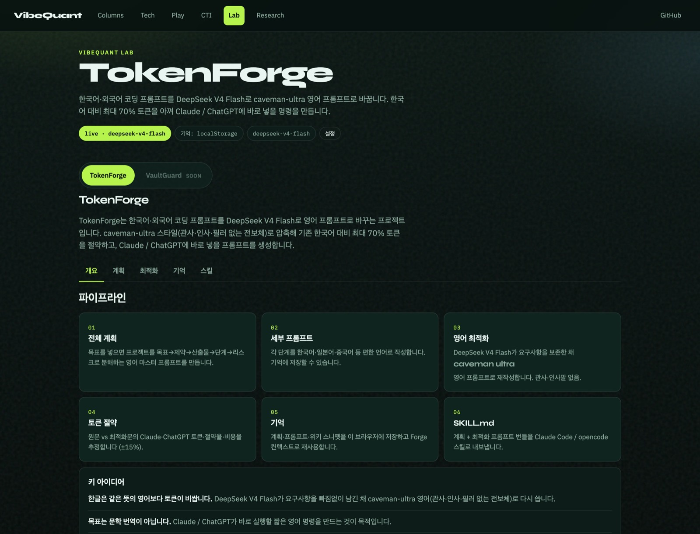
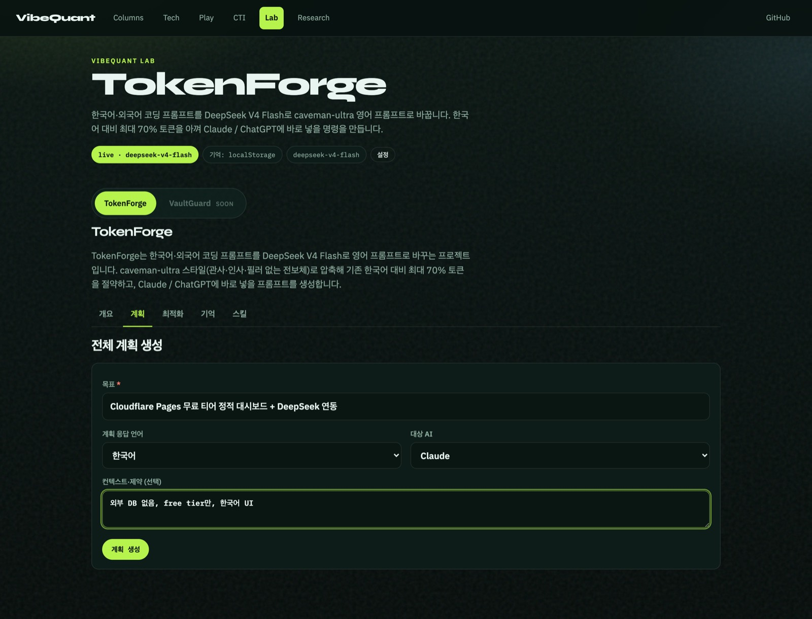
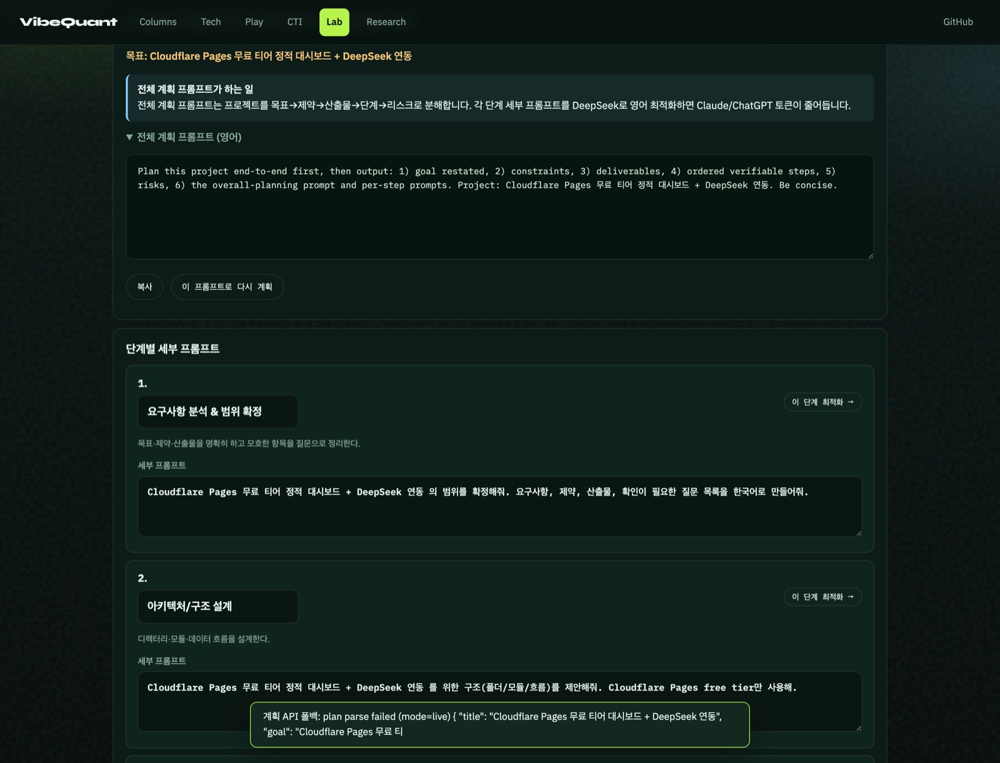
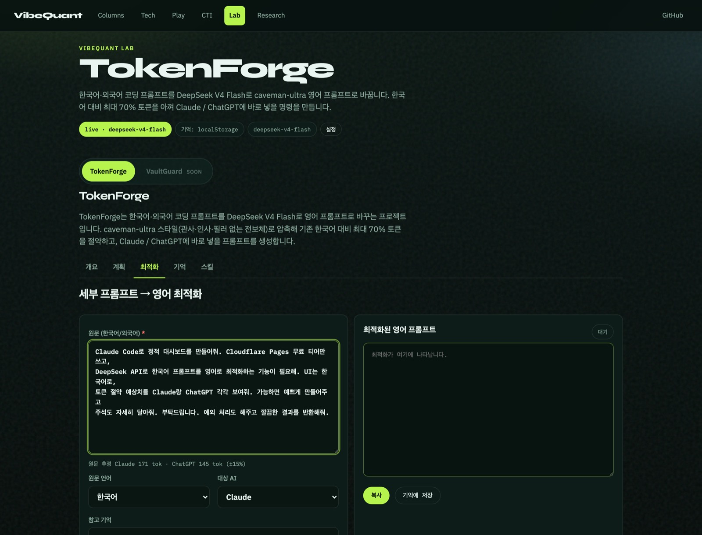
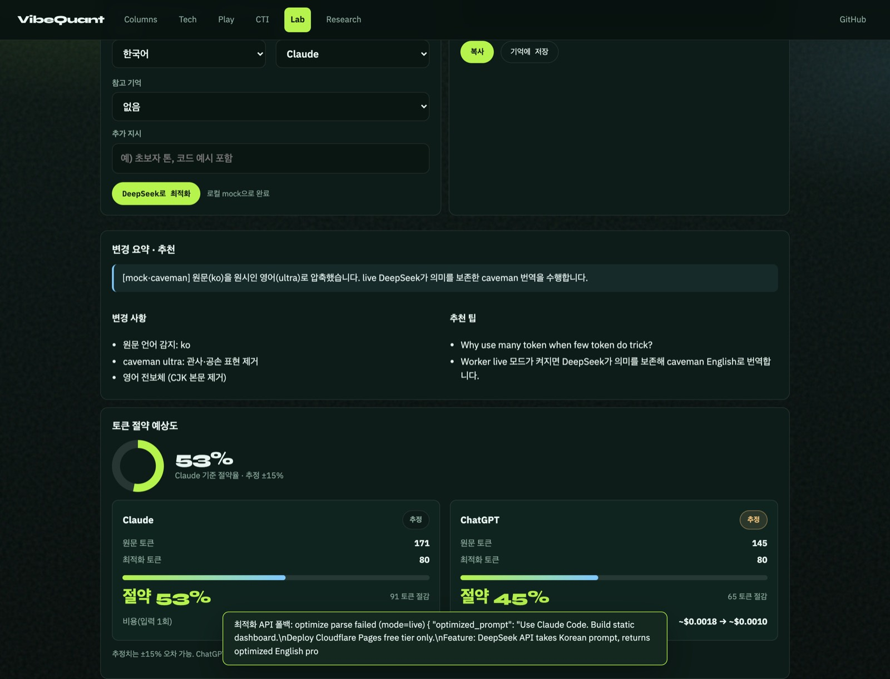

# TokenForge Lab 매뉴얼

> 라이브: [https://vibequant.cc/lab/](https://vibequant.cc/lab/)  
> 엔진 소스: [`TokenForge/`](https://github.com/gameworkerkim/vibe-investing/tree/main/TokenForge)  
> Lab HTML: [`VibeQuant/pages-lab/`](https://github.com/gameworkerkim/vibe-investing/tree/main/VibeQuant/pages-lab) → 배포 복사본 `VibeQuant/pages/lab/`

한국어·외국어로 코딩 프롬프트를 쓰고, DeepSeek V4 Flash가 **caveman-ultra 영어**로 바꿔 Claude / ChatGPT에 넣을 명령을 만듭니다. 한국어 대비 **최대 70%** 토큰을 아끼는 것이 목표입니다. 화면의 토큰·비용은 **추정 ±15%**입니다.

이 문서는 **컨셉 → 계획 수립 → 토큰 최적화** 세 구간만 다룹니다.

---

## 1. 컨셉

Lab을 열면 TokenForge가 기본 탭입니다. VaultGuard는 soon입니다.

### 무엇을 하는가

TokenForge는 번역기가 아닙니다. 한글(또는 다른 언어)로 적은 요구를, Claude / ChatGPT가 **바로 실행할 짧은 영어 명령**으로 다시 씁니다.

- **모델:** DeepSeek V4 Flash (Play Worker와 같은 `DEEPSEEK_API_KEY`, 금융 게이트 없음)
- **문체:** caveman-ultra — 관사·인사·필러 없는 전보체. 경로·코드·고유명사는 그대로
- **절감:** 한국어 원문 대비 최대 70%. 샘플 프롬프트 기준 Claude ~53%, ChatGPT ~45%

### 파이프라인 (6칸)

| 단계 | 하는 일 |
|---|---|
| 01 전체 계획 | 목표를 넣으면 목표→제약→산출물→단계→리스크로 분해한 영어 마스터 프롬프트를 만듭니다 |
| 02 세부 프롬프트 | 각 단계를 편한 언어로 작성하고 기억에 저장할 수 있습니다 |
| 03 영어 최적화 | DeepSeek가 요구를 보존한 채 caveman-ultra 영어로 재작성합니다 |
| 04 토큰 절약 | 원문 vs 최적화문의 Claude·ChatGPT 토큰·절약율·비용을 추정합니다 |
| 05 기억 | 이 브라우저 localStorage에 계획·프롬프트를 저장합니다 |
| 06 SKILL.md | 계획 + 최적화 번들을 Claude Code / opencode 스킬로 내보냅니다 |

개요 하단 **키 아이디어**가 위 내용을 세 문장으로 요약합니다. 바로 쓰려면 **계획부터 시작**, 이미 프롬프트가 있으면 **프롬프트만 최적화**, 샘플로 숫자를 보려면 **샘플로 절감 체험**을 누릅니다.

---

## 2. 계획 수립

서브탭 **계획**으로 이동합니다. 큰 작업을 한 번에 최적화하지 않고, 먼저 프로젝트를 단계로 쪼갭니다.

### 입력

| 필드 | 설명 |
|---|---|
| 목표 * | 한 줄로 무엇을 만들지. 예: `Cloudflare Pages 무료 티어 정적 대시보드 + DeepSeek 연동` |
| 계획 응답 언어 | 설명·단계 제목 언어 (한국어 / English / 日本語 / 中文) |
| 대상 AI | Claude 또는 ChatGPT — 이후 최적화 문체에 반영 |
| 컨텍스트·제약 | 선택. 예: `외부 DB 없음, free tier만, 한국어 UI` |

**계획 생성**을 누르면 Worker `POST /api/v1/tokenforge/plan`을 호출합니다. 키가 없거나 파싱에 실패하면 브라우저 mock으로 같은 화면을 채웁니다. DeepSeek 호출은 IP당 약 **12초** 간격입니다.

### 결과에서 볼 것

1. **전체 계획 프롬프트 (영어)**  
   목표→제약→산출물→단계→리스크로 분해하라고 적힌 마스터 프롬프트입니다. **복사**해 Claude에 바로 넣거나, **이 프롬프트로 다시 계획**으로 재생성할 수 있습니다.
2. **단계별 세부 프롬프트**  
   단계마다 한국어(또는 선택한 언어) 초안이 있습니다. **이 단계 최적화 →** 를 누르면 그 단계 원문이 최적화 탭으로 넘어갑니다.
3. **리스크 / 산출물**  
   계획이 놓친 제약과 산출물을 확인합니다.
4. **계획을 기억에 저장**  
   이 브라우저에만 남습니다. 서버 KV는 Lab에서 쓰지 않습니다.

계획까지가 “무엇을 어떤 순서로 시킬지”입니다. 토큰을 줄이는 작업은 다음 단계입니다.

---

## 3. 토큰 최적화

서브탭 **최적화**입니다. 왼쪽이 원문, 오른쪽이 caveman-ultra 영어입니다.

### 입력

1. 원문 칸에 한국어·일본어·중국어 등 코딩 프롬프트를 붙입니다.  
   개요의 **샘플로 절감 체험**을 누르면 위 스크린샷과 같은 샘플이 채워집니다.
2. 원문 아래에 **Claude · ChatGPT 토큰 추정**이 실시간으로 바뀝니다.
3. 원문 언어(자동 감지 가능), 대상 AI, 참고 기억, 추가 지시를 고릅니다.
4. **DeepSeek로 최적화**를 누릅니다.

### 결과에서 볼 것

- **최적화된 영어 프롬프트** — 관사·존댓말·필러가 빠진 명령형. **복사**해 Claude / ChatGPT에 붙입니다. **기억에 저장**으로 재사용할 수 있습니다.
- **변경 요약 · 추천** — 무엇을 줄였는지, 다음에 원문에 보태면 좋은지를 한국어로 적습니다.
- **토큰 절약 예상도** — 고리 숫자는 Claude 기준 절약율입니다. 카드는 모델별 원문→최적화 토큰과 입력 비용 추정입니다.

스크린샷 샘플(한국어 대시보드 요청) 기준:

| 대상 | 원문 | 최적화 | 절약 |
|---|---:|---:|---:|
| Claude | 171 tok | 80 tok | **53%** |
| ChatGPT | 145 tok | 80 tok | **45%** |

긴 존댓말·중복 요청이 많을수록 절약율이 커지고, 이미 짧은 영어면 거의 안 줄어듭니다. **최대 70%**는 한국어 장문 기준 상한입니다.

Worker live가 아니면 화면이 `로컬 mock으로 완료`로 떨어져도, mock은 한글을 영어 래퍼에 남기지 않고 실제로 토큰을 줄입니다.

---

## 자주 하는 실수

- Lab 루트로 `TokenForge/` 폴더를 Cloudflare에 올리면 `vibequant.cc/lab/`이 바뀌지 않습니다. Apex Lab은 **`VibeQuant/pages/lab/`** 입니다.
- 계획 직후 바로 최적화를 누르면 12초 쿨다운에 걸릴 수 있습니다. 잠깐 기다렸다가 다시 누르세요.
- 토큰 숫자는 청구서가 아닙니다. ±15% 추정입니다.

다음 단계(기억, SKILL.md보내기)는 개요 파이프라인 05–06과 [`readme.md`](../readme.md)를 보면 됩니다.
