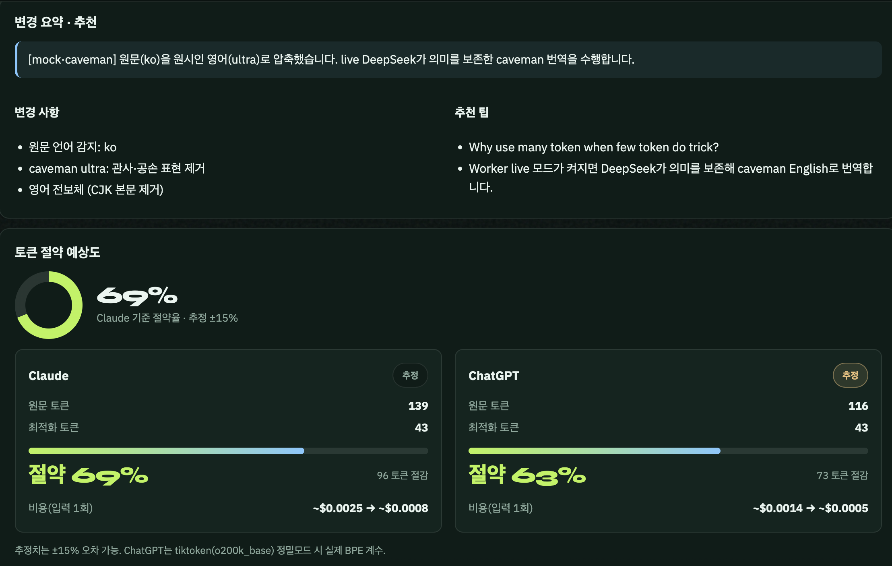

# TokenForge — 한국어로 쓰고, 최적화된 영어 토큰으로 실행하기

> 한국어·일본어·중국어 등으로 쓴 코딩 프롬프트를 **DeepSeek V4 Flash**(무료 티어)를 이용해 **caveman-ultra 영어**로 다시 씁니다.
> 결과를 **Claude / ChatGPT**에 그대로 붙여 넣으면, 한국어 원문 대비 **최대 70%** 토큰이 절약됩니다.
> Cloudflare Pages **free tier**만으로 돌아가는 웹 변환기 + 스킬 빌더입니다.

- **바로 써 보기**: https://vibequant.cc/lab/ (VibeQuant Lab · TokenForge 기본 탭)
- **화면 매뉴얼(스크린샷 포함)**: [`docs/LAB_MANUAL.md`](docs/LAB_MANUAL.md)
- **엔진 소스**: 이 폴더 (`TokenForge/`) — 메인 `vibe-investing` 레포의 서브 프로젝트이며 독립 실행됩니다
- **영어 문체의 출처**: [JuliusBrussee/caveman](https://github.com/JuliusBrussee/caveman) ultra 스타일 — *"Why use many token when few token do trick?"*
- **배경 리서치 / 로드맵**: [`docs/RESEARCH.md`](docs/RESEARCH.md), [`docs/PHASE2_WIKI.md`](docs/PHASE2_WIKI.md)

---

## 1. 이 프로젝트가 풀려는 문제

Claude Code나 ChatGPT 같은 코딩 에이전트에 한국어로 명령을 내리면 같은 내용의 영어보다 토큰이 거의 두 배 이상 소모됩니다. LLM이 영어 중심으로 만들어졌기 때문입니다. 게다가 우리가 쓰는 프롬프트의 50~70%는 인사말, 존댓말, 관사, 반복 같은 군더더기입니다. 비영어권 개발자는 **더 비싸게, 더 빨리 컨텍스트를 소진하며** 같은 일을 시키고 있는 셈입니다.

TokenForge는 "한국어로 생각하고 → 영어로 최적화한다"는 흐름을 하나의 워크플로로 묶습니다. 번역, 토큰 압축, 품질(요구사항) 보존을 한 번에 처리하고, 절약된 토큰과 비용을 숫자로 보여 줍니다.

## 2. 실제로 얼마나 줄어드나?

Lab에 붙여 넣는 순간 원문의 Claude·ChatGPT 토큰이 실시간으로 추정되고, 최적화를 누르면 모델별 절약율과 입력 비용까지 계산됩니다.



| 샘플 | 대상 | 원문 | 최적화 | 절약 | 입력 1회 비용 |
|---|---|---|---|---|---|
| 한국어 대시보드 요청 (매뉴얼 기본 샘플) | Claude | 171 tok | 80 tok | **53%** | — |
| | ChatGPT | 145 tok | 80 tok | **45%** | — |
| 한국어 대시보드 요청 + 요구사항·제약·산출물·질문 목록 | Claude | 139 tok | 43 tok | **69%** | ~$0.0025 → ~$0.0008 |
| | ChatGPT | 116 tok | 43 tok | **63%** | ~$0.0014 → ~$0.0005 |

절약율은 원문의 성격에 따라 달라집니다. 존댓말과 중복 요청이 많은 한국어 장문일수록 크게 줄고, 이미 짧은 영어라면 거의 줄지 않습니다. **70%는 한국어 장문 기준 상한**입니다. 토큰 수치는 ±15% 오차가 있는 추정치이며, ChatGPT는 정밀모드에서 실제 `o200k_base` 토크나이저(tiktoken)로 계수합니다.

줄이는 것은 **문체뿐**입니다. 관사, 인사, 필러, ROLE/TASK 보일러플레이트는 빼지만 요구사항, 경로, 코드, 고유명사는 byte-perfect로 보존합니다. 과도한 압축이 품질을 해치지 않도록 의미 보존을 최우선으로 설계했습니다.

## 3. 주요 기능

### 3.1 전체 계획 프롬프트 생성
목표 한 줄과 제약 조건을 넣으면 DeepSeek가 프로젝트를 **목표 → 제약 → 산출물 → 단계 → 리스크**로 분해한 영어 마스터 프롬프트를 만들고, 분해 원리를 한국어로 설명합니다. 계획 응답 언어(한국어/English/日本語/中文)와 대상 AI(Claude/ChatGPT)를 선택할 수 있으며, 대상 AI는 이후 최적화 문체에 반영됩니다.

### 3.2 단계별 세부 프롬프트 작성
계획의 각 단계마다 선택한 언어로 초안이 생성됩니다. 편한 언어로 자유롭게 고쳐 쓰고, 단계 옆의 **이 단계 최적화 →** 버튼 하나로 최적화 탭에 넘길 수 있습니다. 큰 작업을 한 번에 최적화하지 않고 단계별로 쪼개서 다루는 것이 핵심입니다.

### 3.3 DeepSeek caveman-ultra 영어 최적화
원문 언어를 자동 감지하고, 대상 모델에 맞춘 명령형 영어로 재작성합니다. 결과와 함께 **변경 요약**(무엇을 줄였는지)과 **추천 팁**(다음에 원문에 보태면 좋은 것)을 한국어로 돌려줍니다.

### 3.4 토큰 절약 예상도
원문과 최적화문의 토큰 수, 절약율, 입력 비용을 Claude와 ChatGPT 각각 카드로 표시합니다. 기본은 임베디드 추정기이고, ChatGPT는 `gpt-tokenizer`(CDN) 정밀모드를 켤 수 있습니다.

### 3.5 기억(Memory)
계획, 세부 프롬프트, 최적화 결과를 저장해 두고 다음 최적화 때 참고 기억으로 불러옵니다. 독립 앱은 Cloudflare KV(기본) 또는 Upstash Redis(옵션), 미구성 시 브라우저 localStorage로 폴백합니다. vibequant.cc Lab은 서버 저장소를 쓰지 않고 **브라우저 localStorage에만** 남깁니다.

### 3.6 SKILL.md 스킬 빌더
계획 + 최적화 프롬프트 번들을 **Claude Code / opencode 스킬 포맷(SKILL.md)**으로 생성해 다운로드합니다. 한 번 만든 최적화 프롬프트를 에이전트 스킬로 재사용할 수 있습니다.

### 3.7 mock / live 듀얼 모드
DeepSeek 키가 없어도 **mock 모드**로 전체 UI를 체험할 수 있습니다. mock도 한글을 영어 래퍼에 남기지 않고 실제로 토큰을 줄이며, 이는 `tests/savings.test.ts`가 검증합니다. 키가 설정되면 자동으로 live 모드가 되어 DeepSeek가 의미를 보존한 caveman 번역을 수행합니다.

## 4. 사용 방법 (요약 매뉴얼)

자세한 화면 설명과 스크린샷은 [`docs/LAB_MANUAL.md`](docs/LAB_MANUAL.md)를 보세요. 흐름만 짚으면 다음과 같습니다.

**개요** 탭에서 세 가지 진입점 중 하나를 고릅니다. 처음이면 **계획부터 시작**, 이미 프롬프트가 있으면 **프롬프트만 최적화**, 숫자부터 보고 싶으면 **샘플로 절감 체험**입니다.

**계획** 탭에서 목표를 한 줄 적고(예: `Cloudflare Pages 무료 티어 정적 대시보드 + DeepSeek 연동`), 응답 언어와 대상 AI를 고른 뒤 **계획 생성**을 누릅니다. 영어 마스터 프롬프트와 단계별 초안, 리스크/산출물이 나옵니다. 마음에 들면 **계획을 기억에 저장**합니다.

**최적화** 탭에서 왼쪽에 원문을 붙여 넣습니다. 아래에 원문 토큰 추정이 실시간으로 뜹니다. 원문 언어, 대상 AI, 참고 기억, 추가 지시를 고르고 **DeepSeek로 최적화**를 누르면 오른쪽에 caveman-ultra 영어가 나타납니다. **복사**해서 Claude/ChatGPT에 붙이거나 **기억에 저장**합니다.

**기억** 탭에서 저장한 계획·프롬프트를 검색하고, **스킬** 탭에서 SKILL.md로 내보냅니다.

두 가지만 주의하세요. Lab의 DeepSeek 호출은 API 남용 방지를 위해 **IP당 약 12초 간격**으로 제한되므로 계획 직후 바로 최적화를 누르면 쿨다운에 걸릴 수 있습니다. 그리고 `vibequant.cc/lab/`의 실제 배포 경로는 `TokenForge/`가 아니라 **`VibeQuant/pages/lab/`**입니다.

## 5. 빠른 시작 (로컬, 키 없이 mock 가능)

```bash
npm install
npm run dev        # wrangler pages dev → http://127.0.0.1:8788
```

DeepSeek 키가 없어도 mock 모드로 계획/최적화 UI를 바로 체험할 수 있습니다. 키가 있으면 대시보드의 `⚙️ 설정`에 입력하거나 `.dev.vars`/시크릿으로 설정하세요. 설정 화면에서 API 키, base URL, 모델, 가격, 토큰 정밀도를 바꿀 수 있습니다.

## 6. 배포 (Cloudflare Pages free tier)

```bash
npx wrangler kv namespace create TOKENFORGE_MEMORY   # KV 생성
# wrangler.toml 의 [[kv_namespaces]].id 를 반환값으로 교체
npx wrangler pages secret put DEEPSEEK_API_KEY        # 선택 (없으면 BYOK/mock)
npm run deploy
```

| 항목 | 비용 | 비고 |
|------|------|------|
| Pages 정적 + Functions | 무료 | 무료 한도 내 |
| KV 기억 | 무료 티어 100k 읽기/1k 쓰기/일 | 개인 사용 충분, 초과 시 Upstash |
| DeepSeek API | 무료/유료 tier 선택 | 키 없으면 mock |

vibequant.cc Lab(Worker)은 `cd VibeQuant/cloudflare && ./scripts/deploy.sh`로 배포합니다.

## 7. 기술 스택

- **프론트**: vanilla HTML/CSS/JS (빌드 불필요) — Cloudflare Pages가 정적 서빙
- **API**: Pages Functions (`functions/api/*`) — DeepSeek 프록시(키는 서버 시크릿 또는 클라이언트 헤더) + 기억 CRUD
- **기억**: Cloudflare KV `TF_MEMORY` (기본) / Upstash Redis REST (옵션) / localStorage (폴백)
- **LLM**: DeepSeek (OpenAI 호환), 기본 모델 `deepseek-v4-flash`, 환경변수로 변경 가능
- **토큰 계수**: 임베디드 휴리스틱 + `gpt-tokenizer`(CDN) 정밀 계수
- **테스트**: vitest **25 tests** + `tsc --noEmit`

```bash
npm run typecheck   # tsc --noEmit
npm test            # vitest run
```

## 8. 환경 변수 (`wrangler.toml` · `.dev.vars`)

| 변수 | 기본 | 설명 |
|------|------|------|
| `DEEPSEEK_API_KEY` | — | DeepSeek 키 (없으면 mock/live 판정은 자동) |
| `DEEPSEEK_BASE_URL` | `https://api.deepseek.com` | OpenAI 호환 베이스 |
| `DEEPSEEK_MODEL` | `deepseek-v4-flash` | 모델명 (구버전 `deepseek-chat`) |
| `UPSTASH_REDIS_REST_URL` / `_TOKEN` | — | 설정 시 KV 대신 Upstash 기억 |
| `NEON_DATABASE_URL` | — | (Phase 2 예정) Neon Postgres |

## 9. API

### Pages Functions (독립 앱 `TokenForge/`)

| 메서드 | 경로 | 동작 |
|--------|------|------|
| GET | `/api/health` | 모드(live/mock) · 저장소 · 모델 |
| POST | `/api/plan` | 전체 계획 프롬프트 + 단계 생성 |
| POST | `/api/optimize` | 한국어/외국어 → caveman-ultra 영어 + 추천 |
| GET/POST/DELETE | `/api/memory` | 기억 조회(검색) / 저장 / 삭제 |

요청 헤더 `x-deepseek-key`로 클라이언트 키(BYOK)를 전달할 수 있습니다.

### VibeQuant Worker (Lab · `api.vibequant.cc`)

Play와 같은 `DEEPSEEK_API_KEY`를 쓰지만 **금융 게이트가 없습니다**(코딩 프롬프트 변환기). IP 쿨다운 약 12초. Lab 기억은 브라우저 localStorage (`backend: none`).

| 메서드 | 경로 | 동작 |
|--------|------|------|
| GET | `/api/v1/tokenforge/health` | `mode` live/mock · DeepSeek 설정 여부 |
| POST | `/api/v1/tokenforge/plan` | 전체 계획 |
| POST | `/api/v1/tokenforge/optimize` | caveman-ultra 영어 최적화 |
| GET/POST/DELETE | `/api/v1/tokenforge/memory` | Worker는 저장소 없음 — Lab이 localStorage 사용 |

Worker가 배포되지 않은 상태에서는 Lab UI가 클라이언트 mock으로 폴백합니다.

## 10. 로드맵

- [x] **Phase 1**: 번역 + 토큰 최적화 변환기, 기억, mock/live 듀얼 모드, 스킬 빌더
- [x] **Lab 대시보드**: vibequant.cc/lab TokenForge 기본 탭. 소스 `VibeQuant/pages-lab/` → 배포 복사본 `VibeQuant/pages/lab/`
- [x] **Worker API**: `GET/POST /api/v1/tokenforge/*` — Play DeepSeek 키 재사용, 금융 게이트 없음
- [x] **Caveman ultra**: 관사·인사·ROLE/TASK 보일러플레이트 없는 전보체. mock도 CJK를 영어 래퍼에 남기지 않음 (`shared/mock.ts`)
- [ ] Phase 1.5: 다중 프롬프트 일괄 최적화, 계획 단계 ↔ 최적화 결과 바인딩 자동화
- [ ] **Phase 2 (WIKI+RAG)**: 프로젝트 전반 WIKI(Neon Postgres) → 임베딩 → 유사도 검색으로 프롬프트 개선·추천 — [`docs/PHASE2_WIKI.md`](docs/PHASE2_WIKI.md)
- [ ] 개인화: 자주 쓰는 스타일·용어 학습, 사용 이력 기반 추천
- [ ] 공개: 오픈소스 커뮤니티 WIKI
- [ ] Lab 탭: VaultGuard · MY-IP (곧)

## 주의

- 토큰 수치는 **예상치**(±15%)이며 실제 토크나이저와 다를 수 있습니다. ChatGPT는 정밀모드에서 실제 `o200k_base`를 사용합니다.
- 과도한 압축은 품질을 해칠 수 있어 **의미 보존**을 최우선으로 합니다. caveman은 문체(관사·공손·필러)만 줄이고 요구사항·경로·코드는 그대로 둡니다.
- 본 프로젝트는 연구 목적입니다.
