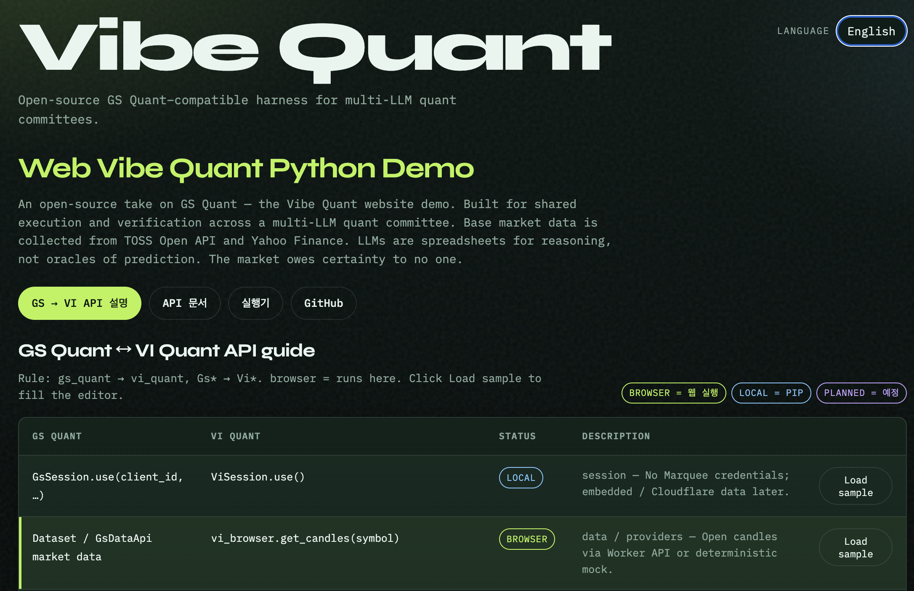
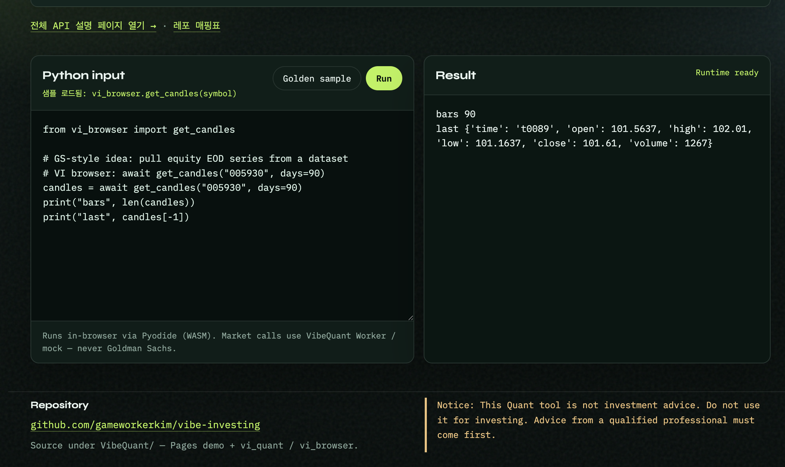

# VibeQuant

An open-source take on [GS Quant](https://github.com/goldmansachs/gs-quant) — the Vibe Quant website demo. Built for shared execution and verification across a multi-LLM quant committee. Base market data is collected from TOSS Open API and Yahoo Finance. 

*LLMs are spreadsheets for reasoning, not oracles of prediction. The market owes certainty to no one.*

Trust here is not oracle-level forecast accuracy. It comes from **open-source contribution** and a **Python-verifiable quant workflow** you can reproduce yourself (`gs_quant` → `vi_quant`, `Gs*` → `Vi*`).

Product split (normative):

| Concern | Where it runs | Why |
|---|---|---|
| Market data (quotes, candles, assets) | **Cloudflare** (Workers + Pages + D1 + R2 + CDN) | Single platform, free-tier first |
| Quant computation (scripts, timeseries, backtests) | **Browser Python via Pyodide (WASM)** | Workers cannot run full Python/`vi_quant`; no server-side `exec` |

> **Naming:** every `Gs*` symbol becomes `Vi*` (Vibe Investing).
> `gs_quant` → `vi_quant`, `GsSession` → `ViSession`, `GsDataApi` → `ViDataApi`.
> Full map: [docs/API_MAPPING.md](docs/API_MAPPING.md).

## Explicit goals

1. **GS Quant replacement (API-level):** same modules / signatures (`Gs`→`Vi`), open data and
   open engines instead of Marquee. **Not** numerically identical to Goldman Sachs models.
2. **Dashboard script verification:** user enters a Python quant script in a webview; the
   browser (Pyodide) executes it against Cloudflare-served market data; charts/tables/stdout
   are shown for verification.
3. **Cloudflare Free tier first:** deploy data + UI without Vercel / Neon / Upstash.
   Features that do not fit free-tier or WASM limits are **documented as unavailable**, not
   silently promised.

Korean docs: [README_KR.md](README_KR.md) · [ROADMAP_KR.md](ROADMAP_KR.md).

## Compatibility notice (cold)

| Claim | Reality |
|---|---|
| API-compatible with GS Quant | Target for a **subset** of public APIs. Many vendored symbols are stubs or crash today. |
| Same numbers as GS / Marquee | **Never promised.** Different data and models. |
| Full `vi_quant` in the browser | **No.** Only a thin WASM-safe subset (`vi_browser` / selected timeseries). |
| Server runs user Python | **No.** Arbitrary server-side Python is out of scope (security + Workers limits). |
| Free-tier = unlimited ingest | **No.** See [Limitations](docs/LIMITATIONS.md). |

## Target architecture

```
┌─────────────────────────── Cloudflare Free ───────────────────────────┐
│  Pages (dashboard webview + Pyodide)                                   │
│       │ fetch market JSON                                              │
│       ▼                                                                │
│  Worker (Hono) ── Cache API ── D1 (meta / index) ── R2 (candle body)   │
│       │                                                                │
│  Cron (≤1/day) ── Yahoo ingest for small watchlist → R2 + D1           │
└────────────────────────────────────────────────────────────────────────┘
        ▲
        │ optional: local pip vi_quant for heavy research (not the dashboard path)
```

Details: [docs/ARCHITECTURE_TARGET.md](docs/ARCHITECTURE_TARGET.md) ·
honest constraints: [docs/LIMITATIONS.md](docs/LIMITATIONS.md).

**Legacy note:** `backend/` (Express + Vercel/Neon/Upstash) and local `vi_quant/providers/`
remain as transitional code. New work targets Cloudflare + Pyodide. Do not expand the
multi-SaaS path.

## Cloudflare Free tier — what works / what does not

| Capability | Free tier | Notes |
|---|---|---|
| Pages static dashboard + Pyodide UI | Yes | Primary UI path |
| Worker REST for candles/assets | Yes (budget) | 100k req/day, **10 ms CPU**/invocation |
| D1 meta + R2 candle objects | Yes | Candles live in **R2**; D1 holds indexes only |
| CDN / Cache API | Yes | Hot responses |
| Cron ingest | Limited | **10 ms CPU** per cron — small watchlist, daily, or lazy-on-read |
| Durable Objects heavy rate-limit | Avoid | Prefer Cache + validation on free |
| Full Yahoo bulk history in Worker | Unreliable | Prefer R2 cache + lazy fill; keep parsing tiny |
| TOSS heavy pagination in Cron | No (free) | Secrets server-side only; not free-cron friendly |
| QuantLib / full gs-quant surface in WASM | No | Native / size / stub gaps |
| Streamlit / NiceGUI on Cloudflare | No | Long-lived Python servers ≠ Pages/Workers |

## Dashboard (browser demo)

**Live site:** [https://vibequant-web.pages.dev/#workspace](https://vibequant-web.pages.dev/#workspace)

| Overview | Runner |
|---|---|
|  |  |

```bash
cd pages
python3 -m http.server 8787
# open http://127.0.0.1:8787/  — UI language follows the browser (ko / en / zh)
```

Python input → Pyodide run → result pane. Market data currently uses mock `vi_browser` (Worker API next).

### Cloudflare Pages / D1 / R2 / CDN build & deploy

```bash
cd /path/to/VibeQuant/cloudflare   # not $HOME
npm install
./scripts/setup-secrets.sh --local
./scripts/bootstrap.sh
export VIBEQUANT_API_BASE="https://vibequant-api.<SUBDOMAIN>.workers.dev"
./scripts/deploy.sh
./scripts/upload-static.sh ./static/images/foo.png images/foo.png
```

Full guide & troubleshooting (R2 10042, Pages 8000002, `--remote`, `wrangler.pages.toml`):  
[cloudflare/DEPLOY.md](cloudflare/DEPLOY.md) · [DEPLOY_KR.md](cloudflare/DEPLOY_KR.md)

## Quick start (local library — today)

```bash
pip install -e .
```

```python
import pandas as pd
from vi_quant.session import ViSession
from vi_quant.timeseries import returns, volatility, moving_average

ViSession.use()
prices = pd.Series(...)   # supply your own series for now
print(volatility(prices, 22))
```

Dashboard / Cloudflare path is **in progress** (see [ROADMAP.md](ROADMAP.md)).
Target script shape in the webview:

```python
# Runs in Pyodide — not on the Worker
from vi_browser import get_candles, returns, volatility

df = get_candles("005930", days=365)   # → Cloudflare Worker API
print(volatility(df["close"], 22))
```

Derivative pricing remains **unimplemented** (Phase 2+; not in WASM free path):

```python
# PLANNED — does not run today
from vi_quant.instrument import IRSwap
from vi_quant.risk import Price
IRSwap('Pay', '10y', 'USD').calc(Price())
```

## Documentation

| Document | Description |
|---|---|---|
| [ROADMAP.md](ROADMAP.md) | Phased plan (Cloudflare + Pyodide) |
| [docs/ARCHITECTURE_TARGET.md](docs/ARCHITECTURE_TARGET.md) | Bindings, schema, cron, cost |
| [docs/LIMITATIONS.md](docs/LIMITATIONS.md) | Latency, compatibility, free-tier hard stops |
| [docs/API_MAPPING.md](docs/API_MAPPING.md) | GS → VI API map |
| [docs/API_MAPPING_KR.md](docs/API_MAPPING_KR.md) | GS → VI API map (Korean) |
| [docs/PROVIDER_API_MATCHING.md](docs/PROVIDER_API_MATCHING.md) | Provider interface map |
| [docs/PROVIDER_API_MATCHING_KR.md](docs/PROVIDER_API_MATCHING_KR.md) | Provider interface map (Korean) |
| [docs/OFFICIAL_DOCS_GUIDE.md](docs/OFFICIAL_DOCS_GUIDE.md) | GS official docs correspondence |
| [docs/OFFICIAL_DOCS_GUIDE_KR.md](docs/OFFICIAL_DOCS_GUIDE_KR.md) | GS official docs correspondence (Korean) |
| [docs/TECH_REVIEW_DASHBOARD.md](docs/TECH_REVIEW_DASHBOARD.md) | Tech review: dashboards over Node.js |
| [docs/TECH_REVIEW_DASHBOARD_KR.md](docs/TECH_REVIEW_DASHBOARD_KR.md) | Tech review: dashboards over Node.js (Korean) |
| [docs/TECH_REVIEW_CLOUDFLARE.md](docs/TECH_REVIEW_CLOUDFLARE.md) | Tech review: Cloudflare vs Vercel |
| [docs/TECH_REVIEW_CLOUDFLARE_KR.md](docs/TECH_REVIEW_CLOUDFLARE_KR.md) | Tech review: Cloudflare vs Vercel (Korean) |
| [SECURITY.md](SECURITY.md) | Trust boundaries (CF + WASM) |
| [README_KR.md](README_KR.md) | Korean README |
| [ROADMAP_KR.md](ROADMAP_KR.md) | Korean ROADMAP |

## Status

**Pre-Alpha.** Local timeseries + providers exist; Cloudflare data plane and Pyodide
dashboard are the active build target. Not a production pricing engine.

| Module | Status |
|---|---|
| `vi_quant.session` / `timeseries` (local) | Partial — subset tested |
| `vi_quant.providers` (Python direct) | Implemented (local research only — not the dashboard path) |
| `vi_browser` (Pyodide SDK: data fetch + timeseries subset) | Implemented — ready for Pages webview integration |
| `backend/` Express (Vercel stack) | Implemented — **legacy**, freeze feature work |
| Cloudflare Worker + D1 + R2 | Planned — Phase 1 |
| Pages + Pyodide webview (`pages/`) | Scaffolded — local serve ready; CF deploy next |
| Thin `vi_browser` WASM SDK | Browser stub (mock candles) — Worker wiring next |
| `instrument` / `risk` / QuantLib | Not started — Phase 2+ (local/heavy; not free WASM) |

## License

Apache 2.0. Independent open-source project — not affiliated with Goldman Sachs.
"GS Quant" is referenced only for API compatibility under Apache 2.0.

## Disclaimer

Research and education only. Not investment advice. Validate models and data before
any real capital use.
