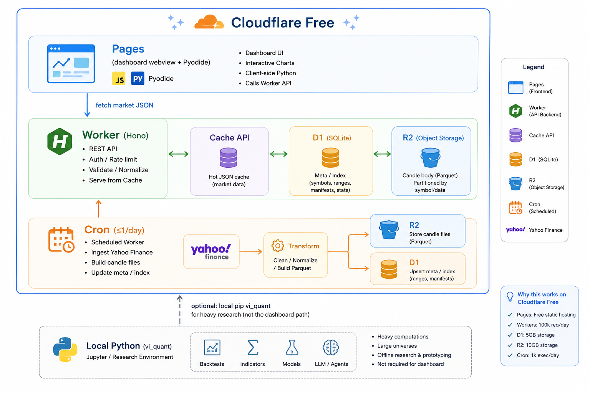

# VibeQuant (한국어)

골드만삭스의 퀀트 엔진인 GS Quant API와 호환되면서 웹뷰에서 파이썬으로 퀀트 로직을 검증하고 테스트할 수 있게 소스 코드와 사이트를 오픈했습니다.
이 프로젝트의 목적은 멀티 LLM 퀀트 위원회의 공통 실행·검증을 위한 프로젝트입니다. 라이브 데모 시세는 Cloudflare Worker 경유 **Yahoo**입니다 (TOSS 실시간은 IP 제한으로 후순위. 토스증권 IP 제한을 좀 풀어주세요). 

웹사이트는 CloudeFlare Free Tier를 이용했으며 static web page를 위한 pages, D1, R2, CDN, 서버리스 worker를 사용했습니다.
불면의 밤을 지나는 동안 열심히 개발했습니다. 아직 백테스트, 골드만삭스가 모아 놓은 막대한 백엔드의 금융 데이터는 카피하지 못했습니다. 

저의 개발 목적이 LLM을 이용해서 헤지펀드의 퀀트 위원회를 만드는 것이기 때문에 백테스트와 LLM 프롬프트가 파이썬 코드 + 금융 데이터에서 알파를 어떻게 찾아내고 Value at Risk를 평가하는 것이 저의 목표입니다.

*LLMs are spreadsheets for reasoning, not oracles of prediction. The market owes certainty to no one.*

신뢰는 예측 정확도가 아니라 **오픈소스 기여**와 **Python으로 재현·검증 가능한 퀀트 워크플로**에 둡니다.

**포지션 (규범):** GS Quant **대체가 아닙니다.** API 스타일(`gs_quant` → `vi_quant`, `Gs*` → `Vi*`)만 빌려
멀티 LLM 퀀트 위원회가 같은 스테이지에서 실행·검증하는 **기본 스테이지 / 교육용 샌드박스**입니다.
기본 기능 완성 후 → 백테스트 → 타인이 만든 퀀트를 평가하는 커뮤니티 → LLM 퀀트 기능으로 확장할 예정입니다. 
전체 매핑: [docs/API_MAPPING_KR.md](docs/API_MAPPING_KR.md).

## 역할 분리

| 관심사 | 실행 위치 | 이유 |
|---|---|---|
| 시세 (호가·캔들·자산) | **Cloudflare** (Workers + Pages + D1 + R2 + CDN) | SaaS 분산 제거, 무료 티어 우선 |
| 퀀트 계산 (스크립트·시계열·백테스트) | **브라우저 Python / Pyodide (WASM)** | Worker에서 풀 Python/`vi_quant` 불가, 서버 `exec` 금지 |

## 명시적 목표

1. **LLM 위원회 기본 스테이지:** 같은 API·같은 시세로 산출물을 재현·검증 (교육용 샌드박스 OK).
2. **대시보드 스크립트 검증:** 웹뷰 Python → Pyodide → Cloudflare 시세 → 차트/표/stdout.
3. **Cloudflare 무료 티어 우선:** 한계는 LIMITATIONS에 명시. GS/Marquee 수치 동일·전체 `vi_quant` WASM은 **비목표**.

영문: [README.md](README.md) · [ROADMAP.md](ROADMAP.md).

## 호환성 안내 (냉정)

| 주장 | 실제 |
|---|---|
| GS Quant API 호환 | **일부** 공개 API 목표. vendoring 심볼 중 stub/크래시 다수 존재 |
| GS/Marquee와 동일 수치 | **절대 보장 안 함** |
| 브라우저에서 전체 `vi_quant` | **불가.** WASM 안전 서브셋만 (`vi_browser` 등) |
| 서버가 사용자 Python 실행 | **불가.** (보안 + Workers 한도) |
| 무료 티어 = 무제한 ingest | **불가.** [한계 문서](docs/LIMITATIONS_KR.md) 참조 |

## 목표 아키텍처



상세: [docs/ARCHITECTURE_TARGET_KR.md](docs/ARCHITECTURE_TARGET_KR.md) ·
한계: [docs/LIMITATIONS_KR.md](docs/LIMITATIONS_KR.md).

**레거시:** `backend/`(Express + Vercel/Neon/Upstash)와 로컬 `vi_quant/providers/`는
전환용으로 유지. 신규 작업은 Cloudflare + Pyodide. 멀티 SaaS 경로는 확장하지 않음.

## Cloudflare 무료 티어 — 가능 / 불가

| 기능 | 무료 티어 | 비고 |
|---|---|---|
| Pages 정적 대시보드 + Pyodide UI | 가능 | 주 UI 경로 |
| Worker REST (캔들/자산) | 가능(예산 내) | 일 10만 req, 호출당 **CPU 10ms** |
| D1 메타 + R2 캔들 | 가능 | 캔들 본체는 **R2**, D1은 인덱스만 |
| CDN / Cache API | 가능 | 핫 응답 |
| Cron ingest | 제한적 | Cron도 **CPU 10ms** — 소규모·일 1회 또는 lazy |
| DO 기반 무거운 레이트리밋 | 비권장 | Cache + 입력 검증 우선 |
| Worker에서 Yahoo 대량 히스토리 | 불안정 | R2 캐시 + lazy, 파싱 최소화 |
| Worker 경유 TOSS 실시간 | 후순위 | IP 화이트리스트로 Free egress 불가; 별도 ingest 예정 |
| WASM에서 QuantLib / 전체 gs-quant | 불가 | 네이티브·용량·stub |
| Cloudflare에서 Streamlit/NiceGUI | 불가 | 장기 Python 서버 ≠ Pages/Workers |

## 대시보드 (브라우저 데모)

**라이브 사이트:** [https://vibequant-web.pages.dev/#workspace](https://vibequant-web.pages.dev/#workspace)  
**위원회 검증 체크리스트:** [docs/COMMITTEE_CHECKLIST_KR.md](docs/COMMITTEE_CHECKLIST_KR.md)

| 개요 | 실행기 |
|---|---|
|  |  |

```bash
cd pages
python3 -m http.server 8787
# http://127.0.0.1:8787/  — 한/영/중은 브라우저 언어로 자동 선택
```

파이썬 입력 → Pyodide 실행 → 결과창. 시세는 Worker(`provider=yahoo`); mock 폴백 시 배너 표시. 골든 샘플에 교육용 `backtest()` 포함.

### Cloudflare Pages / D1 / R2 / CDN 빌드·배포

```bash
cd /Users/dennis/vibe-investing/VibeQuant/cloudflare   # 홈(~) 아님
npm install
./scripts/setup-secrets.sh --local
./scripts/bootstrap.sh
export VIBEQUANT_API_BASE="https://vibequant-api.<SUBDOMAIN>.workers.dev"
./scripts/deploy.sh
./scripts/upload-static.sh ./static/images/foo.png images/foo.png
```

전체 절차·트러블슈팅(R2 10042, Pages 8000002, `--remote`, `wrangler.pages.toml`):  
[cloudflare/DEPLOY_KR.md](cloudflare/DEPLOY_KR.md) · [DEPLOY.md](cloudflare/DEPLOY.md)

## 빠른 시작 (로컬 라이브러리 — 현재)

```bash
pip install -e .
```

```python
import pandas as pd
from vi_quant.session import ViSession
from vi_quant.timeseries import returns, volatility, moving_average

ViSession.use()
prices = pd.Series(...)   # 현재는 직접 시리즈 공급
print(volatility(prices, 22))
```

대시보드 경로는 라이브 ([ROADMAP_KR.md](ROADMAP_KR.md)). 웹뷰 형태:

```python
# Pyodide에서 실행 — Worker에서 실행하지 않음
from vi_browser import get_candles, ma_cross_signal, backtest, show_chart

candles = await get_candles("005930", days=180)   # → Cloudflare Worker API
bt = backtest(candles, ma_cross_signal(candles, 10, 30), fee_bps=10)
show_chart(bt["equity"], title="equity")
print(bt["metrics"])
```

파생상품 가격 결정은 **미구현** (로컬/헤비; 무료 WASM 경로 아님):

```python
# PLANNED — 현재 동작하지 않음
from vi_quant.instrument import IRSwap
from vi_quant.risk import Price
IRSwap('Pay', '10y', 'USD').calc(Price())
```

## 문서

| 문서 | 설명 |
|---|---|---|
| [ROADMAP_KR.md](ROADMAP_KR.md) | 단계별 계획 (Cloudflare + Pyodide) |
| [docs/ARCHITECTURE_TARGET_KR.md](docs/ARCHITECTURE_TARGET_KR.md) | 바인딩·스키마·Cron·비용 |
| [docs/LIMITATIONS_KR.md](docs/LIMITATIONS_KR.md) | 지연·호환성·무료 티어 하드스톱 |
| [docs/API_MAPPING_KR.md](docs/API_MAPPING_KR.md) | GS → VI API 매핑 |
| [docs/PROVIDER_API_MATCHING_KR.md](docs/PROVIDER_API_MATCHING_KR.md) | 제공자 인터페이스 매핑 |
| [docs/OFFICIAL_DOCS_GUIDE_KR.md](docs/OFFICIAL_DOCS_GUIDE_KR.md) | GS 공식 문서 대응 매뉴얼 |
| [docs/TECH_REVIEW_DASHBOARD_KR.md](docs/TECH_REVIEW_DASHBOARD_KR.md) | 기술 검토: 대시보드 + Node.js |
| [docs/TECH_REVIEW_CLOUDFLARE_KR.md](docs/TECH_REVIEW_CLOUDFLARE_KR.md) | 기술 검토: Cloudflare 이전 |
| [SECURITY.md](SECURITY.md) | 신뢰 경계 (CF + WASM) |
| [README.md](README.md) | 영문 README |
| [ROADMAP.md](ROADMAP.md) | 영문 로드맵 |

## 현황

**Pre-Alpha.** 위원회 데모 스테이지 사용 가능; 교육용 백테스트는 `vi_browser`에 포함.
프로덕션 가격·연구 엔진 아님.

| 모듈 | 상태 |
|---|---|
| `vi_quant.session` / `timeseries` (로컬) | 부분 — 서브셋 테스트됨 |
| `vi_quant.providers` (Python 직접) | 구현됨 (로컬 연구 전용 — 대시보드 경로 아님) |
| `vi_browser` (지표 + `backtest`) | 구현됨 — Pages Pyodide bootstrap과 동기화 |
| `backend/` Express (Vercel 스택) | 구현됨 — **레거시**, 기능 확장 동결 |
| Cloudflare Worker + D1 + R2 | 라이브 — Yahoo 캔들; TOSS 후순위 |
| Pages + Pyodide 웹뷰 (`pages/`) | 라이브 — https://vibequant-web.pages.dev/ |
| `instrument` / `risk` / QuantLib | 미착수 — 로컬/헤비 후속 |

## 라이선스

Apache 2.0. Goldman Sachs와 제휴·보증·지원 관계 없음.
"GS Quant"는 Apache 2.0 하 API 호환 목적으로만 참조.

## 면책

본 프로젝트는 LLM에 의한 환각이 있을 수 있으며 데이터 해석의 오류로 퀀트 결과가 오류가 발생할 수 있습니다. 본 프로젝트의 모든 결과는 연구·교육 목적이며 투자 조언 아닙니다. 실제 투자 전에 사용 전 모델·데이터를 검증이 필요합니다.
