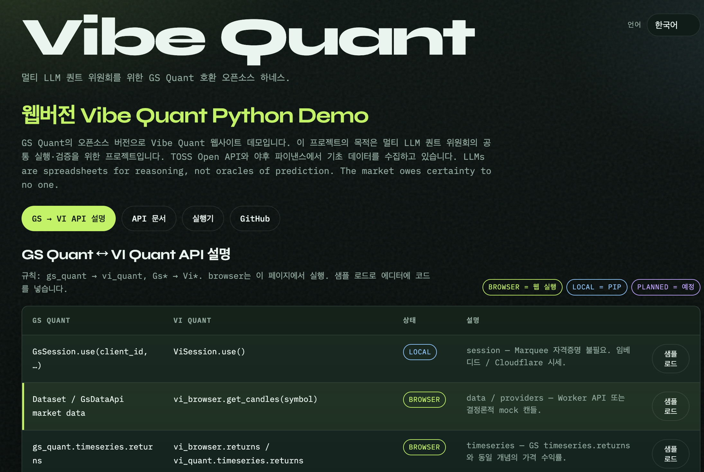
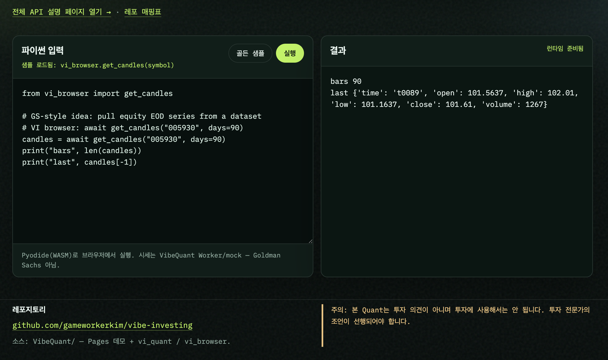

# VibeQuant (한국어)

GS Quant의 오픈소스 버전으로 Vibe Quant 웹사이트 데모입니다. 이 프로젝트의 목적은 멀티 LLM 퀀트 위원회의 공통 실행·검증을 위한 프로젝트입니다. TOSS Open API와 야후 파이낸스에서 기초 데이터를 수집하고 있습니다. LLMs are spreadsheets for reasoning, not oracles of prediction. The market owes certainty to no one.

신뢰는 예측 정확도가 아니라 **오픈소스 기여**와 **Python으로 재현·검증 가능한 퀀트 워크플로**에 둡니다. ([GS Quant](https://github.com/goldmansachs/gs-quant) API 대응: `gs_quant` → `vi_quant`, `Gs*` → `Vi*`.)

역할 분리 (규범):

| 관심사 | 실행 위치 | 이유 |
|---|---|---|
| 시세 (호가·캔들·자산) | **Cloudflare** (Workers + Pages + D1 + R2 + CDN) | SaaS 분산 제거, 무료 티어 우선 |
| 퀀트 계산 (스크립트·시계열·백테스트) | **브라우저 Python / Pyodide (WASM)** | Worker에서 풀 Python/`vi_quant` 불가, 서버 `exec` 금지 |

> **네이밍:** 모든 `Gs*` → `Vi*` (Vibe Investing).
> `gs_quant` → `vi_quant`, `GsSession` → `ViSession` 등.
> 전체 매핑: [docs/API_MAPPING_KR.md](docs/API_MAPPING_KR.md).

## 명시적 목표

1. **GS Quant 대체 (API 레벨):** 모듈/시그니처 호환(`Gs`→`Vi`), Marquee 대신 오픈 데이터·엔진.
   골드만삭스 모델과 **수치 동일은 약속하지 않음**.
2. **대시보드 스크립트 검증:** 웹뷰에 Python 퀀트 스크립트 입력 → 브라우저(Pyodide)가
   Cloudflare 시세로 실행 → 차트/표/stdout으로 검증.
3. **Cloudflare 무료 티어 우선:** Vercel / Neon / Upstash 없이 데이터+UI 배포.
   무료·WASM에 안 맞는 기능은 **한계로 명시**하고 암묵적으로 약속하지 않음.

영문: [README.md](README.md) · [ROADMAP.md](ROADMAP.md).

## 호환성 안내 (냉정)

| 주장 | 실제 |
|---|---|
| GS Quant API 호환 | **일부** 공개 API 목표. vendoring 심볼 중 stub/크래시 다수 존재 |
| GS/Marquee와 동일 수치 | **절대 보장 안 함** |
| 브라우저에서 전체 `vi_quant` | **불가.** WASM 안전 서브셋만 (`vi_browser` 등) |
| 서버가 사용자 Python 실행 | **불가.** (보안 + Workers 한도) |
| 무료 티어 = 무제한 ingest | **불가.** [한계 문서](docs/LIMITATIONS_KR.md) 참조 |

## 목표 아키텍처

```
┌─────────────────────────── Cloudflare Free ───────────────────────────┐
│  Pages (대시보드 웹뷰 + Pyodide)                                        │
│       │ 시세 JSON fetch                                                │
│       ▼                                                                │
│  Worker (Hono) ── Cache API ── D1 (메타/인덱스) ── R2 (캔들 본체)        │
│       │                                                                │
│  Cron (하루 ≤1회) ── 소규모 watchlist Yahoo ingest → R2 + D1            │
└────────────────────────────────────────────────────────────────────────┘
        ▲
        │ 선택: 로컬 pip vi_quant (연구용; 대시보드 경로 아님)
```

상세: [docs/ARCHITECTURE_TARGET_KR.md](docs/ARCHITECTURE_TARGET_KR.md) ·
한계: [docs/LIMITATIONS_KR.md](docs/LIMITATIONS_KR.md).

**레거시:** `backend/`(Express + Vercel/Neon/Upstash)와 로컬 `vi_quant/providers/`는
전환용으로 유지. 신규 작업은 Cloudflare + Pyodide. 멀티 SaaS 경로는 확장하지 않음.

## Cloudflare 무료 티어 — 가능 / 불가

| 기능 | 무료 티어 | 비고 |
|---|---|---|
| Pages 정적 대시보드 + Pyodide UI | 가능 | 주 UI 경로 |
| Worker REST (캔들/자산) | 가능(예산 내) | 일 10만 req, 호출당 **CPU 10ms** |
| D1 메타 + R2 캔들 | 가능 | 캔들 본체는 **R2**, D1은 인덱스만 |
| CDN / Cache API | 가능 | 핫 응답 |
| Cron ingest | 제한적 | Cron도 **CPU 10ms** — 소규모·일 1회 또는 lazy |
| DO 기반 무거운 레이트리밋 | 비권장 | Cache + 입력 검증 우선 |
| Worker에서 Yahoo 대량 히스토리 | 불안정 | R2 캐시 + lazy, 파싱 최소화 |
| Cron에서 TOSS 대량 페이지네이션 | 불가(무료) | 시크릿은 서버만; free cron에 부적합 |
| WASM에서 QuantLib / 전체 gs-quant | 불가 | 네이티브·용량·stub |
| Cloudflare에서 Streamlit/NiceGUI | 불가 | 장기 Python 서버 ≠ Pages/Workers |

## 대시보드 (브라우저 데모)

**라이브 사이트:** [https://vibequant-web.pages.dev/#workspace](https://vibequant-web.pages.dev/#workspace)

| 개요 | 실행기 |
|---|---|
|  |  |

```bash
cd pages
python3 -m http.server 8787
# http://127.0.0.1:8787/  — 한/영/중은 브라우저 언어로 자동 선택
```

파이썬 입력 → Pyodide 실행 → 결과창. 시세는 현재 mock `vi_browser` (Worker API 연동 예정).

### Cloudflare Pages / D1 / R2 / CDN 빌드·배포

```bash
cd /Users/dennis/vibe-investing/VibeQuant/cloudflare   # 홈(~) 아님
npm install
./scripts/setup-secrets.sh --local
./scripts/bootstrap.sh
export VIBEQUANT_API_BASE="https://vibequant-api.<SUBDOMAIN>.workers.dev"
./scripts/deploy.sh
./scripts/upload-static.sh ./static/images/foo.png images/foo.png
```

전체 절차·트러블슈팅(R2 10042, Pages 8000002, `--remote`, `wrangler.pages.toml`):  
[cloudflare/DEPLOY_KR.md](cloudflare/DEPLOY_KR.md) · [DEPLOY.md](cloudflare/DEPLOY.md)

## 빠른 시작 (로컬 라이브러리 — 현재)

```bash
pip install -e .
```

```python
import pandas as pd
from vi_quant.session import ViSession
from vi_quant.timeseries import returns, volatility, moving_average

ViSession.use()
prices = pd.Series(...)   # 현재는 직접 시리즈 공급
print(volatility(prices, 22))
```

대시보드/Cloudflare 경로는 **진행 중** ([ROADMAP_KR.md](ROADMAP_KR.md)).
웹뷰 목표 스크립트 형태:

```python
# Pyodide에서 실행 — Worker에서 실행하지 않음
from vi_browser import get_candles, returns, volatility

df = get_candles("005930", days=365)   # → Cloudflare Worker API
print(volatility(df["close"], 22))
```

파생상품 가격 결정은 **미구현** (Phase 2+; 무료 WASM 경로 아님):

```python
# PLANNED — 현재 동작하지 않음
from vi_quant.instrument import IRSwap
from vi_quant.risk import Price
IRSwap('Pay', '10y', 'USD').calc(Price())
```

## 문서

| 문서 | 설명 |
|---|---|---|
| [ROADMAP_KR.md](ROADMAP_KR.md) | 단계별 계획 (Cloudflare + Pyodide) |
| [docs/ARCHITECTURE_TARGET_KR.md](docs/ARCHITECTURE_TARGET_KR.md) | 바인딩·스키마·Cron·비용 |
| [docs/LIMITATIONS_KR.md](docs/LIMITATIONS_KR.md) | 지연·호환성·무료 티어 하드스톱 |
| [docs/API_MAPPING_KR.md](docs/API_MAPPING_KR.md) | GS → VI API 매핑 |
| [docs/PROVIDER_API_MATCHING_KR.md](docs/PROVIDER_API_MATCHING_KR.md) | 제공자 인터페이스 매핑 |
| [docs/OFFICIAL_DOCS_GUIDE_KR.md](docs/OFFICIAL_DOCS_GUIDE_KR.md) | GS 공식 문서 대응 매뉴얼 |
| [docs/TECH_REVIEW_DASHBOARD_KR.md](docs/TECH_REVIEW_DASHBOARD_KR.md) | 기술 검토: 대시보드 + Node.js |
| [docs/TECH_REVIEW_CLOUDFLARE_KR.md](docs/TECH_REVIEW_CLOUDFLARE_KR.md) | 기술 검토: Cloudflare 이전 |
| [SECURITY.md](SECURITY.md) | 신뢰 경계 (CF + WASM) |
| [README.md](README.md) | 영문 README |
| [ROADMAP.md](ROADMAP.md) | 영문 로드맵 |

## 현황

**Pre-Alpha.** 로컬 timeseries·providers는 존재. 활성 빌드 목표는 Cloudflare 데이터면과
Pyodide 대시보드. 프로덕션 가격 엔진 아님.

| 모듈 | 상태 |
|---|---|
| `vi_quant.session` / `timeseries` (로컬) | 부분 — 서브셋 테스트됨 |
| `vi_quant.providers` (Python 직접) | 구현됨 (로컬 연구 전용 — 대시보드 경로 아님) |
| `vi_browser` (Pyodide SDK: 데이터 조회 + 시계열 서브셋) | 구현됨 — Pages 웹뷰 통합 준비 완료 |
| `backend/` Express (Vercel 스택) | 구현됨 — **레거시**, 기능 확장 동결 |
| Cloudflare Worker + D1 + R2 | 예정 — Phase 1 |
| Pages + Pyodide 웹뷰 (`pages/`) | 스캐폴딩 — 로컬 서빙 가능, CF 배포 예정 |
| 얇은 `vi_browser` WASM SDK | 브라우저 stub (mock 캔들) — Worker 연동 예정 |
| `instrument` / `risk` / QuantLib | 미착수 — Phase 2+ (로컬/헤비; 무료 WASM 아님) |

## 라이선스

Apache 2.0. Goldman Sachs와 제휴·보증·지원 관계 없음.
"GS Quant"는 Apache 2.0 하 API 호환 목적으로만 참조.

## 면책

연구·교육 목적. 투자 조언 아님. 실자금 사용 전 모델·데이터를 검증할 것.
