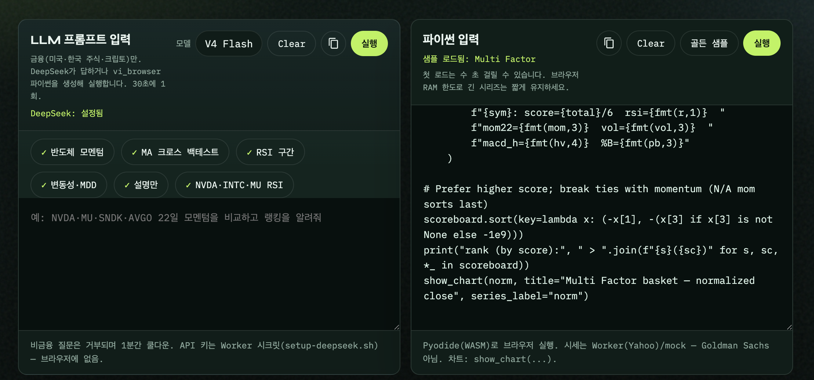
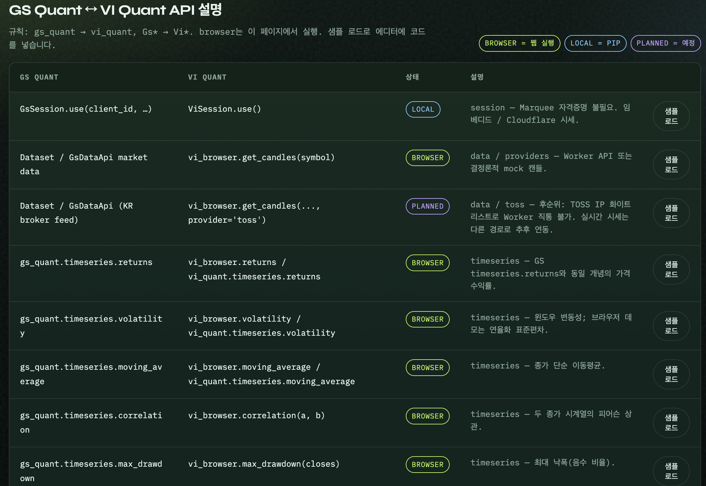

# Vibe Quant — User Manual (English)

Vibe Quant is an **educational sandbox** for learning hedge-fund style quant workflows. It is **not investment advice.**

The core idea mirrors GS Quant–style APIs plus a separate market-data path so you can reproduce classic quant steps. If you are comfortable with Python, use `vi_browser` / `vi_quant` directly. With the **LLM Quant Prompt**, you can describe a task in natural language, generate runnable Python, and **see results immediately**.

One thing to remember:

*LLMs are spreadsheets for reasoning, not oracles of prediction.*

| Language | Manual |
|---|---|
| English | This file |
| 한국어 | [USER_MANUAL_KR.md](USER_MANUAL_KR.md) |
| 中文 | [USER_MANUAL_ZH.md](USER_MANUAL_ZH.md) |

**Live demo:** [https://vibequant-web.pages.dev/#workspace](https://vibequant-web.pages.dev/#workspace)

---

## 1. Workspace — LLM + Python

The runner (`#workspace`) splits **LLM prompt** (left) and **Python input** (right). Below: **Result / Error log / Chart**.



| Area | Role |
|---|---|
| **LLM prompt input** (left) | Natural-language quant tasks. Toolbar: **Model → Clear → Copy → Run** |
| **Python input** (right) | Edit/run `vi_browser` code. Toolbar: **Copy → Clear → Golden sample → Run** |
| **Result** | LLM prose + Pyodide stdout |
| **Error log** | Non-finance rejects, cooldown, Python exceptions |
| **Chart** | Output of `show_chart(...)` (empty if never called) |

Language: header selector `en` / `ko` / `zh`.

### What LLM Run actually does

1. Call DeepSeek (finance gate)  
2. If Python is returned → **auto-fill Python input**  
3. **Run immediately in Pyodide** → prints → **Result**, `show_chart` → **Chart**, errors → **Error log**

After you edit the script, use the Python pane **Run** (no need to call the LLM again).

---

## 2. Examples · API samples — GS Quant ↔ VI Quant

Use the **Examples** chips and the **GS Quant ↔ VI Quant API** table to load browser-ready snippets.



- Naming: `gs_quant` → `vi_quant`, `Gs*` → `Vi*`  
- **BROWSER** (green): runs on this page (Pyodide)  
- **LOCAL** (blue): `pip` library  
- **PLANNED** (purple): roadmap (e.g. TOSS live)  
- **Load sample** → fills the Python editor → **Run**

### Examples chips

1. Pick Momentum / RSI / MA / multifactor, …  
2. Review code in **Python input** → **Run**  
3. Check **Result**, **Chart**, or **Error log**

| Control | Action |
|---|---|
| **Golden sample** | Multifactor committee demo |
| **Clear** | Clear LLM or Python editor |
| **Copy** | Copy prompt or code |
| API **Load sample** | Short API snippet |

Tip: keep `days` ≤ 180; prefer desktop Chrome/Firefox.

---

## 3. Building a quant with the LLM

DeepSeek turns finance-only prompts into explanations and/or runnable `vi_browser` Python.  
Keys stay on the Worker — [SECRETS_SETUP.md](SECRETS_SETUP.md) · [LLM_QUANT_PROMPT.md](LLM_QUANT_PROMPT.md).

### Steps

1. **Model**: `V4 Flash` (default) / `V4 Pro`  
2. Click a golden chip or type a prompt  
3. **Run** (1 request / 30s)  
4. Read LLM text + `=== Pyodide run ===` in **Result**  
5. Charts appear only if the script calls `show_chart`

### Quant basics (as used here)

| Concept | Meaning | API |
|---|---|---|
| Momentum N | \(P_t/P_{t-N}-1\) | `momentum(closes, window=N)` |
| Moving average | Mean of last N closes | `moving_average(closes, N)` |
| MA cross | Long (1) when fast > slow | `ma_cross_signal(candles, fast, slow)` |
| RSI(14) | ≥70 overbought / ≤30 oversold | `rsi(closes, 14)` |
| Volatility | Return σ × √252 | `volatility(closes, 22)` |
| MDD | Worst peak-to-trough (negative fraction) | `max_drawdown(closes)` |
| Backtest | Educational equity + metrics | `backtest(candles, signal, fee_bps=…)` |

```python
candles = await get_candles("NVDA", days=180, provider="yahoo")
closes = [c["close"] for c in candles]   # no pandas / iloc
```

Korean Yahoo tickers usually need **`.KS`** (e.g. `005930.KS`).

### Scenarios

#### A. Cross-sectional momentum

```text
Compare 22-day momentum for NVDA, MU, SNDK, AVGO.
Rank only computable names; exclude N/A.
Build vi_browser Python and chart series with show_chart.
```

#### B. MA-cross educational backtest

```text
Educational MA(10/30) cross backtest on 005930.KS.
fee_bps=10; print metrics; show_chart equity.
```

```python
signals = ma_cross_signal(candles, fast=10, slow=30)
result = backtest(candles, signals, fee_bps=10)
print(result["metrics"])
show_chart(result["equity"], title="Equity", series_label="equity")
```

#### C. RSI zones

```text
Compare RSI(14) for AAPL and TSLA; label overbought/oversold/mid.
Chart RSI with show_chart if possible.
```

#### D. Vol + MDD (crypto)

```text
Compare annualized volatility(22) and max_drawdown for BTC-USD and ETH-USD
using vi_browser; include the numbers.
```

#### E. Explain only

```text
Briefly explain Momentum = close/close[22]-1. Answer mode only — no code.
```

#### F. Non-finance → reject

Non-finance prompts are rejected in **Error log** with a short cooldown.

Schema: [LLM_OUTPUT_SCHEMA.md](LLM_OUTPUT_SCHEMA.md).

---

## 4. Building a quant in Python

Write or refine code in **Python input**, then **Run**. Compute in-browser (Pyodide); candles via Worker (`provider="yahoo"`).

### Minimal template

```python
from vi_browser import get_candles, momentum, show_chart

def fmt(x, n=2):
    return "N/A" if x is None else f"{x:.{n}f}"

def last_num(xs):
    for x in reversed(xs):
        if x is not None:
            return x
    return None

TICKERS = ["NVDA", "MU", "AVGO"]
WINDOW = 22
rows, series = [], {}

for sym in TICKERS:
    candles = await get_candles(sym, days=180, provider="yahoo")
    closes = [c["close"] for c in candles]
    m = momentum(closes, WINDOW)
    last = last_num(m)
    series[sym] = m
    rows.append((sym, last))
    print(f"{sym}: mom{WINDOW}={fmt(None if last is None else last * 100)}%")

ranked = sorted([(s, v) for s, v in rows if v is not None], key=lambda x: -x[1])
print("rank:", ", ".join(f"{s}={fmt(v * 100)}%" for s, v in ranked))
show_chart(series, title="22d momentum", series_label="mom")
```

Full map: [API_MAPPING.md](API_MAPPING.md).

---

## 5. Limits & disclaimer

- Free-tier Cloudflare + browser RAM — not a Marquee / GS Quant replacement.  
- Numbers are for **education / reproducibility**, not trading signals.  
- LLM needs DeepSeek on the Worker (`deepseek.configured: true`).  
- See [LIMITATIONS.md](LIMITATIONS.md) and the site footer.

*LLMs are spreadsheets for reasoning, not oracles of prediction. The market owes certainty to no one.*
